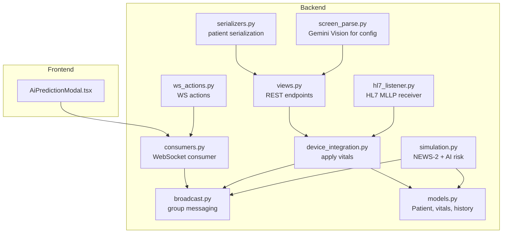
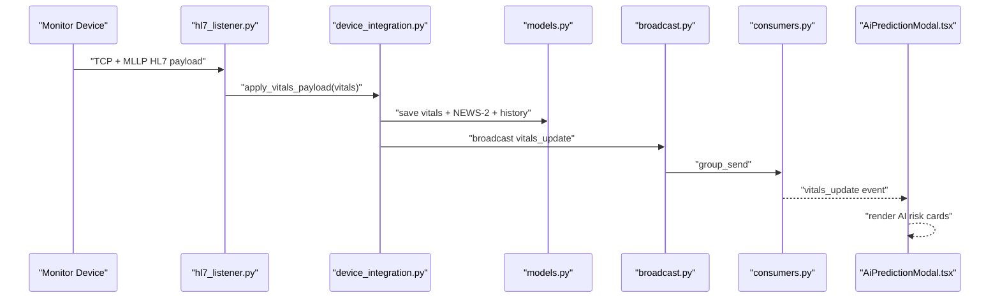
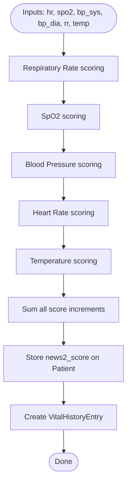
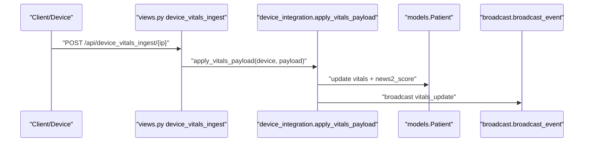
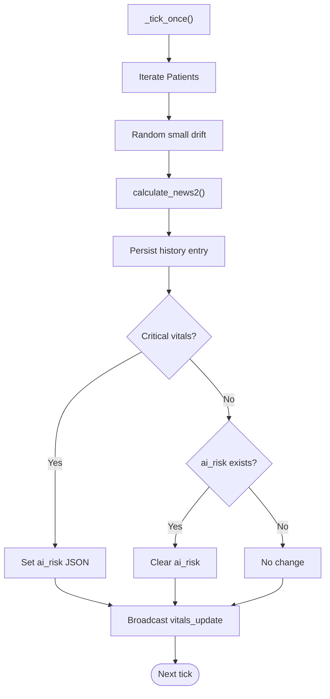
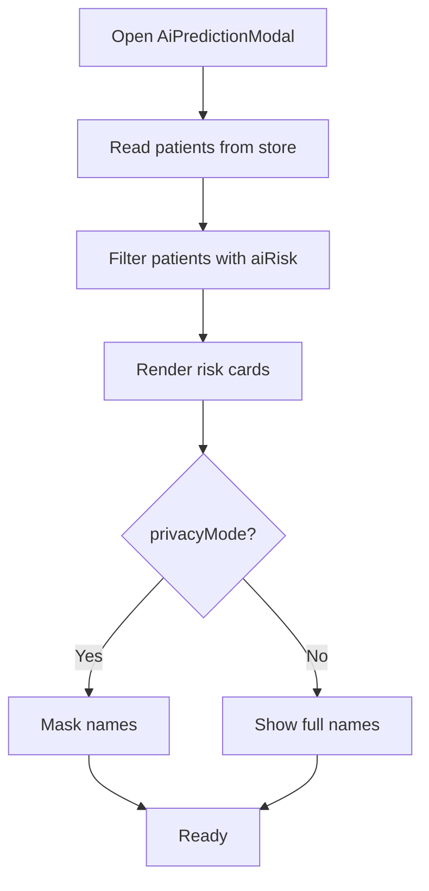
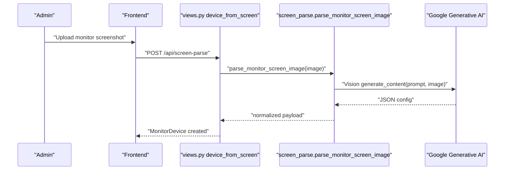
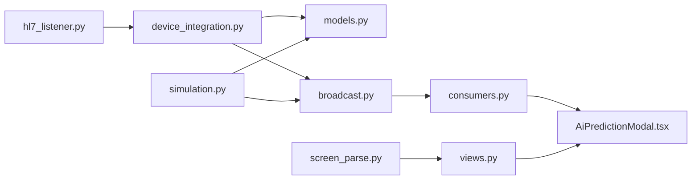

# AI Risk Prediction System

<cite>
**Referenced Files in This Document**
- [README.md](file://README.md)
- [models.py](file://backend/monitoring/models.py)
- [simulation.py](file://backend/monitoring/simulation.py)
- [device_integration.py](file://backend/monitoring/device_integration.py)
- [broadcast.py](file://backend/monitoring/broadcast.py)
- [consumers.py](file://backend/monitoring/consumers.py)
- [views.py](file://backend/monitoring/views.py)
- [serializers.py](file://backend/monitoring/serializers.py)
- [ws_actions.py](file://backend/monitoring/ws_actions.py)
- [hl7_listener.py](file://backend/monitoring/hl7_listener.py)
- [screen_parse.py](file://backend/monitoring/screen_parse.py)
- [AiPredictionModal.tsx](file://frontend/src/components/AiPredictionModal.tsx)
- [vite.config.ts](file://frontend/vite.config.ts)
- [deploy_remote.py](file://deploy/deploy_remote.py)
</cite>

## Table of Contents
1. [Introduction](#introduction)
2. [Project Structure](#project-structure)
3. [Core Components](#core-components)
4. [Architecture Overview](#architecture-overview)
5. [Detailed Component Analysis](#detailed-component-analysis)
6. [Dependency Analysis](#dependency-analysis)
7. [Performance Considerations](#performance-considerations)
8. [Troubleshooting Guide](#troubleshooting-guide)
9. [Conclusion](#conclusion)
10. [Appendices](#appendices)

## Introduction
This document describes the AI risk prediction system integrated into the NEWS-2 scoring implementation in Medicentral. It explains the National Early Warning Score 2 (NEWS-2) algorithm, how vitals are collected and processed, how risk predictions are generated and surfaced in the frontend, and how machine learning (Google Generative AI) is integrated for device configuration tasks. It also covers the real-time workflow, simulation capabilities, thresholds, and operational considerations for safe, ethical, and effective use in clinical environments.

## Project Structure
Medicentral comprises:
- Backend: Django + Django Channels for REST APIs and WebSocket streaming, plus HL7 ingestion and simulation.
- Frontend: React/Vite for the monitoring dashboard and AI prediction modal.
- Deployment: Scripts to inject API keys and restart services.

**Diagram sources**
- [AiPredictionModal.tsx:1-130](file://frontend/src/components/AiPredictionModal.tsx#L1-L130)
- [views.py:1-419](file://backend/monitoring/views.py#L1-L419)
- [consumers.py:1-46](file://backend/monitoring/consumers.py#L1-L46)
- [hl7_listener.py:1-708](file://backend/monitoring/hl7_listener.py#L1-L708)
- [device_integration.py:1-232](file://backend/monitoring/device_integration.py#L1-L232)
- [simulation.py:1-290](file://backend/monitoring/simulation.py#L1-L290)
- [broadcast.py:1-20](file://backend/monitoring/broadcast.py#L1-L20)
- [models.py:1-224](file://backend/monitoring/models.py#L1-L224)
- [serializers.py:1-291](file://backend/monitoring/serializers.py#L1-L291)
- [ws_actions.py:1-229](file://backend/monitoring/ws_actions.py#L1-L229)
- [screen_parse.py:1-160](file://backend/monitoring/screen_parse.py#L1-L160)

**Section sources**
- [README.md:1-110](file://README.md#L1-L110)

## Core Components
- NEWS-2 scoring engine: Calculates the score from vital signs and updates the patient record and history.
- Real-time vitals ingestion: Accepts REST and HL7 payloads, applies vitals, recalculates NEWS-2, and broadcasts updates.
- Simulation engine: Generates synthetic vitals, periodically computes NEWS-2, and injects AI risk signals for demonstration.
- AI prediction modal: Displays at-risk patients with probability, estimated time, reasons, and recommendations.
- Machine learning integration: Uses Google Generative AI Vision to extract HL7 configuration from monitor screenshots.

**Section sources**
- [simulation.py:32-86](file://backend/monitoring/simulation.py#L32-L86)
- [device_integration.py:129-224](file://backend/monitoring/device_integration.py#L129-L224)
- [AiPredictionModal.tsx:1-130](file://frontend/src/components/AiPredictionModal.tsx#L1-L130)
- [screen_parse.py:58-114](file://backend/monitoring/screen_parse.py#L58-L114)

## Architecture Overview
The system streams vitals via REST/HL7 into the backend, recalculates NEWS-2, optionally triggers AI risk annotations, and publishes updates to the frontend over WebSocket groups per clinic.

**Diagram sources**
- [hl7_listener.py:533-586](file://backend/monitoring/hl7_listener.py#L533-L586)
- [device_integration.py:129-224](file://backend/monitoring/device_integration.py#L129-L224)
- [broadcast.py:10-20](file://backend/monitoring/broadcast.py#L10-L20)
- [consumers.py:35-36](file://backend/monitoring/consumers.py#L35-L36)
- [AiPredictionModal.tsx:10-130](file://frontend/src/components/AiPredictionModal.tsx#L10-L130)

## Detailed Component Analysis

### NEWS-2 Scoring Engine
- Inputs: heart rate, SpO2, systolic/diastolic BP, respiratory rate, temperature.
- Logic: Piecewise scoring rules applied per vital range.
- Outputs: integer score stored on the patient and history entries maintained.

**Diagram sources**
- [simulation.py:32-86](file://backend/monitoring/simulation.py#L32-L86)
- [device_integration.py:192-201](file://backend/monitoring/device_integration.py#L192-L201)
- [models.py:141-182](file://backend/monitoring/models.py#L141-L182)

**Section sources**
- [simulation.py:32-86](file://backend/monitoring/simulation.py#L32-L86)
- [device_integration.py:192-201](file://backend/monitoring/device_integration.py#L192-L201)
- [models.py:141-182](file://backend/monitoring/models.py#L141-L182)

### Real-Time Vitals Ingestion (REST and HL7)
- REST endpoint accepts vitals and applies them to the associated patient, recalculating NEWS-2 and broadcasting updates.
- HL7 listener parses MLLP frames, extracts vitals, marks device online, and applies vitals similarly.

**Diagram sources**
- [views.py:371-390](file://backend/monitoring/views.py#L371-L390)
- [device_integration.py:129-224](file://backend/monitoring/device_integration.py#L129-L224)
- [broadcast.py:10-20](file://backend/monitoring/broadcast.py#L10-L20)

**Section sources**
- [views.py:371-390](file://backend/monitoring/views.py#L371-L390)
- [device_integration.py:129-224](file://backend/monitoring/device_integration.py#L129-L224)

### AI Risk Signal Generation and Simulation
- The simulation periodically updates vitals, computes NEWS-2, and randomly assigns an AI risk annotation when critical thresholds are met.
- Annotations include probability, estimated time to critical event, reasons, and recommendations.

**Diagram sources**
- [simulation.py:99-270](file://backend/monitoring/simulation.py#L99-L270)

**Section sources**
- [simulation.py:99-270](file://backend/monitoring/simulation.py#L99-L270)
- [models.py:177-177](file://backend/monitoring/models.py#L177-L177)

### AI Prediction Modal (React Frontend)
- Filters patients with ai_risk present and renders risk cards with probability, estimated time, reasons, and recommendations.
- Supports privacy masking and modal dismissal.

**Diagram sources**
- [AiPredictionModal.tsx:10-130](file://frontend/src/components/AiPredictionModal.tsx#L10-L130)

**Section sources**
- [AiPredictionModal.tsx:10-130](file://frontend/src/components/AiPredictionModal.tsx#L10-L130)

### Machine Learning Integration: Google Generative AI Vision
- Used to extract HL7 configuration from monitor screenshots for device provisioning.
- Requires GEMINI_API_KEY configured in backend environment and exposed to the frontend build.

**Diagram sources**
- [screen_parse.py:58-114](file://backend/monitoring/screen_parse.py#L58-L114)
- [views.py:259-306](file://backend/monitoring/views.py#L259-L306)
- [vite.config.ts:10-12](file://frontend/vite.config.ts#L10-L12)
- [deploy_remote.py:136-181](file://deploy/deploy_remote.py#L136-L181)

**Section sources**
- [screen_parse.py:58-114](file://backend/monitoring/screen_parse.py#L58-L114)
- [views.py:259-306](file://backend/monitoring/views.py#L259-L306)
- [vite.config.ts:10-12](file://frontend/vite.config.ts#L10-L12)
- [deploy_remote.py:136-181](file://deploy/deploy_remote.py#L136-L181)

## Dependency Analysis
- Backend modules depend on shared models for vitals and history.
- Broadcasting uses Django Channels groups keyed by clinic to isolate data.
- The AI risk annotation is optional and independent of core vitals processing.
- Frontend depends on WebSocket events and stores patient state.

**Diagram sources**
- [device_integration.py:1-232](file://backend/monitoring/device_integration.py#L1-L232)
- [simulation.py:1-290](file://backend/monitoring/simulation.py#L1-L290)
- [hl7_listener.py:1-708](file://backend/monitoring/hl7_listener.py#L1-L708)
- [broadcast.py:1-20](file://backend/monitoring/broadcast.py#L1-L20)
- [consumers.py:1-46](file://backend/monitoring/consumers.py#L1-L46)
- [AiPredictionModal.tsx:1-130](file://frontend/src/components/AiPredictionModal.tsx#L1-L130)
- [screen_parse.py:1-160](file://backend/monitoring/screen_parse.py#L1-L160)
- [views.py:1-419](file://backend/monitoring/views.py#L1-L419)

**Section sources**
- [models.py:141-182](file://backend/monitoring/models.py#L141-L182)
- [broadcast.py:10-20](file://backend/monitoring/broadcast.py#L10-L20)
- [consumers.py:12-36](file://backend/monitoring/consumers.py#L12-L36)

## Performance Considerations
- Simulation runs at a fixed tick rate; adjust TICK_RATE_MS to balance responsiveness and CPU usage.
- History retention capped to recent entries to limit storage growth.
- HL7 parsing and ACK sending occur per connection; keepalive and TCP_NODELAY reduce latency.
- Broadcasting uses Channels groups; ensure Redis for multi-instance deployments.

[No sources needed since this section provides general guidance]

## Troubleshooting Guide
- HL7 connectivity issues: Use the connection-check endpoint to verify listener status, port acceptance, and last HL7 receipt.
- No vitals appearing: Confirm device is assigned to a bed with an admitted patient; verify REST/HL7 payloads include required vital keys.
- AI prediction modal empty: Ensure simulation is running and patients meet critical thresholds; confirm GEMINI_API_KEY is configured for screen parsing.
- WebSocket not receiving updates: Verify clinic scoping and group membership; check backend logs for errors.

**Section sources**
- [views.py:59-256](file://backend/monitoring/views.py#L59-L256)
- [device_integration.py:158-174](file://backend/monitoring/device_integration.py#L158-L174)
- [hl7_listener.py:639-688](file://backend/monitoring/hl7_listener.py#L639-L688)
- [screen_parse.py:62-66](file://backend/monitoring/screen_parse.py#L62-L66)

## Conclusion
Medicentral integrates NEWS-2 scoring with real-time vitals ingestion via REST and HL7, and augments care with simulated AI risk annotations surfaced in a dedicated frontend modal. Machine learning is used to automate device configuration from screenshots. The system emphasizes isolation by clinic, robust broadcasting, and configurable thresholds suitable for clinical workflows.

[No sources needed since this section summarizes without analyzing specific files]

## Appendices

### NEWS-2 Weightings and Risk Categories
- Respiratory rate: Score increments by severity bands.
- Oxygen saturation: Score increments by desaturation bands.
- Blood pressure: Score increments for hypotension and extreme hypertension.
- Heart rate: Score increments for bradycardia, tachycardia, and extreme rates.
- Temperature: Score increments for hypothermia and hyperthermia.
- Risk categories: Derived from cumulative score; higher scores indicate increased risk of deterioration.

**Section sources**
- [simulation.py:32-86](file://backend/monitoring/simulation.py#L32-L86)

### Real-Time Workflow Summary
- Vitals arrive via REST or HL7.
- Backend validates presence of vitals and applies them to the patient.
- NEWS-2 is recalculated and history is persisted.
- Updates are broadcast to the clinic’s WebSocket group.
- Frontend renders vitals and AI risk annotations.

**Section sources**
- [device_integration.py:129-224](file://backend/monitoring/device_integration.py#L129-L224)
- [broadcast.py:10-20](file://backend/monitoring/broadcast.py#L10-L20)
- [AiPredictionModal.tsx:10-130](file://frontend/src/components/AiPredictionModal.tsx#L10-L130)

### Simulation and Validation Tips
- Use the simulation thread to generate realistic trends and occasional critical events.
- Validate thresholds by adjusting DEFAULT_LIMITS and observing alarm and AI risk behaviors.
- Test edge cases by injecting outlier vitals and verifying broadcast and modal rendering.

**Section sources**
- [simulation.py:17-29](file://backend/monitoring/simulation.py#L17-L29)
- [simulation.py:99-270](file://backend/monitoring/simulation.py#L99-L270)

### Ethical and Regulatory Considerations
- AI predictions are simulated for demonstration; actual deployment requires rigorous validation, oversight, and adherence to applicable medical device regulations.
- Ensure transparency, explainability, and human-in-the-loop decision-making.
- Protect patient privacy and PHI in logs and diagnostics.

[No sources needed since this section provides general guidance]