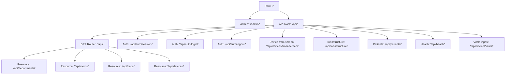
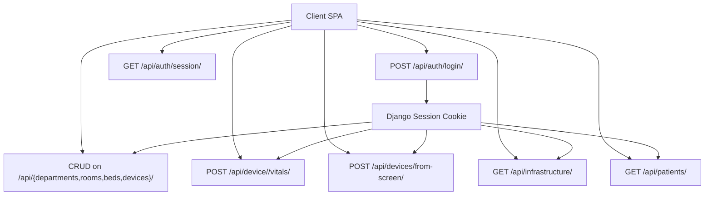
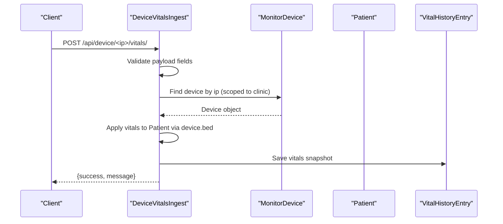
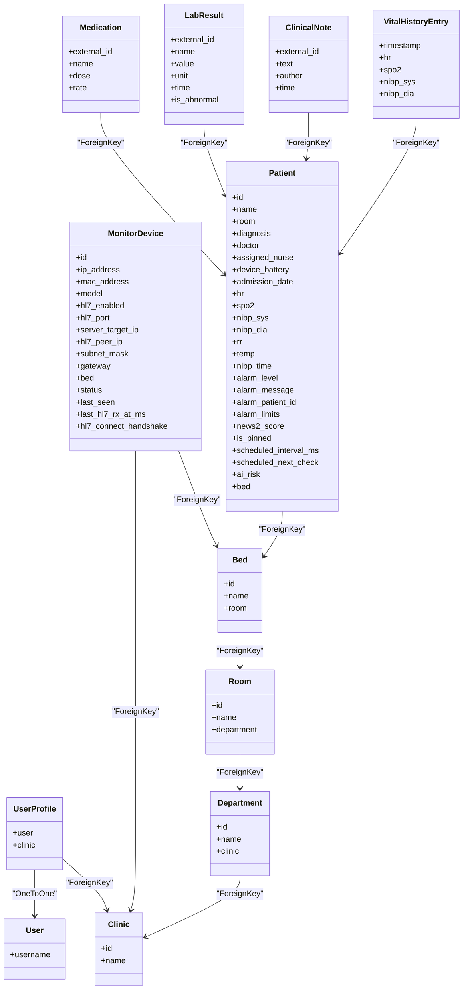

# API Endpoints & Authentication

<cite>
**Referenced Files in This Document**
- [backend/medicentral/settings.py](file://backend/medicentral/settings.py)
- [backend/medicentral/urls.py](file://backend/medicentral/urls.py)
- [backend/monitoring/urls.py](file://backend/monitoring/urls.py)
- [backend/monitoring/views.py](file://backend/monitoring/views.py)
- [backend/monitoring/auth_views.py](file://backend/monitoring/auth_views.py)
- [backend/monitoring/models.py](file://backend/monitoring/models.py)
- [backend/monitoring/serializers.py](file://backend/monitoring/serializers.py)
- [backend/monitoring/api_mixins.py](file://backend/monitoring/api_mixins.py)
- [backend/monitoring/clinic_scope.py](file://backend/monitoring/clinic_scope.py)
- [backend/monitoring/device_integration.py](file://backend/monitoring/device_integration.py)
</cite>

## Table of Contents
1. [Introduction](#introduction)
2. [Project Structure](#project-structure)
3. [Core Components](#core-components)
4. [Architecture Overview](#architecture-overview)
5. [Detailed Component Analysis](#detailed-component-analysis)
6. [Dependency Analysis](#dependency-analysis)
7. [Performance Considerations](#performance-considerations)
8. [Troubleshooting Guide](#troubleshooting-guide)
9. [Conclusion](#conclusion)
10. [Appendices](#appendices)

## Introduction
This document provides comprehensive API documentation for the Medicentral REST endpoints. It covers HTTP methods, URL patterns, request/response schemas, authentication, permissions, and HL7 device management. It also documents the multitenant clinic scoping, session-based authentication, and operational endpoints for infrastructure diagnostics and vitals ingestion.

## Project Structure
The API surface is organized under a single API root with DRF routers and explicit endpoints:
- Root: `/api/`
- Router-driven resources: departments, rooms, beds, devices
- Session-based authentication endpoints: session, login, logout
- Operational endpoints: infrastructure, patients, health, device vitals ingest, device-from-screen

**Diagram sources**
- [backend/medicentral/urls.py:6-10](file://backend/medicentral/urls.py#L6-L10)
- [backend/monitoring/urls.py:6-23](file://backend/monitoring/urls.py#L6-L23)

**Section sources**
- [backend/medicentral/urls.py:6-10](file://backend/medicentral/urls.py#L6-L10)
- [backend/monitoring/urls.py:6-23](file://backend/monitoring/urls.py#L6-L23)

## Core Components
- Authentication: Session-based with CSRF cookie and Django session middleware. CSRF token retrieval is exposed via the session endpoint.
- Authorization: Clinic-scoped access via a mixin that filters resources per authenticated user’s clinic association. Superusers bypass scoping.
- Multitenancy: Entities are scoped to a clinic; creation defaults to the authenticated user’s clinic unless the user is a superuser.
- HL7 integration: Dedicated listener and diagnostic utilities; REST vitals ingestion endpoint for direct device payloads.

Key implementation references:
- Session and CSRF: [backend/monitoring/auth_views.py:14-26](file://backend/monitoring/auth_views.py#L14-L26)
- Router endpoints: [backend/monitoring/urls.py:6-10](file://backend/monitoring/urls.py#L6-L10)
- Clinic-scoped filtering: [backend/monitoring/api_mixins.py:23-40](file://backend/monitoring/api_mixins.py#L23-L40)
- Device vitals ingestion: [backend/monitoring/views.py:397-415](file://backend/monitoring/views.py#L397-L415)

**Section sources**
- [backend/monitoring/auth_views.py:14-26](file://backend/monitoring/auth_views.py#L14-L26)
- [backend/monitoring/urls.py:6-10](file://backend/monitoring/urls.py#L6-L10)
- [backend/monitoring/api_mixins.py:23-40](file://backend/monitoring/api_mixins.py#L23-L40)
- [backend/monitoring/views.py:397-415](file://backend/monitoring/views.py#L397-L415)

## Architecture Overview
High-level API flow:
- Clients authenticate via session cookies and CSRF token.
- Subsequent requests are authenticated and filtered by clinic.
- HL7 listener and REST endpoints update patient vitals and broadcast updates.

**Diagram sources**
- [backend/monitoring/auth_views.py:29-48](file://backend/monitoring/auth_views.py#L29-L48)
- [backend/monitoring/urls.py:12-23](file://backend/monitoring/urls.py#L12-L23)

## Detailed Component Analysis

### Authentication Endpoints
- GET /api/auth/session/
  - Purpose: Returns authentication state, CSRF token, and clinic context for the logged-in user.
  - Permissions: AllowAny.
  - Response fields: authenticated, username, csrfToken, clinic (id, name), isSuperuser.
  - Typical response: [backend/monitoring/auth_views.py:18-26](file://backend/monitoring/auth_views.py#L18-L26)

- POST /api/auth/login/
  - Purpose: Session-based login using credentials.
  - Permissions: AllowAny.
  - Request body: username, password.
  - Response: success, username, clinic (id, name) if available.
  - Typical response: [backend/monitoring/auth_views.py:42-48](file://backend/monitoring/auth_views.py#L42-L48)

- POST /api/auth/logout/
  - Purpose: Logs out current session.
  - Permissions: IsAuthenticated.
  - Response: success.
  - Typical response: [backend/monitoring/auth_views.py:55](file://backend/monitoring/auth_views.py#L55)

Security and headers:
- CSRF protection is enforced by Django CSRF middleware and requires a valid CSRF token for mutating actions.
- Session cookies are secure by default in production settings.

**Section sources**
- [backend/monitoring/auth_views.py:14-26](file://backend/monitoring/auth_views.py#L14-L26)
- [backend/monitoring/auth_views.py:29-48](file://backend/monitoring/auth_views.py#L29-L48)
- [backend/monitoring/auth_views.py:51-56](file://backend/monitoring/auth_views.py#L51-L56)
- [backend/medicentral/settings.py:146-166](file://backend/medicentral/settings.py#L146-L166)

### Resource Endpoints (CRUD)
All resource endpoints are exposed via DRF routers and use ModelViewSet with clinic-scoped filtering:
- Base URL: /api/{departments,rooms,beds,devices}/
- Methods: List, Retrieve, Create, Update, Destroy
- Filtering: Automatically scoped to the authenticated user’s clinic (superusers see all).

Endpoints:
- Departments: /api/departments/
- Rooms: /api/rooms/
- Beds: /api/beds/
- Devices: /api/devices/

Permissions and scoping:
- All endpoints require IsAuthenticated.
- Clinic-scoped filtering and serializer context injection handled by the mixin.

Representative references:
- Router registration: [backend/monitoring/urls.py:6-10](file://backend/monitoring/urls.py#L6-L10)
- ViewSet classes: [backend/monitoring/views.py:32-44](file://backend/monitoring/views.py#L32-L44)
- Mixin logic: [backend/monitoring/api_mixins.py:11-67](file://backend/monitoring/api_mixins.py#L11-L67)

**Section sources**
- [backend/monitoring/urls.py:6-10](file://backend/monitoring/urls.py#L6-L10)
- [backend/monitoring/views.py:32-44](file://backend/monitoring/views.py#L32-L44)
- [backend/monitoring/api_mixins.py:11-67](file://backend/monitoring/api_mixins.py#L11-L67)

### Device Management Endpoints
- POST /api/devices/from-screen/
  - Purpose: Register a new monitor device by parsing an uploaded image captured from the monitor screen.
  - Permissions: IsAuthenticated.
  - Request: multipart/form-data with image and bedId (bed_id accepted).
  - Validation: bedId required; image required; file size limit applies.
  - Response: Created device object serialized via MonitorDeviceSerializer.
  - Access control: Non-superusers must belong to the same clinic as the target bed’s department.
  - Typical response: [backend/monitoring/views.py:329-332](file://backend/monitoring/views.py#L329-L332)

- POST /api/devices/{id}/mark-online/
  - Purpose: Force a device online without requiring HL7/REST data.
  - Permissions: IsAuthenticated.
  - Response: Serialized device object.
  - Implementation: [backend/monitoring/views.py:51-57](file://backend/monitoring/views.py#L51-L57)

- GET /api/devices/{id}/connection-check/
  - Purpose: Diagnostic status for HL7 connectivity and data reception.
  - Permissions: IsAuthenticated.
  - Response includes: server listen status, last seen timestamps, receiving status, warnings, hints, and summary.
  - Implementation: [backend/monitoring/views.py:59-282](file://backend/monitoring/views.py#L59-L282)

Operational diagnostics:
- GET /api/infrastructure/
  - Purpose: Returns scoped lists of departments, rooms, beds, devices, plus HL7 diagnostics and Gemini configuration status.
  - Permissions: IsAuthenticated.
  - Superuser sees all; regular users see only their clinic’s data.
  - Implementation: [backend/monitoring/views.py:335-381](file://backend/monitoring/views.py#L335-L381)

HL7 device resolution and vitals application:
- Device resolution by peer IP (including NAT fallback): [backend/monitoring/device_integration.py:31-78](file://backend/monitoring/device_integration.py#L31-L78)
- Applying vitals payload to patient and broadcasting updates: [backend/monitoring/device_integration.py:129-224](file://backend/monitoring/device_integration.py#L129-L224)

**Section sources**
- [backend/monitoring/views.py:285-332](file://backend/monitoring/views.py#L285-L332)
- [backend/monitoring/views.py:51-57](file://backend/monitoring/views.py#L51-L57)
- [backend/monitoring/views.py:59-282](file://backend/monitoring/views.py#L59-L282)
- [backend/monitoring/views.py:335-381](file://backend/monitoring/views.py#L335-L381)
- [backend/monitoring/device_integration.py:31-78](file://backend/monitoring/device_integration.py#L31-L78)
- [backend/monitoring/device_integration.py:129-224](file://backend/monitoring/device_integration.py#L129-L224)

### Vitals Ingestion Endpoint
- POST /api/device/{ip}/vitals/
  - Purpose: Accepts a vitals payload from a device identified by IP address.
  - Permissions: IsAuthenticated.
  - Path parameter: ip (device IP).
  - Request body: JSON with optional vitals fields (hr, spo2, nibpSys, nibpDia, rr, temp).
  - Behavior: Validates payload; finds device in the authenticated user’s clinic; applies vitals to the patient assigned to the device’s bed; broadcasts updates.
  - Response: success indicator and message.
  - Implementation: [backend/monitoring/views.py:397-415](file://backend/monitoring/views.py#L397-L415)

**Diagram sources**
- [backend/monitoring/views.py:397-415](file://backend/monitoring/views.py#L397-L415)
- [backend/monitoring/device_integration.py:129-224](file://backend/monitoring/device_integration.py#L129-L224)

**Section sources**
- [backend/monitoring/views.py:397-415](file://backend/monitoring/views.py#L397-L415)
- [backend/monitoring/device_integration.py:129-224](file://backend/monitoring/device_integration.py#L129-L224)

### Operational and Support Endpoints
- GET /api/health/
  - Purpose: Health check against database.
  - Permissions: AllowAny.
  - Response: service status and database connectivity.
  - Implementation: [backend/monitoring/views.py:434-445](file://backend/monitoring/views.py#L434-L445)

- GET /api/patients/
  - Purpose: Lists all patients scoped to the authenticated user’s clinic.
  - Permissions: IsAuthenticated.
  - Response: Array of patient records with vitals, alarms, history, and associated data.
  - Implementation: [backend/monitoring/views.py:384-395](file://backend/monitoring/views.py#L384-L395)

**Section sources**
- [backend/monitoring/views.py:434-445](file://backend/monitoring/views.py#L434-L445)
- [backend/monitoring/views.py:384-395](file://backend/monitoring/views.py#L384-L395)

## Dependency Analysis
- Authentication stack: SessionAuthentication, CSRF middleware, and session endpoints.
- Authorization stack: IsAuthenticated and ClinicScopedViewSetMixin.
- Data models: Department, Room, Bed, MonitorDevice, Patient, Medication, LabResult, ClinicalNote, VitalHistoryEntry.
- Serializers: DepartmentSerializer, RoomSerializer, BedSerializer, MonitorDeviceSerializer, DeviceVitalsIngestSerializer, and helpers for patient serialization.

**Diagram sources**
- [backend/monitoring/models.py:5-224](file://backend/monitoring/models.py#L5-L224)

**Section sources**
- [backend/monitoring/models.py:5-224](file://backend/monitoring/models.py#L5-L224)

## Performance Considerations
- Rate limiting: Not implemented in the current codebase. Consider adding rate limiting at the proxy or application level for sensitive endpoints (login, vitals ingest).
- Pagination: Router-based endpoints use default pagination; large datasets may benefit from cursor or offset pagination.
- Database queries: Views and serializers prefetch related objects where possible (e.g., patient history and related items). Ensure appropriate indexing on frequently filtered fields (e.g., bed, clinic).
- HL7 throughput: The HL7 listener runs in-process; ensure adequate CPU and network resources for high-volume environments.

[No sources needed since this section provides general guidance]

## Troubleshooting Guide
Common issues and resolutions:
- Authentication failures:
  - Ensure CSRF token is included for mutating requests.
  - Verify session cookie is set and sent with subsequent requests.
  - Reference: [backend/monitoring/auth_views.py:14-26](file://backend/monitoring/auth_views.py#L14-L26)

- 403 Forbidden when creating/updating resources:
  - Confirm the authenticated user has a clinic profile; superusers bypass clinic scoping.
  - Reference: [backend/monitoring/api_mixins.py:14-21](file://backend/monitoring/api_mixins.py#L14-L21)

- Device not receiving vitals:
  - Use the connection-check endpoint to inspect HL7 listener status, port acceptance, and last-seen timestamps.
  - Reference: [backend/monitoring/views.py:59-282](file://backend/monitoring/views.py#L59-L282)

- Device registration from screen:
  - Ensure image upload and bedId are provided; verify file size limits and clinic association.
  - Reference: [backend/monitoring/views.py:285-332](file://backend/monitoring/views.py#L285-L332)

- Health check failures:
  - Database connectivity errors indicate misconfiguration or downtime.
  - Reference: [backend/monitoring/views.py:434-445](file://backend/monitoring/views.py#L434-L445)

**Section sources**
- [backend/monitoring/auth_views.py:14-26](file://backend/monitoring/auth_views.py#L14-L26)
- [backend/monitoring/api_mixins.py:14-21](file://backend/monitoring/api_mixins.py#L14-L21)
- [backend/monitoring/views.py:59-282](file://backend/monitoring/views.py#L59-L282)
- [backend/monitoring/views.py:285-332](file://backend/monitoring/views.py#L285-L332)
- [backend/monitoring/views.py:434-445](file://backend/monitoring/views.py#L434-L445)

## Conclusion
Medicentral exposes a session-authenticated REST API with strong clinic-scoped access control. Router-based CRUD endpoints cover departments, rooms, beds, and devices, while dedicated endpoints support HL7 diagnostics, device registration from screen captures, vitals ingestion, and operational insights. Security is enforced via CSRF and session cookies, with production-grade headers configurable via settings.

[No sources needed since this section summarizes without analyzing specific files]

## Appendices

### API Versioning
- Current API version: 1.
- Version exposed in root endpoint response.
- Reference: [backend/monitoring/views.py:420-431](file://backend/monitoring/views.py#L420-L431)

**Section sources**
- [backend/monitoring/views.py:420-431](file://backend/monitoring/views.py#L420-L431)

### Request/Response Schemas

- Device registration from screen (multipart/form-data)
  - Required fields: image, bedId (or bed_id)
  - Response: MonitorDevice object
  - Reference: [backend/monitoring/views.py:285-332](file://backend/monitoring/views.py#L285-L332)

- Vitals ingestion (JSON)
  - Fields: hr, spo2, nibpSys, nibpDia, rr, temp (optional)
  - Response: {success, message}
  - Reference: [backend/monitoring/views.py:397-415](file://backend/monitoring/views.py#L397-L415)

- Device vitals serializer fields
  - Reference: [backend/monitoring/serializers.py:284-291](file://backend/monitoring/serializers.py#L284-L291)

- Device model fields (subset)
  - Reference: [backend/monitoring/serializers.py:146-208](file://backend/monitoring/serializers.py#L146-L208)

**Section sources**
- [backend/monitoring/views.py:285-332](file://backend/monitoring/views.py#L285-L332)
- [backend/monitoring/views.py:397-415](file://backend/monitoring/views.py#L397-L415)
- [backend/monitoring/serializers.py:284-291](file://backend/monitoring/serializers.py#L284-L291)
- [backend/monitoring/serializers.py:146-208](file://backend/monitoring/serializers.py#L146-L208)

### Security Headers and Settings
- Production headers: X-Frame-Options DENY, Content-Type nosniff, XSS filter enabled.
- Secure cookies: SESSION_COOKIE_SECURE and CSRF_COOKIE_SECURE configurable.
- HSTS and SSL redirect options available.
- References:
  - [backend/medicentral/settings.py:155-166](file://backend/medicentral/settings.py#L155-L166)
  - [backend/medicentral/settings.py:146-153](file://backend/medicentral/settings.py#L146-L153)

**Section sources**
- [backend/medicentral/settings.py:155-166](file://backend/medicentral/settings.py#L155-L166)
- [backend/medicentral/settings.py:146-153](file://backend/medicentral/settings.py#L146-L153)

### Practical Client Integration Patterns
- SPA integration:
  - Fetch CSRF token from GET /api/auth/session/.
  - Submit login with credentials; store session cookie.
  - Use the same origin for CSRF-safe requests.
- Device registration:
  - Upload image and bedId to POST /api/devices/from-screen/.
- Monitoring:
  - Poll GET /api/infrastructure/ for diagnostics.
  - Subscribe to WebSocket events (if applicable) for live updates.
- Vitals ingestion:
  - Periodically POST to /api/device/<ip>/vitals/ with latest readings.

[No sources needed since this section provides general guidance]