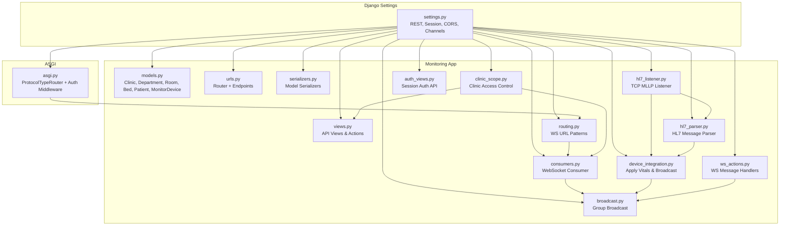
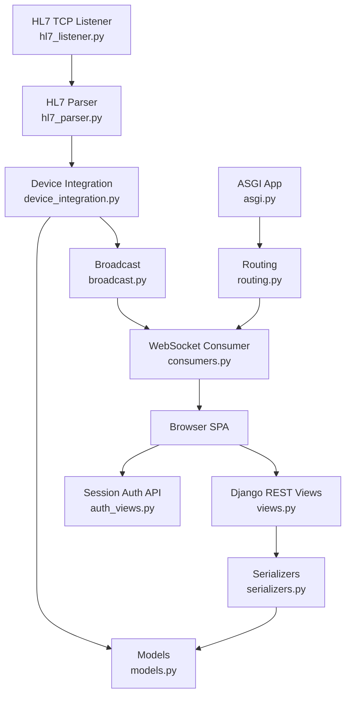
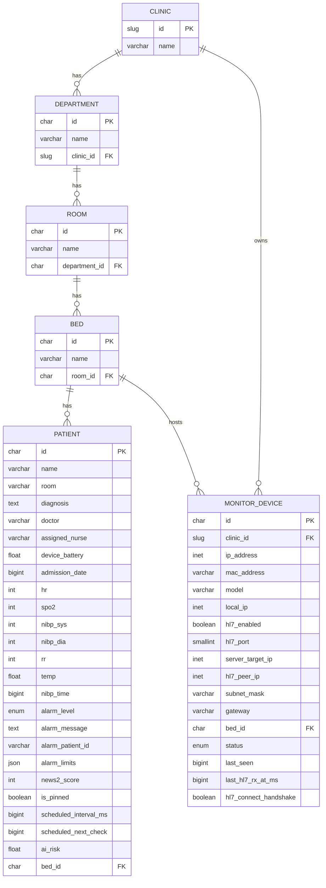
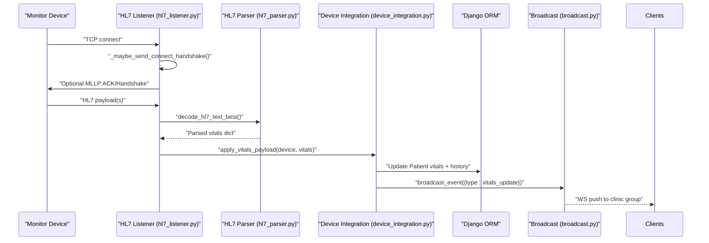
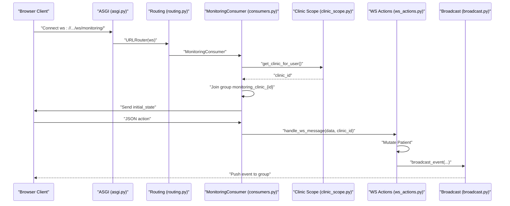
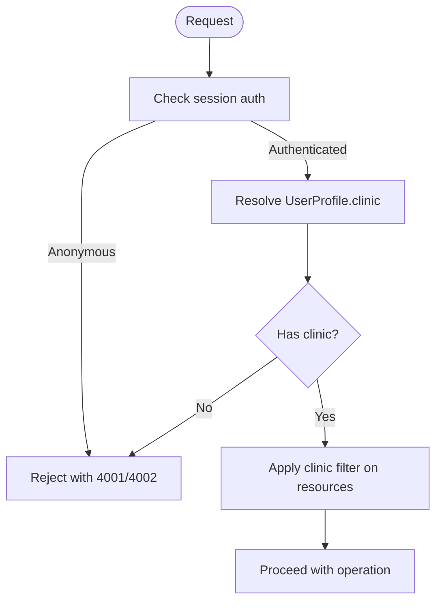
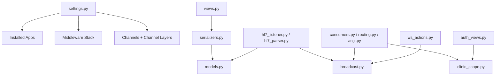

# Backend Development

<cite>
**Referenced Files in This Document**
- [settings.py](file://backend/medicentral/settings.py)
- [models.py](file://backend/monitoring/models.py)
- [urls.py](file://backend/monitoring/urls.py)
- [views.py](file://backend/monitoring/views.py)
- [consumers.py](file://backend/monitoring/consumers.py)
- [routing.py](file://backend/monitoring/routing.py)
- [hl7_listener.py](file://backend/monitoring/hl7_listener.py)
- [hl7_parser.py](file://backend/monitoring/hl7_parser.py)
- [serializers.py](file://backend/monitoring/serializers.py)
- [device_integration.py](file://backend/monitoring/device_integration.py)
- [broadcast.py](file://backend/monitoring/broadcast.py)
- [clinic_scope.py](file://backend/monitoring/clinic_scope.py)
- [ws_actions.py](file://backend/monitoring/ws_actions.py)
- [auth_views.py](file://backend/monitoring/auth_views.py)
- [asgi.py](file://backend/medicentral/asgi.py)
</cite>

## Table of Contents
1. [Introduction](#introduction)
2. [Project Structure](#project-structure)
3. [Core Components](#core-components)
4. [Architecture Overview](#architecture-overview)
5. [Detailed Component Analysis](#detailed-component-analysis)
6. [Dependency Analysis](#dependency-analysis)
7. [Performance Considerations](#performance-considerations)
8. [Troubleshooting Guide](#troubleshooting-guide)
9. [Conclusion](#conclusion)
10. [Appendices](#appendices)

## Introduction
This document explains the backend architecture of the Django-based Medicentral system. It covers the modular monitoring app, authentication and authorization, HL7/MLLP ingestion via a TCP listener, REST API for CRUD operations, and real-time WebSocket updates powered by Django Channels. It also documents the data models, relationships, and operational patterns for extending the system with new devices, customizing alarm thresholds, and integrating with external healthcare systems.

## Project Structure
The backend is organized around a dedicated monitoring app with supporting modules for HL7 handling, WebSocket routing, broadcasting, and clinic-scoped access control. Django settings configure REST framework, sessions, CORS, and Channels with Redis or in-memory channel layers.

**Diagram sources**
- [settings.py:146-183](file://backend/medicentral/settings.py#L146-L183)
- [models.py:5-224](file://backend/monitoring/models.py#L5-L224)
- [views.py:1-419](file://backend/monitoring/views.py#L1-L419)
- [urls.py:1-24](file://backend/monitoring/urls.py#L1-L24)
- [serializers.py:1-291](file://backend/monitoring/serializers.py#L1-L291)
- [consumers.py:1-46](file://backend/monitoring/consumers.py#L1-L46)
- [routing.py:1-8](file://backend/monitoring/routing.py#L1-L8)
- [hl7_listener.py:1-677](file://backend/monitoring/hl7_listener.py#L1-L677)
- [hl7_parser.py:1-530](file://backend/monitoring/hl7_parser.py#L1-L530)
- [device_integration.py:1-232](file://backend/monitoring/device_integration.py#L1-L232)
- [broadcast.py:1-20](file://backend/monitoring/broadcast.py#L1-L20)
- [clinic_scope.py:1-30](file://backend/monitoring/clinic_scope.py#L1-L30)
- [ws_actions.py:1-229](file://backend/monitoring/ws_actions.py#L1-L229)
- [auth_views.py:1-56](file://backend/monitoring/auth_views.py#L1-L56)
- [asgi.py:1-22](file://backend/medicentral/asgi.py#L1-L22)

**Section sources**
- [settings.py:53-183](file://backend/medicentral/settings.py#L53-L183)
- [urls.py:1-24](file://backend/monitoring/urls.py#L1-L24)
- [asgi.py:14-21](file://backend/medicentral/asgi.py#L14-L21)

## Core Components
- Monitoring models define the domain: Clinic, Department, Room, Bed, Patient, and MonitorDevice. They enforce clinic scoping and device constraints.
- REST API provides CRUD for departments, rooms, beds, and devices, plus administrative endpoints for infrastructure, patients, and vitals ingestion.
- HL7/MLLP listener accepts TCP connections, parses messages, applies vitals to patients, and broadcasts updates.
- WebSocket consumer authenticates users, scopes to clinic groups, and handles actions like pinning, scheduling, alarms, and admissions/discharge.
- Authentication uses Django sessions with CSRF tokens and clinic-scoped profiles.

**Section sources**
- [models.py:5-224](file://backend/monitoring/models.py#L5-L224)
- [views.py:32-419](file://backend/monitoring/views.py#L32-L419)
- [hl7_listener.py:557-677](file://backend/monitoring/hl7_listener.py#L557-L677)
- [consumers.py:12-46](file://backend/monitoring/consumers.py#L12-L46)
- [auth_views.py:14-56](file://backend/monitoring/auth_views.py#L14-L56)

## Architecture Overview
The system integrates REST and WebSocket protocols with a TCP HL7 listener. Requests flow through Django REST views; HL7 messages are ingested asynchronously by a threaded TCP server. Real-time updates propagate via Channels to clients scoped by clinic.

**Diagram sources**
- [auth_views.py:14-56](file://backend/monitoring/auth_views.py#L14-L56)
- [views.py:32-419](file://backend/monitoring/views.py#L32-L419)
- [models.py:5-224](file://backend/monitoring/models.py#L5-L224)
- [serializers.py:100-291](file://backend/monitoring/serializers.py#L100-L291)
- [hl7_listener.py:502-677](file://backend/monitoring/hl7_listener.py#L502-L677)
- [hl7_parser.py:423-530](file://backend/monitoring/hl7_parser.py#L423-L530)
- [device_integration.py:129-232](file://backend/monitoring/device_integration.py#L129-L232)
- [broadcast.py:10-20](file://backend/monitoring/broadcast.py#L10-L20)
- [consumers.py:12-46](file://backend/monitoring/consumers.py#L12-L46)
- [routing.py:5-7](file://backend/monitoring/routing.py#L5-L7)
- [asgi.py:14-21](file://backend/medicentral/asgi.py#L14-L21)

## Detailed Component Analysis

### Data Models and Relationships
The monitoring app defines a hierarchical clinical structure and core entities for patient monitoring and device tracking. Constraints and foreign keys ensure data integrity and clinic scoping.

Key constraints and notes:
- Unique constraint on clinic and IP ensures a device per clinic/IP pairing.
- Device status and timestamps track connectivity and HL7 activity.
- Patient vitals and alarm limits support real-time monitoring and alerts.

**Diagram sources**
- [models.py:5-224](file://backend/monitoring/models.py#L5-L224)

**Section sources**
- [models.py:131-138](file://backend/monitoring/models.py#L131-L138)
- [models.py:77-138](file://backend/monitoring/models.py#L77-L138)
- [models.py:141-182](file://backend/monitoring/models.py#L141-L182)

### REST API Endpoints
The monitoring app exposes a set of REST endpoints under /api/. The router registers CRUD for departments, rooms, beds, and devices. Additional endpoints include authentication, infrastructure diagnostics, patient listing, health checks, and vitals ingestion.

- Authentication
  - GET /api/auth/session/
  - POST /api/auth/login/
  - POST /api/auth/logout/

- Infrastructure and Diagnostics
  - GET /api/infrastructure/
  - GET /api/health/

- Entities
  - /api/departments/ — ModelViewSet
  - /api/rooms/ — ModelViewSet
  - /api/beds/ — ModelViewSet
  - /api/devices/ — ModelViewSet

- Device Management
  - POST /api/devices/from-screen/ — Upload image to auto-register device
  - GET /api/devices/{id}/connection-check/ — HL7 connectivity diagnostics
  - POST /api/devices/{id}/mark-online/ — Force device online

- Patients
  - GET /api/patients/ — List patients scoped to clinic

- HL7/MLLP Ingestion
  - POST /api/device/{ip}/vitals/ — REST vitals ingestion endpoint

Notes:
- Device creation and updates are clinic-scoped; serializers enforce clinic context and IP uniqueness.
- Authentication uses session-based DRF with CSRF protection.

**Section sources**
- [urls.py:6-23](file://backend/monitoring/urls.py#L6-L23)
- [views.py:32-419](file://backend/monitoring/views.py#L32-L419)
- [serializers.py:146-282](file://backend/monitoring/serializers.py#L146-L282)
- [auth_views.py:14-56](file://backend/monitoring/auth_views.py#L14-L56)

### HL7/MLLP Protocol Implementation
The HL7 listener runs in a dedicated thread, binding to configurable host/port and accepting TCP connections. It supports MLLP framing, optional connect handshake, and robust decoding across multiple encodings. Messages are parsed to extract vitals, applied to patients, and acknowledged when appropriate.

Key behaviors:
- MLLP framing detection and extraction.
- Optional ACK generation for incoming messages.
- UTF-8/UTF-16/CP1251/latin-1 decoding with best-effort merging.
- Device resolution via ip_address, local_ip, or hl7_peer_ip; NAT fallback supported.
- Diagnostic counters and logs for troubleshooting.

**Diagram sources**
- [hl7_listener.py:502-555](file://backend/monitoring/hl7_listener.py#L502-L555)
- [hl7_parser.py:487-530](file://backend/monitoring/hl7_parser.py#L487-L530)
- [device_integration.py:129-232](file://backend/monitoring/device_integration.py#L129-L232)
- [broadcast.py:10-20](file://backend/monitoring/broadcast.py#L10-L20)

**Section sources**
- [hl7_listener.py:557-677](file://backend/monitoring/hl7_listener.py#L557-L677)
- [hl7_parser.py:423-530](file://backend/monitoring/hl7_parser.py#L423-L530)
- [device_integration.py:31-78](file://backend/monitoring/device_integration.py#L31-L78)

### WebSocket Architecture with Django Channels
The WebSocket consumer enforces session-based authentication, resolves the user’s clinic, and joins a group named after the clinic. It sends initial state and forwards messages to handlers that mutate patient records and broadcast updates.

Security and scoping:
- Authenticated users only; anonymous connections rejected.
- Group names are per clinic; cross-clinic isolation enforced.

**Diagram sources**
- [asgi.py:14-21](file://backend/medicentral/asgi.py#L14-L21)
- [routing.py:5-7](file://backend/monitoring/routing.py#L5-L7)
- [consumers.py:12-46](file://backend/monitoring/consumers.py#L12-L46)
- [clinic_scope.py:11-23](file://backend/monitoring/clinic_scope.py#L11-L23)
- [ws_actions.py:31-229](file://backend/monitoring/ws_actions.py#L31-L229)
- [broadcast.py:10-20](file://backend/monitoring/broadcast.py#L10-L20)

**Section sources**
- [consumers.py:12-46](file://backend/monitoring/consumers.py#L12-L46)
- [ws_actions.py:31-229](file://backend/monitoring/ws_actions.py#L31-L229)
- [broadcast.py:10-20](file://backend/monitoring/broadcast.py#L10-L20)

### Authentication and Authorization
- Session-based authentication with CSRF tokens for safe mutations.
- Clinic-scoped access control via user profile linking to Clinic.
- Superusers can bypass clinic filters in certain endpoints.
- Device registration and updates require clinic context; serializers validate uniqueness and normalize IPs.

**Diagram sources**
- [consumers.py:13-21](file://backend/monitoring/consumers.py#L13-L21)
- [clinic_scope.py:15-23](file://backend/monitoring/clinic_scope.py#L15-L23)
- [serializers.py:226-249](file://backend/monitoring/serializers.py#L226-L249)

**Section sources**
- [auth_views.py:14-56](file://backend/monitoring/auth_views.py#L14-L56)
- [clinic_scope.py:15-23](file://backend/monitoring/clinic_scope.py#L15-L23)
- [serializers.py:112-125](file://backend/monitoring/serializers.py#L112-L125)

### Practical Extension Examples
- Adding a new device type:
  - Extend the HL7 parser to recognize new segment patterns or fields.
  - Update device integration to map new vitals to Patient fields.
  - Ensure device registration includes required fields (IP, bed assignment).

- Customizing alarm thresholds:
  - Use the WebSocket action “update_limits” to merge new thresholds per patient.
  - Store thresholds in the patient’s alarm_limits JSON field.

- Integrating with external systems:
  - Use the REST vitals endpoint to ingest data from external sources.
  - Configure the HL7 listener to accept traffic from external monitors; adjust NAT and firewall rules accordingly.

[No sources needed since this section provides general guidance]

## Dependency Analysis
The monitoring app depends on Django REST framework, Channels, and optional Redis for channel layers. Settings configure middleware order and channel layer selection.

**Diagram sources**
- [settings.py:53-183](file://backend/medicentral/settings.py#L53-L183)
- [models.py:5-224](file://backend/monitoring/models.py#L5-L224)
- [views.py:16-25](file://backend/monitoring/views.py#L16-L25)
- [serializers.py:10-10](file://backend/monitoring/serializers.py#L10-L10)
- [hl7_listener.py:1-10](file://backend/monitoring/hl7_listener.py#L1-L10)
- [broadcast.py:4-6](file://backend/monitoring/broadcast.py#L4-L6)
- [consumers.py:3-9](file://backend/monitoring/consumers.py#L3-L9)
- [routing.py:3-7](file://backend/monitoring/routing.py#L3-L7)
- [asgi.py:3-21](file://backend/medicentral/asgi.py#L3-L21)
- [clinic_scope.py:6-9](file://backend/monitoring/clinic_scope.py#L6-L9)
- [ws_actions.py:12-15](file://backend/monitoring/ws_actions.py#L12-L15)
- [auth_views.py:4-9](file://backend/monitoring/auth_views.py#L4-L9)

**Section sources**
- [settings.py:53-183](file://backend/medicentral/settings.py#L53-L183)

## Performance Considerations
- HL7 listener uses threading per connection and TCP optimizations (TCP_NODELAY, SO_KEEPALIVE). Tune receive timeouts and environment flags for network conditions.
- Broadcasting uses async channel layer send; ensure Redis is configured in production for scale.
- Device vitals ingestion uses atomic transactions and selective updates to minimize contention.
- Patient serialization prefetches related collections to reduce queries.

[No sources needed since this section provides general guidance]

## Troubleshooting Guide
Common operational checks and remedies:
- HL7 listener status and diagnostics:
  - Use the device connection-check endpoint to inspect listener status, port acceptance, and diagnostic counters.
  - Verify firewall rules allow inbound TCP 6006 and that the listener binds successfully.
- Device discovery and NAT:
  - Confirm device IP fields (ip_address, local_ip, hl7_peer_ip) match the monitor’s perspective.
  - Enable single-device NAT fallback for small deployments if needed.
- WebSocket connectivity:
  - Ensure session cookies are accepted and origin validation allows the client origin.
  - Verify the user belongs to a clinic; otherwise the consumer closes the connection.
- REST ingestion:
  - Validate device registration and bed assignment before sending vitals.
  - Use serializers’ validation feedback for IP normalization and uniqueness.

**Section sources**
- [views.py:59-256](file://backend/monitoring/views.py#L59-L256)
- [hl7_listener.py:614-657](file://backend/monitoring/hl7_listener.py#L614-L657)
- [consumers.py:13-21](file://backend/monitoring/consumers.py#L13-L21)
- [serializers.py:226-249](file://backend/monitoring/serializers.py#L226-L249)

## Conclusion
Medicentral’s backend combines a clean Django REST API, robust HL7/MLLP ingestion, and real-time WebSocket updates. The clinic-scoped design, strong constraints, and modular components enable safe extension and integration with diverse medical devices and workflows.

[No sources needed since this section summarizes without analyzing specific files]

## Appendices

### API Endpoint Reference
- Authentication
  - GET /api/auth/session/ — Session info and CSRF token
  - POST /api/auth/login/ — Login with credentials
  - POST /api/auth/logout/ — Logout

- Infrastructure
  - GET /api/infrastructure/ — Clinic-scoped infrastructure and HL7 diagnostics
  - GET /api/health/ — Health check

- Entities
  - /api/departments/, /api/rooms/, /api/beds/, /api/devices/ — CRUD via ModelViewSet

- Device
  - POST /api/devices/from-screen/ — Auto-register device from screen image
  - GET /api/devices/{id}/connection-check/ — HL7 diagnostics
  - POST /api/devices/{id}/mark-online/ — Mark device online

- Patients
  - GET /api/patients/ — List patients scoped to clinic

- HL7/REST Ingestion
  - POST /api/device/{ip}/vitals/ — REST vitals ingestion

**Section sources**
- [urls.py:6-23](file://backend/monitoring/urls.py#L6-L23)
- [views.py:32-419](file://backend/monitoring/views.py#L32-L419)