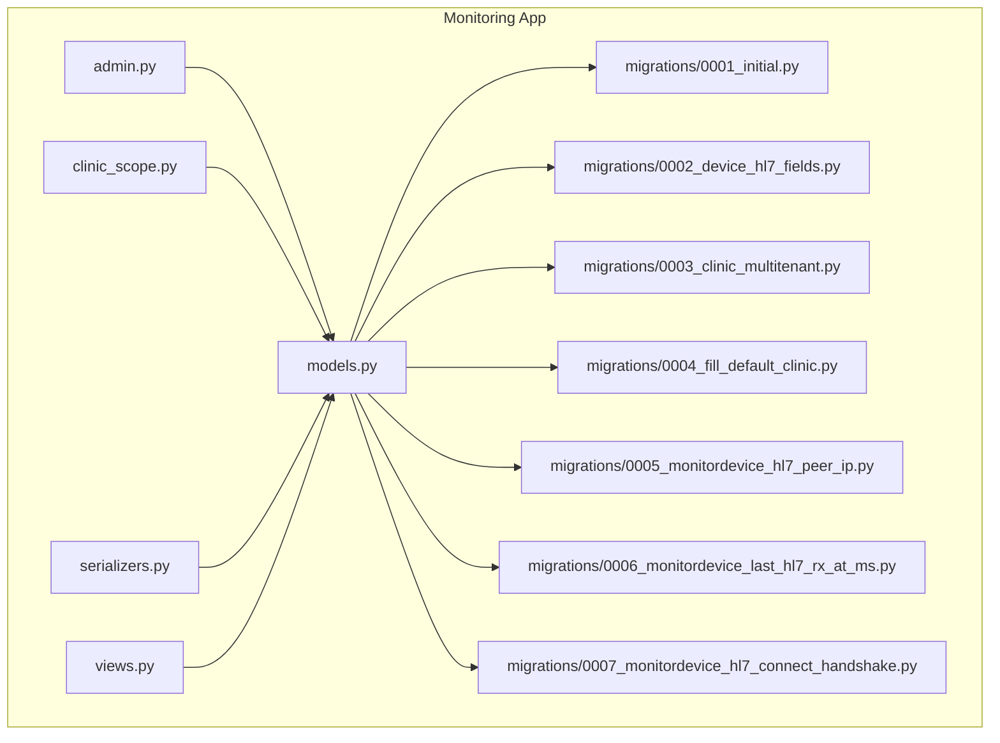
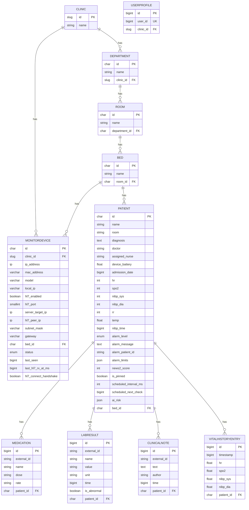
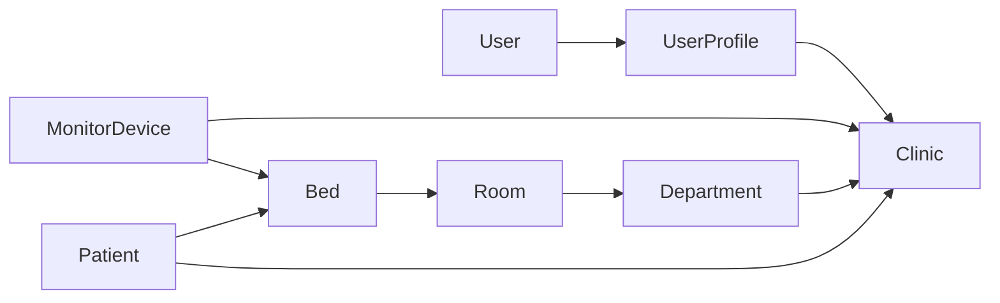

# Data Models & Database Design

<cite>
**Referenced Files in This Document**
- [models.py](file://backend/monitoring/models.py)
- [migrations/0001_initial.py](file://backend/monitoring/migrations/0001_initial.py)
- [migrations/0002_device_hl7_fields.py](file://backend/monitoring/migrations/0002_device_hl7_fields.py)
- [migrations/0003_clinic_multitenant.py](file://backend/monitoring/migrations/0003_clinic_multitenant.py)
- [migrations/0004_fill_default_clinic.py](file://backend/monitoring/migrations/0004_fill_default_clinic.py)
- [migrations/0005_monitordevice_hl7_peer_ip.py](file://backend/monitoring/migrations/0005_monitordevice_hl7_peer_ip.py)
- [migrations/0006_monitordevice_last_hl7_rx_at_ms.py](file://backend/monitoring/migrations/0006_monitordevice_last_hl7_rx_at_ms.py)
- [migrations/0007_monitordevice_hl7_connect_handshake.py](file://backend/monitoring/migrations/0007_monitordevice_hl7_connect_handshake.py)
- [admin.py](file://backend/monitoring/admin.py)
- [clinic_scope.py](file://backend/monitoring/clinic_scope.py)
- [serializers.py](file://backend/monitoring/serializers.py)
- [views.py](file://backend/monitoring/views.py)
</cite>

## Table of Contents
1. [Introduction](#introduction)
2. [Project Structure](#project-structure)
3. [Core Components](#core-components)
4. [Architecture Overview](#architecture-overview)
5. [Detailed Component Analysis](#detailed-component-analysis)
6. [Dependency Analysis](#dependency-analysis)
7. [Performance Considerations](#performance-considerations)
8. [Troubleshooting Guide](#troubleshooting-guide)
9. [Conclusion](#conclusion)
10. [Appendices](#appendices)

## Introduction
This document describes the data model and database design for the Medicentral monitoring system. It focuses on multi-tenancy via Clinic, the facility hierarchy (Department → Room → Bed), the MonitorDevice model for medical equipment, and the Patient model with vital signs tracking, alarm levels, NEWS-2 scoring, and AI risk predictions. It also documents foreign key relationships, constraints, indexing strategies, validation rules, and JSONField usage for dynamic configurations. Finally, it outlines performance considerations and operational guidance for managing historical vitals.

## Project Structure
The data model is defined in the monitoring app’s models module and evolved through a series of migrations. The admin interface surfaces key entities for management, while clinic-scoped utilities enforce tenant isolation. Serializers and views define validation and API behavior.

**Diagram sources**
- [models.py](file://backend/monitoring/models.py)
- [admin.py](file://backend/monitoring/admin.py)
- [clinic_scope.py](file://backend/monitoring/clinic_scope.py)
- [serializers.py](file://backend/monitoring/serializers.py)
- [views.py](file://backend/monitoring/views.py)
- [migrations/0001_initial.py](file://backend/monitoring/migrations/0001_initial.py)
- [migrations/0002_device_hl7_fields.py](file://backend/monitoring/migrations/0002_device_hl7_fields.py)
- [migrations/0003_clinic_multitenant.py](file://backend/monitoring/migrations/0003_clinic_multitenant.py)
- [migrations/0004_fill_default_clinic.py](file://backend/monitoring/migrations/0004_fill_default_clinic.py)
- [migrations/0005_monitordevice_hl7_peer_ip.py](file://backend/monitoring/migrations/0005_monitordevice_hl7_peer_ip.py)
- [migrations/0006_monitordevice_last_hl7_rx_at_ms.py](file://backend/monitoring/migrations/0006_monitordevice_last_hl7_rx_at_ms.py)
- [migrations/0007_monitordevice_hl7_connect_handshake.py](file://backend/monitoring/migrations/0007_monitordevice_hl7_connect_handshake.py)

**Section sources**
- [models.py](file://backend/monitoring/models.py)
- [migrations/0001_initial.py](file://backend/monitoring/migrations/0001_initial.py)
- [admin.py](file://backend/monitoring/admin.py)
- [clinic_scope.py](file://backend/monitoring/clinic_scope.py)
- [serializers.py](file://backend/monitoring/serializers.py)
- [views.py](file://backend/monitoring/views.py)

## Core Components
- Clinic: Multi-tenant boundary with slug-based id and name.
- UserProfile: Links Django User to Clinic for per-user tenant scoping.
- Department: Facility department linked to Clinic.
- Room: Room within a Department.
- Bed: Bed within a Room.
- MonitorDevice: Medical device with network and HL7 configuration, status, and timestamps.
- Patient: Demographics, current vitals, alarms, NEWS-2 score, scheduling, and AI risk predictions.
- Medication, LabResult, ClinicalNote: Ancillary records linked to Patient.
- VitalHistoryEntry: Historical vitals with indexed timestamp for efficient queries.

Key design highlights:
- Tenant isolation via Clinic foreign keys and clinic-scoped query utilities.
- Choice fields for statuses and alarm levels with TextChoices.
- JSONField for dynamic alarm limits and AI risk predictions.
- Unique constraints and indexes for performance and integrity.

**Section sources**
- [models.py](file://backend/monitoring/models.py)
- [clinic_scope.py](file://backend/monitoring/clinic_scope.py)

## Architecture Overview
The system enforces multi-tenancy at the data level. All facility and device entities are scoped to a Clinic. Users are associated with a Clinic via UserProfile. Patient records are filtered by the clinic chain: Patient → Bed → Room → Department → Clinic. MonitorDevice is scoped to Clinic and optionally bound to a Bed.

**Diagram sources**
- [models.py](file://backend/monitoring/models.py)
- [migrations/0001_initial.py](file://backend/monitoring/migrations/0001_initial.py)
- [migrations/0003_clinic_multitenant.py](file://backend/monitoring/migrations/0003_clinic_multitenant.py)

## Detailed Component Analysis

### Clinic and UserProfile (Multi-Tenant Isolation)
- Clinic: Slug-based primary key, name, ordered by name.
- UserProfile: OneToOne to Django User, ForeignKey to Clinic, enabling per-user tenant scoping.
- Admin integration: Inline UserProfile editing on User admin; filtering by clinic.

Validation and constraints:
- Clinic id is a slug; uniqueness enforced by model-level primary key.
- UserProfile ensures a single profile per user and binds to a clinic.

Operational note:
- Superusers can access the first clinic when no profile exists; otherwise, user’s clinic determines visibility.

**Section sources**
- [models.py](file://backend/monitoring/models.py)
- [admin.py](file://backend/monitoring/admin.py)
- [clinic_scope.py](file://backend/monitoring/clinic_scope.py)

### Facility Hierarchy: Department → Room → Bed
- Department: Primary key char id, name, links to Clinic.
- Room: Primary key char id, name, links to Department.
- Bed: Primary key char id, name, links to Room.

Indexing and ordering:
- All three models order by name for predictable listings.

Admin and filtering:
- Admin registers Department, Room, Bed; list filters and search fields optimized for management.

**Section sources**
- [models.py](file://backend/monitoring/models.py)
- [admin.py](file://backend/monitoring/admin.py)

### MonitorDevice (Medical Equipment Management)
Fields and constraints:
- Primary key char id; clinic FK for multi-tenant scoping.
- Network fields: ip_address (unique), mac_address, model, local_ip, server_target_ip, hl7_peer_ip.
- HL7 configuration: hl7_enabled, hl7_port, subnet_mask, gateway.
- Association: optional FK to Bed.
- Status: TextChoices (online/offline).
- Timestamps: last_seen, last_hl7_rx_at_ms.
- Handshake flag: hl7_connect_handshake.
- Unique constraint: (clinic, ip_address).

Migrations evolution:
- Initial creation of MonitorDevice with core fields.
- Added HL7-related fields and uniqueness on ip_address.
- Introduced clinic FK and unique constraint across clinic+ip.
- Added hl7_peer_ip, last_hl7_rx_at_ms, and hl7_connect_handshake.

Validation and API behavior:
- Serializer normalizes optional IP fields and validates uniqueness per clinic.
- Creation sets defaults for status, MAC/model, and HL7 defaults.
- DeviceViewSet exposes actions for marking online and connection checks.

**Section sources**
- [models.py](file://backend/monitoring/models.py)
- [migrations/0001_initial.py](file://backend/monitoring/migrations/0001_initial.py)
- [migrations/0002_device_hl7_fields.py](file://backend/monitoring/migrations/0002_device_hl7_fields.py)
- [migrations/0003_clinic_multitenant.py](file://backend/monitoring/migrations/0003_clinic_multitenant.py)
- [migrations/0005_monitordevice_hl7_peer_ip.py](file://backend/monitoring/migrations/0005_monitordevice_hl7_peer_ip.py)
- [migrations/0006_monitordevice_last_hl7_rx_at_ms.py](file://backend/monitoring/migrations/0006_monitordevice_last_hl7_rx_at_ms.py)
- [migrations/0007_monitordevice_hl7_connect_handshake.py](file://backend/monitoring/migrations/0007_monitordevice_hl7_connect_handshake.py)
- [serializers.py](file://backend/monitoring/serializers.py)
- [views.py](file://backend/monitoring/views.py)

### Patient (Vital Signs, Alarms, NEWS-2, AI Risk)
Core attributes:
- Demographics: name, room (display text), diagnosis, doctor, assigned_nurse, device_battery, admission_date (Unix ms).
- Current vitals: hr, spo2, nibp_sys, nibp_dia, rr, temp, nibp_time.
- Alarms: alarm_level (TextChoices: none, blue, yellow, red, purple), alarm_message, alarm_patient_id, alarm_limits (JSON).
- Scoring: news2_score.
- Scheduling: scheduled_interval_ms, scheduled_next_check.
- AI: ai_risk (JSON).
- Association: optional FK to Bed.

Choice fields and JSON usage:
- alarm_level uses TextChoices for color-coded severity.
- alarm_limits and ai_risk are JSONField for flexible, dynamic configurations.

Historical vitals:
- VitalHistoryEntry stores hr, spo2, nibp_sys, nibp_dia with timestamp and db_index on timestamp for efficient range queries.

Admin and serialization:
- Admin registers Patient; serializer aggregates medications, labs, notes, and recent history entries.

**Section sources**
- [models.py](file://backend/monitoring/models.py)
- [migrations/0001_initial.py](file://backend/monitoring/migrations/0001_initial.py)
- [admin.py](file://backend/monitoring/admin.py)
- [serializers.py](file://backend/monitoring/serializers.py)

### Ancillary Records Linked to Patient
- Medication: external_id, name, dose, rate.
- LabResult: external_id, name, value, unit, time, is_abnormal.
- ClinicalNote: external_id, text, author, time.

Relationships:
- All linked to Patient via foreign keys with related_name for reverse access.

**Section sources**
- [models.py](file://backend/monitoring/models.py)
- [migrations/0001_initial.py](file://backend/monitoring/migrations/0001_initial.py)

## Dependency Analysis
Tenant scoping and query boundaries:
- Patient queries are scoped to a clinic via the chain: Patient → Bed → Room → Department → Clinic.
- Device queries are scoped to Clinic; uniqueness of (clinic, ip_address) prevents cross-tenant collisions.
- UserProfile ties users to clinics for administrative and filtering purposes.

**Diagram sources**
- [models.py](file://backend/monitoring/models.py)
- [clinic_scope.py](file://backend/monitoring/clinic_scope.py)

**Section sources**
- [models.py](file://backend/monitoring/models.py)
- [clinic_scope.py](file://backend/monitoring/clinic_scope.py)

## Performance Considerations
Indexing and query optimization:
- VitalHistoryEntry.timestamp is indexed for efficient time-series queries.
- Ordering on name for Department, Room, Bed for UI stability.
- Ordering on model and id for MonitorDevice and Patient for predictable listings.

Constraints and integrity:
- Unique constraint on (clinic, ip_address) for MonitorDevice prevents duplicate IPs across tenants.
- SET_NULL on delete for Bed FKs in MonitorDevice and Patient to preserve referential integrity when beds are removed.

Data lifecycle for historical vitals:
- Use timestamp-indexed queries to efficiently paginate and filter historical entries.
- Consider periodic archiving or retention policies to cap historical data volume.

[No sources needed since this section provides general guidance]

## Troubleshooting Guide
Common validation and configuration issues:
- MonitorDevice IP uniqueness: Ensure unique IP per clinic; serializer enforces this during create/update.
- Optional IP normalization: Local/server/peer IPs are normalized; empty or null values are accepted and validated.
- HL7 diagnostics: DeviceViewSet.connection_check provides diagnostics for HL7 listener status, port acceptance, and recent data reception.

Operational tips:
- Use admin filters for clinic, HL7 enabled, and status to quickly locate devices.
- For NAT scenarios, configure hl7_peer_ip to match the server-visible IP.
- If no recent HL7 packets are received, check firewall rules and monitor output configuration.

**Section sources**
- [serializers.py](file://backend/monitoring/serializers.py)
- [views.py](file://backend/monitoring/views.py)
- [migrations/0002_device_hl7_fields.py](file://backend/monitoring/migrations/0002_device_hl7_fields.py)
- [migrations/0005_monitordevice_hl7_peer_ip.py](file://backend/monitoring/migrations/0005_monitordevice_hl7_peer_ip.py)
- [migrations/0006_monitordevice_last_hl7_rx_at_ms.py](file://backend/monitoring/migrations/0006_monitordevice_last_hl7_rx_at_ms.py)
- [admin.py](file://backend/monitoring/admin.py)

## Conclusion
The Medicentral monitoring system employs a clean, multi-tenant data model centered on Clinic and scoped facility hierarchy. MonitorDevice and Patient models support real-time and historical monitoring workflows, with JSONField enabling flexible configurations and TextChoices ensuring consistent alarm semantics. Constraints and indexes balance integrity and performance, while clinic-scoped utilities and serializers enforce tenant isolation and robust validation.

[No sources needed since this section summarizes without analyzing specific files]

## Appendices

### Migration History Summary
- Initial entities: Bed, Department, Room, MonitorDevice, Patient, Medication, LabResult, ClinicalNote, VitalHistoryEntry.
- HL7 enhancements: Added gateway, subnet_mask, local_ip, server_target_ip, hl7_enabled, hl7_port; made ip_address unique.
- Multi-tenancy: Introduced Clinic, UserProfile; added clinic FKs; unique constraint (clinic, ip_address).
- Default clinic population: Backfilled existing entities to default clinic.
- Additional fields: hl7_peer_ip, last_hl7_rx_at_ms, hl7_connect_handshake.

**Section sources**
- [migrations/0001_initial.py](file://backend/monitoring/migrations/0001_initial.py)
- [migrations/0002_device_hl7_fields.py](file://backend/monitoring/migrations/0002_device_hl7_fields.py)
- [migrations/0003_clinic_multitenant.py](file://backend/monitoring/migrations/0003_clinic_multitenant.py)
- [migrations/0004_fill_default_clinic.py](file://backend/monitoring/migrations/0004_fill_default_clinic.py)
- [migrations/0005_monitordevice_hl7_peer_ip.py](file://backend/monitoring/migrations/0005_monitordevice_hl7_peer_ip.py)
- [migrations/0006_monitordevice_last_hl7_rx_at_ms.py](file://backend/monitoring/migrations/0006_monitordevice_last_hl7_rx_at_ms.py)
- [migrations/0007_monitordevice_hl7_connect_handshake.py](file://backend/monitoring/migrations/0007_monitordevice_hl7_connect_handshake.py)