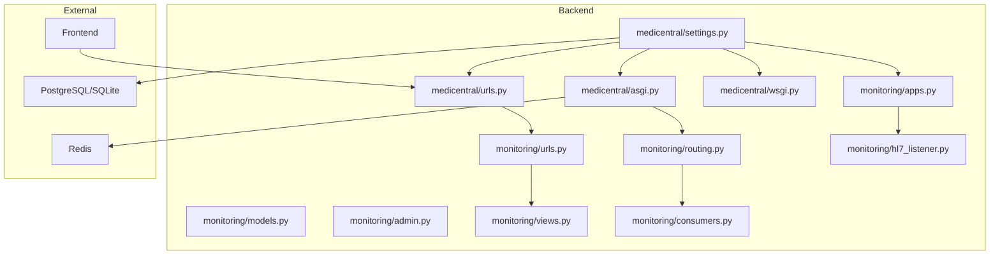
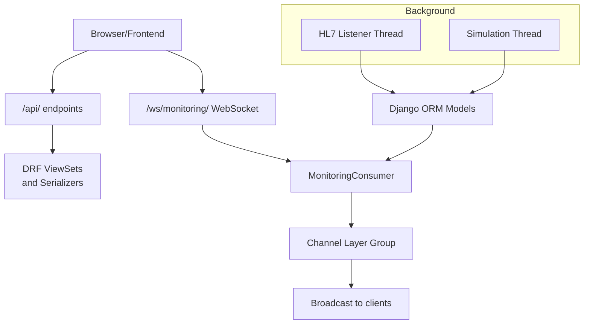
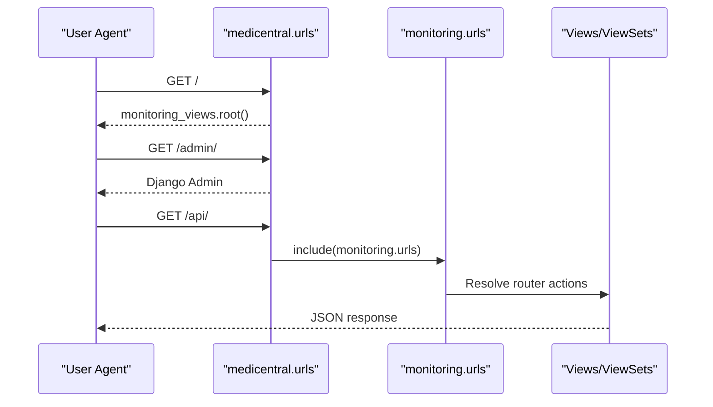
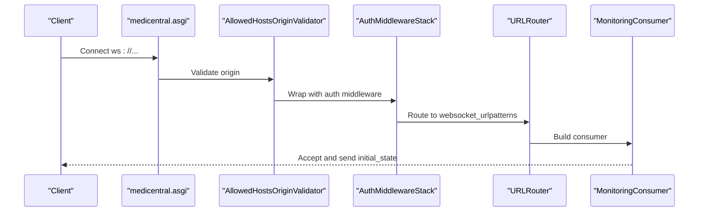
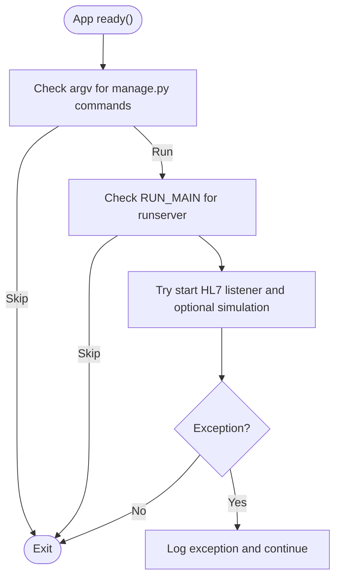
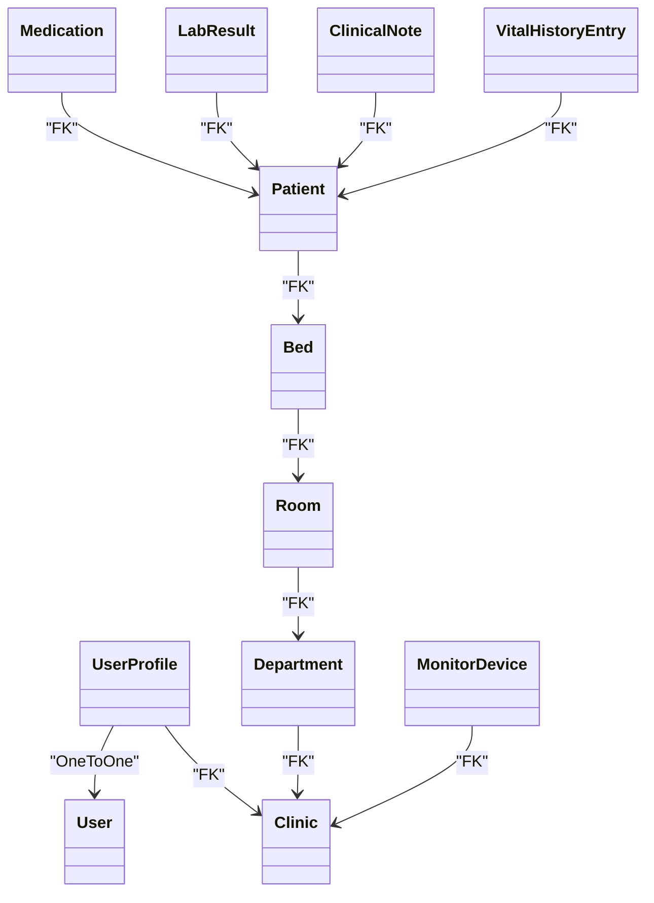
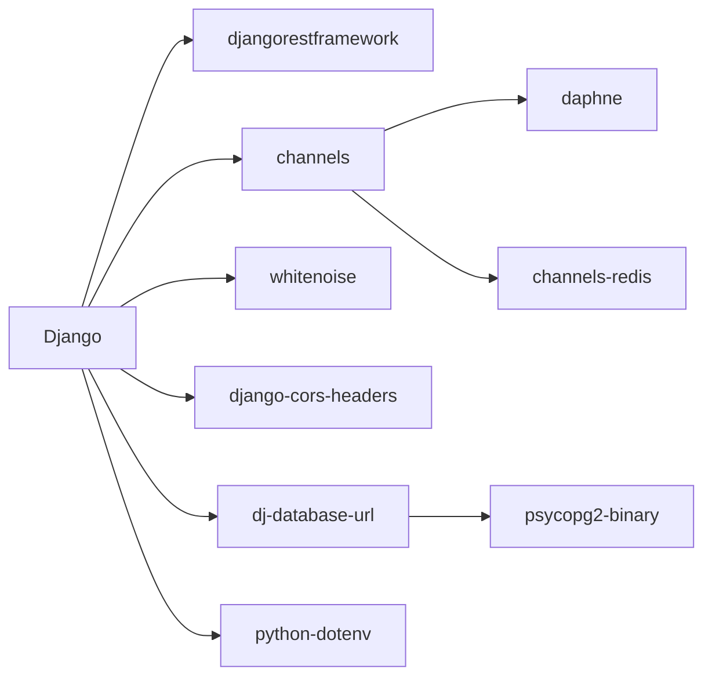

# Django Application Structure

<cite>
**Referenced Files in This Document**
- [settings.py](file://backend/medicentral/settings.py)
- [urls.py](file://backend/medicentral/urls.py)
- [asgi.py](file://backend/medicentral/asgi.py)
- [wsgi.py](file://backend/medicentral/wsgi.py)
- [apps.py](file://backend/monitoring/apps.py)
- [urls.py](file://backend/monitoring/urls.py)
- [routing.py](file://backend/monitoring/routing.py)
- [models.py](file://backend/monitoring/models.py)
- [admin.py](file://backend/monitoring/admin.py)
- [views.py](file://backend/monitoring/views.py)
- [consumers.py](file://backend/monitoring/consumers.py)
- [hl7_listener.py](file://backend/monitoring/hl7_listener.py)
- [manage.py](file://backend/manage.py)
- [requirements.txt](file://backend/requirements.txt)
- [README.md](file://README.md)
</cite>

## Table of Contents
1. [Introduction](#introduction)
2. [Project Structure](#project-structure)
3. [Core Components](#core-components)
4. [Architecture Overview](#architecture-overview)
5. [Detailed Component Analysis](#detailed-component-analysis)
6. [Dependency Analysis](#dependency-analysis)
7. [Performance Considerations](#performance-considerations)
8. [Troubleshooting Guide](#troubleshooting-guide)
9. [Conclusion](#conclusion)
10. [Appendices](#appendices)

## Introduction
This document explains the Django application structure of the Medicentral project, focusing on the main medicentral project and the monitoring Django app. It covers settings configuration (database, middleware, authentication, environment variables), URL routing (main and monitoring app), ASGI configuration for Django Channels (WebSocket routing and channel layers), app configuration and integration with Django’s app registry, and practical guidance for extending the system. It also addresses security, static file handling, and production deployment considerations.

## Project Structure
The repository is organized into:
- backend/medicentral: Django project root with settings, URL routing, WSGI/ASGI entry points, and shared configuration.
- backend/monitoring: A Django app implementing REST APIs, WebSockets, HL7 listening, models, admin, and consumers.
- frontend/: React-based UI (outside scope of this Django-focused document).
- deploy/, k8s/, docker-compose.yml: Deployment and orchestration assets.
- README.md and architecture.md: Project documentation and architecture notes.

**Diagram sources**
- [settings.py:1-218](file://backend/medicentral/settings.py#L1-L218)
- [urls.py:1-11](file://backend/medicentral/urls.py#L1-L11)
- [asgi.py:1-22](file://backend/medicentral/asgi.py#L1-L22)
- [wsgi.py:1-8](file://backend/medicentral/wsgi.py#L1-L8)
- [apps.py:1-46](file://backend/monitoring/apps.py#L1-L46)
- [urls.py:1-24](file://backend/monitoring/urls.py#L1-L24)
- [routing.py:1-8](file://backend/monitoring/routing.py#L1-L8)
- [models.py:1-224](file://backend/monitoring/models.py#L1-L224)
- [admin.py:1-73](file://backend/monitoring/admin.py#L1-L73)
- [views.py:1-419](file://backend/monitoring/views.py#L1-L419)
- [consumers.py:1-46](file://backend/monitoring/consumers.py#L1-L46)
- [hl7_listener.py:1-708](file://backend/monitoring/hl7_listener.py#L1-L708)

**Section sources**
- [README.md:1-110](file://README.md#L1-L110)

## Core Components
- Settings module centralizes configuration for installed apps, middleware, templates, database selection, static files, REST framework defaults, security, CORS, CSRF, logging, and channel layers.
- URL configuration wires the admin, monitoring API, and root view in the main project, while the monitoring app registers DRF routers and additional endpoints.
- ASGI application integrates Django Channels with WebSocket routing and authentication middleware stack.
- Monitoring app config initializes HL7 listener and optional simulation threads on startup, excluding management commands and shell contexts.
- Models define clinic-scoped entities and device/patient/vitals relations.
- Admin customization integrates monitoring profiles and device administration.
- Views implement DRF viewsets and custom endpoints; consumers handle WebSocket communication.

**Section sources**
- [settings.py:1-218](file://backend/medicentral/settings.py#L1-L218)
- [urls.py:1-11](file://backend/medicentral/urls.py#L1-L11)
- [asgi.py:1-22](file://backend/medicentral/asgi.py#L1-L22)
- [apps.py:1-46](file://backend/monitoring/apps.py#L1-L46)
- [models.py:1-224](file://backend/monitoring/models.py#L1-L224)
- [admin.py:1-73](file://backend/monitoring/admin.py#L1-L73)
- [views.py:1-419](file://backend/monitoring/views.py#L1-L419)
- [consumers.py:1-46](file://backend/monitoring/consumers.py#L1-L46)

## Architecture Overview
The system comprises:
- HTTP API via Django REST Framework under /api/.
- Real-time updates via Django Channels/WebSocket at /ws/monitoring/.
- Background HL7 ingestion handled by a dedicated listener thread configured in the monitoring app.
- Optional simulation mode for vitals generation.
- Static file serving optimized with WhiteNoise.

**Diagram sources**
- [urls.py:1-11](file://backend/medicentral/urls.py#L1-L11)
- [urls.py:1-24](file://backend/monitoring/urls.py#L1-L24)
- [routing.py:1-8](file://backend/monitoring/routing.py#L1-L8)
- [asgi.py:1-22](file://backend/medicentral/asgi.py#L1-L22)
- [consumers.py:1-46](file://backend/monitoring/consumers.py#L1-L46)
- [apps.py:1-46](file://backend/monitoring/apps.py#L1-L46)
- [models.py:1-224](file://backend/monitoring/models.py#L1-L224)

## Detailed Component Analysis

### Settings Configuration
Key areas:
- Environment-driven configuration with helpers for boolean parsing and .env loading.
- Installed apps include whitenoise, corsheaders, daphne, channels, and the monitoring app.
- Middleware order ensures security, CORS, sessions, CSRF, and whitenoise placement.
- Database selection supports DATABASE_URL (via dj-database-url) with SSL and connection pooling; otherwise falls back to SQLite.
- Static files served via WhiteNoise with compressed storage backend.
- REST framework defaults set JSON renderer/parser and session authentication.
- Security toggles for production (XSS filter, content type sniffing, X-Frame-Options, secure cookies, optional HSTS and redirect).
- Channel layers configured via REDIS_URL or in-memory fallback.
- Logging configured with console handler and log level from environment.

Practical examples:
- Adding a new app: include the app’s AppConfig dotted path in INSTALLED_APPS.
- Custom middleware: append to MIDDLEWARE in the desired order.
- Environment variables: set DJANGO_SECRET_KEY, DJANGO_ALLOWED_HOSTS, DATABASE_URL, REDIS_URL, CORS_ALLOWED_ORIGINS, CSRF_TRUSTED_ORIGINS, and others documented in the settings module.

**Section sources**
- [settings.py:1-218](file://backend/medicentral/settings.py#L1-L218)

### URL Routing System
Main project routing:
- Root path delegates to a monitoring view.
- Admin exposed at /admin/.
- API endpoints included from monitoring.urls.

Monitoring app routing:
- DRF DefaultRouter registers endpoints for departments, rooms, beds, devices.
- Additional endpoints include authentication, infrastructure info, patients list, health check, and device vitals ingestion.

**Diagram sources**
- [urls.py:1-11](file://backend/medicentral/urls.py#L1-L11)
- [urls.py:1-24](file://backend/monitoring/urls.py#L1-L24)

**Section sources**
- [urls.py:1-11](file://backend/medicentral/urls.py#L1-L11)
- [urls.py:1-24](file://backend/monitoring/urls.py#L1-L24)

### ASGI Configuration and Channels
ASGI integrates:
- ProtocolTypeRouter for HTTP and WebSocket.
- Authenticated WebSocket routing via AuthMiddlewareStack and AllowedHostsOriginValidator.
- Monitoring WebSocket URL patterns routed to MonitoringConsumer.

Channel layers:
- Redis-backed layer when REDIS_URL is present; otherwise in-memory layer.

**Diagram sources**
- [asgi.py:1-22](file://backend/medicentral/asgi.py#L1-L22)
- [routing.py:1-8](file://backend/monitoring/routing.py#L1-L8)
- [consumers.py:1-46](file://backend/monitoring/consumers.py#L1-L46)

**Section sources**
- [asgi.py:1-22](file://backend/medicentral/asgi.py#L1-L22)
- [routing.py:1-8](file://backend/monitoring/routing.py#L1-L8)
- [consumers.py:1-46](file://backend/monitoring/consumers.py#L1-L46)

### Application Configuration and App Registry Integration
MonitoringConfig:
- Sets app name, verbose name, and default auto field.
- ready() method starts HL7 listener and optional simulation threads, with guards to avoid starting during migrations, collectstatic, tests, shell, or non-runserver contexts.

**Diagram sources**
- [apps.py:1-46](file://backend/monitoring/apps.py#L1-L46)

**Section sources**
- [apps.py:1-46](file://backend/monitoring/apps.py#L1-L46)

### Data Models and Admin
Models:
- Clinic-scoped entities: Clinic, Department, Room, Bed, MonitorDevice, Patient, and related aggregates (Medication, LabResult, ClinicalNote, VitalHistoryEntry).
- Constraints and indexes support uniqueness and efficient queries.

Admin:
- Customized admin site header and integrated UserProfile inline for User.
- Device admin displays key fields and filters; other entities registered for management.

**Diagram sources**
- [models.py:1-224](file://backend/monitoring/models.py#L1-L224)
- [admin.py:1-73](file://backend/monitoring/admin.py#L1-L73)

**Section sources**
- [models.py:1-224](file://backend/monitoring/models.py#L1-L224)
- [admin.py:1-73](file://backend/monitoring/admin.py#L1-L73)

### Views and Consumers
Views:
- DRF ViewSets for departments, rooms, beds, devices with clinic scoping.
- Custom actions for marking devices online and connection checks.
- Utility endpoints for infrastructure, patients list, health status, and HL7 vitals ingestion.

Consumers:
- Authentication and clinic scoping for WebSocket connections.
- Group-based broadcasting and initial state delivery.

HL7 Listener:
- Dedicated thread managing TCP socket, MLLP framing, ACK generation, and diagnostic metrics.
- Integrates with Django ORM and device resolution logic.

**Section sources**
- [views.py:1-419](file://backend/monitoring/views.py#L1-L419)
- [consumers.py:1-46](file://backend/monitoring/consumers.py#L1-L46)
- [hl7_listener.py:1-708](file://backend/monitoring/hl7_listener.py#L1-L708)

## Dependency Analysis
External dependencies include Django, REST framework, Channels/Daphne, WhiteNoise, CORS headers, Redis for channels, database URL parsing, PostgreSQL adapter, dotenv, and Gemini AI library.

**Diagram sources**
- [requirements.txt:1-14](file://backend/requirements.txt#L1-L14)

**Section sources**
- [requirements.txt:1-14](file://backend/requirements.txt#L1-L14)

## Performance Considerations
- Database scaling: Prefer DATABASE_URL pointing to PostgreSQL for production; tune connection pool and SSL settings.
- Static files: WhiteNoise compression reduces bandwidth; ensure appropriate cache headers in reverse proxy.
- Channels: Use Redis-backed channel layers for multi-instance deployments; configure proper timeouts and keepalive.
- HL7 throughput: Tune receive timeouts and ACK behavior via environment variables to balance reliability and latency.
- Logging: Adjust DJANGO_LOG_LEVEL for operational visibility without overhead.

## Troubleshooting Guide
Common scenarios:
- Health check: GET /api/health/ returns service status; failures indicate database connectivity issues.
- HL7 diagnostics: Use device connection-check action to inspect listener status, port availability, and pipeline completeness.
- WebSocket authentication: Unauthorized connections are closed with explicit codes; ensure session authentication and clinic association.
- Management commands: Simulation and HL7 listener are intentionally skipped during migrations, collectstatic, tests, and shell to prevent port conflicts.

Operational tips:
- Reverse proxy and SSL: Set DJANGO_BEHIND_PROXY and optional SECURE_SSL_REDIRECT/HSTS for production behind nginx/Ingress.
- CORS and CSRF origins: Configure CORS_ALLOWED_ORIGINS and CSRF_TRUSTED_ORIGINS for frontend-backend separation.
- Secrets and hosts: Provide DJANGO_SECRET_KEY and DJANGO_ALLOWED_HOSTS in production.

**Section sources**
- [views.py:1-419](file://backend/monitoring/views.py#L1-L419)
- [consumers.py:1-46](file://backend/monitoring/consumers.py#L1-L46)
- [settings.py:1-218](file://backend/medicentral/settings.py#L1-L218)
- [README.md:53-110](file://README.md#L53-L110)

## Conclusion
Medicentral’s Django backend is structured around a clean separation of concerns: a minimal project configuration in medicentral, a feature-rich monitoring app handling REST, WebSockets, and HL7 ingestion, and robust settings for security, static files, and production readiness. The architecture leverages Channels for real-time updates, WhiteNoise for static delivery, and optional Redis for horizontal scalability. Following the documented extension patterns enables safe addition of apps, middleware, and URL routes while maintaining production-grade security and performance.

## Appendices

### Practical How-Tos
- Add a new Django app:
  - Create app directory and AppConfig subclass.
  - Register the app in INSTALLED_APPS in settings.
  - Add URL include in the main project’s URL configuration.
  - Reference: [settings.py:53-66](file://backend/medicentral/settings.py#L53-L66), [urls.py:1-11](file://backend/medicentral/urls.py#L1-L11)
- Configure custom middleware:
  - Insert middleware class path into MIDDLEWARE in the desired position.
  - Reference: [settings.py:68-78](file://backend/medicentral/settings.py#L68-L78)
- Extend URL patterns:
  - Define new patterns in monitoring.urls or a new app’s urls.py.
  - Include the app URLs in the main project’s URL configuration.
  - Reference: [urls.py:1-24](file://backend/monitoring/urls.py#L1-L24), [urls.py:1-11](file://backend/medicentral/urls.py#L1-L11)
- Security and production:
  - Set DJANGO_DEBUG=false, provide DJANGO_SECRET_KEY, configure ALLOWED_HOSTS and CORS/CSRF origins.
  - Enable HSTS and secure cookies as needed; use DATABASE_URL for PostgreSQL.
  - Reference: [settings.py:29-166](file://backend/medicentral/settings.py#L29-L166), [README.md:59-67](file://README.md#L59-L67)
- Static files:
  - STATIC_ROOT and WhiteNoise storage are configured; serve via reverse proxy in production.
  - Reference: [settings.py:133-144](file://backend/medicentral/settings.py#L133-L144)
- ASGI and Channels:
  - Ensure REDIS_URL for multi-instance deployments; otherwise in-memory channel layer is used.
  - Reference: [settings.py:170-183](file://backend/medicentral/settings.py#L170-L183), [asgi.py:1-22](file://backend/medicentral/asgi.py#L1-L22)