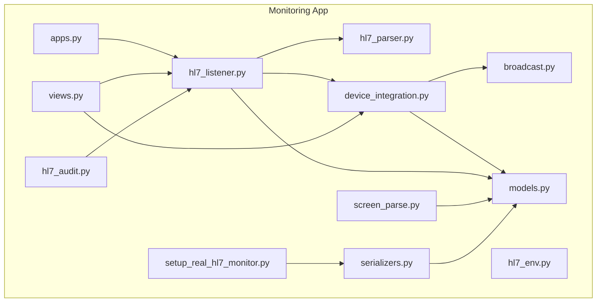
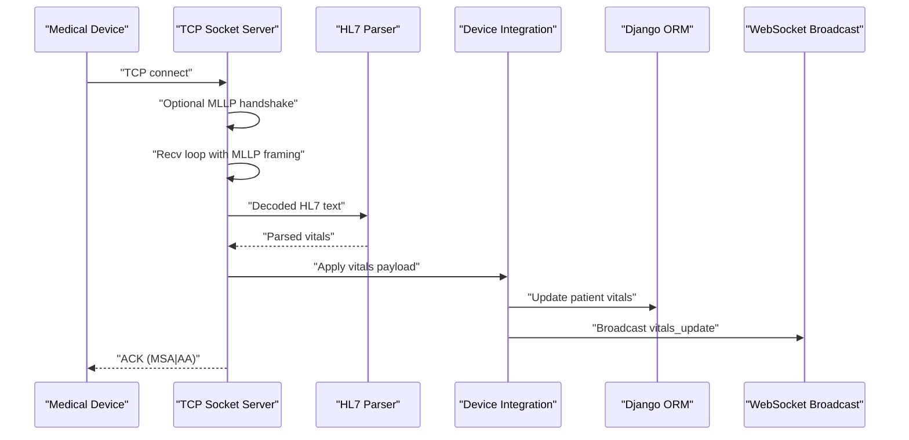
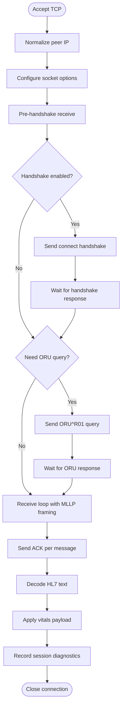
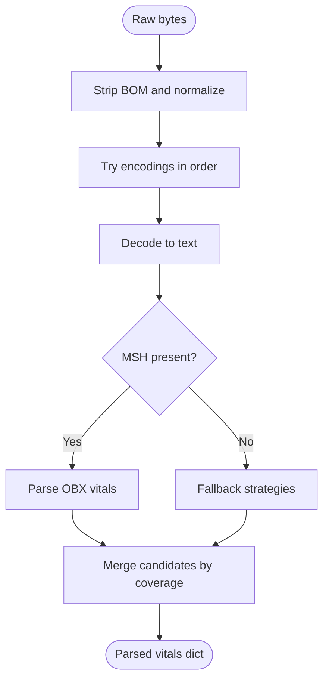
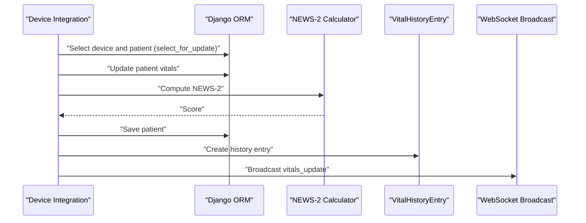
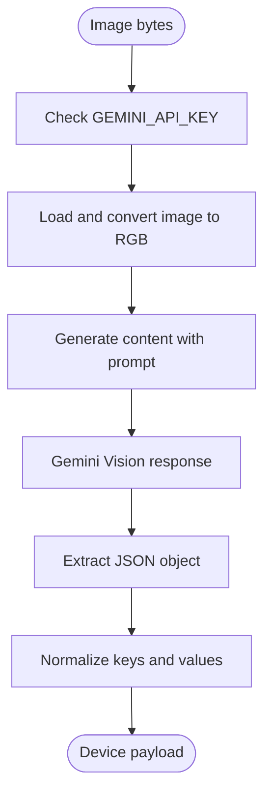
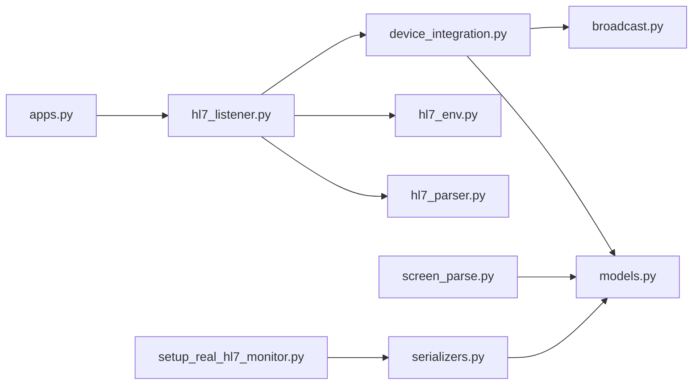

# HL7 Medical Device Integration

<cite>
**Referenced Files in This Document**
- [hl7_listener.py](file://backend/monitoring/hl7_listener.py)
- [hl7_parser.py](file://backend/monitoring/hl7_parser.py)
- [device_integration.py](file://backend/monitoring/device_integration.py)
- [screen_parse.py](file://backend/monitoring/screen_parse.py)
- [hl7_env.py](file://backend/monitoring/hl7_env.py)
- [models.py](file://backend/monitoring/models.py)
- [broadcast.py](file://backend/monitoring/broadcast.py)
- [apps.py](file://backend/monitoring/apps.py)
- [views.py](file://backend/monitoring/views.py)
- [hl7_audit.py](file://backend/monitoring/management/commands/hl7_audit.py)
- [setup_real_hl7_monitor.py](file://backend/monitoring/management/commands/setup_real_hl7_monitor.py)
- [serializers.py](file://backend/monitoring/serializers.py)
- [0009_handshake_default_true_for_hl7_devices.py](file://backend/monitoring/migrations/0009_handshake_default_true_for_hl7_devices.py)
</cite>

## Update Summary
**Changes Made**
- Updated MLLP handshake configuration section to reflect new --hl7-handshake command-line argument
- Updated default behavior for hl7_connect_handshake from True to False for new devices
- Added documentation for improved device setup procedures and zero-byte connection handling
- Updated serializer configuration details for K12 Creative Medical devices

## Table of Contents
1. [Introduction](#introduction)
2. [Project Structure](#project-structure)
3. [Core Components](#core-components)
4. [Architecture Overview](#architecture-overview)
5. [Detailed Component Analysis](#detailed-component-analysis)
6. [Dependency Analysis](#dependency-analysis)
7. [Performance Considerations](#performance-considerations)
8. [Troubleshooting Guide](#troubleshooting-guide)
9. [Security Considerations](#security-considerations)
10. [Practical Examples](#practical-examples)
11. [Conclusion](#conclusion)

## Introduction
This document explains the HL7/MLLP medical device integration system. It covers the TCP socket server implementation, HL7 message parsing, device integration logic, screen parsing for device configuration, environment configuration, and operational guidance for registration, troubleshooting, and extending support for new devices. The goal is to make the system understandable for both technical and non-technical users.

## Project Structure
The HL7 integration is implemented in the monitoring app under backend/monitoring. Key modules include:
- hl7_listener.py: TCP socket server, MLLP framing, connection handling, NAT traversal, and diagnostic reporting
- hl7_parser.py: HL7 message decoding, MLLP framing detection, segment extraction, and vital sign parsing
- device_integration.py: Mapping parsed data to patient records, updating vitals, broadcasting updates, and device resolution
- screen_parse.py: Extracting HL7 configuration from monitor screenshots via Gemini Vision
- hl7_env.py: Environment-driven diagnostics and logging controls
- models.py: Data models for devices, patients, and vitals
- broadcast.py: Real-time WebSocket broadcasting of vitals updates
- apps.py: Application startup hook that initializes the HL7 listener thread
- views.py: Web UI integration and diagnostics
- hl7_audit.py: Management command for HL7 diagnostics
- setup_real_hl7_monitor.py: Management command for setting up real K12 devices with explicit handshake control
- serializers.py: Device serializer with improved default behavior for new devices

**Diagram sources**
- [hl7_listener.py](file://backend/monitoring/hl7_listener.py)
- [hl7_parser.py](file://backend/monitoring/hl7_parser.py)
- [device_integration.py](file://backend/monitoring/device_integration.py)
- [screen_parse.py](file://backend/monitoring/screen_parse.py)
- [hl7_env.py](file://backend/monitoring/hl7_env.py)
- [models.py](file://backend/monitoring/models.py)
- [broadcast.py](file://backend/monitoring/broadcast.py)
- [apps.py](file://backend/monitoring/apps.py)
- [views.py](file://backend/monitoring/views.py)
- [hl7_audit.py](file://backend/monitoring/management/commands/hl7_audit.py)
- [setup_real_hl7_monitor.py](file://backend/monitoring/management/commands/setup_real_hl7_monitor.py)
- [serializers.py](file://backend/monitoring/serializers.py)

**Section sources**
- [apps.py:31-38](file://backend/monitoring/apps.py#L31-L38)
- [hl7_listener.py:737-755](file://backend/monitoring/hl7_listener.py#L737-L755)

## Core Components
- TCP Socket Server (MLLP): Accepts TCP connections, handles MLLP framing, decodes HL7 messages, sends ACK, and manages device-specific handshakes and queries
- HL7 Parser: Decodes HL7 text from various encodings, validates MSH presence, extracts segments, and parses vitals (HR, SpO2, BP, RR, Temp)
- Device Integration: Resolves devices by peer IP (including NAT loopback), applies vitals to patient records, calculates NEWS-2 score, and broadcasts updates
- Screen Parsing: Uses Gemini Vision to extract HL7 server IP, port, and network settings from monitor screenshots
- Environment Configuration: Controls logging and diagnostic verbosity for HL7 traffic
- Data Models: Define MonitorDevice, Patient, and VitalHistoryEntry relationships and constraints
- Management Commands: Provide specialized device setup and diagnostics capabilities

**Section sources**
- [hl7_listener.py:1-755](file://backend/monitoring/hl7_listener.py#L1-L755)
- [hl7_parser.py:1-530](file://backend/monitoring/hl7_parser.py#L1-L530)
- [device_integration.py:1-232](file://backend/monitoring/device_integration.py#L1-L232)
- [screen_parse.py:1-160](file://backend/monitoring/screen_parse.py#L1-L160)
- [hl7_env.py:1-33](file://backend/monitoring/hl7_env.py#L1-L33)
- [models.py:77-140](file://backend/monitoring/models.py#L77-L140)

## Architecture Overview
The HL7 integration follows a layered architecture:
- Transport Layer: TCP socket server with MLLP framing and ACK handling
- Protocol Layer: HL7 decoding and segment validation
- Business Logic Layer: Device resolution, vitals application, and alarm/score calculation
- Persistence Layer: Django ORM models for devices and patients
- Realtime Layer: WebSocket broadcasting of vitals updates

**Diagram sources**
- [hl7_listener.py:426-578](file://backend/monitoring/hl7_listener.py#L426-L578)
- [hl7_parser.py:487-530](file://backend/monitoring/hl7_parser.py#L487-L530)
- [device_integration.py:129-224](file://backend/monitoring/device_integration.py#L129-L224)
- [broadcast.py:10-19](file://backend/monitoring/broadcast.py#L10-L19)

## Detailed Component Analysis

### TCP Socket Server (MLLP) in hl7_listener.py
Key responsibilities:
- Port configuration and enablement via environment variables
- Accepting TCP connections and configuring socket options (TCP_NODELAY, SO_KEEPALIVE)
- MLLP framing detection and payload extraction
- Optional pre-handshake receive and device-specific handshake/query logic
- ACK generation for incoming HL7 messages
- Diagnostic collection and reporting
- NAT traversal support for device resolution

Port configuration and lifecycle:
- Listen host/port controlled by environment variables
- Threaded accept loop with retry on bind failure
- Local acceptance probe for pre-connection verification

MLLP framing and ACK:
- Detects MSH segment presence across encodings
- Peels MLLP frames (0x0B ... 0x1C0x0D or 0x1C0x0A)
- Sends ACK with MSA segment when configured

NAT traversal:
- Resolves devices by peer IP, supporting IPv4-mapped IPv6 normalization
- Single-device fallback for NAT environments
- Optional loopback exclusion for diagnostics

Diagnostic and logging:
- Tracks last payload, session counts, and raw TCP previews
- Environment-driven logging controls for raw TCP and first receive hex

Operational flow:
- Pre-handshake receive window
- Optional connect handshake
- Optional ORU query for certain devices
- Receive loop collecting one or more HL7 messages
- Per-message ACK and parsing
- Session recording and device online touch

**Diagram sources**
- [hl7_listener.py:426-578](file://backend/monitoring/hl7_listener.py#L426-L578)
- [hl7_listener.py:125-147](file://backend/monitoring/hl7_listener.py#L125-L147)
- [hl7_listener.py:372-414](file://backend/monitoring/hl7_listener.py#L372-L414)

**Section sources**
- [hl7_listener.py:692-702](file://backend/monitoring/hl7_listener.py#L692-L702)
- [hl7_listener.py:635-684](file://backend/monitoring/hl7_listener.py#L635-L684)
- [hl7_listener.py:345-354](file://backend/monitoring/hl7_listener.py#L345-L354)
- [hl7_listener.py:125-147](file://backend/monitoring/hl7_listener.py#L125-L147)
- [hl7_listener.py:99-123](file://backend/monitoring/hl7_listener.py#L99-L123)
- [hl7_listener.py:357-393](file://backend/monitoring/hl7_listener.py#L357-L393)
- [hl7_listener.py:395-413](file://backend/monitoring/hl7_listener.py#L395-L413)
- [hl7_listener.py:426-578](file://backend/monitoring/hl7_listener.py#L426-L578)
- [hl7_listener.py:635-684](file://backend/monitoring/hl7_listener.py#L635-L684)
- [hl7_listener.py:723-735](file://backend/monitoring/hl7_listener.py#L723-L735)

### HL7 Message Parsing in hl7_parser.py
Key responsibilities:
- Decode HL7 text from multiple encodings (UTF-8, UTF-16 LE/BE, CP1251, Latin-1, GBK)
- Validate MSH presence to confirm HL7 framing
- Segment extraction and summary for diagnostics
- Vitals parsing with robust fallback strategies:
  - Primary: OBX segment classification and numeric extraction
  - Fallback: Ordered numeric scan across pipe-delimited segments
  - Heuristic: Numeric sequences with domain-aware selection
  - Regex: Pattern-based extraction for NIBP and HR/SpO2 keywords

Parsing pipeline:
- Text normalization and MSH validation
- OBX-based parsing with classification by LOINC-like identifiers and vendor-specific tokens
- Numeric fallback scanning across OBR/NTE/ST/Z* segments
- Regex-based extraction for common patterns
- Candidate merging by coverage to maximize detected vitals

**Diagram sources**
- [hl7_parser.py:466-484](file://backend/monitoring/hl7_parser.py#L466-L484)
- [hl7_parser.py:487-529](file://backend/monitoring/hl7_parser.py#L487-L529)
- [hl7_parser.py:423-452](file://backend/monitoring/hl7_parser.py#L423-L452)
- [hl7_parser.py:148-196](file://backend/monitoring/hl7_parser.py#L148-L196)
- [hl7_parser.py:199-257](file://backend/monitoring/hl7_parser.py#L199-L257)
- [hl7_parser.py:278-339](file://backend/monitoring/hl7_parser.py#L278-L339)
- [hl7_parser.py:342-407](file://backend/monitoring/hl7_parser.py#L342-L407)

**Section sources**
- [hl7_parser.py:455-463](file://backend/monitoring/hl7_parser.py#L455-L463)
- [hl7_parser.py:466-484](file://backend/monitoring/hl7_parser.py#L466-L484)
- [hl7_parser.py:487-529](file://backend/monitoring/hl7_parser.py#L487-L529)
- [hl7_parser.py:423-452](file://backend/monitoring/hl7_parser.py#L423-L452)
- [hl7_parser.py:148-196](file://backend/monitoring/hl7_parser.py#L148-L196)
- [hl7_parser.py:199-257](file://backend/monitoring/hl7_parser.py#L199-L257)
- [hl7_parser.py:278-339](file://backend/monitoring/hl7_parser.py#L278-L339)
- [hl7_parser.py:342-407](file://backend/monitoring/hl7_parser.py#L342-L407)

### Device Integration in device_integration.py
Key responsibilities:
- Device resolution by peer IP with NAT-aware fallback
- Applying vitals payload atomically to patient records
- Updating device online status and timestamps
- Calculating NEWS-2 score and maintaining vital history
- Broadcasting vitals updates to clients via WebSocket

Device resolution:
- Matches by ip_address, local_ip, or hl7_peer_ip
- Supports single-device NAT fallback when enabled
- Excludes loopback unless explicitly allowed

Vitals application:
- Atomic transaction ensures consistency
- Updates HR, SpO2, BP, RR, Temp and computes NEWS-2
- Creates history entries and prunes older entries

Broadcasting:
- Sends vitals_update events scoped to clinic groups

**Diagram sources**
- [device_integration.py:129-224](file://backend/monitoring/device_integration.py#L129-L224)
- [broadcast.py:10-19](file://backend/monitoring/broadcast.py#L10-L19)

**Section sources**
- [device_integration.py:31-78](file://backend/monitoring/device_integration.py#L31-L78)
- [device_integration.py:129-224](file://backend/monitoring/device_integration.py#L129-L224)
- [device_integration.py:227-232](file://backend/monitoring/device_integration.py#L227-L232)
- [broadcast.py:10-19](file://backend/monitoring/broadcast.py#L10-L19)

### Screen Parsing for Device Configuration in screen_parse.py
Key responsibilities:
- Extract HL7 server IP, local IP, port, MAC address, subnet mask, and gateway from monitor screenshots
- Uses Gemini Vision API with a structured prompt to return valid JSON
- Normalizes extracted fields into a device creation payload

Workflow:
- Validates environment configuration (API key)
- Loads and normalizes image to RGB
- Generates content with Gemini Vision
- Parses and validates returned JSON
- Normalizes keys for serializer compatibility

**Diagram sources**
- [screen_parse.py:58-114](file://backend/monitoring/screen_parse.py#L58-L114)
- [screen_parse.py:117-159](file://backend/monitoring/screen_parse.py#L117-L159)

**Section sources**
- [screen_parse.py:58-114](file://backend/monitoring/screen_parse.py#L58-L114)
- [screen_parse.py:117-159](file://backend/monitoring/screen_parse.py#L117-L159)

### HL7 Environment Configuration in hl7_env.py
Controls:
- HL7_DEBUG: Enables comprehensive HL7 diagnostics logging
- HL7_LOG_RAW_TCP_RECV: Logs raw TCP hex when no MSH is found
- HL7_LOG_FIRST_RECV_HEX: Logs first TCP receive hex
- HL7_LOG_RAW_PREVIEW: Logs raw HL7 preview for diagnostics

These flags allow targeted debugging without enabling broad logs.

**Section sources**
- [hl7_env.py:18-32](file://backend/monitoring/hl7_env.py#L18-L32)

### Management Commands for Device Setup

#### setup_real_hl7_monitor.py
Provides specialized device setup for Creative Medical K12 monitors with explicit handshake control:

Key features:
- **--hl7-handshake**: Explicitly enables MLLP handshake for devices that require it
- **--no-hl7-handshake**: Explicitly disables MLLP handshake for devices that send zero-byte responses
- Automated device creation with proper defaults for K12 devices
- Comprehensive setup instructions and troubleshooting guidance

Device setup workflow:
- Creates clinic, department, room, and bed entities
- Sets up MonitorDevice with proper defaults for new devices
- Configures hl7_connect_handshake based on command-line arguments
- Provides step-by-step instructions for K12 device configuration

**Section sources**
- [setup_real_hl7_monitor.py:35-80](file://backend/monitoring/management/commands/setup_real_hl7_monitor.py#L35-L80)
- [setup_real_hl7_monitor.py:144-159](file://backend/monitoring/management/commands/setup_real_hl7_monitor.py#L144-L159)
- [setup_real_hl7_monitor.py:161-194](file://backend/monitoring/management/commands/setup_real_hl7_monitor.py#L161-L194)

### Serializer Configuration for Device Creation

#### serializers.py
Enhanced device creation with improved default behavior:

Key improvements:
- **New default behavior**: hl7_connect_handshake defaults to False for new devices
- **K12-specific optimization**: Avoids RST/0 byte responses that cause connection issues
- **Backward compatibility**: Maintains existing behavior for existing devices

Default configuration:
- hl7_connect_handshake: False (changed from True)
- hl7_port: 6006 (standard HL7 port)
- hl7_enabled: True (enabled by default)
- status: OFFLINE (initial status)

**Section sources**
- [serializers.py:251-263](file://backend/monitoring/serializers.py#L251-L263)

### Migration for Existing Devices

#### 0009_handshake_default_true_for_hl7_devices.py
Database migration that updates existing devices:

This migration automatically sets hl7_connect_handshake to True for all existing HL7-enabled devices where the value was previously None. This ensures backward compatibility while allowing new devices to use the improved default behavior.

**Section sources**
- [0009_handshake_default_true_for_hl7_devices.py:6-11](file://backend/monitoring/migrations/0009_handshake_default_true_for_hl7_devices.py#L6-L11)

## Dependency Analysis
- hl7_listener.py depends on hl7_parser.py for decoding and hl7_env.py for logging controls; it also integrates with device_integration.py for device resolution and vitals application
- device_integration.py depends on models.py for device/patient/vitals persistence and broadcast.py for real-time updates
- screen_parse.py depends on environment configuration and external libraries for image processing and Gemini Vision
- apps.py initializes the HL7 listener thread at application startup
- setup_real_hl7_monitor.py depends on serializers.py for device creation and models.py for database operations

**Diagram sources**
- [hl7_listener.py:1-755](file://backend/monitoring/hl7_listener.py#L1-L755)
- [hl7_parser.py:1-530](file://backend/monitoring/hl7_parser.py#L1-L530)
- [device_integration.py:1-232](file://backend/monitoring/device_integration.py#L1-L232)
- [screen_parse.py:1-160](file://backend/monitoring/screen_parse.py#L1-L160)
- [hl7_env.py:1-33](file://backend/monitoring/hl7_env.py#L1-L33)
- [models.py:77-140](file://backend/monitoring/models.py#L77-L140)
- [broadcast.py:1-20](file://backend/monitoring/broadcast.py#L1-L20)
- [apps.py:31-38](file://backend/monitoring/apps.py#L31-L38)
- [setup_real_hl7_monitor.py:15-22](file://backend/monitoring/management/commands/setup_real_hl7_monitor.py#L15-L22)
- [serializers.py:251-263](file://backend/monitoring/serializers.py#L251-L263)

**Section sources**
- [hl7_listener.py:61-62](file://backend/monitoring/hl7_listener.py#L61-L62)
- [hl7_listener.py:581-586](file://backend/monitoring/hl7_listener.py#L581-L586)
- [device_integration.py:14-18](file://backend/monitoring/device_integration.py#L14-L18)

## Performance Considerations
- Socket tuning: TCP_NODELAY reduces latency; SO_KEEPALIVE helps detect dead peers
- Non-blocking timeouts: Configurable receive timeout prevents indefinite blocking
- Efficient parsing: Multi-pass decoding and candidate merging minimize redundant work
- History pruning: Limits stored history entries to recent samples
- Concurrency: Per-connection threads process messages independently

Recommendations:
- Tune HL7_RECV_TIMEOUT_SEC for device behavior
- Monitor diagnostic counters to detect stalled sessions
- Use environment flags to limit verbose logging in production

## Troubleshooting Guide
Common issues and resolutions:
- No HL7 received despite TCP connection:
  - Verify HL7_LISTEN_ENABLED and HL7_LISTEN_PORT
  - Confirm device HL7 settings match server configuration
  - Check firewall/router for blocked ports
- Zero-byte sessions after TCP accept:
  - Use --no-hl7-handshake flag for devices that send RST/0 byte responses
  - Use --hl7-handshake flag for devices that require explicit handshake
  - Adjust HL7_RECV_BEFORE_HANDSHAKE_MS for early data windows
- MSH not detected:
  - Review HL7_LOG_RAW_TCP_RECV and HL7_LOG_RAW_PREVIEW for raw hex
  - Validate device HL7 framing and encoding
- NAT traversal problems:
  - Set HL7_NAT_SINGLE_DEVICE_FALLBACK to auto-bind single enabled device
  - Ensure hl7_peer_ip reflects the observed external IP

Diagnostics:
- Use hl7_audit management command for server status
- Check get_hl7_listener_status for thread and binding status
- Utilize probe_hl7_tcp_listening for local acceptance verification

**Updated** Enhanced troubleshooting guidance for zero-byte connection issues and explicit handshake configuration

**Section sources**
- [hl7_listener.py:520-540](file://backend/monitoring/hl7_listener.py#L520-L540)
- [hl7_listener.py:692-702](file://backend/monitoring/hl7_listener.py#L692-L702)
- [hl7_listener.py:705-721](file://backend/monitoring/hl7_listener.py#L705-L721)
- [hl7_listener.py:723-735](file://backend/monitoring/hl7_listener.py#L723-L735)
- [hl7_audit.py:36-36](file://backend/monitoring/management/commands/hl7_audit.py#L36-L36)
- [views.py:109-109](file://backend/monitoring/views.py#L109-L109)
- [setup_real_hl7_monitor.py:72-80](file://backend/monitoring/management/commands/setup_real_hl7_monitor.py#L72-L80)

## Security Considerations
- PHI handling: Raw HL7 previews may contain protected health information; restrict diagnostic logging to authorized personnel
- Authentication and authorization: Ensure WebSocket and API access are secured at the platform level
- Network isolation: Place the HL7 server behind appropriate firewalls and consider VLAN segmentation
- Input validation: Parser validates MSH presence and uses conservative numeric extraction to avoid injection
- Logging controls: Use HL7_DEBUG and related flags judiciously in production

## Practical Examples

### Device Registration via Screen Parsing
- Capture monitor screenshot displaying HL7 server configuration
- Ensure GEMINI_API_KEY is configured
- Parse image to extract server IP, local IP, port, and network info
- Normalize payload for device creation

**Section sources**
- [screen_parse.py:62-66](file://backend/monitoring/screen_parse.py#L62-L66)
- [screen_parse.py:58-114](file://backend/monitoring/screen_parse.py#L58-L114)
- [screen_parse.py:117-159](file://backend/monitoring/screen_parse.py#L117-L159)

### Manual Device Registration with Explicit Handshake Control
- Use setup_real_hl7_monitor.py with --hl7-handshake for devices requiring explicit handshake
- Use setup_real_hl7_monitor.py with --no-hl7-handshake for devices sending zero-byte responses
- Create a MonitorDevice record with ip_address/local_ip matching the device's observed IP
- Set hl7_enabled=True and configure hl7_port
- Assign bed and patient if applicable
- Optionally set hl7_peer_ip for NAT scenarios

**Updated** Added explicit handshake control options for device registration

**Section sources**
- [setup_real_hl7_monitor.py:35-80](file://backend/monitoring/management/commands/setup_real_hl7_monitor.py#L35-L80)
- [models.py:77-140](file://backend/monitoring/models.py#L77-L140)

### Troubleshooting Connection Issues
- Verify server listening with probe_hl7_tcp_listening
- Check hl7_audit output for enabled status and port
- Inspect diagnostic counters and last payload details
- Adjust HL7_SEND_CONNECT_HANDSHAKE or HL7_RECV_BEFORE_HANDSHAKE_MS as needed
- Use --no-hl7-handshake for devices with zero-byte connection issues

**Updated** Enhanced troubleshooting guidance for zero-byte connection issues

**Section sources**
- [hl7_listener.py:705-721](file://backend/monitoring/hl7_listener.py#L705-L721)
- [hl7_audit.py:36-36](file://backend/monitoring/management/commands/hl7_audit.py#L36-L36)
- [hl7_listener.py:21-33](file://backend/monitoring/hl7_listener.py#L21-L33)
- [setup_real_hl7_monitor.py:184-194](file://backend/monitoring/management/commands/setup_real_hl7_monitor.py#L184-L194)

### Extending Support for New Device Types
- Add device-specific handshake/query logic in hl7_listener.py if needed
- Extend parsing heuristics in hl7_parser.py for new segment patterns or vendor-specific identifiers
- Update device resolution logic in device_integration.py if new identification fields are required
- Validate with screen_parse.py for automated configuration extraction
- Use setup_real_hl7_monitor.py for testing new device configurations with explicit handshake control

**Updated** Added guidance for using setup_real_hl7_monitor.py for new device testing

**Section sources**
- [hl7_listener.py:372-393](file://backend/monitoring/hl7_listener.py#L372-L393)
- [hl7_listener.py:395-413](file://backend/monitoring/hl7_listener.py#L395-L413)
- [hl7_parser.py:278-339](file://backend/monitoring/hl7_parser.py#L278-L339)
- [device_integration.py:31-78](file://backend/monitoring/device_integration.py#L31-L78)
- [setup_real_hl7_monitor.py:15-22](file://backend/monitoring/management/commands/setup_real_hl7_monitor.py#L15-L22)

## Conclusion
The HL7/MLLP integration provides a robust, extensible framework for receiving and processing medical device data. Its modular design separates transport, protocol, business logic, persistence, and real-time updates, enabling reliable operation across diverse networking environments including NAT. With comprehensive diagnostics, environment-driven controls, and structured parsing, the system supports efficient device onboarding and maintenance.

The recent improvements include enhanced handshake configuration with explicit command-line control, optimized default behavior for new devices (particularly K12 Creative Medical devices), and improved troubleshooting guidance for zero-byte connection issues. These changes provide better compatibility with a wider range of medical devices while maintaining backward compatibility for existing installations.