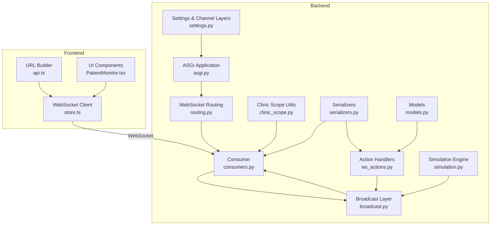
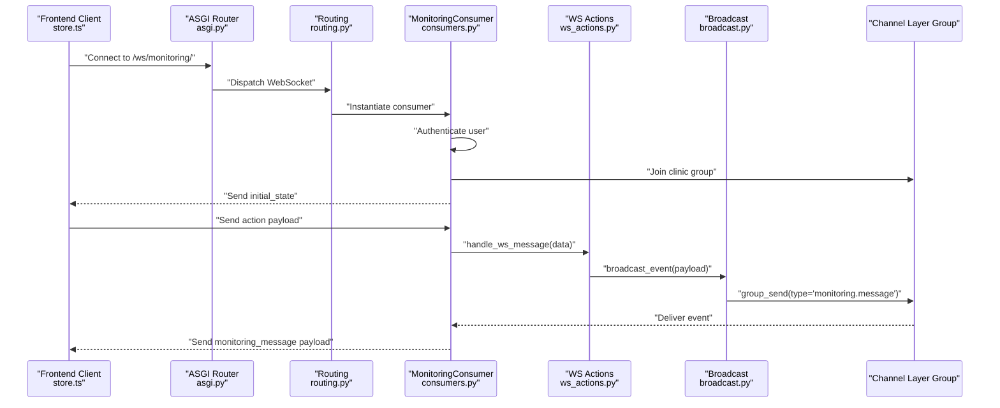
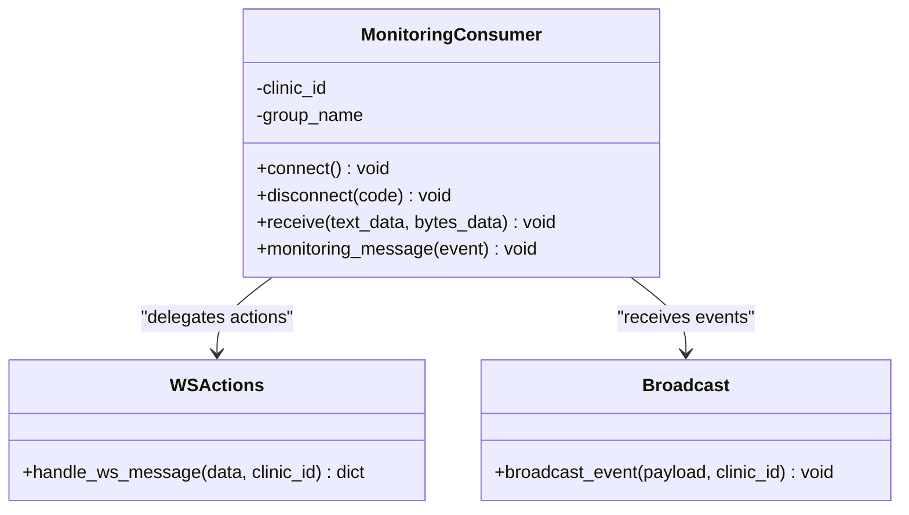
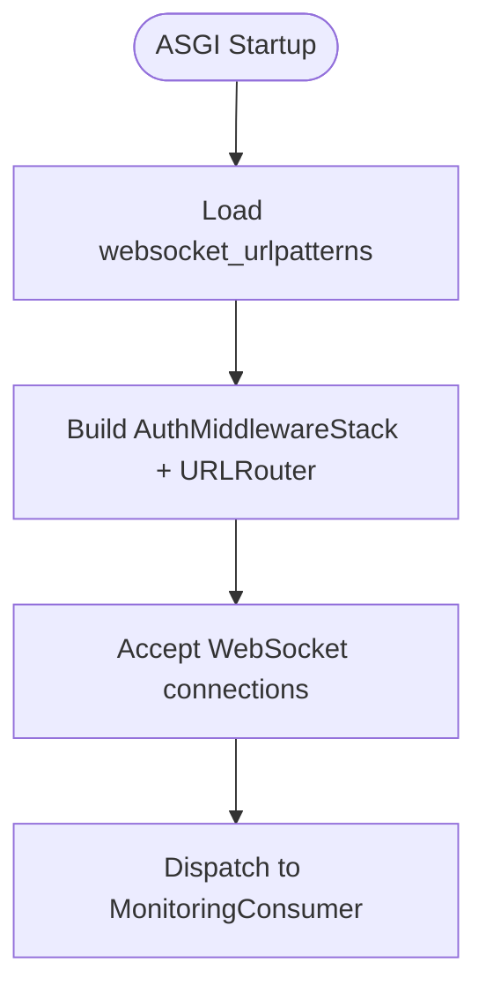
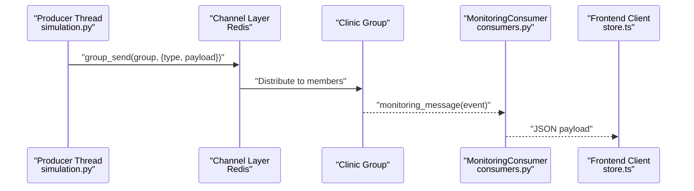
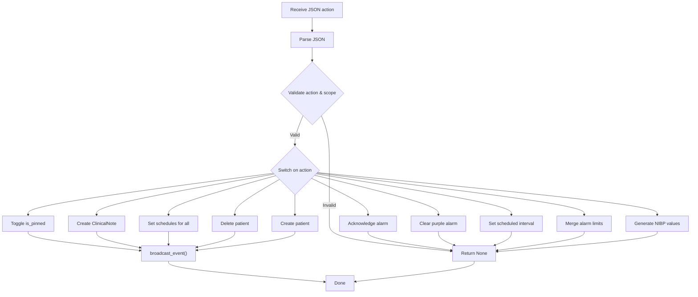
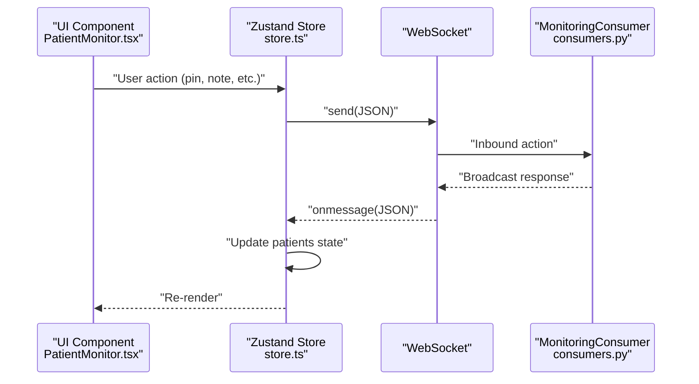
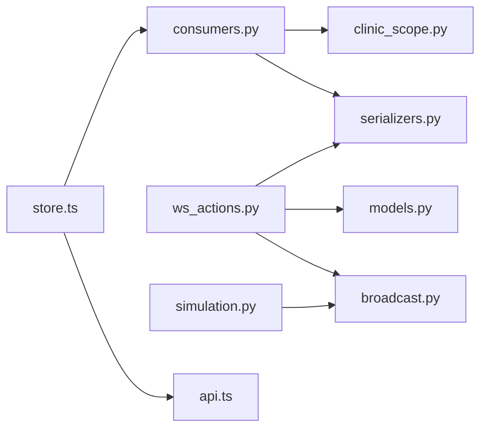

# Real-time Communication System

<cite>
**Referenced Files in This Document**
- [consumers.py](file://backend/monitoring/consumers.py)
- [routing.py](file://backend/monitoring/routing.py)
- [broadcast.py](file://backend/monitoring/broadcast.py)
- [ws_actions.py](file://backend/monitoring/ws_actions.py)
- [clinic_scope.py](file://backend/monitoring/clinic_scope.py)
- [serializers.py](file://backend/monitoring/serializers.py)
- [models.py](file://backend/monitoring/models.py)
- [asgi.py](file://backend/medicentral/asgi.py)
- [settings.py](file://backend/medicentral/settings.py)
- [simulation.py](file://backend/monitoring/simulation.py)
- [api.ts](file://frontend/src/lib/api.ts)
- [store.ts](file://frontend/src/store.ts)
- [PatientMonitor.tsx](file://frontend/src/components/PatientMonitor.tsx)
</cite>

## Table of Contents
1. [Introduction](#introduction)
2. [Project Structure](#project-structure)
3. [Core Components](#core-components)
4. [Architecture Overview](#architecture-overview)
5. [Detailed Component Analysis](#detailed-component-analysis)
6. [Dependency Analysis](#dependency-analysis)
7. [Performance Considerations](#performance-considerations)
8. [Troubleshooting Guide](#troubleshooting-guide)
9. [Conclusion](#conclusion)
10. [Appendices](#appendices)

## Introduction
This document explains the real-time communication system built with Django Channels. It covers WebSocket consumer implementation, routing configuration, broadcasting mechanisms, client-server actions, and frontend integration. It also addresses scalability, error handling, and debugging techniques for production deployments using Redis-backed channel layers.

## Project Structure
The real-time system spans backend Django Channels components and a React frontend:
- Backend: Consumers, routing, broadcasting, action handlers, models, serializers, and ASGI configuration
- Frontend: WebSocket client, message parsing, and UI components

**Diagram sources**
- [asgi.py:14-21](file://backend/medicentral/asgi.py#L14-L21)
- [routing.py:5-7](file://backend/monitoring/routing.py#L5-L7)
- [consumers.py:12-46](file://backend/monitoring/consumers.py#L12-L46)
- [broadcast.py:10-20](file://backend/monitoring/broadcast.py#L10-L20)
- [ws_actions.py:31-229](file://backend/monitoring/ws_actions.py#L31-L229)
- [clinic_scope.py:11-23](file://backend/monitoring/clinic_scope.py#L11-L23)
- [serializers.py:13-97](file://backend/monitoring/serializers.py#L13-L97)
- [models.py:5-224](file://backend/monitoring/models.py#L5-L224)
- [settings.py:170-183](file://backend/medicentral/settings.py#L170-L183)
- [simulation.py:283-290](file://backend/monitoring/simulation.py#L283-L290)
- [store.ts:219-352](file://frontend/src/store.ts#L219-L352)
- [api.ts:21-34](file://frontend/src/lib/api.ts#L21-L34)
- [PatientMonitor.tsx:1-372](file://frontend/src/components/PatientMonitor.tsx#L1-L372)

**Section sources**
- [asgi.py:14-21](file://backend/medicentral/asgi.py#L14-L21)
- [routing.py:5-7](file://backend/monitoring/routing.py#L5-L7)
- [consumers.py:12-46](file://backend/monitoring/consumers.py#L12-L46)
- [broadcast.py:10-20](file://backend/monitoring/broadcast.py#L10-L20)
- [ws_actions.py:31-229](file://backend/monitoring/ws_actions.py#L31-L229)
- [clinic_scope.py:11-23](file://backend/monitoring/clinic_scope.py#L11-L23)
- [serializers.py:13-97](file://backend/monitoring/serializers.py#L13-L97)
- [models.py:5-224](file://backend/monitoring/models.py#L5-L224)
- [settings.py:170-183](file://backend/medicentral/settings.py#L170-L183)
- [simulation.py:283-290](file://backend/monitoring/simulation.py#L283-L290)
- [store.ts:219-352](file://frontend/src/store.ts#L219-L352)
- [api.ts:21-34](file://frontend/src/lib/api.ts#L21-L34)
- [PatientMonitor.tsx:1-372](file://frontend/src/components/PatientMonitor.tsx#L1-L372)

## Core Components
- WebSocket Consumer: Handles authentication, group membership, initial state delivery, and inbound message routing
- Routing: Maps WebSocket URLs to consumers
- Broadcasting: Sends events to clinic-scoped groups
- Action Handlers: Processes client commands and persists changes
- Simulation Engine: Generates periodic vitals updates and broadcasts them
- Frontend Store: Manages WebSocket lifecycle, message parsing, and state updates

**Section sources**
- [consumers.py:12-46](file://backend/monitoring/consumers.py#L12-L46)
- [routing.py:5-7](file://backend/monitoring/routing.py#L5-L7)
- [broadcast.py:10-20](file://backend/monitoring/broadcast.py#L10-L20)
- [ws_actions.py:31-229](file://backend/monitoring/ws_actions.py#L31-L229)
- [simulation.py:283-290](file://backend/monitoring/simulation.py#L283-L290)
- [store.ts:219-352](file://frontend/src/store.ts#L219-L352)

## Architecture Overview
The system uses Django Channels with a Redis-backed channel layer for horizontal scaling. Clients connect to a single WebSocket endpoint and receive clinic-scoped updates. Backend workers (simulation thread) periodically compute vitals and broadcast updates. Client actions are processed synchronously via the consumer’s receive handler.

**Diagram sources**
- [asgi.py:14-21](file://backend/medicentral/asgi.py#L14-L21)
- [routing.py:5-7](file://backend/monitoring/routing.py#L5-L7)
- [consumers.py:13-46](file://backend/monitoring/consumers.py#L13-L46)
- [ws_actions.py:31-229](file://backend/monitoring/ws_actions.py#L31-L229)
- [broadcast.py:10-20](file://backend/monitoring/broadcast.py#L10-L20)

## Detailed Component Analysis

### WebSocket Consumer Implementation
The consumer enforces authentication, scopes clients to clinics, manages group membership, and routes inbound messages to action handlers. It sends an initial state snapshot upon connection and forwards broadcast events to connected clients.

Key behaviors:
- Authentication: Rejects anonymous or unauthenticated users
- Clinic scoping: Derives clinic from user profile and uses clinic-scoped group names
- Group management: Adds/removes channel to/from the clinic group
- Initial state: Serializes all patients for the clinic and sends as initial_state
- Message routing: Parses JSON payloads and delegates to synchronous action handler
- Event delivery: Receives monitoring_message events and forwards to client

**Diagram sources**
- [consumers.py:12-46](file://backend/monitoring/consumers.py#L12-L46)
- [ws_actions.py:31-229](file://backend/monitoring/ws_actions.py#L31-L229)
- [broadcast.py:10-20](file://backend/monitoring/broadcast.py#L10-L20)

**Section sources**
- [consumers.py:12-46](file://backend/monitoring/consumers.py#L12-L46)

### Routing Configuration
The routing module defines a single WebSocket URL pattern mapped to the consumer. The ASGI application wraps routing with authentication middleware and origin validation.

Key points:
- URL pattern: "/ws/monitoring/" -> MonitoringConsumer.as_asgi()
- Middleware stack: AuthMiddlewareStack + AllowedHostsOriginValidator
- Global routing composition via URLRouter

**Diagram sources**
- [routing.py:5-7](file://backend/monitoring/routing.py#L5-L7)
- [asgi.py:14-21](file://backend/medicentral/asgi.py#L14-L21)

**Section sources**
- [routing.py:5-7](file://backend/monitoring/routing.py#L5-L7)
- [asgi.py:14-21](file://backend/medicentral/asgi.py#L14-L21)

### Broadcasting System
Broadcasting uses a Redis-backed channel layer to deliver events to clinic-scoped groups. The broadcast function constructs the group name from clinic_id and sends a typed event payload.

Key behaviors:
- Group naming: Uses clinic-scoped group names derived from clinic_scope
- Event type: "monitoring.message"
- Payload forwarding: Consumer receives event and sends JSON to client

**Diagram sources**
- [broadcast.py:10-20](file://backend/monitoring/broadcast.py#L10-L20)
- [consumers.py:35-36](file://backend/monitoring/consumers.py#L35-L36)
- [simulation.py:267-269](file://backend/monitoring/simulation.py#L267-L269)

**Section sources**
- [broadcast.py:10-20](file://backend/monitoring/broadcast.py#L10-L20)
- [clinic_scope.py:11-12](file://backend/monitoring/clinic_scope.py#L11-L12)

### WebSocket Actions System
The action handler processes client commands atomically, validates permissions against the clinic scope, and triggers broadcasts for state changes. It supports toggling pin status, adding clinical notes, acknowledging/clearing alarms, scheduling checks, updating alarm limits, measuring NIBP, admitting/discharging patients.

Processing logic:
- Validation: Ensures patient belongs to the same clinic as the user
- Atomicity: Uses transaction.atomic for consistency
- Persistence: Saves model updates and refreshes related data
- Broadcasting: Emits clinic-scoped events for UI updates

**Diagram sources**
- [ws_actions.py:31-229](file://backend/monitoring/ws_actions.py#L31-L229)
- [broadcast.py:10-20](file://backend/monitoring/broadcast.py#L10-L20)

**Section sources**
- [ws_actions.py:31-229](file://backend/monitoring/ws_actions.py#L31-L229)

### Frontend WebSocket Integration
The frontend maintains a persistent WebSocket connection, parses incoming messages, and updates local state. It supports automatic reconnection and exposes convenience functions for sending actions.

Key behaviors:
- Connection lifecycle: connect() creates WebSocket, onopen sets wsConnected, onclose attempts reconnect
- Message parsing: Handles initial_state, vitals_update, patient_refresh, patient_admitted, patient_discharged
- Action dispatch: sendWs() serializes and sends action payloads
- Reconnection: Exponential backoff-like delay (constant 2.5s) with manual flag

**Diagram sources**
- [store.ts:187-217](file://frontend/src/store.ts#L187-L217)
- [store.ts:237-317](file://frontend/src/store.ts#L237-L317)
- [consumers.py:38-45](file://backend/monitoring/consumers.py#L38-L45)

**Section sources**
- [store.ts:219-352](file://frontend/src/store.ts#L219-L352)
- [api.ts:21-34](file://frontend/src/lib/api.ts#L21-L34)
- [PatientMonitor.tsx:1-372](file://frontend/src/components/PatientMonitor.tsx#L1-L372)

## Dependency Analysis
- Consumers depend on clinic_scope for group names and serializers for initial state
- Action handlers depend on models, serializers, and broadcast for event propagation
- Simulation engine depends on broadcast for distributing periodic updates
- Frontend store depends on api.ts for URL construction and consumes consumer events

**Diagram sources**
- [consumers.py:7-9](file://backend/monitoring/consumers.py#L7-L9)
- [ws_actions.py:12-15](file://backend/monitoring/ws_actions.py#L12-L15)
- [broadcast.py:7](file://backend/monitoring/broadcast.py#L7)
- [simulation.py:14](file://backend/monitoring/simulation.py#L14)
- [store.ts:3](file://frontend/src/store.ts#L3)
- [api.ts:21-34](file://frontend/src/lib/api.ts#L21-L34)

**Section sources**
- [consumers.py:7-9](file://backend/monitoring/consumers.py#L7-L9)
- [ws_actions.py:12-15](file://backend/monitoring/ws_actions.py#L12-L15)
- [broadcast.py:7](file://backend/monitoring/broadcast.py#L7)
- [simulation.py:14](file://backend/monitoring/simulation.py#L14)
- [store.ts:3](file://frontend/src/store.ts#L3)
- [api.ts:21-34](file://frontend/src/lib/api.ts#L21-L34)

## Performance Considerations
- Channel layer selection: Redis-backed channel layer enables horizontal scaling across multiple worker processes and nodes
- Connection pooling: Use a single long-lived WebSocket per clinic user; avoid frequent reconnects
- Automatic reconnection: Frontend implements a constant retry delay; consider exponential backoff for production
- Serialization overhead: Keep payloads minimal; the system already sends incremental updates
- Database transactions: Action handlers wrap writes in atomic blocks to prevent partial updates
- Simulation cadence: Tick rate is configurable; adjust for throughput vs. latency trade-offs
- Group membership: Efficiently scoped to clinic groups reduces fan-out cost

[No sources needed since this section provides general guidance]

## Troubleshooting Guide
Common issues and remedies:
- Authentication failures: Ensure user is authenticated and linked to a clinic profile; consumer closes with explicit codes for anonymous or missing clinic
- Group join errors: Verify channel layer availability and group naming consistency
- JSON parsing errors: Consumer ignores malformed payloads; ensure clients send valid JSON
- No updates received: Confirm frontend is subscribed to the correct clinic group and that broadcasts are invoked
- Reconnection loops: Manual disconnect flag prevents spurious reconnects; check frontend state transitions
- Redis connectivity: Validate REDIS_URL environment variable and network access

**Section sources**
- [consumers.py:15-21](file://backend/monitoring/consumers.py#L15-L21)
- [consumers.py:42-44](file://backend/monitoring/consumers.py#L42-L44)
- [store.ts:327-335](file://frontend/src/store.ts#L327-L335)
- [settings.py:170-183](file://backend/medicentral/settings.py#L170-L183)

## Conclusion
The system provides a robust, clinic-scoped real-time platform using Django Channels. It cleanly separates concerns between consumers, action handlers, and broadcasting, with a frontend that efficiently manages WebSocket lifecycle and updates. Redis-backed channel layers enable horizontal scaling, while careful transaction handling and minimal payload sizes support performance. The provided frontend store demonstrates best practices for connection management, message parsing, and reconnection.

[No sources needed since this section summarizes without analyzing specific files]

## Appendices

### Practical Examples

- Establishing a WebSocket connection
  - Use the frontend URL builder to construct the WebSocket URL
  - Connect via the store’s connect() method
  - On open, the consumer sends initial_state with all patients for the clinic

  **Section sources**
  - [api.ts:21-34](file://frontend/src/lib/api.ts#L21-L34)
  - [store.ts:219-352](file://frontend/src/store.ts#L219-L352)
  - [consumers.py:26-29](file://backend/monitoring/consumers.py#L26-L29)

- Subscribing to patient updates
  - Upon connection, the consumer adds the client to a clinic-scoped group
  - The simulation thread periodically broadcasts vitals_update events
  - The frontend merges incremental updates into local state

  **Section sources**
  - [consumers.py:23-25](file://backend/monitoring/consumers.py#L23-L25)
  - [simulation.py:267-269](file://backend/monitoring/simulation.py#L267-L269)
  - [store.ts:267-293](file://frontend/src/store.ts#L267-L293)

- Implementing custom event handlers
  - Extend the action handler with new actions in ws_actions.py
  - Ensure clinic scoping and atomic persistence
  - Emit a broadcast_event with a clinic-scoped payload
  - Add corresponding frontend message parsing in store.ts

  **Section sources**
  - [ws_actions.py:31-229](file://backend/monitoring/ws_actions.py#L31-L229)
  - [broadcast.py:10-20](file://backend/monitoring/broadcast.py#L10-L20)
  - [store.ts:237-317](file://frontend/src/store.ts#L237-L317)

### Scalability and Deployment Notes
- Channel layer: Redis is configured via environment variable; ensure high availability and proper sizing
- Worker processes: Multiple Daphne workers can share the same Redis backend
- Connection pooling: Prefer long-lived connections; batch frequent actions to reduce overhead
- Automatic reconnection: Tune retry delays and consider jitter to avoid thundering herd
- Performance optimization: Index database fields used in filters (e.g., bed.room.department.clinic_id)

**Section sources**
- [settings.py:170-183](file://backend/medicentral/settings.py#L170-L183)
- [ws_actions.py:18-28](file://backend/monitoring/ws_actions.py#L18-L28)