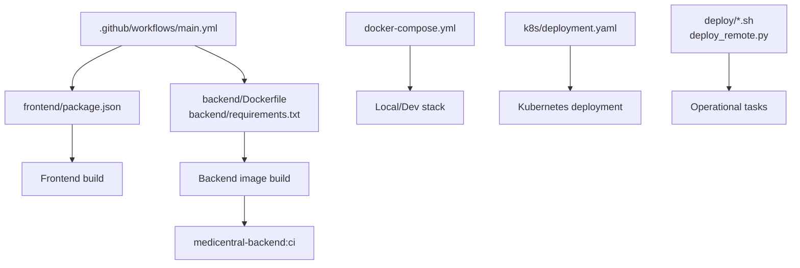
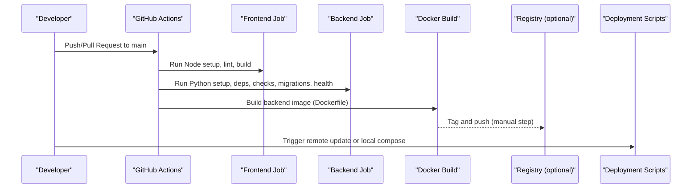
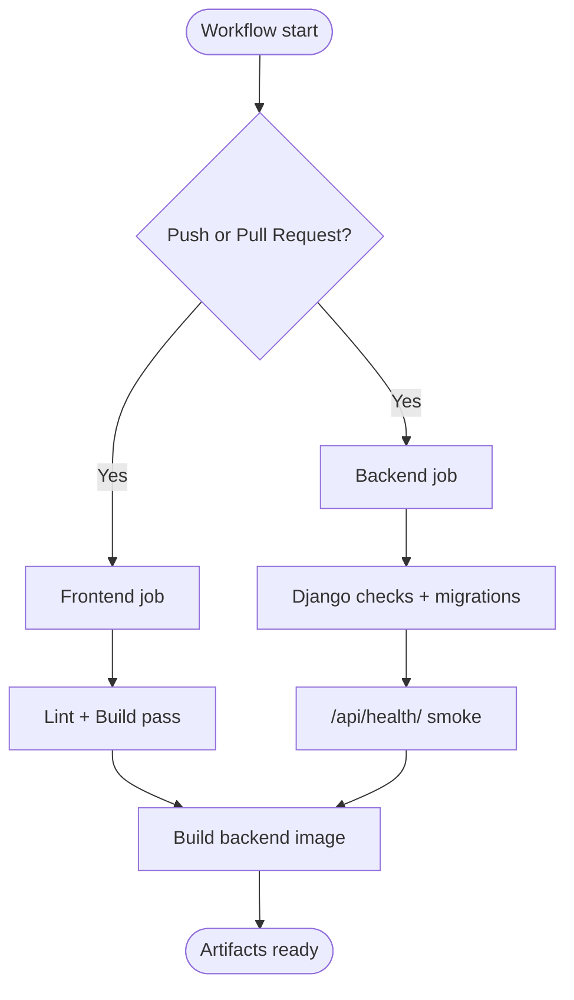
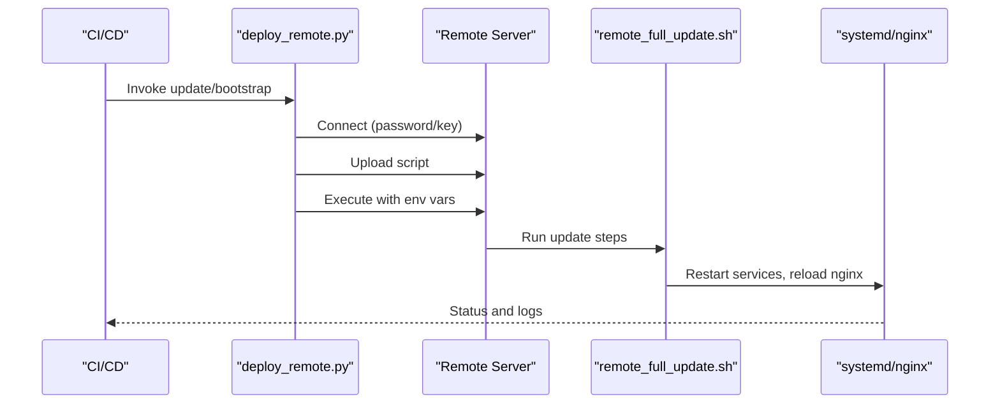
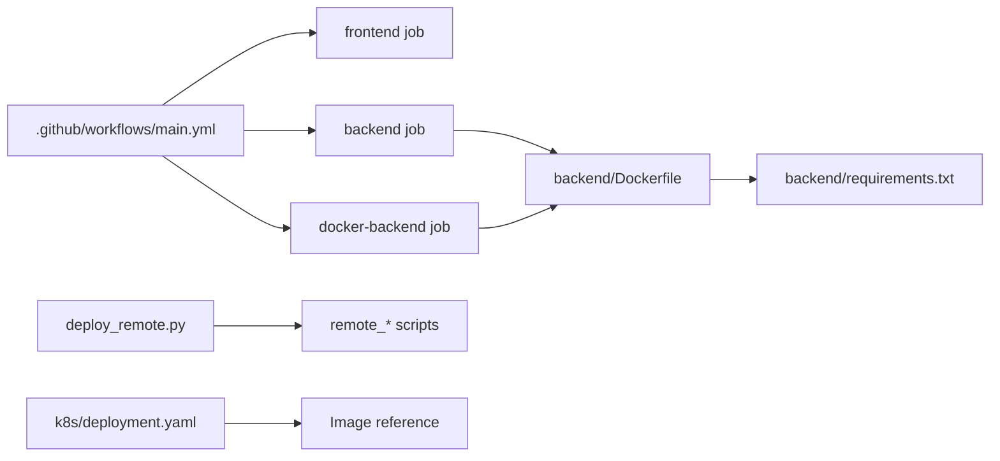

# CI/CD Pipeline

<cite>
**Referenced Files in This Document**
- [main.yml](file://.github/workflows/main.yml)
- [Dockerfile](file://backend/Dockerfile)
- [requirements.txt](file://backend/requirements.txt)
- [docker-compose.yml](file://docker-compose.yml)
- [deployment.yaml](file://k8s/deployment.yaml)
- [package.json](file://frontend/package.json)
- [remote_deploy.sh](file://deploy/remote_deploy.sh)
- [remote_full_update.sh](file://deploy/remote_full_update.sh)
- [deploy_remote.py](file://deploy/deploy_remote.py)
- [diagnose_hl7.py](file://backend/monitoring/management/commands/diagnose_hl7.py)
- [reset_monitoring_fresh.py](file://backend/monitoring/management/commands/reset_monitoring_fresh.py)
- [ensure_fjsti_login.py](file://backend/monitoring/management/commands/ensure_fjsti_login.py)
- [hl7_audit.py](file://backend/monitoring/management/commands/hl7_audit.py)
</cite>

## Table of Contents
1. [Introduction](#introduction)
2. [Project Structure](#project-structure)
3. [Core Components](#core-components)
4. [Architecture Overview](#architecture-overview)
5. [Detailed Component Analysis](#detailed-component-analysis)
6. [Dependency Analysis](#dependency-analysis)
7. [Performance Considerations](#performance-considerations)
8. [Troubleshooting Guide](#troubleshooting-guide)
9. [Conclusion](#conclusion)
10. [Appendices](#appendices)

## Introduction
This document describes the CI/CD pipeline for the Medicentral system using GitHub Actions. It explains triggers, automated testing, Docker image building, deployment automation, quality gates, and operational practices for secure, repeatable deployments across environments. It also outlines advanced deployment strategies and integration points for monitoring and notifications.

## Project Structure
The repository is organized into:
- GitHub Actions workflow definition under .github/workflows
- Backend Django application with Dockerfile and requirements
- Frontend React application with build scripts
- Deployment automation scripts for remote servers and local/staging via Docker Compose
- Kubernetes manifests for production-like orchestration
- Operational management commands for HL7 diagnostics and resets

**Diagram sources**
- [main.yml](file://.github/workflows/main.yml)
- [package.json](file://frontend/package.json)
- [Dockerfile](file://backend/Dockerfile)
- [requirements.txt](file://backend/requirements.txt)
- [docker-compose.yml](file://docker-compose.yml)
- [deployment.yaml](file://k8s/deployment.yaml)
- [remote_deploy.sh](file://deploy/remote_deploy.sh)
- [remote_full_update.sh](file://deploy/remote_full_update.sh)
- [deploy_remote.py](file://deploy/deploy_remote.py)

**Section sources**
- [.github/workflows/main.yml](file://.github/workflows/main.yml)
- [frontend/package.json](file://frontend/package.json)
- [backend/Dockerfile](file://backend/Dockerfile)
- [backend/requirements.txt](file://backend/requirements.txt)
- [docker-compose.yml](file://docker-compose.yml)
- [k8s/deployment.yaml](file://k8s/deployment.yaml)
- [deploy/remote_deploy.sh](file://deploy/remote_deploy.sh)
- [deploy/remote_full_update.sh](file://deploy/remote_full_update.sh)
- [deploy/deploy_remote.py](file://deploy/deploy_remote.py)

## Core Components
- CI Triggers: Pull requests and pushes to main/master
- Frontend Pipeline: Node setup, caching, lint, build
- Backend Pipeline: Python setup, caching, install deps, Django checks, migrations, health check
- Docker Build: Single-stage build for CI image tagging
- Deployment Automation: Paramiko-driven remote scripts and local/staging compose

**Section sources**
- [.github/workflows/main.yml](file://.github/workflows/main.yml)
- [frontend/package.json](file://frontend/package.json)
- [backend/Dockerfile](file://backend/Dockerfile)
- [backend/requirements.txt](file://backend/requirements.txt)

## Architecture Overview
The CI/CD pipeline consists of:
- GitHub Actions orchestrating frontend and backend jobs
- Docker image built from backend context
- Optional registry push (commented in workflow)
- Deployment automation via SSH to remote servers or local Docker Compose/Kubernetes

**Diagram sources**
- [.github/workflows/main.yml](file://.github/workflows/main.yml)
- [backend/Dockerfile](file://backend/Dockerfile)
- [deploy_remote.py](file://deploy/deploy_remote.py)
- [remote_full_update.sh](file://deploy/remote_full_update.sh)

## Detailed Component Analysis

### GitHub Actions Workflow
- Triggers: push to main/master, pull_request to main/master
- Jobs:
  - frontend: checkout, setup-node, cache pip, lint, build
  - backend: checkout, setup-python, cache pip, install deps, Django checks, migrations, health endpoint smoke test
  - docker-backend: depends on frontend and backend, builds backend image with a CI tag

Quality gates present:
- Lint and build for frontend
- Django checks and migrations validation
- Health endpoint verification

**Diagram sources**
- [.github/workflows/main.yml](file://.github/workflows/main.yml)

**Section sources**
- [.github/workflows/main.yml](file://.github/workflows/main.yml)

### Frontend Build and Quality Gates
- Node setup with caching based on lockfile
- Lint via TypeScript compiler (tsc)
- Build via Vite

Practical configuration pointers:
- Use npm ci for deterministic installs
- Keep lint and build as separate steps to surface issues early

**Section sources**
- [frontend/package.json](file://frontend/package.json)
- [.github/workflows/main.yml](file://.github/workflows/main.yml)

### Backend Testing and Validation
- Python setup with caching based on requirements
- Install dependencies from requirements.txt
- Django checks and migrations validation
- Health endpoint smoke test using Django test Client

Recommended additions for stronger quality gates:
- Unit/integration tests with coverage thresholds
- Security scanning (e.g., Bandit for Python)
- Dependency vulnerability scanning (e.g., Snyk or similar)

**Section sources**
- [backend/Dockerfile](file://backend/Dockerfile)
- [backend/requirements.txt](file://backend/requirements.txt)
- [.github/workflows/main.yml](file://.github/workflows/main.yml)

### Docker Image Building
- Multi-stage optimization is not currently implemented
- Current build copies all sources and installs dependencies in a single stage
- Exposes port 8000 and runs migrations + Daphne on startup

Layer optimization opportunities:
- Separate dependency installation from source copy
- Use .dockerignore to exclude unnecessary files
- Leverage build args for static collection and environment-specific tuning

Registry pushing:
- Registry step is commented in the workflow; uncomment and configure secrets for Docker Hub or GitHub Container Registry

**Section sources**
- [backend/Dockerfile](file://backend/Dockerfile)
- [.github/workflows/main.yml](file://.github/workflows/main.yml)

### Local/Staging Deployment with Docker Compose
- Redis and backend services
- Environment variables for development
- Volume mounts for SQLite persistence

Use this for local and staging environments prior to production rollout.

**Section sources**
- [docker-compose.yml](file://docker-compose.yml)

### Production Deployment with Kubernetes
- Deployment with probes and resource requests/limits
- Service and Ingress configuration
- Environment variables for production-ready settings

Use this as the baseline for production deployments.

**Section sources**
- [k8s/deployment.yaml](file://k8s/deployment.yaml)

### Remote Server Deployment Automation
Two complementary approaches:
- Bash scripts executed remotely (bootstrap/update, health checks, TLS)
- Python script using Paramiko to upload and execute scripts remotely

Key capabilities:
- Bootstrap new servers (install OS packages, clone repo, setup services)
- Full update (git pull, backend/frontend rebuild, nginx TLS, Daphne)
- Operational commands (HL7 diagnostics, reset to fresh, ensure admin login, audit)

**Diagram sources**
- [deploy_remote.py](file://deploy/deploy_remote.py)
- [remote_full_update.sh](file://deploy/remote_full_update.sh)

**Section sources**
- [deploy_remote.py](file://deploy/deploy_remote.py)
- [remote_deploy.sh](file://deploy/remote_deploy.sh)
- [remote_full_update.sh](file://deploy/remote_full_update.sh)

### Operational Management Commands
- HL7 diagnostics and audit
- Reset monitoring to fresh state
- Ensure initial admin login
- Utilities for HL7 listener configuration and troubleshooting

These commands support robust post-deployment verification and incident response.

**Section sources**
- [backend/monitoring/management/commands/diagnose_hl7.py](file://backend/monitoring/management/commands/diagnose_hl7.py)
- [backend/monitoring/management/commands/reset_monitoring_fresh.py](file://backend/monitoring/management/commands/reset_monitoring_fresh.py)
- [backend/monitoring/management/commands/ensure_fjsti_login.py](file://backend/monitoring/management/commands/ensure_fjsti_login.py)
- [backend/monitoring/management/commands/hl7_audit.py](file://backend/monitoring/management/commands/hl7_audit.py)

## Dependency Analysis
- Workflow depends on frontend and backend jobs to complete before building the image
- Backend Dockerfile depends on requirements.txt for dependency resolution
- Deployment scripts depend on environment variables and remote service availability
- Kubernetes manifest depends on image availability and cluster configuration

**Diagram sources**
- [.github/workflows/main.yml](file://.github/workflows/main.yml)
- [backend/Dockerfile](file://backend/Dockerfile)
- [backend/requirements.txt](file://backend/requirements.txt)
- [deploy_remote.py](file://deploy/deploy_remote.py)
- [k8s/deployment.yaml](file://k8s/deployment.yaml)

**Section sources**
- [.github/workflows/main.yml](file://.github/workflows/main.yml)
- [backend/Dockerfile](file://backend/Dockerfile)
- [backend/requirements.txt](file://backend/requirements.txt)
- [deploy_remote.py](file://deploy/deploy_remote.py)
- [k8s/deployment.yaml](file://k8s/deployment.yaml)

## Performance Considerations
- Cache dependencies: Node and Python caches are configured in the workflow
- Minimize Docker build context: Use .dockerignore to avoid unnecessary files
- Optimize multi-stage builds: Separate layers for dependencies vs. source to improve cache hits
- Parallelize frontend/backend jobs: Already configured in the workflow
- Reduce redeploy blast radius: Use rolling updates and probes in Kubernetes

## Troubleshooting Guide
Common issues and remedies:
- Frontend build failures: Verify Node version and lockfile integrity; ensure lint passes before build
- Backend migration errors: Review Django migration status and database connectivity; confirm environment variables
- Health endpoint failures: Check service logs, port exposure, and readiness/liveness probes
- Remote deployment failures: Confirm SSH credentials, firewall rules, and TLS certificate presence
- HL7 connectivity problems: Use diagnostic commands to inspect listener status and firewall configuration

Operational commands to aid troubleshooting:
- HL7 diagnostics and audit
- Reset to fresh state for clean testing
- Ensure admin login exists for initial access

**Section sources**
- [backend/monitoring/management/commands/diagnose_hl7.py](file://backend/monitoring/management/commands/diagnose_hl7.py)
- [backend/monitoring/management/commands/hl7_audit.py](file://backend/monitoring/management/commands/hl7_audit.py)
- [backend/monitoring/management/commands/reset_monitoring_fresh.py](file://backend/monitoring/management/commands/reset_monitoring_fresh.py)
- [backend/monitoring/management/commands/ensure_fjsti_login.py](file://backend/monitoring/management/commands/ensure_fjsti_login.py)

## Conclusion
The current CI/CD pipeline provides a solid foundation with frontend and backend validation, Docker image building, and robust deployment automation. To strengthen the pipeline, integrate unit/integration tests with coverage, add security scanning, and enable registry pushing. Adopt advanced deployment strategies such as canary releases and feature flags, and incorporate monitoring and notifications for deployment status and audit logging.

## Appendices

### Practical Examples and Best Practices
- Secrets and environment variables:
  - Store sensitive values in repository secrets and map to environment variables in CI
  - For remote deployments, pass environment variables to the remote scripts
- Deployment matrices:
  - Use matrix strategies to test multiple Node and Python versions
  - Parameterize environments (staging vs. production) via separate workflows or job matrices
- Advanced deployment strategies:
  - Canary: Gradually shift traffic to a new version using ingress rules or blue/green strategies
  - Feature flags: Gate features behind toggles managed by configuration
  - Automated rollback: On failed health checks, revert to previous image/tag and notify operators
- Monitoring and notifications:
  - Integrate with monitoring systems to track deployment metrics
  - Send notifications to Slack/Teams on success/failure
  - Enable audit logging for compliance (e.g., capture deployment events and artifacts)

[No sources needed since this section provides general guidance]