# Deployment & Operations

<cite>
**Referenced Files in This Document**
- [README.md](file://README.md)
- [docker-compose.yml](file://docker-compose.yml)
- [backend/Dockerfile](file://backend/Dockerfile)
- [backend/medicentral/settings.py](file://backend/medicentral/settings.py)
- [backend/medicentral/asgi.py](file://backend/medicentral/asgi.py)
- [backend/medicentral/wsgi.py](file://backend/medicentral/wsgi.py)
- [.github/workflows/main.yml](file://.github/workflows/main.yml)
- [k8s/namespace.yaml](file://k8s/namespace.yaml)
- [k8s/redis.yaml](file://k8s/redis.yaml)
- [k8s/deployment.yaml](file://k8s/deployment.yaml)
- [deploy/SERVER-SETUP.md](file://deploy/SERVER-SETUP.md)
- [deploy/nginx-clinicmonitoring.conf](file://deploy/nginx-clinicmonitoring.conf)
- [deploy/remote_deploy.sh](file://deploy/remote_deploy.sh)
- [deploy/remote_full_update.sh](file://deploy/remote_full_update.sh)
- [deploy/clinicmonitoring-daphne.service](file://deploy/clinicmonitoring-daphne.service)
- [deploy/clinicmonitoring-vitals-api.service](file://deploy/clinicmonitoring-vitals-api.service)
- [deploy/clinicmonitoring-hl7-gateway.service](file://deploy/clinicmonitoring-hl7-gateway.service)
- [deploy/clinicmonitoring-hl7-node.service](file://deploy/clinicmonitoring-hl7-node.service)
- [deploy/remote_vitals_stack.sh](file://deploy/remote_vitals_stack.sh)
- [deploy/remote_hl7_post_setup.sh](file://deploy/remote_hl7_post_setup.sh)
- [deploy/remote_hl7_node_enable.sh](file://deploy/remote_hl7_node_enable.sh)
- [deploy/remote_k12_setup_monitor.sh](file://deploy/remote_k12_setup_monitor.sh)
- [gateway/server.js](file://gateway/server.js)
- [server/app.js](file://server/app.js)
- [tools/hl7-tcp-server/server.js](file://tools/hl7-tcp-server/server.js)
- [portable-hl7-gateway/server.js](file://portable-hl7-gateway/server.js)
- [backend/monitoring/models.py](file://backend/monitoring/models.py)
- [backend/monitoring/management/commands/diagnose_hl7.py](file://backend/monitoring/management/commands/diagnose_hl7.py)
- [backend/monitoring/management/commands/reset_monitoring_fresh.py](file://backend/monitoring/management/commands/reset_monitoring_fresh.py)
</cite>

## Update Summary
**Changes Made**
- Added comprehensive documentation for new Node.js components and deployment infrastructure
- Documented systemd service configurations for Node.js applications
- Updated production deployment procedures to include vitals API and HL7 gateway services
- Enhanced Nginx proxy configuration to support dual-stack architecture
- Added operational procedures for Node.js service management and monitoring

## Table of Contents
1. [Introduction](#introduction)
2. [Project Structure](#project-structure)
3. [Core Components](#core-components)
4. [Architecture Overview](#architecture-overview)
5. [Detailed Component Analysis](#detailed-component-analysis)
6. [Dependency Analysis](#dependency-analysis)
7. [Performance Considerations](#performance-considerations)
8. [Troubleshooting Guide](#troubleshooting-guide)
9. [Conclusion](#conclusion)
10. [Appendices](#appendices)

## Introduction
This document provides comprehensive deployment and operations guidance for the Medicentral system across development, staging, and production environments. It covers local Docker Compose setup, Kubernetes deployment strategy, CI/CD via GitHub Actions, production reverse proxy and SSL configuration, operational procedures for health monitoring and database migrations, scaling and zero-downtime deployment strategies, security considerations, backup and disaster recovery, and performance monitoring with health checks and metrics collection.

**Updated** Added documentation for the new Node.js deployment infrastructure including systemd services, vitals API, HL7 gateway, and enhanced Nginx proxy configuration.

## Project Structure
The repository organizes deployment-related assets into focused areas:
- Local development: Docker Compose orchestrates backend and Redis, with SQLite persistence and internal network connectivity.
- Kubernetes: Namespace, Redis, and backend deployment manifests define staging and production topology.
- CI/CD: GitHub Actions workflow automates frontend lint/build, backend checks/migrations, and Docker image builds.
- Production operations: Server setup guide, Nginx configuration, systemd services, and remote deployment/update scripts for both Django and Node.js components.

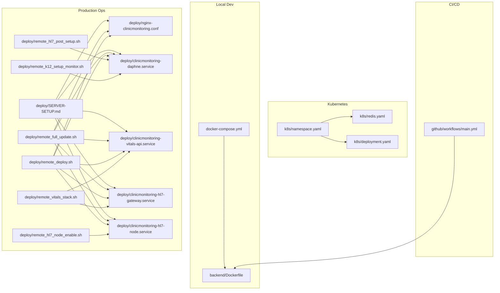

**Diagram sources**
- [docker-compose.yml:1-29](file://docker-compose.yml#L1-L29)
- [backend/Dockerfile:1-27](file://backend/Dockerfile#L1-L27)
- [k8s/namespace.yaml:1-5](file://k8s/namespace.yaml#L1-L5)
- [k8s/redis.yaml:1-41](file://k8s/redis.yaml#L1-L41)
- [k8s/deployment.yaml:1-101](file://k8s/deployment.yaml#L1-L101)
- [.github/workflows/main.yml:1-67](file://.github/workflows/main.yml#L1-L67)
- [deploy/SERVER-SETUP.md:1-151](file://deploy/SERVER-SETUP.md#L1-L151)
- [deploy/nginx-clinicmonitoring.conf:1-175](file://deploy/nginx-clinicmonitoring.conf#L1-L175)
- [deploy/clinicmonitoring-daphne.service:1-18](file://deploy/clinicmonitoring-daphne.service#L1-L18)
- [deploy/clinicmonitoring-vitals-api.service:1-17](file://deploy/clinicmonitoring-vitals-api.service#L1-L17)
- [deploy/clinicmonitoring-hl7-gateway.service:1-19](file://deploy/clinicmonitoring-hl7-gateway.service#L1-L19)
- [deploy/clinicmonitoring-hl7-node.service:1-19](file://deploy/clinicmonitoring-hl7-node.service#L1-L19)
- [deploy/remote_full_update.sh:1-127](file://deploy/remote_full_update.sh#L1-L127)
- [deploy/remote_deploy.sh:1-139](file://deploy/remote_deploy.sh#L1-L139)
- [deploy/remote_vitals_stack.sh:1-75](file://deploy/remote_vitals_stack.sh#L1-L75)
- [deploy/remote_hl7_post_setup.sh:1-55](file://deploy/remote_hl7_post_setup.sh#L1-L55)
- [deploy/remote_hl7_node_enable.sh:1-22](file://deploy/remote_hl7_node_enable.sh#L1-L22)
- [deploy/remote_k12_setup_monitor.sh:1-21](file://deploy/remote_k12_setup_monitor.sh#L1-L21)

**Section sources**
- [README.md:18-109](file://README.md#L18-L109)
- [docker-compose.yml:1-29](file://docker-compose.yml#L1-L29)
- [k8s/namespace.yaml:1-5](file://k8s/namespace.yaml#L1-L5)
- [k8s/redis.yaml:1-41](file://k8s/redis.yaml#L1-L41)
- [k8s/deployment.yaml:1-101](file://k8s/deployment.yaml#L1-L101)
- [.github/workflows/main.yml:1-67](file://.github/workflows/main.yml#L1-L67)
- [deploy/SERVER-SETUP.md:1-151](file://deploy/SERVER-SETUP.md#L1-L151)
- [deploy/nginx-clinicmonitoring.conf:1-175](file://deploy/nginx-clinicmonitoring.conf#L1-L175)
- [deploy/clinicmonitoring-daphne.service:1-18](file://deploy/clinicmonitoring-daphne.service#L1-L18)
- [deploy/clinicmonitoring-vitals-api.service:1-17](file://deploy/clinicmonitoring-vitals-api.service#L1-L17)
- [deploy/clinicmonitoring-hl7-gateway.service:1-19](file://deploy/clinicmonitoring-hl7-gateway.service#L1-L19)
- [deploy/clinicmonitoring-hl7-node.service:1-19](file://deploy/clinicmonitoring-hl7-node.service#L1-L19)
- [deploy/remote_full_update.sh:1-127](file://deploy/remote_full_update.sh#L1-L127)
- [deploy/remote_deploy.sh:1-139](file://deploy/remote_deploy.sh#L1-L139)
- [deploy/remote_vitals_stack.sh:1-75](file://deploy/remote_vitals_stack.sh#L1-L75)
- [deploy/remote_hl7_post_setup.sh:1-55](file://deploy/remote_hl7_post_setup.sh#L1-L55)
- [deploy/remote_hl7_node_enable.sh:1-22](file://deploy/remote_hl7_node_enable.sh#L1-L22)
- [deploy/remote_k12_setup_monitor.sh:1-21](file://deploy/remote_k12_setup_monitor.sh#L1-L21)

## Core Components
- Backend service: Django application exposing REST APIs and WebSockets via Daphne and Channels. Health endpoint is used for probes and smoke tests.
- Redis: Required for multi-replica WebSocket channel synchronization; optional for single-instance deployments.
- Frontend: Built and served statically; supports separate API domain or combined SPA domain.
- Node.js Vitals API: Express-based service handling HL7 vitals data with WebSocket broadcasting and dashboard UI.
- HL7 Gateway: Node.js TCP server processing HL7 MLLP messages and forwarding to vitals API.
- HL7 TCP Bridge: Optional Node.js service bridging physical medical devices to Django HL7 endpoint.
- Reverse proxy: Nginx handles TLS termination, WebSocket upgrades, and proxying to both Django and Node.js services.
- CI/CD: GitHub Actions validates frontend, backend, and builds Docker images; registry and cluster deployment can be extended using repository secrets.

Key operational environment variables and their roles:
- DJANGO_DEBUG, DJANGO_SECRET_KEY, DJANGO_ALLOWED_HOSTS, CORS_ALLOWED_ORIGINS, DJANGO_BEHIND_PROXY, DJANGO_SECURE_SSL_REDIRECT
- DATABASE_URL or DJANGO_SQLITE_PATH
- REDIS_URL for Channels
- GEMINI_API_KEY for AI features
- HL7_* settings for real device monitoring
- HL7_BRIDGE_TOKEN for secure HL7 bridge communication
- NODE_ENV for Node.js service configuration

**Section sources**
- [README.md:59-109](file://README.md#L59-L109)
- [backend/medicentral/settings.py:29-218](file://backend/medicentral/settings.py#L29-L218)
- [backend/medicentral/asgi.py:1-22](file://backend/medicentral/asgi.py#L1-L22)
- [backend/medicentral/wsgi.py:1-8](file://backend/medicentral/wsgi.py#L1-L8)
- [k8s/deployment.yaml:28-44](file://k8s/deployment.yaml#L28-L44)
- [k8s/redis.yaml:18-20](file://k8s/redis.yaml#L18-L20)
- [deploy/nginx-clinicmonitoring.conf:24-78](file://deploy/nginx-clinicmonitoring.conf#L24-L78)
- [deploy/clinicmonitoring-vitals-api.service:9-11](file://deploy/clinicmonitoring-vitals-api.service#L9-L11)
- [deploy/clinicmonitoring-hl7-gateway.service:9-12](file://deploy/clinicmonitoring-hl7-gateway.service#L9-L12)
- [deploy/clinicmonitoring-hl7-node.service:9-12](file://deploy/clinicmonitoring-hl7-node.service#L9-L12)
- [.github/workflows/main.yml:39-51](file://.github/workflows/main.yml#L39-L51)

## Architecture Overview
The system integrates a React frontend, Django backend with Daphne/Channels for WebSockets, and Redis for channel synchronization. A new dual-stack architecture now includes Node.js services for HL7 vitals processing and gateway functionality. In production, Nginx terminates TLS and proxies HTTP/WebSocket traffic to both backend pods and Node.js services. Kubernetes manages namespaces, deployments, services, and ingress.

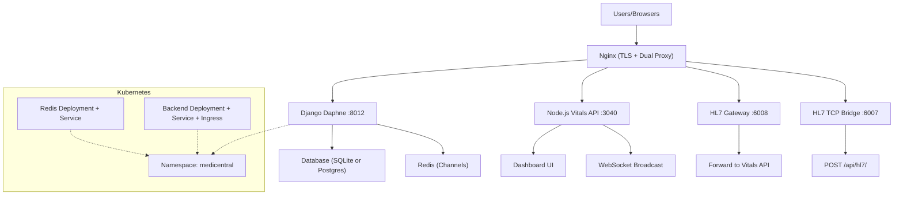

**Diagram sources**
- [k8s/namespace.yaml:1-5](file://k8s/namespace.yaml#L1-L5)
- [k8s/redis.yaml:1-41](file://k8s/redis.yaml#L1-L41)
- [k8s/deployment.yaml:65-101](file://k8s/deployment.yaml#L65-L101)
- [deploy/nginx-clinicmonitoring.conf:39-78](file://deploy/nginx-clinicmonitoring.conf#L39-L78)
- [deploy/clinicmonitoring-vitals-api.service:9-11](file://deploy/clinicmonitoring-vitals-api.service#L9-L11)
- [deploy/clinicmonitoring-hl7-gateway.service:9-12](file://deploy/clinicmonitoring-hl7-gateway.service#L9-L12)
- [deploy/clinicmonitoring-hl7-node.service:9-12](file://deploy/clinicmonitoring-hl7-node.service#L9-L12)

**Section sources**
- [README.md:77-88](file://README.md#L77-L88)
- [k8s/deployment.yaml:1-101](file://k8s/deployment.yaml#L1-L101)
- [k8s/redis.yaml:1-41](file://k8s/redis.yaml#L1-L41)
- [deploy/nginx-clinicmonitoring.conf:1-175](file://deploy/nginx-clinicmonitoring.conf#L1-L175)
- [deploy/clinicmonitoring-vitals-api.service:1-17](file://deploy/clinicmonitoring-vitals-api.service#L1-L17)
- [deploy/clinicmonitoring-hl7-gateway.service:1-19](file://deploy/clinicmonitoring-hl7-gateway.service#L1-L19)
- [deploy/clinicmonitoring-hl7-node.service:1-19](file://deploy/clinicmonitoring-hl7-node.service#L1-L19)

## Detailed Component Analysis

### Local Development with Docker Compose
- Services: Redis and backend; backend exposes port 8000, mounts SQLite data directory, and sets Redis URL for Channels.
- Environment: Debug mode, allowed hosts, and SQLite path configured for local runs.
- Volume mounts: Ensures SQLite persistence across container rebuilds.

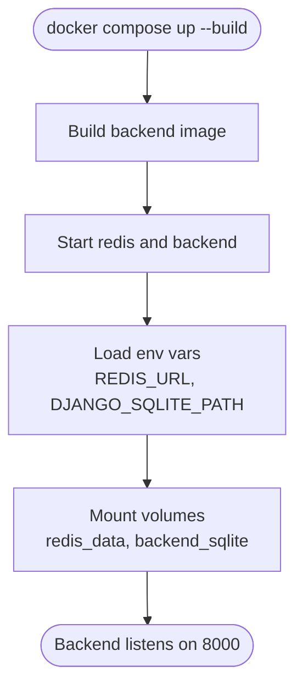

**Diagram sources**
- [docker-compose.yml:10-25](file://docker-compose.yml#L10-L25)
- [backend/Dockerfile:20-26](file://backend/Dockerfile#L20-L26)

**Section sources**
- [README.md:69-76](file://README.md#L69-L76)
- [docker-compose.yml:1-29](file://docker-compose.yml#L1-L29)
- [backend/Dockerfile:1-27](file://backend/Dockerfile#L1-L27)

### Kubernetes Deployment Strategy
- Namespace: Dedicated namespace isolates resources.
- Redis: Separate deployment and service for Channels synchronization across backend replicas.
- Backend: Deployment with two replicas, ClusterIP service, and Ingress with WebSocket support and timeouts.
- Probes: Liveness and readiness probes use the health endpoint.
- Secrets: Recommended to store sensitive keys using Sealed Secrets or External Secrets.

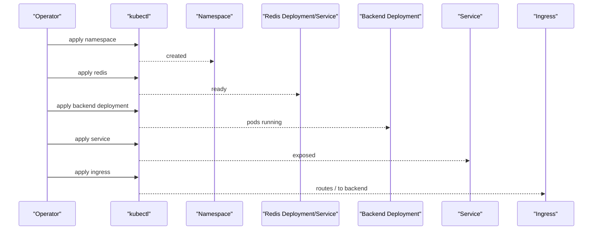

**Diagram sources**
- [k8s/namespace.yaml:1-5](file://k8s/namespace.yaml#L1-L5)
- [k8s/redis.yaml:1-41](file://k8s/redis.yaml#L1-L41)
- [k8s/deployment.yaml:1-101](file://k8s/deployment.yaml#L1-L101)

**Section sources**
- [README.md:77-88](file://README.md#L77-L88)
- [k8s/namespace.yaml:1-5](file://k8s/namespace.yaml#L1-L5)
- [k8s/redis.yaml:1-41](file://k8s/redis.yaml#L1-L41)
- [k8s/deployment.yaml:1-101](file://k8s/deployment.yaml#L1-L101)

### CI/CD Pipeline with GitHub Actions
- Jobs:
  - Frontend: Install Node, lint, and build.
  - Backend: Install Python, run checks, migrations, and a smoke test against the health endpoint.
  - Docker: Build backend image for CI.
- Extensibility: Registry push and cluster deployment can be added using repository secrets.

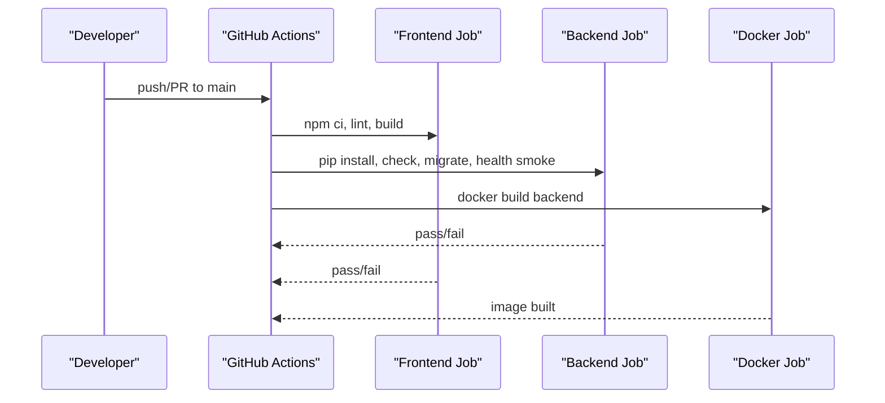

**Diagram sources**
- [.github/workflows/main.yml:10-25](file://.github/workflows/main.yml#L10-L25)
- [.github/workflows/main.yml:26-51](file://.github/workflows/main.yml#L26-L51)
- [.github/workflows/main.yml:53-61](file://.github/workflows/main.yml#L53-L61)

**Section sources**
- [README.md:101-104](file://README.md#L101-L104)
- [.github/workflows/main.yml:1-67](file://.github/workflows/main.yml#L1-67)

### Production Deployment with Nginx and SSL
- Server setup: Installs OS packages, configures Python virtualenv, migrates, collects static, sets up systemd service, and configures Nginx and Certbot.
- Nginx configuration: Handles HTTP to HTTPS redirect, TLS termination, proxying API and WebSocket paths, and serving static assets.
- Remote update script: Automates full update including Git sync, backend/frontend rebuild, systemd restart, firewall rules, and optional HTTPS provisioning.
- **Updated** Node.js services: Includes vitals API, HL7 gateway, and optional TCP bridge services with dedicated systemd units.

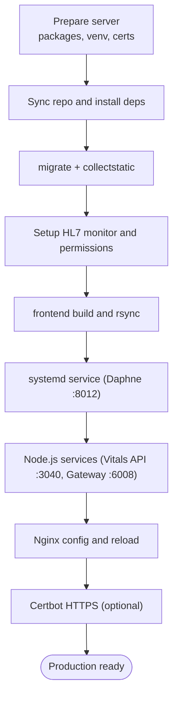

**Diagram sources**
- [deploy/SERVER-SETUP.md:13-44](file://deploy/SERVER-SETUP.md#L13-L44)
- [deploy/SERVER-SETUP.md:69-101](file://deploy/SERVER-SETUP.md#L69-L101)
- [deploy/remote_deploy.sh:10-139](file://deploy/remote_deploy.sh#L10-L139)
- [deploy/remote_full_update.sh:15-127](file://deploy/remote_full_update.sh#L15-L127)
- [deploy/nginx-clinicmonitoring.conf:17-175](file://deploy/nginx-clinicmonitoring.conf#L17-L175)
- [deploy/clinicmonitoring-vitals-api.service:9-11](file://deploy/clinicmonitoring-vitals-api.service#L9-L11)
- [deploy/clinicmonitoring-hl7-gateway.service:9-12](file://deploy/clinicmonitoring-hl7-gateway.service#L9-L12)

**Section sources**
- [README.md:53-68](file://README.md#L53-L68)
- [deploy/SERVER-SETUP.md:1-151](file://deploy/SERVER-SETUP.md#L1-L151)
- [deploy/nginx-clinicmonitoring.conf:1-175](file://deploy/nginx-clinicmonitoring.conf#L1-L175)
- [deploy/remote_deploy.sh:1-139](file://deploy/remote_deploy.sh#L1-L139)
- [deploy/remote_full_update.sh:1-127](file://deploy/remote_full_update.sh#L1-L127)
- [deploy/clinicmonitoring-daphne.service:1-18](file://deploy/clinicmonitoring-daphne.service#L1-L18)
- [deploy/clinicmonitoring-vitals-api.service:1-17](file://deploy/clinicmonitoring-vitals-api.service#L1-L17)
- [deploy/clinicmonitoring-hl7-gateway.service:1-19](file://deploy/clinicmonitoring-hl7-gateway.service#L1-L19)

### Node.js Services Infrastructure

#### Vitals API Service
A new Express-based service handles HL7 vitals data processing, WebSocket broadcasting, and dashboard UI serving. It operates on port 3040 and provides REST endpoints for vitals data and WebSocket connections for real-time updates.

**Section sources**
- [server/app.js:1-130](file://server/app.js#L1-L130)
- [deploy/clinicmonitoring-vitals-api.service:1-17](file://deploy/clinicmonitoring-vitals-api.service#L1-L17)

#### HL7 Gateway Service
Node.js TCP server that processes HL7 MLLP messages from medical devices and forwards parsed vitals data to the Vitals API. It listens on port 6008 and supports both MLLP framing and bare HL7 messages.

**Section sources**
- [gateway/server.js:1-326](file://gateway/server.js#L1-L326)
- [deploy/clinicmonitoring-hl7-gateway.service:1-19](file://deploy/clinicmonitoring-hl7-gateway.service#L1-L19)

#### HL7 TCP Bridge Service
Optional Node.js service that bridges physical medical devices to Django's HL7 endpoint. It processes HL7 messages and posts them to `/api/hl7/` with authentication token validation.

**Section sources**
- [tools/hl7-tcp-server/server.js:1-320](file://tools/hl7-tcp-server/server.js#L1-L320)
- [deploy/clinicmonitoring-hl7-node.service:1-19](file://deploy/clinicmonitoring-hl7-node.service#L1-L19)

### Nginx Proxy Configuration for Dual-Stack Architecture
Enhanced Nginx configuration now supports both Django and Node.js services through dedicated upstream blocks and location-based routing.

**Section sources**
- [deploy/nginx-clinicmonitoring.conf:17-175](file://deploy/nginx-clinicmonitoring.conf#L17-L175)

### Operational Procedures and Health Monitoring
- Health endpoint: Returns system status and database connectivity; used for readiness/liveness probes and smoke tests.
- Database migrations: Applied during CI and production updates; SQLite or PostgreSQL supported via environment variables.
- HL7 diagnostics: Management command to diagnose listener status, firewall, NAT peer IP, and payload timing.
- Reset monitoring: Clear existing data and recreate a fresh HL7/K12 setup.
- **Updated** Node.js service monitoring: Systemd service management, log monitoring, and health checks for all Node.js components.

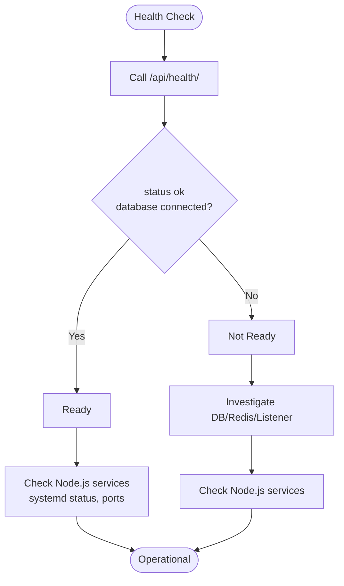

**Diagram sources**
- [k8s/deployment.yaml:52-63](file://k8s/deployment.yaml#L52-L63)
- [.github/workflows/main.yml:41-51](file://.github/workflows/main.yml#L41-L51)
- [backend/monitoring/management/commands/diagnose_hl7.py:1-182](file://backend/monitoring/management/commands/diagnose_hl7.py#L1-L182)

**Section sources**
- [README.md:97-99](file://README.md#L97-L99)
- [k8s/deployment.yaml:52-63](file://k8s/deployment.yaml#L52-L63)
- [.github/workflows/main.yml:41-51](file://.github/workflows/main.yml#L41-L51)
- [backend/monitoring/management/commands/diagnose_hl7.py:1-182](file://backend/monitoring/management/commands/diagnose_hl7.py#L1-L182)
- [backend/monitoring/management/commands/reset_monitoring_fresh.py:1-49](file://backend/monitoring/management/commands/reset_monitoring_fresh.py#L1-L49)

### Scaling and Zero-Downtime Deployments
- Horizontal scaling: Increase backend replicas; ensure Redis is deployed for channel synchronization.
- Rolling updates: Kubernetes rolling strategy updates pods while maintaining availability.
- Blue/green or canary: Use multiple deployments behind a single service and switch traffic gradually.
- Health checks: Leverage readiness probes to prevent traffic routing until the service is healthy.
- **Updated** Node.js service scaling: Each Node.js service can be scaled independently based on HL7 traffic volume and WebSocket connections.

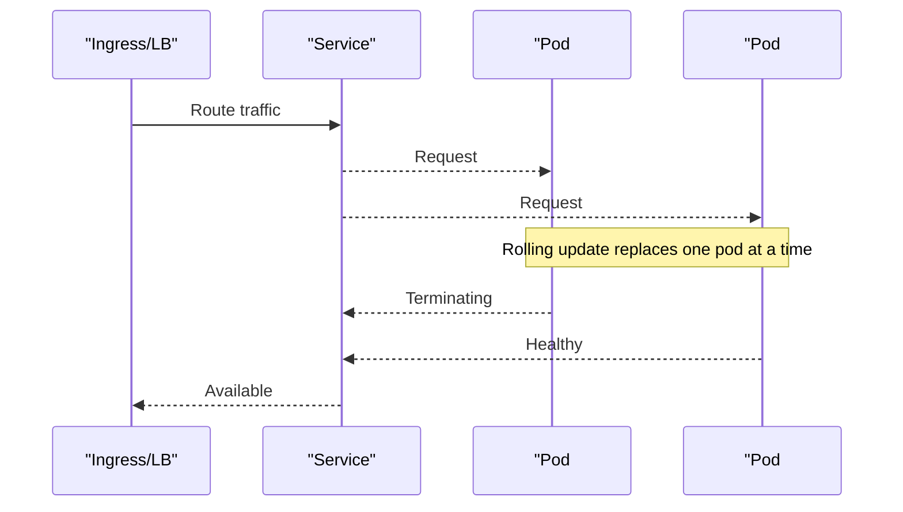

**Diagram sources**
- [k8s/deployment.yaml:11-16](file://k8s/deployment.yaml#L11-L16)
- [k8s/deployment.yaml:65-79](file://k8s/deployment.yaml#L65-L79)

**Section sources**
- [README.md:87-88](file://README.md#L87-L88)
- [k8s/deployment.yaml:11-16](file://k8s/deployment.yaml#L11-L16)
- [k8s/deployment.yaml:65-79](file://k8s/deployment.yaml#L65-L79)

### Security Considerations
- Disable debug mode in production and set a strong secret key.
- Configure allowed hosts, trusted origins, and secure cookies.
- Enable HSTS and secure SSL redirect behind a proxy.
- Use Redis for multi-replica deployments; ensure network isolation.
- Manage secrets externally (e.g., Sealed Secrets/External Secrets) and avoid committing credentials.
- **Updated** Node.js service security: Implement token-based authentication for HL7 bridge, secure environment variable management, and proper service isolation.

**Section sources**
- [README.md:105-109](file://README.md#L105-L109)
- [backend/medicentral/settings.py:155-166](file://backend/medicentral/settings.py#L155-L166)
- [k8s/deployment.yaml:28-44](file://k8s/deployment.yaml#L28-L44)
- [deploy/remote_hl7_post_setup.sh:14-20](file://deploy/remote_hl7_post_setup.sh#L14-L20)

### Backup and Disaster Recovery
- Database backups: For SQLite, back up the SQLite file; for PostgreSQL, use logical backups.
- Secrets backup: Store encrypted secrets externally; maintain rotation procedures.
- Recovery plan: Test restore procedures regularly; automate failover for Redis and database.
- **Updated** Node.js data backup: Implement backup strategies for in-memory vitals data and service-specific configurations.

[No sources needed since this section provides general guidance]

### Performance Monitoring and Metrics
- Health endpoint: Use for basic liveness/readiness checks.
- Logging: Console logging configured; integrate structured logs and metrics exporters as needed.
- Load testing: Validate under expected concurrent users and WebSocket sessions.
- **Updated** Node.js monitoring: Implement metrics collection for HL7 message processing rates, WebSocket connection counts, and service response times.

**Section sources**
- [README.md:97-99](file://README.md#L97-L99)
- [backend/medicentral/settings.py:186-217](file://backend/medicentral/settings.py#L186-L217)

## Dependency Analysis
- Backend depends on:
  - Django settings for environment-driven configuration.
  - ASGI/Wsgi entry points for Daphne and WSGI servers.
  - Channels and Redis for WebSocket synchronization.
  - Database selection via environment variables.
- Node.js services depend on:
  - Express framework for REST API endpoints.
  - WebSocket library for real-time communication.
  - HTTP client libraries for inter-service communication.
- Kubernetes manifests depend on:
  - Namespace existence.
  - Redis service hostname for backend environment.
  - Ingress controller annotations for WebSocket support.
  - **Updated** Service discovery for Node.js upstreams in Nginx configuration.

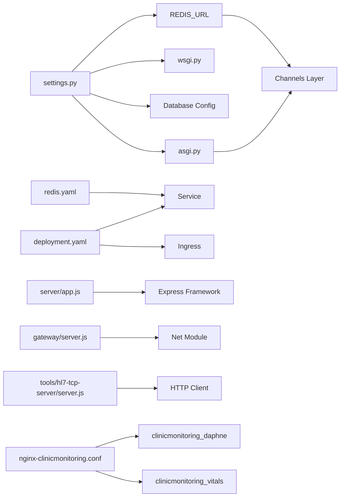

**Diagram sources**
- [backend/medicentral/settings.py:101-119](file://backend/medicentral/settings.py#L101-L119)
- [backend/medicentral/settings.py:170-183](file://backend/medicentral/settings.py#L170-L183)
- [backend/medicentral/asgi.py:14-21](file://backend/medicentral/asgi.py#L14-L21)
- [backend/medicentral/wsgi.py:1-8](file://backend/medicentral/wsgi.py#L1-L8)
- [server/app.js:15-17](file://server/app.js#L15-L17)
- [gateway/server.js:17-20](file://gateway/server.js#L17-L20)
- [tools/hl7-tcp-server/server.js:17-20](file://tools/hl7-tcp-server/server.js#L17-L20)
- [deploy/nginx-clinicmonitoring.conf:12-21](file://deploy/nginx-clinicmonitoring.conf#L12-L21)

**Section sources**
- [backend/medicentral/settings.py:101-183](file://backend/medicentral/settings.py#L101-L183)
- [backend/medicentral/asgi.py:14-21](file://backend/medicentral/asgi.py#L14-L21)
- [backend/medicentral/wsgi.py:1-8](file://backend/medicentral/wsgi.py#L1-L8)
- [k8s/deployment.yaml:65-101](file://k8s/deployment.yaml#L65-L101)
- [k8s/redis.yaml:30-41](file://k8s/redis.yaml#L30-L41)
- [server/app.js:15-17](file://server/app.js#L15-L17)
- [gateway/server.js:17-20](file://gateway/server.js#L17-L20)
- [tools/hl7-tcp-server/server.js:17-20](file://tools/hl7-tcp-server/server.js#L17-L20)
- [deploy/nginx-clinicmonitoring.conf:12-21](file://deploy/nginx-clinicmonitoring.conf#L12-L21)

## Performance Considerations
- Use PostgreSQL in production for better concurrency and reliability compared to SQLite.
- Scale Redis and backend pods horizontally; ensure proper resource requests/limits.
- Optimize WebSocket timeouts and proxy buffer sizes in Nginx.
- Monitor database and Redis latency; tune connection pooling and max connections.
- **Updated** Node.js performance: Monitor HL7 message processing throughput, WebSocket connection limits, and memory usage for vitals API service.

[No sources needed since this section provides general guidance]

## Troubleshooting Guide
Common operational issues and remedies:
- Health endpoint fails: Verify migrations, database connectivity, and Redis availability.
- WebSocket disconnects: Confirm Nginx WebSocket configuration and Ingress annotations.
- HL7 device not connecting: Check firewall, NAT peer IP, and device server IP/port settings.
- Frontend static assets missing: Ensure collectstatic ran and Nginx serves static via backend.
- **Updated** Node.js service issues: Check systemd service status, port conflicts, and service logs for vitals API, gateway, and bridge components.

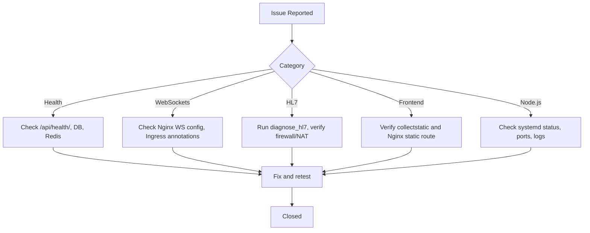

**Diagram sources**
- [README.md:97-99](file://README.md#L97-L99)
- [deploy/nginx-clinicmonitoring.conf:49-59](file://deploy/nginx-clinicmonitoring.conf#L49-L59)
- [backend/monitoring/management/commands/diagnose_hl7.py:110-146](file://backend/monitoring/management/commands/diagnose_hl7.py#L110-L146)

**Section sources**
- [README.md:97-99](file://README.md#L97-L99)
- [deploy/nginx-clinicmonitoring.conf:1-175](file://deploy/nginx-clinicmonitoring.conf#L1-L175)
- [backend/monitoring/management/commands/diagnose_hl7.py:1-182](file://backend/monitoring/management/commands/diagnose_hl7.py#L1-L182)

## Conclusion
Medicentral's deployment model supports local development, staging, and production with clear separation of concerns. Docker Compose streamlines local orchestration, Kubernetes enables scalable production deployments with health checks and Ingress, and GitHub Actions automates CI tasks. Production operations rely on robust Nginx configuration, secure environment management, and operational scripts for updates and diagnostics. The new Node.js infrastructure adds HL7 vitals processing capabilities with dedicated services and enhanced monitoring. Adopting the recommended practices ensures reliable, secure, and observable operations across environments.

[No sources needed since this section summarizes without analyzing specific files]

## Appendices

### Environment Variables Reference
- DJANGO_DEBUG, DJANGO_SECRET_KEY, DJANGO_ALLOWED_HOSTS, CORS_ALLOWED_ORIGINS, DJANGO_BEHIND_PROXY, DJANGO_SECURE_SSL_REDIRECT, DJANGO_SECURE_HSTS_SECONDS
- DATABASE_URL or DJANGO_SQLITE_PATH
- REDIS_URL
- GEMINI_API_KEY
- HL7_LISTEN_HOST, HL7_LISTEN_PORT, HL7_SEND_CONNECT_HANDSHAKE, HL7_RECV_TIMEOUT_SEC, HL7_RECV_BEFORE_HANDSHAKE_MS
- **Updated** Node.js specific variables: HL7_BRIDGE_TOKEN, PORT, NODE_ENV, GATEWAY_HOST, GATEWAY_PORT, VITALS_URL, HL7_TCP_PORT, DEBUG

**Section sources**
- [README.md:59-67](file://README.md#L59-L67)
- [backend/medicentral/settings.py:29-51](file://backend/medicentral/settings.py#L29-L51)
- [backend/medicentral/settings.py:101-119](file://backend/medicentral/settings.py#L101-L119)
- [backend/medicentral/settings.py:170-183](file://backend/medicentral/settings.py#L170-L183)
- [deploy/remote_hl7_post_setup.sh:14-20](file://deploy/remote_hl7_post_setup.sh#L14-L20)
- [deploy/clinicmonitoring-vitals-api.service:9-11](file://deploy/clinicmonitoring-vitals-api.service#L9-L11)
- [deploy/clinicmonitoring-hl7-gateway.service:9-12](file://deploy/clinicmonitoring-hl7-gateway.service#L9-L12)
- [deploy/clinicmonitoring-hl7-node.service:9-12](file://deploy/clinicmonitoring-hl7-node.service#L9-L12)

### Data Model Overview
The monitoring domain centers around clinics, departments, rooms, beds, monitor devices, and patients, with associated vitals and history entries.

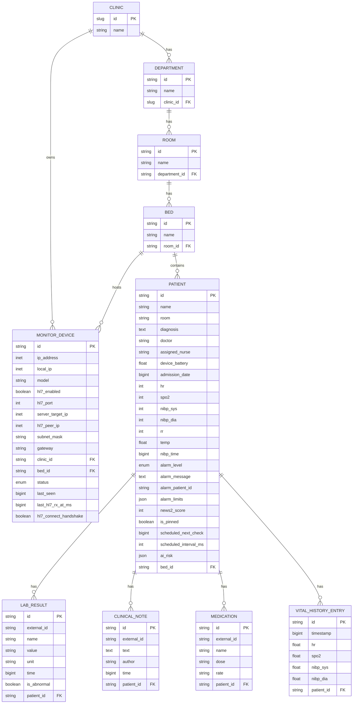

**Diagram sources**
- [backend/monitoring/models.py:5-224](file://backend/monitoring/models.py#L5-L224)

### Node.js Service Management Commands
**Section sources**
- [deploy/remote_vitals_stack.sh:26-44](file://deploy/remote_vitals_stack.sh#L26-L44)
- [deploy/remote_hl7_post_setup.sh:22-38](file://deploy/remote_hl7_post_setup.sh#L22-L38)
- [deploy/remote_hl7_node_enable.sh:12-21](file://deploy/remote_hl7_node_enable.sh#L12-L21)
- [deploy/remote_k12_setup_monitor.sh:12-20](file://deploy/remote_k12_setup_monitor.sh#L12-L20)