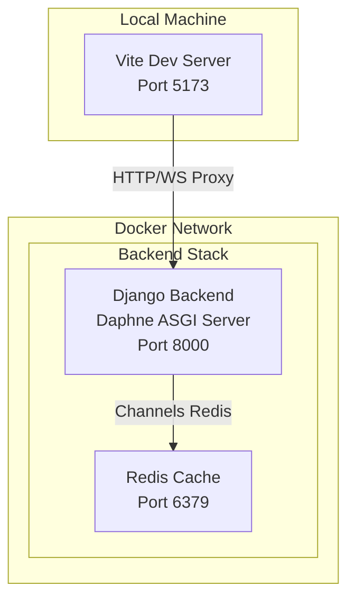
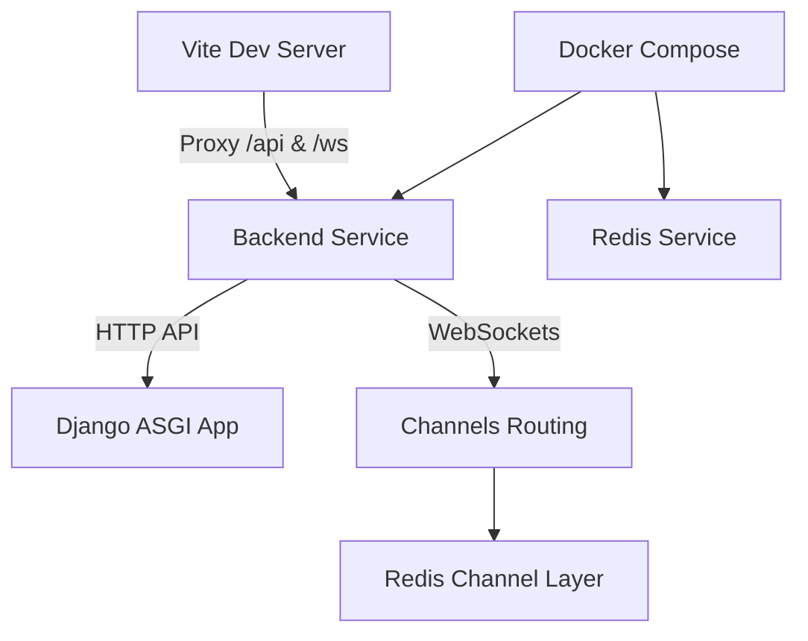
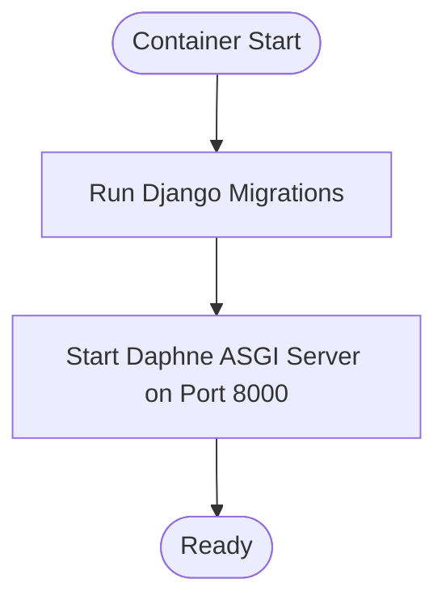
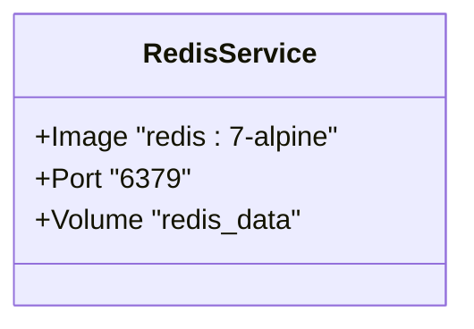
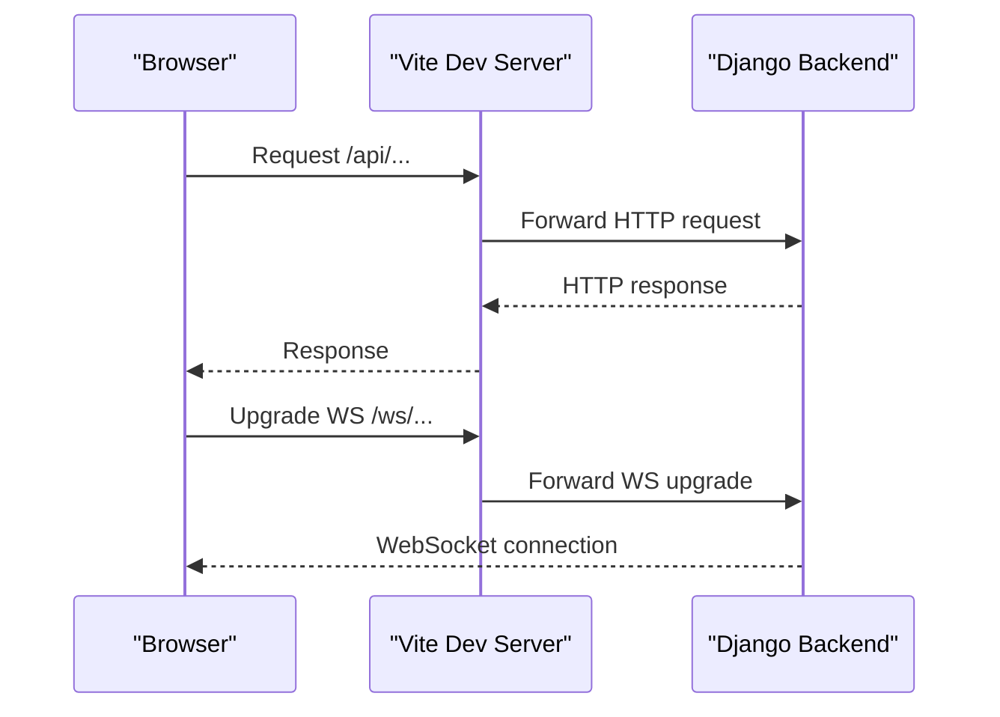
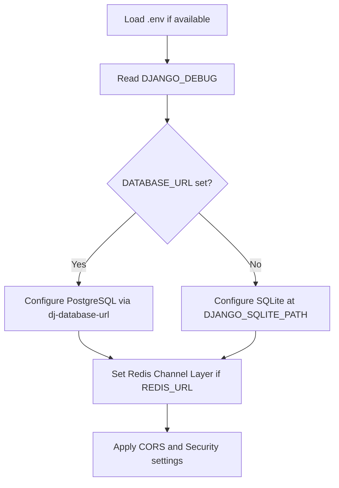
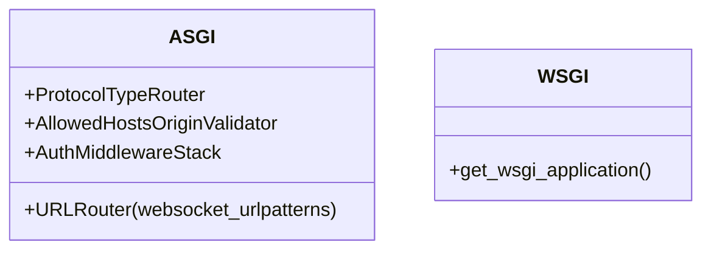
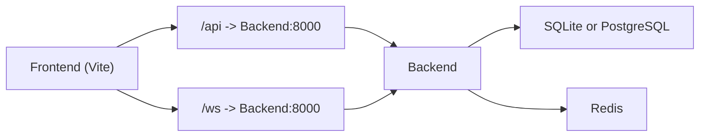

# Development Environment Setup

<cite>
**Referenced Files in This Document**
- [docker-compose.yml](file://docker-compose.yml)
- [backend/Dockerfile](file://backend/Dockerfile)
- [backend/medicentral/settings.py](file://backend/medicentral/settings.py)
- [backend/medicentral/asgi.py](file://backend/medicentral/asgi.py)
- [backend/medicentral/wsgi.py](file://backend/medicentral/wsgi.py)
- [backend/medicentral/urls.py](file://backend/medicentral/urls.py)
- [backend/manage.py](file://backend/manage.py)
- [backend/requirements.txt](file://backend/requirements.txt)
- [frontend/vite.config.ts](file://frontend/vite.config.ts)
- [README.md](file://README.md)
</cite>

## Table of Contents
1. [Introduction](#introduction)
2. [Project Structure](#project-structure)
3. [Core Components](#core-components)
4. [Architecture Overview](#architecture-overview)
5. [Detailed Component Analysis](#detailed-component-analysis)
6. [Dependency Analysis](#dependency-analysis)
7. [Performance Considerations](#performance-considerations)
8. [Troubleshooting Guide](#troubleshooting-guide)
9. [Conclusion](#conclusion)
10. [Appendices](#appendices)

## Introduction
This document explains how to set up and run the Medicentral development environment using Docker Compose. It covers the service definitions for the Django backend, Redis cache, and how the frontend integrates via a reverse proxy concept. You will learn how to orchestrate containers, mount volumes for persistence and code synchronization, configure environment variables for different scenarios, and run the Django development server with auto-reload. It also documents database initialization, migrations, and seed data loading, along with practical examples, troubleshooting tips, and performance optimization advice tailored for local development.

## Project Structure
The development stack consists of:
- Backend service: Django application with ASGI/WSGI entrypoints, Channels for WebSockets, and Daphne as the ASGI server.
- Redis service: In-memory cache and broker for WebSockets.
- Frontend: React/Vite development server with proxy to the backend API and WebSocket endpoints.
- Orchestration: Docker Compose coordinates services, volumes, and networking.

**Diagram sources**
- [docker-compose.yml:1-29](file://docker-compose.yml#L1-L29)
- [backend/Dockerfile:26](file://backend/Dockerfile#L26)
- [frontend/vite.config.ts:18-32](file://frontend/vite.config.ts#L18-L32)

**Section sources**
- [README.md:9-18](file://README.md#L9-L18)
- [docker-compose.yml:1-29](file://docker-compose.yml#L1-L29)

## Core Components
- Backend service (Django + Daphne + Channels)
  - Built from the backend Dockerfile, exposing port 8000.
  - Runs migrations at startup and serves via Daphne.
  - Uses environment variables for debug mode, allowed hosts, Redis URL, and SQLite path.
- Redis service
  - Provides caching and WebSocket channel layer backend.
  - Persists data in a named volume for durability across runs.
- Frontend (React/Vite)
  - Runs on port 5173 with proxy rules to the backend API and WebSocket endpoints.
  - Supports Hot Module Replacement (HMR) unless disabled.

Key orchestration highlights:
- Services share a default Docker network; backend depends on Redis.
- Named volumes persist SQLite and Redis data.
- Environment variables propagate from Compose to the backend container.

**Section sources**
- [docker-compose.yml:10-28](file://docker-compose.yml#L10-L28)
- [backend/Dockerfile:10-26](file://backend/Dockerfile#L10-L26)
- [frontend/vite.config.ts:18-32](file://frontend/vite.config.ts#L18-L32)

## Architecture Overview
The development architecture centers on a single-host Docker Compose setup:
- The backend exposes an ASGI server (Daphne) on port 8000.
- The frontend dev server proxies API requests and WebSocket upgrades to the backend.
- Redis is used for caching and Channels WebSocket messaging.
- Persistent volumes keep SQLite and Redis data across container restarts.

**Diagram sources**
- [docker-compose.yml:2-28](file://docker-compose.yml#L2-L28)
- [backend/Dockerfile:26](file://backend/Dockerfile#L26)
- [backend/medicentral/asgi.py:14-21](file://backend/medicentral/asgi.py#L14-L21)
- [frontend/vite.config.ts:20-30](file://frontend/vite.config.ts#L20-L30)

## Detailed Component Analysis

### Backend Service (Django + Daphne + Channels)
- Build and runtime
  - Base image installs Python 3.12 and system dependencies, installs Python packages from requirements, copies application code, collects static assets during build, and exposes port 8000.
  - The command runs migrations at startup and starts Daphne to serve the ASGI application.
- Environment variables
  - Debug mode and allowed hosts are configured via environment variables.
  - Redis URL is injected for Channels.
  - SQLite path is configurable for persistence under /app/data.
- Database selection
  - If DATABASE_URL is present, the backend connects to PostgreSQL using dj-database-url.
  - Otherwise, it uses SQLite located at the configured path.
- Logging and security
  - Logging level is configurable via an environment variable.
  - Security middleware and CORS behavior depend on debug mode and environment variables.

**Diagram sources**
- [backend/Dockerfile:26](file://backend/Dockerfile#L26)
- [backend/medicentral/settings.py:101-119](file://backend/medicentral/settings.py#L101-L119)

**Section sources**
- [backend/Dockerfile:10-26](file://backend/Dockerfile#L10-L26)
- [backend/medicentral/settings.py:29](file://backend/medicentral/settings.py#L29)
- [backend/medicentral/settings.py:101-119](file://backend/medicentral/settings.py#L101-L119)
- [backend/medicentral/settings.py:170-183](file://backend/medicentral/settings.py#L170-L183)

### Redis Service
- Image: redis:7-alpine
- Ports: host 6379 mapped to container 6379
- Volume: redis_data persists Redis data
- Used by Django Channels as the channel layer backend when REDIS_URL is set

**Diagram sources**
- [docker-compose.yml:3-8](file://docker-compose.yml#L3-L8)

**Section sources**
- [docker-compose.yml:3-8](file://docker-compose.yml#L3-L8)
- [backend/medicentral/settings.py:170-183](file://backend/medicentral/settings.py#L170-L183)

### Frontend Development Server (Vite)
- Runs on port 5173
- Proxies:
  - /api → http://127.0.0.1:8000
  - /ws → http://127.0.0.1:8000 (with ws enabled)
- HMR is enabled unless DISABLE_HMR is set to true
- Resolves aliases for @ paths

**Diagram sources**
- [frontend/vite.config.ts:18-32](file://frontend/vite.config.ts#L18-L32)
- [backend/medicentral/urls.py:6-10](file://backend/medicentral/urls.py#L6-L10)

**Section sources**
- [frontend/vite.config.ts:18-32](file://frontend/vite.config.ts#L18-L32)
- [README.md:41-49](file://README.md#L41-L49)

### Django Settings and Environment Variables
- Debug mode and allowed hosts
  - Controlled by environment variables; defaults are applied when missing.
- Secret key and security
  - Required in production; development uses an insecure default when debug is enabled.
- Database selection
  - PostgreSQL via DATABASE_URL or SQLite via DJANGO_SQLITE_PATH.
- Redis and Channels
  - REDIS_URL enables channels-redis; otherwise an in-memory channel layer is used.
- Logging
  - Root logging level is configurable.

**Diagram sources**
- [backend/medicentral/settings.py:14-19](file://backend/medicentral/settings.py#L14-L19)
- [backend/medicentral/settings.py:101-119](file://backend/medicentral/settings.py#L101-L119)
- [backend/medicentral/settings.py:170-183](file://backend/medicentral/settings.py#L170-L183)

**Section sources**
- [backend/medicentral/settings.py:29](file://backend/medicentral/settings.py#L29)
- [backend/medicentral/settings.py:40-51](file://backend/medicentral/settings.py#L40-L51)
- [backend/medicentral/settings.py:101-119](file://backend/medicentral/settings.py#L101-L119)
- [backend/medicentral/settings.py:170-183](file://backend/medicentral/settings.py#L170-L183)

### Django ASGI and WSGI Entrypoints
- ASGI: Initializes Django ASGI app and wraps WebSocket routing with authentication and origin validation.
- WSGI: Standard Django WSGI application entrypoint.

**Diagram sources**
- [backend/medicentral/asgi.py:14-21](file://backend/medicentral/asgi.py#L14-L21)
- [backend/medicentral/wsgi.py:3-7](file://backend/medicentral/wsgi.py#L3-L7)

**Section sources**
- [backend/medicentral/asgi.py:14-21](file://backend/medicentral/asgi.py#L14-L21)
- [backend/medicentral/wsgi.py:3-7](file://backend/medicentral/wsgi.py#L3-L7)

## Dependency Analysis
- Backend depends on Redis for Channels.
- Backend uses environment variables to select database backend and configure Redis.
- Frontend depends on backend being reachable at 127.0.0.1:8000 via proxy.
- Docker Compose manages volumes and networking automatically.

**Diagram sources**
- [docker-compose.yml:21-22](file://docker-compose.yml#L21-L22)
- [backend/medicentral/settings.py:101-119](file://backend/medicentral/settings.py#L101-L119)
- [backend/medicentral/settings.py:170-183](file://backend/medicentral/settings.py#L170-L183)
- [frontend/vite.config.ts:20-30](file://frontend/vite.config.ts#L20-L30)

**Section sources**
- [docker-compose.yml:21-22](file://docker-compose.yml#L21-L22)
- [backend/requirements.txt:1-14](file://backend/requirements.txt#L1-L14)

## Performance Considerations
- SQLite for development is fine; for higher concurrency or performance testing, switch to PostgreSQL using DATABASE_URL.
- Enable/disable HMR in the frontend via DISABLE_HMR to reduce reload overhead during heavy editing sessions.
- Keep logging level at INFO for normal development; increase verbosity temporarily for debugging.
- Use the named volume for SQLite (/app/data) to preserve migrations and data across container rebuilds.

[No sources needed since this section provides general guidance]

## Troubleshooting Guide
Common issues and resolutions:
- Backend not reachable at 127.0.0.1:8000
  - Ensure the backend service is healthy and port 8000 is exposed.
  - Verify the frontend proxy targets 127.0.0.1:8000.
- WebSocket connections failing
  - Confirm REDIS_URL is set and Redis is reachable.
  - Check allowed origins and CSRF trusted origins when not in debug mode.
- Database errors on startup
  - Migrations are executed automatically at container start; check logs for migration failures.
  - If you see “table already exists,” consider using the appropriate migration command as documented.
- Static files or admin UI issues
  - During build, static assets are collected; ensure the backend container completes startup before expecting static resources.
- Redis connectivity problems
  - Confirm Redis volume is mounted and Redis is running on port 6379.

Practical checks:
- View container logs for the backend service to inspect migration and startup messages.
- Access the admin interface at http://127.0.0.1:8000/admin after successful startup.
- Use the health endpoint documented in the project to verify backend readiness.

**Section sources**
- [README.md:20-39](file://README.md#L20-L39)
- [README.md:69-75](file://README.md#L69-L75)
- [backend/Dockerfile:26](file://backend/Dockerfile#L26)
- [backend/medicentral/settings.py:101-119](file://backend/medicentral/settings.py#L101-L119)

## Conclusion
The Medicentral development environment is designed for simplicity and productivity. Docker Compose orchestrates a minimal stack: Django backend with Daphne, Redis for WebSockets, and a Vite-powered frontend with proxy support. Environment variables enable flexible configuration for different scenarios, while volumes ensure persistence. The setup supports hot reloading, automatic migrations, and straightforward debugging workflows.

[No sources needed since this section summarizes without analyzing specific files]

## Appendices

### Running the Development Stack
- Start the stack with build:
  - docker compose up --build
- Access services:
  - Frontend: http://127.0.0.1:5173
  - Backend API: http://127.0.0.1:8000
  - Admin: http://127.0.0.1:8000/admin
- Stop the stack:
  - docker compose down

**Section sources**
- [README.md:69-75](file://README.md#L69-L75)

### Environment Variable Reference (Development)
- DJANGO_DEBUG: Controls debug mode and CORS behavior.
- DJANGO_ALLOWED_HOSTS: Comma-separated list of allowed hosts.
- DJANGO_SECRET_KEY: Required in production; development uses an insecure default when debug is enabled.
- DATABASE_URL: PostgreSQL connection string; if absent, SQLite is used.
- DJANGO_SQLITE_PATH: SQLite database path inside the container.
- REDIS_URL: Redis connection URL for Channels.
- DJANGO_LOG_LEVEL: Root logging level for the backend.
- DISABLE_HMR: Set to true to disable frontend hot module replacement.

**Section sources**
- [backend/medicentral/settings.py:29](file://backend/medicentral/settings.py#L29)
- [backend/medicentral/settings.py:40-51](file://backend/medicentral/settings.py#L40-L51)
- [backend/medicentral/settings.py:101-119](file://backend/medicentral/settings.py#L101-L119)
- [backend/medicentral/settings.py:170-183](file://backend/medicentral/settings.py#L170-L183)
- [frontend/vite.config.ts:31](file://frontend/vite.config.ts#L31)

### Database Initialization and Seed Data
- Automatic migrations:
  - The backend container runs migrations at startup.
- Manual commands (outside Docker):
  - Create a virtual environment, install requirements, and run migrations.
  - Optionally run management commands for HL7 monitoring or clearing data.

**Section sources**
- [backend/Dockerfile:26](file://backend/Dockerfile#L26)
- [README.md:20-39](file://README.md#L20-L39)

### Development Server and Auto-Reload
- Backend:
  - Daphne serves the ASGI application on port 8000.
  - Migrations are executed at container start.
- Frontend:
  - Vite dev server runs on port 5173 with proxy to the backend.
  - HMR is enabled by default; set DISABLE_HMR=true to disable.

**Section sources**
- [backend/Dockerfile:26](file://backend/Dockerfile#L26)
- [frontend/vite.config.ts:18-32](file://frontend/vite.config.ts#L18-L32)

### Volume Mounting Strategy
- Backend SQLite volume:
  - Mounted at /app/data to persist database across rebuilds.
- Redis volume:
  - Mounted at /data to persist Redis data.

**Section sources**
- [docker-compose.yml:24](file://docker-compose.yml#L24)
- [docker-compose.yml:8](file://docker-compose.yml#L8)

### Network Configuration
- Default Docker network:
  - Services communicate using service names (e.g., redis).
- Port exposure:
  - Backend: 8000 (host 8000).
  - Redis: 6379 (host 6379).
- Frontend proxy:
  - Routes /api and /ws to backend on 127.0.0.1:8000.

**Section sources**
- [docker-compose.yml:5-6](file://docker-compose.yml#L5-L6)
- [docker-compose.yml:14-15](file://docker-compose.yml#L14-L15)
- [frontend/vite.config.ts:20-30](file://frontend/vite.config.ts#L20-L30)

### Django Management Commands
- Typical commands:
  - migrate
  - collectstatic
  - shell
  - Other monitoring-related commands are available in the monitoring app.

**Section sources**
- [backend/manage.py:6-10](file://backend/manage.py#L6-L10)
- [README.md:34-36](file://README.md#L34-L36)