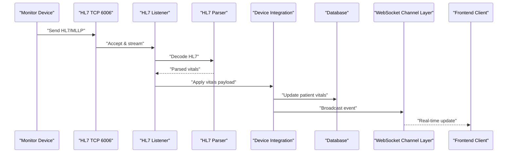
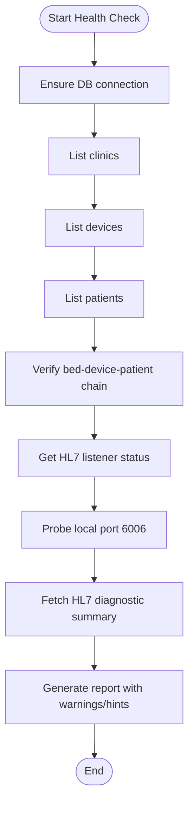
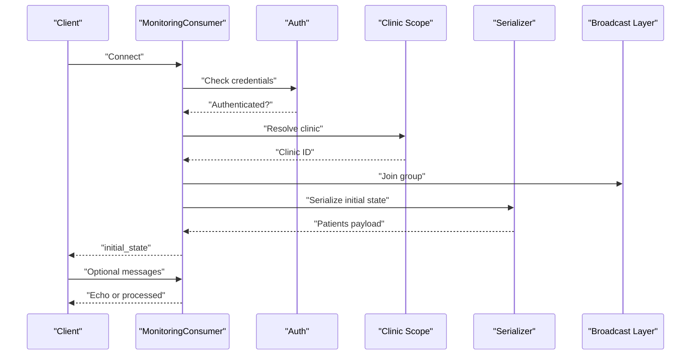
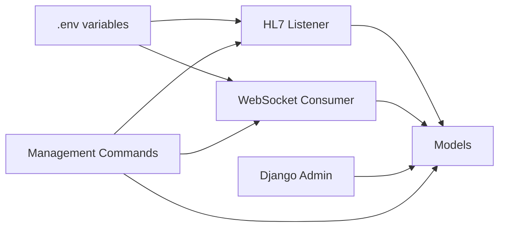

# Operational Procedures

<cite>
**Referenced Files in This Document**
- [README.md](file://README.md)
- [SERVER-SETUP.md](file://deploy/SERVER-SETUP.md)
- [deploy_remote.py](file://deploy/deploy_remote.py)
- [remote_deploy.sh](file://deploy/remote_deploy.sh)
- [models.py](file://backend/monitoring/models.py)
- [admin.py](file://backend/monitoring/admin.py)
- [views.py](file://backend/monitoring/views.py)
- [routing.py](file://backend/monitoring/routing.py)
- [consumers.py](file://backend/monitoring/consumers.py)
- [hl7_listener.py](file://backend/monitoring/hl7_listener.py)
- [diagnose_hl7.py](file://backend/monitoring/management/commands/diagnose_hl7.py)
- [setup_real_hl7_monitor.py](file://backend/monitoring/management/commands/setup_real_hl7_monitor.py)
- [reset_monitoring_fresh.py](file://backend/monitoring/management/commands/reset_monitoring_fresh.py)
- [clear_monitoring_data.py](file://backend/monitoring/management/commands/clear_monitoring_data.py)
- [ensure_fjsti_login.py](file://backend/monitoring/management/commands/ensure_fjsti_login.py)
- [hl7_audit.py](file://backend/monitoring/management/commands/hl7_audit.py)
</cite>

## Table of Contents
1. [Introduction](#introduction)
2. [Project Structure](#project-structure)
3. [Core Components](#core-components)
4. [Architecture Overview](#architecture-overview)
5. [Detailed Component Analysis](#detailed-component-analysis)
6. [Dependency Analysis](#dependency-analysis)
7. [Performance Considerations](#performance-considerations)
8. [Troubleshooting Guide](#troubleshooting-guide)
9. [Conclusion](#conclusion)
10. [Appendices](#appendices)

## Introduction
This document provides comprehensive operational procedures for the Medicentral system. It covers day-to-day operations, monitoring and diagnostics (HL7 connections, WebSocket connectivity, real-time data flow), database maintenance, system administration, emergency response, performance monitoring, security operations, and best practices for patching and upgrades with minimal downtime.

## Project Structure
The system comprises:
- Backend: Django REST API and Django Channels WebSocket server (ASGI via Daphne)
- Frontend: React SPA built with Vite
- Deployment: systemd service for Daphne, Nginx reverse proxy, optional Redis for channel layer
- Operational tooling: management commands for HL7 diagnostics, device setup, and monitoring resets

```mermaid
graph TB
subgraph "Frontend"
FE["React SPA<br/>Vite dev/build"]
end
subgraph "Reverse Proxy"
NGINX["Nginx<br/>TLS + /api + /ws proxy"]
end
subgraph "Backend"
API["Django REST API<br/>/api/*"]
WS["Django Channels<br/>/ws/monitoring/"]
DAPHNE["Daphne ASGI server"]
REDIS["Redis (optional)<br/>Channels Redis"]
end
subgraph "HL7"
HL7["HL7 MLLP Listener<br/>port 6006"]
end
subgraph "Storage"
SQLITE["SQLite (default)"]
end
FE --> NGINX
NGINX --> API
NGINX --> WS
API --> SQLITE
WS --> REDIS
API --> DAPHNE
WS --> DAPHNE
HL7 --> DAPHNE
```

**Diagram sources**
- [README.md:38](file://README.md#L38)
- [README.md:89-96](file://README.md#L89-L96)
- [routing.py:1-8](file://backend/monitoring/routing.py#L1-L8)
- [SERVER-SETUP.md:69-78](file://deploy/SERVER-SETUP.md#L69-L78)

**Section sources**
- [README.md:13-16](file://README.md#L13-L16)
- [README.md:38](file://README.md#L38)
- [README.md:89-96](file://README.md#L89-L96)
- [SERVER-SETUP.md:69-78](file://deploy/SERVER-SETUP.md#L69-L78)

## Core Components
- HL7 MLLP listener: Accepts TCP connections on port 6006, parses HL7/MSH messages, applies vitals to patients, and records diagnostic telemetry.
- WebSocket consumer: Authenticates users, scopes to clinic, and broadcasts real-time patient state to clients.
- Management commands: Diagnose HL7 issues, set up real HL7 monitor, reset monitoring state, clear data, and ensure initial login.
- Health endpoint: Returns service health and database connectivity status.

**Section sources**
- [hl7_listener.py:1-755](file://backend/monitoring/hl7_listener.py#L1-L755)
- [consumers.py:1-46](file://backend/monitoring/consumers.py#L1-L46)
- [diagnose_hl7.py:1-182](file://backend/monitoring/management/commands/diagnose_hl7.py#L1-L182)
- [setup_real_hl7_monitor.py:1-224](file://backend/monitoring/management/commands/setup_real_hl7_monitor.py#L1-L224)
- [reset_monitoring_fresh.py:1-49](file://backend/monitoring/management/commands/reset_monitoring_fresh.py#L1-L49)
- [clear_monitoring_data.py:1-54](file://backend/monitoring/management/commands/clear_monitoring_data.py#L1-L54)
- [ensure_fjsti_login.py:1-34](file://backend/monitoring/management/commands/ensure_fjsti_login.py#L1-L34)
- [views.py:434-445](file://backend/monitoring/views.py#L434-L445)

## Architecture Overview
Operational flows include:
- HL7 ingestion pipeline: monitor → TCP 6006 → listener → parser → vitals applied → WebSocket broadcast
- Real-time dashboard: authenticated clients subscribe to clinic group via WebSocket
- Administrative actions: management commands and Django Admin for device and user management



**Diagram sources**
- [hl7_listener.py:580-633](file://backend/monitoring/hl7_listener.py#L580-L633)
- [consumers.py:12-36](file://backend/monitoring/consumers.py#L12-L36)
- [routing.py:1-8](file://backend/monitoring/routing.py#L1-L8)

**Section sources**
- [README.md:89-96](file://README.md#L89-L96)
- [routing.py:1-8](file://backend/monitoring/routing.py#L1-L8)
- [consumers.py:12-36](file://backend/monitoring/consumers.py#L12-L36)

## Detailed Component Analysis

### HL7 Connection Health Checks
Daily operational steps:
- Verify listener status and port accessibility locally and remotely
- Validate device assignment chain: bed → device → patient
- Review diagnostic telemetry for recent payloads and session counts
- Confirm firewall rules allow inbound TCP 6006



**Diagram sources**
- [diagnose_hl7.py:25-181](file://backend/monitoring/management/commands/diagnose_hl7.py#L25-L181)
- [views.py:59-282](file://backend/monitoring/views.py#L59-L282)
- [hl7_listener.py:723-735](file://backend/monitoring/hl7_listener.py#L723-L735)

Operational commands:
- Full HL7 diagnosis: [diagnose_hl7.py:25-181](file://backend/monitoring/management/commands/diagnose_hl7.py#L25-L181)
- Audit HL7 listener and devices: [hl7_audit.py:34-99](file://backend/monitoring/management/commands/hl7_audit.py#L34-L99)
- Local port probing: [hl7_listener.py:705-721](file://backend/monitoring/hl7_listener.py#L705-L721)

**Section sources**
- [diagnose_hl7.py:25-181](file://backend/monitoring/management/commands/diagnose_hl7.py#L25-L181)
- [hl7_audit.py:34-99](file://backend/monitoring/management/commands/hl7_audit.py#L34-L99)
- [views.py:59-282](file://backend/monitoring/views.py#L59-L282)
- [hl7_listener.py:705-735](file://backend/monitoring/hl7_listener.py#L705-L735)

### WebSocket Connection Monitoring
Daily steps:
- Confirm user authentication and clinic scoping
- Verify group membership and initial state delivery
- Validate message handling and serialization



**Diagram sources**
- [consumers.py:13-45](file://backend/monitoring/consumers.py#L13-L45)
- [routing.py:5-7](file://backend/monitoring/routing.py#L5-L7)

**Section sources**
- [consumers.py:13-45](file://backend/monitoring/consumers.py#L13-L45)
- [routing.py:5-7](file://backend/monitoring/routing.py#L5-L7)

### Real-Time Data Flow Validation
Daily steps:
- Use device connection-check endpoint to validate HL7 pipeline health
- Inspect diagnostic counters for sessions with/without HL7 payloads
- Confirm recent HL7 receipt timestamps and online status

Key endpoint:
- Device connection-check: [views.py:59-282](file://backend/monitoring/views.py#L59-L282)

**Section sources**
- [views.py:59-282](file://backend/monitoring/views.py#L59-L282)
- [hl7_listener.py:36-71](file://backend/monitoring/hl7_listener.py#L36-L71)

### Database Maintenance Procedures
Backup strategies:
- For SQLite: back up the SQLite file regularly; consider PostgreSQL for higher write throughput
- For PostgreSQL: use native logical backups and replication

Log rotation and vacuum:
- SQLite: no explicit vacuum command is present; ensure filesystem-level rotation and offload logs to centralized logging
- PostgreSQL: schedule VACUUM/ANALYZE and configure autovacuum per workload

Performance tuning:
- Indexes: existing models define selective indexes (e.g., history entries timestamp)
- Queries: prefer scoped filters by clinic and device to reduce scans
- Connection pooling: ensure appropriate pool sizes for ASGI workers and channel layer

Operational commands:
- Clear monitoring data (with optional broadcast): [clear_monitoring_data.py:33-53](file://backend/monitoring/management/commands/clear_monitoring_data.py#L33-L53)
- Reset monitoring to fresh state: [reset_monitoring_fresh.py:30-48](file://backend/monitoring/management/commands/reset_monitoring_fresh.py#L30-L48)

**Section sources**
- [README.md:109](file://README.md#L109)
- [models.py:214-224](file://backend/monitoring/models.py#L214-L224)
- [clear_monitoring_data.py:33-53](file://backend/monitoring/management/commands/clear_monitoring_data.py#L33-L53)
- [reset_monitoring_fresh.py:30-48](file://backend/monitoring/management/commands/reset_monitoring_fresh.py#L30-L48)

### System Administration Tasks
User account management:
- Create superuser and initial clinic profile: [ensure_fjsti_login.py:11-33](file://backend/monitoring/management/commands/ensure_fjsti_login.py#L11-L33)
- Django Admin integrates with custom UserProfile inline for clinic scoping

Role assignments:
- Superusers gain access to all clinics; regular users are scoped to their clinic via profile

Clinic configuration updates:
- Use Django Admin to manage departments, rooms, beds, and devices
- Device registration:
  - Automatic setup for real HL7 monitor: [setup_real_hl7_monitor.py:77-224](file://backend/monitoring/management/commands/setup_real_hl7_monitor.py#L77-L224)
  - Manual device creation via image parsing endpoint: [views.py:285-332](file://backend/monitoring/views.py#L285-L332)

Device registration process:
- Configure monitor server IP/port to 6006 and HL7 protocol
- Assign device to a bed and register a patient on that bed
- Validate with connection-check endpoint

**Section sources**
- [ensure_fjsti_login.py:11-33](file://backend/monitoring/management/commands/ensure_fjsti_login.py#L11-L33)
- [admin.py:29-48](file://backend/monitoring/admin.py#L29-L48)
- [setup_real_hl7_monitor.py:77-224](file://backend/monitoring/management/commands/setup_real_hl7_monitor.py#L77-L224)
- [views.py:285-332](file://backend/monitoring/views.py#L285-L332)

### Emergency Response Procedures
System outages:
- Restart Daphne service and confirm health endpoint responds
- Verify firewall rules and port accessibility

Data corruption recovery:
- Restore from latest backup; re-run migrations if schema changed
- Rebuild initial state using reset command if needed

Security incidents:
- Rotate SECRET_KEY and review allowed hosts
- Audit Django Admin access and user permissions
- Review HL7 logs for anomalies and disable affected devices temporarily

Disaster recovery protocols:
- Maintain offsite backups of SQLite/PostgreSQL
- Document environment variables and deployment scripts
- Automate deployment via remote scripts for rapid rollback

**Section sources**
- [README.md:105-110](file://README.md#L105-L110)
- [SERVER-SETUP.md:103-111](file://deploy/SERVER-SETUP.md#L103-L111)
- [deploy_remote.py:1-274](file://deploy/deploy_remote.py#L1-L274)

### Performance Monitoring Approach
Health check endpoints:
- GET health: [views.py:434-445](file://backend/monitoring/views.py#L434-L445)

Metrics collection:
- HL7 diagnostic counters (sessions with/without HL7 payloads)
- Device last seen and last HL7 RX timestamps
- WebSocket group membership and broadcast events

Alert thresholds:
- Data timeout seconds configurable per environment
- Warnings for missing bed/patient assignment or stale data
- Alerts for bind errors or firewall misconfiguration

Capacity planning:
- Scale horizontally by adding backend replicas behind load balancer
- Use Redis for channel layer to support multiple workers
- Monitor CPU/memory and disk I/O under peak loads (shift changes)

**Section sources**
- [views.py:434-445](file://backend/monitoring/views.py#L434-L445)
- [views.py:73-92](file://backend/monitoring/views.py#L73-L92)
- [hl7_listener.py:19-33](file://backend/monitoring/hl7_listener.py#L19-L33)
- [SERVER-SETUP.md:48-56](file://deploy/SERVER-SETUP.md#L48-L56)

### Practical Examples
Scaling operations:
- Add backend replicas and enable Redis for channels
- Use Nginx upstream to distribute traffic

Handling peak loads:
- Increase device polling intervals minimally to reduce REST load
- Ensure WebSocket fan-out via Redis scales with concurrent users

Managing concurrent sessions:
- Monitor channel layer memory and CPU; scale workers accordingly

**Section sources**
- [README.md:65](file://README.md#L65)
- [SERVER-SETUP.md:48-56](file://deploy/SERVER-SETUP.md#L48-L56)

### Security Operations
Access control reviews:
- Regularly review Django Admin users and groups
- Ensure clinic scoping via UserProfile is enforced

Audit log analysis:
- Use systemd journal for HL7 listener logs
- Monitor WebSocket connection attempts and errors

Penetration testing schedules:
- Plan periodic assessments with proper authorization and network isolation

Compliance reporting:
- Maintain evidence of backups, access reviews, and change control
- Document environment variables and deployment procedures

**Section sources**
- [admin.py:36-41](file://backend/monitoring/admin.py#L36-L41)
- [SERVER-SETUP.md:1-4](file://deploy/SERVER-SETUP.md#L1-L4)

### Patch Management and Upgrades
Best practices:
- Test upgrades in staging with identical environment variables
- Use remote deployment scripts for repeatable updates
- Back up database before migration runs

Upgrade procedure:
- Pull latest code, install dependencies, run migrations, collect static assets
- Rebuild frontend and restart services
- Validate health endpoint and HL7 connectivity

Rollback:
- Re-deploy previous commit and revert environment changes if necessary

**Section sources**
- [README.md:7-18](file://README.md#L7-L18)
- [SERVER-SETUP.md:124-138](file://deploy/SERVER-SETUP.md#L124-L138)
- [deploy_remote.py:1-274](file://deploy/deploy_remote.py#L1-L274)
- [remote_deploy.sh:1-139](file://deploy/remote_deploy.sh#L1-L139)

## Dependency Analysis
Operational dependencies:
- HL7 listener depends on environment variables for ports and timeouts
- WebSocket relies on Redis for channel layer when running multiple workers
- Django Admin depends on custom UserProfile inline for clinic scoping
- Management commands depend on models and device integration utilities



**Diagram sources**
- [hl7_listener.py:692-702](file://backend/monitoring/hl7_listener.py#L692-L702)
- [consumers.py:12-29](file://backend/monitoring/consumers.py#L12-L29)
- [admin.py:29-48](file://backend/monitoring/admin.py#L29-L48)
- [models.py:1-224](file://backend/monitoring/models.py#L1-L224)

**Section sources**
- [hl7_listener.py:692-702](file://backend/monitoring/hl7_listener.py#L692-L702)
- [consumers.py:12-29](file://backend/monitoring/consumers.py#L12-L29)
- [admin.py:29-48](file://backend/monitoring/admin.py#L29-L48)
- [models.py:1-224](file://backend/monitoring/models.py#L1-L224)

## Performance Considerations
- Optimize HL7 parsing and database writes with batch updates where possible
- Tune TCP socket options and timeouts for device compatibility
- Monitor channel layer memory usage and scale Redis appropriately
- Use indexes on frequently filtered fields (e.g., history timestamp)

[No sources needed since this section provides general guidance]

## Troubleshooting Guide
Common issues and resolutions:
- HL7 zero-byte sessions: adjust handshake settings and verify monitor output
- Firewall blocked port 6006: allow inbound TCP 6006 on cloud firewall and UFW
- Device not assigned to bed/patient: use connection-check endpoint and fix assignments
- Listener thread not alive: restart Daphne service and verify logs

Diagnostic tools:
- Full HL7 diagnosis command: [diagnose_hl7.py:25-181](file://backend/monitoring/management/commands/diagnose_hl7.py#L25-L181)
- Local audit with optional ORU send: [hl7_audit.py:73-98](file://backend/monitoring/management/commands/hl7_audit.py#L73-L98)
- Reset monitoring to fresh state: [reset_monitoring_fresh.py:30-48](file://backend/monitoring/management/commands/reset_monitoring_fresh.py#L30-L48)

**Section sources**
- [diagnose_hl7.py:25-181](file://backend/monitoring/management/commands/diagnose_hl7.py#L25-L181)
- [hl7_audit.py:73-98](file://backend/monitoring/management/commands/hl7_audit.py#L73-L98)
- [reset_monitoring_fresh.py:30-48](file://backend/monitoring/management/commands/reset_monitoring_fresh.py#L30-L48)

## Conclusion
This document outlines the operational procedures for maintaining and operating the Medicentral system. By following the outlined processes for HL7 diagnostics, WebSocket monitoring, database maintenance, administration, emergency response, performance monitoring, and security operations, operators can ensure reliable, secure, and scalable operation of the system.

[No sources needed since this section summarizes without analyzing specific files]

## Appendices
- Deployment automation: [deploy_remote.py:1-274](file://deploy/deploy_remote.py#L1-L274), [remote_deploy.sh:1-139](file://deploy/remote_deploy.sh#L1-L139)
- Initial setup guide: [SERVER-SETUP.md:1-151](file://deploy/SERVER-SETUP.md#L1-L151)
- Health endpoint reference: [views.py:434-445](file://backend/monitoring/views.py#L434-L445)