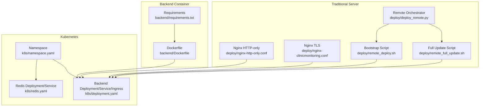
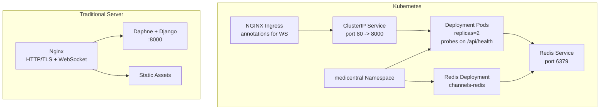
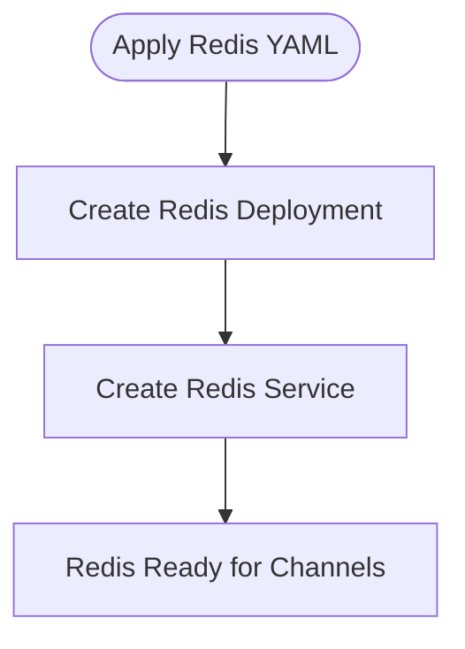
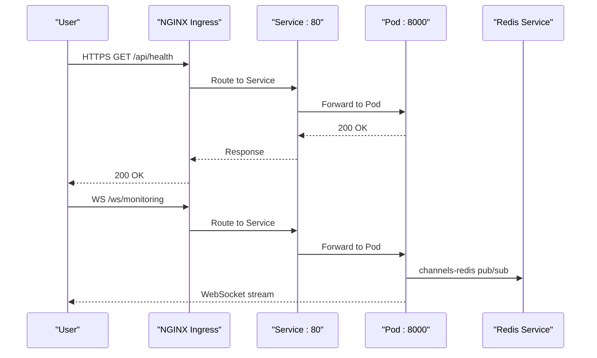
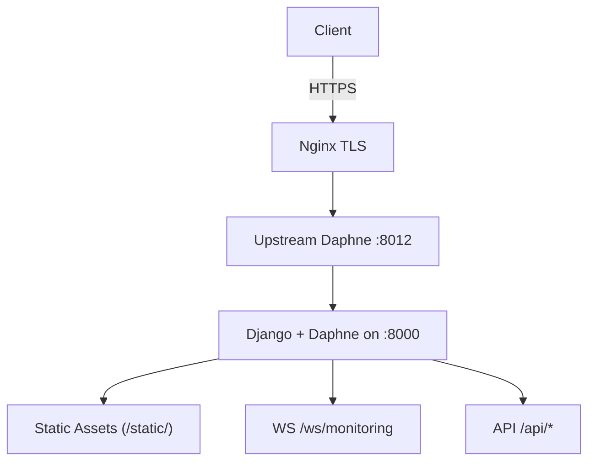
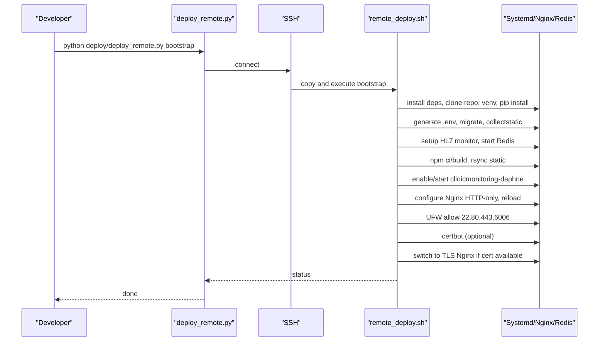
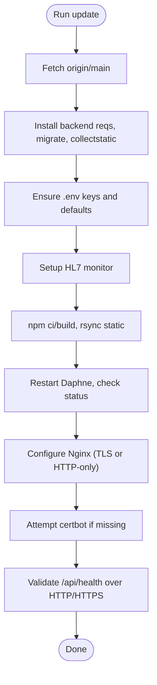
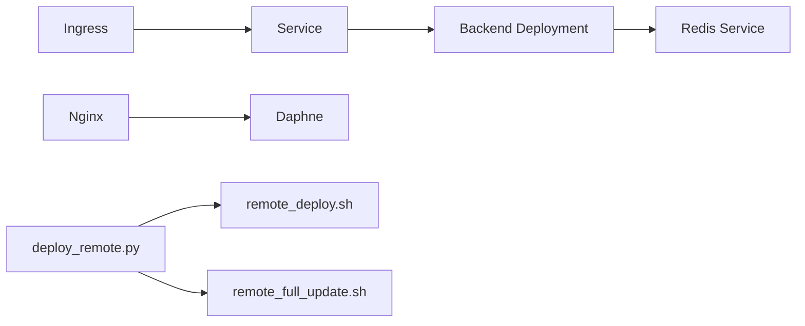

# Production Deployment

<cite>
**Referenced Files in This Document**
- [README.md](file://README.md)
- [architecture.md](file://architecture.md)
- [k8s/namespace.yaml](file://k8s/namespace.yaml)
- [k8s/redis.yaml](file://k8s/redis.yaml)
- [k8s/deployment.yaml](file://k8s/deployment.yaml)
- [backend/Dockerfile](file://backend/Dockerfile)
- [backend/requirements.txt](file://backend/requirements.txt)
- [deploy/nginx-clinicmonitoring.conf](file://deploy/nginx-clinicmonitoring.conf)
- [deploy/nginx-http-only.conf](file://deploy/nginx-http-only.conf)
- [deploy/remote_deploy.sh](file://deploy/remote_deploy.sh)
- [deploy/remote_full_update.sh](file://deploy/remote_full_update.sh)
- [deploy/deploy_remote.py](file://deploy/deploy_remote.py)
- [deploy/ssh_deploy.py](file://deploy/ssh_deploy.py)
- [backend/monitoring/management/commands/diagnose_hl7.py](file://backend/monitoring/management/commands/diagnose_hl7.py)
- [backend/monitoring/management/commands/setup_real_hl7_monitor.py](file://backend/monitoring/management/commands/setup_real_hl7_monitor.py)
</cite>

## Table of Contents
1. [Introduction](#introduction)
2. [Project Structure](#project-structure)
3. [Core Components](#core-components)
4. [Architecture Overview](#architecture-overview)
5. [Detailed Component Analysis](#detailed-component-analysis)
6. [Dependency Analysis](#dependency-analysis)
7. [Performance Considerations](#performance-considerations)
8. [Troubleshooting Guide](#troubleshooting-guide)
9. [Conclusion](#conclusion)
10. [Appendices](#appendices)

## Introduction
This document provides production-grade deployment guidance for the Medicentral system across two primary environments: Kubernetes (K8s) and traditional servers. It covers orchestration manifests, service definitions, resource limits, security posture, namespace management, Redis for caching and pub/sub, ingress configuration with TLS termination and certificates, Nginx reverse proxy for traditional deployments, automation scripts for remote deployment and updates, environment variable management, secrets handling, persistent storage for PostgreSQL, platform-specific cloud deployments (AWS EKS, GCP GKE, Azure AKS), zero-downtime strategies (rolling updates, blue-green), and operational observability (Prometheus/Grafana, ELK, alerts).

## Project Structure
The repository organizes production assets into focused areas:
- Kubernetes manifests under k8s/: namespace, Redis, and backend deployment/Service/Ingress
- Backend Dockerfile and requirements for containerization
- Traditional server deployment assets under deploy/: Nginx configs, automation scripts, and remote deployment helpers
- Monitoring commands for HL7 diagnostics and setup
- Top-level documentation for production guidance and CI/CD

**Diagram sources**
- [k8s/namespace.yaml:1-5](file://k8s/namespace.yaml#L1-L5)
- [k8s/redis.yaml:1-41](file://k8s/redis.yaml#L1-L41)
- [k8s/deployment.yaml:1-101](file://k8s/deployment.yaml#L1-L101)
- [backend/Dockerfile:1-27](file://backend/Dockerfile#L1-L27)
- [backend/requirements.txt:1-14](file://backend/requirements.txt#L1-L14)
- [deploy/nginx-http-only.conf:1-75](file://deploy/nginx-http-only.conf#L1-L75)
- [deploy/nginx-clinicmonitoring.conf:1-112](file://deploy/nginx-clinicmonitoring.conf#L1-L112)
- [deploy/remote_deploy.sh:1-139](file://deploy/remote_deploy.sh#L1-L139)
- [deploy/remote_full_update.sh:1-127](file://deploy/remote_full_update.sh#L1-L127)
- [deploy/deploy_remote.py:1-274](file://deploy/deploy_remote.py#L1-L274)

**Section sources**
- [README.md:77-87](file://README.md#L77-L87)
- [architecture.md:25-31](file://architecture.md#L25-L31)

## Core Components
- Kubernetes Namespace: Defines the logical boundary for Medicentral resources.
- Redis: Provides channels-redis pub/sub for WebSocket scaling across multiple backend pods.
- Backend Deployment: Runs Django + Daphne on port 8000 with health probes, resource requests/limits, and environment variables.
- Service: Exposes backend internally on port 80 mapped to container port 8000.
- Ingress: Routes external traffic to the backend Service with WebSocket support and proxy timeouts.
- Docker Image: Multi-stage build for backend with static collection and Daphne startup.
- Nginx (Traditional): Reverse proxy for API/WebSocket/static assets with TLS and optional certbot integration.
- Automation Scripts: Remote bootstrap/update orchestration via SSH and local helpers.

**Section sources**
- [k8s/namespace.yaml:1-5](file://k8s/namespace.yaml#L1-L5)
- [k8s/redis.yaml:1-41](file://k8s/redis.yaml#L1-L41)
- [k8s/deployment.yaml:11-63](file://k8s/deployment.yaml#L11-L63)
- [k8s/deployment.yaml:65-79](file://k8s/deployment.yaml#L65-L79)
- [k8s/deployment.yaml:80-101](file://k8s/deployment.yaml#L80-L101)
- [backend/Dockerfile:19-27](file://backend/Dockerfile#L19-L27)
- [deploy/nginx-clinicmonitoring.conf:17-78](file://deploy/nginx-clinicmonitoring.conf#L17-L78)
- [deploy/nginx-http-only.conf:14-55](file://deploy/nginx-http-only.conf#L14-L55)
- [deploy/remote_deploy.sh:1-139](file://deploy/remote_deploy.sh#L1-L139)
- [deploy/remote_full_update.sh:1-127](file://deploy/remote_full_update.sh#L1-L127)

## Architecture Overview
The production architecture supports two deployment modes:
- Kubernetes: Namespaced backend Deployment with Redis Service for channels-redis, internal Service, and NGINX Ingress for TLS termination and WebSocket passthrough.
- Traditional Server: Standalone backend behind Nginx with optional certbot-managed TLS, exposing API and WebSocket endpoints and serving static assets.

**Diagram sources**
- [k8s/deployment.yaml:80-101](file://k8s/deployment.yaml#L80-L101)
- [k8s/deployment.yaml:65-79](file://k8s/deployment.yaml#L65-L79)
- [k8s/deployment.yaml:22-63](file://k8s/deployment.yaml#L22-L63)
- [k8s/redis.yaml:30-41](file://k8s/redis.yaml#L30-L41)
- [k8s/redis.yaml:2-16](file://k8s/redis.yaml#L2-L16)
- [k8s/namespace.yaml:1-5](file://k8s/namespace.yaml#L1-L5)
- [deploy/nginx-clinicmonitoring.conf:24-78](file://deploy/nginx-clinicmonitoring.conf#L24-L78)
- [deploy/nginx-http-only.conf:14-55](file://deploy/nginx-http-only.conf#L14-L55)

## Detailed Component Analysis

### Kubernetes Manifests

#### Namespace
- Purpose: Isolate Medicentral resources.
- Strategy: Create namespace prior to applying other resources.

**Section sources**
- [k8s/namespace.yaml:1-5](file://k8s/namespace.yaml#L1-L5)

#### Redis Service and Deployment
- Redis Deployment: Single replica for channels-redis; exposes port 6379.
- Redis Service: Selects Redis pods and exposes port 6379.
- Channels-Redis Requirement: Required for multi-pod scaling of Django Channels.

**Diagram sources**
- [k8s/redis.yaml:2-16](file://k8s/redis.yaml#L2-L16)
- [k8s/redis.yaml:30-41](file://k8s/redis.yaml#L30-L41)

**Section sources**
- [k8s/redis.yaml:1-41](file://k8s/redis.yaml#L1-L41)

#### Backend Deployment, Service, and Ingress
- Deployment:
  - Replicas: 2 for HA.
  - Ports: Container port 8000.
  - Environment:
    - DJANGO_DEBUG=false
    - DJANGO_SECRET_KEY (must be set securely)
    - DJANGO_ALLOWED_HOSTS
    - REDIS_URL pointing to redis-service
    - DJANGO_BEHIND_PROXY=true
    - CORS_ALLOWED_ORIGINS
    - Optional DATABASE_URL for PostgreSQL
  - Resources: Requests and limits defined for CPU/memory.
  - Probes: HTTP GET /api/health on port 8000.
- Service:
  - ClusterIP exposing port 80 targeting 8000.
- Ingress:
  - Host: monitor.medicentral.local
  - Annotations:
    - proxy-read-timeout and proxy-send-timeout for long-running connections.
    - websocket-services annotation for backend service.

**Diagram sources**
- [k8s/deployment.yaml:28-44](file://k8s/deployment.yaml#L28-L44)
- [k8s/deployment.yaml:45-63](file://k8s/deployment.yaml#L45-L63)
- [k8s/deployment.yaml:65-79](file://k8s/deployment.yaml#L65-L79)
- [k8s/deployment.yaml:80-101](file://k8s/deployment.yaml#L80-L101)
- [k8s/redis.yaml:30-41](file://k8s/redis.yaml#L30-L41)

**Section sources**
- [k8s/deployment.yaml:11-63](file://k8s/deployment.yaml#L11-L63)
- [k8s/deployment.yaml:65-79](file://k8s/deployment.yaml#L65-L79)
- [k8s/deployment.yaml:80-101](file://k8s/deployment.yaml#L80-L101)

### Traditional Server Deployment with Nginx
- Nginx HTTP-only config:
  - Upstreams to localhost Daphne (:8012).
  - Proxies /api/, /ws/, /admin/, /static/.
  - SPA routing with try_files.
- Nginx TLS config:
  - Includes certbot SSL files and DH params.
  - Same upstream and proxy rules as HTTP-only.
- Certificates:
  - Optional certbot integration during bootstrap and updates.
- Firewall:
  - UFW allows SSH, HTTP, HTTPS, and HL7 TCP 6006.

**Diagram sources**
- [deploy/nginx-clinicmonitoring.conf:24-78](file://deploy/nginx-clinicmonitoring.conf#L24-L78)
- [deploy/nginx-http-only.conf:14-55](file://deploy/nginx-http-only.conf#L14-L55)

**Section sources**
- [deploy/nginx-clinicmonitoring.conf:1-112](file://deploy/nginx-clinicmonitoring.conf#L1-L112)
- [deploy/nginx-http-only.conf:1-75](file://deploy/nginx-http-only.conf#L1-L75)
- [deploy/remote_deploy.sh:107-139](file://deploy/remote_deploy.sh#L107-L139)
- [deploy/remote_full_update.sh:91-127](file://deploy/remote_full_update.sh#L91-L127)

### Backend Containerization
- Base image: Python slim.
- Dependencies: Installed from requirements.txt.
- Static collection: Run during build with DJANGO_DEBUG=true and a build-secret key.
- CMD: Migrate, then start Daphne on 0.0.0.0:8000.

**Section sources**
- [backend/Dockerfile:1-27](file://backend/Dockerfile#L1-L27)
- [backend/requirements.txt:1-14](file://backend/requirements.txt#L1-L14)

### Deployment Automation Scripts

#### Remote Bootstrap (First-time Setup)
- Installs OS packages (Python, Node.js, Nginx, Certbot, Redis, UFW).
- Clones repository, sets up Python virtualenv, installs requirements.
- Generates/updates .env with production-safe defaults (DEBUG=false, SECRET_KEY, ALLOWED_HOSTS, CSRF/CORS, Redis URL, SQLite path).
- Runs migrations, collects static, sets up HL7 monitor, starts Redis.
- Builds frontend, syncs static assets to /var/www.
- Creates and enables systemd unit for Daphne, restarts service.
- Configures Nginx HTTP-only, reloads, enables UFW.
- Attempts certbot TLS; if successful, switches to TLS Nginx config.

**Diagram sources**
- [deploy/deploy_remote.py:184-274](file://deploy/deploy_remote.py#L184-L274)
- [deploy/remote_deploy.sh:1-139](file://deploy/remote_deploy.sh#L1-L139)

**Section sources**
- [deploy/deploy_remote.py:1-274](file://deploy/deploy_remote.py#L1-L274)
- [deploy/remote_deploy.sh:1-139](file://deploy/remote_deploy.sh#L1-L139)

#### Full Update Workflow
- Fetches latest code, activates venv, installs backend requirements.
- Ensures .env has required keys with safe defaults; adjusts HL7 handshake if needed.
- Runs migrations, collects static, sets up HL7 monitor, fixes ownership.
- Builds frontend, rsyncs static assets.
- Regenerates systemd unit, restarts Daphne, validates activity.
- Configures Nginx (TLS vs HTTP-only), reloads.
- Attempts certbot if missing; validates health over HTTP and HTTPS.

**Diagram sources**
- [deploy/remote_full_update.sh:1-127](file://deploy/remote_full_update.sh#L1-L127)

**Section sources**
- [deploy/remote_full_update.sh:1-127](file://deploy/remote_full_update.sh#L1-L127)

#### Remote Orchestrator (Python)
- Supports modes: bootstrap, update, HL7 debug toggles, Daphne restart logs, K12 setup, fresh reset.
- Uses paramiko to SSH, copies scripts to /tmp, executes with environment variables.
- Supports injecting Gemini API key into backend .env and restarting Daphne.

**Section sources**
- [deploy/deploy_remote.py:1-274](file://deploy/deploy_remote.py#L1-L274)
- [deploy/ssh_deploy.py:1-11](file://deploy/ssh_deploy.py#L1-L11)

### Environment Variables and Secret Management
- Production variables (Kubernetes):
  - DJANGO_DEBUG=false
  - DJANGO_SECRET_KEY (use Kubernetes Secrets or sealed secrets)
  - DJANGO_ALLOWED_HOSTS
  - REDIS_URL=redis://redis-service:6379/0
  - DJANGO_BEHIND_PROXY=true
  - CORS_ALLOWED_ORIGINS
  - Optional DATABASE_URL for PostgreSQL
- Traditional server:
  - .env managed by bootstrap/update scripts; sets SECRET_KEY, DEBUG=false, ALLOWED_HOSTS, CSRF/CORS, Redis URL, SQLite path, HL7 flags.
- Secret management:
  - Kubernetes: Use Secrets or External Secrets/Sealed Secrets.
  - Traditional: Store .env securely on the server; restrict file permissions.

**Section sources**
- [k8s/deployment.yaml:28-44](file://k8s/deployment.yaml#L28-L44)
- [deploy/remote_deploy.sh:39-79](file://deploy/remote_deploy.sh#L39-L79)
- [deploy/remote_full_update.sh:26-44](file://deploy/remote_full_update.sh#L26-L44)

### Persistent Storage for PostgreSQL
- Option: Set DATABASE_URL to a managed PostgreSQL endpoint.
- Recommended approach:
  - Use a managed database service (e.g., AWS RDS, GCP Cloud SQL, Azure Database for Postgres).
  - Mount credentials via Kubernetes Secrets or environment variables.
  - Ensure backups and replication policies meet SLA requirements.

**Section sources**
- [k8s/deployment.yaml:42-44](file://k8s/deployment.yaml#L42-L44)
- [README.md:109](file://README.md#L109)

### Zero-Downtime and Blue-Green Strategies
- Rolling Updates:
  - Kubernetes: Configure maxUnavailable and maxSurge in Deployment strategy for controlled roll.
  - Ensure readinessProbe and livenessProbe are healthy to avoid traffic routing to unhealthy pods.
- Blue-Green:
  - Maintain two identical environments (blue/green) behind a single Ingress or LoadBalancer.
  - Switch traffic by updating DNS or Ingress backend to target the new green pods.
- Canary:
  - Gradually shift a percentage of traffic to the new release using Ingress annotations or service mesh.

**Section sources**
- [k8s/deployment.yaml:11](file://k8s/deployment.yaml#L11)
- [k8s/deployment.yaml:52-63](file://k8s/deployment.yaml#L52-L63)

### Cloud Platform Deployment Examples
- AWS EKS:
  - Provision cluster and node groups.
  - Apply namespace, Redis, and backend manifests.
  - Configure ALB Ingress Controller for NGINX Ingress.
  - Manage TLS with AWS Certificate Manager via cert-manager or manual certbot.
- Google GKE:
  - Create cluster and node pools.
  - Apply manifests; configure GKE Ingress with managed SSL certificates.
  - Use Secret Manager for secrets.
- Azure AKS:
  - Provision cluster and scale sets.
  - Apply manifests; configure Application Gateway Ingress Controller.
  - Use Azure Key Vault for secrets.

[No sources needed since this section provides general guidance]

### Observability and Alerting
- Metrics:
  - Expose Prometheus metrics from backend and capture with Prometheus.
  - Grafana dashboards for health, latency, throughput, and error rates.
- Logs:
  - Centralized logging with ELK/EFK stack or cloud-native alternatives.
  - Ship application logs and Nginx access/error logs.
- Alerts:
  - Threshold-based alerts for health endpoint failures, latency p95, error rates, and Redis connectivity.

[No sources needed since this section provides general guidance]

## Dependency Analysis
- Backend depends on Redis for channels-redis when scaled beyond a single pod.
- Ingress depends on NGINX annotations for WebSocket and long-lived connections.
- Traditional deployment depends on Nginx upstream to Daphne and filesystem static assets.
- Automation scripts depend on paramiko for SSH orchestration and local helper scripts.

**Diagram sources**
- [k8s/deployment.yaml:22-63](file://k8s/deployment.yaml#L22-L63)
- [k8s/deployment.yaml:65-79](file://k8s/deployment.yaml#L65-L79)
- [k8s/deployment.yaml:80-101](file://k8s/deployment.yaml#L80-L101)
- [k8s/redis.yaml:30-41](file://k8s/redis.yaml#L30-L41)
- [deploy/nginx-clinicmonitoring.conf:24-78](file://deploy/nginx-clinicmonitoring.conf#L24-L78)
- [deploy/remote_deploy.sh:101-105](file://deploy/remote_deploy.sh#L101-L105)
- [deploy/remote_full_update.sh:67-78](file://deploy/remote_full_update.sh#L67-L78)
- [deploy/deploy_remote.py:235-269](file://deploy/deploy_remote.py#L235-L269)

**Section sources**
- [backend/requirements.txt:8](file://backend/requirements.txt#L8)
- [k8s/deployment.yaml:36](file://k8s/deployment.yaml#L36)
- [deploy/deploy_remote.py:54-63](file://deploy/deploy_remote.py#L54-L63)

## Performance Considerations
- Resource Limits: Set CPU/memory requests/limits to prevent noisy neighbors and ensure predictable performance.
- Probes: Keep readinessProbe aligned with application warm-up; adjust initialDelaySeconds and periodSeconds per workload.
- Redis: Ensure Redis is sized appropriately for channel fan-out and pub/sub traffic.
- Nginx: Tune proxy timeouts for WebSocket and long-running requests; consider keepalive upstreams.
- PostgreSQL: Use connection pooling and appropriate instance sizing; monitor replication lag.

[No sources needed since this section provides general guidance]

## Troubleshooting Guide
- Health Endpoint:
  - Verify /api/health responds 200 in-cluster and externally.
- Redis Connectivity:
  - Confirm REDIS_URL resolves to redis-service and channels-redis is installed.
- Nginx and TLS:
  - Validate Nginx config syntax and reload; ensure certbot certificates exist and are readable.
- HL7 Monitoring:
  - Use diagnostic command to check listener status, firewall, and recent payloads.
  - Adjust HL7 handshake and peer IP for NAT scenarios.

**Section sources**
- [k8s/deployment.yaml:52-63](file://k8s/deployment.yaml#L52-L63)
- [k8s/deployment.yaml:36](file://k8s/deployment.yaml#L36)
- [deploy/nginx-clinicmonitoring.conf:24-78](file://deploy/nginx-clinicmonitoring.conf#L24-L78)
- [backend/monitoring/management/commands/diagnose_hl7.py:1-182](file://backend/monitoring/management/commands/diagnose_hl7.py#L1-L182)
- [backend/monitoring/management/commands/setup_real_hl7_monitor.py:1-224](file://backend/monitoring/management/commands/setup_real_hl7_monitor.py#L1-L224)

## Conclusion
This guide consolidates production deployment practices for Medicentral across Kubernetes and traditional server environments. By leveraging the provided manifests, automation scripts, and operational patterns, teams can achieve reliable, observable, and scalable deployments with robust security and zero-downtime update strategies.

## Appendices

### Appendix A: Kubernetes Deployment Checklist
- Create namespace
- Deploy Redis
- Build/publish backend image
- Apply backend Deployment/Service/Ingress
- Configure TLS (cert-manager or certbot)
- Validate health and WebSocket connectivity

**Section sources**
- [k8s/namespace.yaml:1-5](file://k8s/namespace.yaml#L1-L5)
- [k8s/redis.yaml:1-41](file://k8s/redis.yaml#L1-L41)
- [k8s/deployment.yaml:1-101](file://k8s/deployment.yaml#L1-L101)

### Appendix B: Traditional Server Deployment Checklist
- Install OS packages and prerequisites
- Bootstrap with remote orchestrator
- Configure firewall and TLS
- Verify Daphne and Nginx health
- Monitor HL7 connectivity

**Section sources**
- [deploy/remote_deploy.sh:1-139](file://deploy/remote_deploy.sh#L1-L139)
- [deploy/deploy_remote.py:1-274](file://deploy/deploy_remote.py#L1-L274)