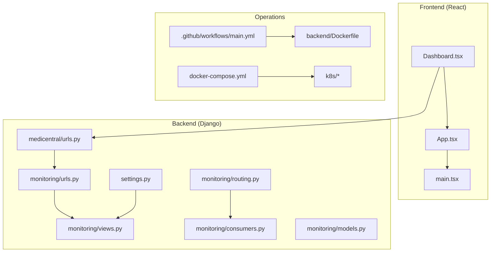
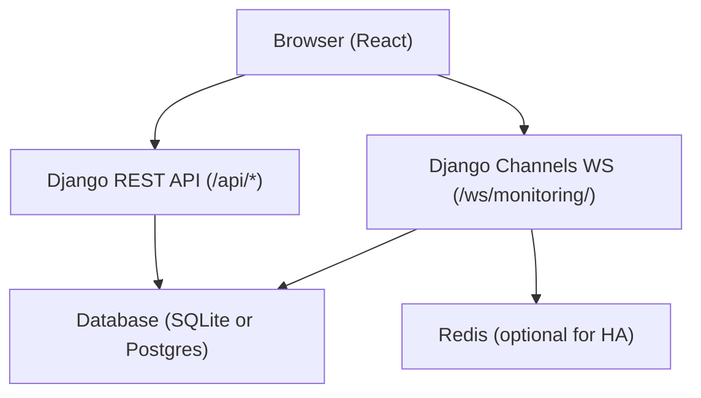
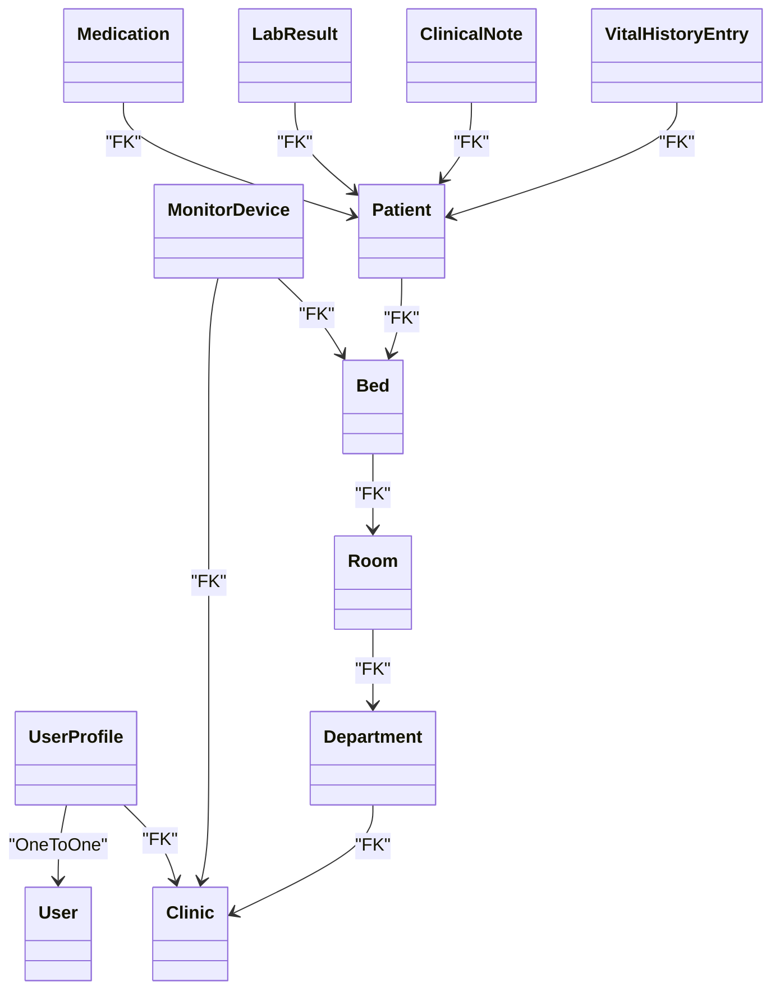
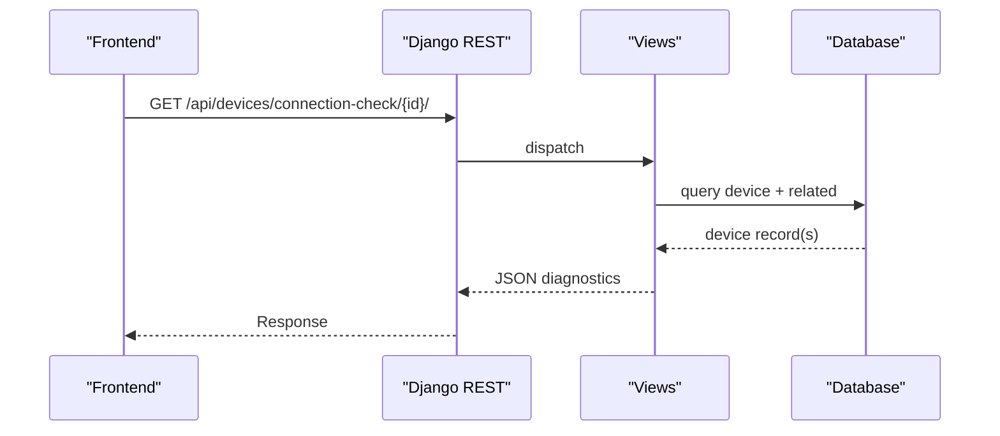
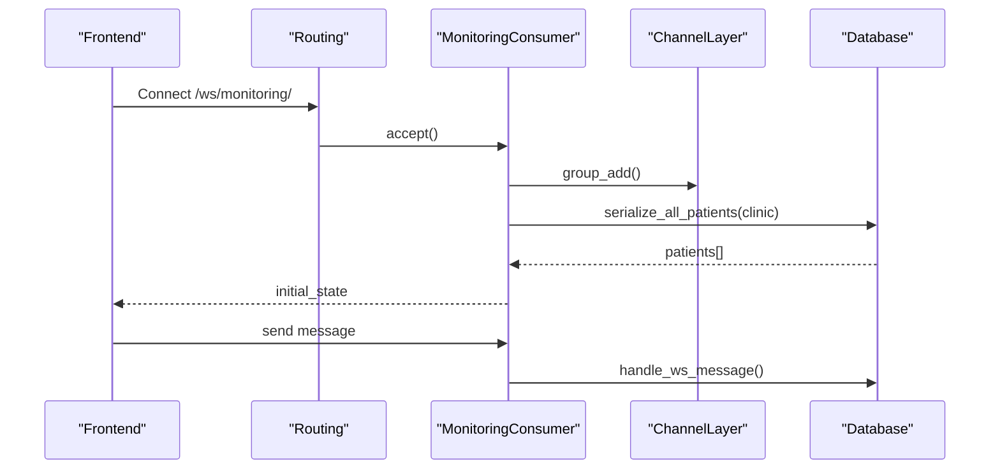
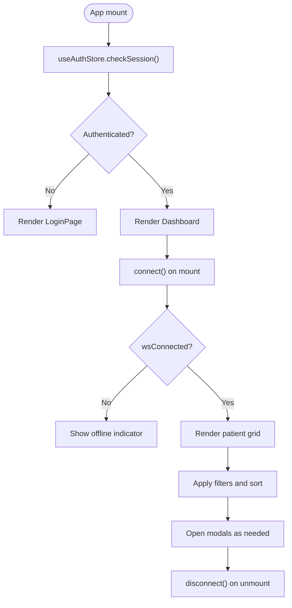
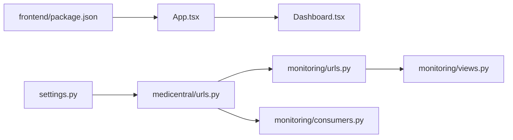

# Development Guidelines

<cite>
**Referenced Files in This Document**
- [README.md](file://README.md)
- [architecture.md](file://architecture.md)
- [backend/medicentral/settings.py](file://backend/medicentral/settings.py)
- [backend/medicentral/urls.py](file://backend/medicentral/urls.py)
- [backend/monitoring/models.py](file://backend/monitoring/models.py)
- [backend/monitoring/views.py](file://backend/monitoring/views.py)
- [backend/monitoring/urls.py](file://backend/monitoring/urls.py)
- [backend/monitoring/consumers.py](file://backend/monitoring/consumers.py)
- [backend/monitoring/management/commands/clear_monitoring_data.py](file://backend/monitoring/management/commands/clear_monitoring_data.py)
- [backend/monitoring/management/commands/setup_real_hl7_monitor.py](file://backend/monitoring/management/commands/setup_real_hl7_monitor.py)
- [backend/monitoring/management/commands/reset_monitoring_fresh.py](file://backend/monitoring/management/commands/reset_monitoring_fresh.py)
- [backend/monitoring/management/commands/diagnose_hl7.py](file://backend/monitoring/management/commands/diagnose_hl7.py)
- [backend/monitoring/management/commands/ensure_fjsti_login.py](file://backend/monitoring/management/commands/ensure_fjsti_login.py)
- [backend/monitoring/hl7_listener.py](file://backend/monitoring/hl7_listener.py)
- [backend/monitoring/device_integration.py](file://backend/monitoring/device_integration.py)
- [backend/monitoring/ws_actions.py](file://backend/monitoring/ws_actions.py)
- [backend/monitoring/routing.py](file://backend/monitoring/routing.py)
- [backend/manage.py](file://backend/manage.py)
- [backend/Dockerfile](file://backend/Dockerfile)
- [.github/workflows/main.yml](file://.github/workflows/main.yml)
- [docker-compose.yml](file://docker-compose.yml)
- [k8s/deployment.yaml](file://k8s/deployment.yaml)
- [k8s/namespace.yaml](file://k8s/namespace.yaml)
- [k8s/redis.yaml](file://k8s/redis.yaml)
- [frontend/package.json](file://frontend/package.json)
- [frontend/src/App.tsx](file://frontend/src/App.tsx)
- [frontend/src/main.tsx](file://frontend/src/main.tsx)
- [frontend/src/components/Dashboard.tsx](file://frontend/src/components/Dashboard.tsx)
</cite>

## Table of Contents
1. [Introduction](#introduction)
2. [Project Structure](#project-structure)
3. [Core Components](#core-components)
4. [Architecture Overview](#architecture-overview)
5. [Detailed Component Analysis](#detailed-component-analysis)
6. [Dependency Analysis](#dependency-analysis)
7. [Performance Considerations](#performance-considerations)
8. [Testing Strategies](#testing-strategies)
9. [Code Review and Pull Request Guidelines](#code-review-and-pull-request-guidelines)
10. [Debugging Techniques](#debugging-techniques)
11. [Contribution Guidelines for Healthcare IT](#contribution-guidelines-for-healthcare-it)
12. [Documentation Requirements](#documentation-requirements)
13. [Release Procedures](#release-procedures)
14. [Practical Examples](#practical-examples)
15. [Troubleshooting Guide](#troubleshooting-guide)
16. [Conclusion](#conclusion)

## Introduction
This document provides comprehensive development guidelines for contributing to the Medicentral codebase. It explains code organization principles across Django and React, testing strategies, review processes, debugging techniques, performance optimization, and operational procedures tailored for healthcare IT environments. The goal is to ensure reliable, secure, and maintainable development aligned with mission-critical requirements.

## Project Structure
Medicentral is a full-stack application composed of:
- Backend: Django REST Framework with Django Channels for WebSocket streaming, plus auxiliary management commands for HL7 monitoring and diagnostics.
- Frontend: React 19 with Vite, TypeScript, and modern UI libraries.
- DevOps: Docker, Docker Compose, Kubernetes manifests, and GitHub Actions CI.

**Diagram sources**
- [frontend/src/App.tsx:1-34](file://frontend/src/App.tsx#L1-L34)
- [frontend/src/main.tsx:1-16](file://frontend/src/main.tsx#L1-L16)
- [frontend/src/components/Dashboard.tsx:1-429](file://frontend/src/components/Dashboard.tsx#L1-L429)
- [backend/medicentral/urls.py:1-11](file://backend/medicentral/urls.py#L1-L11)
- [backend/monitoring/urls.py:1-24](file://backend/monitoring/urls.py#L1-L24)
- [backend/monitoring/views.py:1-419](file://backend/monitoring/views.py#L1-L419)
- [backend/monitoring/consumers.py:1-46](file://backend/monitoring/consumers.py#L1-L46)
- [backend/medicentral/settings.py:1-218](file://backend/medicentral/settings.py#L1-L218)
- [.github/workflows/main.yml](file://.github/workflows/main.yml)
- [backend/Dockerfile](file://backend/Dockerfile)
- [docker-compose.yml](file://docker-compose.yml)
- [k8s/deployment.yaml](file://k8s/deployment.yaml)

**Section sources**
- [README.md:1-110](file://README.md#L1-L110)
- [architecture.md:1-42](file://architecture.md#L1-L42)

## Core Components
- Backend Django settings and middleware define security, authentication, static/media storage, REST framework defaults, CORS, and channel layers for WebSocket scaling.
- Monitoring app models encapsulate clinic, department, room, bed, monitor device, patient, medications, labs, clinical notes, and vital history entries.
- Views expose REST endpoints for departments, rooms, beds, devices, authentication, infrastructure diagnostics, patient lists, health checks, and HL7/REST vitals ingestion.
- Consumers and routing implement WebSocket group broadcasting per clinic with initial state synchronization.

Key backend entry points:
- Root URL configuration includes admin, API, and monitoring routes.
- Monitoring router registers CRUD endpoints for departments, rooms, beds, and devices.
- Health endpoint validates database connectivity.

Frontend entry points:
- App initializes authentication session checks and renders either Login or Dashboard.
- Dashboard orchestrates filtering, sorting, modals, WebSocket connection lifecycle, and audio alerts.

**Section sources**
- [backend/medicentral/settings.py:1-218](file://backend/medicentral/settings.py#L1-L218)
- [backend/monitoring/models.py:1-224](file://backend/monitoring/models.py#L1-L224)
- [backend/monitoring/views.py:1-419](file://backend/monitoring/views.py#L1-L419)
- [backend/monitoring/urls.py:1-24](file://backend/monitoring/urls.py#L1-L24)
- [backend/medicentral/urls.py:1-11](file://backend/medicentral/urls.py#L1-L11)
- [frontend/src/App.tsx:1-34](file://frontend/src/App.tsx#L1-L34)
- [frontend/src/main.tsx:1-16](file://frontend/src/main.tsx#L1-L16)
- [frontend/src/components/Dashboard.tsx:1-429](file://frontend/src/components/Dashboard.tsx#L1-L429)

## Architecture Overview
Medicentral follows an event-driven, real-time architecture:
- Backend: Django REST + Channels for WebSocket streaming.
- Frontend: React 19 with Vite and Zustand for state management.
- DevOps: Docker multi-stage builds, Kubernetes deployments with readiness/liveness probes, and CI/CD via GitHub Actions.

**Diagram sources**
- [backend/medicentral/settings.py:170-183](file://backend/medicentral/settings.py#L170-L183)
- [backend/monitoring/consumers.py:1-46](file://backend/monitoring/consumers.py#L1-L46)
- [backend/monitoring/routing.py](file://backend/monitoring/routing.py)
- [README.md:1-110](file://README.md#L1-L110)

**Section sources**
- [architecture.md:1-42](file://architecture.md#L1-L42)
- [README.md:1-110](file://README.md#L1-L110)

## Detailed Component Analysis

### Backend Django Settings and Middleware
- Security and compliance: CSRF, cookies, HSTS, SSL redirect behind proxy, and allowed hosts are controlled via environment variables.
- CORS: Enabled for development; restricted in production with explicit origins.
- Channels: Optional Redis-backed channel layer for multi-instance HA; otherwise in-memory.
- Logging: Structured console logging with configurable log level.

**Section sources**
- [backend/medicentral/settings.py:22-218](file://backend/medicentral/settings.py#L22-L218)

### Monitoring App Models
- Multitenancy: Clinic-scoped entities (Department, Room, Bed, MonitorDevice, Patient) enforce tenant isolation.
- Constraints: Unique clinic+IP for devices; indexes on timestamps for efficient queries.
- JSON fields: Flexible storage for dynamic risk and limits.

**Diagram sources**
- [backend/monitoring/models.py:1-224](file://backend/monitoring/models.py#L1-L224)

**Section sources**
- [backend/monitoring/models.py:1-224](file://backend/monitoring/models.py#L1-L224)

### REST API Endpoints and Views
- ViewSet-based endpoints for departments, rooms, beds, and devices with clinic scoping.
- Specialized actions: device online marking, connection diagnostics, vitals ingestion, and infrastructure info.
- Authentication: Session-based for admin and API; IsAuthenticated enforced across endpoints.
- Health: Database connectivity check exposed at /api/health/.

**Diagram sources**
- [backend/monitoring/urls.py:1-24](file://backend/monitoring/urls.py#L1-L24)
- [backend/monitoring/views.py:59-257](file://backend/monitoring/views.py#L59-L257)

**Section sources**
- [backend/monitoring/views.py:1-419](file://backend/monitoring/views.py#L1-L419)
- [backend/monitoring/urls.py:1-24](file://backend/monitoring/urls.py#L1-L24)

### WebSocket Consumers and Routing
- Consumer authenticates users, enforces clinic scoping, joins a group, sends initial state, and handles incoming messages.
- Routing binds WebSocket path to consumer group.

**Diagram sources**
- [backend/monitoring/consumers.py:1-46](file://backend/monitoring/consumers.py#L1-L46)
- [backend/monitoring/routing.py](file://backend/monitoring/routing.py)
- [backend/monitoring/ws_actions.py](file://backend/monitoring/ws_actions.py)

**Section sources**
- [backend/monitoring/consumers.py:1-46](file://backend/monitoring/consumers.py#L1-L46)
- [backend/monitoring/routing.py](file://backend/monitoring/routing.py)

### Frontend Application Flow
- App bootstraps authentication session and renders Login or Dashboard.
- Dashboard manages filters, modal states, WebSocket lifecycle, and audio alerts.

**Diagram sources**
- [frontend/src/App.tsx:1-34](file://frontend/src/App.tsx#L1-L34)
- [frontend/src/components/Dashboard.tsx:1-429](file://frontend/src/components/Dashboard.tsx#L1-L429)

**Section sources**
- [frontend/src/App.tsx:1-34](file://frontend/src/App.tsx#L1-L34)
- [frontend/src/main.tsx:1-16](file://frontend/src/main.tsx#L1-L16)
- [frontend/src/components/Dashboard.tsx:1-429](file://frontend/src/components/Dashboard.tsx#L1-L429)

## Dependency Analysis
- Backend depends on Django, REST Framework, Channels, whitenoise, and optional Redis for channel layer.
- Frontend depends on React, React DOM, TypeScript, Tailwind, and UI libraries.
- Operations depend on Docker, Kubernetes, and GitHub Actions.

**Diagram sources**
- [frontend/package.json:1-35](file://frontend/package.json#L1-L35)
- [frontend/src/App.tsx:1-34](file://frontend/src/App.tsx#L1-L34)
- [frontend/src/components/Dashboard.tsx:1-429](file://frontend/src/components/Dashboard.tsx#L1-L429)
- [backend/medicentral/settings.py:53-66](file://backend/medicentral/settings.py#L53-L66)
- [backend/medicentral/urls.py:1-11](file://backend/medicentral/urls.py#L1-L11)
- [backend/monitoring/urls.py:1-24](file://backend/monitoring/urls.py#L1-L24)
- [backend/monitoring/views.py:1-419](file://backend/monitoring/views.py#L1-L419)
- [backend/monitoring/consumers.py:1-46](file://backend/monitoring/consumers.py#L1-L46)

**Section sources**
- [frontend/package.json:1-35](file://frontend/package.json#L1-L35)
- [backend/medicentral/settings.py:53-66](file://backend/medicentral/settings.py#L53-L66)

## Performance Considerations
- Backend
  - Database: Use indexes on frequently queried fields (e.g., vital history timestamps). Prefer bulk operations for ingestion.
  - Queries: Limit serialized fields and avoid N+1 queries; leverage select_related and prefetch_related.
  - Channels: Use Redis-backed channel layer for multi-replica deployments; tune connection pooling and timeouts.
- Frontend
  - Rendering: Memoize derived data and avoid unnecessary re-renders; virtualize large lists.
  - WebSocket: Debounce and batch updates; throttle UI redraws during high-frequency streams.
- DevOps
  - Kubernetes: Configure probes pointing to /api/health; set CPU/memory requests/limits; enable Ingress proxy-timeouts for WS.

[No sources needed since this section provides general guidance]

## Testing Strategies
- Backend
  - Unit tests: Test Django models and serializers for correctness and constraints; mock external integrations (e.g., HL7 listener).
  - Integration tests: Test API endpoints with authenticated sessions; simulate WebSocket events and group broadcasts.
  - Management commands: Add tests for HL7 setup, clearing data, and diagnostics.
- Frontend
  - Component tests: Use React Testing Library to test Dashboard behavior, modal interactions, and WebSocket lifecycle.
  - State tests: Verify Zustand store updates and derived computations (filters, counts).
  - E2E: Optionally automate browser flows for login, connection, and alert scenarios.

[No sources needed since this section provides general guidance]

## Code Review and Pull Request Guidelines
- PR checklist
  - Clear description of changes and rationale.
  - Backward compatibility and migration notes for models.
  - Security review: secrets, CORS, CSRF, cookies, allowed hosts.
  - Performance impact: query plans, render cost, WS traffic.
  - Tests: unit and integration coverage for backend; component tests for frontend.
- Automated checks
  - Backend: lint, type checks, migrations, health smoke test.
  - Frontend: lint, type checks, build verification.
  - Docker: backend image build.
- Approval workflow
  - Require at least one reviewer for backend and frontend changes.
  - Critical areas (security, DB, WS) require dual sign-off.

[No sources needed since this section provides general guidance]

## Debugging Techniques
- Backend
  - Django: Enable DEBUG locally; inspect logs; verify settings for CORS, CSRF, and allowed hosts.
  - Channels: Confirm channel layer configuration; check group membership and message routing.
  - HL7: Use management commands to diagnose listener status and firewall hints; inspect listener diagnostics.
- Frontend
  - React: Use React Developer Tools to inspect component props/state; profile rendering performance.
  - WebSocket: Monitor network tab for WS frames; verify handshake and group messages.
- DevOps
  - Docker/Kubernetes: Inspect container logs, liveness/readiness probes, and resource usage.

**Section sources**
- [backend/monitoring/management/commands/diagnose_hl7.py](file://backend/monitoring/management/commands/diagnose_hl7.py)
- [backend/monitoring/hl7_listener.py](file://backend/monitoring/hl7_listener.py)
- [README.md:1-110](file://README.md#L1-L110)

## Contribution Guidelines for Healthcare IT
- Security-first development: enforce HTTPS, secure cookies, strict CORS, and secret management.
- Data governance: sanitize logs, avoid PII in non-PII contexts; ensure audit trails for sensitive actions.
- Accessibility: semantic markup, keyboard navigation, ARIA live regions for status updates.
- Reliability: idempotent operations, retry/backoff for external systems, circuit breakers where applicable.
- Documentation: keep README and inline comments up to date; explain operational procedures.

[No sources needed since this section provides general guidance]

## Documentation Requirements
- Inline code comments for complex logic and business rules.
- README updates for new features, environment variables, and operational steps.
- Architecture docs for major changes to data flow or deployment topology.
- API documentation generated from DRF schema or OpenAPI.

[No sources needed since this section provides general guidance]

## Release Procedures
- CI/CD
  - Build frontend and backend images; run checks; push to registry.
  - Deploy to staging; smoke test /api/health and WS connectivity.
- Production
  - Apply Kubernetes manifests; scale to desired replicas; verify probes.
  - Rotate secrets and update allowed hosts; monitor logs and alerts.
- Rollback
  - Keep previous image tag; revert manifests; validate rollback.

**Section sources**
- [.github/workflows/main.yml](file://.github/workflows/main.yml)
- [k8s/deployment.yaml](file://k8s/deployment.yaml)
- [README.md:1-110](file://README.md#L1-L110)

## Practical Examples
- Implement a new device integration
  - Add fields to MonitorDevice model if needed; create serializer and view action for ingestion.
  - Add WebSocket handler in ws_actions.py; broadcast updates to clinic groups.
  - Update frontend to display new metrics and handle alerts.
- Extend patient monitoring view
  - Add new vitals to Patient model; update serializers and history entries.
  - Adjust Dashboard filters and rendering logic; add thresholds and alerts.
- Operational tasks
  - Reset monitoring state: use management command to clear data.
  - Setup real HL7 monitor: configure listener and device mapping.
  - Diagnose HL7 issues: run diagnostic command and review firewall hints.

**Section sources**
- [backend/monitoring/models.py:77-139](file://backend/monitoring/models.py#L77-L139)
- [backend/monitoring/views.py:371-390](file://backend/monitoring/views.py#L371-L390)
- [backend/monitoring/ws_actions.py](file://backend/monitoring/ws_actions.py)
- [backend/monitoring/management/commands/reset_monitoring_fresh.py](file://backend/monitoring/management/commands/reset_monitoring_fresh.py)
- [backend/monitoring/management/commands/setup_real_hl7_monitor.py](file://backend/monitoring/management/commands/setup_real_hl7_monitor.py)
- [backend/monitoring/management/commands/diagnose_hl7.py](file://backend/monitoring/management/commands/diagnose_hl7.py)

## Troubleshooting Guide
- Backend
  - Health check failing: verify database connectivity and credentials; check logs for errors.
  - CORS/CSRF errors: confirm allowed origins and trusted origins; ensure cookies are secure in production.
  - WebSocket not connecting: check channel layer configuration and group membership; verify routing path.
- Frontend
  - Blank dashboard: confirm WebSocket connection status and initial state delivery.
  - Filters not working: validate store state updates and memoization logic.
- Operations
  - Docker/Kubernetes: inspect container logs, probes, and resource limits; verify Ingress proxy settings.

**Section sources**
- [backend/monitoring/views.py:408-419](file://backend/monitoring/views.py#L408-L419)
- [backend/monitoring/consumers.py:12-36](file://backend/monitoring/consumers.py#L12-L36)
- [README.md:1-110](file://README.md#L1-L110)

## Conclusion
These guidelines establish a consistent, secure, and scalable development process for Medicentral. By adhering to the outlined patterns for code organization, testing, reviews, debugging, and operations, contributors can deliver robust features aligned with healthcare IT needs and regulatory expectations.