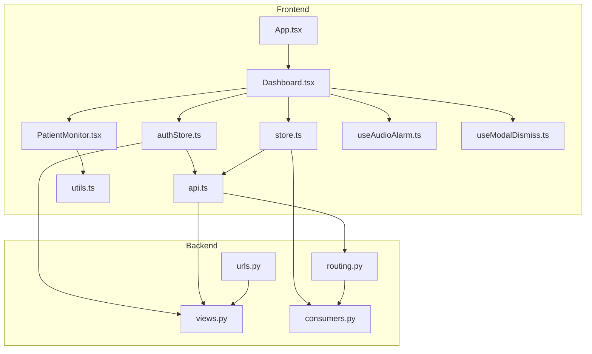
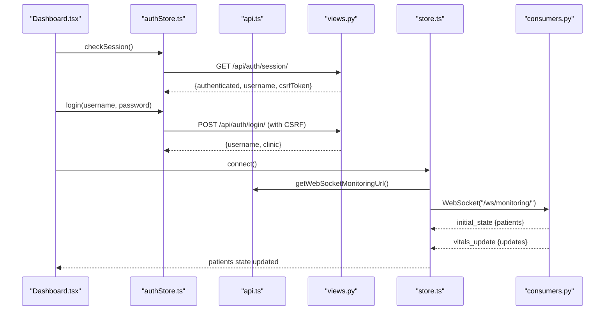
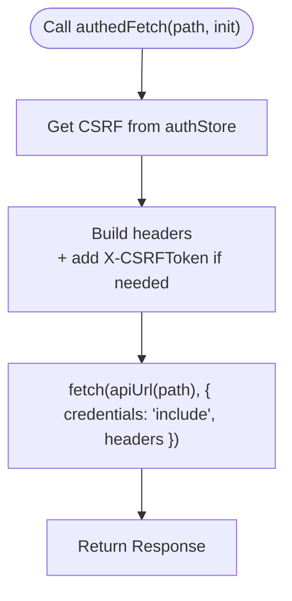
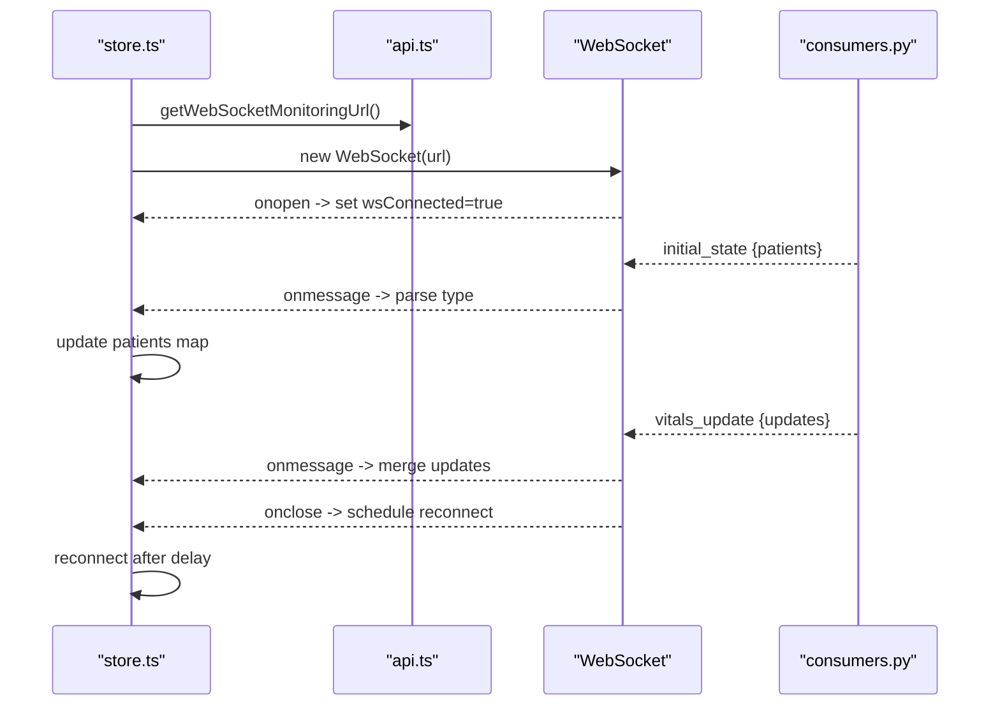
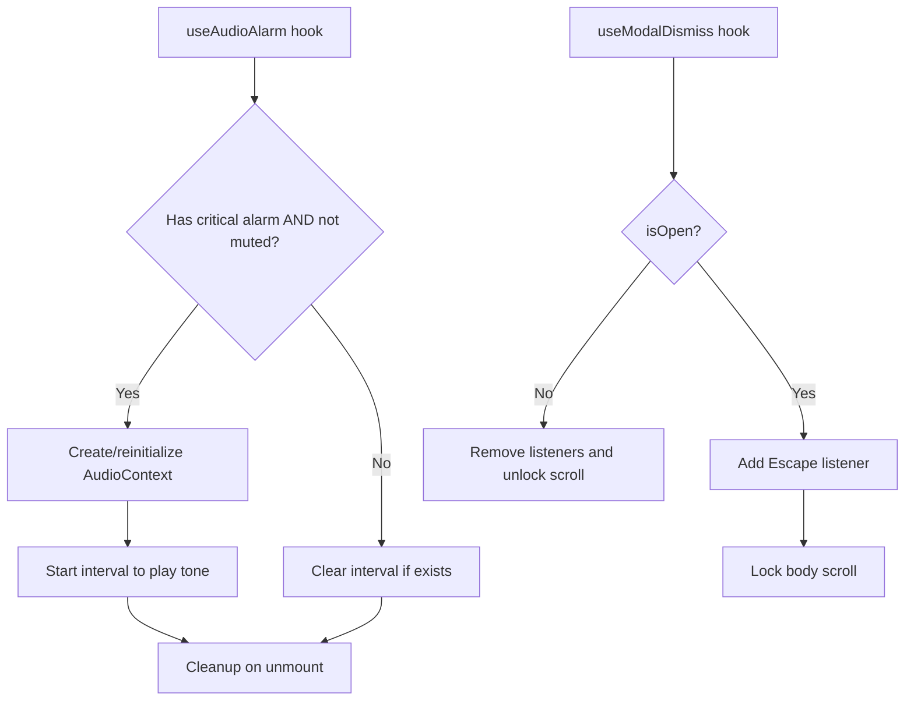
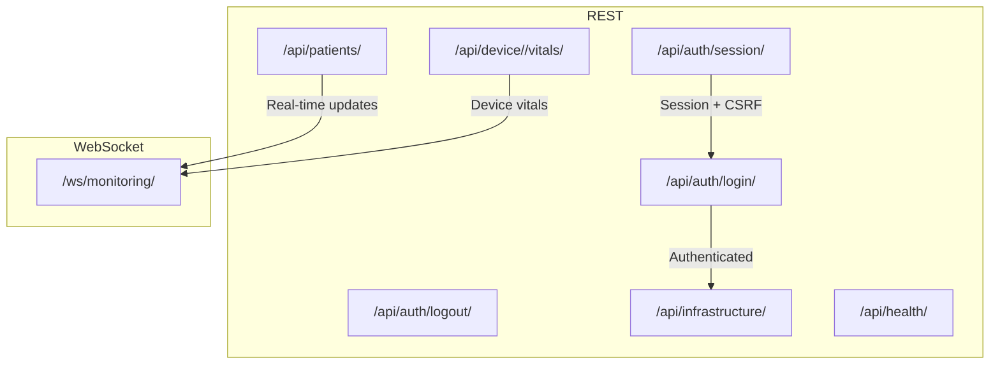
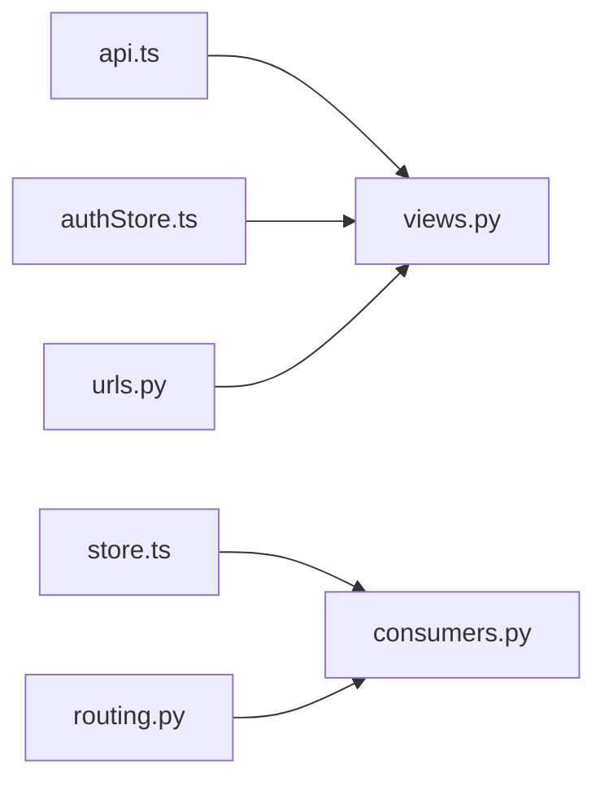

# API Integration Layer

<cite>
**Referenced Files in This Document**
- [api.ts](file://frontend/src/lib/api.ts)
- [authStore.ts](file://frontend/src/authStore.ts)
- [store.ts](file://frontend/src/store.ts)
- [useAudioAlarm.ts](file://frontend/src/hooks/useAudioAlarm.ts)
- [useModalDismiss.ts](file://frontend/src/hooks/useModalDismiss.ts)
- [utils.ts](file://frontend/src/lib/utils.ts)
- [App.tsx](file://frontend/src/App.tsx)
- [Dashboard.tsx](file://frontend/src/components/Dashboard.tsx)
- [PatientMonitor.tsx](file://frontend/src/components/PatientMonitor.tsx)
- [views.py](file://backend/monitoring/views.py)
- [consumers.py](file://backend/monitoring/consumers.py)
- [routing.py](file://backend/monitoring/routing.py)
- [urls.py](file://backend/monitoring/urls.py)
</cite>

## Table of Contents
1. [Introduction](#introduction)
2. [Project Structure](#project-structure)
3. [Core Components](#core-components)
4. [Architecture Overview](#architecture-overview)
5. [Detailed Component Analysis](#detailed-component-analysis)
6. [Dependency Analysis](#dependency-analysis)
7. [Performance Considerations](#performance-considerations)
8. [Troubleshooting Guide](#troubleshooting-guide)
9. [Conclusion](#conclusion)
10. [Appendices](#appendices)

## Introduction
This document describes the API integration layer for the frontend, focusing on:
- REST client utilities and authentication helpers
- WebSocket connection management for real-time updates
- Utility hooks for common frontend patterns
- Practical guidance for extending the integration with new endpoints, handling various response types, implementing retry logic, and managing loading states
- Error boundary patterns, network failure handling, and performance optimization strategies

## Project Structure
The frontend integrates with a Django backend via REST APIs and Django Channels WebSocket. The integration is centered around:
- Centralized URL construction and WebSocket URL generation
- Authentication session and CSRF handling
- Real-time state synchronization via WebSocket
- UI components that consume the store and react to live updates

**Diagram sources**
- [App.tsx:1-34](file://frontend/src/App.tsx#L1-L34)
- [Dashboard.tsx:1-429](file://frontend/src/components/Dashboard.tsx#L1-L429)
- [PatientMonitor.tsx:1-372](file://frontend/src/components/PatientMonitor.tsx#L1-L372)
- [authStore.ts:1-107](file://frontend/src/authStore.ts#L1-L107)
- [store.ts:1-353](file://frontend/src/store.ts#L1-L353)
- [api.ts:1-35](file://frontend/src/lib/api.ts#L1-L35)
- [useAudioAlarm.ts:1-92](file://frontend/src/hooks/useAudioAlarm.ts#L1-L92)
- [useModalDismiss.ts:1-46](file://frontend/src/hooks/useModalDismiss.ts#L1-L46)
- [utils.ts:1-8](file://frontend/src/lib/utils.ts#L1-L8)
- [views.py:1-465](file://backend/monitoring/views.py#L1-L465)
- [consumers.py:1-46](file://backend/monitoring/consumers.py#L1-L46)
- [routing.py:1-8](file://backend/monitoring/routing.py#L1-L8)
- [urls.py:1-24](file://backend/monitoring/urls.py#L1-L24)

**Section sources**
- [api.ts:1-35](file://frontend/src/lib/api.ts#L1-L35)
- [authStore.ts:1-107](file://frontend/src/authStore.ts#L1-L107)
- [store.ts:1-353](file://frontend/src/store.ts#L1-L353)
- [views.py:1-465](file://backend/monitoring/views.py#L1-L465)
- [consumers.py:1-46](file://backend/monitoring/consumers.py#L1-L46)
- [routing.py:1-8](file://backend/monitoring/routing.py#L1-L8)
- [urls.py:1-24](file://backend/monitoring/urls.py#L1-L24)

## Core Components
- API URL builder and WebSocket URL generator
- Authentication store with session and CSRF handling
- Real-time store with WebSocket lifecycle and message parsing
- Utility hooks for audio alerts and modal dismissal
- Shared utility for Tailwind class merging

**Section sources**
- [api.ts:1-35](file://frontend/src/lib/api.ts#L1-L35)
- [authStore.ts:1-107](file://frontend/src/authStore.ts#L1-L107)
- [store.ts:1-353](file://frontend/src/store.ts#L1-L353)
- [useAudioAlarm.ts:1-92](file://frontend/src/hooks/useAudioAlarm.ts#L1-L92)
- [useModalDismiss.ts:1-46](file://frontend/src/hooks/useModalDismiss.ts#L1-L46)
- [utils.ts:1-8](file://frontend/src/lib/utils.ts#L1-L8)

## Architecture Overview
The frontend establishes a dual-channel integration:
- REST APIs for authentication and CRUD operations
- WebSocket for real-time patient updates

**Diagram sources**
- [Dashboard.tsx:49-54](file://frontend/src/components/Dashboard.tsx#L49-L54)
- [authStore.ts:23-78](file://frontend/src/authStore.ts#L23-L78)
- [api.ts:21-34](file://frontend/src/lib/api.ts#L21-L34)
- [views.py:406-414](file://backend/monitoring/views.py#L406-L414)
- [store.ts:219-351](file://frontend/src/store.ts#L219-L351)
- [consumers.py:12-36](file://backend/monitoring/consumers.py#L12-L36)

## Detailed Component Analysis

### REST Client and Authentication Utilities
- URL normalization and origin handling for development vs production
- CSRF-aware fetch helper and header builder for authenticated requests
- Session-based authentication with cookie and CSRF token propagation

Key behaviors:
- Origin normalization ensures consistent base URLs for local and deployed environments
- CSRF protection is enforced for non-idempotent methods
- Session checks populate user context and CSRF tokens

**Diagram sources**
- [authStore.ts:98-107](file://frontend/src/authStore.ts#L98-L107)
- [authStore.ts:82-95](file://frontend/src/authStore.ts#L82-L95)
- [api.ts:10-19](file://frontend/src/lib/api.ts#L10-L19)

**Section sources**
- [api.ts:10-34](file://frontend/src/lib/api.ts#L10-L34)
- [authStore.ts:16-79](file://frontend/src/authStore.ts#L16-L79)
- [authStore.ts:82-107](file://frontend/src/authStore.ts#L82-L107)

### WebSocket Integration and Real-Time Updates
- WebSocket URL resolution based on backend origin and protocol
- Connection lifecycle: connect, onopen, onmessage, onerror, onclose
- Reconnection logic with exponential backoff-like delay
- Message parsing for initial state, per-patient refresh, and incremental updates
- Action dispatching via WebSocket for UI-driven operations

**Diagram sources**
- [store.ts:219-351](file://frontend/src/store.ts#L219-L351)
- [api.ts:21-34](file://frontend/src/lib/api.ts#L21-L34)
- [consumers.py:12-36](file://backend/monitoring/consumers.py#L12-L36)

**Section sources**
- [store.ts:219-351](file://frontend/src/store.ts#L219-L351)
- [api.ts:21-34](file://frontend/src/lib/api.ts#L21-L34)
- [consumers.py:12-36](file://backend/monitoring/consumers.py#L12-L36)

### Utility Hooks
- useAudioAlarm: plays a repeating tone when critical alarms exist and audio is not muted; resumes AudioContext on user gestures; cleans up on unmount
- useModalDismiss: closes modal on Escape, manages body scroll locking for stacked modals, and ensures the latest onClose callback is used

**Diagram sources**
- [useAudioAlarm.ts:12-91](file://frontend/src/hooks/useAudioAlarm.ts#L12-L91)
- [useModalDismiss.ts:23-45](file://frontend/src/hooks/useModalDismiss.ts#L23-L45)

**Section sources**
- [useAudioAlarm.ts:12-91](file://frontend/src/hooks/useAudioAlarm.ts#L12-L91)
- [useModalDismiss.ts:23-45](file://frontend/src/hooks/useModalDismiss.ts#L23-L45)

### Backend REST Endpoints and WebSocket Routing
- REST endpoints include authentication, infrastructure, patients list, device vitals ingestion, and health checks
- WebSocket routing exposes a single channel for monitoring updates

**Diagram sources**
- [urls.py:12-23](file://backend/monitoring/urls.py#L12-L23)
- [views.py:355-465](file://backend/monitoring/views.py#L355-L465)
- [routing.py:5-7](file://backend/monitoring/routing.py#L5-L7)

**Section sources**
- [urls.py:12-23](file://backend/monitoring/urls.py#L12-L23)
- [views.py:355-465](file://backend/monitoring/views.py#L355-L465)
- [routing.py:5-7](file://backend/monitoring/routing.py#L5-L7)

## Dependency Analysis
- Frontend depends on backend REST endpoints for authentication and data, and on WebSocket for live updates
- WebSocket consumer validates user and clinic scope, sends initial state, and broadcasts updates
- URL utilities centralize origin and protocol handling for both REST and WebSocket

**Diagram sources**
- [api.ts:10-34](file://frontend/src/lib/api.ts#L10-L34)
- [authStore.ts:23-78](file://frontend/src/authStore.ts#L23-L78)
- [store.ts:219-351](file://frontend/src/store.ts#L219-L351)
- [consumers.py:12-36](file://backend/monitoring/consumers.py#L12-L36)
- [routing.py:5-7](file://backend/monitoring/routing.py#L5-L7)
- [urls.py:12-23](file://backend/monitoring/urls.py#L12-L23)

**Section sources**
- [api.ts:10-34](file://frontend/src/lib/api.ts#L10-L34)
- [authStore.ts:23-78](file://frontend/src/authStore.ts#L23-L78)
- [store.ts:219-351](file://frontend/src/store.ts#L219-L351)
- [consumers.py:12-36](file://backend/monitoring/consumers.py#L12-L36)
- [routing.py:5-7](file://backend/monitoring/routing.py#L5-L7)
- [urls.py:12-23](file://backend/monitoring/urls.py#L12-L23)

## Performance Considerations
- Minimize re-renders by structuring state updates atomically (e.g., batch updates in WebSocket message handlers)
- Debounce or throttle frequent UI actions that trigger WebSocket actions (e.g., scheduling checks)
- Use memoization for derived data (e.g., filtered patient lists) to avoid unnecessary computations
- Prefer incremental updates over full state replays when possible
- Close unused WebSocket connections and clear intervals on component unmount
- Avoid blocking the main thread with heavy computations during rendering

## Troubleshooting Guide
Common issues and remedies:
- Authentication failures
  - Verify CSRF token presence for non-idempotent requests
  - Confirm session endpoint returns expected fields
- WebSocket connection problems
  - Ensure origin normalization resolves to the correct protocol (http/https)
  - Check backend routing and consumer acceptance logic
  - Validate reconnection logic and manual disconnect handling
- Real-time update anomalies
  - Inspect message types and payload shapes
  - Confirm initial state and incremental update merging logic
- Audio alert not playing
  - Resume AudioContext on user gesture
  - Verify critical alarm detection and mute state

**Section sources**
- [authStore.ts:82-107](file://frontend/src/authStore.ts#L82-L107)
- [store.ts:219-351](file://frontend/src/store.ts#L219-L351)
- [useAudioAlarm.ts:20-35](file://frontend/src/hooks/useAudioAlarm.ts#L20-L35)

## Conclusion
The API integration layer combines robust REST utilities with a resilient WebSocket connection to deliver a responsive, real-time monitoring dashboard. By centralizing URL handling, authentication, and WebSocket lifecycle management, the system remains maintainable and extensible. Following the patterns outlined here enables safe addition of new endpoints, reliable handling of diverse response types, and efficient management of loading and error states.

## Appendices

### Implementing New API Endpoints
Steps:
- Define endpoint in backend views and wire URL routing
- Add REST call in authStore or a dedicated service using authedFetch
- Parse response and update Zustand store state
- Handle loading and error states in components
- Add retry logic where appropriate (e.g., exponential backoff)

Example references:
- [authStore.ts:23-78](file://frontend/src/authStore.ts#L23-L78)
- [views.py:355-465](file://backend/monitoring/views.py#L355-L465)
- [urls.py:12-23](file://backend/monitoring/urls.py#L12-L23)

### Handling Different Response Types
- Use typed parsing for WebSocket messages and REST responses
- Normalize partial updates and defaults for complex entities
- Merge updates efficiently to minimize re-renders

References:
- [store.ts:237-317](file://frontend/src/store.ts#L237-L317)
- [store.ts:34-49](file://frontend/src/store.ts#L34-L49)

### Retry Logic and Loading States
- Implement retry with capped attempts and backoff
- Surface loading indicators during long-running operations
- Provide user feedback for transient errors

[No sources needed since this section provides general guidance]

### Error Boundary Patterns
- Wrap critical sections with error boundaries to prevent app crashes
- Log errors and surface actionable messages to users
- Ensure graceful degradation when network or backend is unavailable

[No sources needed since this section provides general guidance]

### Managing Loading States
- Track loading flags per operation
- Debounce rapid UI triggers
- Use skeleton loaders for initial data fetch

[No sources needed since this section provides general guidance]