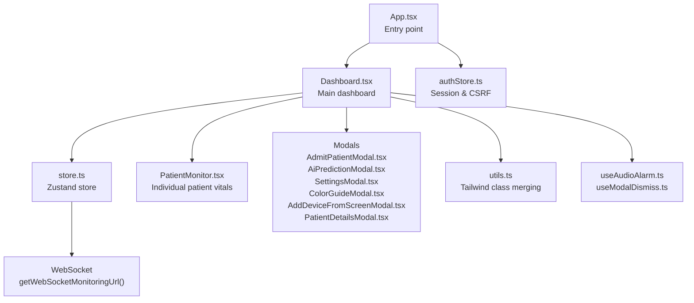
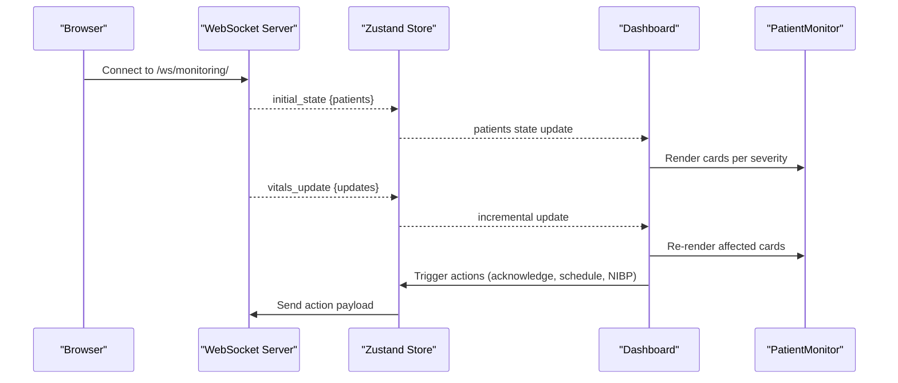
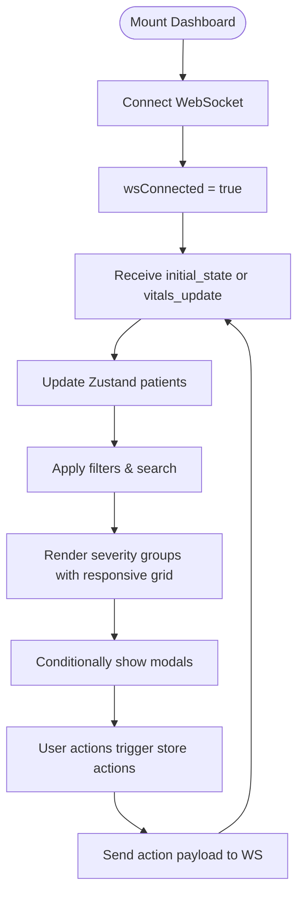
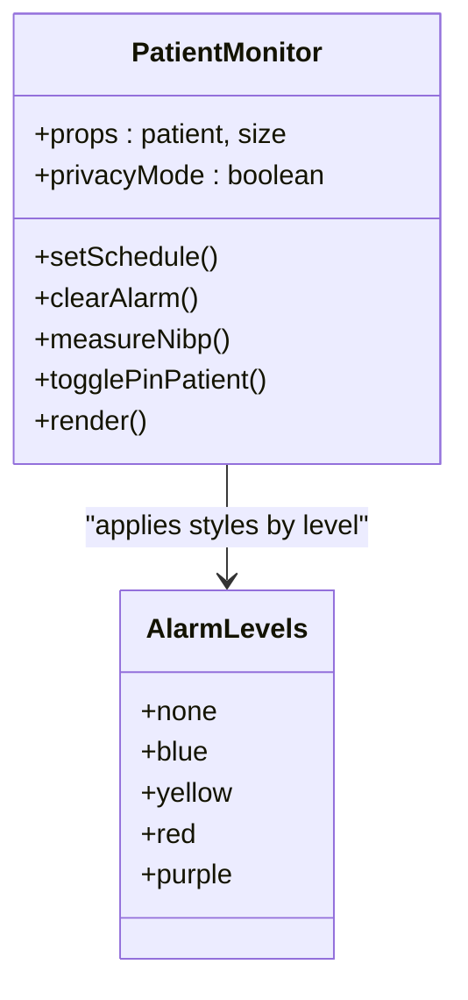
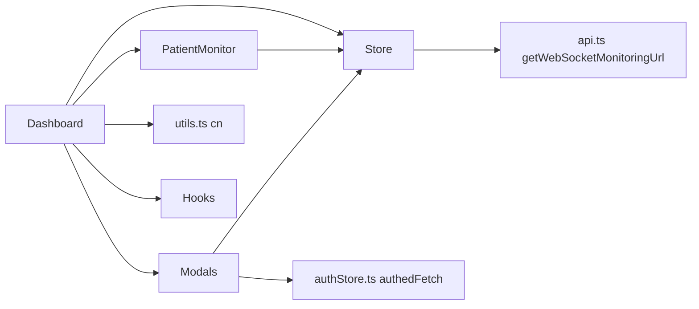

# Dashboard & Monitoring Interface

<cite>
**Referenced Files in This Document**
- [Dashboard.tsx](file://frontend/src/components/Dashboard.tsx)
- [PatientMonitor.tsx](file://frontend/src/components/PatientMonitor.tsx)
- [AddDeviceFromScreenModal.tsx](file://frontend/src/components/AddDeviceFromScreenModal.tsx)
- [AdmitPatientModal.tsx](file://frontend/src/components/AdmitPatientModal.tsx)
- [AiPredictionModal.tsx](file://frontend/src/components/AiPredictionModal.tsx)
- [SettingsModal.tsx](file://frontend/src/components/SettingsModal.tsx)
- [ColorGuideModal.tsx](file://frontend/src/components/ColorGuideModal.tsx)
- [PatientDetailsModal.tsx](file://frontend/src/components/PatientDetailsModal.tsx)
- [store.ts](file://frontend/src/store.ts)
- [useAudioAlarm.ts](file://frontend/src/hooks/useAudioAlarm.ts)
- [useModalDismiss.ts](file://frontend/src/hooks/useModalDismiss.ts)
- [utils.ts](file://frontend/src/lib/utils.ts)
- [api.ts](file://frontend/src/lib/api.ts)
- [App.tsx](file://frontend/src/App.tsx)
</cite>

## Table of Contents
1. [Introduction](#introduction)
2. [Project Structure](#project-structure)
3. [Core Components](#core-components)
4. [Architecture Overview](#architecture-overview)
5. [Detailed Component Analysis](#detailed-component-analysis)
6. [Dependency Analysis](#dependency-analysis)
7. [Performance Considerations](#performance-considerations)
8. [Troubleshooting Guide](#troubleshooting-guide)
9. [Conclusion](#conclusion)
10. [Appendices](#appendices)

## Introduction
This document explains the main dashboard and monitoring interface components for a clinical monitoring system. It covers the Dashboard layout and filtering, the PatientMonitor vitals cards with real-time updates and alarm indicators, and specialized modals for device management, patient admission, and AI risk assessment. It also provides practical guidance for customizing layouts, adding new widgets, building custom alert systems, creating responsive grids, styling with Tailwind CSS, animation patterns, and accessibility considerations tailored for healthcare environments.

## Project Structure
The monitoring interface is implemented in the frontend under the src/components directory. The main entry point initializes authentication and renders the Dashboard, which orchestrates real-time data via a WebSocket store and composes multiple monitoring and modal components.

**Diagram sources**
- [App.tsx:11-33](file://frontend/src/App.tsx#L11-L33)
- [Dashboard.tsx:32-428](file://frontend/src/components/Dashboard.tsx#L32-L428)
- [store.ts:173-352](file://frontend/src/store.ts#L173-L352)
- [api.ts:21-34](file://frontend/src/lib/api.ts#L21-L34)
- [utils.ts:4-7](file://frontend/src/lib/utils.ts#L4-L7)
- [useAudioAlarm.ts:12-91](file://frontend/src/hooks/useAudioAlarm.ts#L12-L91)
- [useModalDismiss.ts:23-45](file://frontend/src/hooks/useModalDismiss.ts#L23-L45)

**Section sources**
- [App.tsx:11-33](file://frontend/src/App.tsx#L11-L33)
- [Dashboard.tsx:32-428](file://frontend/src/components/Dashboard.tsx#L32-L428)
- [store.ts:173-352](file://frontend/src/store.ts#L173-L352)
- [api.ts:21-34](file://frontend/src/lib/api.ts#L21-L34)

## Core Components
- Dashboard: Orchestrates real-time data, filters, search, and grid layout of patient monitors. It manages modals and integrates audio alerts.
- PatientMonitor: Renders individual patient vitals cards with size variants, alarm styling, NEWS2 score, scheduled checks, and quick actions.
- Modals: Specialized dialogs for admission, AI predictions, settings, device addition, color guide, and patient details.
- Zustand Store: Central state for patients, WebSocket lifecycle, filters, and actions (acknowledge, schedule, NIBP measurement, admission/discharge).
- Hooks: Audio alarm playback and modal dismissal/body scroll management.

**Section sources**
- [Dashboard.tsx:32-428](file://frontend/src/components/Dashboard.tsx#L32-L428)
- [PatientMonitor.tsx:13-372](file://frontend/src/components/PatientMonitor.tsx#L13-L372)
- [store.ts:143-352](file://frontend/src/store.ts#L143-L352)
- [useAudioAlarm.ts:12-91](file://frontend/src/hooks/useAudioAlarm.ts#L12-L91)
- [useModalDismiss.ts:23-45](file://frontend/src/hooks/useModalDismiss.ts#L23-L45)

## Architecture Overview
The system uses a WebSocket connection to receive real-time patient updates. The Zustand store manages the WebSocket lifecycle, parses incoming messages, and updates the patients map. The Dashboard composes PatientMonitor cards and modals, applying Tailwind classes and animations. Audio alerts are triggered when critical alarms are present and audio is unmuted.

**Diagram sources**
- [store.ts:219-338](file://frontend/src/store.ts#L219-L338)
- [store.ts:267-293](file://frontend/src/store.ts#L267-L293)
- [Dashboard.tsx:49-54](file://frontend/src/components/Dashboard.tsx#L49-L54)
- [api.ts:21-34](file://frontend/src/lib/api.ts#L21-L34)

## Detailed Component Analysis

### Dashboard Component
- Real-time data: Initializes WebSocket connection on mount and disconnects on unmount. Parses initial state and incremental vitals updates.
- Filtering and search: Supports severity filters (all, critical, warning, pinned), department filter, and free-text search across name and ID.
- Grid layout: Renders three severity groups (critical, warning, stable) in responsive grid layouts with different column counts per breakpoint.
- Modals: Conditionally renders PatientDetails, AdmitPatient, Settings, AI Prediction, and ColorGuide modals.
- Accessibility: Skip link to main content, live status indicators, keyboard navigation, and ARIA attributes on interactive elements.
- Styling: Uses Tailwind classes for backgrounds, borders, and responsive grids; backdrop blur for glass-like UI.

**Diagram sources**
- [Dashboard.tsx:49-98](file://frontend/src/components/Dashboard.tsx#L49-L98)
- [store.ts:247-317](file://frontend/src/store.ts#L247-L317)

**Section sources**
- [Dashboard.tsx:32-428](file://frontend/src/components/Dashboard.tsx#L32-L428)
- [store.ts:219-338](file://frontend/src/store.ts#L219-L338)

### PatientMonitor Component
- Props: Receives a single patient object and optional size variant (large, medium, small).
- Privacy mode: Masks patient names when enabled.
- Alarm styling: Dynamically applies border, background, pulse animation, and shadow based on alarm level.
- Numeric grid: Displays HR, SpO2, NIBP with units and limits; larger cards include RR and temperature.
- Interactions: Click to select patient, pin/unpin, clear special alarms, schedule checks, and measure NIBP.
- Timers: Countdown to next scheduled check; battery indicator with color change below threshold.
- Accessibility: Proper roles, labels, and keyboard support for controls.

**Diagram sources**
- [PatientMonitor.tsx:8-11](file://frontend/src/components/PatientMonitor.tsx#L8-L11)
- [PatientMonitor.tsx:73-79](file://frontend/src/components/PatientMonitor.tsx#L73-L79)

**Section sources**
- [PatientMonitor.tsx:13-372](file://frontend/src/components/PatientMonitor.tsx#L13-L372)

### Modal Components

#### AdmitPatientModal
- Loads infrastructure (departments, rooms, beds) and validates availability.
- Collects patient info (name, diagnosis, doctor, nurse) and assigns to a selected bed.
- Submits via authenticated fetch and closes on success.

**Section sources**
- [AdmitPatientModal.tsx:22-312](file://frontend/src/components/AdmitPatientModal.tsx#L22-L312)
- [authStore.ts:98-106](file://frontend/src/authStore.ts#L98-L106)

#### AiPredictionModal
- Lists patients flagged by AI with risk probability, estimated time, reasons, and recommendations.
- Respects privacy mode for names.

**Section sources**
- [AiPredictionModal.tsx:10-130](file://frontend/src/components/AiPredictionModal.tsx#L10-L130)

#### SettingsModal
- Multi-tab settings for structure (departments/rooms/beds), devices, patients, and integration.
- Device connection checks, online marking, HL7 handshake configuration, and device-to-bed assignment.
- Custom prompts and confirm dialogs for destructive actions.

**Section sources**
- [SettingsModal.tsx:93-943](file://frontend/src/components/SettingsModal.tsx#L93-L943)

#### AddDeviceFromScreenModal
- Adds devices by uploading a monitor screen screenshot; backend uses vision to extract network info.
- Requires infrastructure selection (department → room → bed).

**Section sources**
- [AddDeviceFromScreenModal.tsx:28-262](file://frontend/src/components/AddDeviceFromScreenModal.tsx#L28-L262)

#### ColorGuideModal
- Explains color coding for alarms, NEWS2 scores, and UI elements.

**Section sources**
- [ColorGuideModal.tsx:17-179](file://frontend/src/components/ColorGuideModal.tsx#L17-L179)

#### PatientDetailsModal
- Tabbed view for overview, limits, medications, labs, and notes.
- Trend charts using Recharts, export to CSV, discharge confirmation, and limit editing.

**Section sources**
- [PatientDetailsModal.tsx:82-641](file://frontend/src/components/PatientDetailsModal.tsx#L82-L641)

### Store and WebSocket Integration
- Patients map keyed by ID; supports initial state, refresh, and incremental updates.
- Actions sent over WebSocket include toggling pin, acknowledging alarms, setting schedules, clearing alarms, updating limits, measuring NIBP, admitting/discharging patients.
- Reconnection logic on close; manual disconnect flag prevents auto-reconnect.

**Section sources**
- [store.ts:143-352](file://frontend/src/store.ts#L143-L352)
- [api.ts:21-34](file://frontend/src/lib/api.ts#L21-L34)

### Audio Alerts and Modal Management
- useAudioAlarm: Plays a repeating tone when critical alarms exist and audio is not muted; resumes Web Audio API after user gesture.
- useModalDismiss: Handles Escape key, body scroll locking for stacked modals.

**Section sources**
- [useAudioAlarm.ts:12-91](file://frontend/src/hooks/useAudioAlarm.ts#L12-L91)
- [useModalDismiss.ts:23-45](file://frontend/src/hooks/useModalDismiss.ts#L23-L45)

## Dependency Analysis
- Dashboard depends on Zustand store for patients, filters, and actions; renders PatientMonitor and modals.
- PatientMonitor depends on store for actions and privacy mode; uses date formatting and icons.
- Modals depend on authedFetch for backend operations and Zustand for state updates.
- Utilities provide Tailwind class merging; API helpers construct WebSocket URLs.

**Diagram sources**
- [Dashboard.tsx:32-428](file://frontend/src/components/Dashboard.tsx#L32-L428)
- [PatientMonitor.tsx:13-372](file://frontend/src/components/PatientMonitor.tsx#L13-L372)
- [store.ts:173-352](file://frontend/src/store.ts#L173-L352)
- [utils.ts:4-7](file://frontend/src/lib/utils.ts#L4-L7)
- [api.ts:21-34](file://frontend/src/lib/api.ts#L21-L34)
- [authStore.ts:98-106](file://frontend/src/authStore.ts#L98-L106)

**Section sources**
- [Dashboard.tsx:32-428](file://frontend/src/components/Dashboard.tsx#L32-L428)
- [store.ts:173-352](file://frontend/src/store.ts#L173-L352)

## Performance Considerations
- Memoization: Dashboard uses useMemo for derived lists and counts to avoid unnecessary re-renders.
- Efficient rendering: PatientMonitor is wrapped with React.memo; grid layouts use CSS Grid with minimal DOM nodes.
- WebSocket batching: Incremental vitals updates reduce payload size compared to full refresh.
- Lazy modal rendering: Modals are conditionally rendered to minimize memory footprint.
- Animation cost: Pulse animations are applied only to critical/high-alert cards; consider disabling for low-power devices.

[No sources needed since this section provides general guidance]

## Troubleshooting Guide
- No patients displayed:
  - Verify WebSocket connection status and reconnection behavior.
  - Check initial_state vs vitals_update message handling.
- Filters yield empty results:
  - Confirm search query matches name or ID; verify department filter alignment with room names.
- Audio alerts not playing:
  - Ensure browser autoplay policies are satisfied; user gesture resumes AudioContext.
  - Check isAudioMuted flag.
- Modal not closing or Escape not working:
  - Ensure useModalDismiss is invoked with correct isOpen and onClose.
- Device connection issues:
  - Use SettingsModal device connection check; review HL7 diagnostics and firewall hints.

**Section sources**
- [store.ts:219-338](file://frontend/src/store.ts#L219-L338)
- [useAudioAlarm.ts:20-35](file://frontend/src/hooks/useAudioAlarm.ts#L20-L35)
- [useModalDismiss.ts:23-45](file://frontend/src/hooks/useModalDismiss.ts#L23-L45)
- [SettingsModal.tsx:163-214](file://frontend/src/components/SettingsModal.tsx#L163-L214)

## Conclusion
The dashboard and monitoring interface combine a responsive grid layout, real-time data via WebSocket, and a rich set of modals to support clinical workflows. The architecture leverages Zustand for state, Tailwind for styling, and modular components for maintainability. The provided hooks and utilities enable robust UX patterns including accessibility, audio feedback, and modal management.

[No sources needed since this section summarizes without analyzing specific files]

## Appendices

### Practical Customization Examples

- Customizing dashboard layouts
  - Modify grid classes inside severity sections to adjust column counts per breakpoint.
  - Adjust card sizes (large/medium/small) to balance information density and readability.
  - Example path: [Dashboard grid sections:340-384](file://frontend/src/components/Dashboard.tsx#L340-L384)

- Adding new monitoring widgets
  - Extend the PatientMonitor numeric grid to include new vitals.
  - Update the store’s VitalsUpdatePayload and PatientData interfaces accordingly.
  - Example paths:
    - [PatientMonitor grid:242-368](file://frontend/src/components/PatientMonitor.tsx#L242-L368)
    - [Store interfaces:5-135](file://frontend/src/store.ts#L5-L135)

- Implementing custom alert systems
  - Add new alarm levels or messages in AlarmState and map to styles in PatientMonitor.
  - Integrate with useAudioAlarm for additional tones or patterns.
  - Example paths:
    - [AlarmState interface:51-55](file://frontend/src/store.ts#L51-L55)
    - [Alarm styles mapping:73-79](file://frontend/src/components/PatientMonitor.tsx#L73-L79)
    - [useAudioAlarm hook:12-91](file://frontend/src/hooks/useAudioAlarm.ts#L12-L91)

- Creating responsive grid layouts
  - Use Tailwind grid utilities to adapt columns for small, medium, and large screens.
  - Example path: [Responsive grid classes:348-382](file://frontend/src/components/Dashboard.tsx#L348-L382)

- Styling with Tailwind CSS
  - Use cn() for safe class merging; leverage theme colors and spacing scales.
  - Example path: [cn utility:4-7](file://frontend/src/lib/utils.ts#L4-7)

- Animation patterns
  - Apply pulse and shadow animations for critical alarms; use transitions for hover states.
  - Example path: [Alarm animations:73-79](file://frontend/src/components/PatientMonitor.tsx#L73-L79)

- Accessibility considerations
  - Provide skip links, ARIA live regions, proper roles and labels, and keyboard navigation.
  - Respect privacy mode for names and PII.
  - Example paths:
    - [Skip link:110-115](file://frontend/src/components/Dashboard.tsx#L110-L115)
    - [Privacy mode:81-83](file://frontend/src/components/PatientMonitor.tsx#L81-L83)
    - [Accessibility on buttons:180-304](file://frontend/src/components/Dashboard.tsx#L180-L304)