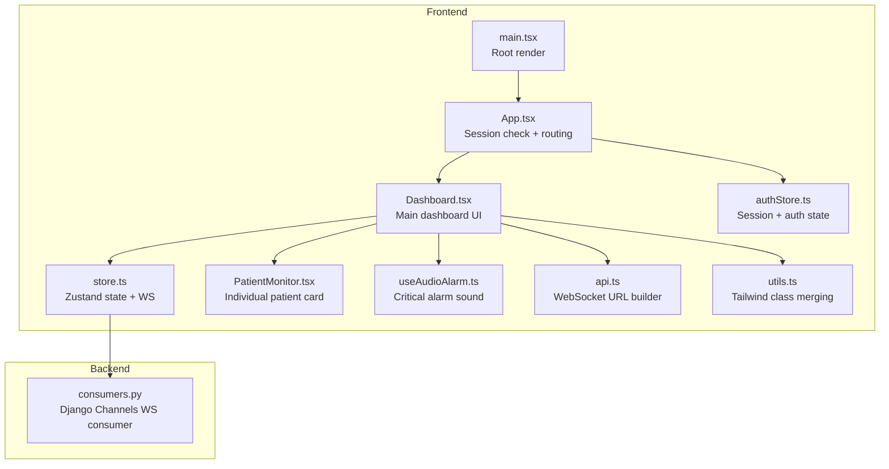
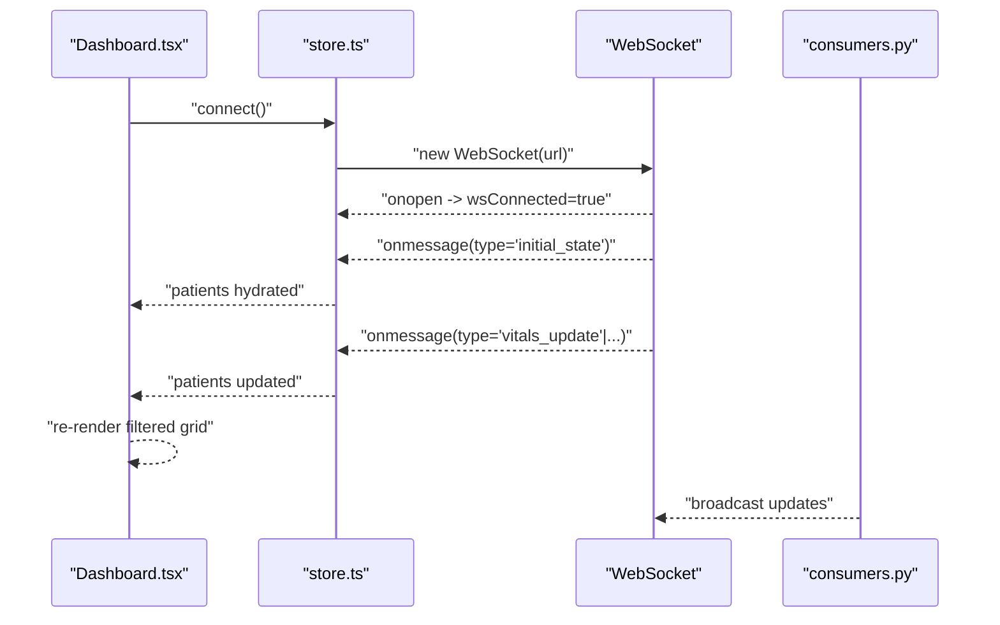
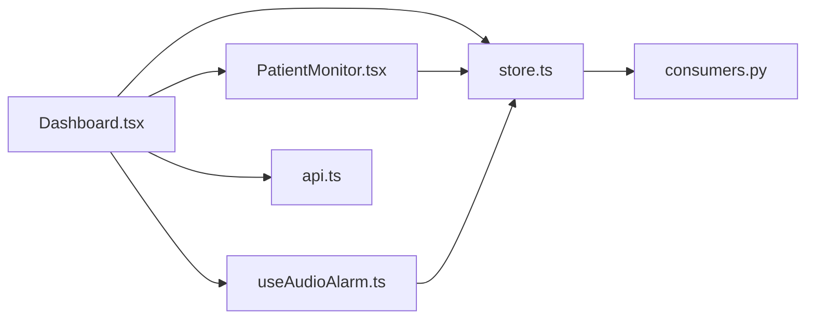

# Main Dashboard Component

<cite>
**Referenced Files in This Document**
- [Dashboard.tsx](file://frontend/src/components/Dashboard.tsx)
- [store.ts](file://frontend/src/store.ts)
- [api.ts](file://frontend/src/lib/api.ts)
- [PatientMonitor.tsx](file://frontend/src/components/PatientMonitor.tsx)
- [useAudioAlarm.ts](file://frontend/src/hooks/useAudioAlarm.ts)
- [App.tsx](file://frontend/src/App.tsx)
- [main.tsx](file://frontend/src/main.tsx)
- [authStore.ts](file://frontend/src/authStore.ts)
- [utils.ts](file://frontend/src/lib/utils.ts)
- [consumers.py](file://backend/monitoring/consumers.py)
</cite>

## Table of Contents
1. [Introduction](#introduction)
2. [Project Structure](#project-structure)
3. [Core Components](#core-components)
4. [Architecture Overview](#architecture-overview)
5. [Detailed Component Analysis](#detailed-component-analysis)
6. [Dependency Analysis](#dependency-analysis)
7. [Performance Considerations](#performance-considerations)
8. [Troubleshooting Guide](#troubleshooting-guide)
9. [Conclusion](#conclusion)
10. [Appendices](#appendices)

## Introduction
This document provides comprehensive documentation for the Main Dashboard component, the central hub for patient monitoring. It explains the sticky header with navigation controls, filtering system (severity, department, search), and responsive grid layout for patient cards. It also covers real-time data management via the Zustand store, WebSocket integration, state synchronization patterns, status indicators (online/offline, AI risk alerts, audio mute, privacy mode), and accessibility features. Practical customization examples are included for layouts, filters, status indicators, and responsive behavior.

## Project Structure
The dashboard is part of a React + TypeScript frontend using Zustand for state management and Tailwind CSS for styling. The backend uses Django Channels for WebSocket communication. The main entry renders the app shell, which conditionally renders the Dashboard after session validation.

**Diagram sources**
- [main.tsx:1-16](file://frontend/src/main.tsx#L1-L16)
- [App.tsx:1-34](file://frontend/src/App.tsx#L1-L34)
- [Dashboard.tsx:1-429](file://frontend/src/components/Dashboard.tsx#L1-L429)
- [store.ts:1-353](file://frontend/src/store.ts#L1-L353)
- [PatientMonitor.tsx:1-372](file://frontend/src/components/PatientMonitor.tsx#L1-L372)
- [useAudioAlarm.ts:1-92](file://frontend/src/hooks/useAudioAlarm.ts#L1-L92)
- [api.ts:1-35](file://frontend/src/lib/api.ts#L1-L35)
- [authStore.ts:1-107](file://frontend/src/authStore.ts#L1-L107)
- [utils.ts:1-8](file://frontend/src/lib/utils.ts#L1-L8)
- [consumers.py:1-46](file://backend/monitoring/consumers.py#L1-L46)

**Section sources**
- [main.tsx:1-16](file://frontend/src/main.tsx#L1-L16)
- [App.tsx:1-34](file://frontend/src/App.tsx#L1-L34)
- [Dashboard.tsx:1-429](file://frontend/src/components/Dashboard.tsx#L1-L429)
- [store.ts:1-353](file://frontend/src/store.ts#L1-L353)
- [PatientMonitor.tsx:1-372](file://frontend/src/components/PatientMonitor.tsx#L1-L372)
- [useAudioAlarm.ts:1-92](file://frontend/src/hooks/useAudioAlarm.ts#L1-L92)
- [api.ts:1-35](file://frontend/src/lib/api.ts#L1-L35)
- [authStore.ts:1-107](file://frontend/src/authStore.ts#L1-L107)
- [utils.ts:1-8](file://frontend/src/lib/utils.ts#L1-L8)
- [consumers.py:1-46](file://backend/monitoring/consumers.py#L1-L46)

## Core Components
- Dashboard: Orchestrates the sticky header, filters, grid layout, modals, and real-time data binding.
- Zustand Store: Manages patients, WebSocket lifecycle, privacy mode, search query, audio mute, and actions.
- PatientMonitor: Individual patient card with severity styling, vitals display, and interactive controls.
- useAudioAlarm: Browser autoplay-safe audio feedback for critical alarms.
- Backend Consumer: Django Channels consumer handling authentication, initial state, and broadcasting updates.

Key responsibilities:
- Real-time updates: WebSocket messages update patient records atomically.
- Filtering: Combined filters for severity, department, and free-text search.
- Accessibility: Keyboard navigation, ARIA labels, focus management, and screen-reader-friendly status indicators.
- Responsive design: Tailwind-based grid adapting to small/medium/large breakpoints.

**Section sources**
- [Dashboard.tsx:32-429](file://frontend/src/components/Dashboard.tsx#L32-L429)
- [store.ts:143-353](file://frontend/src/store.ts#L143-L353)
- [PatientMonitor.tsx:13-372](file://frontend/src/components/PatientMonitor.tsx#L13-L372)
- [useAudioAlarm.ts:12-92](file://frontend/src/hooks/useAudioAlarm.ts#L12-L92)
- [consumers.py:12-46](file://backend/monitoring/consumers.py#L12-L46)

## Architecture Overview
The dashboard integrates frontend and backend through a WebSocket channel. The frontend maintains a normalized patient map in Zustand and applies real-time updates. The backend serializes initial state and streams incremental updates per patient.

**Diagram sources**
- [Dashboard.tsx:49-54](file://frontend/src/components/Dashboard.tsx#L49-L54)
- [store.ts:219-352](file://frontend/src/store.ts#L219-L352)
- [consumers.py:26-36](file://backend/monitoring/consumers.py#L26-L36)

## Detailed Component Analysis

### Sticky Header and Navigation Controls
The sticky header displays clinic identity, live connection status, clock, and control buttons:
- Connection status indicator with live region semantics.
- Search input bound to global search query.
- Severity filters: All, Critical, Warning, Pinned.
- Department filter dropdown.
- Action buttons: Admit, Audio mute, Privacy mode, Color guide, Settings, Logout.
- AI risk alert button triggers modal with dynamic count detection.

Accessibility features:
- Skip-to-main-content link for keyboard users.
- ARIA live region for connection status.
- Proper aria-labels and aria-pressed states.
- Focus-visible styles and tab order.

Customization tips:
- Add new severity categories by extending filter state and rendering logic.
- Introduce additional dropdown filters by adding new state and mapping to filters.

**Section sources**
- [Dashboard.tsx:135-306](file://frontend/src/components/Dashboard.tsx#L135-L306)
- [Dashboard.tsx:150-156](file://frontend/src/components/Dashboard.tsx#L150-L156)
- [Dashboard.tsx:167-175](file://frontend/src/components/Dashboard.tsx#L167-L175)
- [Dashboard.tsx:182-213](file://frontend/src/components/Dashboard.tsx#L182-L213)
- [Dashboard.tsx:218-227](file://frontend/src/components/Dashboard.tsx#L218-L227)
- [Dashboard.tsx:238-304](file://frontend/src/components/Dashboard.tsx#L238-L304)

### Filtering System
Combined filters applied before sorting:
- Search: Name or ID substring match.
- Severity: Red (Critical), Yellow/Blue/Purple (Warning), or Pinned.
- Department: Reanimatsiya or Palata.

Sorting prioritizes pinned patients.

Performance:
- Memoized derived counts and filtered lists.
- Efficient filtering pipeline with early exits.

Extensibility:
- Add new filters by introducing new state and including conditions in the filter predicate.
- Example: Add age-range or diagnosis-based filters by augmenting the predicate.

**Section sources**
- [Dashboard.tsx:76-98](file://frontend/src/components/Dashboard.tsx#L76-L98)
- [Dashboard.tsx:100-106](file://frontend/src/components/Dashboard.tsx#L100-L106)

### Responsive Grid Layout
Three severity groups rendered as separate grids:
- Critical (Red): Large cards arranged in a dense 5-column layout.
- Warning (Yellow/Blue/Purple): Medium cards in a wider 10-column layout.
- Stable (None): Small cards in a sparse 15-column layout.

Grid responsiveness:
- Uses Tailwind grid-cols-* utilities with breakpoint-specific overrides.
- Cards adapt size and spacing based on container width.

Optimization tips:
- Adjust column counts per breakpoint to balance density vs readability.
- Consider virtualization for very large patient sets.

**Section sources**
- [Dashboard.tsx:340-386](file://frontend/src/components/Dashboard.tsx#L340-L386)
- [Dashboard.tsx:348-351](file://frontend/src/components/Dashboard.tsx#L348-L351)
- [Dashboard.tsx:363-367](file://frontend/src/components/Dashboard.tsx#L363-L367)
- [Dashboard.tsx:378-382](file://frontend/src/components/Dashboard.tsx#L378-L382)

### Real-Time Data Management and WebSocket Handling
Zustand store manages:
- Patients map keyed by ID.
- WebSocket lifecycle (connect/disconnect).
- Connection state and reconnection logic.
- Actions sent to backend (toggle pin, add note, acknowledge alarm, etc.).

Backend consumer:
- Accepts authenticated connections scoped to clinic.
- Sends initial_state with all patients.
- Broadcasts vitals_update events for incremental updates.

State synchronization:
- Full refresh for patient_refresh.
- Incremental updates for vitals_update.
- Discharge removes patient from store and clears selection.

**Section sources**
- [store.ts:143-168](file://frontend/src/store.ts#L143-L168)
- [store.ts:219-352](file://frontend/src/store.ts#L219-L352)
- [store.ts:237-317](file://frontend/src/store.ts#L237-L317)
- [consumers.py:12-46](file://backend/monitoring/consumers.py#L12-L46)

### Status Indicators
- Online/Offline: Visual dot and label synchronized with wsConnected.
- AI Risk Alerts: Modal opens when new AI-risk patients appear.
- Audio Mute: Toggles browser-generated tones for critical alarms.
- Privacy Mode: Masks patient names; affects PatientMonitor display.

Integration points:
- useAudioAlarm monitors critical alarms and audio mute state.
- PatientMonitor respects privacyMode for name masking.
- Dashboard controls toggles and triggers modals.

**Section sources**
- [Dashboard.tsx:150-156](file://frontend/src/components/Dashboard.tsx#L150-L156)
- [Dashboard.tsx:63-74](file://frontend/src/components/Dashboard.tsx#L63-L74)
- [Dashboard.tsx:259-265](file://frontend/src/components/Dashboard.tsx#L259-L265)
- [Dashboard.tsx:267-275](file://frontend/src/components/Dashboard.tsx#L267-L275)
- [useAudioAlarm.ts:12-92](file://frontend/src/hooks/useAudioAlarm.ts#L12-L92)
- [PatientMonitor.tsx:81-83](file://frontend/src/components/PatientMonitor.tsx#L81-L83)

### Patient Card Component (PatientMonitor)
Highlights:
- Dynamic border and background based on alarm level.
- Vitals display (HR, SpO2, NIBP) with limits and battery status.
- Interactive controls: Pin toggle, schedule menu, acknowledge alarm, NIBP measurement.
- NEWS2 score badge with color-coded thresholds.
- Privacy-aware name display.

Accessibility:
- Role="button" with keyboard activation (Enter/Space).
- ARIA labels and roles for menus and controls.
- Focus management for dropdown menus.

Extensibility:
- Add new vitals by extending the vitals grid and limits display.
- Integrate additional actions by adding buttons and dispatching store actions.

**Section sources**
- [PatientMonitor.tsx:73-79](file://frontend/src/components/PatientMonitor.tsx#L73-L79)
- [PatientMonitor.tsx:242-368](file://frontend/src/components/PatientMonitor.tsx#L242-L368)
- [PatientMonitor.tsx:96-112](file://frontend/src/components/PatientMonitor.tsx#L96-L112)
- [PatientMonitor.tsx:102-107](file://frontend/src/components/PatientMonitor.tsx#L102-L107)
- [PatientMonitor.tsx:222-234](file://frontend/src/components/PatientMonitor.tsx#L222-L234)

### Authentication and App Shell
- Session check on mount determines whether to show Login or Dashboard.
- Auth store handles CSRF and session cookies for API calls.

**Section sources**
- [App.tsx:11-33](file://frontend/src/App.tsx#L11-L33)
- [authStore.ts:23-78](file://frontend/src/authStore.ts#L23-L78)

## Dependency Analysis
The dashboard composes multiple modules with clear boundaries:
- UI depends on Zustand store for state and actions.
- Store encapsulates WebSocket lifecycle and message parsing.
- PatientMonitor is a pure UI component consuming store state and dispatching actions.
- useAudioAlarm is a hook observing critical alarms and audio mute.
- Backend consumer provides initial and incremental updates.

**Diagram sources**
- [Dashboard.tsx:1-429](file://frontend/src/components/Dashboard.tsx#L1-L429)
- [store.ts:1-353](file://frontend/src/store.ts#L1-L353)
- [PatientMonitor.tsx:1-372](file://frontend/src/components/PatientMonitor.tsx#L1-L372)
- [useAudioAlarm.ts:1-92](file://frontend/src/hooks/useAudioAlarm.ts#L1-L92)
- [api.ts:1-35](file://frontend/src/lib/api.ts#L1-L35)
- [consumers.py:1-46](file://backend/monitoring/consumers.py#L1-L46)

**Section sources**
- [Dashboard.tsx:1-429](file://frontend/src/components/Dashboard.tsx#L1-L429)
- [store.ts:1-353](file://frontend/src/store.ts#L1-L353)
- [PatientMonitor.tsx:1-372](file://frontend/src/components/PatientMonitor.tsx#L1-L372)
- [useAudioAlarm.ts:1-92](file://frontend/src/hooks/useAudioAlarm.ts#L1-L92)
- [api.ts:1-35](file://frontend/src/lib/api.ts#L1-L35)
- [consumers.py:1-46](file://backend/monitoring/consumers.py#L1-L46)

## Performance Considerations
- Memoization: Derived counts and filtered lists prevent unnecessary re-renders.
- Efficient filtering: Short-circuit evaluation reduces work per update.
- Grid responsiveness: Tailwind utilities avoid expensive calculations.
- WebSocket batching: Backend sends incremental updates; frontend merges efficiently.
- Audio context: Suspends/resumes on user gestures to satisfy autoplay policies.

Recommendations:
- Virtualize large grids if patient counts exceed ~100.
- Debounce search input to limit frequent re-filtering.
- Lazy-load modals to reduce initial bundle size.

[No sources needed since this section provides general guidance]

## Troubleshooting Guide
Common issues and resolutions:
- No patients displayed:
  - Verify WebSocket connection status and reconnection behavior.
  - Check initial_state reception and error logs.
- Filters not working:
  - Confirm filter state updates and predicate logic.
  - Ensure searchQuery is propagated to the store.
- Audio not playing:
  - Ensure user gesture triggered resume of AudioContext.
  - Verify isAudioMuted flag is false.
- Privacy mode not masking names:
  - Confirm privacyMode state and its propagation to PatientMonitor.
- Backend errors:
  - Review Django Channels consumer logs and authentication checks.

**Section sources**
- [store.ts:314-335](file://frontend/src/store.ts#L314-L335)
- [Dashboard.tsx:49-54](file://frontend/src/components/Dashboard.tsx#L49-L54)
- [useAudioAlarm.ts:20-35](file://frontend/src/hooks/useAudioAlarm.ts#L20-L35)
- [PatientMonitor.tsx:81-83](file://frontend/src/components/PatientMonitor.tsx#L81-L83)
- [consumers.py:13-25](file://backend/monitoring/consumers.py#L13-L25)

## Conclusion
The Main Dashboard integrates a sticky header, robust filtering, responsive grid, and real-time state synchronization through a WebSocket-connected Zustand store. Accessibility is built-in with ARIA attributes, keyboard navigation, and focus management. Extensibility points allow adding new filters, status indicators, and layout variants while maintaining performance and usability.

[No sources needed since this section summarizes without analyzing specific files]

## Appendices

### Practical Customization Examples

- Customizing dashboard layouts:
  - Modify grid column classes in each severity section to adjust density.
  - Add new sections (e.g., “Pending” or “Post-op”) by introducing new filter states and rendering blocks.

- Implementing additional filters:
  - Add new state (e.g., ageRange, diagnosis) and include it in the filter predicate.
  - Extend the filter UI with inputs/selects and bind to the store.

- Adding new status indicators:
  - Extend AlarmState and UI badges in PatientMonitor.
  - Update severity styles and grid grouping accordingly.

- Optimizing grid responsiveness:
  - Use Tailwind’s responsive modifiers to tune column counts per breakpoint.
  - Consider aspect-ratio utilities or containers for consistent card sizing.

[No sources needed since this section provides general guidance]