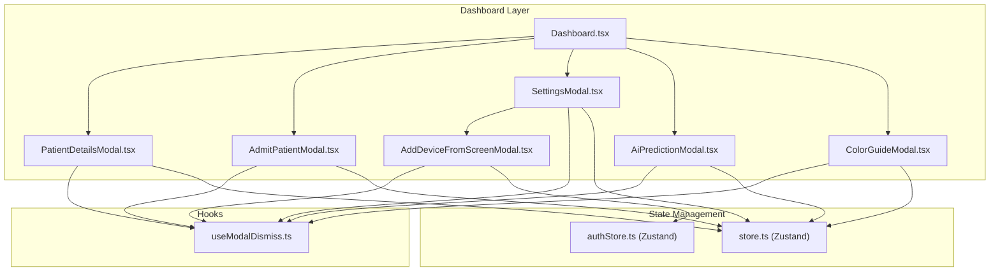
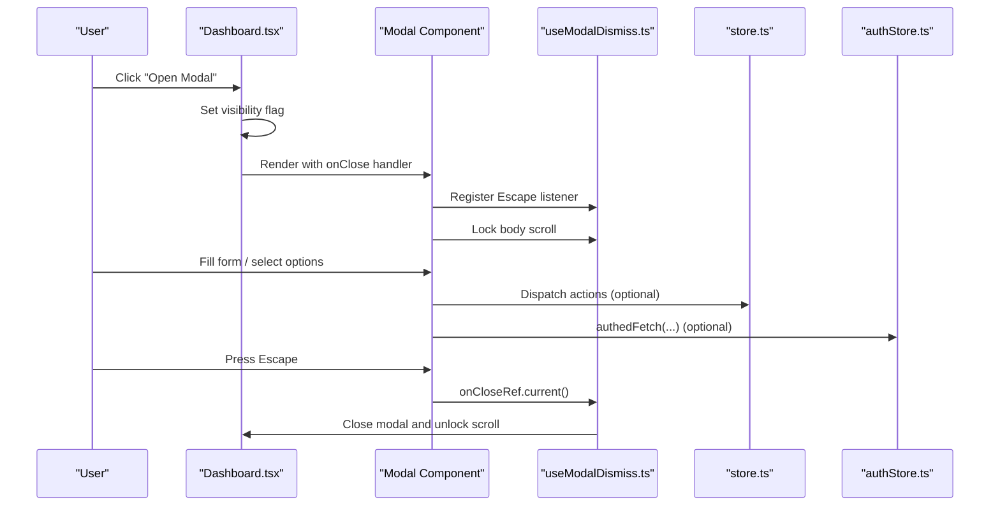
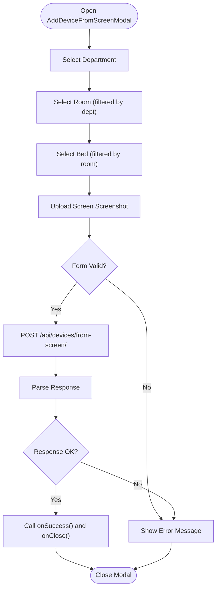
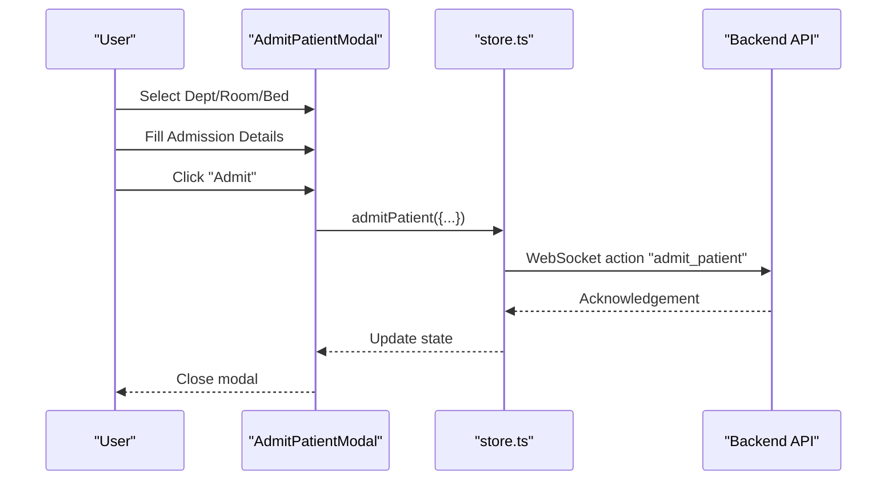
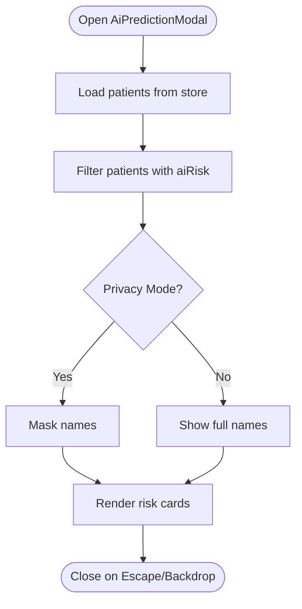
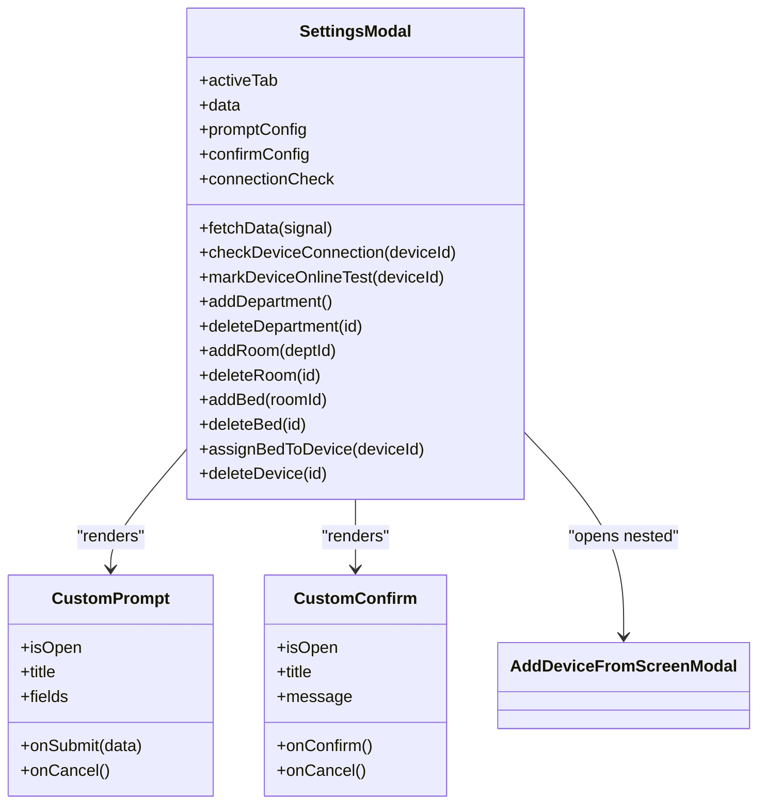
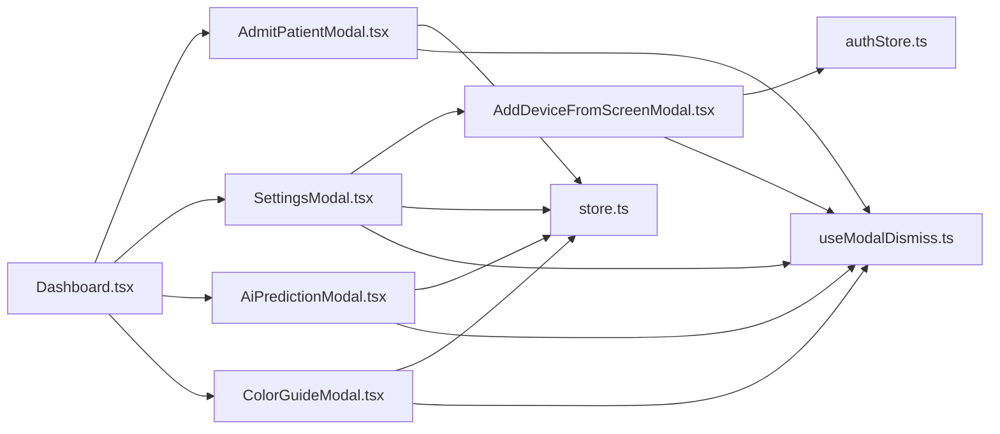

# Modal Components System

<cite>
**Referenced Files in This Document**
- [AddDeviceFromScreenModal.tsx](file://frontend/src/components/AddDeviceFromScreenModal.tsx)
- [AdmitPatientModal.tsx](file://frontend/src/components/AdmitPatientModal.tsx)
- [AiPredictionModal.tsx](file://frontend/src/components/AiPredictionModal.tsx)
- [ColorGuideModal.tsx](file://frontend/src/components/ColorGuideModal.tsx)
- [SettingsModal.tsx](file://frontend/src/components/SettingsModal.tsx)
- [Dashboard.tsx](file://frontend/src/components/Dashboard.tsx)
- [PatientDetailsModal.tsx](file://frontend/src/components/PatientDetailsModal.tsx)
- [useModalDismiss.ts](file://frontend/src/hooks/useModalDismiss.ts)
- [store.ts](file://frontend/src/store.ts)
- [authStore.ts](file://frontend/src/authStore.ts)
</cite>

## Table of Contents
1. [Introduction](#introduction)
2. [Project Structure](#project-structure)
3. [Core Components](#core-components)
4. [Architecture Overview](#architecture-overview)
5. [Detailed Component Analysis](#detailed-component-analysis)
6. [Dependency Analysis](#dependency-analysis)
7. [Performance Considerations](#performance-considerations)
8. [Troubleshooting Guide](#troubleshooting-guide)
9. [Conclusion](#conclusion)

## Introduction
This document explains the modal component system used throughout the dashboard interface. It covers the common modal architecture, overlay management, focus trapping, keyboard navigation (Escape key), and proper ARIA attributes for accessibility. It documents each specific modal component and provides practical guidance for creating custom modal dialogs, implementing form validation, handling modal state with Zustand, integrating modals with the main dashboard navigation, and ensuring responsive behavior and performance.

## Project Structure
The modal system is implemented as a set of reusable React components that share common patterns for overlay management, keyboard handling, and accessibility. The main dashboard orchestrates modal visibility and passes callbacks to close modals. Authentication-aware API requests are handled via a dedicated store utility.

**Diagram sources**
- [Dashboard.tsx:412-425](file://frontend/src/components/Dashboard.tsx#L412-L425)
- [useModalDismiss.ts:23-44](file://frontend/src/hooks/useModalDismiss.ts#L23-L44)
- [store.ts:173-352](file://frontend/src/store.ts#L173-L352)
- [authStore.ts:98-106](file://frontend/src/authStore.ts#L98-L106)

**Section sources**
- [Dashboard.tsx:32-429](file://frontend/src/components/Dashboard.tsx#L32-L429)

## Core Components
- Overlay and container: All modals are rendered as fixed-position overlays with backdrop blur and z-index stacking to ensure they appear above the main content.
- Accessibility: Each modal sets role="dialog" and aria-modal="true". Titles use aria-labelledby pointing to an h2 element inside the modal header.
- Escape handling: A shared hook manages Escape key behavior and body scroll locking to prevent background scrolling when modals are open.
- Focus management: Clicking the overlay closes the modal; clicking inside the modal content stops propagation to prevent accidental closure.
- State orchestration: The dashboard maintains visibility flags and passes onClose handlers to each modal. Some modals integrate with Zustand stores for data and actions.

Key shared patterns:
- Overlay click-to-close: The outermost div handles closing when the user clicks the backdrop.
- Content click propagation: The inner dialog div stops event propagation to keep the modal open when interacting with controls.
- ARIA labeling: Proper roles and labels ensure assistive technologies interpret modals correctly.

**Section sources**
- [useModalDismiss.ts:23-44](file://frontend/src/hooks/useModalDismiss.ts#L23-L44)
- [Dashboard.tsx:412-425](file://frontend/src/components/Dashboard.tsx#L412-L425)

## Architecture Overview
The modal system follows a consistent pattern:
- Orchestration: Dashboard.tsx controls which modals are shown and passes callbacks.
- Shared behavior: useModalDismiss.ts provides Escape key handling and body scroll locking.
- Data access: Components use authStore.ts for authenticated API calls and store.ts for state-driven actions.
- Composition: Some modals (e.g., SettingsModal) embed other modals (e.g., AddDeviceFromScreenModal) to reduce duplication.

**Diagram sources**
- [Dashboard.tsx:412-425](file://frontend/src/components/Dashboard.tsx#L412-L425)
- [useModalDismiss.ts:23-44](file://frontend/src/hooks/useModalDismiss.ts#L23-L44)
- [store.ts:173-352](file://frontend/src/store.ts#L173-L352)
- [authStore.ts:98-106](file://frontend/src/authStore.ts#L98-L106)

## Detailed Component Analysis

### AddDeviceFromScreenModal
Purpose: Device management workflow that allows associating a monitor device with a bed by uploading a screenshot of the monitor’s network screen. Integrates with backend vision processing.

Key behaviors:
- Multi-step selection: Department → Room → Bed selection with cascading filters.
- File upload: Image selection with preview and validation.
- Form submission: Sends FormData with bedId and image to backend endpoint.
- Error handling: Parses response text safely and displays user-friendly errors.
- Accessibility: Uses role="dialog", aria-modal="true", and aria-labelledby for the title.

**Diagram sources**
- [AddDeviceFromScreenModal.tsx:69-105](file://frontend/src/components/AddDeviceFromScreenModal.tsx#L69-L105)

**Section sources**
- [AddDeviceFromScreenModal.tsx:18-262](file://frontend/src/components/AddDeviceFromScreenModal.tsx#L18-L262)

### AdmitPatientModal
Purpose: Patient admission process allowing selection of department, room, and bed, plus collection of admission details.

Key behaviors:
- Cascading infrastructure selection: Departments → Rooms → Beds.
- Form state management: Tracks admission details (name, diagnosis, doctor, assigned nurse).
- Submission: Calls a store action to admit the patient and then closes the modal.
- Accessibility: Role="dialog", aria-modal="true", and aria-labelledby for the title.

**Diagram sources**
- [AdmitPatientModal.tsx:76-98](file://frontend/src/components/AdmitPatientModal.tsx#L76-L98)
- [store.ts:212-217](file://frontend/src/store.ts#L212-L217)

**Section sources**
- [AdmitPatientModal.tsx:22-312](file://frontend/src/components/AdmitPatientModal.tsx#L22-L312)

### AiPredictionModal
Purpose: Displays AI risk assessments for patients flagged as high-risk by the AI model.

Key behaviors:
- Data sourcing: Reads patients from Zustand store and filters those with aiRisk.
- Privacy mode: Masks patient names when privacy mode is enabled.
- Layout: Responsive grid layout for risk cards with time estimates, reasons, and recommendations.

**Diagram sources**
- [AiPredictionModal.tsx:10-16](file://frontend/src/components/AiPredictionModal.tsx#L10-L16)
- [AiPredictionModal.tsx:54-124](file://frontend/src/components/AiPredictionModal.tsx#L54-L124)

**Section sources**
- [AiPredictionModal.tsx:10-130](file://frontend/src/components/AiPredictionModal.tsx#L10-L130)

### SettingsModal
Purpose: System configuration and infrastructure management, including device connection checks, HL7 handshake configuration, and integration diagnostics.

Key behaviors:
- Tabbed interface: Structure, Devices, Patients, Integration.
- Embedded dialogs: CustomPrompt and CustomConfirm for lightweight confirmations and prompts.
- Nested modal: Can open AddDeviceFromScreenModal for adding devices via screenshot.
- Device connection checks: Fetches diagnostic data and renders status with warnings and hints.
- Actions: Add/delete departments, rooms, beds; assign devices to beds; mark devices online; delete devices.

**Diagram sources**
- [SettingsModal.tsx:93-162](file://frontend/src/components/SettingsModal.tsx#L93-L162)
- [SettingsModal.tsx:15-91](file://frontend/src/components/SettingsModal.tsx#L15-L91)
- [SettingsModal.tsx:407-420](file://frontend/src/components/SettingsModal.tsx#L407-L420)

**Section sources**
- [SettingsModal.tsx:93-954](file://frontend/src/components/SettingsModal.tsx#L93-L954)

### ColorGuideModal
Purpose: Provides an accessible guide to interpreting alarm colors and visual indicators across the dashboard.

Key behaviors:
- Informative layout: Sections for patient card signals, department headers, NEWS2 scoring, and additional icons.
- Accessibility: Uses semantic headings and lists with ARIA labels where appropriate.

**Section sources**
- [ColorGuideModal.tsx:17-179](file://frontend/src/components/ColorGuideModal.tsx#L17-L179)

### PatientDetailsModal (Context)
While not part of the five primary modals, PatientDetailsModal demonstrates advanced patterns used across the system:
- Error boundary: Wraps content to gracefully handle rendering errors.
- Tabbed interface: Overview, Limits, Medications, Labs, Notes.
- Local state vs. store: Manages local editing state for alarm limits while delegating persistence to the store.
- Export functionality: CSV export of patient history.

**Section sources**
- [PatientDetailsModal.tsx:82-641](file://frontend/src/components/PatientDetailsModal.tsx#L82-L641)

## Dependency Analysis
- Orchestration: Dashboard.tsx toggles modal visibility and passes onClose handlers.
- Shared behavior: useModalDismiss.ts centralizes Escape key handling and body scroll locking.
- State: store.ts provides actions and reactive data for patients, alarms, and UI state.
- Authentication: authStore.ts provides authedFetch for CSRF-protected API calls.
- Composition: SettingsModal composes AddDeviceFromScreenModal and lightweight dialogs.

**Diagram sources**
- [Dashboard.tsx:412-425](file://frontend/src/components/Dashboard.tsx#L412-L425)
- [useModalDismiss.ts:23-44](file://frontend/src/hooks/useModalDismiss.ts#L23-L44)
- [store.ts:173-352](file://frontend/src/store.ts#L173-L352)
- [authStore.ts:98-106](file://frontend/src/authStore.ts#L98-L106)

**Section sources**
- [Dashboard.tsx:412-425](file://frontend/src/components/Dashboard.tsx#L412-L425)

## Performance Considerations
- Overlay rendering: Modals are conditionally rendered by the dashboard, minimizing DOM overhead when closed.
- Body scroll locking: useModalDismiss.ts prevents background scroll during modal sessions, improving perceived stability.
- Z-index strategy: Each modal uses a distinct z-index to avoid stacking conflicts while keeping the overlay above the main content.
- Responsive design: Modals use max-width and max-height constraints with overflow handling to remain usable across screen sizes.
- Event propagation: Click-to-close is implemented on the overlay; stopping propagation on modal content prevents accidental closures and reduces re-renders.
- Lazy initialization: Some modals defer heavy computations until opened (e.g., SettingsModal fetches data on mount).

[No sources needed since this section provides general guidance]

## Troubleshooting Guide
Common issues and resolutions:
- Escape key not closing modal: Ensure useModalDismiss is invoked with the correct isOpen and onClose parameters.
- Background scrolls under modal: Confirm body scroll locking is active; verify no other modal is still open.
- Form submission fails: Check authedFetch usage and CSRF token availability; verify backend endpoints and error responses.
- Nested modal not closing: Ensure the parent modal handles Escape and backdrop clicks correctly and that nested modals pass their own onClose handlers up the chain.

**Section sources**
- [useModalDismiss.ts:23-44](file://frontend/src/hooks/useModalDismiss.ts#L23-L44)
- [authStore.ts:98-106](file://frontend/src/authStore.ts#L98-L106)

## Conclusion
The modal component system provides a consistent, accessible, and performant foundation for interactive workflows across the dashboard. By centralizing Escape handling and body scroll management, leveraging ARIA-compliant markup, and composing modals thoughtfully, the system ensures a reliable user experience. The integration with Zustand enables seamless state synchronization, while authentication-aware API utilities support secure backend interactions.