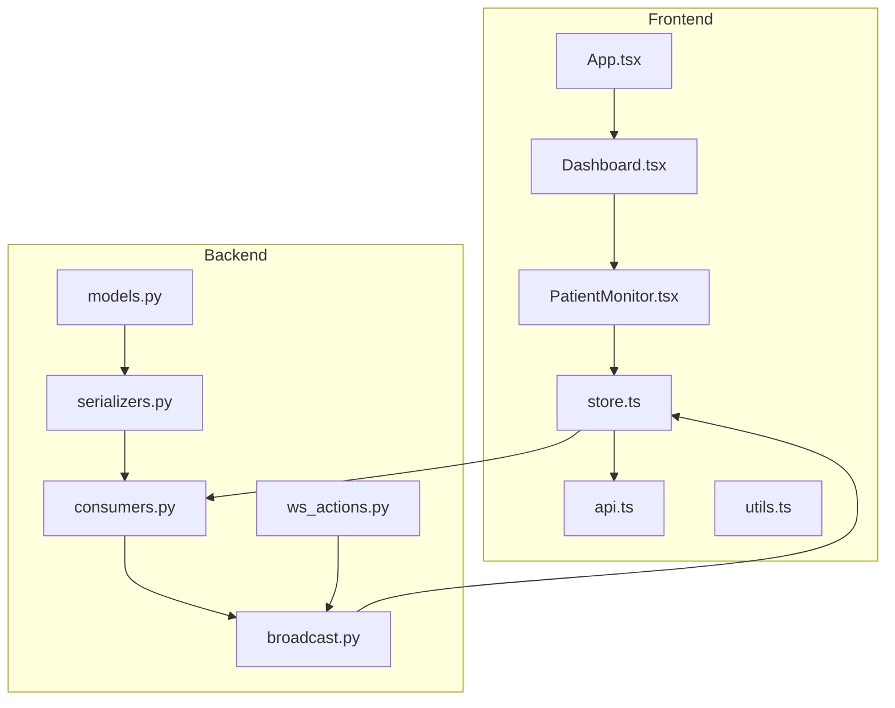
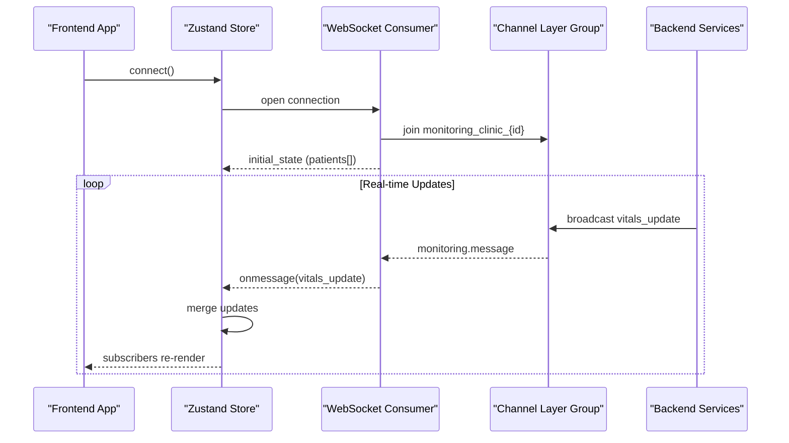
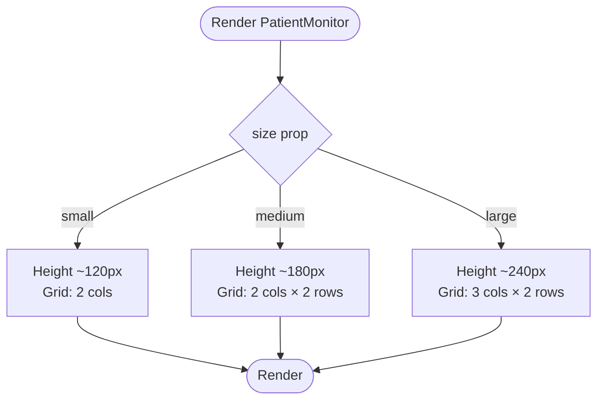
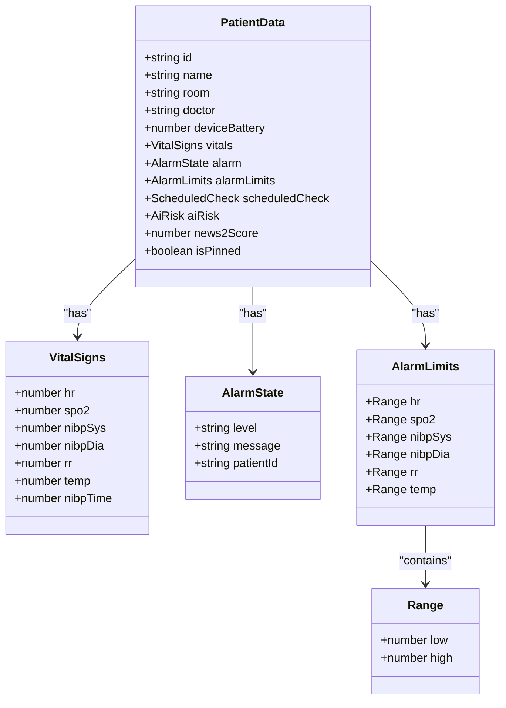
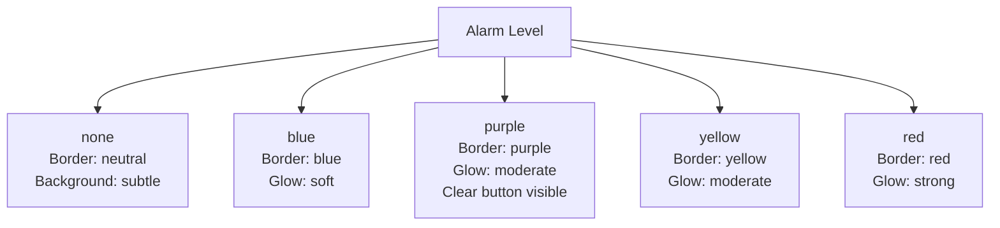
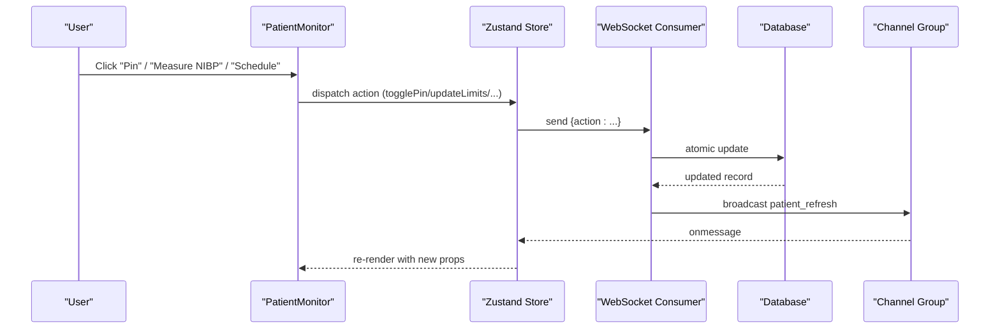
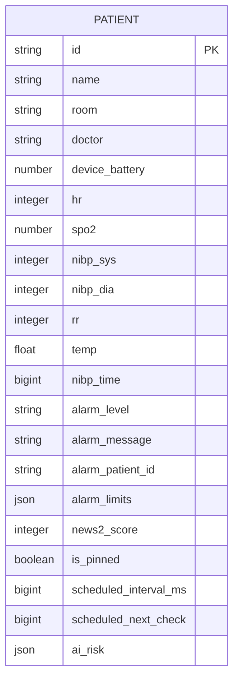
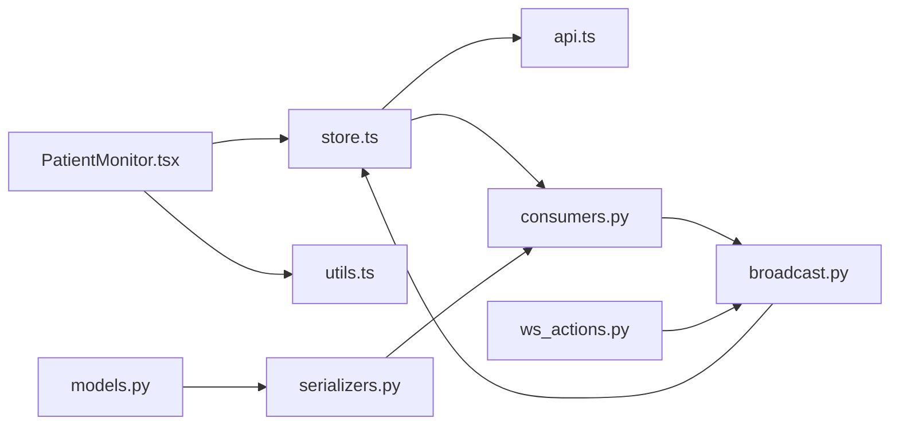

# Patient Monitor Widget

<cite>
**Referenced Files in This Document**
- [PatientMonitor.tsx](file://frontend/src/components/PatientMonitor.tsx)
- [Dashboard.tsx](file://frontend/src/components/Dashboard.tsx)
- [store.ts](file://frontend/src/store.ts)
- [api.ts](file://frontend/src/lib/api.ts)
- [utils.ts](file://frontend/src/lib/utils.ts)
- [App.tsx](file://frontend/src/App.tsx)
- [consumers.py](file://backend/monitoring/consumers.py)
- [broadcast.py](file://backend/monitoring/broadcast.py)
- [models.py](file://backend/monitoring/models.py)
- [serializers.py](file://backend/monitoring/serializers.py)
- [ws_actions.py](file://backend/monitoring/ws_actions.py)
</cite>

## Table of Contents
1. [Introduction](#introduction)
2. [Project Structure](#project-structure)
3. [Core Components](#core-components)
4. [Architecture Overview](#architecture-overview)
5. [Detailed Component Analysis](#detailed-component-analysis)
6. [Dependency Analysis](#dependency-analysis)
7. [Performance Considerations](#performance-considerations)
8. [Troubleshooting Guide](#troubleshooting-guide)
9. [Conclusion](#conclusion)
10. [Appendices](#appendices)

## Introduction
The Patient Monitor widget is a real-time vitals dashboard component designed to present individual patient status in a compact, color-coded card. It supports three adaptive sizes (large, medium, small) and responds to grid layouts for optimal display across screen sizes. The widget shows key vitals (heart rate, oxygen saturation, non-invasive blood pressure, respiratory rate, and temperature) with contextual information such as scheduled checks, device battery, and NEWS2 risk scoring. It integrates with a WebSocket system to receive live updates and implements an alarm level system with visual indicators ranging from none to red/purple.

## Project Structure
The Patient Monitor lives in the frontend under the components directory and is orchestrated by the Dashboard layout. The frontend state is managed via a Zustand store, while the backend exposes a WebSocket endpoint for real-time updates and broadcasts events to clients grouped by clinic.

**Diagram sources**
- [PatientMonitor.tsx:1-372](file://frontend/src/components/PatientMonitor.tsx#L1-L372)
- [Dashboard.tsx:1-429](file://frontend/src/components/Dashboard.tsx#L1-L429)
- [store.ts:1-353](file://frontend/src/store.ts#L1-L353)
- [api.ts:1-35](file://frontend/src/lib/api.ts#L1-L35)
- [utils.ts:1-8](file://frontend/src/lib/utils.ts#L1-L8)
- [App.tsx:1-34](file://frontend/src/App.tsx#L1-L34)
- [consumers.py:1-46](file://backend/monitoring/consumers.py#L1-L46)
- [broadcast.py:1-20](file://backend/monitoring/broadcast.py#L1-L20)
- [models.py:141-183](file://backend/monitoring/models.py#L141-L183)
- [serializers.py:13-87](file://backend/monitoring/serializers.py#L13-L87)
- [ws_actions.py:32-229](file://backend/monitoring/ws_actions.py#L32-L229)

**Section sources**
- [PatientMonitor.tsx:1-372](file://frontend/src/components/PatientMonitor.tsx#L1-L372)
- [Dashboard.tsx:1-429](file://frontend/src/components/Dashboard.tsx#L1-L429)
- [store.ts:1-353](file://frontend/src/store.ts#L1-L353)
- [api.ts:1-35](file://frontend/src/lib/api.ts#L1-L35)
- [utils.ts:1-8](file://frontend/src/lib/utils.ts#L1-L8)
- [App.tsx:1-34](file://frontend/src/App.tsx#L1-L34)
- [consumers.py:1-46](file://backend/monitoring/consumers.py#L1-L46)
- [broadcast.py:1-20](file://backend/monitoring/broadcast.py#L1-L20)
- [models.py:141-183](file://backend/monitoring/models.py#L141-L183)
- [serializers.py:13-87](file://backend/monitoring/serializers.py#L13-L87)
- [ws_actions.py:32-229](file://backend/monitoring/ws_actions.py#L32-L229)

## Core Components
- PatientMonitor: The main widget component that renders vitals, alarm status, and interactive controls. It accepts a patient object and an optional size prop and is memoized for performance.
- Dashboard: Orchestrates grid layouts for critical, warning, and stable patients, assigning appropriate sizes per severity.
- Zustand Store: Manages WebSocket connection, real-time updates, and actions (toggle pin, set schedules, clear alarm, update limits, measure NIBP).
- WebSocket Consumers and Broadcast: Backend WebSocket consumer handles authentication and groups clients by clinic; broadcast sends events to the group.
- Models and Serializers: Define the patient data model and serialization for initial state and updates.

Key capabilities:
- Adaptive sizing: large, medium, small cards with responsive grid layouts.
- Real-time vitals: heart rate, SpO2, NIBP, respiratory rate, temperature.
- Alarm levels: none, blue, yellow, red, purple with color-coded borders and subtle animations.
- Interactive controls: pin/unpin, scheduled checks menu, acknowledge/clear alarms, manual NIBP measurement.

**Section sources**
- [PatientMonitor.tsx:8-112](file://frontend/src/components/PatientMonitor.tsx#L8-L112)
- [Dashboard.tsx:340-386](file://frontend/src/components/Dashboard.tsx#L340-L386)
- [store.ts:143-168](file://frontend/src/store.ts#L143-L168)
- [consumers.py:12-36](file://backend/monitoring/consumers.py#L12-L36)
- [broadcast.py:10-19](file://backend/monitoring/broadcast.py#L10-L19)
- [models.py:141-183](file://backend/monitoring/models.py#L141-L183)
- [serializers.py:13-87](file://backend/monitoring/serializers.py#L13-L87)

## Architecture Overview
The system follows a real-time publish-subscribe pattern:
- Frontend connects to a WebSocket endpoint and receives initial state and incremental vitals updates.
- Backend authenticates users, scopes data by clinic, and broadcasts updates to the clinic-specific group.
- The store merges incoming updates into the local state and re-renders affected widgets.

**Diagram sources**
- [store.ts:219-352](file://frontend/src/store.ts#L219-L352)
- [consumers.py:12-36](file://backend/monitoring/consumers.py#L12-L36)
- [broadcast.py:10-19](file://backend/monitoring/broadcast.py#L10-L19)
- [serializers.py:90-97](file://backend/monitoring/serializers.py#L90-L97)

## Detailed Component Analysis

### Adaptive Sizing System
The widget adapts its height and grid layout based on the size prop:
- Small: minimal header, compact numerics grid (2-column).
- Medium: balanced layout with two rows in the numerics grid.
- Large: expanded layout with three columns and additional vitals (respiratory rate and temperature).

Responsive grid behavior in the Dashboard assigns:
- Large cards for critical patients.
- Medium cards for warning-level patients.
- Small cards for stable patients.

**Diagram sources**
- [PatientMonitor.tsx:91-112](file://frontend/src/components/PatientMonitor.tsx#L91-L112)
- [Dashboard.tsx:348-381](file://frontend/src/components/Dashboard.tsx#L348-L381)

**Section sources**
- [PatientMonitor.tsx:91-112](file://frontend/src/components/PatientMonitor.tsx#L91-L112)
- [Dashboard.tsx:348-381](file://frontend/src/components/Dashboard.tsx#L348-L381)

### Real-Time Vitals Display
The widget renders five core vitals:
- Heart Rate (HR): prominent with animated pulse when value > 0.
- Oxygen Saturation (SpO2): droplet icon and cyan color scheme.
- Non-Invasive Blood Pressure (NIBP): sys/dia pair with optional manual measurement button.
- Respiratory Rate (RR) and Temperature (Temp): shown only in large cards.

Each vital cell includes:
- Label with color-coded accent.
- Value with monospace digits and truncation handling.
- Optional threshold range display (low/high) for warning contexts.
- Hover-triggered actions (e.g., NIBP measurement).

**Diagram sources**
- [store.ts:5-135](file://frontend/src/store.ts#L5-L135)

**Section sources**
- [PatientMonitor.tsx:242-368](file://frontend/src/components/PatientMonitor.tsx#L242-L368)
- [store.ts:5-135](file://frontend/src/store.ts#L5-L135)

### Alarm Level System and Visual Indicators
The alarm system defines five levels: none, blue, purple, yellow, red. Each level maps to distinct visual styles:
- Border color and intensity.
- Background tint and blur effect.
- Subtle glow/shadow and animated pulse for elevated levels.
- Special handling for purple alarms (acknowledge/clear button).

**Diagram sources**
- [PatientMonitor.tsx:73-79](file://frontend/src/components/PatientMonitor.tsx#L73-L79)
- [store.ts:51-55](file://frontend/src/store.ts#L51-L55)

**Section sources**
- [PatientMonitor.tsx:73-172](file://frontend/src/components/PatientMonitor.tsx#L73-L172)
- [store.ts:51-55](file://frontend/src/store.ts#L51-L55)

### Interactive Controls and Actions
The widget exposes several user-driven actions:
- Pin/Unpin a patient (toggles persistent highlight).
- Set scheduled checks with intervals (10s, 30s, 1m, disable).
- Acknowledge/clear alarms (context-dependent).
- Manual NIBP measurement (triggers backend action).

These actions are dispatched via the store to the WebSocket consumer, which applies database updates and rebroadcasts the refreshed patient state.

**Diagram sources**
- [PatientMonitor.tsx:16-20](file://frontend/src/components/PatientMonitor.tsx#L16-L20)
- [store.ts:173-217](file://frontend/src/store.ts#L173-L217)
- [ws_actions.py:32-229](file://backend/monitoring/ws_actions.py#L32-L229)
- [broadcast.py:10-19](file://backend/monitoring/broadcast.py#L10-L19)

**Section sources**
- [PatientMonitor.tsx:85-235](file://frontend/src/components/PatientMonitor.tsx#L85-L235)
- [store.ts:173-217](file://frontend/src/store.ts#L173-L217)
- [ws_actions.py:32-229](file://backend/monitoring/ws_actions.py#L32-L229)

### Backend Data Model and Serialization
The backend models define the canonical patient structure, including vitals, alarm state, limits, scheduling, and optional AI risk data. Serializers convert model instances to JSON payloads sent to the frontend.

**Diagram sources**
- [models.py:141-183](file://backend/monitoring/models.py#L141-L183)
- [serializers.py:13-87](file://backend/monitoring/serializers.py#L13-L87)

**Section sources**
- [models.py:141-183](file://backend/monitoring/models.py#L141-L183)
- [serializers.py:13-87](file://backend/monitoring/serializers.py#L13-L87)

## Dependency Analysis
The Patient Monitor depends on:
- Store for state and actions.
- Utils for safe class merging.
- API for WebSocket URL construction.
- Backend consumers for connection lifecycle and group scoping.
- Broadcast for event distribution.

**Diagram sources**
- [PatientMonitor.tsx:1-6](file://frontend/src/components/PatientMonitor.tsx#L1-L6)
- [store.ts:1-3](file://frontend/src/store.ts#L1-L3)
- [utils.ts:1-7](file://frontend/src/lib/utils.ts#L1-L7)
- [api.ts:21-34](file://frontend/src/lib/api.ts#L21-L34)
- [consumers.py:12-36](file://backend/monitoring/consumers.py#L12-L36)
- [broadcast.py:10-19](file://backend/monitoring/broadcast.py#L10-L19)
- [models.py:141-183](file://backend/monitoring/models.py#L141-L183)
- [serializers.py:13-87](file://backend/monitoring/serializers.py#L13-L87)
- [ws_actions.py:32-229](file://backend/monitoring/ws_actions.py#L32-L229)

**Section sources**
- [PatientMonitor.tsx:1-6](file://frontend/src/components/PatientMonitor.tsx#L1-L6)
- [store.ts:1-3](file://frontend/src/store.ts#L1-L3)
- [utils.ts:1-7](file://frontend/src/lib/utils.ts#L1-L7)
- [api.ts:21-34](file://frontend/src/lib/api.ts#L21-L34)
- [consumers.py:12-36](file://backend/monitoring/consumers.py#L12-L36)
- [broadcast.py:10-19](file://backend/monitoring/broadcast.py#L10-L19)
- [models.py:141-183](file://backend/monitoring/models.py#L141-L183)
- [serializers.py:13-87](file://backend/monitoring/serializers.py#L13-L87)
- [ws_actions.py:32-229](file://backend/monitoring/ws_actions.py#L32-L229)

## Performance Considerations
- Memoization: The widget is wrapped with React.memo to prevent unnecessary re-renders when props are shallow-equal.
- Conditional rendering: Small size hides certain UI elements to reduce DOM and layout work.
- Efficient grid: Responsive CSS grid minimizes layout thrashing by adjusting column/row spans per size.
- Store updates: Incremental updates merge only changed fields, avoiding full re-renders of unrelated widgets.
- Reconnection: The store implements automatic reconnection with exponential backoff to maintain responsiveness after network interruptions.
- Backend batching: Broadcasting to a clinic-scoped group ensures efficient delivery of updates to relevant clients.

Recommendations:
- Virtualize large grids if displaying hundreds of widgets.
- Debounce frequent user actions (e.g., bulk schedule updates).
- Use CSS containment on grid containers to limit paint areas.
- Consider splitting alarm logic into smaller components if extending with more vitals.

[No sources needed since this section provides general guidance]

## Troubleshooting Guide
Common issues and resolutions:
- No real-time updates:
  - Verify WebSocket connection status and reconnection logs.
  - Confirm clinic scoping and group membership.
- Incorrect alarm levels:
  - Check backend alarm computation and limits merging.
  - Ensure frontend alarmLevels are applied consistently.
- Action not taking effect:
  - Inspect WebSocket message parsing and backend action handlers.
  - Validate permissions and clinic context for the current user.
- Visual anomalies:
  - Review Tailwind class merging and size-specific styles.
  - Confirm date localization and time formatting for scheduled checks.

**Section sources**
- [store.ts:314-335](file://frontend/src/store.ts#L314-L335)
- [consumers.py:12-36](file://backend/monitoring/consumers.py#L12-L36)
- [ws_actions.py:32-229](file://backend/monitoring/ws_actions.py#L32-L229)
- [utils.ts:4-7](file://frontend/src/lib/utils.ts#L4-L7)

## Conclusion
The Patient Monitor widget provides a robust, adaptive, and real-time view of patient vitals with clear visual alarm signaling. Its integration with the WebSocket system ensures timely updates scoped to the user’s clinic. By leveraging memoization, responsive layouts, and incremental state updates, it scales effectively across varying screen sizes and numbers of patients. Extending the widget with new vitals or custom thresholds is straightforward through the existing store and backend models.

[No sources needed since this section summarizes without analyzing specific files]

## Appendices

### Practical Examples

- Customizing widget appearance
  - Adjust size prop per severity grouping in the Dashboard.
  - Modify alarm styles mapping in the widget to align with brand guidelines.
  - Use the shared class utility for safe Tailwind merging.

  **Section sources**
  - [Dashboard.tsx:348-381](file://frontend/src/components/Dashboard.tsx#L348-L381)
  - [PatientMonitor.tsx:73-112](file://frontend/src/components/PatientMonitor.tsx#L73-L112)
  - [utils.ts:4-7](file://frontend/src/lib/utils.ts#L4-L7)

- Adding new vital signs
  - Extend the frontend data model and default alarm limits.
  - Update the backend serializer and model to include the new field.
  - Add rendering logic in the widget’s numerics grid.

  **Section sources**
  - [store.ts:5-49](file://frontend/src/store.ts#L5-L49)
  - [models.py:158-170](file://backend/monitoring/models.py#L158-L170)
  - [serializers.py:64-87](file://backend/monitoring/serializers.py#L64-L87)
  - [PatientMonitor.tsx:242-368](file://frontend/src/components/PatientMonitor.tsx#L242-L368)

- Implementing custom alarm thresholds
  - Dispatch the update action from the store with partial limits.
  - Backend merges incoming limits with defaults and persists them.
  - Frontend re-renders with updated thresholds.

  **Section sources**
  - [store.ts:162](file://frontend/src/store.ts#L162)
  - [ws_actions.py:141-151](file://backend/monitoring/ws_actions.py#L141-L151)
  - [store.ts:35-49](file://frontend/src/store.ts#L35-L49)

- Creating responsive layouts for different screen sizes
  - Use the Dashboard’s grid classes to adjust columns per breakpoint.
  - Prefer the size prop to balance information density and readability.
  - Test with various viewport widths to ensure adequate spacing.

  **Section sources**
  - [Dashboard.tsx:348-381](file://frontend/src/components/Dashboard.tsx#L348-L381)
  - [PatientMonitor.tsx:91-112](file://frontend/src/components/PatientMonitor.tsx#L91-L112)

- Integrating with WebSocket for real-time updates
  - Connect via the store’s connect method and handle initial state.
  - Subscribe to vitals_update messages and merge into the patients map.
  - Gracefully handle reconnections and errors.

  **Section sources**
  - [store.ts:219-352](file://frontend/src/store.ts#L219-L352)
  - [consumers.py:26-36](file://backend/monitoring/consumers.py#L26-L36)
  - [serializers.py:90-97](file://backend/monitoring/serializers.py#L90-L97)

- Performance optimization for large numbers of widgets
  - Keep widgets memoized and avoid deep prop drilling.
  - Use CSS grid with minimal nested flex containers.
  - Batch updates and avoid synchronous heavy computations in render.

  **Section sources**
  - [PatientMonitor.tsx:13](file://frontend/src/components/PatientMonitor.tsx#L13)
  - [Dashboard.tsx:340-386](file://frontend/src/components/Dashboard.tsx#L340-L386)
  - [store.ts:267-292](file://frontend/src/store.ts#L267-L292)