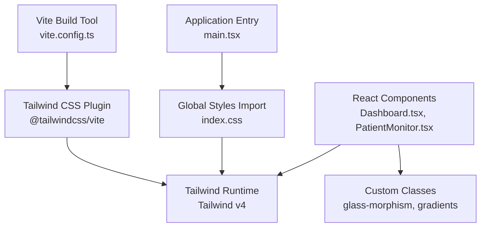
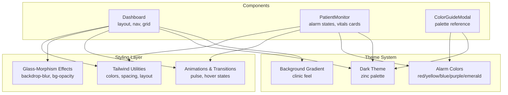
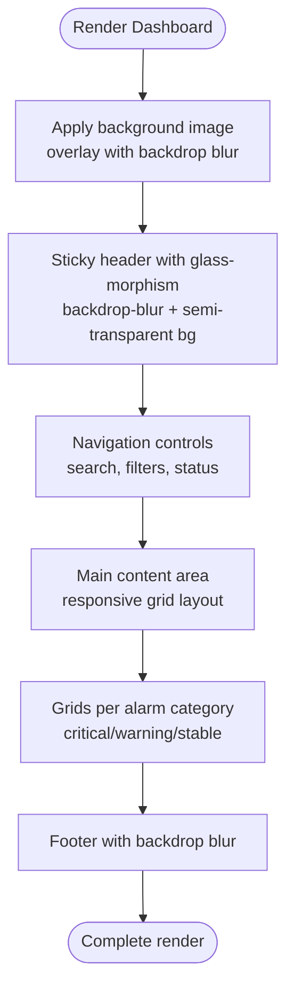
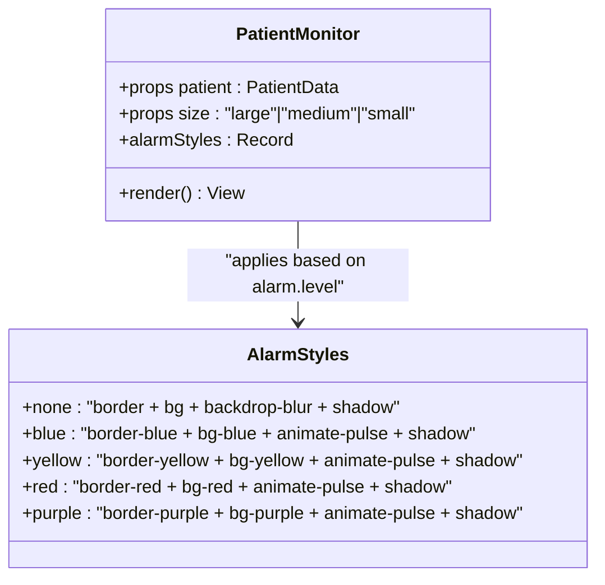
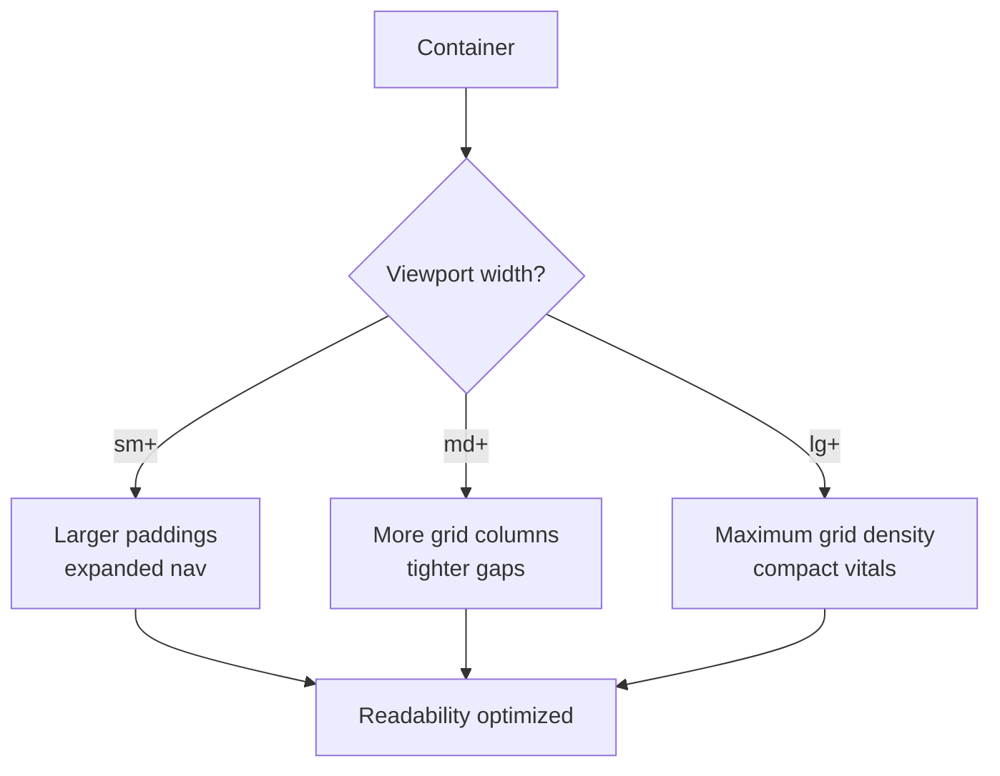
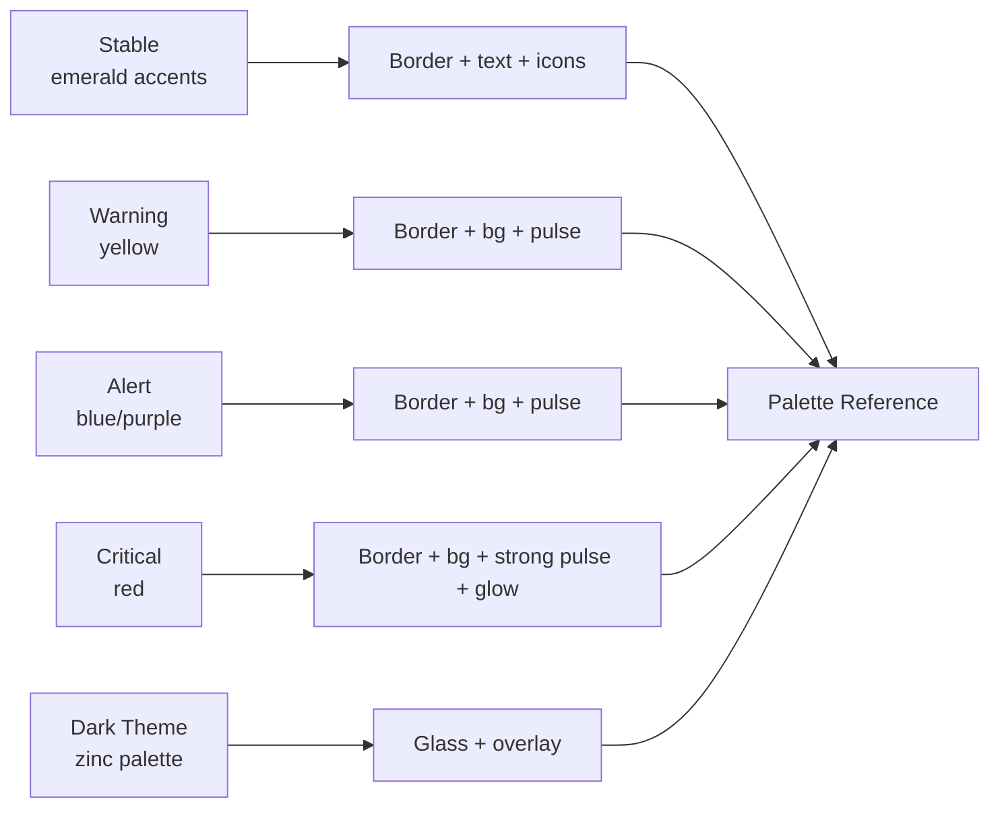
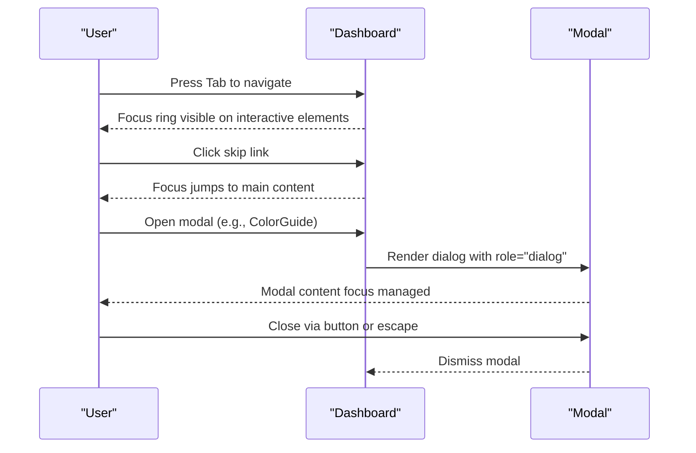
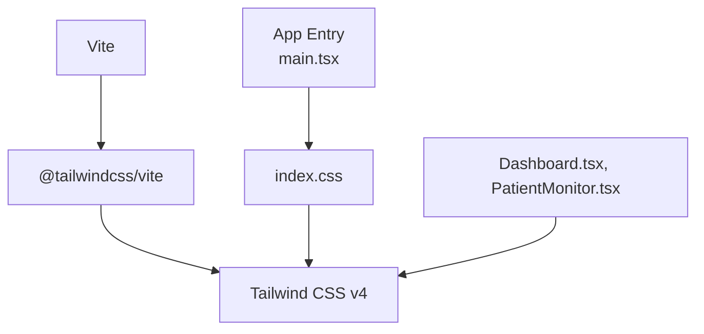

# Styling and Theming System

<cite>
**Referenced Files in This Document**
- [index.css](file://frontend/src/index.css)
- [package.json](file://frontend/package.json)
- [vite.config.ts](file://frontend/vite.config.ts)
- [App.tsx](file://frontend/src/App.tsx)
- [Dashboard.tsx](file://frontend/src/components/Dashboard.tsx)
- [PatientMonitor.tsx](file://frontend/src/components/PatientMonitor.tsx)
- [ColorGuideModal.tsx](file://frontend/src/components/ColorGuideModal.tsx)
</cite>

## Table of Contents
1. [Introduction](#introduction)
2. [Project Structure](#project-structure)
3. [Core Components](#core-components)
4. [Architecture Overview](#architecture-overview)
5. [Detailed Component Analysis](#detailed-component-analysis)
6. [Dependency Analysis](#dependency-analysis)
7. [Performance Considerations](#performance-considerations)
8. [Troubleshooting Guide](#troubleshooting-guide)
9. [Conclusion](#conclusion)

## Introduction
This document explains the dashboard’s styling and theming architecture built with Tailwind CSS and custom CSS. It covers the color palette system (primary emerald theme, alarm-specific colors, and background gradients), responsive design patterns, dark theme implementation with glass-morphism effects, and accessibility considerations tailored for healthcare environments. Practical guidance is included for customizing the color scheme, creating themed components, implementing animations/transitions, and ensuring consistency across screen sizes.

## Project Structure
The styling pipeline is powered by Vite and Tailwind CSS v4. Tailwind is integrated via the official Vite plugin, and global styles are imported in the application entry point. The dashboard components apply Tailwind utilities alongside custom CSS classes to achieve a cohesive, accessible, and visually consistent clinical interface.

**Diagram sources**
- [vite.config.ts:1-35](file://frontend/vite.config.ts#L1-L35)
- [index.css:1-2](file://frontend/src/index.css#L1-L2)
- [Dashboard.tsx:108-130](file://frontend/src/components/Dashboard.tsx#L108-L130)
- [PatientMonitor.tsx:73-79](file://frontend/src/components/PatientMonitor.tsx#L73-L79)

**Section sources**
- [vite.config.ts:1-35](file://frontend/vite.config.ts#L1-L35)
- [index.css:1-2](file://frontend/src/index.css#L1-L2)

## Core Components
- Tailwind CSS v4 integration via Vite plugin for atomic utility classes.
- Global base styles imported at the app root.
- Dark theme with glass-morphism using backdrop blur and semi-transparent backgrounds.
- Alarm-specific color system: red for critical, yellow for warnings, blue/purple for alerts, and emerald for stable.
- Responsive grid and flex utilities for adaptive layouts across breakpoints.
- Accessibility-first patterns: focus management, semantic roles, and high-contrast support.

**Section sources**
- [package.json:25-32](file://frontend/package.json#L25-L32)
- [index.css:1-2](file://frontend/src/index.css#L1-L2)
- [Dashboard.tsx:108-130](file://frontend/src/components/Dashboard.tsx#L108-L130)
- [PatientMonitor.tsx:73-79](file://frontend/src/components/PatientMonitor.tsx#L73-L79)

## Architecture Overview
The styling architecture combines:
- Atomic utility classes from Tailwind for layout, spacing, typography, and color.
- Glass-morphism overlays for dark theme depth and readability.
- Alarm-driven color and animation classes applied conditionally based on patient state.
- Responsive breakpoints to adapt card grids and navigation elements.

**Diagram sources**
- [Dashboard.tsx:108-130](file://frontend/src/components/Dashboard.tsx#L108-L130)
- [Dashboard.tsx:308-387](file://frontend/src/components/Dashboard.tsx#L308-L387)
- [PatientMonitor.tsx:73-79](file://frontend/src/components/PatientMonitor.tsx#L73-L79)
- [ColorGuideModal.tsx:57-99](file://frontend/src/components/ColorGuideModal.tsx#L57-L99)

## Detailed Component Analysis

### Dashboard Layout and Dark Theme
The dashboard establishes the base layout and dark theme foundation:
- Fixed full-viewport background image with a dark overlay and backdrop blur for a clinical atmosphere.
- Sticky header with glass-morphism using backdrop blur and semi-transparent backgrounds.
- Responsive navigation with search, filters, and status indicators.
- Main content grid with responsive Tailwind grid classes for critical, warning, and stable patients.
- Footer with backdrop blur and consistent spacing.

**Diagram sources**
- [Dashboard.tsx:116-130](file://frontend/src/components/Dashboard.tsx#L116-L130)
- [Dashboard.tsx:134-306](file://frontend/src/components/Dashboard.tsx#L134-L306)
- [Dashboard.tsx:308-387](file://frontend/src/components/Dashboard.tsx#L308-L387)
- [Dashboard.tsx:389-410](file://frontend/src/components/Dashboard.tsx#L389-L410)

**Section sources**
- [Dashboard.tsx:108-130](file://frontend/src/components/Dashboard.tsx#L108-L130)
- [Dashboard.tsx:134-306](file://frontend/src/components/Dashboard.tsx#L134-L306)
- [Dashboard.tsx:308-387](file://frontend/src/components/Dashboard.tsx#L308-L387)
- [Dashboard.tsx:389-410](file://frontend/src/components/Dashboard.tsx#L389-L410)

### Patient Monitor Card Theming and Animations
Each patient monitor card applies:
- Conditional border, background, and shadow classes based on alarm level.
- Hover and pulse animations for alert states.
- Size-specific padding, spacing, and typography scaling.
- Color-coded vitals labels and badges for quick recognition.

**Diagram sources**
- [PatientMonitor.tsx:73-79](file://frontend/src/components/PatientMonitor.tsx#L73-L79)
- [PatientMonitor.tsx:108-112](file://frontend/src/components/PatientMonitor.tsx#L108-L112)

**Section sources**
- [PatientMonitor.tsx:73-79](file://frontend/src/components/PatientMonitor.tsx#L73-L79)
- [PatientMonitor.tsx:108-112](file://frontend/src/components/PatientMonitor.tsx#L108-L112)

### Responsive Design Patterns
Responsive behavior is achieved through:
- Flex utilities for navigation wrapping and alignment across breakpoints.
- Grid classes that scale number of columns per screen size (e.g., critical/warning/stable sections).
- Typography scaling and spacing adjustments using responsive modifiers.
- Breakpoint-specific container widths and padding for optimal readability.

**Diagram sources**
- [Dashboard.tsx:348-352](file://frontend/src/components/Dashboard.tsx#L348-L352)
- [Dashboard.tsx:363-367](file://frontend/src/components/Dashboard.tsx#L363-L367)
- [Dashboard.tsx:378-382](file://frontend/src/components/Dashboard.tsx#L378-L382)

**Section sources**
- [Dashboard.tsx:348-352](file://frontend/src/components/Dashboard.tsx#L348-L352)
- [Dashboard.tsx:363-367](file://frontend/src/components/Dashboard.tsx#L363-L367)
- [Dashboard.tsx:378-382](file://frontend/src/components/Dashboard.tsx#L378-L382)

### Color Palette and Alarm System
The color system aligns with clinical urgency:
- Primary: emerald accents for stable and positive actions.
- Critical: red borders, backgrounds, and badges.
- Warnings: yellow/pale backgrounds with subtle pulses.
- Alerts: blue/purple variants for special conditions.
- Background: dark zinc palette with translucent overlays for depth.

**Diagram sources**
- [PatientMonitor.tsx:73-79](file://frontend/src/components/PatientMonitor.tsx#L73-L79)
- [Dashboard.tsx:192-196](file://frontend/src/components/Dashboard.tsx#L192-L196)
- [Dashboard.tsx:200-204](file://frontend/src/components/Dashboard.tsx#L200-L204)
- [Dashboard.tsx:208-212](file://frontend/src/components/Dashboard.tsx#L208-L212)
- [Dashboard.tsx:344-347](file://frontend/src/components/Dashboard.tsx#L344-L347)
- [Dashboard.tsx:359-362](file://frontend/src/components/Dashboard.tsx#L359-L362)
- [Dashboard.tsx:374-377](file://frontend/src/components/Dashboard.tsx#L374-L377)

**Section sources**
- [PatientMonitor.tsx:73-79](file://frontend/src/components/PatientMonitor.tsx#L73-L79)
- [Dashboard.tsx:192-196](file://frontend/src/components/Dashboard.tsx#L192-L196)
- [Dashboard.tsx:200-204](file://frontend/src/components/Dashboard.tsx#L200-L204)
- [Dashboard.tsx:208-212](file://frontend/src/components/Dashboard.tsx#L208-L212)
- [Dashboard.tsx:344-347](file://frontend/src/components/Dashboard.tsx#L344-L347)
- [Dashboard.tsx:359-362](file://frontend/src/components/Dashboard.tsx#L359-L362)
- [Dashboard.tsx:374-377](file://frontend/src/components/Dashboard.tsx#L374-L377)

### Accessibility Considerations
Accessibility features implemented:
- Focus management: skip link to main content with prominent focus styles.
- Sufficient contrast: zinc palette with appropriate text and background opacities.
- High-contrast mode support: rely on semantic colors and avoid relying solely on color.
- Keyboard navigation: interactive elements are focusable and operable via Enter/Space.
- ARIA attributes: live regions for connectivity status, labels for icons, and modal roles.

**Diagram sources**
- [Dashboard.tsx:109-115](file://frontend/src/components/Dashboard.tsx#L109-L115)
- [ColorGuideModal.tsx:27-31](file://frontend/src/components/ColorGuideModal.tsx#L27-L31)

**Section sources**
- [Dashboard.tsx:109-115](file://frontend/src/components/Dashboard.tsx#L109-L115)
- [Dashboard.tsx:150-156](file://frontend/src/components/Dashboard.tsx#L150-L156)
- [ColorGuideModal.tsx:27-31](file://frontend/src/components/ColorGuideModal.tsx#L27-L31)

## Dependency Analysis
The styling stack depends on Tailwind CSS v4 and the Vite plugin for seamless compilation and development.

**Diagram sources**
- [package.json:25-32](file://frontend/package.json#L25-L32)
- [vite.config.ts:1-10](file://frontend/vite.config.ts#L1-L10)
- [index.css:1-2](file://frontend/src/index.css#L1-L2)

**Section sources**
- [package.json:25-32](file://frontend/package.json#L25-L32)
- [vite.config.ts:1-10](file://frontend/vite.config.ts#L1-L10)
- [index.css:1-2](file://frontend/src/index.css#L1-L2)

## Performance Considerations
- Prefer Tailwind utilities over ad-hoc CSS to reduce CSS bundle size and improve maintainability.
- Use backdrop blur judiciously; it can be expensive on lower-end devices.
- Keep animation classes scoped to interactive states to minimize layout thrashing.
- Consolidate repeated color classes into reusable constants or computed styles to avoid duplication.

## Troubleshooting Guide
Common styling issues and resolutions:
- Utilities not applying: ensure Tailwind plugin is loaded in Vite and global styles are imported at the app root.
- Glass effect looks too dark: adjust background opacity and backdrop blur intensity in header/footer containers.
- Low contrast in alerts: verify sufficient color luminance and avoid reliance on color alone for conveying severity.
- Modal focus issues: confirm dialog role and focus trap behavior; ensure focus returns after closing.

**Section sources**
- [vite.config.ts:1-10](file://frontend/vite.config.ts#L1-L10)
- [index.css:1-2](file://frontend/src/index.css#L1-L2)
- [Dashboard.tsx:134-306](file://frontend/src/components/Dashboard.tsx#L134-L306)
- [ColorGuideModal.tsx:27-31](file://frontend/src/components/ColorGuideModal.tsx#L27-L31)

## Conclusion
The dashboard employs a robust, scalable styling architecture centered on Tailwind CSS and a dark, glass-morphism theme. The alarm-driven color system, responsive grid layouts, and accessibility-first patterns deliver a clear, efficient interface suited to clinical environments. By leveraging the provided patterns and guidelines, teams can consistently extend the design system while maintaining usability and performance.