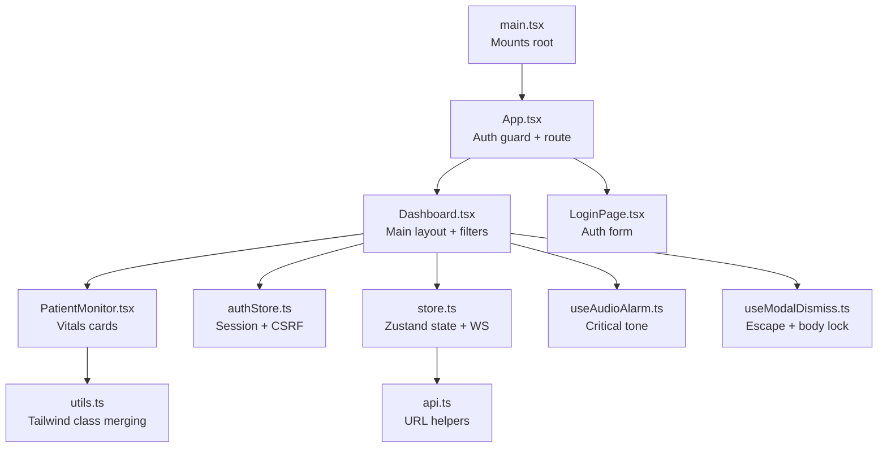
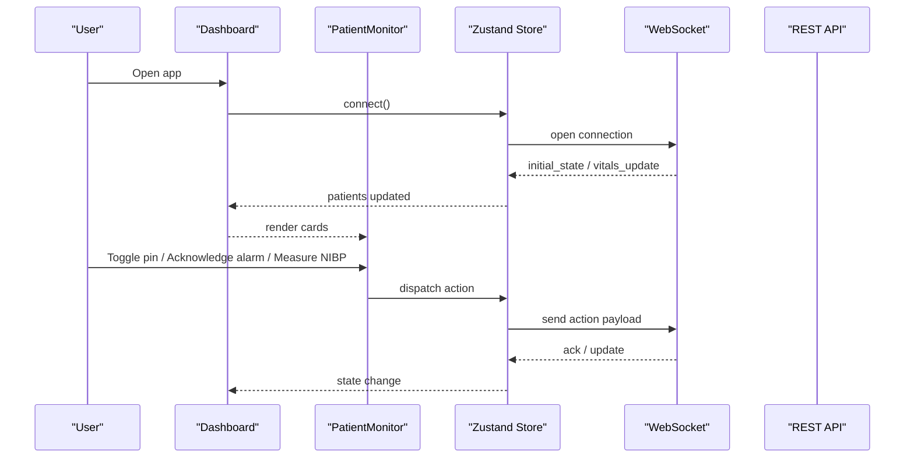
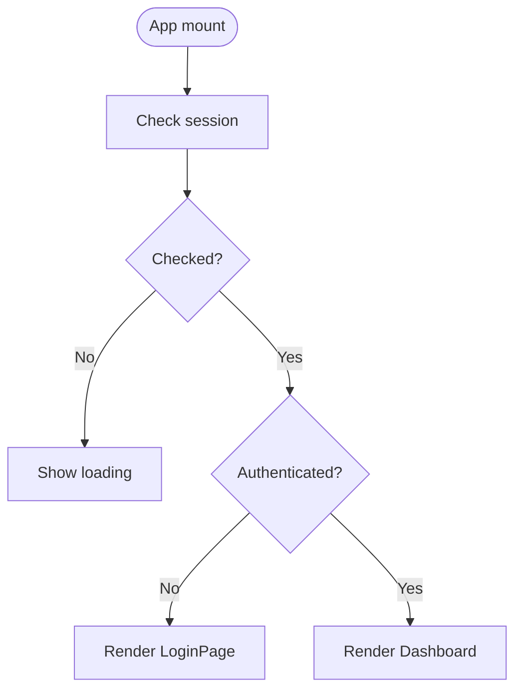
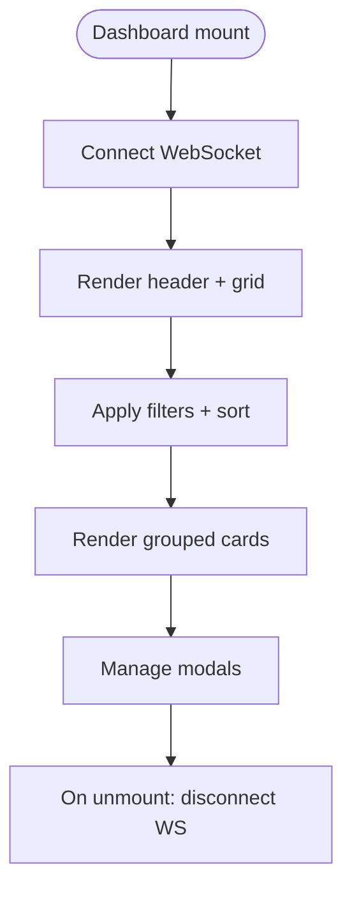
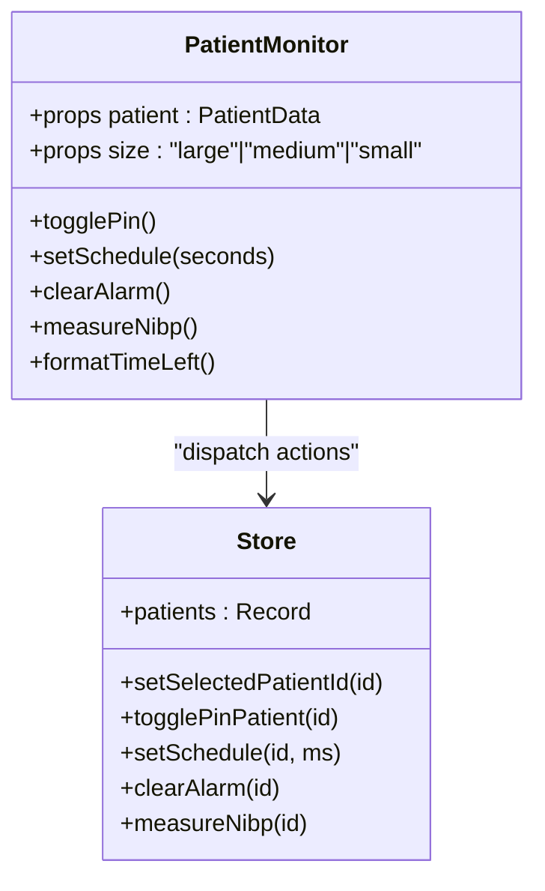
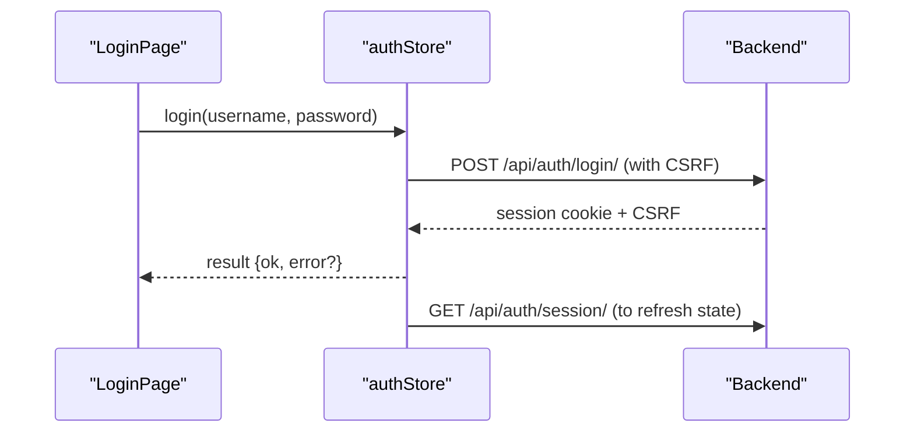
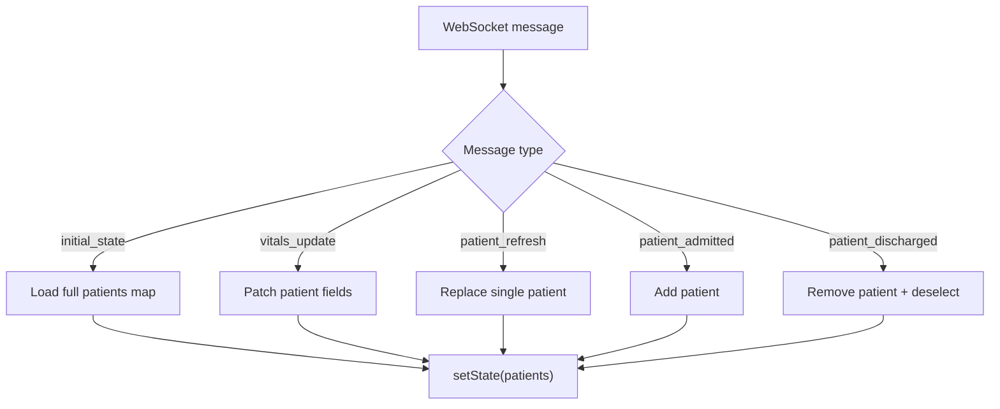
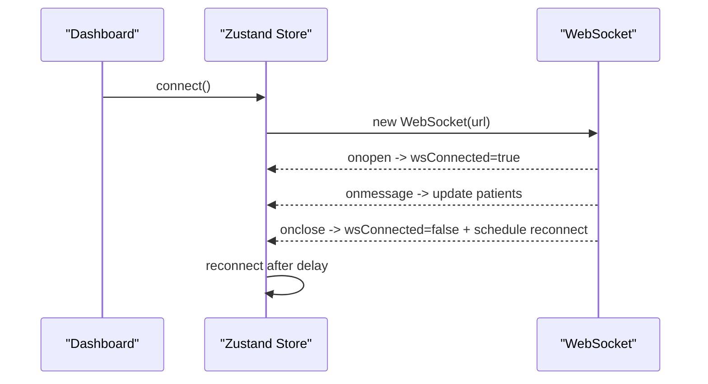
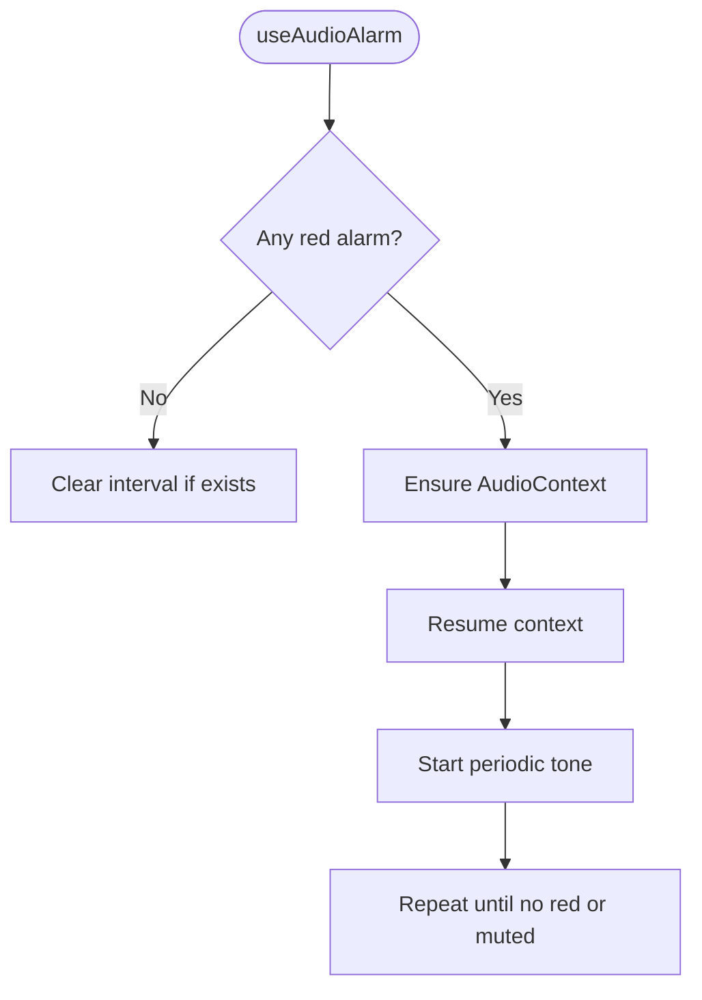
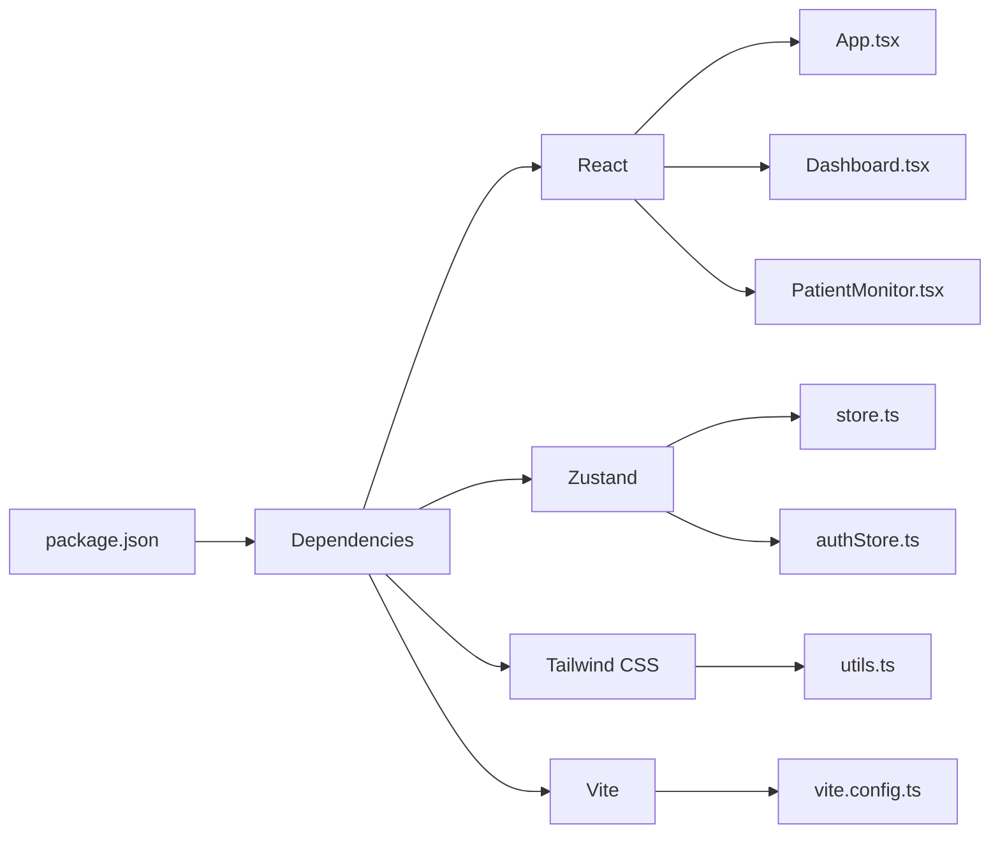

# Frontend Development

<cite>
**Referenced Files in This Document**
- [App.tsx](file://frontend/src/App.tsx)
- [main.tsx](file://frontend/src/main.tsx)
- [Dashboard.tsx](file://frontend/src/components/Dashboard.tsx)
- [PatientMonitor.tsx](file://frontend/src/components/PatientMonitor.tsx)
- [LoginPage.tsx](file://frontend/src/components/LoginPage.tsx)
- [store.ts](file://frontend/src/store.ts)
- [authStore.ts](file://frontend/src/authStore.ts)
- [api.ts](file://frontend/src/lib/api.ts)
- [utils.ts](file://frontend/src/lib/utils.ts)
- [useAudioAlarm.ts](file://frontend/src/hooks/useAudioAlarm.ts)
- [useModalDismiss.ts](file://frontend/src/hooks/useModalDismiss.ts)
- [index.css](file://frontend/src/index.css)
- [package.json](file://frontend/package.json)
- [vite.config.ts](file://frontend/vite.config.ts)
</cite>

## Table of Contents
1. [Introduction](#introduction)
2. [Project Structure](#project-structure)
3. [Core Components](#core-components)
4. [Architecture Overview](#architecture-overview)
5. [Detailed Component Analysis](#detailed-component-analysis)
6. [Dependency Analysis](#dependency-analysis)
7. [Performance Considerations](#performance-considerations)
8. [Troubleshooting Guide](#troubleshooting-guide)
9. [Conclusion](#conclusion)
10. [Appendices](#appendices)

## Introduction
This document explains the frontend architecture of the Medicentral dashboard built with React and Vite. It covers the component hierarchy starting from the root App and the main Dashboard, the state management system using Zustand, WebSocket integration for real-time updates, and the API integration layer. It also documents the styling approach with Tailwind CSS, reusable component composition patterns, real-time visualization components for patient vitals, and practical guidance for customization, performance optimization, responsive design, and accessibility.

## Project Structure
The frontend is organized around a small set of core files:
- Root entry renders the app and mounts the root element.
- App orchestrates authentication checks and routes to either the login page or the dashboard.
- Dashboard is the central UI that manages filters, real-time data, and modals.
- PatientMonitor is the primary card component for displaying patient vitals and controls.
- Authentication and global state are managed via separate Zustand stores.
- Utilities provide shared helpers for class merging and API/WebSocket URLs.
- Hooks encapsulate cross-cutting concerns like audio alarms and modal dismissal.
- Vite config sets up React, Tailwind, and development proxies to the backend.

**Diagram sources**
- [main.tsx:1-16](file://frontend/src/main.tsx#L1-L16)
- [App.tsx:11-33](file://frontend/src/App.tsx#L11-L33)
- [Dashboard.tsx:32-429](file://frontend/src/components/Dashboard.tsx#L32-L429)
- [PatientMonitor.tsx:13-372](file://frontend/src/components/PatientMonitor.tsx#L13-L372)
- [LoginPage.tsx:4-84](file://frontend/src/components/LoginPage.tsx#L4-L84)
- [authStore.ts:16-79](file://frontend/src/authStore.ts#L16-L79)
- [store.ts:173-352](file://frontend/src/store.ts#L173-L352)
- [api.ts:15-34](file://frontend/src/lib/api.ts#L15-L34)
- [utils.ts:4-7](file://frontend/src/lib/utils.ts#L4-L7)
- [useAudioAlarm.ts:12-92](file://frontend/src/hooks/useAudioAlarm.ts#L12-L92)
- [useModalDismiss.ts:23-46](file://frontend/src/hooks/useModalDismiss.ts#L23-L46)

**Section sources**
- [main.tsx:1-16](file://frontend/src/main.tsx#L1-L16)
- [App.tsx:11-33](file://frontend/src/App.tsx#L11-L33)
- [Dashboard.tsx:32-429](file://frontend/src/components/Dashboard.tsx#L32-L429)
- [PatientMonitor.tsx:13-372](file://frontend/src/components/PatientMonitor.tsx#L13-L372)
- [LoginPage.tsx:4-84](file://frontend/src/components/LoginPage.tsx#L4-L84)
- [authStore.ts:16-79](file://frontend/src/authStore.ts#L16-L79)
- [store.ts:173-352](file://frontend/src/store.ts#L173-L352)
- [api.ts:15-34](file://frontend/src/lib/api.ts#L15-L34)
- [utils.ts:4-7](file://frontend/src/lib/utils.ts#L4-L7)
- [useAudioAlarm.ts:12-92](file://frontend/src/hooks/useAudioAlarm.ts#L12-L92)
- [useModalDismiss.ts:23-46](file://frontend/src/hooks/useModalDismiss.ts#L23-L46)

## Core Components
- App: Performs session check on mount and renders either LoginPage or Dashboard based on authentication state.
- Dashboard: Hosts the main grid of PatientMonitor cards, handles filters, connectivity status, and modals. It initializes audio alarms and connects/disconnects the WebSocket on mount/unmount.
- PatientMonitor: Displays a single patient’s vitals and controls, reacts to alarm levels, supports scheduling, pinning, and quick actions.
- LoginPage: Provides a simple login form with CSRF-aware requests.
- authStore: Manages session state, CSRF token, login/logout, and exposes a helper for authenticated fetches.
- store: Global state for patients, WebSocket lifecycle, UI toggles, and actions sent to the backend via WebSocket.
- API utilities: Provide normalized API and WebSocket URLs, including environment-driven origin handling.
- Hooks: Audio alarm playback and modal dismissal behavior.

**Section sources**
- [App.tsx:11-33](file://frontend/src/App.tsx#L11-L33)
- [Dashboard.tsx:32-429](file://frontend/src/components/Dashboard.tsx#L32-L429)
- [PatientMonitor.tsx:13-372](file://frontend/src/components/PatientMonitor.tsx#L13-L372)
- [LoginPage.tsx:4-84](file://frontend/src/components/LoginPage.tsx#L4-L84)
- [authStore.ts:16-79](file://frontend/src/authStore.ts#L16-L79)
- [store.ts:173-352](file://frontend/src/store.ts#L173-L352)
- [api.ts:15-34](file://frontend/src/lib/api.ts#L15-L34)
- [useAudioAlarm.ts:12-92](file://frontend/src/hooks/useAudioAlarm.ts#L12-L92)
- [useModalDismiss.ts:23-46](file://frontend/src/hooks/useModalDismiss.ts#L23-L46)

## Architecture Overview
The frontend follows a unidirectional data flow:
- UI components subscribe to Zustand stores for state and dispatch actions.
- WebSocket receives real-time updates and updates the store immutably.
- REST endpoints are accessed via a CSRF-aware fetch wrapper.
- Tailwind CSS provides responsive styling with a consistent design system.

**Diagram sources**
- [Dashboard.tsx:49-54](file://frontend/src/components/Dashboard.tsx#L49-L54)
- [store.ts:219-352](file://frontend/src/store.ts#L219-L352)
- [PatientMonitor.tsx:16-21](file://frontend/src/components/PatientMonitor.tsx#L16-L21)

## Detailed Component Analysis

### App and Routing
- On mount, App triggers a session check and conditionally renders LoginPage or Dashboard.
- No explicit router is used; routing is implicit via state.

**Diagram sources**
- [App.tsx:16-33](file://frontend/src/App.tsx#L16-L33)

**Section sources**
- [App.tsx:11-33](file://frontend/src/App.tsx#L11-L33)

### Dashboard: Layout, Filters, and Modals
- Initializes audio alarms and manages WebSocket lifecycle.
- Implements severity filters (all, critical, warning, pinned), department filters, and search.
- Renders three groups of PatientMonitor cards: critical, warning, and stable.
- Controls modals for admission, settings, AI prediction, and color guide.

**Diagram sources**
- [Dashboard.tsx:49-54](file://frontend/src/components/Dashboard.tsx#L49-L54)
- [Dashboard.tsx:76-98](file://frontend/src/components/Dashboard.tsx#L76-L98)
- [Dashboard.tsx:340-386](file://frontend/src/components/Dashboard.tsx#L340-L386)

**Section sources**
- [Dashboard.tsx:32-429](file://frontend/src/components/Dashboard.tsx#L32-L429)

### PatientMonitor: Vitals Card and Actions
- Displays HR, SpO2, NIBP, and optionally RR and temperature for large cards.
- Shows alarm badge, NEWS2 score, battery, scheduled check countdown, and pin button.
- Supports quick actions: schedule intervals, clear purple alarms, measure NIBP, toggle pin, and open details.

**Diagram sources**
- [PatientMonitor.tsx:13-372](file://frontend/src/components/PatientMonitor.tsx#L13-L372)
- [store.ts:173-352](file://frontend/src/store.ts#L173-L352)

**Section sources**
- [PatientMonitor.tsx:13-372](file://frontend/src/components/PatientMonitor.tsx#L13-L372)

### Authentication and REST Layer
- Session check and login/logout use CSRF tokens and cookies.
- A helper wraps fetch with CSRF for non-GET requests.
- Backend endpoints are proxied during development.

**Diagram sources**
- [LoginPage.tsx:11-20](file://frontend/src/components/LoginPage.tsx#L11-L20)
- [authStore.ts:23-78](file://frontend/src/authStore.ts#L23-L78)

**Section sources**
- [LoginPage.tsx:4-84](file://frontend/src/components/LoginPage.tsx#L4-L84)
- [authStore.ts:16-79](file://frontend/src/authStore.ts#L16-L79)

### Real-Time State Management with Zustand
- Global state includes patients, WebSocket connection, UI flags, and selected patient.
- Actions are dispatched from UI and forwarded to the backend via WebSocket.
- WebSocket handlers update the store with initial state, incremental updates, and admission/discharge events.

**Diagram sources**
- [store.ts:237-317](file://frontend/src/store.ts#L237-L317)
- [store.ts:255-313](file://frontend/src/store.ts#L255-L313)

**Section sources**
- [store.ts:173-352](file://frontend/src/store.ts#L173-L352)

### WebSocket Integration and Reconnection
- Establishes a WebSocket connection to the monitoring endpoint.
- Automatically reconnects after disconnection with exponential backoff logic.
- Sends actions on user interactions and parses incoming updates.

**Diagram sources**
- [store.ts:219-352](file://frontend/src/store.ts#L219-L352)
- [api.ts:22-34](file://frontend/src/lib/api.ts#L22-L34)

**Section sources**
- [store.ts:219-352](file://frontend/src/store.ts#L219-L352)
- [api.ts:22-34](file://frontend/src/lib/api.ts#L22-L34)

### Real-Time Audio Alarms
- Plays a repeating tone when critical alarms exist and audio is not muted.
- Resumes the Web AudioContext after a user gesture to satisfy browser autoplay policies.

**Diagram sources**
- [useAudioAlarm.ts:12-92](file://frontend/src/hooks/useAudioAlarm.ts#L12-L92)

**Section sources**
- [useAudioAlarm.ts:12-92](file://frontend/src/hooks/useAudioAlarm.ts#L12-L92)

### Modal Dismissal Hook
- Locks body scroll and closes modals on Escape, supporting stacked modals safely.

**Section sources**
- [useModalDismiss.ts:23-46](file://frontend/src/hooks/useModalDismiss.ts#L23-L46)

### Styling Architecture and Composition
- Tailwind CSS is configured via Vite and Tailwind plugin.
- A cn helper merges Tailwind classes deterministically.
- Responsive grids adapt card layouts per severity and viewport.

**Section sources**
- [index.css:1-2](file://frontend/src/index.css#L1-L2)
- [utils.ts:4-7](file://frontend/src/lib/utils.ts#L4-L7)
- [Dashboard.tsx:340-386](file://frontend/src/components/Dashboard.tsx#L340-L386)

## Dependency Analysis
- React and React DOM provide the UI runtime.
- Zustand manages global state with minimal boilerplate.
- Tailwind CSS and Tailwind Merge enable rapid, conflict-free styling.
- date-fns and lucide-react support internationalization and icons.
- Vite provides fast HMR and proxying to backend endpoints.

**Diagram sources**
- [package.json:13-33](file://frontend/package.json#L13-L33)
- [vite.config.ts:1-35](file://frontend/vite.config.ts#L1-L35)
- [utils.ts:4-7](file://frontend/src/lib/utils.ts#L4-L7)
- [store.ts:173-352](file://frontend/src/store.ts#L173-L352)
- [authStore.ts:16-79](file://frontend/src/authStore.ts#L16-L79)

**Section sources**
- [package.json:13-33](file://frontend/package.json#L13-L33)
- [vite.config.ts:1-35](file://frontend/vite.config.ts#L1-L35)
- [utils.ts:4-7](file://frontend/src/lib/utils.ts#L4-L7)
- [store.ts:173-352](file://frontend/src/store.ts#L173-L352)
- [authStore.ts:16-79](file://frontend/src/authStore.ts#L16-L79)

## Performance Considerations
- Memoization: Dashboard and PatientMonitor use memoization to avoid unnecessary re-renders.
- Virtualization: For very large patient counts, consider virtualized lists to reduce DOM nodes.
- Debounced search: Apply debouncing to search input to limit frequent filtering.
- Lazy loading images: Background image is preloaded; consider lazy-loading for thumbnails.
- WebSocket batching: If backend allows, batch frequent actions to reduce traffic.
- CSS isolation: Keep styles scoped and avoid deep nesting to minimize cascade cost.

[No sources needed since this section provides general guidance]

## Troubleshooting Guide
- WebSocket not connecting:
  - Verify backend URL resolution via environment variable and protocol detection.
  - Check browser console for errors and confirm CORS/proxy settings.
- Authentication failures:
  - Ensure CSRF token is present and cookies are accepted.
  - Confirm session endpoint responds and sets session cookies.
- Audio not playing:
  - Browser autoplay policies require a user gesture; ensure a pointerdown or keydown event occurs.
- Modals not closing:
  - Ensure Escape handler is attached and body scroll lock is released on unmount.

**Section sources**
- [api.ts:22-34](file://frontend/src/lib/api.ts#L22-L34)
- [authStore.ts:23-78](file://frontend/src/authStore.ts#L23-L78)
- [useAudioAlarm.ts:20-35](file://frontend/src/hooks/useAudioAlarm.ts#L20-L35)
- [useModalDismiss.ts:27-44](file://frontend/src/hooks/useModalDismiss.ts#L27-L44)

## Conclusion
The Medicentral frontend is a reactive, real-time dashboard that integrates tightly with backend APIs and WebSockets. Zustand simplifies state management, while Tailwind enables rapid UI iteration. The architecture supports scalability through modular components, robust error handling, and thoughtful UX patterns for healthcare environments.

[No sources needed since this section summarizes without analyzing specific files]

## Appendices

### Practical Customization Examples
- Customizing the dashboard layout:
  - Adjust grid templates in the main content area to change card density per severity.
  - Modify the size prop passed to PatientMonitor to fine-tune responsiveness.
- Adding new monitoring widgets:
  - Extend the PatientData model and update WebSocket handlers to incorporate new fields.
  - Create a new widget component similar to PatientMonitor and render it within the grid.
- Implementing custom alert systems:
  - Add new alarm levels or messages in the AlarmState and update styling accordingly.
  - Wire new actions in the store and forward them to the backend via WebSocket.

[No sources needed since this section provides general guidance]