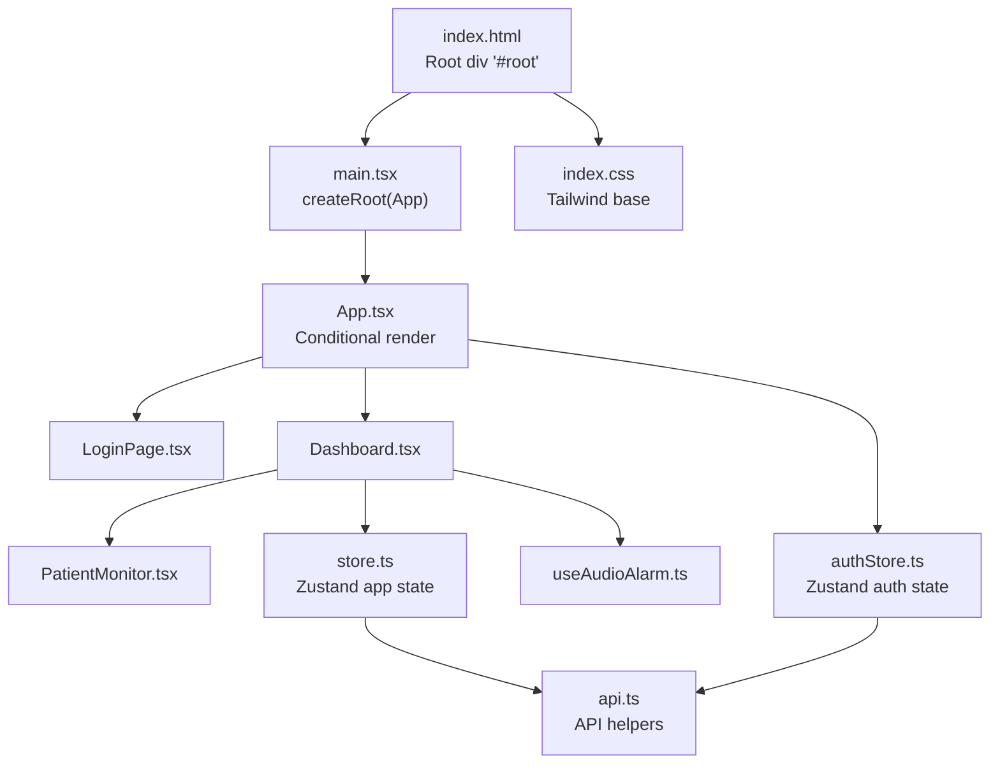
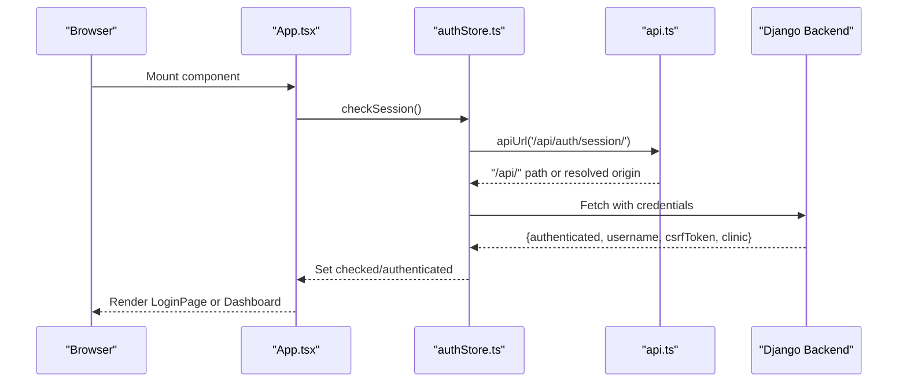
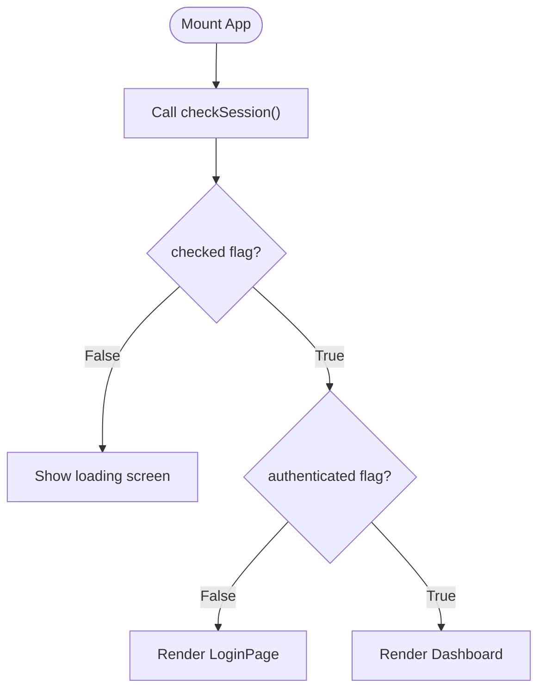
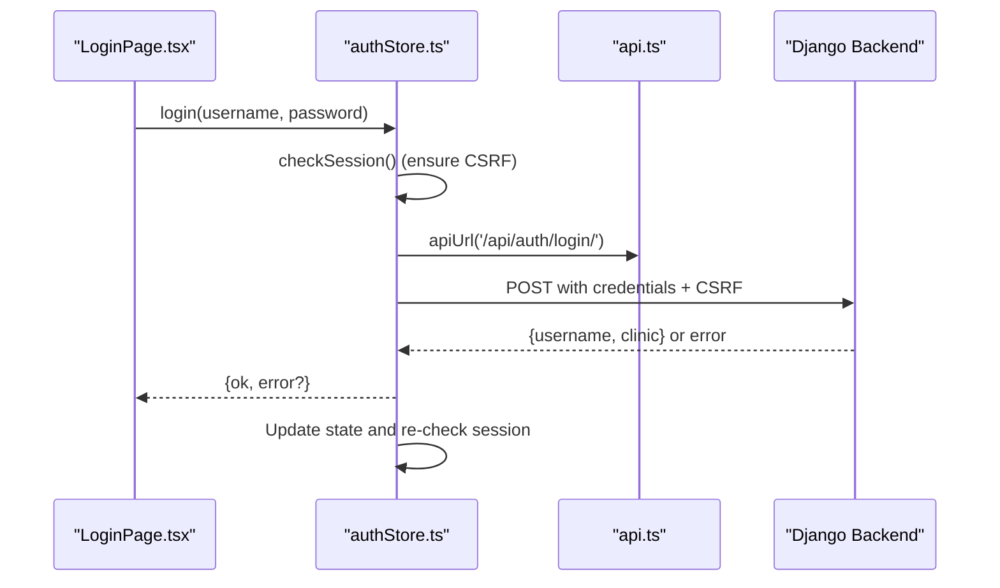
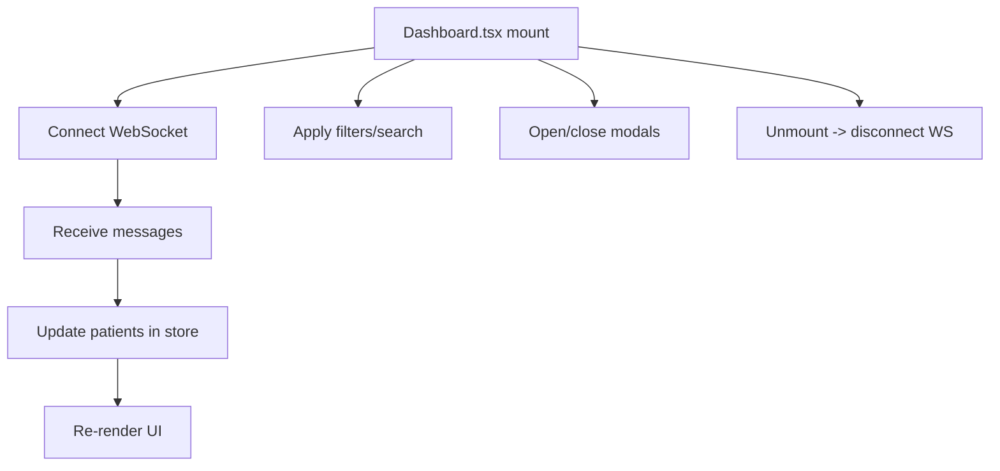
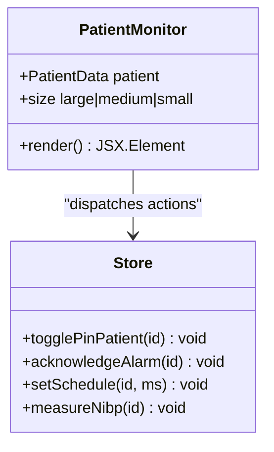
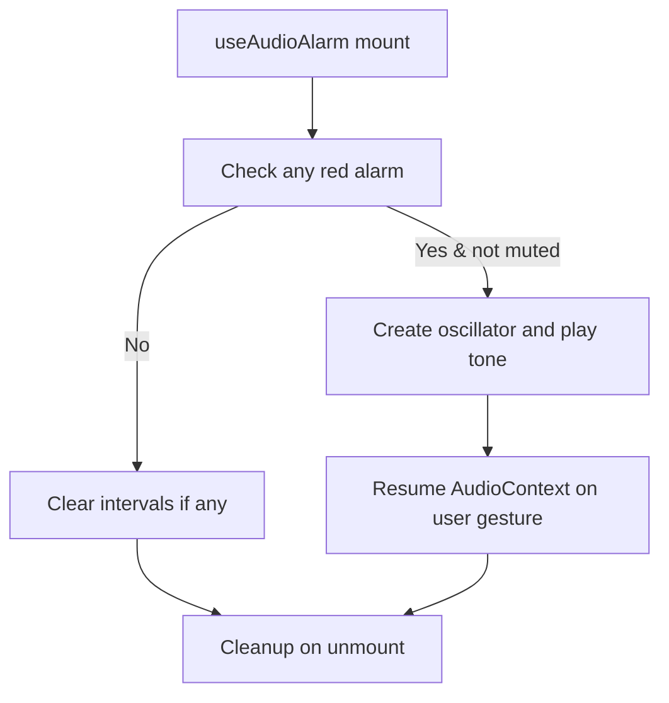
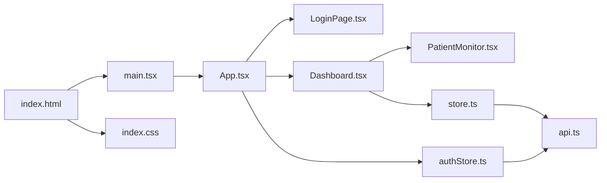

# React Application Structure

<cite>
**Referenced Files in This Document**
- [App.tsx](file://frontend/src/App.tsx)
- [main.tsx](file://frontend/src/main.tsx)
- [authStore.ts](file://frontend/src/authStore.ts)
- [api.ts](file://frontend/src/lib/api.ts)
- [Dashboard.tsx](file://frontend/src/components/Dashboard.tsx)
- [LoginPage.tsx](file://frontend/src/components/LoginPage.tsx)
- [PatientMonitor.tsx](file://frontend/src/components/PatientMonitor.tsx)
- [store.ts](file://frontend/src/store.ts)
- [useAudioAlarm.ts](file://frontend/src/hooks/useAudioAlarm.ts)
- [utils.ts](file://frontend/src/lib/utils.ts)
- [vite.config.ts](file://frontend/vite.config.ts)
- [package.json](file://frontend/package.json)
- [tsconfig.json](file://frontend/tsconfig.json)
- [index.html](file://frontend/index.html)
- [index.css](file://frontend/src/index.css)
</cite>

## Table of Contents
1. [Introduction](#introduction)
2. [Project Structure](#project-structure)
3. [Core Components](#core-components)
4. [Architecture Overview](#architecture-overview)
5. [Detailed Component Analysis](#detailed-component-analysis)
6. [Dependency Analysis](#dependency-analysis)
7. [Performance Considerations](#performance-considerations)
8. [Troubleshooting Guide](#troubleshooting-guide)
9. [Conclusion](#conclusion)
10. [Appendices](#appendices)

## Introduction
This document explains the React application structure powering the Medicentral dashboard. It covers the main App component lifecycle, authentication flow, conditional rendering between login and dashboard, routing alternatives, Vite configuration for development and build, TypeScript setup, environment variable handling, and integration with the Zustand state management system. Practical guidance is included for adding new routes, protecting components, and customizing the application shell.

## Project Structure
The frontend is organized around a small set of entry points and modularized components:
- Entry point renders the root App component inside a strict React mode container.
- App orchestrates authentication checks and renders either LoginPage or Dashboard.
- Dashboard composes multiple specialized components and manages real-time data via a WebSocket connection.
- Authentication and global state are managed with Zustand stores.
- Vite handles development server, proxying, and bundling; TypeScript configures compilation and module resolution.



**Diagram sources**
- [index.html:1-16](file://frontend/index.html#L1-L16)
- [main.tsx:1-16](file://frontend/src/main.tsx#L1-L16)
- [App.tsx:1-34](file://frontend/src/App.tsx#L1-L34)
- [LoginPage.tsx:1-84](file://frontend/src/components/LoginPage.tsx#L1-L84)
- [Dashboard.tsx:1-429](file://frontend/src/components/Dashboard.tsx#L1-L429)
- [PatientMonitor.tsx:1-372](file://frontend/src/components/PatientMonitor.tsx#L1-L372)
- [authStore.ts:1-107](file://frontend/src/authStore.ts#L1-L107)
- [store.ts:1-353](file://frontend/src/store.ts#L1-L353)
- [useAudioAlarm.ts:1-92](file://frontend/src/hooks/useAudioAlarm.ts#L1-L92)
- [api.ts:1-35](file://frontend/src/lib/api.ts#L1-L35)
- [index.css:1-2](file://frontend/src/index.css#L1-L2)

**Section sources**
- [index.html:1-16](file://frontend/index.html#L1-L16)
- [main.tsx:1-16](file://frontend/src/main.tsx#L1-L16)
- [App.tsx:1-34](file://frontend/src/App.tsx#L1-L34)

## Core Components
- App.tsx: Performs authentication readiness check on mount, conditionally renders LoginPage or Dashboard.
- LoginPage.tsx: Captures credentials, triggers login via auth store, and displays errors.
- Dashboard.tsx: Application shell with navigation, filters, modals, and real-time patient grids.
- authStore.ts: Manages session state, login/logout, CSRF handling, and exposes helper functions for authenticated requests.
- store.ts: Global state for patients, WebSocket connection, UI toggles, and actions to mutate state and send WebSocket commands.
- api.ts: Provides URL helpers for API and WebSocket endpoints with support for development proxy and production origin overrides.
- PatientMonitor.tsx: Card component displaying patient vitals, alarms, and interactive controls.
- useAudioAlarm.ts: Browser audio feedback for critical alarms with user gesture resumption.
- utils.ts: Tailwind class merging utility.

**Section sources**
- [App.tsx:1-34](file://frontend/src/App.tsx#L1-L34)
- [LoginPage.tsx:1-84](file://frontend/src/components/LoginPage.tsx#L1-L84)
- [Dashboard.tsx:1-429](file://frontend/src/components/Dashboard.tsx#L1-L429)
- [authStore.ts:1-107](file://frontend/src/authStore.ts#L1-L107)
- [store.ts:1-353](file://frontend/src/store.ts#L1-L353)
- [api.ts:1-35](file://frontend/src/lib/api.ts#L1-L35)
- [PatientMonitor.tsx:1-372](file://frontend/src/components/PatientMonitor.tsx#L1-L372)
- [useAudioAlarm.ts:1-92](file://frontend/src/hooks/useAudioAlarm.ts#L1-L92)
- [utils.ts:1-8](file://frontend/src/lib/utils.ts#L1-L8)

## Architecture Overview
The application follows a unidirectional data flow:
- App initializes authentication state by calling checkSession on mount.
- Auth store performs a session check and sets flags for conditional rendering.
- Dashboard connects to a WebSocket for live telemetry, updates global state, and drives UI.
- Components subscribe to Zustand slices to render and mutate state.



**Diagram sources**
- [App.tsx:16-18](file://frontend/src/App.tsx#L16-L18)
- [authStore.ts:23-38](file://frontend/src/authStore.ts#L23-L38)
- [api.ts:15-19](file://frontend/src/lib/api.ts#L15-L19)

## Detailed Component Analysis

### App Component and Conditional Rendering
- On mount, App triggers checkSession to determine if the user is authenticated.
- While awaiting session check, a loading indicator is shown.
- If authenticated, Dashboard is rendered; otherwise, LoginPage is shown.



**Diagram sources**
- [App.tsx:16-32](file://frontend/src/App.tsx#L16-L32)

**Section sources**
- [App.tsx:1-34](file://frontend/src/App.tsx#L1-L34)

### Authentication Flow and Session Management
- Session check: fetches session endpoint with credentials to hydrate auth state.
- Login: posts credentials to login endpoint with CSRF token and updates auth state.
- Logout: posts to logout endpoint with CSRF token and resets auth state.
- Helpers: apiHeaders and authedFetch centralize CSRF and credential handling.



**Diagram sources**
- [LoginPage.tsx:11-20](file://frontend/src/components/LoginPage.tsx#L11-L20)
- [authStore.ts:40-64](file://frontend/src/authStore.ts#L40-L64)
- [api.ts:15-19](file://frontend/src/lib/api.ts#L15-L19)

**Section sources**
- [authStore.ts:1-107](file://frontend/src/authStore.ts#L1-L107)
- [LoginPage.tsx:1-84](file://frontend/src/components/LoginPage.tsx#L1-L84)

### Dashboard Shell and Real-Time Data
- Initializes audio alarms hook.
- Connects to WebSocket on mount and disconnects on unmount.
- Exposes filters (severity, department, pinned), search, privacy mode, and audio mute.
- Renders grouped patient cards by alarm severity and supports modals.



**Diagram sources**
- [Dashboard.tsx:49-54](file://frontend/src/components/Dashboard.tsx#L49-L54)
- [store.ts:237-338](file://frontend/src/store.ts#L237-L338)

**Section sources**
- [Dashboard.tsx:1-429](file://frontend/src/components/Dashboard.tsx#L1-L429)
- [store.ts:1-353](file://frontend/src/store.ts#L1-L353)

### Zustand Stores: Authentication and App State
- authStore: Holds checked, authenticated, username, clinicName, csrfToken; exposes checkSession, login, logout.
- store: Holds patients, WebSocket connection, UI flags; exposes actions to mutate state and send WebSocket commands.

```mermaid
classDiagram
class AuthStore {
+boolean checked
+boolean authenticated
+string|null username
+string|null clinicName
+string csrfToken
+checkSession() Promise<void>
+login(username, password) Promise<{ok,error?}>
+logout() Promise<void>
}
class AppStore {
+Record~string,PatientData~ patients
+WebSocket|null socket
+boolean wsConnected
+boolean privacyMode
+string searchQuery
+string|null selectedPatientId
+boolean isAudioMuted
+togglePrivacyMode() void
+setSearchQuery(q) void
+setSelectedPatientId(id) void
+toggleAudioMute() void
+connect() void
+disconnect() void
+...actions for WebSocket ops...
}
AuthStore <.. LoginPage : "uses"
AppStore <.. Dashboard : "uses"
AppStore <.. PatientMonitor : "uses"
```

**Diagram sources**
- [authStore.ts:5-14](file://frontend/src/authStore.ts#L5-L14)
- [store.ts:143-168](file://frontend/src/store.ts#L143-L168)

**Section sources**
- [authStore.ts:1-107](file://frontend/src/authStore.ts#L1-L107)
- [store.ts:1-353](file://frontend/src/store.ts#L1-L353)

### Patient Monitor Component
- Displays vitals, alarm level, NEWS2 score, battery, scheduled checks.
- Supports pinning, alarm acknowledgment, and setting schedules via WebSocket actions.
- Applies Tailwind-based styling and responsive sizing.



**Diagram sources**
- [PatientMonitor.tsx:8-11](file://frontend/src/components/PatientMonitor.tsx#L8-L11)
- [store.ts:187-217](file://frontend/src/store.ts#L187-L217)

**Section sources**
- [PatientMonitor.tsx:1-372](file://frontend/src/components/PatientMonitor.tsx#L1-L372)
- [store.ts:1-353](file://frontend/src/store.ts#L1-L353)

### Audio Alarms Hook
- Detects critical alarms and plays a repeating tone using Web Audio API.
- Resumes audio context after user gestures to satisfy browser autoplay policies.



**Diagram sources**
- [useAudioAlarm.ts:12-91](file://frontend/src/hooks/useAudioAlarm.ts#L12-L91)

**Section sources**
- [useAudioAlarm.ts:1-92](file://frontend/src/hooks/useAudioAlarm.ts#L1-L92)

## Dependency Analysis
- Entry and rendering: index.html provides the root; main.tsx mounts App under StrictMode.
- Routing: No client-side router is present; conditional rendering determines which view to show.
- State management: authStore and store are independent Zustand stores; components subscribe to slices.
- Networking: API helpers compute absolute URLs; Vite proxy forwards /api and /ws to backend.
- Styling: Tailwind is imported via index.css; utils.cn merges classes safely.



**Diagram sources**
- [index.html:1-16](file://frontend/index.html#L1-L16)
- [main.tsx:1-16](file://frontend/src/main.tsx#L1-L16)
- [App.tsx:1-34](file://frontend/src/App.tsx#L1-L34)
- [LoginPage.tsx:1-84](file://frontend/src/components/LoginPage.tsx#L1-L84)
- [Dashboard.tsx:1-429](file://frontend/src/components/Dashboard.tsx#L1-L429)
- [PatientMonitor.tsx:1-372](file://frontend/src/components/PatientMonitor.tsx#L1-L372)
- [authStore.ts:1-107](file://frontend/src/authStore.ts#L1-L107)
- [store.ts:1-353](file://frontend/src/store.ts#L1-L353)
- [api.ts:1-35](file://frontend/src/lib/api.ts#L1-L35)
- [index.css:1-2](file://frontend/src/index.css#L1-L2)

**Section sources**
- [index.html:1-16](file://frontend/index.html#L1-L16)
- [main.tsx:1-16](file://frontend/src/main.tsx#L1-L16)
- [App.tsx:1-34](file://frontend/src/App.tsx#L1-L34)
- [authStore.ts:1-107](file://frontend/src/authStore.ts#L1-L107)
- [store.ts:1-353](file://frontend/src/store.ts#L1-L353)
- [api.ts:1-35](file://frontend/src/lib/api.ts#L1-L35)
- [index.css:1-2](file://frontend/src/index.css#L1-L2)

## Performance Considerations
- Memoization: Dashboard uses useMemo to avoid unnecessary recomputation of filtered lists and counts; PatientMonitor is wrapped with memo to prevent re-renders on unrelated state changes.
- Efficient updates: WebSocket messages batch updates to minimize re-renders; Zustand’s set replaces only changed patient entries.
- Lazy initialization: WebSocket connection is established on mount and closed on unmount; reconnect logic avoids busy loops.
- CSS: Tailwind is imported at the root; ensure purge configuration targets production builds to reduce bundle size.

[No sources needed since this section provides general guidance]

## Troubleshooting Guide
- Authentication not persisting:
  - Verify credentials are sent with fetch calls and CSRF tokens are included for non-safe methods.
  - Ensure session cookies are accepted by the backend and SameSite settings allow cross-origin requests when using proxy.
- Login fails with CSRF error:
  - Confirm checkSession runs before login to populate csrfToken.
  - Validate that authedFetch and apiHeaders are used consistently for authenticated requests.
- WebSocket not connecting:
  - Check Vite proxy settings for /ws forwarding and that backend serves WebSocket on /ws/monitoring/.
  - Confirm BACKEND_ORIGIN is unset during development to leverage proxy.
- Build-time environment variables:
  - GEMINI_API_KEY is exposed via Vite define; ensure it is set in the environment or supply a .env file.
- TypeScript diagnostics:
  - Run lint script to type-check without emitting; fix TS errors surfaced by the compiler.

**Section sources**
- [authStore.ts:40-78](file://frontend/src/authStore.ts#L40-L78)
- [api.ts:10-34](file://frontend/src/lib/api.ts#L10-L34)
- [vite.config.ts:10-34](file://frontend/vite.config.ts#L10-L34)
- [package.json:6-11](file://frontend/package.json#L6-L11)

## Conclusion
Medicentral’s frontend is a lean, state-driven React application powered by Zustand. Authentication readiness gates the UI, while a WebSocket-backed store keeps the dashboard synchronized with real-time patient data. Vite simplifies development with proxying and hot module replacement, and TypeScript ensures type safety. The architecture supports straightforward extension for new routes, protected views, and shell customization.

[No sources needed since this section summarizes without analyzing specific files]

## Appendices

### Vite Configuration Highlights
- Plugins: React Fast Refresh and Tailwind CSS integration.
- Environment: GEMINI_API_KEY exposed via define; path aliases configured.
- Proxy: /api and /ws forwarded to backend host; HMR controlled by DISABLE_HMR.
- Dev server: Port 5173 with configurable HMR.

**Section sources**
- [vite.config.ts:1-35](file://frontend/vite.config.ts#L1-L35)

### TypeScript Configuration Highlights
- Module resolution: bundler with module detection.
- JSX: react-jsx runtime.
- Paths: alias @ resolves to project root.
- No emit: tsc used for linting only.

**Section sources**
- [tsconfig.json:1-27](file://frontend/tsconfig.json#L1-L27)

### Adding New Routes (Alternative to Current Setup)
While the current app uses conditional rendering instead of a router, you can integrate a routing library:
- Install a router (e.g., react-router).
- Define routes for Login and Dashboard.
- Wrap protected routes with a guard that checks authStore.authenticated.
- Redirect unauthenticated users to Login.

[No sources needed since this section provides general guidance]

### Implementing Protected Components
- Guard component reads authStore.authenticated.
- If false, redirect to Login; otherwise, render children.
- Optionally, prefetch session on app boot to avoid flicker.

[No sources needed since this section provides general guidance]

### Customizing the Application Shell
- Modify Dashboard header/footer areas for branding and navigation.
- Extend modals for additional workflows (e.g., admit/discharge).
- Introduce theme toggles and layout variants via Zustand state.

[No sources needed since this section provides general guidance]