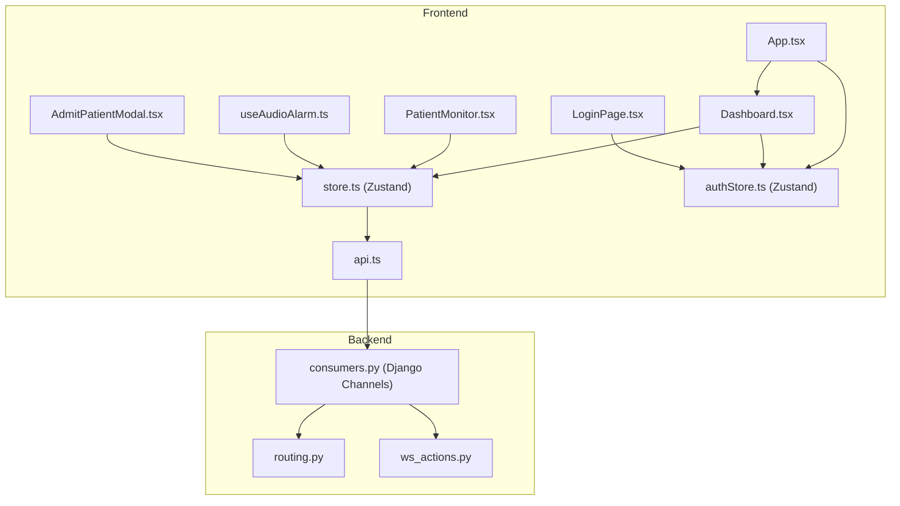
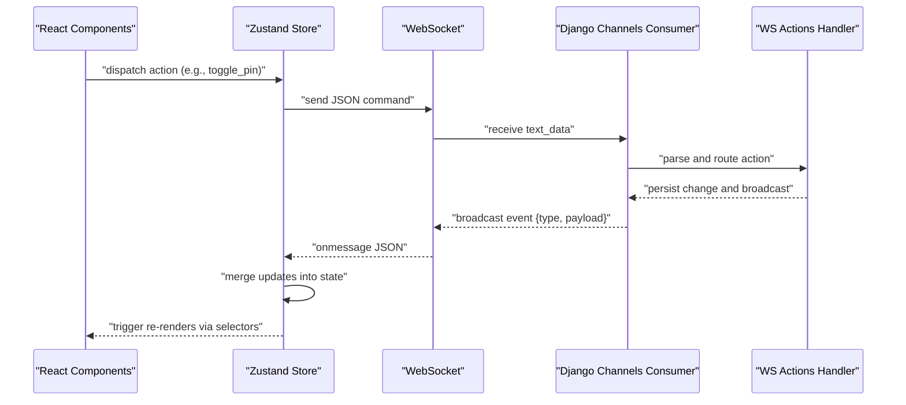
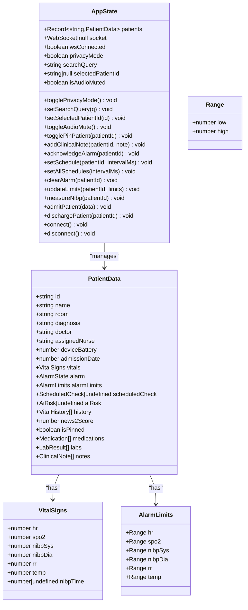
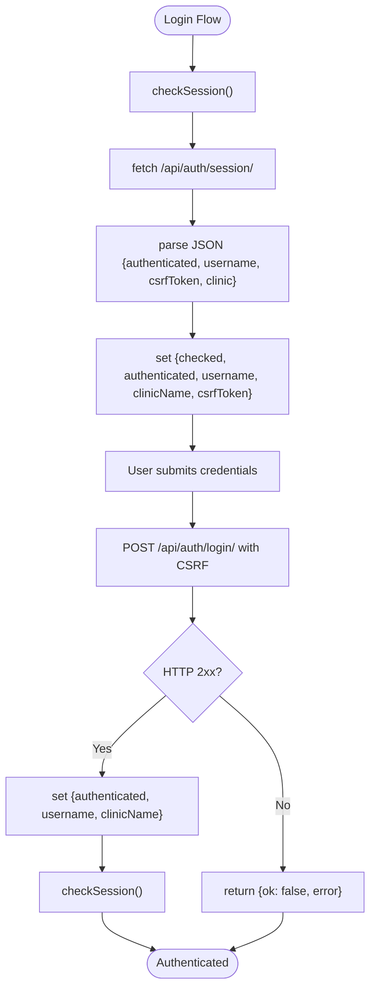
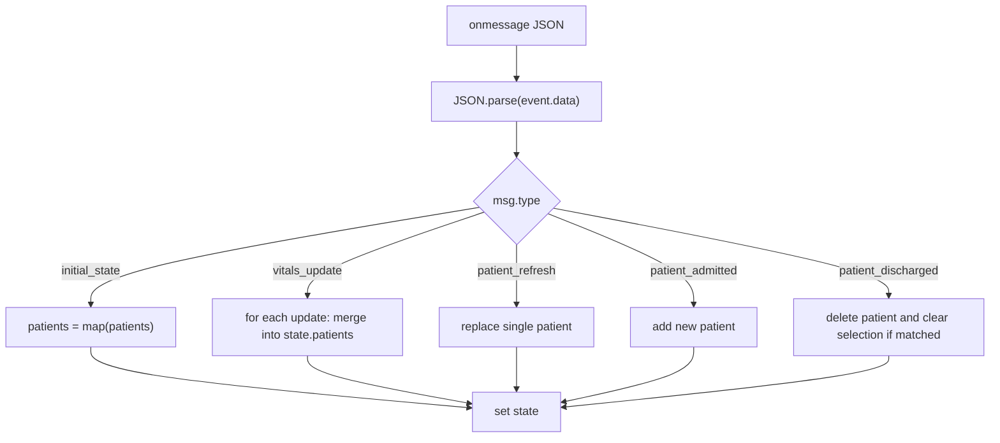
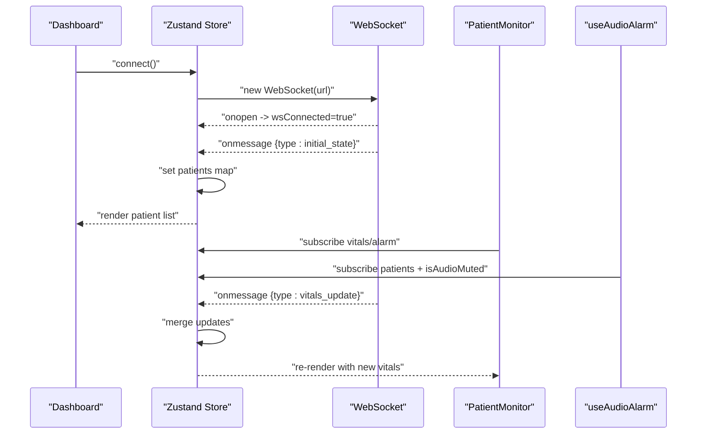
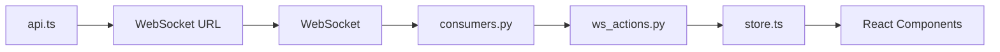

# State Management System

<cite>
**Referenced Files in This Document**
- [store.ts](file://frontend/src/store.ts)
- [authStore.ts](file://frontend/src/authStore.ts)
- [App.tsx](file://frontend/src/App.tsx)
- [Dashboard.tsx](file://frontend/src/components/Dashboard.tsx)
- [PatientMonitor.tsx](file://frontend/src/components/PatientMonitor.tsx)
- [LoginPage.tsx](file://frontend/src/components/LoginPage.tsx)
- [api.ts](file://frontend/src/lib/api.ts)
- [useAudioAlarm.ts](file://frontend/src/hooks/useAudioAlarm.ts)
- [AdmitPatientModal.tsx](file://frontend/src/components/AdmitPatientModal.tsx)
- [consumers.py](file://backend/monitoring/consumers.py)
- [routing.py](file://backend/monitoring/routing.py)
- [ws_actions.py](file://backend/monitoring/ws_actions.py)
</cite>

## Table of Contents
1. [Introduction](#introduction)
2. [Project Structure](#project-structure)
3. [Core Components](#core-components)
4. [Architecture Overview](#architecture-overview)
5. [Detailed Component Analysis](#detailed-component-analysis)
6. [Dependency Analysis](#dependency-analysis)
7. [Performance Considerations](#performance-considerations)
8. [Troubleshooting Guide](#troubleshooting-guide)
9. [Conclusion](#conclusion)
10. [Appendices](#appendices)

## Introduction
This document explains the Zustand-based state management system powering the Medicentral dashboard. It covers the global state architecture for patient data, device status, and monitoring state; the authentication store for session handling and user context; state update patterns and subscription mechanisms; and real-time synchronization via WebSocket connections. Practical guidance is included for creating new stores, implementing asynchronous state updates, managing complex state relationships, persistence strategies, debugging with React DevTools, performance optimization for large datasets, and integrating state with React components using selector patterns and subscription best practices.

## Project Structure
The frontend state management spans two primary stores:
- Global monitoring store: manages patient records, WebSocket connection, filters, and UI flags.
- Authentication store: handles session checks, login/logout, and CSRF-protected requests.

The backend integrates with Django Channels to stream real-time updates to clients.

**Diagram sources**
- [App.tsx:11-33](file://frontend/src/App.tsx#L11-L33)
- [Dashboard.tsx:32-54](file://frontend/src/components/Dashboard.tsx#L32-L54)
- [PatientMonitor.tsx:13-21](file://frontend/src/components/PatientMonitor.tsx#L13-L21)
- [useAudioAlarm.ts:12-80](file://frontend/src/hooks/useAudioAlarm.ts#L12-L80)
- [store.ts:173-352](file://frontend/src/store.ts#L173-L352)
- [authStore.ts:16-79](file://frontend/src/authStore.ts#L16-L79)
- [api.ts:15-34](file://frontend/src/lib/api.ts#L15-L34)
- [LoginPage.tsx:4-20](file://frontend/src/components/LoginPage.tsx#L4-L20)
- [AdmitPatientModal.tsx:22-98](file://frontend/src/components/AdmitPatientModal.tsx#L22-L98)
- [consumers.py:12-45](file://backend/monitoring/consumers.py#L12-L45)
- [routing.py:5-7](file://backend/monitoring/routing.py#L5-L7)
- [ws_actions.py:32-228](file://backend/monitoring/ws_actions.py#L32-L228)

**Section sources**
- [store.ts:173-352](file://frontend/src/store.ts#L173-L352)
- [authStore.ts:16-79](file://frontend/src/authStore.ts#L16-L79)
- [consumers.py:12-45](file://backend/monitoring/consumers.py#L12-L45)
- [routing.py:5-7](file://backend/monitoring/routing.py#L5-L7)

## Core Components
- Global monitoring store (Zustand)
  - Manages a patients map keyed by ID, WebSocket lifecycle, UI flags (privacy mode, audio mute), and search/filter state.
  - Provides actions to mutate state and send commands to the backend via WebSocket.
  - Handles real-time updates from the backend and merges incremental changes into the local state.
- Authentication store (Zustand)
  - Tracks session state, username, clinic, and CSRF token.
  - Implements async login/logout flows with CSRF protection and session refresh.
- WebSocket integration
  - Frontend connects to Django Channels endpoint and listens for typed events.
  - Backend validates user and clinic scope, broadcasts initial state and subsequent updates.

Key responsibilities:
- Real-time synchronization: initial_state, vitals_update, patient_refresh, patient_admitted, patient_discharged.
- Command dispatch: toggle_pin, add_note, acknowledge_alarm, set_schedule, set_all_schedules, clear_alarm, update_limits, measure_nibp, admit_patient, discharge_patient.

**Section sources**
- [store.ts:143-168](file://frontend/src/store.ts#L143-L168)
- [store.ts:173-352](file://frontend/src/store.ts#L173-L352)
- [authStore.ts:5-14](file://frontend/src/authStore.ts#L5-L14)
- [authStore.ts:16-79](file://frontend/src/authStore.ts#L16-L79)
- [consumers.py:12-45](file://backend/monitoring/consumers.py#L12-L45)
- [ws_actions.py:32-228](file://backend/monitoring/ws_actions.py#L32-L228)

## Architecture Overview
The system follows a unidirectional data flow:
- Components subscribe to Zustand selectors to render UI.
- Actions mutate state and/or send WebSocket commands.
- Backend processes commands and emits typed events to subscribed clients.
- Frontend merges incoming updates into the global store.

**Diagram sources**
- [store.ts:137-141](file://frontend/src/store.ts#L137-L141)
- [store.ts:237-317](file://frontend/src/store.ts#L237-L317)
- [consumers.py:38-45](file://backend/monitoring/consumers.py#L38-L45)
- [ws_actions.py:32-228](file://backend/monitoring/ws_actions.py#L32-L228)

## Detailed Component Analysis

### Global Monitoring Store (AppState)
The store defines:
- State shape: patients map, WebSocket instance and connection flag, UI flags, and search/filter state.
- Actions: toggles, selections, audio controls, pinning, clinical notes, alarm acknowledgments/clearing, limit updates, NIBP measurement, admission/discharge, and WebSocket lifecycle.
- WebSocket message handling: parses typed events and merges updates into the patients map.

**Diagram sources**
- [store.ts:143-168](file://frontend/src/store.ts#L143-L168)
- [store.ts:95-118](file://frontend/src/store.ts#L95-L118)
- [store.ts:5-13](file://frontend/src/store.ts#L5-L13)
- [store.ts:15-22](file://frontend/src/store.ts#L15-L22)

**Section sources**
- [store.ts:143-168](file://frontend/src/store.ts#L143-L168)
- [store.ts:173-352](file://frontend/src/store.ts#L173-L352)

### Authentication Store (AuthState)
The store encapsulates:
- Session state: checked, authenticated, username, clinic name, CSRF token.
- Async operations: checkSession, login, logout.
- Helpers: apiHeaders and authedFetch for CSRF-protected requests.

**Diagram sources**
- [authStore.ts:23-78](file://frontend/src/authStore.ts#L23-L78)

**Section sources**
- [authStore.ts:5-14](file://frontend/src/authStore.ts#L5-L14)
- [authStore.ts:16-79](file://frontend/src/authStore.ts#L16-L79)

### WebSocket Message Handling
The frontend WebSocket handler processes:
- initial_state: replaces the entire patients map.
- vitals_update: merges partial updates into existing patient entries.
- patient_refresh: replaces a single patient entry.
- patient_admitted/patient_discharged: adds/removes a patient and clears selection if needed.

**Diagram sources**
- [store.ts:237-317](file://frontend/src/store.ts#L237-L317)

**Section sources**
- [store.ts:237-317](file://frontend/src/store.ts#L237-L317)

### Component Integration Patterns
- Dashboard subscribes to auth and store state, initializes WebSocket on mount, and renders filtered patient grids.
- PatientMonitor subscribes to a single patient’s data and exposes actions to the store (pin, schedule, NIBP).
- useAudioAlarm subscribes to patients and audio mute flag to play critical alarms.
- LoginPage uses authStore to perform login and displays errors.
- AdmitPatientModal uses authedFetch and store.admitPatient to register new patients.

**Diagram sources**
- [Dashboard.tsx:32-54](file://frontend/src/components/Dashboard.tsx#L32-L54)
- [store.ts:237-317](file://frontend/src/store.ts#L237-L317)
- [PatientMonitor.tsx:13-21](file://frontend/src/components/PatientMonitor.tsx#L13-L21)
- [useAudioAlarm.ts:12-80](file://frontend/src/hooks/useAudioAlarm.ts#L12-L80)

**Section sources**
- [Dashboard.tsx:32-54](file://frontend/src/components/Dashboard.tsx#L32-L54)
- [PatientMonitor.tsx:13-21](file://frontend/src/components/PatientMonitor.tsx#L13-L21)
- [useAudioAlarm.ts:12-80](file://frontend/src/hooks/useAudioAlarm.ts#L12-L80)
- [LoginPage.tsx:4-20](file://frontend/src/components/LoginPage.tsx#L4-L20)
- [AdmitPatientModal.tsx:22-98](file://frontend/src/components/AdmitPatientModal.tsx#L22-L98)

## Dependency Analysis
- Frontend-to-backend communication:
  - Frontend resolves WebSocket URL via api.ts and connects to /ws/monitoring/.
  - Backend enforces authentication and clinic scope, then sends initial_state and streams updates.
- Store-to-component coupling:
  - Components subscribe to narrow slices via selectors to minimize re-renders.
  - Actions encapsulate both UI mutations and network commands.
- Backend-to-store coupling:
  - Backend actions persist changes and broadcast events; frontend merges them into state.

**Diagram sources**
- [api.ts:21-34](file://frontend/src/lib/api.ts#L21-L34)
- [consumers.py:12-45](file://backend/monitoring/consumers.py#L12-L45)
- [ws_actions.py:32-228](file://backend/monitoring/ws_actions.py#L32-L228)
- [store.ts:173-352](file://frontend/src/store.ts#L173-L352)

**Section sources**
- [api.ts:21-34](file://frontend/src/lib/api.ts#L21-L34)
- [routing.py:5-7](file://backend/monitoring/routing.py#L5-L7)
- [consumers.py:12-45](file://backend/monitoring/consumers.py#L12-L45)
- [ws_actions.py:32-228](file://backend/monitoring/ws_actions.py#L32-L228)

## Performance Considerations
- Selector granularity
  - Prefer narrow selectors to reduce re-renders. Components should subscribe only to the fields they use.
  - Example: PatientMonitor subscribes to a single patient’s vitals and alarm rather than the whole patients map.
- Immutable updates
  - The store uses immutable updates (spread operators) to ensure predictable re-renders.
- Batch updates
  - For frequent vitals_update events, consider debouncing or throttling UI rendering if needed.
- Large datasets
  - Keep the patients map normalized; avoid deep copies of large arrays. The current implementation spreads only the changed patient entry.
- WebSocket efficiency
  - The backend sends only necessary fields in vitals_update; the frontend merges selectively.
- Memoization
  - Dashboard uses useMemo for derived computations (counts, filtered lists) to avoid recomputation on every render.

**Section sources**
- [store.ts:267-293](file://frontend/src/store.ts#L267-L293)
- [Dashboard.tsx:61-98](file://frontend/src/components/Dashboard.tsx#L61-L98)
- [PatientMonitor.tsx:13-21](file://frontend/src/components/PatientMonitor.tsx#L13-L21)

## Troubleshooting Guide
- WebSocket connection issues
  - Verify backend routing and consumer acceptance. The frontend sets wsConnected on onopen and resets on close.
  - Manual disconnect clears timers and closes the socket; automatic reconnect occurs after a delay.
- Authentication failures
  - Ensure CSRF token is present and used in headers for non-GET requests. The authedFetch helper injects CSRF automatically.
- State not updating
  - Confirm the message type and payload match expected shapes. The frontend handles initial_state, vitals_update, patient_refresh, patient_admitted, patient_discharged.
- Component not re-rendering
  - Check that the component subscribes to the correct selector slice and that the store update path is immutable.

**Section sources**
- [store.ts:319-335](file://frontend/src/store.ts#L319-L335)
- [authStore.ts:98-106](file://frontend/src/authStore.ts#L98-L106)
- [ws_actions.py:32-228](file://backend/monitoring/ws_actions.py#L32-L228)

## Conclusion
The Zustand-based state management system cleanly separates concerns between monitoring and authentication, enabling real-time synchronization with minimal boilerplate. Components subscribe to narrow state slices, actions encapsulate both UI and network responsibilities, and WebSocket events drive deterministic updates. With careful selector usage, immutable updates, and memoization, the system scales to large datasets while maintaining responsiveness.

## Appendices

### Practical Examples

- Creating a new store
  - Define a Zustand store with a typed state interface and action methods.
  - Use set/get helpers for state updates and cross-store access.
  - Reference: [store.ts:173-352](file://frontend/src/store.ts#L173-L352), [authStore.ts:16-79](file://frontend/src/authStore.ts#L16-L79)

- Implementing async state updates
  - Use async actions to fetch data and update state atomically.
  - Example: authStore.checkSession and authStore.login.
  - Reference: [authStore.ts:23-78](file://frontend/src/authStore.ts#L23-L78)

- Managing complex state relationships
  - Normalize state (patients map) and merge updates carefully to preserve referential equality.
  - Example: merging vitals_update into existing patient entries.
  - Reference: [store.ts:267-293](file://frontend/src/store.ts#L267-L293)

- State persistence strategies
  - Persist critical UI flags (e.g., privacyMode, isAudioMuted) to localStorage or sessionStorage.
  - For patient data, rely on WebSocket sync; avoid client-side caching of sensitive medical data.
  - Reference: [store.ts:174-180](file://frontend/src/store.ts#L174-L180)

- Debugging with React DevTools
  - Use React DevTools to inspect component subscriptions and state slices.
  - Monitor selector usage to ensure minimal re-renders.
  - Reference: [Dashboard.tsx:39](file://frontend/src/components/Dashboard.tsx#L39), [PatientMonitor.tsx:13-21](file://frontend/src/components/PatientMonitor.tsx#L13-L21)

- Performance optimization for large datasets
  - Prefer narrow selectors, memoized derived data, and immutable updates.
  - Debounce or throttle frequent UI updates if necessary.
  - Reference: [Dashboard.tsx:61-98](file://frontend/src/components/Dashboard.tsx#L61-L98), [store.ts:267-293](file://frontend/src/store.ts#L267-L293)

- Integrating with React components
  - Use selector patterns to subscribe to state slices.
  - Best practices: keep selectors pure, avoid unnecessary object creation inside selectors, and memoize heavy computations.
  - References: [Dashboard.tsx:39](file://frontend/src/components/Dashboard.tsx#L39), [PatientMonitor.tsx:13-21](file://frontend/src/components/PatientMonitor.tsx#L13-L21), [useAudioAlarm.ts:12-80](file://frontend/src/hooks/useAudioAlarm.ts#L12-L80)