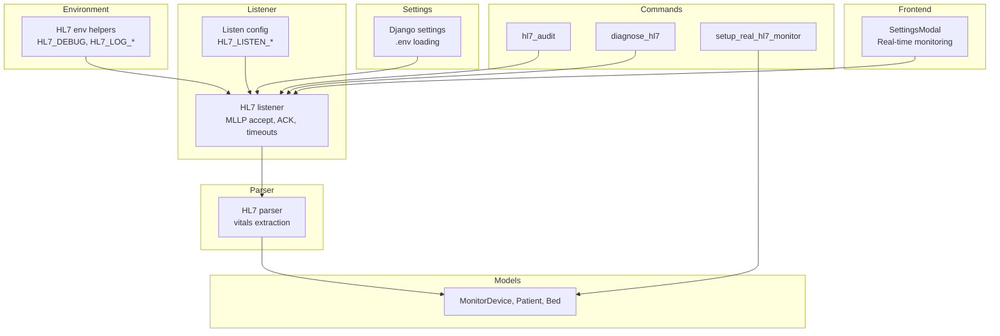
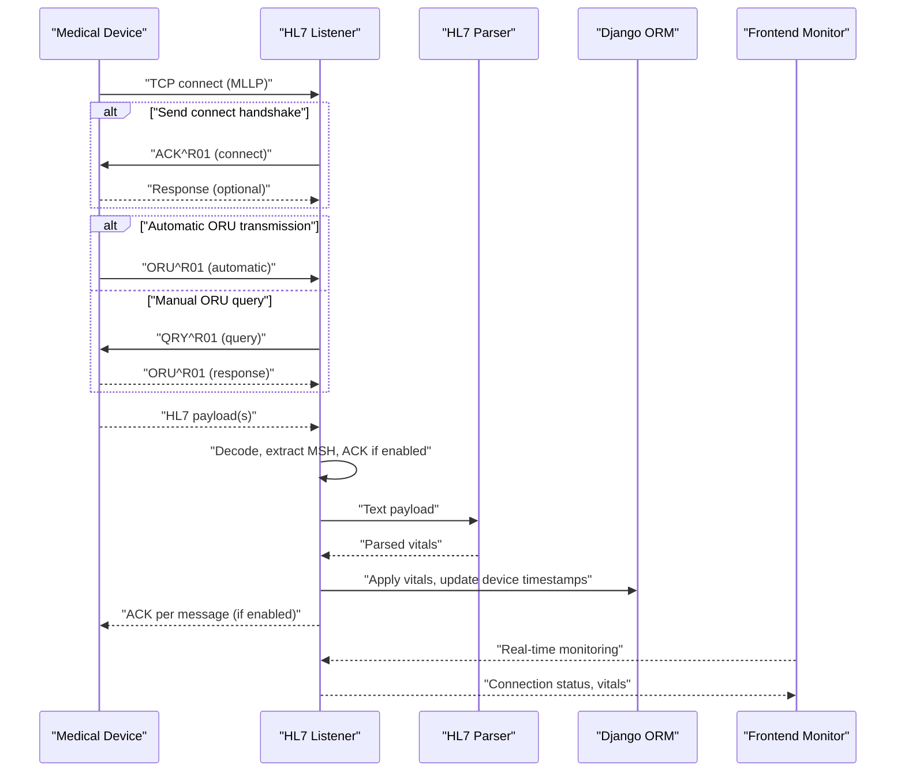
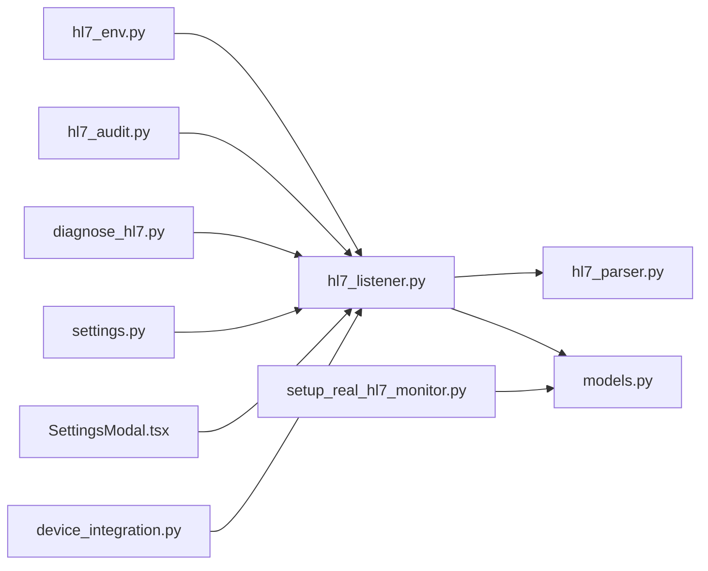
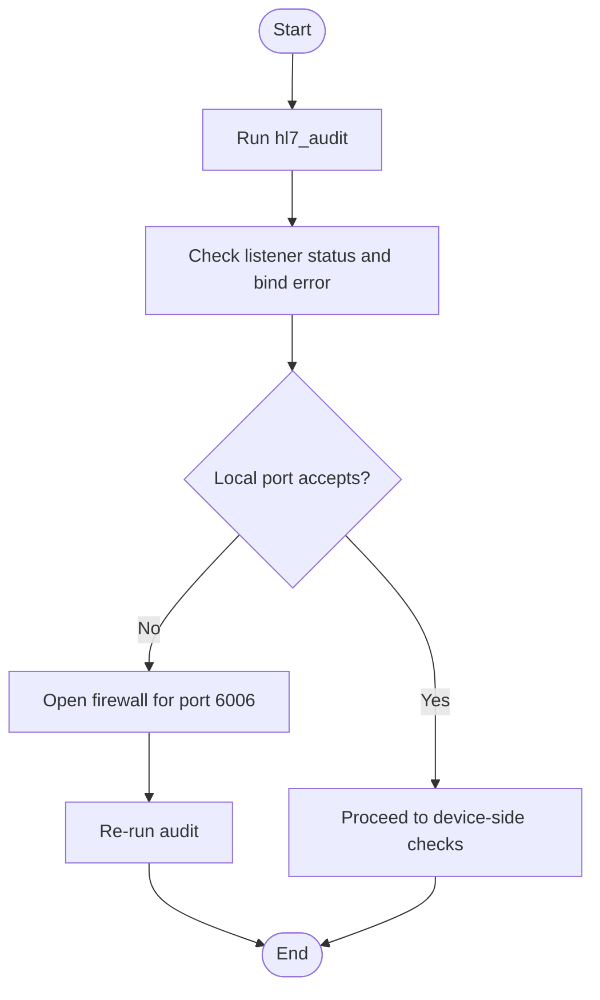

# Configuration & Troubleshooting Guide

<cite>
**Referenced Files in This Document**
- [hl7_env.py](file://backend/monitoring/hl7_env.py)
- [hl7_listener.py](file://backend/monitoring/hl7_listener.py)
- [hl7_parser.py](file://backend/monitoring/hl7_parser.py)
- [models.py](file://backend/monitoring/models.py)
- [diagnose_hl7.py](file://backend/monitoring/management/commands/diagnose_hl7.py)
- [hl7_audit.py](file://backend/monitoring/management/commands/hl7_audit.py)
- [setup_real_hl7_monitor.py](file://backend/monitoring/management/commands/setup_real_hl7_monitor.py)
- [settings.py](file://backend/medicentral/settings.py)
- [SettingsModal.tsx](file://frontend/src/components/SettingsModal.tsx)
- [device_integration.py](file://backend/monitoring/device_integration.py)
- [views.py](file://backend/monitoring/views.py)
</cite>

## Update Summary
**Changes Made**
- Enhanced troubleshooting documentation for K12 Creative Medical device configuration
- Improved step-by-step guidance for HL7 connection setup with specific MLLP handshake configuration
- Updated frontend interface documentation explaining automatic ORU transmission behavior
- Added specific diagnostic steps for zero-byte session handling
- Expanded MLLP handshake configuration guidance for different device behaviors

## Table of Contents
1. [Introduction](#introduction)
2. [Project Structure](#project-structure)
3. [Core Components](#core-components)
4. [Architecture Overview](#architecture-overview)
5. [Detailed Component Analysis](#detailed-component-analysis)
6. [Dependency Analysis](#dependency-analysis)
7. [Performance Considerations](#performance-considerations)
8. [Troubleshooting Guide](#troubleshooting-guide)
9. [Conclusion](#conclusion)
10. [Appendices](#appendices)

## Introduction
This guide documents configuration and troubleshooting for medical device HL7/MLLP integration in the backend. It covers environment variables, diagnostic tools, monitoring capabilities, and step-by-step procedures for common issues such as connection failures, malformed messages, timeouts, and NAT traversal. It also explains the HL7 audit system, connection health monitoring, and automated diagnostic commands, with practical examples for different device types and production optimization recommendations.

**Updated** Enhanced coverage for K12 Creative Medical device configuration and automatic ORU transmission behavior.

## Project Structure
The HL7 integration spans several modules:
- Environment configuration and logging controls
- HL7 listener and MLLP handling
- HL7 parsing and vitals extraction
- Monitoring models and device records
- Management commands for diagnostics, auditing, and setup
- Django settings for runtime configuration
- Frontend interface with real-time connection monitoring

**Diagram sources**
- [hl7_env.py:1-33](file://backend/monitoring/hl7_env.py#L1-L33)
- [hl7_listener.py:692-755](file://backend/monitoring/hl7_listener.py#L692-L755)
- [hl7_parser.py:423-530](file://backend/monitoring/hl7_parser.py#L423-L530)
- [models.py:77-140](file://backend/monitoring/models.py#L77-L140)
- [hl7_audit.py:1-99](file://backend/monitoring/management/commands/hl7_audit.py#L1-L99)
- [diagnose_hl7.py:1-182](file://backend/monitoring/management/commands/diagnose_hl7.py#L1-L182)
- [setup_real_hl7_monitor.py:1-224](file://backend/monitoring/management/commands/setup_real_hl7_monitor.py#L1-L224)
- [settings.py:14-20](file://backend/medicentral/settings.py#L14-L20)
- [SettingsModal.tsx:560-759](file://frontend/src/components/SettingsModal.tsx#L560-L759)

**Section sources**
- [hl7_env.py:1-33](file://backend/monitoring/hl7_env.py#L1-L33)
- [hl7_listener.py:692-755](file://backend/monitoring/hl7_listener.py#L692-L755)
- [hl7_parser.py:423-530](file://backend/monitoring/hl7_parser.py#L423-L530)
- [models.py:77-140](file://backend/monitoring/models.py#L77-L140)
- [hl7_audit.py:1-99](file://backend/monitoring/management/commands/hl7_audit.py#L1-L99)
- [diagnose_hl7.py:1-182](file://backend/monitoring/management/commands/diagnose_hl7.py#L1-L182)
- [setup_real_hl7_monitor.py:1-224](file://backend/monitoring/management/commands/setup_real_hl7_monitor.py#L1-L224)
- [settings.py:14-20](file://backend/medicentral/settings.py#L14-L20)
- [SettingsModal.tsx:560-759](file://frontend/src/components/SettingsModal.tsx#L560-L759)

## Core Components
- HL7 environment helpers: control raw TCP/MSH logging via HL7_DEBUG and granular flags.
- HL7 listener: MLLP accept loop, ACK generation, receive timeouts, optional connect handshake, and diagnostic counters.
- HL7 parser: robust vitals extraction supporting multiple encodings and device-specific segment variations.
- Monitoring models: device records with HL7 peer IP, handshake flag, and timestamps for monitoring.
- Management commands: audit, diagnostics, and setup for real device monitoring.
- Frontend interface: real-time connection monitoring with automatic ORU transmission detection.

**Updated** Enhanced frontend monitoring capabilities for automatic ORU transmission behavior.

**Section sources**
- [hl7_env.py:18-32](file://backend/monitoring/hl7_env.py#L18-L32)
- [hl7_listener.py:36-755](file://backend/monitoring/hl7_listener.py#L36-L755)
- [hl7_parser.py:423-530](file://backend/monitoring/hl7_parser.py#L423-L530)
- [models.py:77-140](file://backend/monitoring/models.py#L77-L140)
- [hl7_audit.py:24-99](file://backend/monitoring/management/commands/hl7_audit.py#L24-L99)
- [diagnose_hl7.py:22-182](file://backend/monitoring/management/commands/diagnose_hl7.py#L22-L182)
- [setup_real_hl7_monitor.py:29-224](file://backend/monitoring/management/commands/setup_real_hl7_monitor.py#L29-L224)
- [SettingsModal.tsx:560-759](file://frontend/src/components/SettingsModal.tsx#L560-L759)

## Architecture Overview
The HL7 integration architecture centers on a threaded MLLP listener that accepts connections, optionally sends a connect handshake, receives HL7 payloads, decodes them, extracts vitals, and updates device/patient state. Diagnostic counters and logs track session health and raw traffic for troubleshooting. The frontend provides real-time monitoring with automatic ORU transmission detection.

**Updated** Enhanced with automatic ORU transmission behavior and real-time monitoring capabilities.

**Diagram sources**
- [hl7_listener.py:426-578](file://backend/monitoring/hl7_listener.py#L426-L578)
- [hl7_parser.py:487-530](file://backend/monitoring/hl7_parser.py#L487-L530)
- [models.py:77-140](file://backend/monitoring/models.py#L77-L140)
- [SettingsModal.tsx:604-739](file://frontend/src/components/SettingsModal.tsx#L604-L739)

## Detailed Component Analysis

### Environment Variables and Logging Controls
Key environment variables affecting HL7 behavior and diagnostics:
- HL7_LISTEN_ENABLED: Enable/disable listener thread.
- HL7_LISTEN_HOST: Bind host for MLLP listener.
- HL7_LISTEN_PORT: TCP port for MLLP listener (default 6006).
- HL7_SEND_ACK: Whether to send ACK responses to incoming HL7 messages.
- HL7_RECV_TIMEOUT_SEC: Receive timeout for connections; 0 or empty means no timeout.
- HL7_SEND_CONNECT_HANDSHAKE: Global default for sending connect handshake; device-specific override supported.
- HL7_RECV_BEFORE_HANDSHAKE_MS: Initial receive window before handshake to capture early device data.
- HL7_NAT_SINGLE_DEVICE_FALLBACK: Allow single-device fallback for NAT scenarios.
- HL7_DEBUG: Enables comprehensive raw TCP/MSH logging.
- HL7_LOG_RAW_TCP_RECV: Log raw TCP bytes when no MSH found.
- HL7_LOG_FIRST_RECV_HEX: Log first receive hex dump.
- HL7_LOG_RAW_PREVIEW: Log raw text preview for diagnostics.

Operational notes:
- Truthy values for booleans are: 1, true, yes, on.
- Listener startup honors .env via Django settings.
- Raw logging is gated by HL7_DEBUG and granular flags.

**Section sources**
- [hl7_listener.py:692-755](file://backend/monitoring/hl7_listener.py#L692-L755)
- [hl7_listener.py:164-185](file://backend/monitoring/hl7_listener.py#L164-L185)
- [hl7_listener.py:357-393](file://backend/monitoring/hl7_listener.py#L357-L393)
- [hl7_env.py:18-32](file://backend/monitoring/hl7_env.py#L18-L32)
- [settings.py:14-20](file://backend/medicentral/settings.py#L14-L20)

### HL7 Listener and Diagnostics
Highlights:
- Threaded accept loop with bind error tracking and restart behavior.
- Per-session diagnostic counters: payload counts, last peer, total bytes, last ACK attempted, and empty session stats.
- Optional connect handshake and ORU query to trigger device response.
- ACK generation controlled by HL7_SEND_ACK; MSA AA responses constructed from incoming MSH control ID.
- Receive timeout applied per connection via HL7_RECV_TIMEOUT_SEC.
- First-chunk receive before handshake captures early device data when HL7_RECV_BEFORE_HANDSHAKE_MS > 0.

Health monitoring:
- Listener status includes enabled flag, host/port, thread liveness, local port acceptance, and bind error.
- Diagnostic summary exposes last payload time/peer, session counts, and raw byte previews.
- Zero-byte session detection with specific error handling for 0-byte TCP connections.

**Updated** Enhanced zero-byte session handling with specific diagnostic steps for different failure modes.

**Section sources**
- [hl7_listener.py:36-71](file://backend/monitoring/hl7_listener.py#L36-L71)
- [hl7_listener.py:426-578](file://backend/monitoring/hl7_listener.py#L426-L578)
- [hl7_listener.py:635-755](file://backend/monitoring/hl7_listener.py#L635-L755)
- [hl7_audit.py:24-53](file://backend/monitoring/management/commands/hl7_audit.py#L24-L53)

### HL7 Parser and Vitals Extraction
Capabilities:
- Multi-encoding support: UTF-8, UTF-16 LE/BE, CP1251, Latin-1, GBK.
- Robust OBX parsing with fallbacks for non-standard segment layouts.
- Numeric scanning across OBR/NTE/ST/Z* segments and regex-based detection.
- Heuristic classification for ambiguous LOINC-like identifiers.
- Extracts: HR, SpO2, Temperature, Respiratory Rate, and NIBP (Sys/Dia).

Diagnostic aids:
- Segment type summary for quick inspection.
- Raw preview logging for non-MSH cases when configured.

**Section sources**
- [hl7_parser.py:423-530](file://backend/monitoring/hl7_parser.py#L423-L530)
- [hl7_parser.py:410-421](file://backend/monitoring/hl7_parser.py#L410-L421)

### Monitoring Models and NAT Handling
Key fields:
- MonitorDevice: ip_address, local_ip, hl7_peer_ip (NAT override), hl7_port, hl7_enabled, hl7_connect_handshake, last_hl7_rx_at_ms, last_seen.
- Device resolution supports NAT loopback and peer IP overrides.

NAT guidance:
- hl7_peer_ip allows specifying the server-visible IP for NAT scenarios.
- HL7_NAT_SINGLE_DEVICE_FALLBACK enables automatic device association for single-device setups under NAT.

**Section sources**
- [models.py:77-140](file://backend/monitoring/models.py#L77-L140)
- [hl7_listener.py:66-68](file://backend/monitoring/hl7_listener.py#L66-L68)
- [setup_real_hl7_monitor.py:107-151](file://backend/monitoring/management/commands/setup_real_hl7_monitor.py#L107-L151)

### Management Commands: Audit, Diagnostics, Setup
- hl7_audit: Prints listener config, status, diagnostic summary, and enabled devices; optionally sends a local test ORU to validate end-to-end reception.
- diagnose_hl7: Comprehensive health check including DB connectivity, clinic/device/patient presence, chain verification (Bed → Device → Patient), listener status, and actionable recommendations.
- setup_real_hl7_monitor: Creates a real K12 device record and associated bed/patient, configures HL7 settings, and prints device-side checklist.

**Updated** Enhanced K12 device setup with specific MLLP handshake configuration options.

**Section sources**
- [hl7_audit.py:24-99](file://backend/monitoring/management/commands/hl7_audit.py#L24-L99)
- [diagnose_hl7.py:22-182](file://backend/monitoring/management/commands/diagnose_hl7.py#L22-L182)
- [setup_real_hl7_monitor.py:29-224](file://backend/monitoring/management/commands/setup_real_hl7_monitor.py#L29-L224)

### Frontend Interface and Real-Time Monitoring
The frontend provides comprehensive real-time monitoring of HL7 connections with automatic ORU transmission detection:

- Connection status panel showing data stream quality, bed assignment, and patient presence
- HL7 port monitoring with local port acceptance status
- TCP session statistics including zero-byte session detection
- Automatic ORU transmission behavior detection
- Firewall hints and diagnostic recommendations
- Real-time vitals display and device status indicators

**Updated** New section documenting frontend monitoring capabilities for automatic ORU transmission behavior.

**Section sources**
- [SettingsModal.tsx:560-759](file://frontend/src/components/SettingsModal.tsx#L560-L759)
- [views.py:125-138](file://backend/monitoring/views.py#L125-L138)

## Dependency Analysis

**Diagram sources**
- [hl7_env.py:1-33](file://backend/monitoring/hl7_env.py#L1-L33)
- [hl7_listener.py:1-755](file://backend/monitoring/hl7_listener.py#L1-L755)
- [hl7_parser.py:1-530](file://backend/monitoring/hl7_parser.py#L1-L530)
- [models.py:1-224](file://backend/monitoring/models.py#L1-L224)
- [hl7_audit.py:1-99](file://backend/monitoring/management/commands/hl7_audit.py#L1-L99)
- [diagnose_hl7.py:1-182](file://backend/monitoring/management/commands/diagnose_hl7.py#L1-L182)
- [setup_real_hl7_monitor.py:1-224](file://backend/monitoring/management/commands/setup_real_hl7_monitor.py#L1-L224)
- [settings.py:14-20](file://backend/medicentral/settings.py#L14-L20)
- [SettingsModal.tsx:560-759](file://frontend/src/components/SettingsModal.tsx#L560-L759)
- [device_integration.py:1-200](file://backend/monitoring/device_integration.py#L1-200)

**Section sources**
- [hl7_listener.py:635-755](file://backend/monitoring/hl7_listener.py#L635-L755)
- [hl7_parser.py:487-530](file://backend/monitoring/hl7_parser.py#L487-L530)
- [models.py:77-140](file://backend/monitoring/models.py#L77-L140)
- [hl7_audit.py:24-53](file://backend/monitoring/management/commands/hl7_audit.py#L24-L53)
- [diagnose_hl7.py:22-182](file://backend/monitoring/management/commands/diagnose_hl7.py#L22-L182)
- [setup_real_hl7_monitor.py:29-224](file://backend/monitoring/management/commands/setup_real_hl7_monitor.py#L29-L224)
- [settings.py:14-20](file://backend/medicentral/settings.py#L14-L20)
- [SettingsModal.tsx:560-759](file://frontend/src/components/SettingsModal.tsx#L560-L759)
- [device_integration.py:1-200](file://backend/monitoring/device_integration.py#L1-200)

## Performance Considerations
- Keep HL7_RECV_TIMEOUT_SEC tuned to device emission intervals to avoid premature disconnects.
- Disable raw TCP logging in production to reduce overhead; enable selectively via HL7_DEBUG and granular flags.
- Prefer UTF-8 encoding on devices to minimize decoding fallbacks.
- Ensure database connection pooling and keepalive are configured appropriately for high throughput.
- Use hl7_peer_ip and HL7_NAT_SINGLE_DEVICE_FALLBACK to avoid unnecessary device resolution retries under NAT.
- Leverage automatic ORU transmission detection to optimize monitoring and reduce manual intervention.

**Updated** Added guidance for leveraging automatic ORU transmission behavior for performance optimization.

## Troubleshooting Guide

### Step-by-Step Procedures

#### 1) Verify Listener Health and Connectivity
- Run the audit command to print listener config, status, and diagnostic summary.
- Use the diagnostics command to check database, clinic/device/patient records, and listener status with actionable recommendations.
- Confirm local port acceptance using the built-in probe.

**Diagram sources**
- [hl7_audit.py:24-53](file://backend/monitoring/management/commands/hl7_audit.py#L24-L53)
- [diagnose_hl7.py:109-146](file://backend/monitoring/management/commands/diagnose_hl7.py#L109-L146)

**Section sources**
- [hl7_audit.py:24-53](file://backend/monitoring/management/commands/hl7_audit.py#L24-L53)
- [diagnose_hl7.py:109-146](file://backend/monitoring/management/commands/diagnose_hl7.py#L109-L146)

#### 2) Resolve Connection Failures (0-byte sessions)
Symptoms:
- Empty session recorded with total TCP bytes = 0.
- Logs indicate "TCP accepted but 0 bytes."

Common causes:
- Device not emitting HL7/MLLP (only generic TCP).
- Connect handshake mismatch.
- Device waits for ORU query.
- Firewall/router resets.

Remediation steps:
- Toggle device-specific hl7_connect_handshake in admin or set HL7_SEND_CONNECT_HANDSHAKE globally.
- Increase HL7_RECV_BEFORE_HANDSHAKE_MS to capture early data.
- Ensure device ORU transmission is enabled and sensors are attached.
- Review firewall/router behavior.

**Updated** Enhanced with specific guidance for K12 Creative Medical devices and automatic ORU transmission behavior.

**Section sources**
- [hl7_listener.py:514-541](file://backend/monitoring/hl7_listener.py#L514-L541)
- [setup_real_hl7_monitor.py:153-186](file://backend/monitoring/management/commands/setup_real_hl7_monitor.py#L153-L186)

#### 3) Handle Malformed Messages and Non-MSH Traffic
Symptoms:
- No vitals extracted; parser logs indicate no MSH.
- Raw traffic logged conditionally.

Actions:
- Enable HL7_LOG_RAW_TCP_RECV or HL7_LOG_RAW_PREVIEW for diagnostics.
- Confirm device protocol is HL7/MLLP and not raw TCP.
- Validate device configuration for ORU emission and interval.

**Section sources**
- [hl7_env.py:23-32](file://backend/monitoring/hl7_env.py#L23-L32)
- [hl7_listener.py:266-284](file://backend/monitoring/hl7_listener.py#L266-L284)
- [hl7_parser.py:517-530](file://backend/monitoring/hl7_parser.py#L517-L530)

#### 4) Device Timeouts and Slow Responses
Symptoms:
- Frequent "recv — timeout" or "peer reset" messages.
- Inconsistent vitals timing.

Actions:
- Set HL7_RECV_TIMEOUT_SEC to match device emission cadence.
- Reduce network latency and jitter; ensure stable device connectivity.
- Validate device-side ORU interval and sensor status.

**Section sources**
- [hl7_listener.py:237-264](file://backend/monitoring/hl7_listener.py#L237-L264)
- [hl7_listener.py:164-174](file://backend/monitoring/hl7_listener.py#L164-L174)

#### 5) NAT Traversal Issues
Symptoms:
- Device connects from private IP; server sees loopback or unexpected peer.
- Device appears offline despite activity.

Actions:
- Set device.hl7_peer_ip to the server-visible IP observed in logs.
- Alternatively, enable HL7_NAT_SINGLE_DEVICE_FALLBACK for single-device NAT setups.
- Validate device network routes and firewall rules.

**Section sources**
- [models.py:109-114](file://backend/monitoring/models.py#L109-L114)
- [hl7_listener.py:66-68](file://backend/monitoring/hl7_listener.py#L66-L68)
- [diagnose_hl7.py:170-173](file://backend/monitoring/management/commands/diagnose_hl7.py#L170-L173)

#### 6) Automated Diagnostic Commands
- hl7_audit: Prints listener config/status, diagnostic summary, and enabled devices; optionally sends a local ORU to validate reception.
- diagnose_hl7: Comprehensive health report including DB, clinic/device/patient checks, chain verification, listener status, and recommendations.
- setup_real_hl7_monitor: Creates a real device and patient record with proper HL7 settings and device-side checklist.

**Section sources**
- [hl7_audit.py:24-99](file://backend/monitoring/management/commands/hl7_audit.py#L24-L99)
- [diagnose_hl7.py:22-182](file://backend/monitoring/management/commands/diagnose_hl7.py#L22-L182)
- [setup_real_hl7_monitor.py:29-224](file://backend/monitoring/management/commands/setup_real_hl7_monitor.py#L29-L224)

### Log Analysis Techniques
- Use HL7_DEBUG and granular flags to enable raw TCP/MSH logging for deep inspection.
- Review diagnostic counters for recent payload peers and session counts.
- Correlate device timestamps (last_hl7_rx_at_ms) with actual HL7 packet reception, not just TCP connections.
- Monitor zero-byte session patterns to identify device-specific connection issues.

**Updated** Added guidance for analyzing zero-byte session patterns and device-specific connection issues.

**Section sources**
- [hl7_env.py:18-32](file://backend/monitoring/hl7_env.py#L18-L32)
- [hl7_listener.py:36-71](file://backend/monitoring/hl7_listener.py#L36-L71)
- [models.py:120-124](file://backend/monitoring/models.py#L120-L124)

### Practical Examples

#### Example A: Configure a K12 Device Under NAT
- Use setup_real_hl7_monitor with --peer-ip to specify the server-visible IP.
- Confirm device menu settings: HL7/MLLP enabled, Server IP matches target, ORU emission on.
- Validate firewall rules and NAT forwarding.
- Configure MLLP handshake based on device behavior: use --hl7-handshake for devices requiring explicit handshake.

**Updated** Enhanced with specific MLLP handshake configuration for K12 devices.

**Section sources**
- [setup_real_hl7_monitor.py:52-76](file://backend/monitoring/management/commands/setup_real_hl7_monitor.py#L52-L76)
- [diagnose_hl7.py:170-173](file://backend/monitoring/management/commands/diagnose_hl7.py#L170-L173)

#### Example B: Optimize for Production
- Disable raw logging; rely on HL7_SEND_ACK and HL7_RECV_TIMEOUT_SEC tuning.
- Ensure UTF-8 encoding on device; confirm parser heuristics are not triggered.
- Monitor diagnostic counters and logs for anomalies.
- Leverage automatic ORU transmission behavior to reduce manual intervention.

**Updated** Added guidance for leveraging automatic ORU transmission behavior for production optimization.

**Section sources**
- [hl7_env.py:23-32](file://backend/monitoring/hl7_env.py#L23-L32)
- [hl7_listener.py:164-185](file://backend/monitoring/hl7_listener.py#L164-L185)
- [hl7_parser.py:487-530](file://backend/monitoring/hl7_parser.py#L487-L530)

### Frontend Monitoring and Automatic ORU Detection
The frontend provides comprehensive monitoring of HL7 connections with automatic ORU transmission detection:

- Real-time connection status with automatic ORU transmission behavior detection
- Zero-byte session monitoring with specific error patterns for different failure modes
- Automatic ORU transmission behavior: "ORU" may not appear as a separate menu item on many K12 devices
- Connection check panel showing data stream quality, bed assignment, and patient presence
- Firewall hints and diagnostic recommendations based on connection patterns

**Updated** New section documenting frontend monitoring capabilities for automatic ORU transmission behavior.

**Section sources**
- [SettingsModal.tsx:560-759](file://frontend/src/components/SettingsModal.tsx#L560-L759)
- [views.py:125-138](file://backend/monitoring/views.py#L125-L138)

## Conclusion
This guide provides a complete reference for configuring and troubleshooting HL7/MLLP integration. By leveraging environment variables, diagnostic commands, monitoring models, and enhanced frontend monitoring capabilities, operators can quickly diagnose and resolve connection, parsing, and NAT-related issues while maintaining performance in production. The enhanced K12 Creative Medical device configuration and automatic ORU transmission behavior detection provide additional tools for reliable medical device integration.

**Updated** Enhanced conclusion reflecting improvements in K12 device configuration and automatic ORU transmission monitoring.

## Appendices

### Environment Variables Reference
- HL7_LISTEN_ENABLED: Enable/disable listener thread.
- HL7_LISTEN_HOST: Bind host for MLLP listener.
- HL7_LISTEN_PORT: TCP port for MLLP listener (default 6006).
- HL7_SEND_ACK: Send ACK responses to incoming HL7 messages.
- HL7_RECV_TIMEOUT_SEC: Receive timeout for connections.
- HL7_SEND_CONNECT_HANDSHAKE: Global connect handshake default.
- HL7_RECV_BEFORE_HANDSHAKE_MS: Initial receive window before handshake.
- HL7_NAT_SINGLE_DEVICE_FALLBACK: Single-device NAT fallback.
- HL7_DEBUG: Enable comprehensive raw TCP/MSH logging.
- HL7_LOG_RAW_TCP_RECV: Log raw TCP bytes when no MSH found.
- HL7_LOG_FIRST_RECV_HEX: Log first receive hex dump.
- HL7_LOG_RAW_PREVIEW: Log raw text preview for diagnostics.

**Section sources**
- [hl7_listener.py:692-755](file://backend/monitoring/hl7_listener.py#L692-L755)
- [hl7_listener.py:164-185](file://backend/monitoring/hl7_listener.py#L164-L185)
- [hl7_listener.py:357-393](file://backend/monitoring/hl7_listener.py#L357-L393)
- [hl7_env.py:18-32](file://backend/monitoring/hl7_env.py#L18-L32)

### K12 Creative Medical Device Configuration Checklist
- **Device Menu Settings**: Menu → Internet → HL7 (Server IP, port 6006, Protocol: HL7/MLLP)
- **ORU Transmission**: ORU may not appear as separate menu item; automatic ORU^R01 emission occurs after HL7 enablement
- **Sensor Verification**: ECG leads, SpO2 finger sensor, NIBP cuff properly attached
- **Connection Testing**: HL7 screen shows green "Connected" status, main screen displays non-"—" HR and SpO2 values
- **Alternative Menu Names**: Look for "передача", "обмен", "сетевой поток", "наблюдения" translations
- **MLLP Handshake**: Use --hl7-handshake flag for devices requiring explicit handshake
- **Zero-byte Session Handling**: Configure HL7_RECV_BEFORE_HANDSHAKE_MS=500 for devices sending immediate ORU

**Updated** Enhanced K12 device configuration checklist with automatic ORU transmission behavior and MLLP handshake configuration.

**Section sources**
- [setup_real_hl7_monitor.py:161-194](file://backend/monitoring/management/commands/setup_real_hl7_monitor.py#L161-L194)
- [SettingsModal.tsx:563-576](file://frontend/src/components/SettingsModal.tsx#L563-L576)