# Device Integration Workflow

<cite>
**Referenced Files in This Document**
- [device_integration.py](file://backend/monitoring/device_integration.py)
- [hl7_listener.py](file://backend/monitoring/hl7_listener.py)
- [hl7_parser.py](file://backend/monitoring/hl7_parser.py)
- [models.py](file://backend/monitoring/models.py)
- [broadcast.py](file://backend/monitoring/broadcast.py)
- [consumers.py](file://backend/monitoring/consumers.py)
- [routing.py](file://backend/monitoring/routing.py)
- [views.py](file://backend/monitoring/views.py)
- [serializers.py](file://backend/monitoring/serializers.py)
- [ws_actions.py](file://backend/monitoring/ws_actions.py)
- [screen_parse.py](file://backend/monitoring/screen_parse.py)
- [setup_real_hl7_monitor.py](file://backend/monitoring/management/commands/setup_real_hl7_monitor.py)
- [diagnose_hl7.py](file://backend/monitoring/management/commands/diagnose_hl7.py)
- [reset_monitoring_fresh.py](file://backend/monitoring/management/commands/reset_monitoring_fresh.py)
- [simulation.py](file://backend/monitoring/simulation.py)
</cite>

## Table of Contents
1. [Introduction](#introduction)
2. [Project Structure](#project-structure)
3. [Core Components](#core-components)
4. [Architecture Overview](#architecture-overview)
5. [Detailed Component Analysis](#detailed-component-analysis)
6. [Dependency Analysis](#dependency-analysis)
7. [Performance Considerations](#performance-considerations)
8. [Troubleshooting Guide](#troubleshooting-guide)
9. [Conclusion](#conclusion)
10. [Appendices](#appendices)

## Introduction
This document explains the end-to-end device integration workflow for medical monitors, covering device discovery, registration, peer IP resolution with NAT support, automatic device-to-patient mapping, vitals payload application, validation, error handling, device state management, and persistent storage via Django models. It also provides practical guidance for configuring new devices, troubleshooting integration issues, extending support for additional equipment, and maintaining the system.

## Project Structure
The monitoring subsystem is organized around:
- Device discovery and registration (including screen image parsing)
- HL7 MLLP listener and parser
- Device vitals ingestion and application
- Real-time broadcasting to WebSocket clients
- Persistent storage via Django models
- Management commands for setup and diagnostics

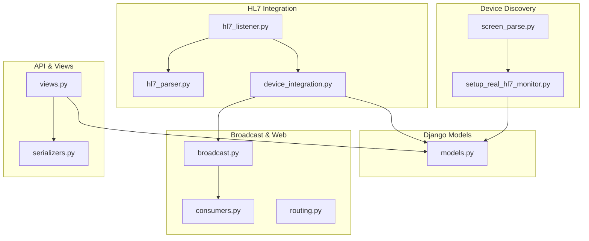

**Diagram sources**
- [screen_parse.py:1-160](file://backend/monitoring/screen_parse.py#L1-L160)
- [setup_real_hl7_monitor.py:1-224](file://backend/monitoring/management/commands/setup_real_hl7_monitor.py#L1-L224)
- [hl7_listener.py:1-755](file://backend/monitoring/hl7_listener.py#L1-L755)
- [hl7_parser.py:1-530](file://backend/monitoring/hl7_parser.py#L1-L530)
- [device_integration.py:1-232](file://backend/monitoring/device_integration.py#L1-L232)
- [models.py:1-224](file://backend/monitoring/models.py#L1-L224)
- [broadcast.py:1-20](file://backend/monitoring/broadcast.py#L1-L20)
- [consumers.py:1-46](file://backend/monitoring/consumers.py#L1-L46)
- [routing.py:1-8](file://backend/monitoring/routing.py#L1-L8)
- [views.py:1-477](file://backend/monitoring/views.py#L1-L477)
- [serializers.py:1-294](file://backend/monitoring/serializers.py#L1-L294)

**Section sources**
- [hl7_listener.py:1-755](file://backend/monitoring/hl7_listener.py#L1-L755)
- [device_integration.py:1-232](file://backend/monitoring/device_integration.py#L1-L232)
- [models.py:1-224](file://backend/monitoring/models.py#L1-L224)
- [broadcast.py:1-20](file://backend/monitoring/broadcast.py#L1-L20)
- [consumers.py:1-46](file://backend/monitoring/consumers.py#L1-L46)
- [routing.py:1-8](file://backend/monitoring/routing.py#L1-L8)
- [views.py:1-477](file://backend/monitoring/views.py#L1-L477)
- [serializers.py:1-294](file://backend/monitoring/serializers.py#L1-L294)
- [screen_parse.py:1-160](file://backend/monitoring/screen_parse.py#L1-L160)
- [setup_real_hl7_monitor.py:1-224](file://backend/monitoring/management/commands/setup_real_hl7_monitor.py#L1-L224)

## Core Components
- Device discovery and registration:
  - Screen image parsing using Gemini Vision to extract HL7 configuration from monitor UI.
  - Management command to create clinic, department, room, bed, and device records.
- HL7 MLLP listener:
  - Accepts TCP connections, normalizes peer IPs, handles handshake and ORU queries, decodes HL7 messages, and tracks diagnostic metrics.
- HL7 parser:
  - Extracts vitals from HL7/ORU messages using robust heuristics across multiple encodings and segment formats.
- Device vitals application:
  - Resolves device by peer IP (with NAT fallback), validates presence of vitals, ensures device-to-bed-to-patient mapping, applies vitals, recalculates NEWS-2 risk, persists history, and broadcasts updates.
- Real-time broadcasting:
  - Sends vitals updates to WebSocket clients scoped by clinic.
- Django models:
  - Define clinic, department, room, bed, monitor device, patient, and vitals history entities with constraints and relationships.
- API and serializers:
  - REST endpoints for device vitals ingestion, device connection checks, and infrastructure status; serializers normalize field names and enforce validation.
- Management commands:
  - Setup, diagnostics, and reset commands streamline onboarding and troubleshooting.

**Section sources**
- [screen_parse.py:1-160](file://backend/monitoring/screen_parse.py#L1-L160)
- [setup_real_hl7_monitor.py:1-224](file://backend/monitoring/management/commands/setup_real_hl7_monitor.py#L1-L224)
- [hl7_listener.py:1-755](file://backend/monitoring/hl7_listener.py#L1-L755)
- [hl7_parser.py:1-530](file://backend/monitoring/hl7_parser.py#L1-L530)
- [device_integration.py:1-232](file://backend/monitoring/device_integration.py#L1-L232)
- [broadcast.py:1-20](file://backend/monitoring/broadcast.py#L1-L20)
- [models.py:1-224](file://backend/monitoring/models.py#L1-L224)
- [views.py:1-477](file://backend/monitoring/views.py#L1-L477)
- [serializers.py:1-294](file://backend/monitoring/serializers.py#L1-L294)
- [diagnose_hl7.py:1-182](file://backend/monitoring/management/commands/diagnose_hl7.py#L1-L182)
- [reset_monitoring_fresh.py:1-49](file://backend/monitoring/management/commands/reset_monitoring_fresh.py#L1-L49)

## Architecture Overview
The integration pipeline connects physical monitors to the backend via HL7 MLLP, transforms HL7 messages into vitals, validates and stores them, and streams updates to the frontend.

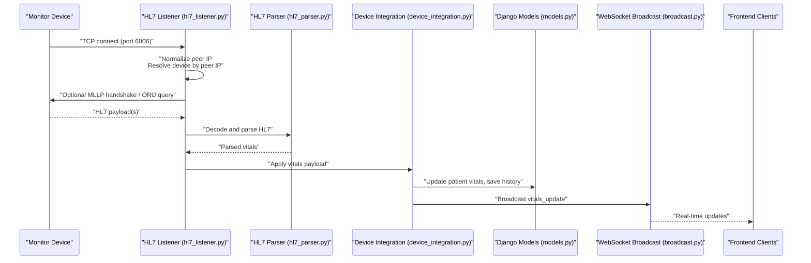

**Diagram sources**
- [hl7_listener.py:426-633](file://backend/monitoring/hl7_listener.py#L426-L633)
- [hl7_parser.py:487-530](file://backend/monitoring/hl7_parser.py#L487-L530)
- [device_integration.py:129-224](file://backend/monitoring/device_integration.py#L129-L224)
- [models.py:77-224](file://backend/monitoring/models.py#L77-L224)
- [broadcast.py:10-20](file://backend/monitoring/broadcast.py#L10-L20)

## Detailed Component Analysis

### Device Discovery and Registration
- Screen-based discovery:
  - Uses Gemini Vision to parse monitor UI images and extract HL7 configuration (server IP, local IP, port, MAC, subnet, gateway).
  - Normalizes extracted fields into a device creation payload compatible with serializers.
- Management-driven registration:
  - Creates clinic, department, room, bed, and device records atomically.
  - Handles IP conflicts and sets HL7 handshake preferences.
- REST endpoint for screen-based registration:
  - Validates image upload, parses via screen parser, normalizes payload, and creates device record.

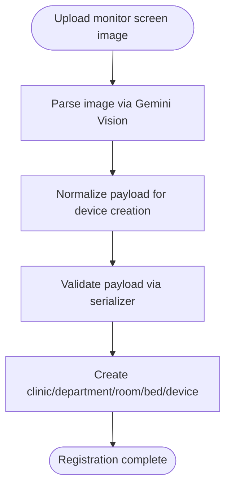

**Diagram sources**
- [screen_parse.py:58-160](file://backend/monitoring/screen_parse.py#L58-L160)
- [setup_real_hl7_monitor.py:77-224](file://backend/monitoring/management/commands/setup_real_hl7_monitor.py#L77-L224)
- [views.py:320-364](file://backend/monitoring/views.py#L320-L364)
- [serializers.py:146-284](file://backend/monitoring/serializers.py#L146-L284)

**Section sources**
- [screen_parse.py:1-160](file://backend/monitoring/screen_parse.py#L1-L160)
- [setup_real_hl7_monitor.py:1-224](file://backend/monitoring/management/commands/setup_real_hl7_monitor.py#L1-L224)
- [views.py:320-364](file://backend/monitoring/views.py#L320-L364)
- [serializers.py:146-284](file://backend/monitoring/serializers.py#L146-L284)

### Peer IP Resolution with NAT Support
- Loopback filtering prevents false device matches for probe connections.
- Peer IP resolution considers device’s configured IP address, local IP, and HL7 peer IP.
- Single-device NAT fallback enables automatic mapping when only one HL7-enabled device exists and loopback fallback is explicitly allowed.

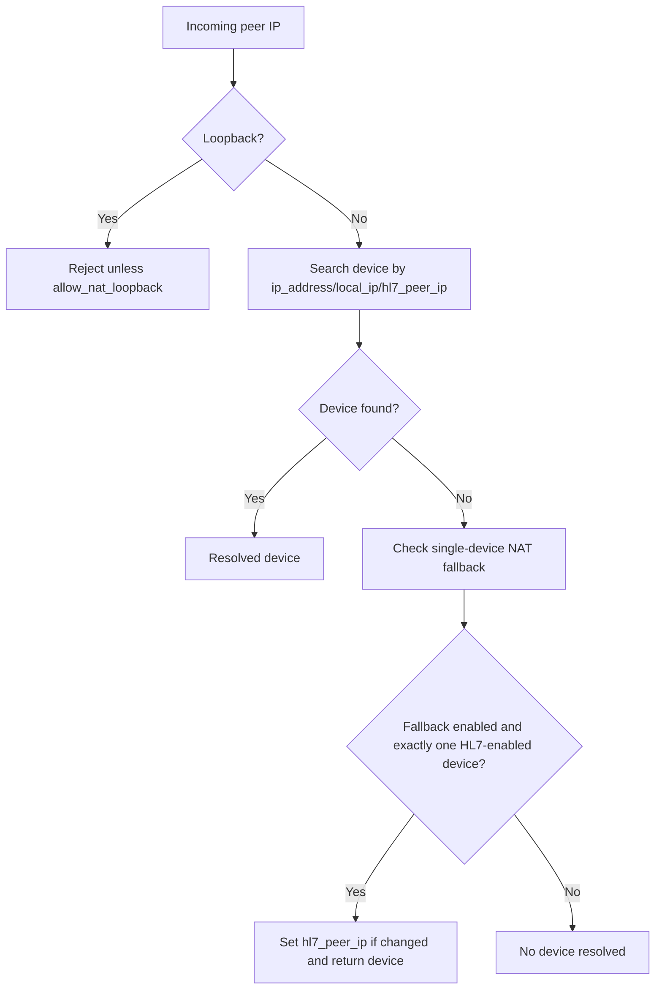

**Diagram sources**
- [device_integration.py:21-78](file://backend/monitoring/device_integration.py#L21-L78)

**Section sources**
- [device_integration.py:21-78](file://backend/monitoring/device_integration.py#L21-L78)

### HL7 MLLP Listener and Handshake Logic
- Accepts TCP connections, configures sockets, and normalizes peer IPs.
- Implements special handling for devices that send data before handshake or require explicit ORU queries.
- Sends MLLP ACK for incoming HL7 payloads and records diagnostic metrics.
- Tracks last HL7 reception timestamps per device.

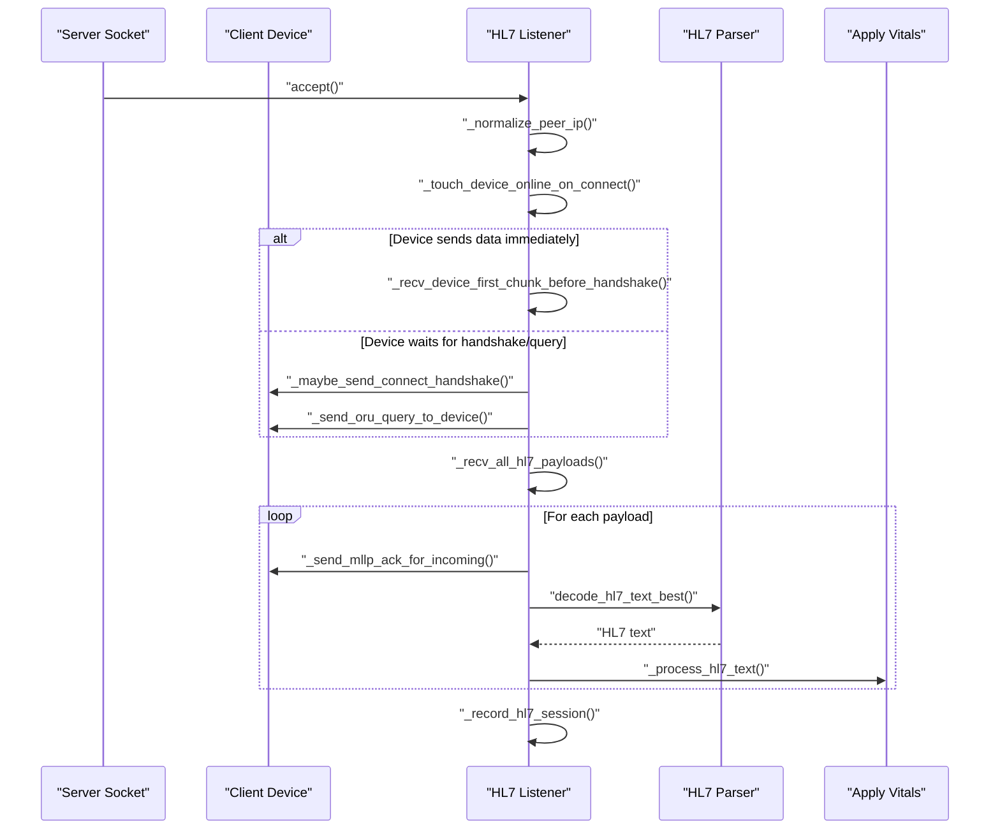

**Diagram sources**
- [hl7_listener.py:426-578](file://backend/monitoring/hl7_listener.py#L426-L578)
- [hl7_parser.py:466-530](file://backend/monitoring/hl7_parser.py#L466-L530)
- [device_integration.py:580-633](file://backend/monitoring/device_integration.py#L580-L633)

**Section sources**
- [hl7_listener.py:1-755](file://backend/monitoring/hl7_listener.py#L1-L755)
- [hl7_parser.py:1-530](file://backend/monitoring/hl7_parser.py#L1-L530)

### HL7 Parser and Vitals Extraction
- Robust decoding across UTF-8, UTF-16, CP1251, Latin-1, and GBK.
- Extracts vitals from OBX segments and fallbacks to extended segments and regex scanning.
- Heuristics classify numeric values by expected ranges and locale-specific tokens.

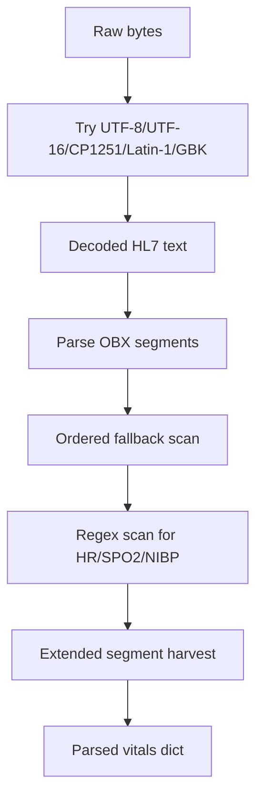

**Diagram sources**
- [hl7_parser.py:423-530](file://backend/monitoring/hl7_parser.py#L423-L530)

**Section sources**
- [hl7_parser.py:1-530](file://backend/monitoring/hl7_parser.py#L1-L530)

### Vitals Payload Application and Validation
- Marks device online and validates presence of vitals keys.
- Ensures device is mapped to a bed and patient exists for that bed.
- Applies vitals to patient model, recalculates NEWS-2 score, saves history, and prunes older history entries.
- Broadcasts vitals update scoped to clinic.

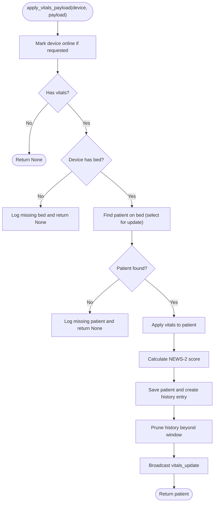

**Diagram sources**
- [device_integration.py:129-224](file://backend/monitoring/device_integration.py#L129-L224)

**Section sources**
- [device_integration.py:129-224](file://backend/monitoring/device_integration.py#L129-L224)

### Device State Management and Heartbeat Monitoring
- Device status transitions to online upon HL7 receipt or explicit REST action.
- Timestamps track last seen and last HL7 reception; connection checks compute time since last message against configurable timeout thresholds.
- Diagnostic counters capture session counts and empty sessions to aid troubleshooting.

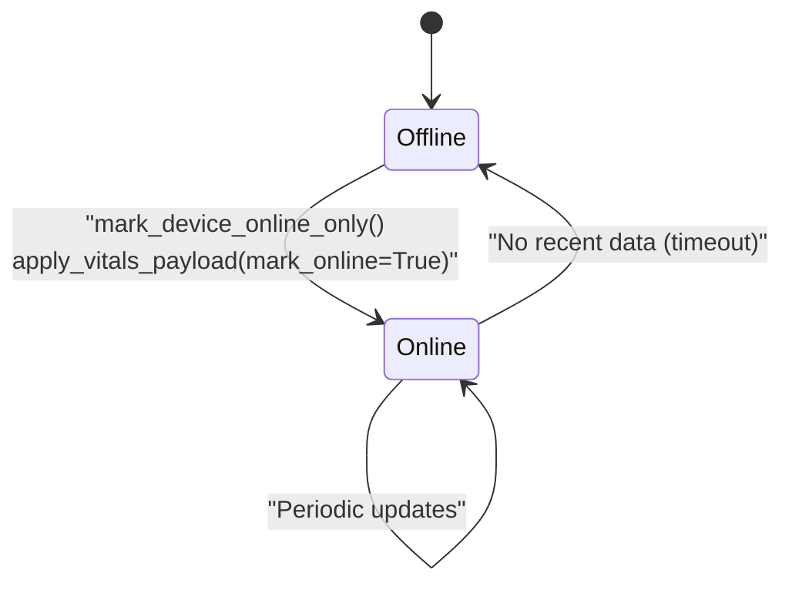

**Diagram sources**
- [device_integration.py:227-232](file://backend/monitoring/device_integration.py#L227-L232)
- [views.py:51-100](file://backend/monitoring/views.py#L51-L100)

**Section sources**
- [device_integration.py:227-232](file://backend/monitoring/device_integration.py#L227-L232)
- [views.py:51-100](file://backend/monitoring/views.py#L51-L100)

### Integration with Django Models and Patient Matching
- MonitorDevice links to Clinic, Bed, and maintains HL7-related fields and status.
- Patient aggregates vitals, alarms, scheduled checks, and history entries.
- Relationships enforce referential integrity and enable efficient queries for broadcasting and reporting.

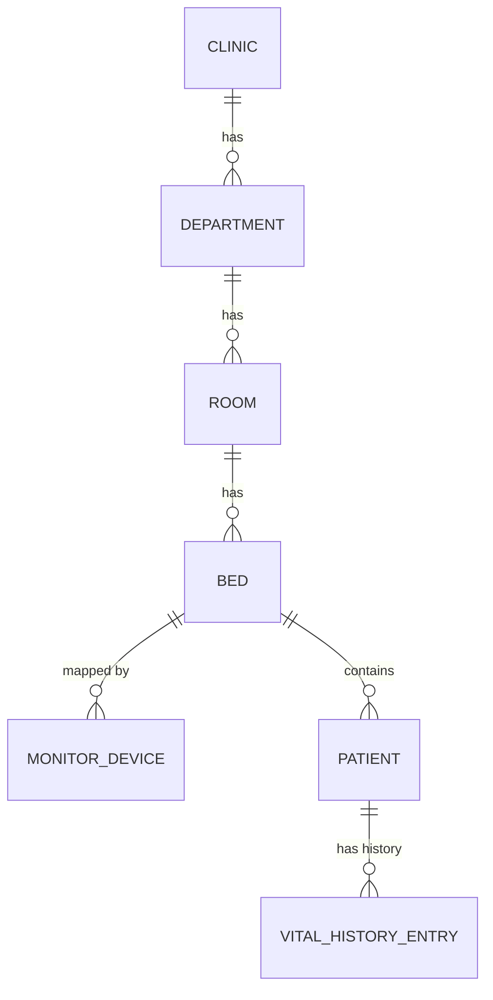

**Diagram sources**
- [models.py:5-224](file://backend/monitoring/models.py#L5-L224)

**Section sources**
- [models.py:1-224](file://backend/monitoring/models.py#L1-L224)

### REST and WebSocket Integration
- REST endpoints:
  - Device vitals ingestion via IP-based lookup.
  - Device connection check with diagnostics and hints.
  - Infrastructure status exposing HL7 listener and diagnostic info.
- WebSocket:
  - Authenticated connection per clinic groups.
  - Initial state serialization and real-time vitals updates.

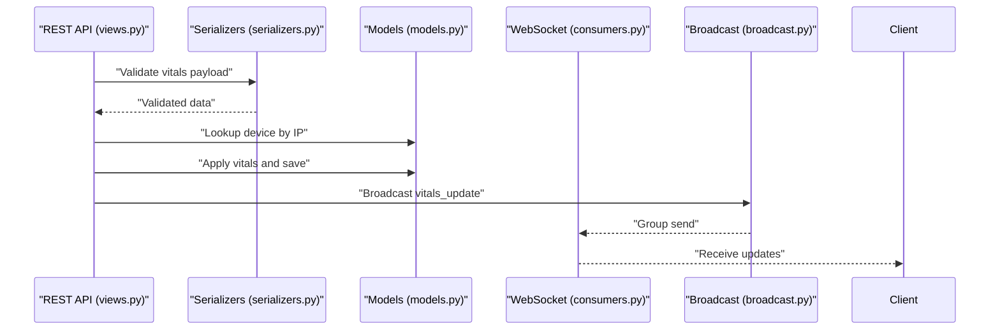

**Diagram sources**
- [views.py:429-448](file://backend/monitoring/views.py#L429-L448)
- [serializers.py:287-294](file://backend/monitoring/serializers.py#L287-L294)
- [models.py:77-224](file://backend/monitoring/models.py#L77-L224)
- [broadcast.py:10-20](file://backend/monitoring/broadcast.py#L10-L20)
- [consumers.py:12-46](file://backend/monitoring/consumers.py#L12-L46)

**Section sources**
- [views.py:1-477](file://backend/monitoring/views.py#L1-L477)
- [serializers.py:1-294](file://backend/monitoring/serializers.py#L1-L294)
- [routing.py:1-8](file://backend/monitoring/routing.py#L1-L8)
- [consumers.py:1-46](file://backend/monitoring/consumers.py#L1-L46)
- [broadcast.py:1-20](file://backend/monitoring/broadcast.py#L1-L20)

## Dependency Analysis
Key dependencies and coupling:
- HL7 listener depends on parser and device integration for processing and applying vitals.
- Device integration depends on models for persistence and broadcast for real-time updates.
- Views depend on serializers and models; they also coordinate diagnostics and status reporting.
- Screen parsing depends on external AI APIs and image libraries.

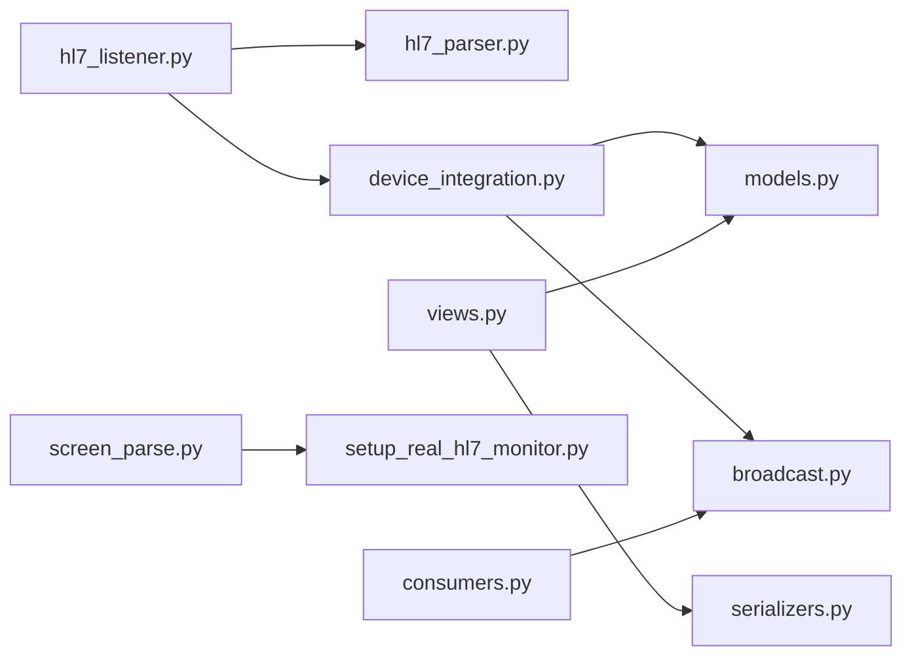

**Diagram sources**
- [hl7_listener.py:1-755](file://backend/monitoring/hl7_listener.py#L1-L755)
- [hl7_parser.py:1-530](file://backend/monitoring/hl7_parser.py#L1-L530)
- [device_integration.py:1-232](file://backend/monitoring/device_integration.py#L1-L232)
- [models.py:1-224](file://backend/monitoring/models.py#L1-L224)
- [broadcast.py:1-20](file://backend/monitoring/broadcast.py#L1-L20)
- [views.py:1-477](file://backend/monitoring/views.py#L1-L477)
- [serializers.py:1-294](file://backend/monitoring/serializers.py#L1-L294)
- [screen_parse.py:1-160](file://backend/monitoring/screen_parse.py#L1-L160)
- [setup_real_hl7_monitor.py:1-224](file://backend/monitoring/management/commands/setup_real_hl7_monitor.py#L1-L224)
- [consumers.py:1-46](file://backend/monitoring/consumers.py#L1-L46)

**Section sources**
- [hl7_listener.py:1-755](file://backend/monitoring/hl7_listener.py#L1-L755)
- [device_integration.py:1-232](file://backend/monitoring/device_integration.py#L1-L232)
- [models.py:1-224](file://backend/monitoring/models.py#L1-L224)
- [broadcast.py:1-20](file://backend/monitoring/broadcast.py#L1-L20)
- [views.py:1-477](file://backend/monitoring/views.py#L1-L477)
- [serializers.py:1-294](file://backend/monitoring/serializers.py#L1-L294)
- [screen_parse.py:1-160](file://backend/monitoring/screen_parse.py#L1-L160)
- [setup_real_hl7_monitor.py:1-224](file://backend/monitoring/management/commands/setup_real_hl7_monitor.py#L1-L224)
- [consumers.py:1-46](file://backend/monitoring/consumers.py#L1-L46)

## Performance Considerations
- Connection tuning: Nagle’s algorithm disabled and keepalive enabled reduce latency and detect dead peers promptly.
- Parsing efficiency: Early exit on first MSH detection and ordered fallback scanning minimize unnecessary work.
- History pruning: Limits stored history entries to a fixed window to control storage growth.
- Broadcasting scope: Grouped channels avoid cross-clinic traffic and reduce overhead.

[No sources needed since this section provides general guidance]

## Troubleshooting Guide
Common issues and resolutions:
- No HL7 data received:
  - Verify HL7 listener is alive and port accepts connections; check firewall rules.
  - Confirm device server IP/port and protocol match backend expectations.
- Zero-byte sessions:
  - Devices may require handshake or ORU query; adjust device settings or backend handshake preference.
- NAT and peer IP mismatches:
  - Set device hl7_peer_ip to the server-visible IP; enable single-device NAT fallback for small clinics.
- Missing bed or patient:
  - Assign bed to device and admit patient to that bed; connection check reports warnings and hints.
- Management diagnostics:
  - Use diagnostic command to inspect database, devices, patients, and HL7 listener status.

**Section sources**
- [diagnose_hl7.py:1-182](file://backend/monitoring/management/commands/diagnose_hl7.py#L1-L182)
- [hl7_listener.py:686-735](file://backend/monitoring/hl7_listener.py#L686-L735)
- [views.py:59-305](file://backend/monitoring/views.py#L59-L305)

## Conclusion
The device integration workflow integrates seamlessly with HL7 MLLP, robustly handles diverse monitor formats and NAT scenarios, enforces strong device-to-patient mapping, and delivers real-time updates via WebSocket. The provided management commands and diagnostic tools simplify onboarding, maintenance, and troubleshooting.

[No sources needed since this section summarizes without analyzing specific files]

## Appendices

### Practical Examples

- Configure a new device using screen parsing:
  - Upload monitor UI screenshot; backend extracts HL7 configuration and creates device record.
  - Reference: [screen_parse.py:58-160](file://backend/monitoring/screen_parse.py#L58-L160), [views.py:320-364](file://backend/monitoring/views.py#L320-L364)

- Configure a new device manually:
  - Use management command to set up clinic, department, room, bed, and device with optional peer IP and handshake settings.
  - Reference: [setup_real_hl7_monitor.py:77-224](file://backend/monitoring/management/commands/setup_real_hl7_monitor.py#L77-L224)

- Troubleshoot integration issues:
  - Run diagnostic command to check database, devices, patients, and HL7 listener status; follow suggested fixes.
  - Reference: [diagnose_hl7.py:22-182](file://backend/monitoring/management/commands/diagnose_hl7.py#L22-L182)

- Extend support for additional equipment:
  - Add new monitor variants by enhancing parser heuristics and ensuring HL7 segments are recognized.
  - Reference: [hl7_parser.py:1-530](file://backend/monitoring/hl7_parser.py#L1-L530)

- Device maintenance and reconnection:
  - Use REST action to mark device online; rely on connection check endpoint for status and hints.
  - Reference: [views.py:51-100](file://backend/monitoring/views.py#L51-L100)

- Data reconciliation:
  - Use periodic simulation and history pruning to maintain consistent state; prune history beyond a fixed window.
  - Reference: [simulation.py:105-137](file://backend/monitoring/simulation.py#L105-L137)