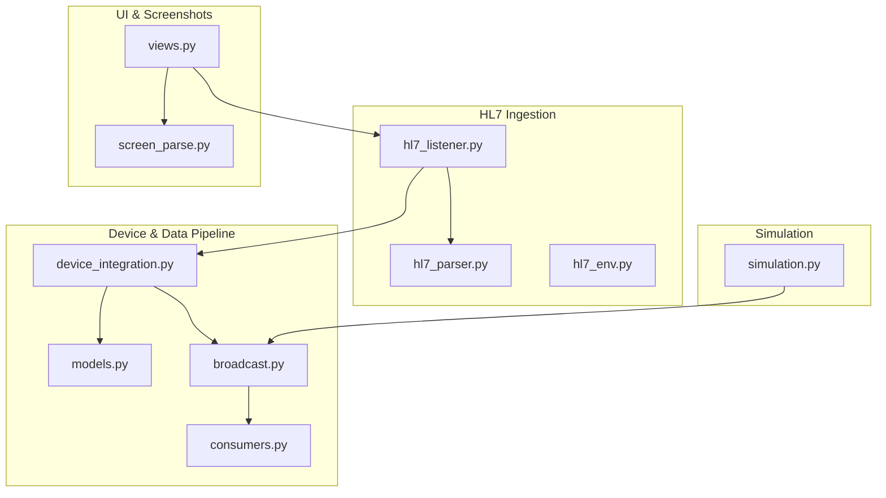
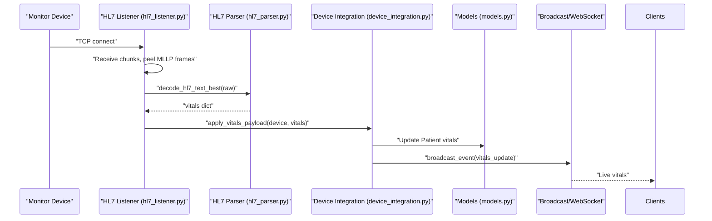
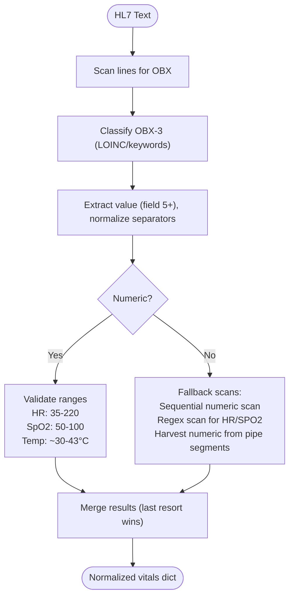
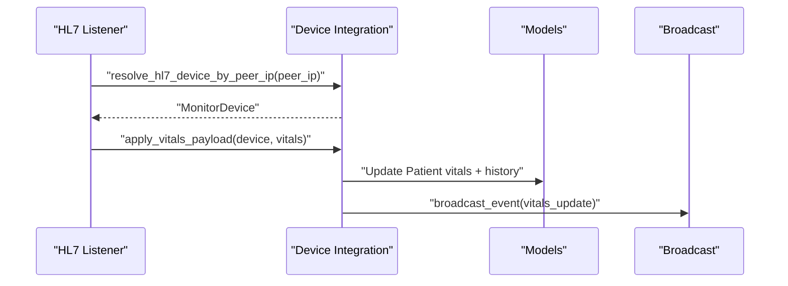
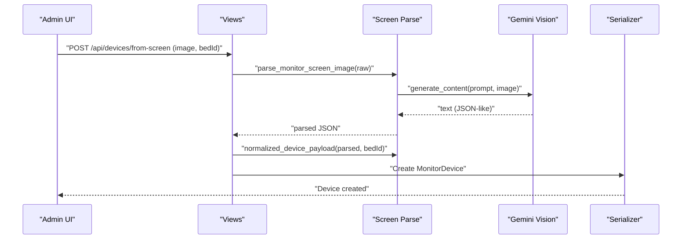
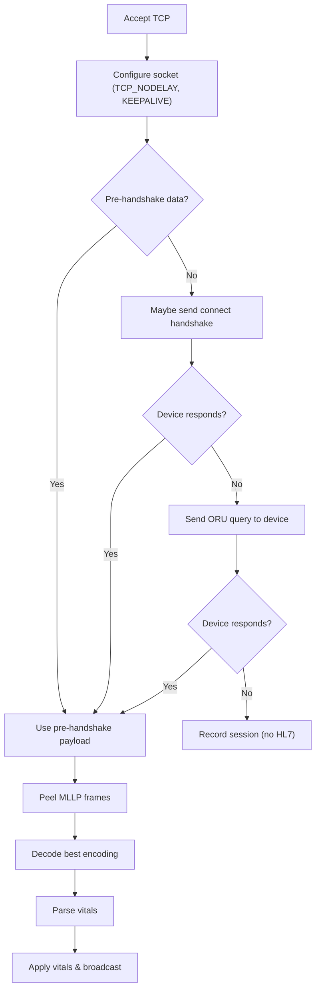
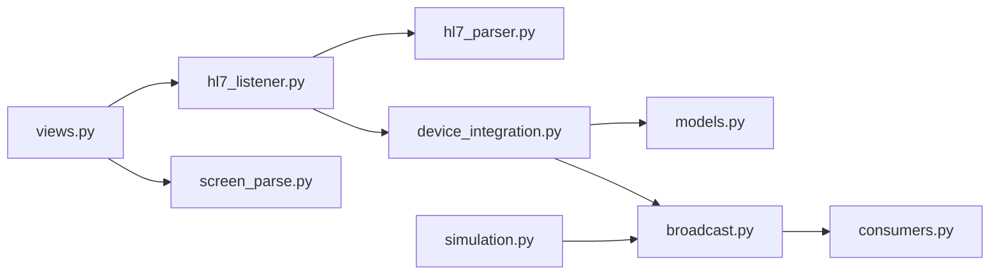

# HL7 Message Parsing System

<cite>
**Referenced Files in This Document**
- [hl7_parser.py](file://backend/monitoring/hl7_parser.py)
- [screen_parse.py](file://backend/monitoring/screen_parse.py)
- [models.py](file://backend/monitoring/models.py)
- [device_integration.py](file://backend/monitoring/device_integration.py)
- [hl7_listener.py](file://backend/monitoring/hl7_listener.py)
- [hl7_env.py](file://backend/monitoring/hl7_env.py)
- [views.py](file://backend/monitoring/views.py)
- [consumers.py](file://backend/monitoring/consumers.py)
- [broadcast.py](file://backend/monitoring/broadcast.py)
- [simulation.py](file://backend/monitoring/simulation.py)
</cite>

## Table of Contents
1. [Introduction](#introduction)
2. [Project Structure](#project-structure)
3. [Core Components](#core-components)
4. [Architecture Overview](#architecture-overview)
5. [Detailed Component Analysis](#detailed-component-analysis)
6. [Dependency Analysis](#dependency-analysis)
7. [Performance Considerations](#performance-considerations)
8. [Troubleshooting Guide](#troubleshooting-guide)
9. [Conclusion](#conclusion)
10. [Appendices](#appendices)

## Introduction
This document explains the HL7 message parsing system and screen parsing functionality used to ingest vital signs from bedside monitors. It covers:
- HL7 segment parsing (MSH, PID, PV1, OBX) and custom field extraction
- Vitals data extraction for heart rate, oxygen saturation, blood pressure, respiratory rate, and temperature
- Screen parsing system for extracting device configuration from monitor UI screenshots using Gemini Vision
- Data normalization, unit conversion, and validation rules
- Practical examples for handling different HL7 formats, device-specific variations, and error scenarios
- Performance optimization, memory management, and extensibility for new devices and formats

## Project Structure
The monitoring subsystem resides under backend/monitoring and includes:
- HL7 ingestion and parsing
- Device resolution and vitals application
- WebSocket broadcasting and UI integration
- Optional screen parsing for device configuration discovery
- Simulation utilities for testing and development

**Diagram sources**
- [hl7_listener.py:1-755](file://backend/monitoring/hl7_listener.py#L1-L755)
- [hl7_parser.py:1-530](file://backend/monitoring/hl7_parser.py#L1-L530)
- [hl7_env.py:1-33](file://backend/monitoring/hl7_env.py#L1-L33)
- [device_integration.py:1-232](file://backend/monitoring/device_integration.py#L1-L232)
- [models.py:1-224](file://backend/monitoring/models.py#L1-L224)
- [broadcast.py:1-20](file://backend/monitoring/broadcast.py#L1-L20)
- [consumers.py:1-46](file://backend/monitoring/consumers.py#L1-L46)
- [views.py:1-445](file://backend/monitoring/views.py#L1-L445)
- [screen_parse.py:1-160](file://backend/monitoring/screen_parse.py#L1-L160)
- [simulation.py:1-290](file://backend/monitoring/simulation.py#L1-L290)

**Section sources**
- [hl7_listener.py:1-755](file://backend/monitoring/hl7_listener.py#L1-L755)
- [hl7_parser.py:1-530](file://backend/monitoring/hl7_parser.py#L1-L530)
- [hl7_env.py:1-33](file://backend/monitoring/hl7_env.py#L1-L33)
- [device_integration.py:1-232](file://backend/monitoring/device_integration.py#L1-L232)
- [models.py:1-224](file://backend/monitoring/models.py#L1-L224)
- [broadcast.py:1-20](file://backend/monitoring/broadcast.py#L1-L20)
- [consumers.py:1-46](file://backend/monitoring/consumers.py#L1-L46)
- [views.py:1-445](file://backend/monitoring/views.py#L1-L445)
- [screen_parse.py:1-160](file://backend/monitoring/screen_parse.py#L1-L160)
- [simulation.py:1-290](file://backend/monitoring/simulation.py#L1-L290)

## Core Components
- HL7 Listener: Accepts TCP connections, handles MLLP framing, decodes messages, and dispatches to parser and processor.
- HL7 Parser: Extracts vitals from OBX segments and fallbacks for device-specific formats; normalizes units and validates ranges.
- Device Integration: Resolves devices by peer IP, applies vitals to patient records, and broadcasts updates.
- Screen Parse: Uses Gemini Vision to extract device network configuration from screenshots.
- Models: Define device and patient vitals data structures and constraints.
- Views and Consumers: Expose APIs and WebSocket endpoints for device diagnostics and live vitals.

**Section sources**
- [hl7_listener.py:1-755](file://backend/monitoring/hl7_listener.py#L1-L755)
- [hl7_parser.py:1-530](file://backend/monitoring/hl7_parser.py#L1-L530)
- [device_integration.py:1-232](file://backend/monitoring/device_integration.py#L1-L232)
- [models.py:77-130](file://backend/monitoring/models.py#L77-L130)
- [views.py:285-332](file://backend/monitoring/views.py#L285-L332)
- [consumers.py:1-46](file://backend/monitoring/consumers.py#L1-L46)

## Architecture Overview
The system ingests HL7 via TCP/Mllp, parses vitals, applies them to patient records, and streams updates to clients.

**Diagram sources**
- [hl7_listener.py:580-633](file://backend/monitoring/hl7_listener.py#L580-L633)
- [hl7_parser.py:487-530](file://backend/monitoring/hl7_parser.py#L487-L530)
- [device_integration.py:129-224](file://backend/monitoring/device_integration.py#L129-L224)
- [models.py:141-183](file://backend/monitoring/models.py#L141-L183)
- [broadcast.py:10-20](file://backend/monitoring/broadcast.py#L10-L20)
- [consumers.py:12-36](file://backend/monitoring/consumers.py#L12-L36)

## Detailed Component Analysis

### HL7 Segment Parsing and Vitals Extraction
Key capabilities:
- Parses OBX segments and extracts numeric values for heart rate, oxygen saturation, respiratory rate, and temperature
- Supports combined NIBP (systolic/diastolic) extraction
- Handles device-specific variations by scanning pipe-delimited fields and using regex heuristics
- Normalizes encoding and validates ranges to prevent invalid data

**Diagram sources**
- [hl7_parser.py:423-452](file://backend/monitoring/hl7_parser.py#L423-L452)
- [hl7_parser.py:148-196](file://backend/monitoring/hl7_parser.py#L148-L196)
- [hl7_parser.py:199-257](file://backend/monitoring/hl7_parser.py#L199-L257)
- [hl7_parser.py:278-339](file://backend/monitoring/hl7_parser.py#L278-L339)
- [hl7_parser.py:342-407](file://backend/monitoring/hl7_parser.py#L342-L407)

**Section sources**
- [hl7_parser.py:11-16](file://backend/monitoring/hl7_parser.py#L11-L16)
- [hl7_parser.py:19-66](file://backend/monitoring/hl7_parser.py#L19-L66)
- [hl7_parser.py:69-83](file://backend/monitoring/hl7_parser.py#L69-L83)
- [hl7_parser.py:85-93](file://backend/monitoring/hl7_parser.py#L85-L93)
- [hl7_parser.py:95-110](file://backend/monitoring/hl7_parser.py#L95-L110)
- [hl7_parser.py:113-146](file://backend/monitoring/hl7_parser.py#L113-L146)
- [hl7_parser.py:148-196](file://backend/monitoring/hl7_parser.py#L148-L196)
- [hl7_parser.py:199-257](file://backend/monitoring/hl7_parser.py#L199-L257)
- [hl7_parser.py:278-339](file://backend/monitoring/hl7_parser.py#L278-L339)
- [hl7_parser.py:342-407](file://backend/monitoring/hl7_parser.py#L342-L407)
- [hl7_parser.py:423-452](file://backend/monitoring/hl7_parser.py#L423-L452)
- [hl7_parser.py:455-463](file://backend/monitoring/hl7_parser.py#L455-L463)
- [hl7_parser.py:466-484](file://backend/monitoring/hl7_parser.py#L466-L484)
- [hl7_parser.py:487-530](file://backend/monitoring/hl7_parser.py#L487-L530)

### Data Normalization, Unit Conversion, and Validation Rules
- Encoding detection: Attempts UTF-8, UTF-16 LE/BE, CP1251, Latin-1, GBK; merges best results
- Numeric normalization: Replaces comma with dot, strips whitespace, validates numeric format
- Ranges:
  - Heart Rate: 35–220
  - Oxygen Saturation: 50–100
  - Temperature: 30.0–43.0 Celsius
  - Blood Pressure: systolic ≥ diastolic; typical ranges per fallback logic
- Heuristics:
  - When OBX-3 is missing, infers type from value magnitude and order-of-appearance
  - Regex-based extraction for HR/SPO2 keywords in various languages and layouts
  - Harvesting numeric pairs as NIBP when adjacent values satisfy BP constraints

**Section sources**
- [hl7_parser.py:85-93](file://backend/monitoring/hl7_parser.py#L85-L93)
- [hl7_parser.py:95-110](file://backend/monitoring/hl7_parser.py#L95-L110)
- [hl7_parser.py:325-330](file://backend/monitoring/hl7_parser.py#L325-L330)
- [hl7_parser.py:356-406](file://backend/monitoring/hl7_parser.py#L356-L406)
- [hl7_parser.py:466-484](file://backend/monitoring/hl7_parser.py#L466-L484)
- [hl7_parser.py:487-530](file://backend/monitoring/hl7_parser.py#L487-L530)

### Device Resolution and Vitals Application
- Resolves device by peer IP, considering IPv4-mapped IPv6, local IP, and optional NAT peer override
- Applies vitals to patient record, updates NEWS-2 risk score, and maintains a rolling history
- Broadcasts updates to WebSocket groups scoped by clinic

**Diagram sources**
- [hl7_listener.py:580-633](file://backend/monitoring/hl7_listener.py#L580-L633)
- [device_integration.py:31-78](file://backend/monitoring/device_integration.py#L31-L78)
- [device_integration.py:129-224](file://backend/monitoring/device_integration.py#L129-L224)
- [models.py:141-183](file://backend/monitoring/models.py#L141-L183)
- [broadcast.py:10-20](file://backend/monitoring/broadcast.py#L10-L20)

**Section sources**
- [device_integration.py:21-28](file://backend/monitoring/device_integration.py#L21-L28)
- [device_integration.py:31-78](file://backend/monitoring/device_integration.py#L31-L78)
- [device_integration.py:129-224](file://backend/monitoring/device_integration.py#L129-L224)
- [models.py:77-130](file://backend/monitoring/models.py#L77-L130)
- [models.py:141-183](file://backend/monitoring/models.py#L141-L183)
- [broadcast.py:10-20](file://backend/monitoring/broadcast.py#L10-L20)

### Screen Parsing for Device Configuration Discovery
- Uses Gemini Vision to extract HL7 network configuration from monitor screenshots
- Returns normalized device payload suitable for creating MonitorDevice records
- Validates JSON extraction and raises explicit errors for misconfiguration or parsing failures

**Diagram sources**
- [views.py:285-332](file://backend/monitoring/views.py#L285-L332)
- [screen_parse.py:58-114](file://backend/monitoring/screen_parse.py#L58-L114)
- [screen_parse.py:117-159](file://backend/monitoring/screen_parse.py#L117-L159)

**Section sources**
- [views.py:285-332](file://backend/monitoring/views.py#L285-L332)
- [screen_parse.py:16-32](file://backend/monitoring/screen_parse.py#L16-L32)
- [screen_parse.py:35-55](file://backend/monitoring/screen_parse.py#L35-L55)
- [screen_parse.py:58-114](file://backend/monitoring/screen_parse.py#L58-L114)
- [screen_parse.py:117-159](file://backend/monitoring/screen_parse.py#L117-L159)

### HL7 Listener and Diagnostics
- Accepts TCP connections, supports MLLP framing, and handles device-specific quirks (e.g., sending data before handshake)
- Sends ACK for incoming messages and optionally sends ORU queries to trigger device responses
- Provides diagnostic summaries and environment-controlled logging for troubleshooting

**Diagram sources**
- [hl7_listener.py:426-578](file://backend/monitoring/hl7_listener.py#L426-L578)
- [hl7_listener.py:580-633](file://backend/monitoring/hl7_listener.py#L580-L633)
- [hl7_env.py:18-32](file://backend/monitoring/hl7_env.py#L18-L32)

**Section sources**
- [hl7_listener.py:1-755](file://backend/monitoring/hl7_listener.py#L1-L755)
- [hl7_env.py:1-33](file://backend/monitoring/hl7_env.py#L1-L33)

## Dependency Analysis
- hl7_listener depends on hl7_parser for decoding and parsing, and device_integration for device resolution and vitals application
- device_integration depends on models for patient/device persistence and broadcast for real-time updates
- views integrates screen_parse for device provisioning and exposes diagnostics and vitals ingestion endpoints
- consumers and broadcast coordinate WebSocket updates

**Diagram sources**
- [hl7_listener.py:1-755](file://backend/monitoring/hl7_listener.py#L1-L755)
- [hl7_parser.py:1-530](file://backend/monitoring/hl7_parser.py#L1-L530)
- [device_integration.py:1-232](file://backend/monitoring/device_integration.py#L1-L232)
- [models.py:1-224](file://backend/monitoring/models.py#L1-L224)
- [broadcast.py:1-20](file://backend/monitoring/broadcast.py#L1-L20)
- [consumers.py:1-46](file://backend/monitoring/consumers.py#L1-L46)
- [views.py:1-445](file://backend/monitoring/views.py#L1-L445)
- [screen_parse.py:1-160](file://backend/monitoring/screen_parse.py#L1-L160)
- [simulation.py:1-290](file://backend/monitoring/simulation.py#L1-L290)

**Section sources**
- [hl7_listener.py:1-755](file://backend/monitoring/hl7_listener.py#L1-L755)
- [hl7_parser.py:1-530](file://backend/monitoring/hl7_parser.py#L1-L530)
- [device_integration.py:1-232](file://backend/monitoring/device_integration.py#L1-L232)
- [models.py:1-224](file://backend/monitoring/models.py#L1-L224)
- [broadcast.py:1-20](file://backend/monitoring/broadcast.py#L1-L20)
- [consumers.py:1-46](file://backend/monitoring/consumers.py#L1-L46)
- [views.py:1-445](file://backend/monitoring/views.py#L1-L445)
- [screen_parse.py:1-160](file://backend/monitoring/screen_parse.py#L1-L160)
- [simulation.py:1-290](file://backend/monitoring/simulation.py#L1-L290)

## Performance Considerations
- Memory management
  - Streaming receive loops avoid buffering entire messages; MLLP frames are peeled incrementally
  - History pruning keeps only recent entries to limit storage growth
- Decoding robustness
  - Multiple encoding attempts reduce retries and improve throughput
- Threading and concurrency
  - Listener runs per-connection threads; ensure proper resource cleanup and timeouts
- Network tuning
  - TCP_NODELAY and SO_KEEPALIVE reduce latency and detect dead peers
- Extensibility
  - Parser functions are modular; new device patterns can be added with minimal coupling
  - Environment flags enable selective logging and behavior toggles

[No sources needed since this section provides general guidance]

## Troubleshooting Guide
Common scenarios and resolutions:
- Zero-byte sessions or no HL7 detected
  - Verify monitor’s HL7/MLLP settings and firewall rules
  - Confirm server port binding and thread status
  - Use diagnostics endpoint to inspect last raw bytes and session counts
- K12 zero-byte issue
  - Ensure monitor menu enables ORU and sensor leads; trigger ORU query if needed
- Handshake and timing issues
  - Adjust pre-handshake receive window and connect handshake flags
- Device not resolved
  - Ensure device registration with correct IP, local IP, and bed assignment
- Screen parsing failures
  - Check Gemini API key and image quality; ensure prompt compliance

**Section sources**
- [views.py:59-282](file://backend/monitoring/views.py#L59-L282)
- [hl7_listener.py:520-541](file://backend/monitoring/hl7_listener.py#L520-L541)
- [hl7_env.py:18-32](file://backend/monitoring/hl7_env.py#L18-L32)
- [screen_parse.py:62-66](file://backend/monitoring/screen_parse.py#L62-L66)
- [screen_parse.py:80-84](file://backend/monitoring/screen_parse.py#L80-L84)

## Conclusion
The system provides robust HL7 ingestion with extensive fallbacks for diverse monitor formats, safe normalization and validation of vitals, and a flexible pipeline for applying data to patient records and broadcasting updates. Screen parsing simplifies device onboarding by extracting network configuration from UI screenshots. The modular design supports incremental enhancements for new devices and formats.

[No sources needed since this section summarizes without analyzing specific files]

## Appendices

### Practical Examples

- Handling different HL7 message formats
  - Mixed encoding: The parser tries UTF-8, UTF-16 LE/BE, CP1251, Latin-1, and merges best results
  - Device-specific fields: The parser scans pipe segments and uses regex to locate vitals even when OBX-3 is missing
  - Example path references:
    - [parse_hl7_vitals_best:487-530](file://backend/monitoring/hl7_parser.py#L487-L530)
    - [decode_hl7_text_best:466-484](file://backend/monitoring/hl7_parser.py#L466-L484)
    - [parse_hl7_vitals:423-452](file://backend/monitoring/hl7_parser.py#L423-L452)

- Extracting vitals from device display screens
  - Upload a screenshot and receive normalized device configuration for provisioning
  - Example path references:
    - [device_from_screen:285-332](file://backend/monitoring/views.py#L285-L332)
    - [parse_monitor_screen_image:58-114](file://backend/monitoring/screen_parse.py#L58-L114)
    - [normalized_device_payload:117-159](file://backend/monitoring/screen_parse.py#L117-L159)

- Applying vitals and broadcasting updates
  - Device resolution by peer IP, vitals application, and WebSocket broadcast
  - Example path references:
    - [resolve_hl7_device_by_peer_ip:31-78](file://backend/monitoring/device_integration.py#L31-L78)
    - [apply_vitals_payload:129-224](file://backend/monitoring/device_integration.py#L129-L224)
    - [broadcast_event:10-20](file://backend/monitoring/broadcast.py#L10-L20)

- Validation and normalization rules
  - Numeric normalization, range checks, and heuristic inference
  - Example path references:
    - [_parse_float:85-93](file://backend/monitoring/hl7_parser.py#L85-L93)
    - [_heuristic_kind_from_value:95-110](file://backend/monitoring/hl7_parser.py#L95-L110)
    - [Range validations:325-330](file://backend/monitoring/hl7_parser.py#L325-L330)

- Extensibility for new devices and formats
  - Add new classification tokens, regex patterns, or fallback scanners without changing core logic
  - Example path references:
    - [_classify_obx3:29-66](file://backend/monitoring/hl7_parser.py#L29-L66)
    - [_fallback_regex_scan:342-407](file://backend/monitoring/hl7_parser.py#L342-L407)
    - [_harvest_obx_numeric_scan:278-339](file://backend/monitoring/hl7_parser.py#L278-L339)