# HL7 TCP Server Tools

<cite>
**Referenced Files in This Document**
- [README.md](file://README.md)
- [tools/hl7-tcp-server/README.md](file://tools/hl7-tcp-server/README.md)
- [tools/hl7-tcp-server/package.json](file://tools/hl7-tcp-server/package.json)
- [tools/hl7-tcp-server/server.js](file://tools/hl7-tcp-server/server.js)
- [backend/monitoring/hl7_listener.py](file://backend/monitoring/hl7_listener.py)
- [backend/monitoring/hl7_parser.py](file://backend/monitoring/hl7_parser.py)
- [backend/monitoring/models.py](file://backend/monitoring/models.py)
- [backend/monitoring/consumers.py](file://backend/monitoring/consumers.py)
- [backend/medicentral/settings.py](file://backend/medicentral/settings.py)
- [backend/medicentral/urls.py](file://backend/medicentral/urls.py)
</cite>

## Table of Contents
1. [Introduction](#introduction)
2. [System Architecture](#system-architecture)
3. [HL7 TCP Bridge Server](#hl7-tcp-bridge-server)
4. [Django HL7 Listener](#django-hl7-listener)
5. [HL7 Parser Implementation](#hl7-parser-implementation)
6. [Data Models](#data-models)
7. [WebSocket Integration](#websocket-integration)
8. [Configuration and Environment](#configuration-and-environment)
9. [Deployment Architecture](#deployment-architecture)
10. [Troubleshooting Guide](#troubleshooting-guide)
11. [Conclusion](#conclusion)

## Introduction

The HL7 TCP Server Tools is a comprehensive medical device monitoring system designed to capture vital signs data from bedside monitors and transmit them to a central healthcare monitoring platform. This system consists of two primary components: a lightweight Node.js bridge server that processes HL7/MLLP messages and a robust Django-based listener that handles the complete medical monitoring workflow.

The system addresses the critical need for reliable medical device connectivity in healthcare environments, where bedside monitors continuously transmit patient vital signs data in HL7 (Health Level Seven) format. The tools provide both a standalone bridge solution for environments requiring direct TCP-to-API bridging and a full Django-powered monitoring system for enterprise healthcare deployments.

## System Architecture

The HL7 TCP Server Tools implements a distributed architecture with multiple deployment options, allowing flexibility for different healthcare facility requirements and infrastructure constraints.

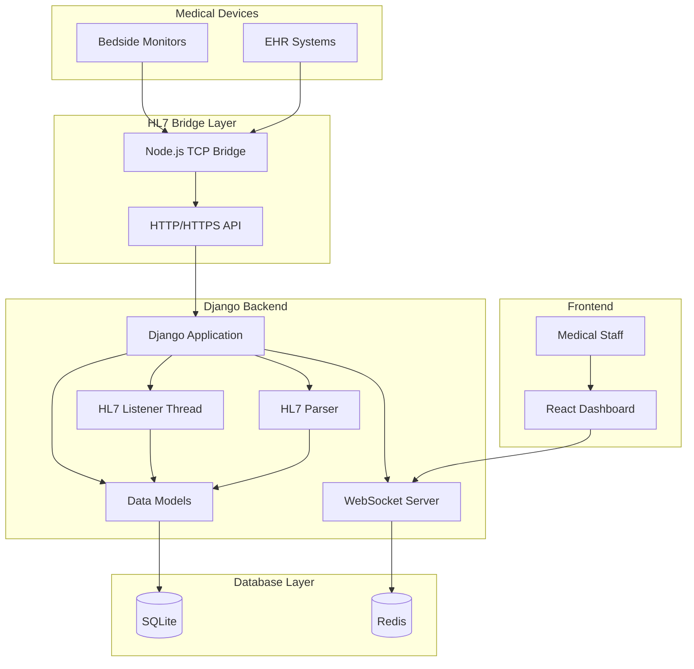

**Diagram sources**
- [tools/hl7-tcp-server/server.js:1-320](file://tools/hl7-tcp-server/server.js#L1-L320)
- [backend/monitoring/hl7_listener.py:1-756](file://backend/monitoring/hl7_listener.py#L1-L756)
- [backend/monitoring/hl7_parser.py:1-530](file://backend/monitoring/hl7_parser.py#L1-L530)

The architecture supports two operational modes:

1. **Bridge Mode**: Direct TCP-to-HTTP bridging using the Node.js server
2. **Full Django Mode**: Complete medical monitoring system with database persistence and real-time dashboards

## HL7 TCP Bridge Server

The Node.js TCP bridge server serves as a lightweight intermediary that accepts HL7/MLLP connections on TCP port 6006 and forwards processed vital signs data to the Django backend via HTTP POST requests.

### Core Functionality

The bridge server implements comprehensive HL7 message processing with support for multiple message formats and encoding standards:

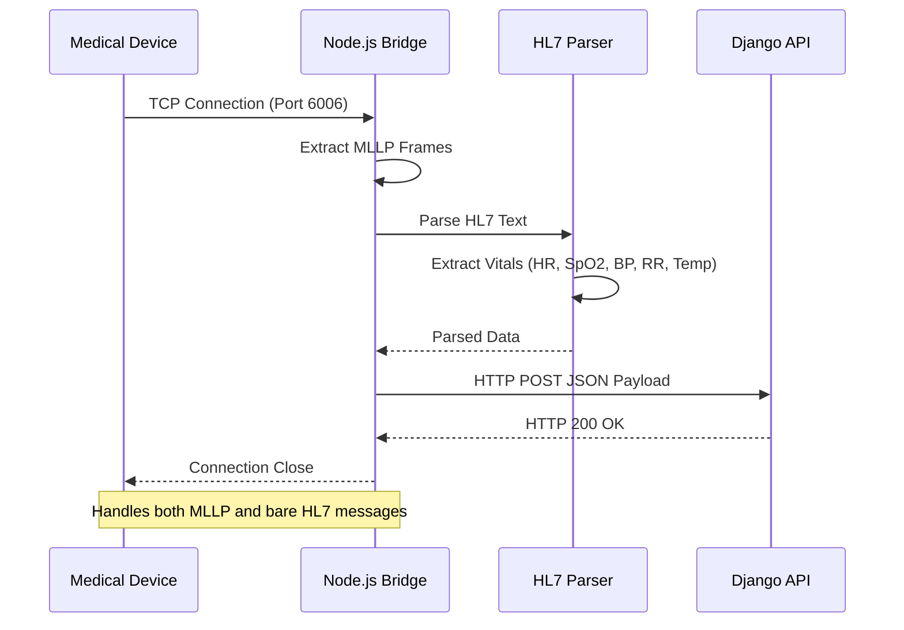

**Diagram sources**
- [tools/hl7-tcp-server/server.js:237-256](file://tools/hl7-tcp-server/server.js#L237-L256)
- [tools/hl7-tcp-server/server.js:202-235](file://tools/hl7-tcp-server/server.js#L202-L235)

### Message Processing Pipeline

The bridge server processes HL7 messages through a sophisticated pipeline that handles various message formats and encoding scenarios:

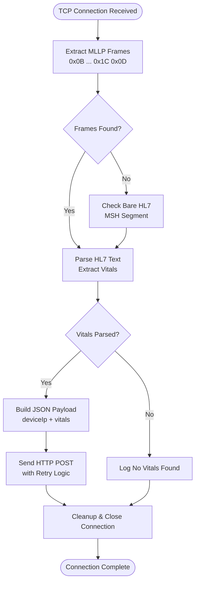

**Diagram sources**
- [tools/hl7-tcp-server/server.js:152-179](file://tools/hl7-tcp-server/server.js#L152-L179)
- [tools/hl7-tcp-server/server.js:89-145](file://tools/hl7-tcp-server/server.js#L89-L145)

### Configuration Options

The bridge server supports extensive configuration through environment variables:

| Environment Variable | Default Value | Description |
|---------------------|---------------|-------------|
| `HL7_TCP_PORT` | `6006` | TCP port for HL7 message reception |
| `HL7_HTTP_URL` | `http://127.0.0.1:8012/api/hl7` | Backend API endpoint URL |
| `HL7_DEVICE_IP` | `192.168.0.228` | Device IP address for database matching |
| `HL7_BRIDGE_TOKEN` | `(empty)` | Authentication token for API requests |
| `HL7_NO_DATA_MS` | `10000` | Timeout for initial data reception |
| `HL7_HTTP_RETRY_MAX` | `8` | Maximum HTTP request retry attempts |

**Section sources**
- [tools/hl7-tcp-server/README.md:14-24](file://tools/hl7-tcp-server/README.md#L14-L24)
- [tools/hl7-tcp-server/server.js:22-27](file://tools/hl7-tcp-server/server.js#L22-L27)

## Django HL7 Listener

The Django-based HL7 listener provides a comprehensive medical monitoring solution with advanced message processing, device management, and real-time data streaming capabilities.

### Multi-Protocol Support

The listener handles various HL7 message formats and transmission protocols:

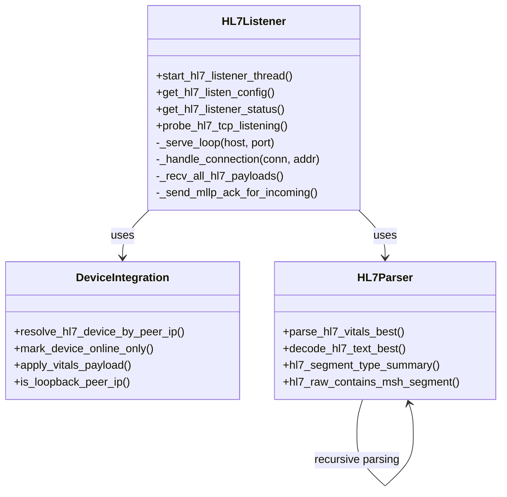

**Diagram sources**
- [backend/monitoring/hl7_listener.py:426-579](file://backend/monitoring/hl7_listener.py#L426-L579)
- [backend/monitoring/hl7_parser.py:487-529](file://backend/monitoring/hl7_parser.py#L487-L529)

### Advanced Message Processing

The listener implements sophisticated message processing logic to handle diverse medical device communication patterns:

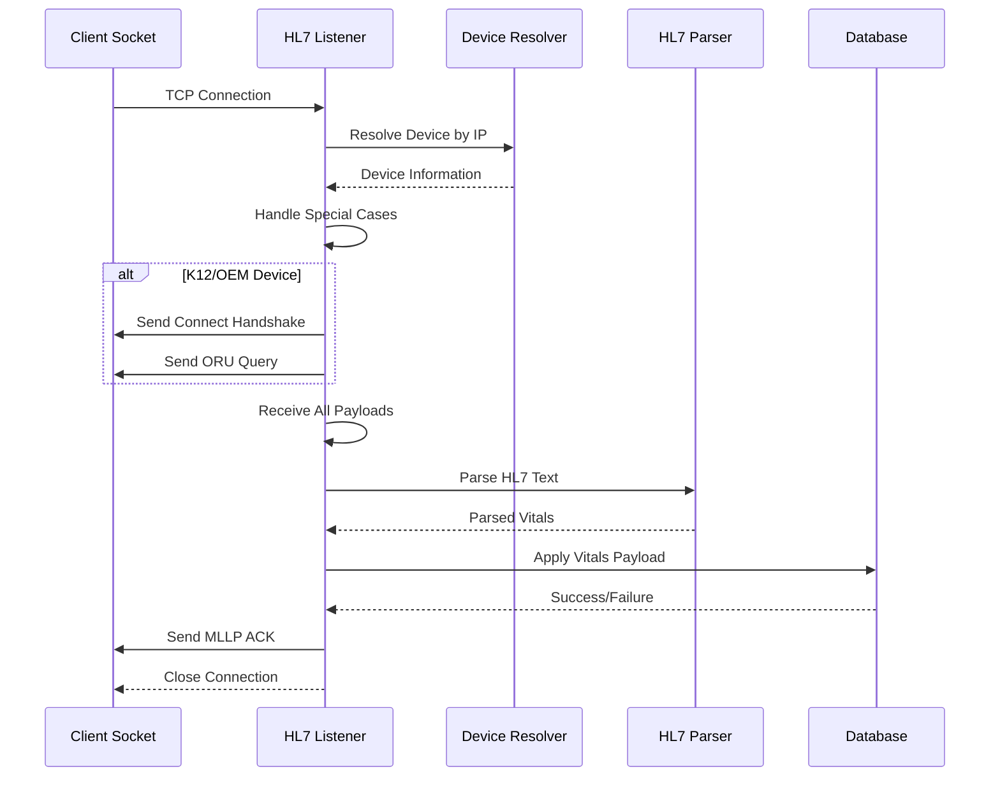

**Diagram sources**
- [backend/monitoring/hl7_listener.py:426-507](file://backend/monitoring/hl7_listener.py#L426-L507)
- [backend/monitoring/hl7_parser.py:581-634](file://backend/monitoring/hl7_parser.py#L581-L634)

### Device Management Integration

The listener seamlessly integrates with the device management system to track medical equipment and associate vital signs with specific patients:

**Section sources**
- [backend/monitoring/hl7_listener.py:1-756](file://backend/monitoring/hl7_listener.py#L1-L756)

## HL7 Parser Implementation

The HL7 parser implements a multi-layered approach to extract vital signs data from HL7 messages, supporting various encoding formats and device-specific message variations.

### Parsing Strategy

The parser employs a hierarchical approach with multiple fallback mechanisms:

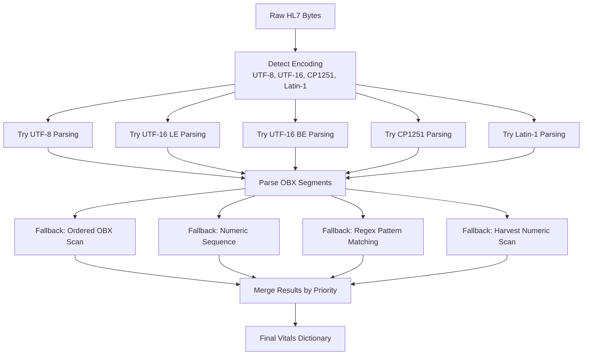

**Diagram sources**
- [backend/monitoring/hl7_parser.py:423-452](file://backend/monitoring/hl7_parser.py#L423-L452)
- [backend/monitoring/hl7_parser.py:487-529](file://backend/monitoring/hl7_parser.py#L487-L529)

### Vitals Extraction Logic

The parser implements sophisticated logic for extracting different types of vital signs:

| Vital Sign | Extraction Method | Valid Range | Notes |
|------------|-------------------|-------------|-------|
| Heart Rate (HR) | LOINC 8867-4, MDC MDC_MODALITY_CARDIAC | 35-220 bpm | Primary LOINC identifier |
| Oxygen Saturation (SpO2) | LOINC 2708-6, MDC MDC_MODALITY_OXIMETER | 50-100% | Multiple extraction methods |
| Temperature | LOINC 8310-5, MDC MDC_MODALITY_TEMPERATURE | 30.0-43.0°C | Rounded to 0.1°C |
| Respiratory Rate (RR) | LOINC 9279-1, MDC MDC_MODALITY_RESP | 1-100 rpm | Direct numeric extraction |
| Blood Pressure | NIBP Combined | Sys/Dia pairs | Extracted as combined values |

**Section sources**
- [backend/monitoring/hl7_parser.py:1-530](file://backend/monitoring/hl7_parser.py#L1-L530)

## Data Models

The system utilizes a comprehensive data model hierarchy to represent healthcare facility structure, medical devices, patients, and clinical data.

### Entity Relationship Model

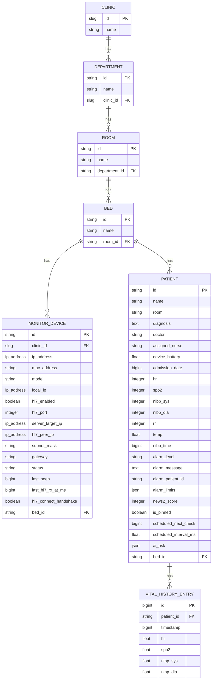

**Diagram sources**
- [backend/monitoring/models.py:5-224](file://backend/monitoring/models.py#L5-L224)

### Device Discovery and Resolution

The system implements intelligent device discovery and resolution mechanisms:

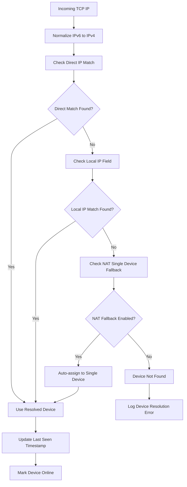

**Diagram sources**
- [backend/monitoring/hl7_listener.py:426-448](file://backend/monitoring/hl7_listener.py#L426-L448)

**Section sources**
- [backend/monitoring/models.py:77-140](file://backend/monitoring/models.py#L77-L140)

## WebSocket Integration

The system provides real-time data streaming through WebSocket connections, enabling live updates to the web-based monitoring dashboard.

### WebSocket Consumer Architecture

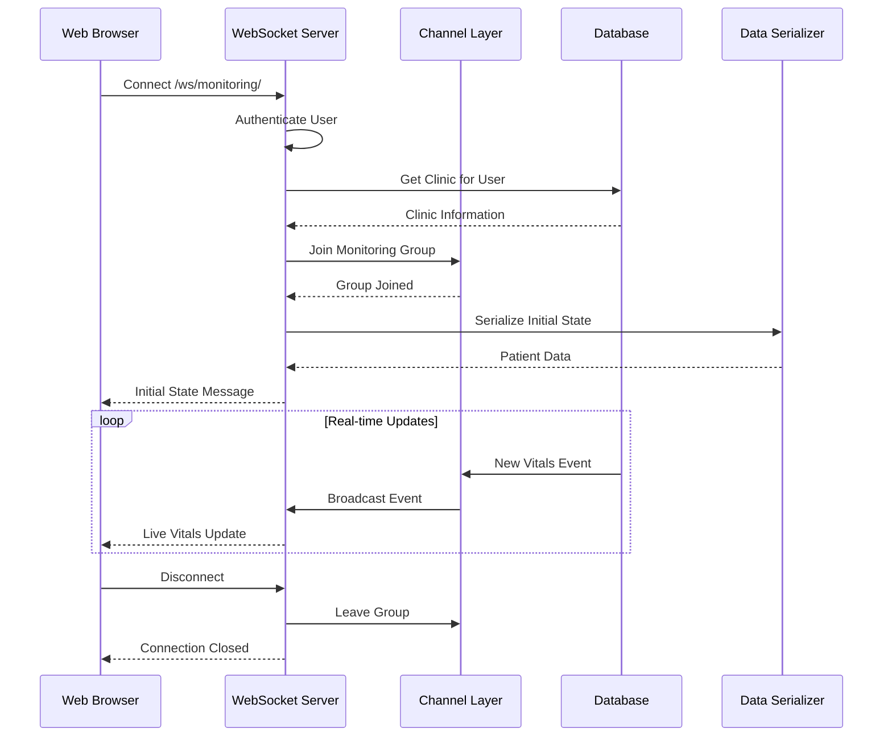

**Diagram sources**
- [backend/monitoring/consumers.py:12-46](file://backend/monitoring/consumers.py#L12-L46)

### Authentication and Authorization

The WebSocket implementation ensures secure access through Django's authentication system:

| Authentication Method | Implementation | Security Features |
|----------------------|----------------|-------------------|
| Session Authentication | Django session middleware | CSRF protection, session validation |
| Anonymous Access | Explicit rejection | HTTP 4001/4002 error codes |
| Clinic Scoping | User profile association | Multi-tenant isolation |
| Group Permissions | Channel layer groups | Real-time data partitioning |

**Section sources**
- [backend/monitoring/consumers.py:1-46](file://backend/monitoring/consumers.py#L1-L46)

## Configuration and Environment

The system supports extensive configuration through environment variables, enabling deployment flexibility across different healthcare environments.

### Django Application Configuration

The Django application requires minimal configuration for basic operation:

| Setting | Required | Default | Purpose |
|---------|----------|---------|---------|
| `DJANGO_SECRET_KEY` | Yes (production) | Development fallback | Django secret key |
| `DJANGO_ALLOWED_HOSTS` | Yes | `*` | Allowed hosts for security |
| `CORS_ALLOWED_ORIGINS` | Yes (production) | Not set | Cross-origin resource sharing |
| `DATABASE_URL` | No | `db.sqlite3` | Database connection string |
| `REDIS_URL` | No | Not set | WebSocket channel layer |

### HL7 Listener Configuration

The HL7 listener supports numerous operational parameters:

| Environment Variable | Default | Purpose |
|---------------------|---------|---------|
| `HL7_LISTEN_ENABLED` | `true` | Enable/disable listener thread |
| `HL7_LISTEN_HOST` | `0.0.0.0` | Host binding address |
| `HL7_LISTEN_PORT` | `6006` | TCP port for HL7 messages |
| `HL7_SEND_ACK` | `true` | Enable/disable MLLP ACK sending |
| `HL7_SEND_CONNECT_HANDSHAKE` | `false` | Enable device handshake |
| `HL7_RECV_BEFORE_HANDSHAKE_MS` | `300` | Pre-handshake receive timeout |
| `HL7_RECV_TIMEOUT_SEC` | `0` | General receive timeout |

**Section sources**
- [backend/medicentral/settings.py:14-218](file://backend/medicentral/settings.py#L14-L218)
- [backend/monitoring/hl7_listener.py:693-703](file://backend/monitoring/hl7_listener.py#L693-L703)

## Deployment Architecture

The system supports multiple deployment architectures, from single-instance installations to distributed cloud deployments.

### Single-Instance Deployment

For small healthcare facilities or development environments:

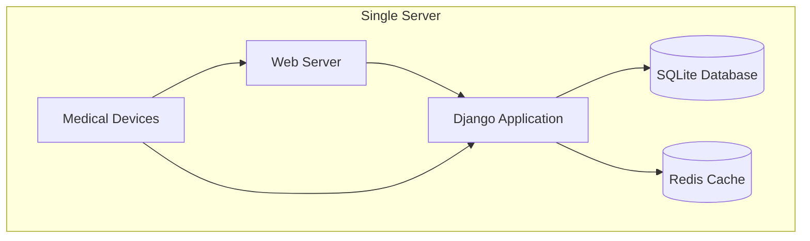

### Distributed Deployment

For enterprise healthcare systems with multiple facilities:

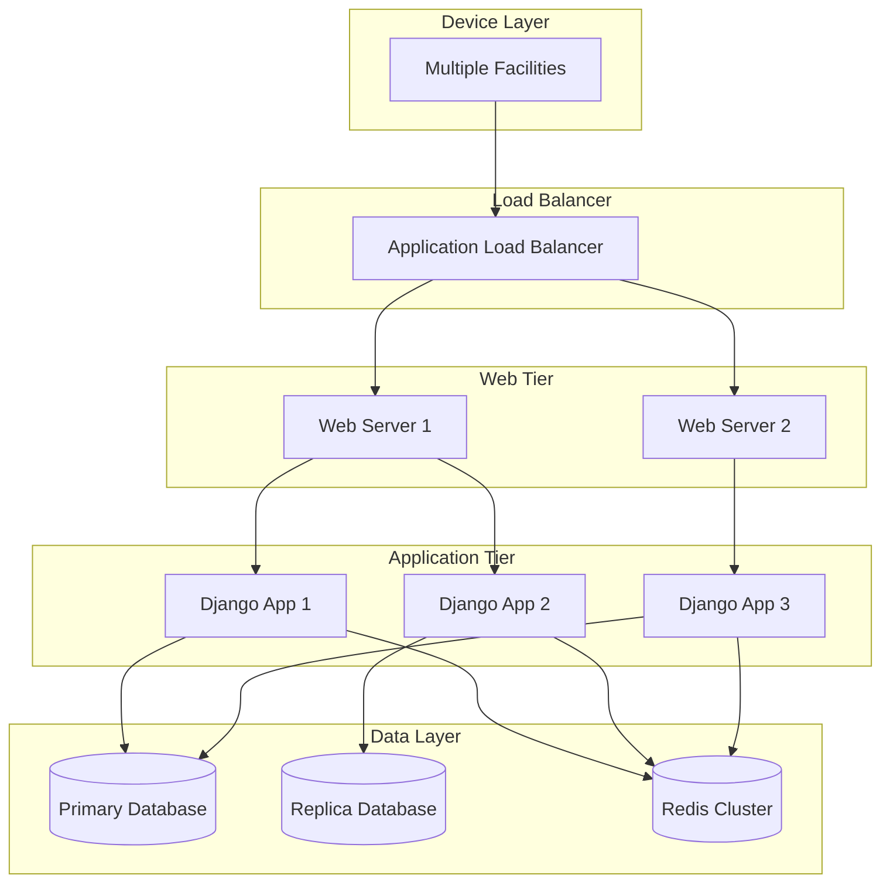

### Containerized Deployment

The system supports containerized deployment using Docker and Kubernetes:

| Component | Container Image | Purpose |
|-----------|----------------|---------|
| Backend API | Custom Django image | HL7 processing and API services |
| Frontend | Nginx static files | React dashboard and assets |
| Database | PostgreSQL | Persistent data storage |
| Cache | Redis | WebSocket and session caching |
| Reverse Proxy | Nginx | SSL termination and load balancing |

**Section sources**
- [README.md:69-87](file://README.md#L69-L87)

## Troubleshooting Guide

### Common Issues and Solutions

#### HL7 Message Processing Failures

**Issue**: No HL7 messages being processed despite device connectivity
**Symptoms**: Empty sessions logged, zero byte receptions
**Causes and Solutions**:
- Device not configured for HL7/MLLP transmission
- Incorrect server IP/port configuration on device
- Network firewall blocking TCP 6006 traffic
- Device requires handshake before sending data

**Diagnostic Commands**:
```bash
# Check if port is listening
netstat -an | grep 6006

# Test TCP connectivity
telnet device_ip 6006

# Verify device configuration
curl -X GET http://localhost:8000/api/devices/
```

#### Parser Recognition Issues

**Issue**: Vitals extracted but not recognized by system
**Symptoms**: Parser logs show extracted values but no database updates
**Causes and Solutions**:
- Device uses non-standard LOINC codes
- Values outside expected ranges
- Missing patient assignment to bed/device
- Database connection issues

**Diagnostic Steps**:
1. Enable raw TCP logging for device
2. Check device IP resolution in database
3. Verify patient bed assignment
4. Review parser debug logs

#### WebSocket Connection Problems

**Issue**: Dashboard not receiving real-time updates
**Symptoms**: Static data, connection drops, authentication failures
**Causes and Solutions**:
- Redis service not running
- Incorrect WebSocket URL configuration
- User authentication issues
- Network connectivity problems

**Debug Commands**:
```bash
# Check Redis connectivity
redis-cli ping

# Verify WebSocket endpoint
curl -i -N -H "Connection: Upgrade" -H "Upgrade: websocket" \
  -H "Host: localhost:8000" -H "Origin: http://localhost:8000" \
  "http://localhost:8000/ws/monitoring/"
```

#### Performance and Scalability Issues

**Issue**: High latency or dropped connections under load
**Symptoms**: Slow response times, connection timeouts, memory leaks
**Solutions**:
- Scale Redis cluster for WebSocket support
- Implement connection pooling
- Optimize database queries
- Add horizontal scaling with multiple Django instances

**Section sources**
- [backend/monitoring/hl7_listener.py:514-542](file://backend/monitoring/hl7_listener.py#L514-L542)
- [backend/monitoring/hl7_parser.py:517-529](file://backend/monitoring/hl7_parser.py#L517-L529)

## Conclusion

The HL7 TCP Server Tools provide a robust, flexible solution for medical device monitoring in healthcare environments. The system's dual-mode architecture accommodates diverse deployment scenarios, from simple bridge configurations to comprehensive enterprise monitoring platforms.

Key strengths of the system include:

- **Multi-format Support**: Comprehensive HL7 message processing with fallback mechanisms
- **Flexible Deployment**: Both standalone bridge and full Django applications
- **Real-time Capabilities**: WebSocket-based live data streaming
- **Scalable Architecture**: Support for distributed deployments and load balancing
- **Comprehensive Device Management**: Full lifecycle tracking of medical equipment
- **Robust Error Handling**: Extensive diagnostic logging and recovery mechanisms

The system addresses critical healthcare IT needs while maintaining security, reliability, and ease of deployment across various facility sizes and technical requirements. Its modular design enables gradual adoption and integration with existing healthcare infrastructure.

Future enhancements could include expanded device protocol support, advanced analytics capabilities, and enhanced integration with electronic health record systems. The solid architectural foundation provides a strong base for continued evolution and improvement.