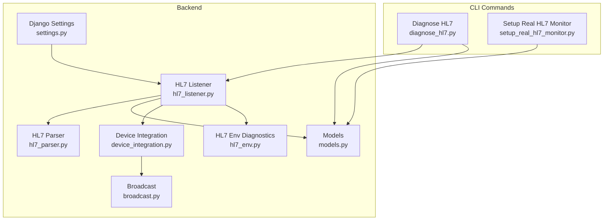
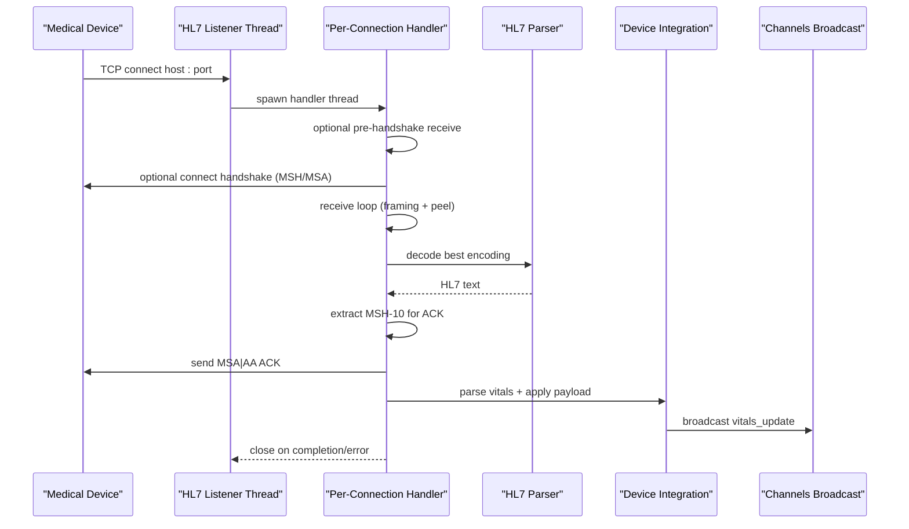
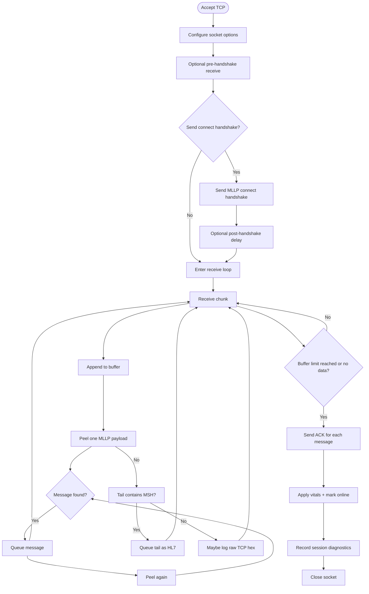
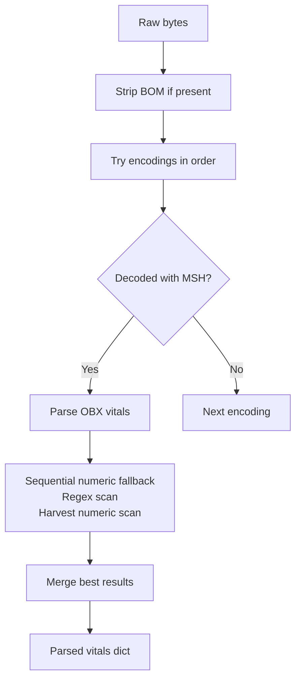
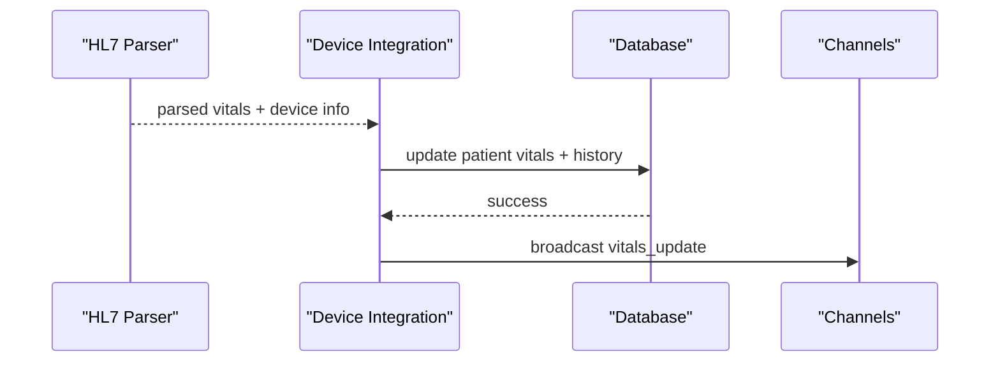
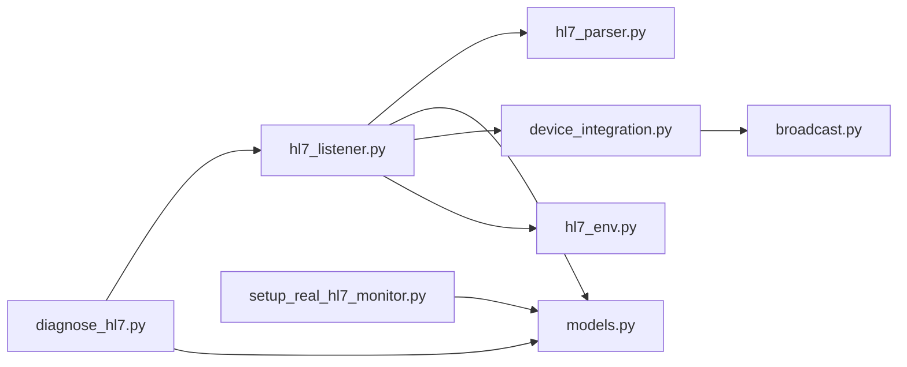

# HL7/MLLP Protocol Implementation

<cite>
**Referenced Files in This Document**
- [hl7_listener.py](file://backend/monitoring/hl7_listener.py)
- [hl7_parser.py](file://backend/monitoring/hl7_parser.py)
- [models.py](file://backend/monitoring/models.py)
- [device_integration.py](file://backend/monitoring/device_integration.py)
- [broadcast.py](file://backend/monitoring/broadcast.py)
- [hl7_env.py](file://backend/monitoring/hl7_env.py)
- [diagnose_hl7.py](file://backend/monitoring/management/commands/diagnose_hl7.py)
- [setup_real_hl7_monitor.py](file://backend/monitoring/management/commands/setup_real_hl7_monitor.py)
- [settings.py](file://backend/medicentral/settings.py)
</cite>

## Table of Contents
1. [Introduction](#introduction)
2. [Project Structure](#project-structure)
3. [Core Components](#core-components)
4. [Architecture Overview](#architecture-overview)
5. [Detailed Component Analysis](#detailed-component-analysis)
6. [Dependency Analysis](#dependency-analysis)
7. [Performance Considerations](#performance-considerations)
8. [Troubleshooting Guide](#troubleshooting-guide)
9. [Security and Compliance Considerations](#security-and-compliance-considerations)
10. [Conclusion](#conclusion)

## Introduction
This document explains the HL7/MLLP protocol implementation in Medicentral. It covers MLLP framing, message structure validation, UTF-8 and UTF-16 decoding, TCP socket server behavior, threading model, automatic acknowledgment (ACK) generation, batch processing of multiple HL7 messages per connection, diagnostic capabilities, and operational guidance for configuration, troubleshooting, and edge-case handling. It also outlines security and compliance considerations for healthcare environments.

## Project Structure
The HL7/MLLP implementation resides in the backend monitoring app and integrates with Django and Channels for broadcasting updates to the frontend.

**Diagram sources**
- [settings.py:53-66](file://backend/medicentral/settings.py#L53-L66)
- [hl7_listener.py:1-708](file://backend/monitoring/hl7_listener.py#L1-L708)
- [hl7_parser.py:1-530](file://backend/monitoring/hl7_parser.py#L1-L530)
- [models.py:77-130](file://backend/monitoring/models.py#L77-L130)
- [device_integration.py:1-232](file://backend/monitoring/device_integration.py#L1-L232)
- [broadcast.py:1-20](file://backend/monitoring/broadcast.py#L1-L20)
- [hl7_env.py:1-33](file://backend/monitoring/hl7_env.py#L1-L33)
- [diagnose_hl7.py:1-182](file://backend/monitoring/management/commands/diagnose_hl7.py#L1-L182)
- [setup_real_hl7_monitor.py:1-224](file://backend/monitoring/management/commands/setup_real_hl7_monitor.py#L1-L224)

**Section sources**
- [settings.py:53-66](file://backend/medicentral/settings.py#L53-L66)
- [hl7_listener.py:1-708](file://backend/monitoring/hl7_listener.py#L1-L708)
- [hl7_parser.py:1-530](file://backend/monitoring/hl7_parser.py#L1-L530)
- [models.py:77-130](file://backend/monitoring/models.py#L77-L130)
- [device_integration.py:1-232](file://backend/monitoring/device_integration.py#L1-L232)
- [broadcast.py:1-20](file://backend/monitoring/broadcast.py#L1-L20)
- [hl7_env.py:1-33](file://backend/monitoring/hl7_env.py#L1-L33)
- [diagnose_hl7.py:1-182](file://backend/monitoring/management/commands/diagnose_hl7.py#L1-L182)
- [setup_real_hl7_monitor.py:1-224](file://backend/monitoring/management/commands/setup_real_hl7_monitor.py#L1-L224)

## Core Components
- HL7 MLLP TCP Listener: Accepts TCP connections, applies MLLP framing extraction, decodes HL7 messages, validates structure, and dispatches ACKs.
- HL7 Parser: Extracts vital signs from HL7/ORU messages, supports multiple encodings and vendor-specific variations.
- Device Integration: Resolves devices by peer IP, applies vitals to patients, and broadcasts updates via Channels.
- Diagnostic Utilities: Environment flags for logging, command-line diagnostics, and runtime status reporting.

Key responsibilities:
- MLLP framing: Detect start-of-frame (0x0B), end-of-frame (0x1C 0x0D or 0x1C 0x0A), and peel payloads.
- Encoding detection: UTF-8, UTF-16 LE/BE, CP1251, Latin-1, GBK with best-effort decoding.
- Message validation: Presence of MSH segment and message control ID for ACK generation.
- Batch processing: Collect multiple HL7 messages per TCP session.
- Automatic ACK: Generate MSA|AA ACK with MSH-10 preserved.
- Diagnostics: Runtime counters, raw TCP previews, and CLI-driven troubleshooting.

**Section sources**
- [hl7_listener.py:82-123](file://backend/monitoring/hl7_listener.py#L82-L123)
- [hl7_parser.py:455-530](file://backend/monitoring/hl7_parser.py#L455-L530)
- [device_integration.py:129-232](file://backend/monitoring/device_integration.py#L129-L232)
- [hl7_env.py:18-33](file://backend/monitoring/hl7_env.py#L18-L33)

## Architecture Overview
The HL7/MLLP server runs as a dedicated thread that binds to a configurable host/port, accepts TCP connections, and spawns per-connection threads to process incoming data. Messages are parsed, validated, ACKed, and transformed into patient vitals, which are persisted and broadcast to the frontend.

**Diagram sources**
- [hl7_listener.py:405-531](file://backend/monitoring/hl7_listener.py#L405-L531)
- [hl7_parser.py:487-530](file://backend/monitoring/hl7_parser.py#L487-L530)
- [device_integration.py:129-232](file://backend/monitoring/device_integration.py#L129-L232)
- [broadcast.py:10-20](file://backend/monitoring/broadcast.py#L10-L20)

## Detailed Component Analysis

### HL7 MLLP TCP Listener
Responsibilities:
- Bind to configured host/port with retry on bind failure.
- Accept connections with a backlog and spawn daemon threads per connection.
- Configure socket options (TCP_NODELAY, SO_KEEPALIVE).
- Optional pre-handshake receive window to accommodate devices that send immediately after TCP connect.
- Optional connect handshake (MLLP frame) for devices requiring explicit greeting.
- Framing extraction: peel MLLP frames using 0x0B start and 0x1C terminator variants.
- UTF-16 detection for OEM monitors.
- Batch collection of HL7 messages per connection.
- Automatic ACK generation with MSA segment and preserved message control ID.
- Graceful error recovery for timeouts, resets, and partial reads.
- Diagnostic counters and logs for troubleshooting.

**Diagram sources**
- [hl7_listener.py:286-342](file://backend/monitoring/hl7_listener.py#L286-L342)
- [hl7_listener.py:125-147](file://backend/monitoring/hl7_listener.py#L125-L147)
- [hl7_listener.py:99-123](file://backend/monitoring/hl7_listener.py#L99-L123)
- [hl7_listener.py:533-586](file://backend/monitoring/hl7_listener.py#L533-L586)

**Section sources**
- [hl7_listener.py:588-637](file://backend/monitoring/hl7_listener.py#L588-L637)
- [hl7_listener.py:614-615](file://backend/monitoring/hl7_listener.py#L614-L615)
- [hl7_listener.py:617-627](file://backend/monitoring/hl7_listener.py#L617-L627)
- [hl7_listener.py:405-531](file://backend/monitoring/hl7_listener.py#L405-L531)
- [hl7_listener.py:125-147](file://backend/monitoring/hl7_listener.py#L125-L147)
- [hl7_listener.py:150-161](file://backend/monitoring/hl7_listener.py#L150-L161)
- [hl7_listener.py:286-342](file://backend/monitoring/hl7_listener.py#L286-L342)
- [hl7_listener.py:99-123](file://backend/monitoring/hl7_listener.py#L99-L123)

### HL7 Parser
Responsibilities:
- Detect presence of MSH segment in raw bytes (UTF-8 and UTF-16 variants).
- Decode HL7 text using best-available encoding among UTF-8, UTF-16 LE/BE, CP1251, Latin-1, GBK.
- Parse vitals from OBX segments with vendor-specific fallbacks (OBR/NTE/ST/Z*).
- Numeric heuristics for HR/SPO2/NIBP extraction when structured fields are missing.
- Regex-based fallback scanning for HR/SPO2 and NIBP patterns.
- Merge results across multiple encodings to maximize coverage.

**Diagram sources**
- [hl7_parser.py:487-530](file://backend/monitoring/hl7_parser.py#L487-L530)
- [hl7_parser.py:423-452](file://backend/monitoring/hl7_parser.py#L423-L452)
- [hl7_parser.py:199-257](file://backend/monitoring/hl7_parser.py#L199-L257)
- [hl7_parser.py:342-407](file://backend/monitoring/hl7_parser.py#L342-L407)
- [hl7_parser.py:278-339](file://backend/monitoring/hl7_parser.py#L278-L339)

**Section sources**
- [hl7_parser.py:455-464](file://backend/monitoring/hl7_parser.py#L455-L464)
- [hl7_parser.py:466-484](file://backend/monitoring/hl7_parser.py#L466-L484)
- [hl7_parser.py:487-530](file://backend/monitoring/hl7_parser.py#L487-L530)
- [hl7_parser.py:423-452](file://backend/monitoring/hl7_parser.py#L423-L452)
- [hl7_parser.py:199-257](file://backend/monitoring/hl7_parser.py#L199-L257)
- [hl7_parser.py:342-407](file://backend/monitoring/hl7_parser.py#L342-L407)
- [hl7_parser.py:278-339](file://backend/monitoring/hl7_parser.py#L278-L339)

### Device Integration and Broadcasting
Responsibilities:
- Resolve device by peer IP, supporting NAT scenarios and single-device fallback.
- Apply vitals payload atomically, update device online status, and compute NEWS-2 score.
- Persist vitals to history and broadcast updates to the frontend via Channels groups.

**Diagram sources**
- [device_integration.py:129-232](file://backend/monitoring/device_integration.py#L129-L232)
- [broadcast.py:10-20](file://backend/monitoring/broadcast.py#L10-L20)

**Section sources**
- [device_integration.py:129-232](file://backend/monitoring/device_integration.py#L129-L232)
- [broadcast.py:10-20](file://backend/monitoring/broadcast.py#L10-L20)

### HL7 Models and Device Resolution
- MonitorDevice stores IP addresses, HL7 enablement, port, optional peer IP for NAT, and connect handshake preference.
- Device resolution considers ip_address, local_ip, hl7_peer_ip, and supports single-device fallback under NAT.

**Section sources**
- [models.py:77-130](file://backend/monitoring/models.py#L77-L130)
- [device_integration.py:31-78](file://backend/monitoring/device_integration.py#L31-L78)

## Dependency Analysis
The HL7 subsystem depends on Django’s ORM, Channels for real-time updates, and environment variables for configuration. The listener thread coordinates with parser and device integration modules.

**Diagram sources**
- [hl7_listener.py:1-708](file://backend/monitoring/hl7_listener.py#L1-L708)
- [hl7_parser.py:1-530](file://backend/monitoring/hl7_parser.py#L1-L530)
- [models.py:77-130](file://backend/monitoring/models.py#L77-L130)
- [device_integration.py:1-232](file://backend/monitoring/device_integration.py#L1-L232)
- [broadcast.py:1-20](file://backend/monitoring/broadcast.py#L1-L20)
- [hl7_env.py:1-33](file://backend/monitoring/hl7_env.py#L1-L33)
- [diagnose_hl7.py:1-182](file://backend/monitoring/management/commands/diagnose_hl7.py#L1-L182)
- [setup_real_hl7_monitor.py:1-224](file://backend/monitoring/management/commands/setup_real_hl7_monitor.py#L1-L224)

**Section sources**
- [hl7_listener.py:1-708](file://backend/monitoring/hl7_listener.py#L1-L708)
- [hl7_parser.py:1-530](file://backend/monitoring/hl7_parser.py#L1-L530)
- [models.py:77-130](file://backend/monitoring/models.py#L77-L130)
- [device_integration.py:1-232](file://backend/monitoring/device_integration.py#L1-L232)
- [broadcast.py:1-20](file://backend/monitoring/broadcast.py#L1-L20)
- [hl7_env.py:1-33](file://backend/monitoring/hl7_env.py#L1-L33)
- [diagnose_hl7.py:1-182](file://backend/monitoring/management/commands/diagnose_hl7.py#L1-L182)
- [setup_real_hl7_monitor.py:1-224](file://backend/monitoring/management/commands/setup_real_hl7_monitor.py#L1-L224)

## Performance Considerations
- Threading model: One daemon thread per accepted connection to avoid blocking the accept loop.
- Socket tuning: TCP_NODELAY reduces latency; SO_KEEPALIVE helps detect dead peers.
- Buffering: Incremental receive with framing peel prevents memory blow-ups.
- Decoding: Best-effort multi-encoding detection avoids repeated retries.
- Batch processing: Multiple HL7 messages per connection reduce overhead.
- Logging controls: Environment flags minimize overhead during normal operation.

[No sources needed since this section provides general guidance]

## Troubleshooting Guide
Common issues and resolutions:
- No data received (0 bytes): Verify device HL7 settings, firewall, and whether connect handshake is required.
- MSH not detected: Confirm encoding and device behavior; adjust handshake timing.
- ACK not acknowledged: Ensure HL7_SEND_ACK is enabled and device expects MSA|AA.
- NAT connectivity: Set hl7_peer_ip or enable single-device fallback; confirm server-side listening.

Diagnostic tools:
- CLI diagnose command prints database, devices, patients, listener status, and actionable suggestions.
- Setup command creates a real device/patient pair and prints recommended monitor settings.
- Environment flags enable raw TCP previews and first-recv hex logging for deep inspection.

Operational checks:
- Confirm listener thread alive and port open locally.
- Review diagnostic counters for recent payloads and empty sessions.
- Inspect logs for handshake attempts and raw hex previews.

**Section sources**
- [diagnose_hl7.py:1-182](file://backend/monitoring/management/commands/diagnose_hl7.py#L1-L182)
- [setup_real_hl7_monitor.py:1-224](file://backend/monitoring/management/commands/setup_real_hl7_monitor.py#L1-L224)
- [hl7_env.py:18-33](file://backend/monitoring/hl7_env.py#L18-L33)
- [hl7_listener.py:676-688](file://backend/monitoring/hl7_listener.py#L676-L688)
- [hl7_listener.py:473-494](file://backend/monitoring/hl7_listener.py#L473-L494)

## Security and Compliance Considerations
- Transport security: HL7/MLLP is unencrypted by default; deploy behind encrypted transport (TLS) or secure network zones.
- Access control: Restrict HL7 port exposure; use firewalls and VLAN segmentation.
- Data minimization: Avoid logging PHI unless necessary; use diagnostic flags judiciously.
- Auditability: Maintain logs for incident response; ensure retention policies align with institutional policy.
- Standards alignment: Use HL7 v2.x with appropriate message profiles; validate MSH fields for compliance.
- Device hardening: Disable unnecessary protocols on devices; keep firmware updated.

[No sources needed since this section provides general guidance]

## Conclusion
Medicentral’s HL7/MLLP implementation provides robust framing, encoding detection, batch processing, and automatic ACK generation tailored for diverse medical devices. The modular design integrates cleanly with Django and Channels, enabling reliable vitals ingestion and real-time updates. Use the provided diagnostics and environment controls to configure, troubleshoot, and harden the integration for production healthcare environments.