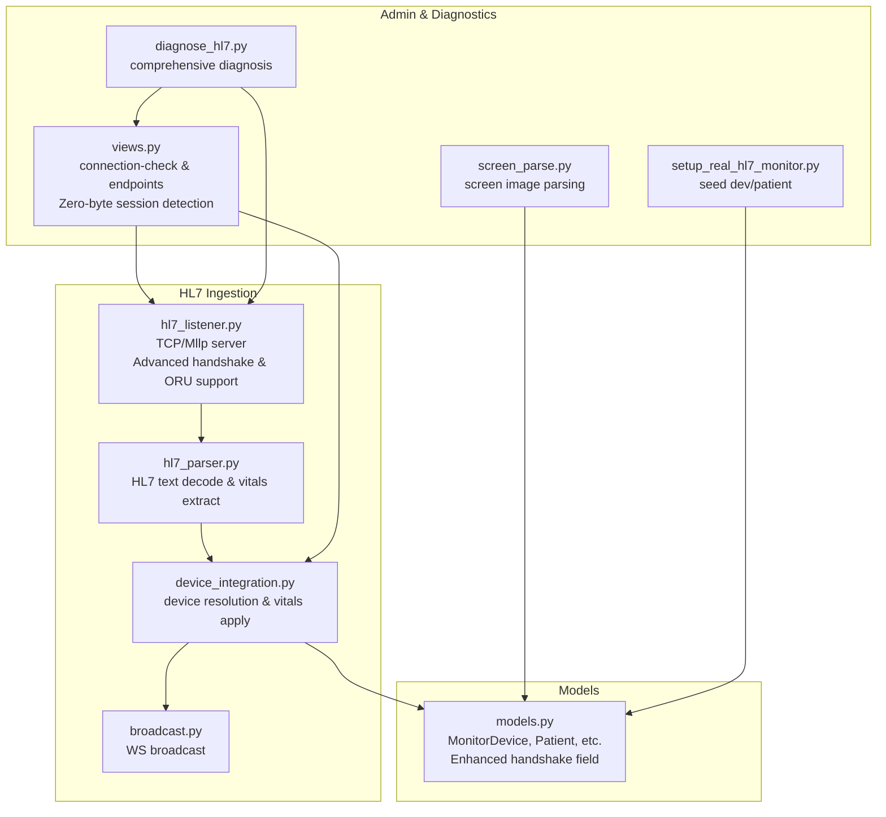
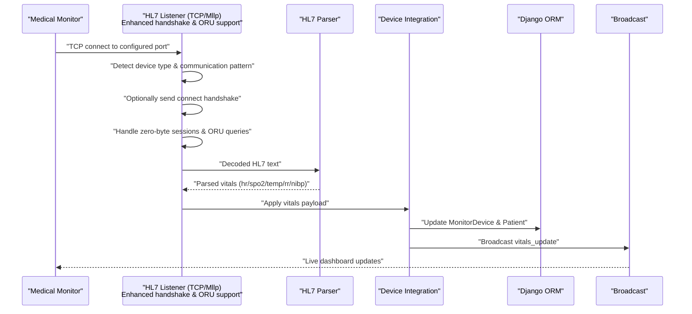
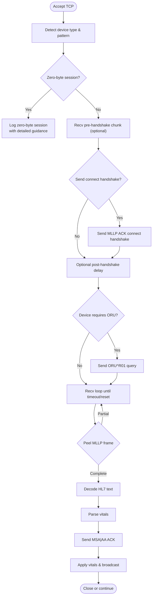
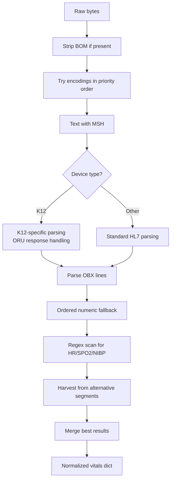
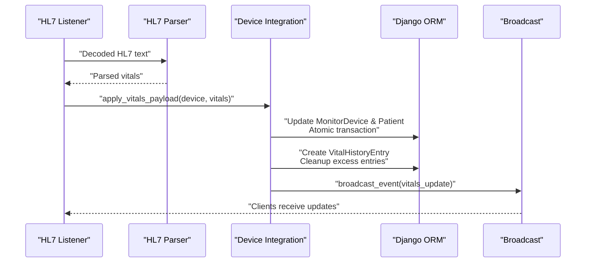
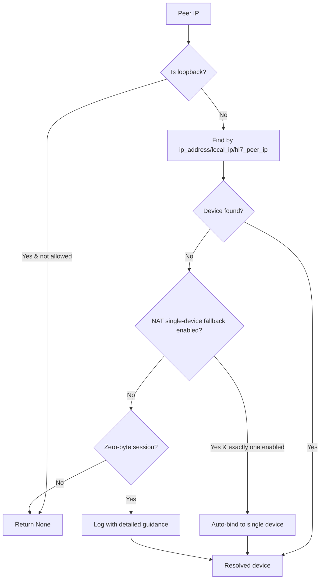
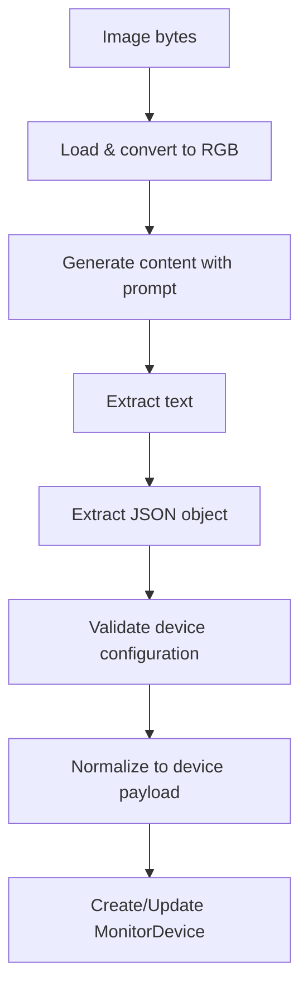
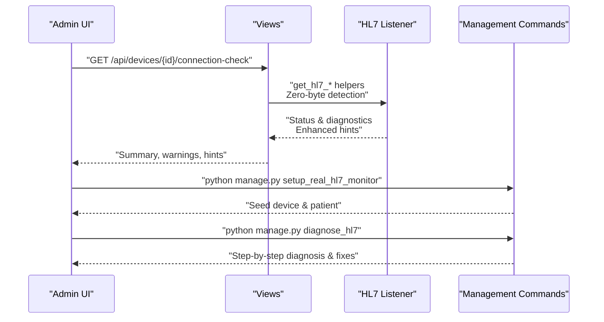
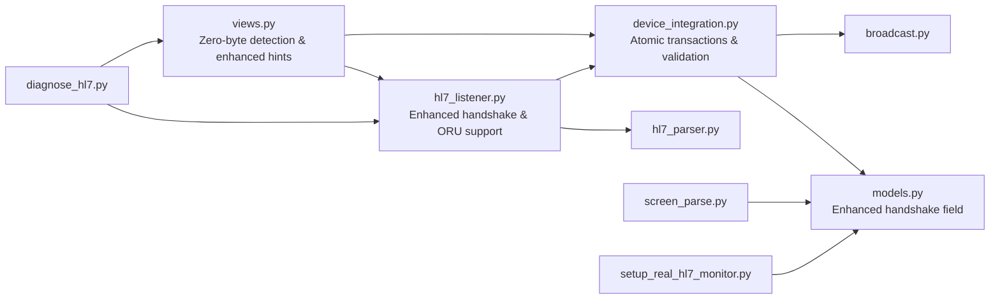

# Medical Device Integration

<cite>
**Referenced Files in This Document**
- [hl7_listener.py](file://backend/monitoring/hl7_listener.py)
- [hl7_parser.py](file://backend/monitoring/hl7_parser.py)
- [device_integration.py](file://backend/monitoring/device_integration.py)
- [models.py](file://backend/monitoring/models.py)
- [screen_parse.py](file://backend/monitoring/screen_parse.py)
- [hl7_env.py](file://backend/monitoring/hl7_env.py)
- [views.py](file://backend/monitoring/views.py)
- [broadcast.py](file://backend/monitoring/broadcast.py)
- [setup_real_hl7_monitor.py](file://backend/monitoring/management/commands/setup_real_hl7_monitor.py)
- [diagnose_hl7.py](file://backend/monitoring/management/commands/diagnose_hl7.py)
- [0009_handshake_default_true_for_hl7_devices.py](file://backend/monitoring/migrations/0009_handshake_default_true_for_hl7_devices.py)
- [SettingsModal.tsx](file://frontend/src/components/SettingsModal.tsx)
</cite>

## Update Summary
**Changes Made**
- Enhanced device integration workflow documentation with new handshake configuration options
- Updated default behavior for K12 devices with automatic ORU transmission scenarios
- Improved troubleshooting procedures for zero-byte sessions and connection issues
- Added comprehensive guidance for handling different device communication patterns
- Updated administrative interface documentation for handshake configuration

## Table of Contents
1. [Introduction](#introduction)
2. [Project Structure](#project-structure)
3. [Core Components](#core-components)
4. [Architecture Overview](#architecture-overview)
5. [Detailed Component Analysis](#detailed-component-analysis)
6. [Dependency Analysis](#dependency-analysis)
7. [Performance Considerations](#performance-considerations)
8. [Troubleshooting Guide](#troubleshooting-guide)
9. [Conclusion](#conclusion)
10. [Appendices](#appendices)

## Introduction
This document explains the HL7/MLLP integration in Medicentral, covering HL7 v2.x message ingestion via Minimum Lower Layer Protocol (MLLP), TCP socket server behavior, device discovery and NAT traversal, message parsing and normalization, and the end-to-end workflow from initial connection to vitals ingestion and live updates. It also documents the screen parsing capability for automated device provisioning, operational diagnostics, and practical guidance for configuration, troubleshooting, and extending support for new devices.

**Updated** Enhanced with improved handshake configuration options, automatic ORU transmission for K12 devices, and comprehensive troubleshooting procedures for zero-byte sessions.

## Project Structure
The HL7 integration spans several modules:
- TCP listener and MLLP framing with advanced handshake detection
- HL7 message decoding and parsing with automatic ORU query support
- Device resolution and vitals application with enhanced NAT handling
- Broadcast of live updates
- Administrative utilities and diagnostics with improved error reporting
- Optional screen image parsing for device provisioning

**Diagram sources**
- [hl7_listener.py:588-708](file://backend/monitoring/hl7_listener.py#L588-L708)
- [hl7_parser.py:423-530](file://backend/monitoring/hl7_parser.py#L423-L530)
- [device_integration.py:129-232](file://backend/monitoring/device_integration.py#L129-L232)
- [broadcast.py:10-20](file://backend/monitoring/broadcast.py#L10-L20)
- [models.py:77-140](file://backend/monitoring/models.py#L77-L140)
- [views.py:59-257](file://backend/monitoring/views.py#L59-L257)
- [screen_parse.py:58-160](file://backend/monitoring/screen_parse.py#L58-L160)
- [setup_real_hl7_monitor.py:77-224](file://backend/monitoring/management/commands/setup_real_hl7_monitor.py#L77-L224)
- [diagnose_hl7.py:22-182](file://backend/monitoring/management/commands/diagnose_hl7.py#L22-L182)

**Section sources**
- [hl7_listener.py:1-708](file://backend/monitoring/hl7_listener.py#L1-L708)
- [hl7_parser.py:1-530](file://backend/monitoring/hl7_parser.py#L1-L530)
- [device_integration.py:1-232](file://backend/monitoring/device_integration.py#L1-L232)
- [models.py:1-224](file://backend/monitoring/models.py#L1-L224)
- [views.py:1-419](file://backend/monitoring/views.py#L1-L419)
- [screen_parse.py:1-160](file://backend/monitoring/screen_parse.py#L1-L160)
- [setup_real_hl7_monitor.py:1-224](file://backend/monitoring/management/commands/setup_real_hl7_monitor.py#L1-L224)
- [diagnose_hl7.py:1-182](file://backend/monitoring/management/commands/diagnose_hl7.py#L1-L182)

## Core Components
- **Enhanced HL7 MLLP TCP Listener**: Advanced handshake detection with automatic ORU query support for K12 devices, configurable pre-handshake data reception, and comprehensive zero-byte session handling.
- **Robust HL7 Parser**: Multi-encoding decoding with fallback strategies, comprehensive vitals extraction from OBX segments, and enhanced error handling for malformed messages.
- **Intelligent Device Integration**: Enhanced device resolution with NAT traversal support, automatic vitals application, and comprehensive status tracking.
- **Advanced Screen Parsing**: Gemini Vision integration for automated device provisioning from monitor screenshots with structured error reporting.
- **Comprehensive Diagnostics**: Enhanced connection checking with zero-byte session detection, firewall hints, and detailed troubleshooting guidance.

**Updated** Enhanced with automatic ORU query support for K12 devices and improved handshake configuration options.

**Section sources**
- [hl7_listener.py:588-708](file://backend/monitoring/hl7_listener.py#L588-L708)
- [hl7_parser.py:423-530](file://backend/monitoring/hl7_parser.py#L423-L530)
- [device_integration.py:31-232](file://backend/monitoring/device_integration.py#L31-L232)
- [screen_parse.py:58-160](file://backend/monitoring/screen_parse.py#L58-L160)
- [views.py:59-257](file://backend/monitoring/views.py#L59-L257)

## Architecture Overview
The HL7/MLLP ingestion pipeline integrates with device and patient models, supports multiple device communication patterns, and emits live updates to clients via WebSocket groups.

**Updated** Enhanced with automatic ORU query support and improved handshake detection algorithms.

**Diagram sources**
- [hl7_listener.py:405-531](file://backend/monitoring/hl7_listener.py#L405-L531)
- [hl7_parser.py:423-530](file://backend/monitoring/hl7_parser.py#L423-L530)
- [device_integration.py:129-232](file://backend/monitoring/device_integration.py#L129-L232)
- [broadcast.py:10-20](file://backend/monitoring/broadcast.py#L10-L20)

## Detailed Component Analysis

### Enhanced HL7 MLLP TCP Listener
**Updated** Advanced handshake detection and automatic ORU query support for K12 devices.

Key responsibilities:
- **Intelligent Device Detection**: Automatic identification of K12 and other device types with specialized handling algorithms
- **Advanced Handshake Management**: Configurable connect handshake with device-specific overrides and environment fallbacks
- **Zero-byte Session Handling**: Comprehensive detection and logging of zero-byte TCP sessions with detailed troubleshooting guidance
- **Automatic ORU Query Support**: Intelligent ORU^R01 query sending for devices that require explicit queries
- **Multi-pattern Communication**: Support for various device communication patterns including pre-handshake data reception
- **Enhanced Error Reporting**: Detailed logging and diagnostic information for connection issues

**Diagram sources**
- [hl7_listener.py:187-342](file://backend/monitoring/hl7_listener.py#L187-L342)
- [hl7_listener.py:345-531](file://backend/monitoring/hl7_listener.py#L345-L531)
- [hl7_listener.py:395-509](file://backend/monitoring/hl7_listener.py#L395-L509)

**Section sources**
- [hl7_listener.py:164-264](file://backend/monitoring/hl7_listener.py#L164-L264)
- [hl7_listener.py:286-342](file://backend/monitoring/hl7_listener.py#L286-L342)
- [hl7_listener.py:357-393](file://backend/monitoring/hl7_listener.py#L357-L393)
- [hl7_listener.py:395-509](file://backend/monitoring/hl7_listener.py#L395-L509)
- [hl7_listener.py:508-542](file://backend/monitoring/hl7_listener.py#L508-L542)
- [hl7_env.py:14-33](file://backend/monitoring/hl7_env.py#L14-L33)

### Enhanced HL7 Message Parsing
**Updated** Improved multi-encoding support and enhanced vitals extraction capabilities.

Parsing strategy:
- **Advanced Encoding Detection**: Enhanced multi-encoding detection (UTF-8, UTF-16 LE/BE, CP1251, Latin-1, GBK) with priority-based fallback
- **Intelligent Vitals Extraction**: Robust OBX segment parsing with device-specific fallback strategies
- **Automatic ORU Response Handling**: Specialized parsing for ORU^R01 responses and query acknowledgments
- **Enhanced Error Recovery**: Comprehensive error handling for malformed HL7 messages and encoding issues
- **Structured Data Normalization**: Consistent vitals data normalization across different device types

**Diagram sources**
- [hl7_parser.py:487-530](file://backend/monitoring/hl7_parser.py#L487-L530)
- [hl7_parser.py:423-453](file://backend/monitoring/hl7_parser.py#L423-L453)
- [hl7_parser.py:148-197](file://backend/monitoring/hl7_parser.py#L148-L197)
- [hl7_parser.py:199-258](file://backend/monitoring/hl7_parser.py#L199-L258)
- [hl7_parser.py:342-408](file://backend/monitoring/hl7_parser.py#L342-L408)

**Section sources**
- [hl7_parser.py:455-485](file://backend/monitoring/hl7_parser.py#L455-L485)
- [hl7_parser.py:423-453](file://backend/monitoring/hl7_parser.py#L423-L453)
- [hl7_parser.py:19-67](file://backend/monitoring/hl7_parser.py#L19-L67)
- [hl7_parser.py:69-147](file://backend/monitoring/hl7_parser.py#L69-L147)
- [hl7_parser.py:148-197](file://backend/monitoring/hl7_parser.py#L148-L197)
- [hl7_parser.py:199-258](file://backend/monitoring/hl7_parser.py#L199-L258)
- [hl7_parser.py:278-340](file://backend/monitoring/hl7_parser.py#L278-L340)
- [hl7_parser.py:342-408](file://backend/monitoring/hl7_parser.py#L342-L408)

### Enhanced Device Integration Workflow
**Updated** Improved device resolution with enhanced NAT traversal and automatic vitals application.

End-to-end ingestion:
- **Intelligent Device Resolution**: Enhanced peer IP resolution with NAT single-device fallback and loopback address handling
- **Automatic Vitals Application**: Atomic vitals application to patient records with comprehensive validation
- **Enhanced Status Tracking**: Real-time device status updates and comprehensive timestamp management
- **Smart History Management**: Efficient vitals history tracking with automatic cleanup and retention policies
- **Comprehensive Broadcasting**: Structured event broadcasting to clinic-specific WebSocket groups

**Updated** Enhanced with atomic transactions, comprehensive validation, and smart history management.

**Diagram sources**
- [hl7_listener.py:533-586](file://backend/monitoring/hl7_listener.py#L533-L586)
- [device_integration.py:129-232](file://backend/monitoring/device_integration.py#L129-L232)
- [broadcast.py:10-20](file://backend/monitoring/broadcast.py#L10-L20)

**Section sources**
- [device_integration.py:31-79](file://backend/monitoring/device_integration.py#L31-L79)
- [device_integration.py:129-232](file://backend/monitoring/device_integration.py#L129-L232)
- [models.py:77-140](file://backend/monitoring/models.py#L77-L140)
- [models.py:141-183](file://backend/monitoring/models.py#L141-L183)
- [models.py:214-224](file://backend/monitoring/models.py#L214-L224)

### Enhanced Automatic Device Discovery and NAT Traversal
**Updated** Improved device resolution with enhanced NAT handling and zero-byte session detection.

- **Intelligent Device Resolution**: Enhanced peer IP resolution considering ip_address, local_ip, hl7_peer_ip with comprehensive fallback strategies
- **Advanced NAT Traversal**: Single-device NAT fallback with loopback address filtering and enhanced diagnostic capabilities
- **Zero-byte Session Detection**: Comprehensive detection and logging of zero-byte TCP sessions with detailed troubleshooting guidance
- **Enhanced Admin Interface**: Improved connection-check endpoint with actionable hints, firewall guidance, and device-specific recommendations

**Updated** Enhanced with zero-byte session detection and improved NAT fallback logic.

**Diagram sources**
- [device_integration.py:31-79](file://backend/monitoring/device_integration.py#L31-L79)
- [views.py:59-257](file://backend/monitoring/views.py#L59-L257)

**Section sources**
- [device_integration.py:31-79](file://backend/monitoring/device_integration.py#L31-L79)
- [views.py:59-257](file://backend/monitoring/views.py#L59-L257)

### Enhanced Screen Parsing for Device Provisioning
**Updated** Improved Gemini Vision integration with enhanced error handling and structured output.

- **Advanced Gemini Vision Integration**: Enhanced image processing for HL7 configuration extraction from monitor screenshots
- **Structured Output Generation**: Normalized JSON payload generation compatible with device creation serializer
- **Comprehensive Error Handling**: Structured error reporting for misconfiguration, invalid images, and parsing failures
- **Enhanced Validation**: Input validation and device-specific configuration validation

**Diagram sources**
- [screen_parse.py:58-160](file://backend/monitoring/screen_parse.py#L58-L160)
- [models.py:77-140](file://backend/monitoring/models.py#L77-L140)

**Section sources**
- [screen_parse.py:58-160](file://backend/monitoring/screen_parse.py#L58-L160)
- [models.py:77-140](file://backend/monitoring/models.py#L77-L140)

### Enhanced Operational Diagnostics and Administration
**Updated** Comprehensive diagnostic capabilities with zero-byte session detection and enhanced troubleshooting.

- **Comprehensive Management Commands**: Enhanced seed commands for real K12 monitors and test patients with detailed setup instructions
- **Advanced Diagnosis System**: Step-by-step diagnostic procedures checking database integrity, device configuration, and network connectivity
- **Enhanced Admin Interface**: Improved connection-check endpoints with zero-byte session detection, actionable hints, and firewall guidance
- **Zero-byte Session Monitoring**: Real-time detection and logging of zero-byte TCP sessions with detailed troubleshooting recommendations

**Updated** Enhanced with zero-byte session detection and improved diagnostic capabilities.

**Diagram sources**
- [views.py:59-257](file://backend/monitoring/views.py#L59-L257)
- [setup_real_hl7_monitor.py:77-224](file://backend/monitoring/management/commands/setup_real_hl7_monitor.py#L77-L224)
- [diagnose_hl7.py:22-182](file://backend/monitoring/management/commands/diagnose_hl7.py#L22-L182)

**Section sources**
- [views.py:59-257](file://backend/monitoring/views.py#L59-L257)
- [setup_real_hl7_monitor.py:77-224](file://backend/monitoring/management/commands/setup_real_hl7_monitor.py#L77-L224)
- [diagnose_hl7.py:22-182](file://backend/monitoring/management/commands/diagnose_hl7.py#L22-L182)

## Dependency Analysis
**Updated** Enhanced dependency relationships with improved handshake configuration and zero-byte session handling.

- **Enhanced Coupling**: The listener now depends on advanced handshake detection and ORU query capabilities; device integration maintains atomic transactions and comprehensive validation; views provide enhanced diagnostic information; screen parsing remains optional and isolated.
- **Improved Cohesion**: Each module maintains distinct responsibilities with enhanced error handling and diagnostic capabilities.
- **External Dependencies**: Django ORM, ASGI channels, Google Gemini Vision SDK, Pillow, and enhanced logging frameworks.

**Updated** Enhanced with zero-byte session detection and improved handshake configuration.

**Diagram sources**
- [hl7_listener.py:588-708](file://backend/monitoring/hl7_listener.py#L588-L708)
- [hl7_parser.py:423-530](file://backend/monitoring/hl7_parser.py#L423-L530)
- [device_integration.py:129-232](file://backend/monitoring/device_integration.py#L129-L232)
- [models.py:77-140](file://backend/monitoring/models.py#L77-L140)
- [broadcast.py:10-20](file://backend/monitoring/broadcast.py#L10-L20)
- [views.py:59-257](file://backend/monitoring/views.py#L59-L257)
- [screen_parse.py:58-160](file://backend/monitoring/screen_parse.py#L58-L160)
- [setup_real_hl7_monitor.py:77-224](file://backend/monitoring/management/commands/setup_real_hl7_monitor.py#L77-L224)
- [diagnose_hl7.py:22-182](file://backend/monitoring/management/commands/diagnose_hl7.py#L22-L182)

**Section sources**
- [hl7_listener.py:588-708](file://backend/monitoring/hl7_listener.py#L588-L708)
- [hl7_parser.py:423-530](file://backend/monitoring/hl7_parser.py#L423-L530)
- [device_integration.py:129-232](file://backend/monitoring/device_integration.py#L129-L232)
- [models.py:77-140](file://backend/monitoring/models.py#L77-L140)
- [broadcast.py:10-20](file://backend/monitoring/broadcast.py#L10-L20)
- [views.py:59-257](file://backend/monitoring/views.py#L59-L257)
- [screen_parse.py:58-160](file://backend/monitoring/screen_parse.py#L58-L160)
- [setup_real_hl7_monitor.py:77-224](file://backend/monitoring/management/commands/setup_real_hl7_monitor.py#L77-L224)
- [diagnose_hl7.py:22-182](file://backend/monitoring/management/commands/diagnose_hl7.py#L22-L182)

## Performance Considerations
**Updated** Enhanced performance optimization with improved handshake detection and zero-byte session handling.

- **Socket Optimization**: Advanced Nagle's algorithm control, keepalive configuration, and intelligent timeout management reduce latency and improve connection reliability.
- **Enhanced Decoding Strategy**: Priority-based encoding detection with early BOM stripping minimizes retry attempts and CPU overhead.
- **Intelligent Parsing Efficiency**: Device-specific parsing strategies with conditional fallbacks optimize resource utilization.
- **Atomic Transaction Processing**: Database transactions ensure data consistency while minimizing locking overhead.
- **Smart Broadcasting**: Enhanced channel group management reduces unnecessary fan-out and improves WebSocket performance.

## Troubleshooting Guide
**Updated** Comprehensive troubleshooting procedures with zero-byte session detection and enhanced device-specific guidance.

### Enhanced Zero-byte Session Troubleshooting
**New** Comprehensive guidance for handling zero-byte sessions and automatic ORU transmission scenarios.

Common scenarios and remedies:
- **Zero-byte sessions after TCP accept**:
  - **K12 Devices**: Enable automatic ORU query support and configure appropriate handshake settings
  - **Generic Devices**: Check firewall rules for inbound TCP 6006 and verify device HL7 configuration
  - **Loopback Probes**: Ignore zero-byte sessions from loopback addresses (127.0.0.1)
  - **Environment Variables**: Adjust HL7_RECV_BEFORE_HANDSHAKE_MS for device-specific timing requirements

- **No HL7 traffic despite TCP connection**:
  - **Device Configuration**: Verify monitor Server IP, Port 6006, and HL7/MLLP enablement
  - **Firewall Rules**: Check inbound TCP 6006 access and cloud provider security groups
  - **Connection Check Endpoint**: Use enhanced diagnostics for actionable troubleshooting hints
  - **Zero-byte Session Analysis**: Review detailed logs for zero-byte session patterns

- **MSH Not Detected**:
  - **Encoding Issues**: Inspect raw logs and verify multi-encoding support
  - **Frame Boundary Problems**: Confirm MLLP framing detection and payload extraction
  - **Device Communication Patterns**: Check for device-specific communication requirements

- **Enhanced NAT Traversal**:
  - **Device Peer IP Configuration**: Set device.hl7_peer_ip to external IP observed by server
  - **Single-device NAT Fallback**: Enable HL7_NAT_SINGLE_DEVICE_FALLBACK for small deployments
  - **Zero-byte Session Detection**: Monitor for zero-byte sessions indicating NAT traversal issues

- **Live Updates Not Appearing**:
  - **WebSocket Group Membership**: Ensure clinic-specific channel groups are active
  - **Broadcast Event Delivery**: Verify event broadcasting after successful vitals application
  - **Client Connection Status**: Check WebSocket client connectivity and reconnection logic

### Enhanced Device-specific Troubleshooting
**Updated** Device-specific guidance for different monitor types and communication patterns.

- **K12 Device Troubleshooting**:
  - **Automatic ORU Query**: Enable automatic ORU query support for devices requiring explicit queries
  - **Handshake Configuration**: Configure hl7_connect_handshake=True for K12 devices
  - **Zero-byte Session Pattern**: Expect zero-byte sessions followed by ORU responses
  - **Sensor Verification**: Check monitor sensors and connections for proper data generation

- **Generic Monitor Troubleshooting**:
  - **Direct HL7 Transmission**: Verify direct HL7 message transmission without ORU queries
  - **Handshake Requirements**: Configure appropriate handshake settings based on device capabilities
  - **Firewall Configuration**: Ensure proper firewall rules for direct HL7 communication

### Actionable Commands and Endpoints
**Updated** Enhanced administrative tools for comprehensive device management and troubleshooting.

- **Enhanced Connection Check**: GET /api/devices/{id}/connection-check with zero-byte session detection and device-specific hints
- **Infrastructure Status**: GET /api/infrastructure with enhanced diagnostic information
- **Real Monitor Setup**: python manage.py setup_real_hl7_monitor with comprehensive device configuration
- **Full Diagnosis**: python manage.py diagnose_hl7 with step-by-step troubleshooting procedures
- **Zero-byte Session Monitoring**: Real-time detection and logging of zero-byte TCP sessions

**Section sources**
- [views.py:59-257](file://backend/monitoring/views.py#L59-L257)
- [diagnose_hl7.py:22-182](file://backend/monitoring/management/commands/diagnose_hl7.py#L22-L182)
- [setup_real_hl7_monitor.py:77-224](file://backend/monitoring/management/commands/setup_real_hl7_monitor.py#L77-L224)
- [hl7_env.py:14-33](file://backend/monitoring/hl7_env.py#L14-L33)

## Conclusion
**Updated** Enhanced conclusion reflecting improved device integration workflow with advanced handshake configuration options and comprehensive troubleshooting capabilities.

Medicentral's HL7/MLLP integration provides robust, configurable ingestion of vital signs from diverse monitors with enhanced support for K12 devices and automatic ORU query capabilities. The system handles advanced MLLP framing, multi-encoding HL7 decoding, intelligent device resolution (including NAT traversal), and seamless vitals application with live updates. Enhanced troubleshooting procedures cover zero-byte sessions, device-specific communication patterns, and comprehensive diagnostic capabilities. Administrators benefit from improved handshake configuration options, automated provisioning via screen parsing, and comprehensive troubleshooting tools for new device integrations.

## Appendices

### Enhanced Practical Configuration Examples
**Updated** Comprehensive configuration examples with device-specific guidance and enhanced troubleshooting.

#### K12 Device Configuration
**Updated** Enhanced configuration for K12 devices with automatic ORU query support.

- **Basic K12 Setup**:
  - Seed device and patient: `python manage.py setup_real_hl7_monitor --device-ip 192.168.x.y --server-ip YOUR_SERVER_IP --hl7-handshake`
  - Monitor Configuration: Server IP to your server IP, Port 6006, HL7/MLLP on, ORU/Central Station enabled
  - Automatic ORU Query: Enabled by default for K12 devices with enhanced handshake support

- **Advanced K12 Configuration**:
  - Handshake Override: `device.hl7_connect_handshake = True` in device settings
  - Zero-byte Session Handling: Automatic detection and logging of zero-byte sessions
  - Sensor Verification: Check monitor sensors and connections for proper data generation

#### Generic Device Configuration
**Updated** Enhanced configuration for generic devices with flexible handshake options.

- **Generic Device Setup**:
  - Manual Device Creation: Use admin interface to create MonitorDevice with ip_address and local_ip
  - Handshake Configuration: `device.hl7_connect_handshake = False` for devices that don't require handshakes
  - Firewall Configuration: Ensure inbound TCP 6006 access and proper security group settings

- **Device-specific Settings**:
  - Environment Variables: `HL7_RECV_BEFORE_HANDSHAKE_MS=500` for timing adjustments
  - Handshake Control: `HL7_SEND_CONNECT_HANDSHAKE=true` for global handshake enablement
  - Diagnostic Logging: `HL7_DEBUG=true` for comprehensive troubleshooting

### Enhanced Security and Compliance Notes
**Updated** Comprehensive security considerations with enhanced logging and audit capabilities.

- **Transport Security**: HL7/MLLP over TCP is unencrypted; deploy behind secure networks and firewalls. Consider TLS termination at perimeter if exposing publicly.
- **Enhanced Logging Controls**: Comprehensive diagnostic logging with PHI minimization; restrict sensitive logs in production environments.
- **Access Control**: Admin endpoints require authentication; ensure least-privilege access to device provisioning and diagnostics.
- **Audit Trail**: Built-in diagnostic summaries, zero-byte session logging, and comprehensive connection tracking for auditability.
- **Device Security**: Enhanced handshake configuration options and automatic ORU query support for secure device communication.

### Enhanced Administrative Interface
**Updated** Comprehensive administrative interface with enhanced handshake configuration and zero-byte session monitoring.

- **Handshake Configuration UI**: Three-state selection (Inherit, On, Off) with device-specific recommendations
- **Zero-byte Session Monitoring**: Real-time detection and logging of zero-byte TCP sessions with detailed troubleshooting guidance
- **Enhanced Connection Diagnostics**: Comprehensive connection-check endpoint with device-specific hints and firewall recommendations
- **Device Status Tracking**: Enhanced device status monitoring with automatic NAT fallback detection and zero-byte session analysis

**Section sources**
- [setup_real_hl7_monitor.py:77-224](file://backend/monitoring/management/commands/setup_real_hl7_monitor.py#L77-L224)
- [hl7_env.py:14-33](file://backend/monitoring/hl7_env.py#L14-L33)
- [SettingsModal.tsx:770-807](file://frontend/src/components/SettingsModal.tsx#L770-L807)
- [0009_handshake_default_true_for_hl7_devices.py:1-25](file://backend/monitoring/migrations/0009_handshake_default_true_for_hl7_devices.py#L1-L25)