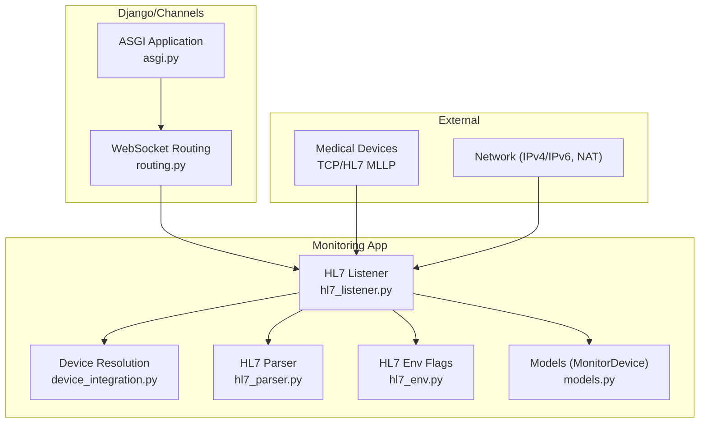
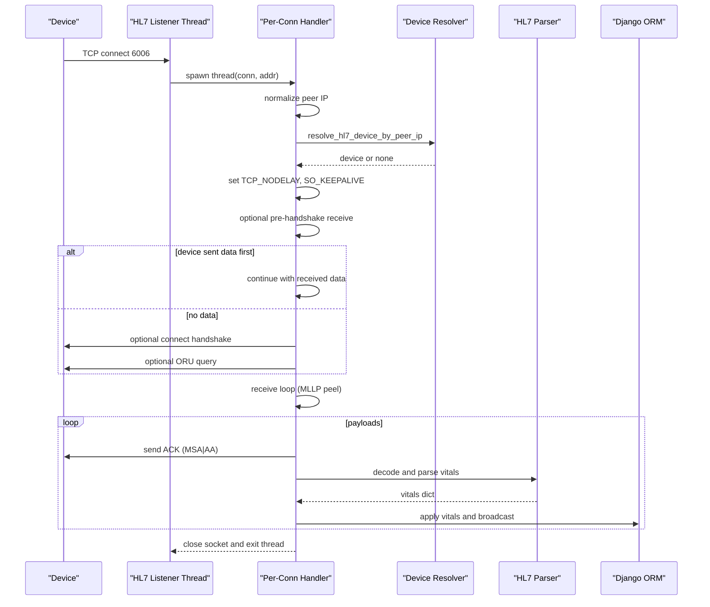
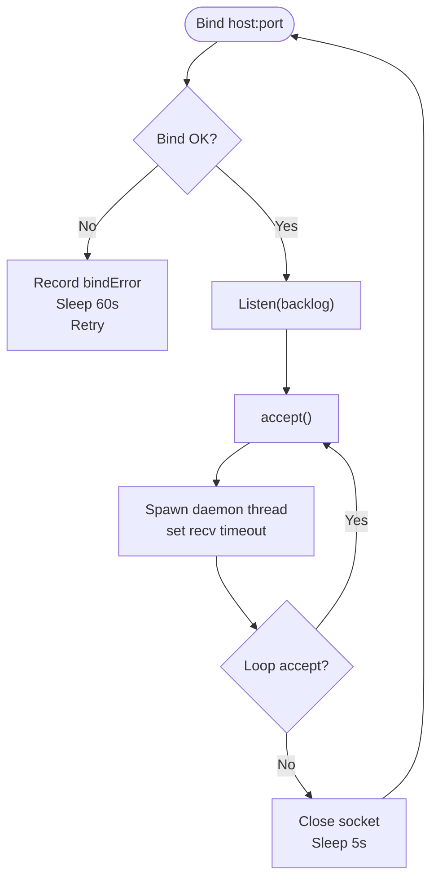
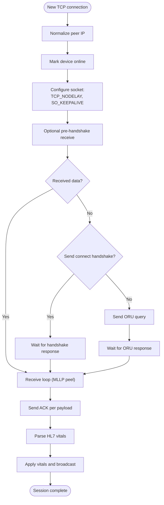
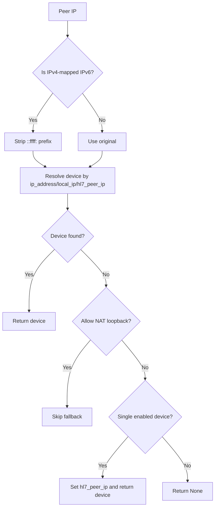
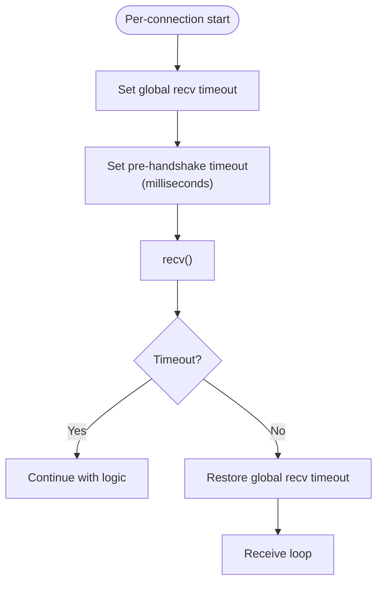
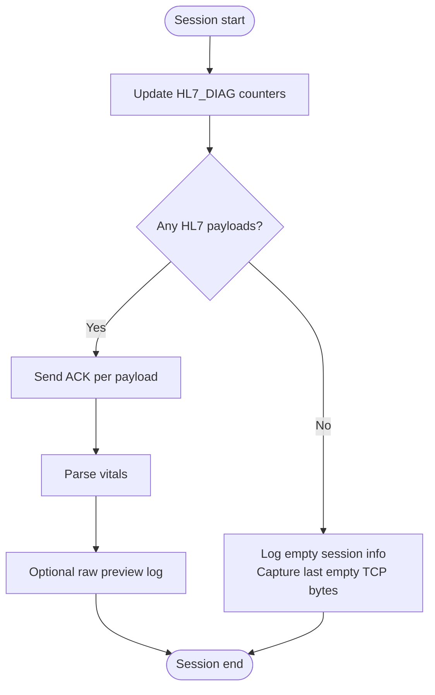
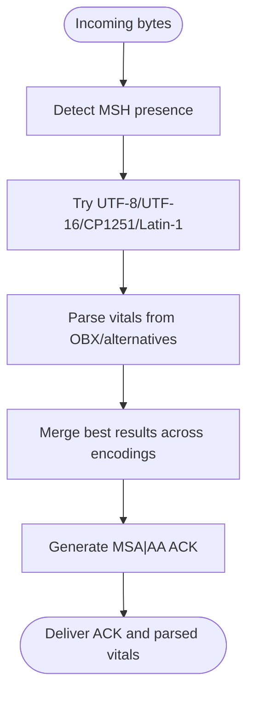
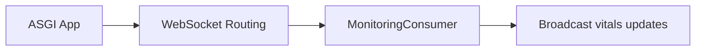
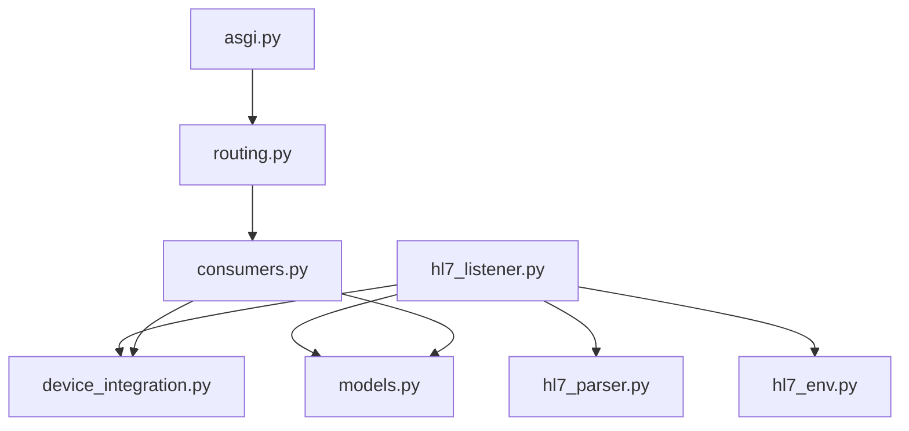

# TCP Socket Server Architecture

<cite>
**Referenced Files in This Document**
- [settings.py](file://backend/medicentral/settings.py)
- [hl7_listener.py](file://backend/monitoring/hl7_listener.py)
- [models.py](file://backend/monitoring/models.py)
- [device_integration.py](file://backend/monitoring/device_integration.py)
- [hl7_parser.py](file://backend/monitoring/hl7_parser.py)
- [hl7_env.py](file://backend/monitoring/hl7_env.py)
- [routing.py](file://backend/monitoring/routing.py)
- [asgi.py](file://backend/medicentral/asgi.py)
- [SERVER-SETUP.md](file://deploy/SERVER-SETUP.md)
</cite>

## Table of Contents
1. [Introduction](#introduction)
2. [Project Structure](#project-structure)
3. [Core Components](#core-components)
4. [Architecture Overview](#architecture-overview)
5. [Detailed Component Analysis](#detailed-component-analysis)
6. [Dependency Analysis](#dependency-analysis)
7. [Performance Considerations](#performance-considerations)
8. [Troubleshooting Guide](#troubleshooting-guide)
9. [Conclusion](#conclusion)
10. [Appendices](#appendices)

## Introduction
This document describes the TCP socket server architecture used for medical device communication via HL7 MLLP (Minimal Lower Layer Protocol). It explains the threaded connection handling model, socket configuration for low latency, connection lifecycle management, peer IP normalization for IPv4/IPv6 compatibility, NAT traversal support, timeout configuration, diagnostic logging, and operational guidance for monitoring and troubleshooting. Practical examples show how to configure server settings, interpret diagnostics, and optimize performance for multiple concurrent device connections.

## Project Structure
The HL7 listener is implemented as a dedicated TCP server within the monitoring app. It integrates with Django and Channels for ASGI hosting and WebSocket broadcasting. Key elements:
- TCP listener and per-connection handler
- Device resolution and NAT traversal
- HL7 parsing and ACK generation
- Diagnostic logging and runtime metrics
- ASGI routing for WebSocket events

**Diagram sources**
- [asgi.py:14-21](file://backend/medicentral/asgi.py#L14-L21)
- [routing.py:5-7](file://backend/monitoring/routing.py#L5-L7)
- [hl7_listener.py:635-755](file://backend/monitoring/hl7_listener.py#L635-L755)
- [device_integration.py:31-78](file://backend/monitoring/device_integration.py#L31-L78)
- [hl7_parser.py:423-530](file://backend/monitoring/hl7_parser.py#L423-L530)
- [hl7_env.py:18-33](file://backend/monitoring/hl7_env.py#L18-L33)
- [models.py:77-140](file://backend/monitoring/models.py#L77-L140)

**Section sources**
- [asgi.py:14-21](file://backend/medicentral/asgi.py#L14-L21)
- [routing.py:5-7](file://backend/monitoring/routing.py#L5-L7)
- [hl7_listener.py:635-755](file://backend/monitoring/hl7_listener.py#L635-L755)

## Core Components
- HL7 MLLP TCP listener with threaded per-connection handling
- Socket configuration for low-latency throughput and keepalive
- Connection lifecycle: accept, pre-handshake receive, optional handshake, optional query, payload extraction, ACK, and cleanup
- Peer IP normalization for IPv4-mapped IPv6 addresses
- NAT traversal via flexible device peer IP mapping and single-device fallback
- Timeout configuration for receive operations and handshake/query waits
- Diagnostic logging and runtime metrics for connection health and raw TCP capture
- HL7 parsing and ACK generation for reliable delivery

**Section sources**
- [hl7_listener.py:345-354](file://backend/monitoring/hl7_listener.py#L345-L354)
- [hl7_listener.py:426-578](file://backend/monitoring/hl7_listener.py#L426-L578)
- [hl7_listener.py:164-174](file://backend/monitoring/hl7_listener.py#L164-L174)
- [hl7_listener.py:187-234](file://backend/monitoring/hl7_listener.py#L187-L234)
- [hl7_listener.py:357-369](file://backend/monitoring/hl7_listener.py#L357-L369)
- [hl7_listener.py:372-392](file://backend/monitoring/hl7_listener.py#L372-L392)
- [hl7_listener.py:395-413](file://backend/monitoring/hl7_listener.py#L395-L413)
- [hl7_listener.py:416-424](file://backend/monitoring/hl7_listener.py#L416-L424)
- [hl7_listener.py:266-283](file://backend/monitoring/hl7_listener.py#L266-L283)
- [hl7_parser.py:423-530](file://backend/monitoring/hl7_parser.py#L423-L530)

## Architecture Overview
The HL7 listener runs as a long-lived thread that binds to a configurable host/port, listens for TCP connections, and spawns a new thread per accepted connection. Each connection thread performs:
- Pre-handshake receive window
- Optional connect handshake or query-based trigger
- Continuous receive loop extracting MLLP frames
- HL7 ACK emission and parsing
- Device status updates and vitals application
- Diagnostic recording and cleanup

**Diagram sources**
- [hl7_listener.py:635-755](file://backend/monitoring/hl7_listener.py#L635-L755)
- [hl7_listener.py:426-578](file://backend/monitoring/hl7_listener.py#L426-L578)
- [device_integration.py:31-78](file://backend/monitoring/device_integration.py#L31-L78)
- [hl7_parser.py:423-530](file://backend/monitoring/hl7_parser.py#L423-L530)

## Detailed Component Analysis

### TCP Listener and Threading Model
- Binds to configured host/port, retries on bind failure, and listens with a backlog
- Accepts connections and immediately applies per-connection receive timeout
- Spawns a daemon thread per connection with a descriptive name
- Graceful shutdown on accept loop exit with a short sleep before reconnect attempts

**Diagram sources**
- [hl7_listener.py:635-684](file://backend/monitoring/hl7_listener.py#L635-L684)

**Section sources**
- [hl7_listener.py:635-684](file://backend/monitoring/hl7_listener.py#L635-L684)

### Per-Connection Lifecycle and Handshake Logic
- Normalizes peer IP to canonical form for IPv4/IPv6 compatibility
- Marks device online upon accept
- Applies socket optimizations (TCP_NODELAY, SO_KEEPALIVE)
- Optional pre-handshake receive window to accommodate devices that send immediately
- Optional connect handshake or ORU query to trigger response from certain devices
- Robust receive loop extracting MLLP frames and handling partial reads
- Emits ACK for each HL7 payload and records session diagnostics

**Diagram sources**
- [hl7_listener.py:426-578](file://backend/monitoring/hl7_listener.py#L426-L578)
- [hl7_listener.py:372-413](file://backend/monitoring/hl7_listener.py#L372-L413)

**Section sources**
- [hl7_listener.py:426-578](file://backend/monitoring/hl7_listener.py#L426-L578)

### Peer IP Normalization and NAT Traversal
- Converts IPv4-mapped IPv6 addresses to pure IPv4 for consistent matching
- Resolves device by ip_address, local_ip, or hl7_peer_ip
- Supports NAT single-device fallback: when exactly one enabled device exists, auto-map peer IP to that device
- Loopback detection avoids false-positive NAT fallbacks during local testing

**Diagram sources**
- [hl7_listener.py:73-79](file://backend/monitoring/hl7_listener.py#L73-L79)
- [device_integration.py:31-78](file://backend/monitoring/device_integration.py#L31-L78)

**Section sources**
- [hl7_listener.py:73-79](file://backend/monitoring/hl7_listener.py#L73-L79)
- [device_integration.py:31-78](file://backend/monitoring/device_integration.py#L31-L78)

### Timeout Configuration System
- Global receive timeout per connection controlled by environment variable
- Pre-handshake receive window configurable in milliseconds
- Short timeouts for handshake and query waits to reduce blocking
- Graceful handling of socket timeouts and connection resets

**Diagram sources**
- [hl7_listener.py:164-174](file://backend/monitoring/hl7_listener.py#L164-L174)
- [hl7_listener.py:187-234](file://backend/monitoring/hl7_listener.py#L187-L234)
- [hl7_listener.py:237-264](file://backend/monitoring/hl7_listener.py#L237-L264)

**Section sources**
- [hl7_listener.py:164-174](file://backend/monitoring/hl7_listener.py#L164-L174)
- [hl7_listener.py:187-234](file://backend/monitoring/hl7_listener.py#L187-L234)
- [hl7_listener.py:237-264](file://backend/monitoring/hl7_listener.py#L237-L264)

### Diagnostic Logging and Monitoring
- Maintains a shared diagnostic dictionary with counters and last seen metrics
- Records last payload peer, byte counts, and whether ACK was attempted
- Captures raw TCP hex previews when HL7 MSH is not detected
- Exposes status via API including listen config, thread liveness, and local port probing
- Provides environment flags to enable raw TCP logs, first-recv hex dumps, and raw previews

**Diagram sources**
- [hl7_listener.py:42-71](file://backend/monitoring/hl7_listener.py#L42-L71)
- [hl7_listener.py:266-283](file://backend/monitoring/hl7_listener.py#L266-L283)
- [hl7_env.py:18-33](file://backend/monitoring/hl7_env.py#L18-L33)
- [hl7_listener.py:723-735](file://backend/monitoring/hl7_listener.py#L723-L735)

**Section sources**
- [hl7_listener.py:42-71](file://backend/monitoring/hl7_listener.py#L42-L71)
- [hl7_listener.py:266-283](file://backend/monitoring/hl7_listener.py#L266-L283)
- [hl7_env.py:18-33](file://backend/monitoring/hl7_env.py#L18-L33)
- [hl7_listener.py:723-735](file://backend/monitoring/hl7_listener.py#L723-L735)

### HL7 Parsing and ACK Generation
- Detects MSH segments in UTF-8 and UTF-16 variants
- Extracts message control ID for ACK correlation
- Generates standardized ACK (MSA|AA) with current timestamp
- Parses vitals from OBX and fallback segments, merging best results across encodings

**Diagram sources**
- [hl7_listener.py:99-123](file://backend/monitoring/hl7_listener.py#L99-L123)
- [hl7_parser.py:423-530](file://backend/monitoring/hl7_parser.py#L423-L530)
- [hl7_parser.py:455-484](file://backend/monitoring/hl7_parser.py#L455-L484)

**Section sources**
- [hl7_listener.py:99-123](file://backend/monitoring/hl7_listener.py#L99-L123)
- [hl7_parser.py:423-530](file://backend/monitoring/hl7_parser.py#L423-L530)
- [hl7_parser.py:455-484](file://backend/monitoring/hl7_parser.py#L455-L484)

### WebSocket Integration (Context)
While the HL7 listener operates independently, the ASGI application integrates WebSocket routing for real-time client updates. Authentication middleware and group-based broadcasting are used to deliver vitals updates to clients.

**Diagram sources**
- [asgi.py:14-21](file://backend/medicentral/asgi.py#L14-L21)
- [routing.py:5-7](file://backend/monitoring/routing.py#L5-L7)
- [consumers.py:12-46](file://backend/monitoring/consumers.py#L12-L46)

**Section sources**
- [asgi.py:14-21](file://backend/medicentral/asgi.py#L14-L21)
- [routing.py:5-7](file://backend/monitoring/routing.py#L5-L7)
- [consumers.py:12-46](file://backend/monitoring/consumers.py#L12-L46)

## Dependency Analysis
- HL7 listener depends on device models for identification and status tracking
- Device resolution integrates with Django ORM and supports NAT mapping
- HL7 parsing is decoupled and robust against encoding variations
- Environment variables control behavior without code changes
- ASGI stack provides WebSocket transport for client notifications

**Diagram sources**
- [hl7_listener.py:635-755](file://backend/monitoring/hl7_listener.py#L635-L755)
- [device_integration.py:31-78](file://backend/monitoring/device_integration.py#L31-L78)
- [hl7_parser.py:423-530](file://backend/monitoring/hl7_parser.py#L423-L530)
- [hl7_env.py:18-33](file://backend/monitoring/hl7_env.py#L18-L33)
- [models.py:77-140](file://backend/monitoring/models.py#L77-L140)
- [asgi.py:14-21](file://backend/medicentral/asgi.py#L14-L21)
- [routing.py:5-7](file://backend/monitoring/routing.py#L5-L7)
- [consumers.py:12-46](file://backend/monitoring/consumers.py#L12-L46)

**Section sources**
- [hl7_listener.py:635-755](file://backend/monitoring/hl7_listener.py#L635-L755)
- [device_integration.py:31-78](file://backend/monitoring/device_integration.py#L31-L78)
- [hl7_parser.py:423-530](file://backend/monitoring/hl7_parser.py#L423-L530)
- [hl7_env.py:18-33](file://backend/monitoring/hl7_env.py#L18-L33)
- [models.py:77-140](file://backend/monitoring/models.py#L77-L140)
- [asgi.py:14-21](file://backend/medicentral/asgi.py#L14-L21)
- [routing.py:5-7](file://backend/monitoring/routing.py#L5-L7)
- [consumers.py:12-46](file://backend/monitoring/consumers.py#L12-L46)

## Performance Considerations
- Socket optimizations:
  - TCP_NODELAY reduces Nagle-induced latency for frequent small HL7 messages
  - SO_KEEPALIVE detects broken connections early
- Threading:
  - Daemon threads prevent listener thread starvation
  - Per-connection threads isolate blocking I/O and timeouts
- Buffering and parsing:
  - Incremental receive with MLLP frame peeling minimizes memory churn
  - Multi-encoding fallback parsing improves robustness without retries
- Scalability:
  - Backlog of 32 allows moderate concurrency; adjust based on hardware
  - Consider increasing worker processes behind Daphne/ASGI for CPU-bound tasks
  - Use Redis ChannelLayer for multi-process deployments

[No sources needed since this section provides general guidance]

## Troubleshooting Guide
Common scenarios and remedies:
- No HL7 payloads received:
  - Verify device HL7/MLLP enabled and server IP/port match
  - Increase pre-handshake receive window if device sends immediately
  - Enable connect handshake or send ORU query depending on device model
- Empty session with zero TCP bytes:
  - Indicates device not sending HL7 or firewall dropping packets
  - Check firewall rules for port 6006
- Raw TCP logs:
  - Enable HL7_DEBUG or specific flags to capture hex previews
- NAT traversal:
  - Set hl7_peer_ip on the device record if server sees external IP
  - Single-device NAT fallback can auto-map peer IP when exactly one device is enabled
- Local testing:
  - Loopback sessions are ignored for diagnostics; use non-loopback IPs for production tests

Operational checks:
- Confirm listener status via status API (enabled, host, port, thread alive, local port accepts)
- Probe local port binding before device connection attempts
- Review logs for bind errors, handshake/query outcomes, and empty sessions

**Section sources**
- [hl7_listener.py:520-541](file://backend/monitoring/hl7_listener.py#L520-L541)
- [hl7_env.py:18-33](file://backend/monitoring/hl7_env.py#L18-L33)
- [device_integration.py:59-78](file://backend/monitoring/device_integration.py#L59-L78)
- [hl7_listener.py:705-735](file://backend/monitoring/hl7_listener.py#L705-L735)
- [SERVER-SETUP.md:103-122](file://deploy/SERVER-SETUP.md#L103-L122)

## Conclusion
The HL7 MLLP TCP server is designed for reliability and low-latency throughput in clinical environments. Its threaded model, socket optimizations, robust parsing, and comprehensive diagnostics enable scalable operation across diverse networking conditions, including NAT traversal. Operators can tune timeouts, enable diagnostic logging, and monitor health via exposed APIs to maintain continuous, accurate data flow from medical devices.

[No sources needed since this section summarizes without analyzing specific files]

## Appendices

### Practical Configuration Examples
- Server listening:
  - Host: set via environment variable
  - Port: set via environment variable (default 6006)
  - Enable/disable listener via environment variable
- Timeouts:
  - Global receive timeout per connection
  - Pre-handshake receive window in milliseconds
  - Short waits for handshake and query responses
- Diagnostics:
  - Enable HL7_DEBUG or specific flags for raw TCP hex and previews
  - Use status API to check listener health and local port probing
- NAT:
  - Set hl7_peer_ip on the device record for external IP visibility
  - Single-device NAT fallback can auto-map peer IP when applicable

**Section sources**
- [hl7_listener.py:692-702](file://backend/monitoring/hl7_listener.py#L692-L702)
- [hl7_listener.py:164-174](file://backend/monitoring/hl7_listener.py#L164-L174)
- [hl7_listener.py:187-196](file://backend/monitoring/hl7_listener.py#L187-L196)
- [hl7_env.py:18-33](file://backend/monitoring/hl7_env.py#L18-L33)
- [device_integration.py:59-78](file://backend/monitoring/device_integration.py#L59-L78)
- [SERVER-SETUP.md:103-122](file://deploy/SERVER-SETUP.md#L103-L122)