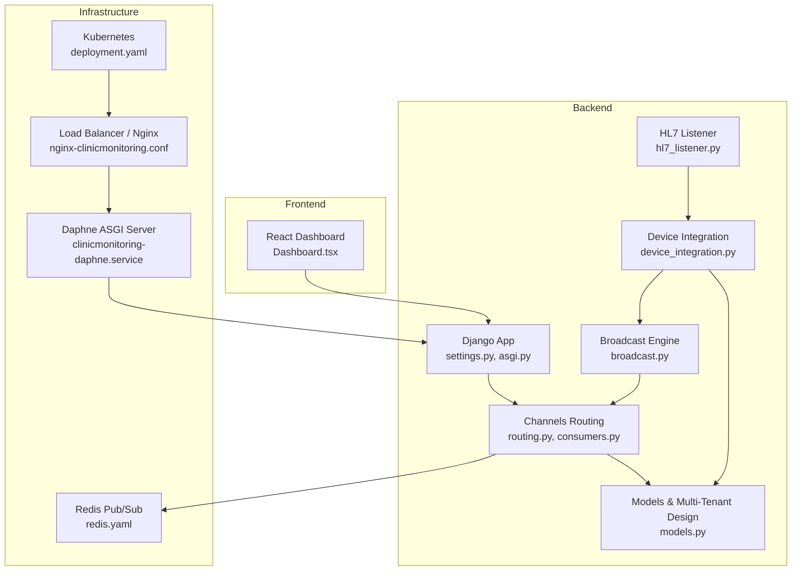
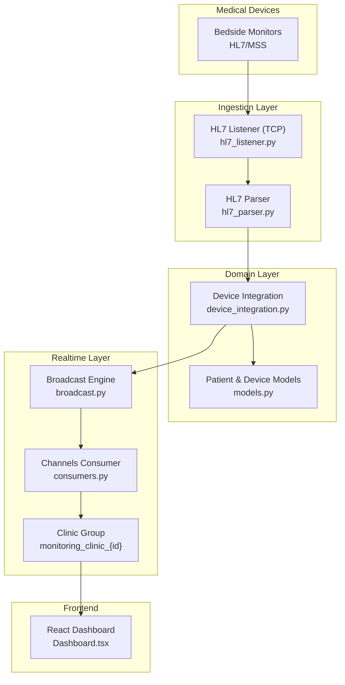
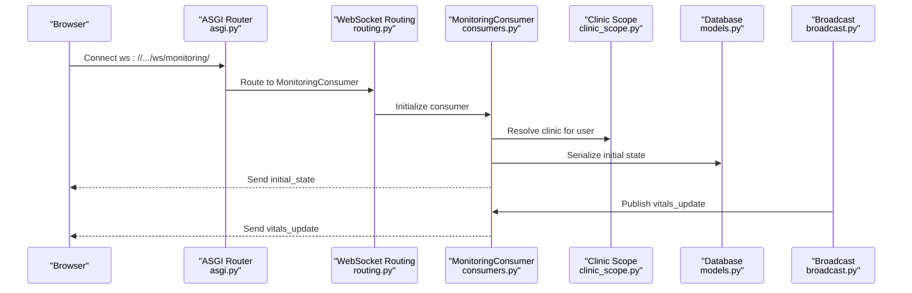
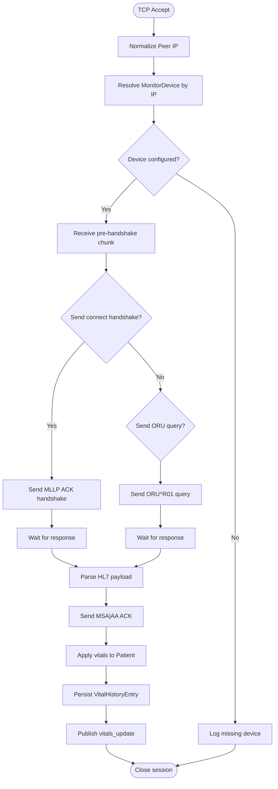
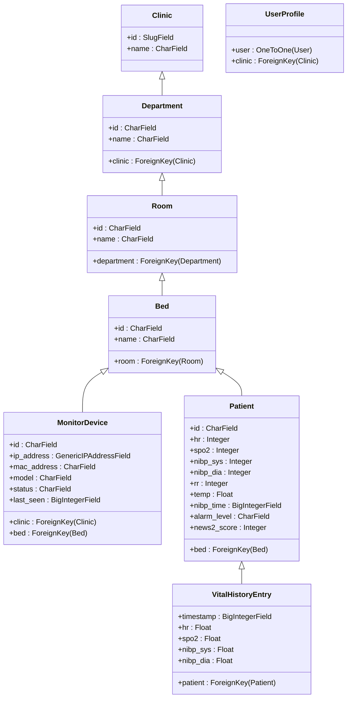
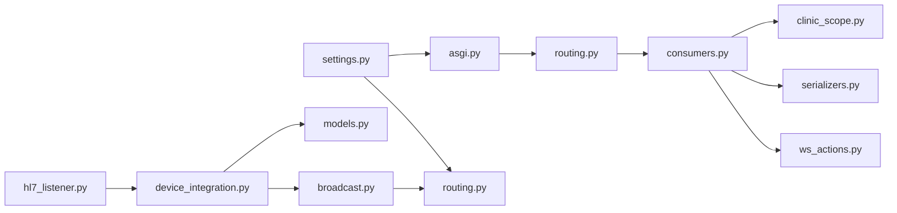
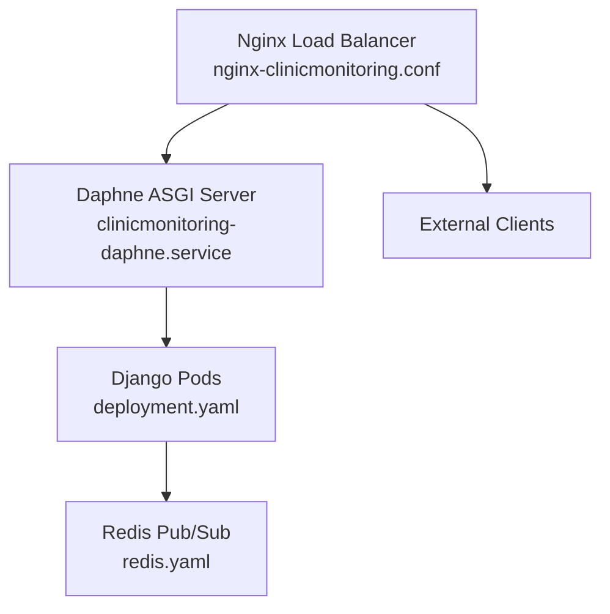

# Architecture Overview

<cite>
**Referenced Files in This Document**
- [settings.py](file://backend/medicentral/settings.py)
- [asgi.py](file://backend/medicentral/asgi.py)
- [routing.py](file://backend/monitoring/routing.py)
- [consumers.py](file://backend/monitoring/consumers.py)
- [models.py](file://backend/monitoring/models.py)
- [hl7_listener.py](file://backend/monitoring/hl7_listener.py)
- [device_integration.py](file://backend/monitoring/device_integration.py)
- [broadcast.py](file://backend/monitoring/broadcast.py)
- [clinic_scope.py](file://backend/monitoring/clinic_scope.py)
- [ws_actions.py](file://backend/monitoring/ws_actions.py)
- [deployment.yaml](file://k8s/deployment.yaml)
- [redis.yaml](file://k8s/redis.yaml)
- [nginx-clinicmonitoring.conf](file://deploy/nginx-clinicmonitoring.conf)
- [clinicmonitoring-daphne.service](file://deploy/clinicmonitoring-daphne.service)
</cite>

## Table of Contents
1. [Introduction](#introduction)
2. [Project Structure](#project-structure)
3. [Core Components](#core-components)
4. [Architecture Overview](#architecture-overview)
5. [Detailed Component Analysis](#detailed-component-analysis)
6. [Dependency Analysis](#dependency-analysis)
7. [Performance Considerations](#performance-considerations)
8. [Security Architecture](#security-architecture)
9. [Scalability and Deployment](#scalability-and-deployment)
10. [Troubleshooting Guide](#troubleshooting-guide)
11. [Conclusion](#conclusion)

## Introduction
This document presents the architecture overview of Medicentral, a mission-critical healthcare monitoring platform. The system integrates a Django backend with real-time WebSocket capabilities, a React frontend, and HL7 medical device connectivity. It employs an event-driven architecture powered by Django Channels, a multi-tenant database design for clinic isolation, and Redis-backed pub/sub messaging for scalable real-time dashboards. The data pipeline flows from HL7-enabled monitors through dedicated listeners into patient models and is broadcast to authenticated users via WebSockets. Security is enforced through session-based authentication, role-aware access controls, and HIPAA-compliant configurations. Scalability is achieved through containerized deployments, horizontal scaling, and load-balanced ingress.

## Project Structure
The repository is organized into three primary layers:
- Backend: Django application with monitoring domain logic, ASGI entrypoint, and Channels routing for WebSocket support.
- Frontend: React-based dashboard for real-time patient monitoring and administrative tasks.
- Deploy: Kubernetes manifests and deployment scripts for container orchestration and service exposure.

**Diagram sources**
- [settings.py:170-183](file://backend/medicentral/settings.py#L170-L183)
- [asgi.py:14-21](file://backend/medicentral/asgi.py#L14-L21)
- [routing.py:1-8](file://backend/monitoring/routing.py#L1-L8)
- [consumers.py:12-46](file://backend/monitoring/consumers.py#L12-L46)
- [models.py:5-224](file://backend/monitoring/models.py#L5-L224)
- [hl7_listener.py:635-755](file://backend/monitoring/hl7_listener.py#L635-L755)
- [device_integration.py:129-224](file://backend/monitoring/device_integration.py#L129-L224)
- [broadcast.py](file://backend/monitoring/broadcast.py)
- [redis.yaml](file://k8s/redis.yaml)
- [nginx-clinicmonitoring.conf](file://deploy/nginx-clinicmonitoring.conf)
- [clinicmonitoring-daphne.service](file://deploy/clinicmonitoring-daphne.service)

**Section sources**
- [settings.py:53-66](file://backend/medicentral/settings.py#L53-L66)
- [settings.py:170-183](file://backend/medicentral/settings.py#L170-L183)
- [asgi.py:1-22](file://backend/medicentral/asgi.py#L1-L22)
- [routing.py:1-8](file://backend/monitoring/routing.py#L1-L8)
- [consumers.py:12-46](file://backend/monitoring/consumers.py#L12-L46)
- [models.py:5-224](file://backend/monitoring/models.py#L5-L224)
- [hl7_listener.py:1-755](file://backend/monitoring/hl7_listener.py#L1-L755)
- [device_integration.py:1-232](file://backend/monitoring/device_integration.py#L1-L232)
- [broadcast.py](file://backend/monitoring/broadcast.py)
- [redis.yaml](file://k8s/redis.yaml)
- [nginx-clinicmonitoring.conf](file://deploy/nginx-clinicmonitoring.conf)
- [clinicmonitoring-daphne.service](file://deploy/clinicmonitoring-daphne.service)

## Core Components
- Django Backend: Provides REST APIs, authentication, and multi-tenant models for clinics, departments, rooms, beds, devices, and patients.
- Django Channels: Enables WebSocket connections for real-time dashboards with group-based broadcasting per clinic.
- HL7 Listener: A dedicated TCP server implementing MLLP to ingest HL7 vitals from bedside monitors.
- Device Integration: Translates HL7 payloads into patient vitals, updates models, and publishes events to Redis groups.
- Broadcast Engine: Routes events to the appropriate Channels group for live dashboard updates.
- Frontend Dashboard: React components for monitoring, login, and administrative modals.

Key architectural decisions:
- Event-driven real-time updates via Channels and Redis.
- Multi-tenant isolation using clinic-scoped models and group names.
- Dedicated HL7 listener for robust, protocol-specific ingestion.
- Session-based authentication with CSRF/session cookie hardening for production.

**Section sources**
- [settings.py:146-153](file://backend/medicentral/settings.py#L146-L153)
- [settings.py:170-183](file://backend/medicentral/settings.py#L170-L183)
- [models.py:5-224](file://backend/monitoring/models.py#L5-L224)
- [hl7_listener.py:635-755](file://backend/monitoring/hl7_listener.py#L635-L755)
- [device_integration.py:129-224](file://backend/monitoring/device_integration.py#L129-L224)
- [broadcast.py](file://backend/monitoring/broadcast.py)
- [consumers.py:12-46](file://backend/monitoring/consumers.py#L12-L46)

## Architecture Overview
Medicentral follows an event-driven, multi-tenant design:
- Devices stream HL7/MSS over TCP to the HL7 listener, which parses and validates payloads.
- Valid vitals are persisted to patient records and stored in history tables.
- Events are published to a Redis-backed Channel Layer, enabling fan-out to clinic-specific WebSocket groups.
- Consumers authenticate users, enforce clinic scoping, and push updates to connected dashboards.

**Diagram sources**
- [hl7_listener.py:580-634](file://backend/monitoring/hl7_listener.py#L580-L634)
- [device_integration.py:129-224](file://backend/monitoring/device_integration.py#L129-L224)
- [models.py:77-140](file://backend/monitoring/models.py#L77-L140)
- [broadcast.py](file://backend/monitoring/broadcast.py)
- [consumers.py:12-46](file://backend/monitoring/consumers.py#L12-L46)

## Detailed Component Analysis

### Real-Time WebSocket Pipeline
The WebSocket flow authenticates users, scopes them to clinic groups, and streams initial state followed by incremental updates.

**Diagram sources**
- [asgi.py:14-21](file://backend/medicentral/asgi.py#L14-L21)
- [routing.py:5-7](file://backend/monitoring/routing.py#L5-L7)
- [consumers.py:12-46](file://backend/monitoring/consumers.py#L12-L46)
- [clinic_scope.py](file://backend/monitoring/clinic_scope.py)
- [models.py:141-183](file://backend/monitoring/models.py#L141-L183)
- [broadcast.py](file://backend/monitoring/broadcast.py)

**Section sources**
- [asgi.py:1-22](file://backend/medicentral/asgi.py#L1-L22)
- [routing.py:1-8](file://backend/monitoring/routing.py#L1-L8)
- [consumers.py:12-46](file://backend/monitoring/consumers.py#L12-L46)
- [clinic_scope.py](file://backend/monitoring/clinic_scope.py)
- [broadcast.py](file://backend/monitoring/broadcast.py)

### HL7 Ingestion and Parsing
The HL7 listener implements MLLP framing, handles diverse monitor behaviors, and ensures ACK responses where required. It normalizes peer IPs, supports NAT scenarios, and logs diagnostic summaries.

**Diagram sources**
- [hl7_listener.py:426-578](file://backend/monitoring/hl7_listener.py#L426-L578)
- [hl7_listener.py:580-634](file://backend/monitoring/hl7_listener.py#L580-L634)
- [device_integration.py:129-224](file://backend/monitoring/device_integration.py#L129-L224)

**Section sources**
- [hl7_listener.py:1-755](file://backend/monitoring/hl7_listener.py#L1-L755)
- [device_integration.py:1-232](file://backend/monitoring/device_integration.py#L1-L232)

### Multi-Tenant Data Model
Multi-tenancy is enforced by associating entities with clinics and scoping queries and broadcasts accordingly.

**Diagram sources**
- [models.py:5-224](file://backend/monitoring/models.py#L5-L224)

**Section sources**
- [models.py:5-224](file://backend/monitoring/models.py#L5-L224)

## Dependency Analysis
The system exhibits clean separation of concerns:
- Django settings configure Channels Redis backend and REST framework authentication.
- ASGI routes HTTP and WebSocket traffic to appropriate handlers.
- Consumers depend on clinic scoping and serialization utilities.
- HL7 listener depends on device resolution and parser modules.
- Device integration coordinates persistence, history, and broadcasting.

**Diagram sources**
- [settings.py:170-183](file://backend/medicentral/settings.py#L170-L183)
- [asgi.py:14-21](file://backend/medicentral/asgi.py#L14-L21)
- [routing.py:1-8](file://backend/monitoring/routing.py#L1-L8)
- [consumers.py:12-46](file://backend/monitoring/consumers.py#L12-L46)
- [clinic_scope.py](file://backend/monitoring/clinic_scope.py)
- [ws_actions.py](file://backend/monitoring/ws_actions.py)
- [hl7_listener.py:580-634](file://backend/monitoring/hl7_listener.py#L580-L634)
- [device_integration.py:129-224](file://backend/monitoring/device_integration.py#L129-L224)
- [models.py:141-183](file://backend/monitoring/models.py#L141-L183)
- [broadcast.py](file://backend/monitoring/broadcast.py)

**Section sources**
- [settings.py:170-183](file://backend/medicentral/settings.py#L170-L183)
- [asgi.py:1-22](file://backend/medicentral/asgi.py#L1-L22)
- [routing.py:1-8](file://backend/monitoring/routing.py#L1-L8)
- [consumers.py:12-46](file://backend/monitoring/consumers.py#L12-L46)
- [clinic_scope.py](file://backend/monitoring/clinic_scope.py)
- [ws_actions.py](file://backend/monitoring/ws_actions.py)
- [hl7_listener.py:1-755](file://backend/monitoring/hl7_listener.py#L1-L755)
- [device_integration.py:1-232](file://backend/monitoring/device_integration.py#L1-L232)
- [models.py:1-224](file://backend/monitoring/models.py#L1-L224)
- [broadcast.py](file://backend/monitoring/broadcast.py)

## Performance Considerations
- Asynchronous I/O: Channels and Redis reduce blocking during real-time updates.
- Efficient broadcasting: Group-based Channels minimize unnecessary fan-out.
- Database indexing: Timestamp indexing on history entries supports fast retrieval.
- Connection tuning: TCP_NODELAY and keepalive optimize HL7 throughput.
- Resource limits: Container CPU/memory requests/limits in Kubernetes prevent resource contention.

[No sources needed since this section provides general guidance]

## Security Architecture
- Authentication: Session-based authentication with CSRF/session cookie hardening in production.
- Authorization: Clinic-scoped access enforced in consumers and device integration.
- Transport security: HTTPS termination at Nginx; HSTS and secure cookies configurable.
- Auditability: HL7 diagnostic logs capture session statistics and errors.
- Compliance: PHI handling governed by logging controls and environment toggles.

**Section sources**
- [settings.py:146-153](file://backend/medicentral/settings.py#L146-L153)
- [settings.py:155-166](file://backend/medicentral/settings.py#L155-L166)
- [consumers.py:12-46](file://backend/monitoring/consumers.py#L12-L46)
- [hl7_listener.py:36-71](file://backend/monitoring/hl7_listener.py#L36-L71)

## Scalability and Deployment
- Horizontal scaling: Multiple backend instances behind a load balancer; Daphne runs ASGI applications.
- Pub/Sub: Redis Channel Layer enables multi-instance fan-out and clustering.
- Kubernetes: Deployment manifests define pods, services, and resource constraints.
- Ingress: Nginx configuration terminates TLS and proxies to backend services.
- Health checks: Daphne service and readiness probes ensure smooth rolling updates.

**Diagram sources**
- [nginx-clinicmonitoring.conf](file://deploy/nginx-clinicmonitoring.conf)
- [clinicmonitoring-daphne.service](file://deploy/clinicmonitoring-daphne.service)
- [deployment.yaml](file://k8s/deployment.yaml)
- [redis.yaml](file://k8s/redis.yaml)

**Section sources**
- [nginx-clinicmonitoring.conf](file://deploy/nginx-clinicmonitoring.conf)
- [clinicmonitoring-daphne.service](file://deploy/clinicmonitoring-daphne.service)
- [deployment.yaml](file://k8s/deployment.yaml)
- [redis.yaml](file://k8s/redis.yaml)

## Troubleshooting Guide
Common operational diagnostics:
- HL7 listener status: Retrieve listener configuration and bind status for troubleshooting.
- Empty sessions: Investigate handshake/query behavior and firewall/NAT issues.
- Device resolution: Verify device IP fields and NAT fallback settings.
- WebSocket authentication: Confirm user session and clinic association.

Operational commands and utilities:
- HL7 audit and diagnostics: Management commands for HL7 health checks and resets.
- Remote deployment and restart scripts: Automate updates and service restarts.

**Section sources**
- [hl7_listener.py:723-735](file://backend/monitoring/hl7_listener.py#L723-L735)
- [hl7_listener.py:510-541](file://backend/monitoring/hl7_listener.py#L510-L541)
- [device_integration.py:31-78](file://backend/monitoring/device_integration.py#L31-L78)
- [monitoring/management/commands/hl7_audit.py](file://backend/monitoring/management/commands/hl7_audit.py)
- [monitoring/management/commands/reset_monitoring_fresh.py](file://backend/monitoring/management/commands/reset_monitoring_fresh.py)
- [deploy/remote_deploy.sh](file://deploy/remote_deploy.sh)
- [deploy/remote_full_update.sh](file://deploy/remote_full_update.sh)

## Conclusion
Medicentral’s architecture balances real-time responsiveness with robust multi-tenant isolation. The HL7-focused ingestion layer, event-driven Channels pub/sub, and disciplined security controls enable reliable, HIPAA-aware operation. Kubernetes and Redis provide scalable infrastructure, while Daphne and Nginx deliver resilient ingress and application hosting. Together, these components support mission-critical monitoring with predictable performance and maintainable operations.