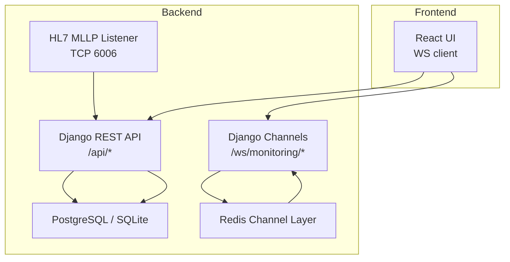
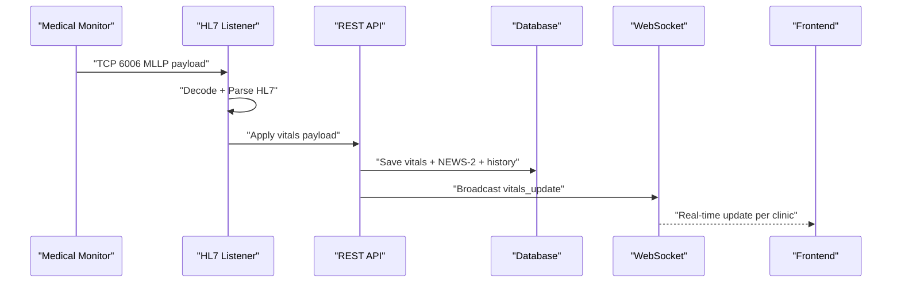
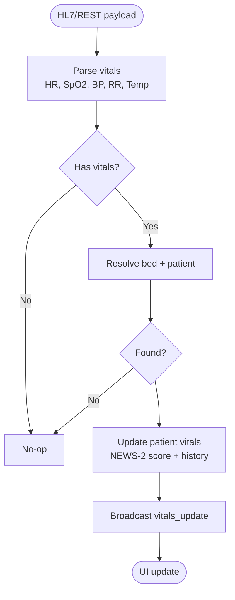
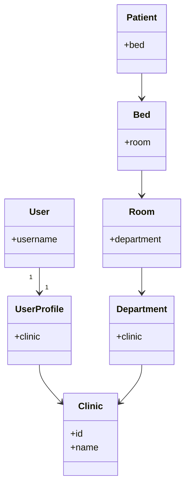
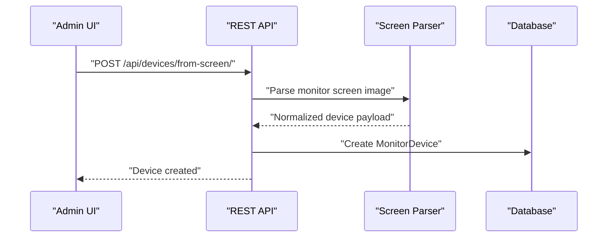
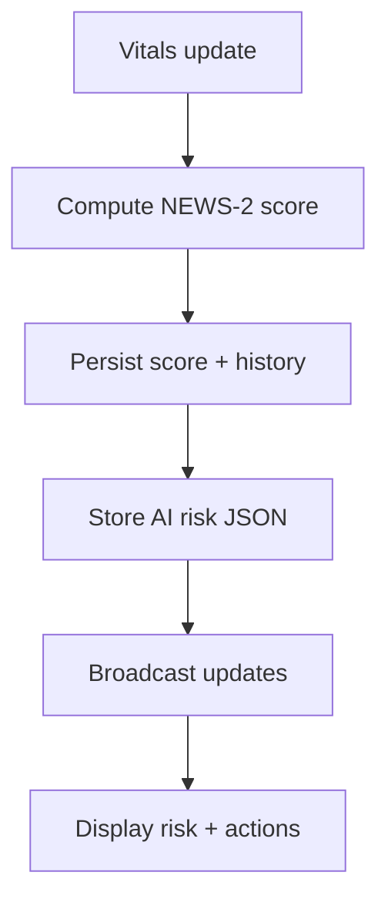
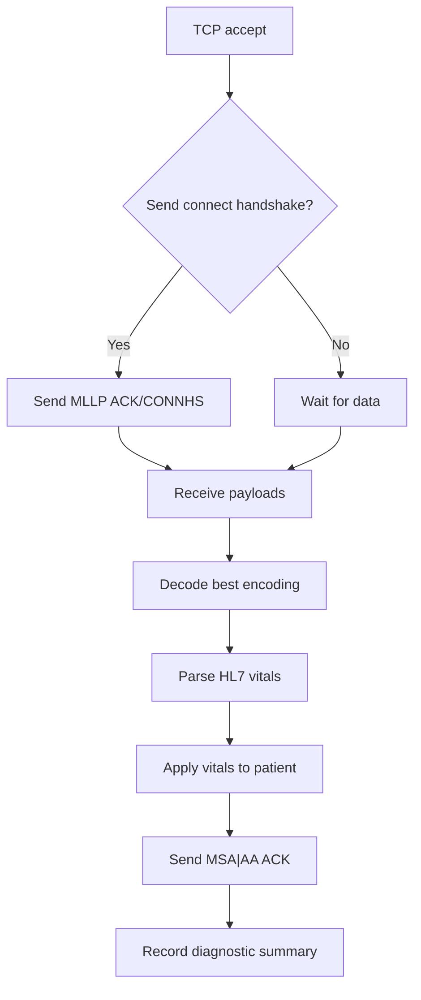
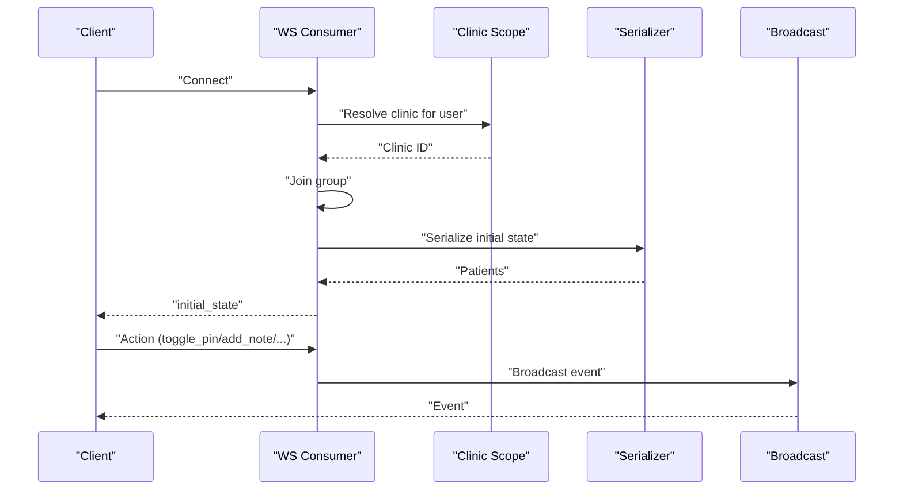
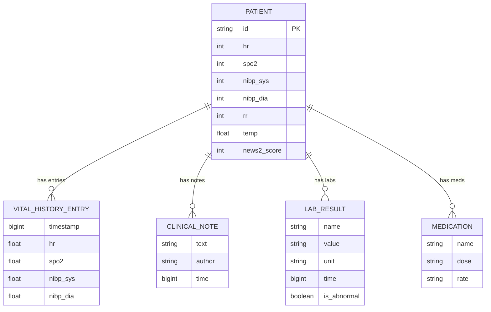
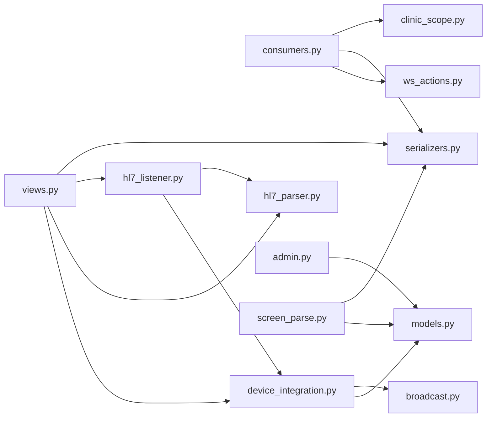

# Key Features & Capabilities

<cite>
**Referenced Files in This Document**
- [README.md](file://README.md)
- [models.py](file://backend/monitoring/models.py)
- [consumers.py](file://backend/monitoring/consumers.py)
- [broadcast.py](file://backend/monitoring/broadcast.py)
- [views.py](file://backend/monitoring/views.py)
- [admin.py](file://backend/monitoring/admin.py)
- [device_integration.py](file://backend/monitoring/device_integration.py)
- [hl7_listener.py](file://backend/monitoring/hl7_listener.py)
- [hl7_parser.py](file://backend/monitoring/hl7_parser.py)
- [ws_actions.py](file://backend/monitoring/ws_actions.py)
- [clinic_scope.py](file://backend/monitoring/clinic_scope.py)
- [screen_parse.py](file://backend/monitoring/screen_parse.py)
- [serializers.py](file://backend/monitoring/serializers.py)
</cite>

## Table of Contents
1. [Introduction](#introduction)
2. [Project Structure](#project-structure)
3. [Core Components](#core-components)
4. [Architecture Overview](#architecture-overview)
5. [Detailed Component Analysis](#detailed-component-analysis)
6. [Dependency Analysis](#dependency-analysis)
7. [Performance Considerations](#performance-considerations)
8. [Troubleshooting Guide](#troubleshooting-guide)
9. [Conclusion](#conclusion)

## Introduction
This document presents Medicentral’s core capabilities with a focus on real-time patient monitoring, multi-clinic tenant isolation, role-based access control, administrative device management, AI-powered risk prediction via NEWS-2 scoring, HL7/MLLP integration, WebSocket-based real-time communication, and comprehensive patient history tracking. It also outlines administrative features such as user management, device configuration, and system monitoring. Practical examples demonstrate how each feature improves clinical workflows and patient safety.

## Project Structure
The system comprises:
- Backend: Django REST Framework + Django Channels + Daphne for WebSocket messaging
- Frontend: React/Vite UI
- HL7 MLLP listener for real-time medical device integration
- Redis-backed channel layer for scalable WebSocket broadcasting
- Administrative interface for device and user management

**Diagram sources**
- [README.md:89-96](file://README.md#L89-L96)
- [consumers.py:12-36](file://backend/monitoring/consumers.py#L12-L36)
- [hl7_listener.py:691-708](file://backend/monitoring/hl7_listener.py#L691-L708)

**Section sources**
- [README.md:11-16](file://README.md#L11-L16)
- [README.md:38-47](file://README.md#L38-L47)
- [README.md:89-96](file://README.md#L89-L96)

## Core Components
- Real-time patient vitals monitoring (HR, SpO2, BP, RR, temperature) with automatic alarm thresholds
- Multi-clinic tenant isolation and role-based access control
- Administrative device management and configuration
- AI-powered risk prediction using NEWS-2 scoring and clinical decision support
- HL7/MLLP integration and WebSocket-based real-time communication
- Comprehensive patient history tracking and administrative monitoring

**Section sources**
- [models.py:141-183](file://backend/monitoring/models.py#L141-L183)
- [models.py:77-139](file://backend/monitoring/models.py#L77-L139)
- [views.py:360-369](file://backend/monitoring/views.py#L360-L369)
- [ws_actions.py:32-229](file://backend/monitoring/ws_actions.py#L32-L229)
- [device_integration.py:129-225](file://backend/monitoring/device_integration.py#L129-L225)
- [hl7_parser.py:423-453](file://backend/monitoring/hl7_parser.py#L423-L453)

## Architecture Overview
Medicentral integrates HL7-capable monitors via a dedicated MLLP listener, parses vitals, updates patient records, and broadcasts live updates to authenticated users within their clinic scope. Administrative endpoints enable device configuration, user management, and system diagnostics.

**Diagram sources**
- [hl7_listener.py:533-587](file://backend/monitoring/hl7_listener.py#L533-L587)
- [device_integration.py:129-225](file://backend/monitoring/device_integration.py#L129-L225)
- [broadcast.py:10-20](file://backend/monitoring/broadcast.py#L10-L20)
- [consumers.py:35-36](file://backend/monitoring/consumers.py#L35-L36)

## Detailed Component Analysis

### Real-time Patient Vitals Monitoring
- Vitals ingestion: HL7 MLLP payloads and REST endpoints
- Automatic alarm thresholds: configurable per patient and acknowledged via WebSocket actions
- Real-time updates: serialized patient state delivered to clinic-scoped groups

**Diagram sources**
- [hl7_parser.py:423-453](file://backend/monitoring/hl7_parser.py#L423-L453)
- [device_integration.py:129-225](file://backend/monitoring/device_integration.py#L129-L225)
- [broadcast.py:10-20](file://backend/monitoring/broadcast.py#L10-L20)

Practical example:
- A monitor sends an HL7 ORU^R01 containing SpO2 and HR. The listener decodes, applies vitals to the patient record, recalculates NEWS-2, logs a history entry, and broadcasts the update to the clinic’s WebSocket group. The frontend displays the latest values and color-coded status.

**Section sources**
- [hl7_parser.py:19-66](file://backend/monitoring/hl7_parser.py#L19-L66)
- [hl7_parser.py:423-453](file://backend/monitoring/hl7_parser.py#L423-L453)
- [device_integration.py:129-225](file://backend/monitoring/device_integration.py#L129-L225)
- [models.py:141-183](file://backend/monitoring/models.py#L141-L183)

### Multi-clinic Tenant Isolation and Role-based Access Control
- Tenant isolation: clinic-scoped querysets and WebSocket groups
- RBAC: user profiles bound to clinics; superusers access all; regular users scoped to their clinic
- Administrative boundaries: admin site filters by clinic; REST endpoints enforce clinic membership

**Diagram sources**
- [models.py:5-15](file://backend/monitoring/models.py#L5-L15)
- [models.py:18-37](file://backend/monitoring/models.py#L18-L37)
- [models.py:40-53](file://backend/monitoring/models.py#L40-L53)
- [models.py:56-65](file://backend/monitoring/models.py#L56-L65)
- [models.py:68-76](file://backend/monitoring/models.py#L68-L76)
- [models.py:141-183](file://backend/monitoring/models.py#L141-L183)

Practical example:
- A nurse logs in and views the dashboard; the backend resolves their clinic via profile, serializes only patients admitted to rooms within that clinic, and connects them to the clinic-specific WebSocket group. Superusers see all clinics.

**Section sources**
- [admin.py:23-73](file://backend/monitoring/admin.py#L23-L73)
- [clinic_scope.py:15-30](file://backend/monitoring/clinic_scope.py#L15-L30)
- [views.py:360-369](file://backend/monitoring/views.py#L360-L369)
- [consumers.py:18-29](file://backend/monitoring/consumers.py#L18-L29)

### Administrative Device Management
- Device registration: REST endpoint supports manual creation and image-based parsing
- Device configuration: IP, MAC, model, HL7 enable/port, peer IP, NAT fallback, and bed assignment
- Connectivity checks: diagnostic status, firewall hints, and timeout thresholds
- Operational controls: mark online, connection check, and HL7 listener status

**Diagram sources**
- [views.py:259-307](file://backend/monitoring/views.py#L259-L307)
- [screen_parse.py:58-114](file://backend/monitoring/screen_parse.py#L58-L114)
- [screen_parse.py:117-160](file://backend/monitoring/screen_parse.py#L117-L160)
- [serializers.py:146-282](file://backend/monitoring/serializers.py#L146-L282)

Practical example:
- An administrator uploads a monitor screen image; the system extracts server IP, local IP, port, and MAC address, normalizes them, and creates a device record associated with the clinic and bed. The device can be toggled online and checked for connectivity.

**Section sources**
- [views.py:47-58](file://backend/monitoring/views.py#L47-L58)
- [views.py:59-257](file://backend/monitoring/views.py#L59-L257)
- [screen_parse.py:58-114](file://backend/monitoring/screen_parse.py#L58-L114)
- [serializers.py:146-282](file://backend/monitoring/serializers.py#L146-L282)

### AI-Powered Risk Prediction and Clinical Decision Support
- NEWS-2 scoring: computed automatically upon vitals updates
- AI risk: stored as structured JSON for downstream use
- Decision support: WebSocket actions enable acknowledging/clearing alarms, setting schedules, and adding notes

**Diagram sources**
- [device_integration.py:192-201](file://backend/monitoring/device_integration.py#L192-L201)
- [models.py:177-178](file://backend/monitoring/models.py#L177-L178)
- [ws_actions.py:31-127](file://backend/monitoring/ws_actions.py#L31-L127)

Practical example:
- Upon receiving new vitals, the system computes the NEWS-2 score and stores it with the patient record. The frontend receives the update and displays the score and risk level, enabling timely clinical decisions.

**Section sources**
- [device_integration.py:192-201](file://backend/monitoring/device_integration.py#L192-L201)
- [ws_actions.py:69-81](file://backend/monitoring/ws_actions.py#L69-L81)
- [ws_actions.py:129-140](file://backend/monitoring/ws_actions.py#L129-L140)

### HL7/MLLP Medical Device Integration
- MLLP listener: robust TCP accept loop, handshake handling, and payload extraction
- Parser: multi-encoding decoding, OBX parsing, and fallback heuristics
- Diagnostics: session summaries, bind errors, and firewall hints
- Operational controls: enable/disable, timeouts, and NAT single-device fallback

**Diagram sources**
- [hl7_listener.py:405-531](file://backend/monitoring/hl7_listener.py#L405-L531)
- [hl7_listener.py:533-587](file://backend/monitoring/hl7_listener.py#L533-L587)
- [hl7_parser.py:487-530](file://backend/monitoring/hl7_parser.py#L487-L530)

Practical example:
- A monitor initiates a TCP connection; the listener optionally sends a connect handshake, receives HL7 payloads, decodes and parses vitals, applies them to the patient, and acknowledges receipt. The system records diagnostic metrics for troubleshooting.

**Section sources**
- [hl7_listener.py:36-71](file://backend/monitoring/hl7_listener.py#L36-L71)
- [hl7_listener.py:533-587](file://backend/monitoring/hl7_listener.py#L533-L587)
- [hl7_parser.py:423-453](file://backend/monitoring/hl7_parser.py#L423-L453)

### WebSocket-based Real-time Communication
- Authentication: WS consumer validates user and clinic membership
- Grouping: clinic-scoped groups isolate tenants
- Initial state: WS sends serialized patient list on connect
- Bidirectional actions: pin, add note, acknowledge/clear alarms, set schedules, admit/discharge

**Diagram sources**
- [consumers.py:13-36](file://backend/monitoring/consumers.py#L13-L36)
- [clinic_scope.py:15-30](file://backend/monitoring/clinic_scope.py#L15-L30)
- [views.py:360-369](file://backend/monitoring/views.py#L360-L369)
- [broadcast.py:10-20](file://backend/monitoring/broadcast.py#L10-L20)
- [ws_actions.py:32-229](file://backend/monitoring/ws_actions.py#L32-L229)

Practical example:
- A clinician opens the dashboard; the WS consumer authenticates, joins the clinic group, and receives the initial patient state. Subsequent vitals updates and actions (e.g., adding a note) are broadcast to the group in real time.

**Section sources**
- [consumers.py:12-46](file://backend/monitoring/consumers.py#L12-L46)
- [broadcast.py:10-20](file://backend/monitoring/broadcast.py#L10-L20)
- [ws_actions.py:32-229](file://backend/monitoring/ws_actions.py#L32-L229)

### Comprehensive Patient History Tracking
- History entries: periodic snapshots of vitals with timestamps
- Limits: configurable alarm thresholds per patient
- Notes, labs, medications: integrated for holistic care

**Diagram sources**
- [models.py:141-183](file://backend/monitoring/models.py#L141-L183)
- [models.py:214-224](file://backend/monitoring/models.py#L214-L224)
- [models.py:196-212](file://backend/monitoring/models.py#L196-L212)
- [models.py:185-194](file://backend/monitoring/models.py#L185-L194)
- [models.py:206-212](file://backend/monitoring/models.py#L206-L212)

Practical example:
- Each vitals update creates a history entry with the current values and timestamp. The frontend can render trends and correlate with notes and lab results for comprehensive monitoring.

**Section sources**
- [device_integration.py:204-219](file://backend/monitoring/device_integration.py#L204-L219)
- [models.py:214-224](file://backend/monitoring/models.py#L214-L224)

### Administrative Features
- User management: Django admin integrates with monitoring profiles; users linked to clinics
- Device configuration: REST endpoints for creation, connection checks, and operational controls
- System monitoring: HL7 listener status, diagnostic summaries, and firewall hints

Practical example:
- An administrator configures a device by uploading a screen image or via REST, assigns it to a bed, and verifies connectivity using the connection-check endpoint. The system provides actionable hints for firewall and HL7 configuration.

**Section sources**
- [admin.py:23-73](file://backend/monitoring/admin.py#L23-L73)
- [views.py:59-257](file://backend/monitoring/views.py#L59-L257)
- [views.py:309-356](file://backend/monitoring/views.py#L309-L356)

## Dependency Analysis
The following diagram highlights key module dependencies and interactions across the backend.

**Diagram sources**
- [consumers.py:7-9](file://backend/monitoring/consumers.py#L7-L9)
- [views.py:16-25](file://backend/monitoring/views.py#L16-L25)
- [hl7_listener.py:533-587](file://backend/monitoring/hl7_listener.py#L533-L587)
- [device_integration.py:14-18](file://backend/monitoring/device_integration.py#L14-L18)

**Section sources**
- [consumers.py:12-46](file://backend/monitoring/consumers.py#L12-L46)
- [views.py:16-25](file://backend/monitoring/views.py#L16-L25)
- [hl7_listener.py:533-587](file://backend/monitoring/hl7_listener.py#L533-L587)
- [device_integration.py:14-18](file://backend/monitoring/device_integration.py#L14-L18)

## Performance Considerations
- Asynchronous broadcasting: Django Channels with Redis ensures scalable fan-out to clinic groups
- Efficient parsing: multi-encoding detection and fallback heuristics minimize retries
- History pruning: recent history capped to reduce storage overhead
- Connection timeouts: configurable receive timeouts and device timeout thresholds prevent stale states

[No sources needed since this section provides general guidance]

## Troubleshooting Guide
Common scenarios and remedies:
- HL7 listener not accepting connections:
  - Verify port binding and firewall rules; use connection-check endpoint for diagnostics
- No HL7 payloads despite TCP sessions:
  - Confirm monitor configuration, HL7 enable flag, and optional connect handshake
- Device appears online but no vitals:
  - Ensure device is assigned to a bed with an admitted patient; check data timeout thresholds
- NAT environments:
  - Enable single-device fallback and configure peer IP resolution

**Section sources**
- [views.py:59-257](file://backend/monitoring/views.py#L59-L257)
- [hl7_listener.py:676-689](file://backend/monitoring/hl7_listener.py#L676-L689)
- [hl7_listener.py:36-71](file://backend/monitoring/hl7_listener.py#L36-L71)

## Conclusion
Medicentral delivers a robust, tenant-isolated platform for real-time patient monitoring, seamless HL7 integration, and intelligent risk prediction. Its administrative tools streamline device configuration and system oversight, while WebSocket-driven updates keep clinical teams informed. Together, these capabilities enhance workflow efficiency and patient safety across multi-clinic deployments.