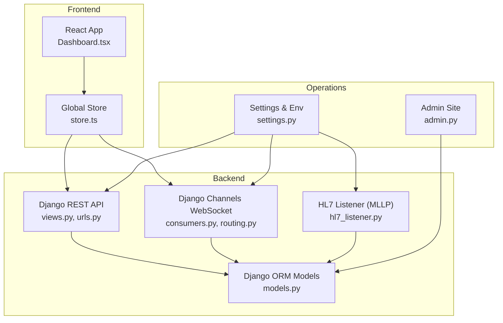
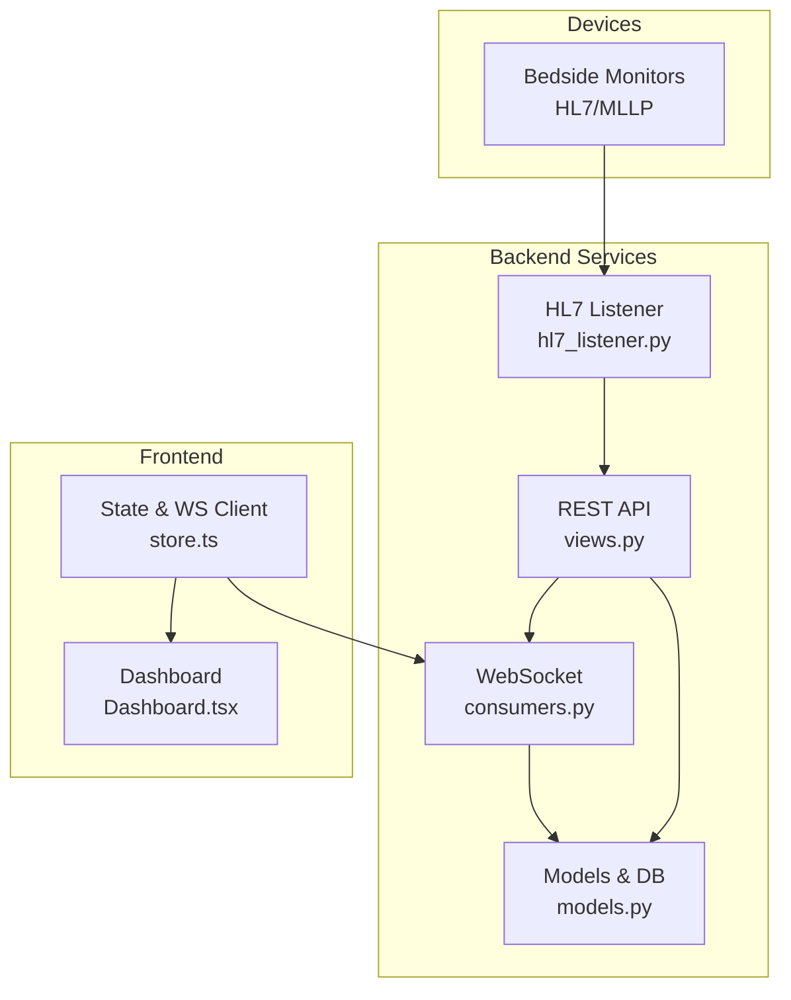
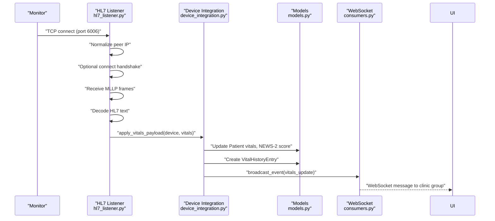
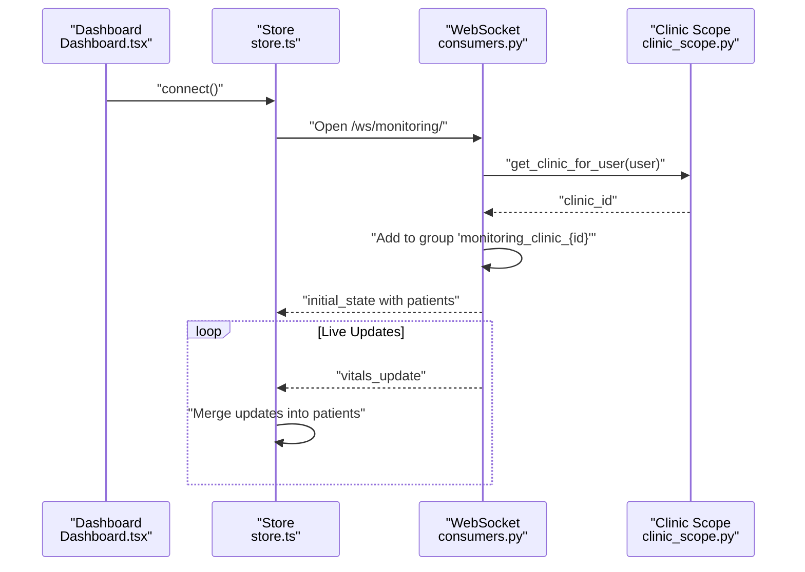
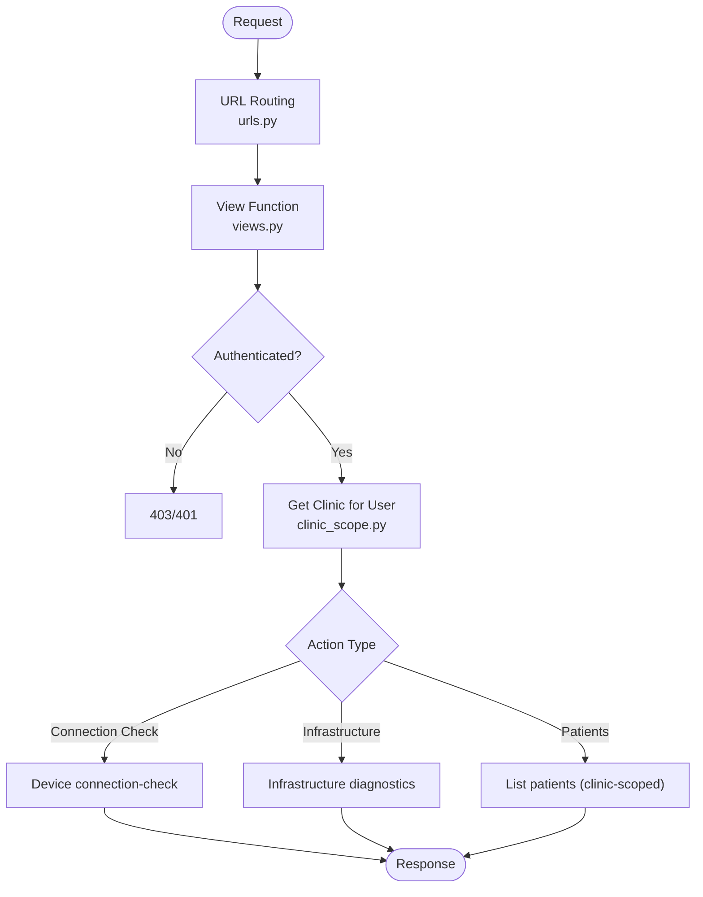
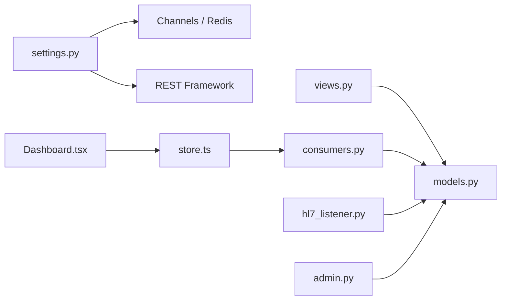

# Project Overview

<cite>
**Referenced Files in This Document**
- [README.md](file://README.md)
- [architecture.md](file://architecture.md)
- [backend/medicentral/settings.py](file://backend/medicentral/settings.py)
- [backend/monitoring/models.py](file://backend/monitoring/models.py)
- [backend/monitoring/admin.py](file://backend/monitoring/admin.py)
- [backend/monitoring/urls.py](file://backend/monitoring/urls.py)
- [backend/monitoring/routing.py](file://backend/monitoring/routing.py)
- [backend/monitoring/consumers.py](file://backend/monitoring/consumers.py)
- [backend/monitoring/views.py](file://backend/monitoring/views.py)
- [backend/monitoring/device_integration.py](file://backend/monitoring/device_integration.py)
- [backend/monitoring/hl7_listener.py](file://backend/monitoring/hl7_listener.py)
- [backend/monitoring/clinic_scope.py](file://backend/monitoring/clinic_scope.py)
- [frontend/src/App.tsx](file://frontend/src/App.tsx)
- [frontend/src/components/Dashboard.tsx](file://frontend/src/components/Dashboard.tsx)
- [frontend/src/store.ts](file://frontend/src/store.ts)
</cite>

## Table of Contents
1. [Introduction](#introduction)
2. [Project Structure](#project-structure)
3. [Core Components](#core-components)
4. [Architecture Overview](#architecture-overview)
5. [Detailed Component Analysis](#detailed-component-analysis)
6. [Dependency Analysis](#dependency-analysis)
7. [Performance Considerations](#performance-considerations)
8. [Troubleshooting Guide](#troubleshooting-guide)
9. [Conclusion](#conclusion)
10. [Appendices](#appendices)

## Introduction
Medicentral is a real-time patient vitals monitoring platform designed for healthcare facilities to continuously observe and alert on critical changes in patient conditions. It integrates seamlessly with medical device ecosystems using HL7/MLLP protocols, supports multi-clinic tenant isolation, and provides an intuitive dashboard for clinicians. The system emphasizes mission-critical reliability for 24/7 monitoring, with built-in diagnostics and operational controls to maintain uptime and data integrity.

Key capabilities:
- Real-time vitals ingestion from bedside monitors via HL7/MLLP
- Multi-clinic tenant isolation for secure, independent operations
- Live dashboard with severity-based alerts and AI-powered risk predictions
- WebSocket-based live updates and administrative controls
- Operational tooling for HL7 connectivity checks and diagnostics

## Project Structure
The repository is organized into a full-stack application:
- Backend: Django-based REST API and WebSocket server with HL7 listener
- Frontend: React-based dashboard with real-time updates
- DevOps: Docker, Kubernetes manifests, and CI/CD workflows



**Diagram sources**
- [backend/monitoring/views.py:1-419](file://backend/monitoring/views.py#L1-L419)
- [backend/monitoring/urls.py:1-24](file://backend/monitoring/urls.py#L1-L24)
- [backend/monitoring/consumers.py:1-46](file://backend/monitoring/consumers.py#L1-L46)
- [backend/monitoring/routing.py:1-8](file://backend/monitoring/routing.py#L1-L8)
- [backend/monitoring/models.py:1-224](file://backend/monitoring/models.py#L1-L224)
- [backend/monitoring/hl7_listener.py:1-677](file://backend/monitoring/hl7_listener.py#L1-L677)
- [backend/monitoring/admin.py:1-73](file://backend/monitoring/admin.py#L1-L73)
- [backend/medicentral/settings.py:1-218](file://backend/medicentral/settings.py#L1-L218)
- [frontend/src/components/Dashboard.tsx:1-429](file://frontend/src/components/Dashboard.tsx#L1-L429)
- [frontend/src/store.ts:1-353](file://frontend/src/store.ts#L1-L353)

**Section sources**
- [README.md:1-110](file://README.md#L1-L110)
- [architecture.md:1-42](file://architecture.md#L1-L42)

## Core Components
- HL7/MLLP Ingestion: A dedicated TCP listener accepts HL7 messages from monitors, validates and parses payloads, and persists vitals to the database while broadcasting updates to the dashboard.
- Multi-clinic Tenant Isolation: Users are associated with a clinic; all data access and WebSocket groups are scoped to the user’s clinic to ensure separation of duties and data privacy.
- Real-time Dashboard: The React frontend connects to the WebSocket to receive live updates, displays vitals and alarms, and allows clinicians to manage schedules, notes, and alerts.
- Administrative Controls: REST endpoints expose device connection checks, infrastructure diagnostics, and administrative actions for devices and patients.

Practical examples:
- A monitor sends vitals over HL7/MLLP; the backend resolves the device by IP, applies vitals to the patient on the assigned bed, and broadcasts updates to the clinic’s WebSocket group.
- A clinician opens the dashboard and sees real-time vitals with color-coded severity; they can adjust alarm limits, pin critical patients, and mute audio alerts.

**Section sources**
- [backend/monitoring/hl7_listener.py:1-677](file://backend/monitoring/hl7_listener.py#L1-L677)
- [backend/monitoring/device_integration.py:1-232](file://backend/monitoring/device_integration.py#L1-L232)
- [backend/monitoring/clinic_scope.py:1-30](file://backend/monitoring/clinic_scope.py#L1-L30)
- [backend/monitoring/consumers.py:1-46](file://backend/monitoring/consumers.py#L1-L46)
- [frontend/src/components/Dashboard.tsx:1-429](file://frontend/src/components/Dashboard.tsx#L1-L429)
- [backend/monitoring/views.py:1-419](file://backend/monitoring/views.py#L1-L419)

## Architecture Overview
Medicentral follows a cohesive full-stack design with clear separation of concerns:
- Backend: Django REST API and Django Channels WebSocket server
- Frontend: React SPA with Zustand for state and WebSocket client
- Data: Django ORM models representing clinics, departments, rooms, beds, devices, patients, and vitals history
- Protocols: HL7/MLLP for monitor integration; WebSocket for live UI updates



**Diagram sources**
- [backend/monitoring/hl7_listener.py:1-677](file://backend/monitoring/hl7_listener.py#L1-L677)
- [backend/monitoring/views.py:1-419](file://backend/monitoring/views.py#L1-L419)
- [backend/monitoring/consumers.py:1-46](file://backend/monitoring/consumers.py#L1-L46)
- [backend/monitoring/models.py:1-224](file://backend/monitoring/models.py#L1-L224)
- [frontend/src/components/Dashboard.tsx:1-429](file://frontend/src/components/Dashboard.tsx#L1-L429)
- [frontend/src/store.ts:1-353](file://frontend/src/store.ts#L1-L353)

## Detailed Component Analysis

### HL7/MLLP Ingestion Pipeline
The HL7 listener accepts TCP connections, normalizes peer IPs, optionally sends a connect handshake for certain monitors, extracts MLLP frames, decodes HL7 text, and applies vitals to the patient record. It records diagnostic metrics and updates device status.



**Diagram sources**
- [backend/monitoring/hl7_listener.py:1-677](file://backend/monitoring/hl7_listener.py#L1-L677)
- [backend/monitoring/device_integration.py:1-232](file://backend/monitoring/device_integration.py#L1-L232)
- [backend/monitoring/models.py:1-224](file://backend/monitoring/models.py#L1-L224)
- [backend/monitoring/consumers.py:1-46](file://backend/monitoring/consumers.py#L1-L46)

**Section sources**
- [backend/monitoring/hl7_listener.py:1-677](file://backend/monitoring/hl7_listener.py#L1-L677)
- [backend/monitoring/device_integration.py:1-232](file://backend/monitoring/device_integration.py#L1-L232)

### Multi-clinic Tenant Isolation
Tenant isolation is enforced via user profiles linked to clinics, clinic-scoped querysets, and WebSocket group names derived from clinic IDs. Admins can manage clinics, departments, rooms, beds, and devices per clinic.

```mermaid
classDiagram
class User {
+username
}
class UserProfile {
+user
+clinic
}
class Clinic {
+id
+name
}
class Department {
+id
+name
+clinic
}
class Room {
+id
+name
+department
}
class Bed {
+id
+name
+room
}
class MonitorDevice {
+id
+ip_address
+bed
+status
}
class Patient {
+id
+name
+bed
+alarm_level
}
User --> UserProfile : "OneToOne"
UserProfile --> Clinic : "FK"
Clinic ||--o{ Department : "departments"
Department ||--o{ Room : "rooms"
Room ||--o{ Bed : "beds"
Bed ||--o{ MonitorDevice : "devices"
Bed ||--o{ Patient : "patients"
```

**Diagram sources**
- [backend/monitoring/models.py:1-224](file://backend/monitoring/models.py#L1-L224)
- [backend/monitoring/admin.py:1-73](file://backend/monitoring/admin.py#L1-L73)
- [backend/monitoring/clinic_scope.py:1-30](file://backend/monitoring/clinic_scope.py#L1-L30)

**Section sources**
- [backend/monitoring/clinic_scope.py:1-30](file://backend/monitoring/clinic_scope.py#L1-L30)
- [backend/monitoring/admin.py:1-73](file://backend/monitoring/admin.py#L1-L73)
- [backend/monitoring/models.py:1-224](file://backend/monitoring/models.py#L1-L224)

### Real-time Dashboard and WebSocket Updates
The React dashboard initializes a WebSocket connection to the backend, receives initial state and incremental updates, and renders vitals and alarms. The backend authenticates users, scopes them to a clinic, and broadcasts updates to the clinic-specific group.



**Diagram sources**
- [frontend/src/components/Dashboard.tsx:1-429](file://frontend/src/components/Dashboard.tsx#L1-L429)
- [frontend/src/store.ts:1-353](file://frontend/src/store.ts#L1-L353)
- [backend/monitoring/consumers.py:1-46](file://backend/monitoring/consumers.py#L1-L46)
- [backend/monitoring/clinic_scope.py:1-30](file://backend/monitoring/clinic_scope.py#L1-L30)

**Section sources**
- [frontend/src/components/Dashboard.tsx:1-429](file://frontend/src/components/Dashboard.tsx#L1-L429)
- [frontend/src/store.ts:1-353](file://frontend/src/store.ts#L1-L353)
- [backend/monitoring/consumers.py:1-46](file://backend/monitoring/consumers.py#L1-L46)

### REST API and Administrative Controls
The backend exposes REST endpoints for departments, rooms, beds, devices, and patients, along with administrative utilities such as connection checks for devices and infrastructure diagnostics. Authentication is session-based and permissions are enforced per clinic.



**Diagram sources**
- [backend/monitoring/urls.py:1-24](file://backend/monitoring/urls.py#L1-L24)
- [backend/monitoring/views.py:1-419](file://backend/monitoring/views.py#L1-L419)
- [backend/monitoring/clinic_scope.py:1-30](file://backend/monitoring/clinic_scope.py#L1-L30)

**Section sources**
- [backend/monitoring/urls.py:1-24](file://backend/monitoring/urls.py#L1-L24)
- [backend/monitoring/views.py:1-419](file://backend/monitoring/views.py#L1-L419)

## Dependency Analysis
- Backend dependencies:
  - Django for ORM and REST framework
  - Django Channels for WebSocket support
  - Redis-backed channel layers for horizontal scaling
  - Environment-driven configuration for security and runtime behavior
- Frontend dependencies:
  - React with TypeScript
  - Zustand for efficient state management
  - WebSocket client for real-time updates
- Operations:
  - Admin site for managing clinics, devices, and patients
  - HL7 listener process for TCP/MLLP ingestion



**Diagram sources**
- [backend/medicentral/settings.py:1-218](file://backend/medicentral/settings.py#L1-L218)
- [backend/monitoring/views.py:1-419](file://backend/monitoring/views.py#L1-L419)
- [backend/monitoring/consumers.py:1-46](file://backend/monitoring/consumers.py#L1-L46)
- [backend/monitoring/hl7_listener.py:1-677](file://backend/monitoring/hl7_listener.py#L1-L677)
- [backend/monitoring/models.py:1-224](file://backend/monitoring/models.py#L1-L224)
- [backend/monitoring/admin.py:1-73](file://backend/monitoring/admin.py#L1-L73)
- [frontend/src/store.ts:1-353](file://frontend/src/store.ts#L1-L353)
- [frontend/src/components/Dashboard.tsx:1-429](file://frontend/src/components/Dashboard.tsx#L1-L429)

**Section sources**
- [backend/medicentral/settings.py:1-218](file://backend/medicentral/settings.py#L1-L218)
- [backend/monitoring/models.py:1-224](file://backend/monitoring/models.py#L1-L224)
- [backend/monitoring/admin.py:1-73](file://backend/monitoring/admin.py#L1-L73)

## Performance Considerations
- WebSocket throughput: The React store efficiently merges incremental updates, minimizing re-renders and maintaining responsiveness during frequent updates.
- Database writes: Vitals are persisted with atomic transactions and capped history entries to control storage growth.
- HL7 ingestion: The listener buffers and parses frames incrementally, with timeouts and diagnostics to handle transient network issues.
- Horizontal scaling: Channel layers backed by Redis enable multiple backend instances to share WebSocket state.

[No sources needed since this section provides general guidance]

## Troubleshooting Guide
Common operational checks and remedies:
- HL7 connectivity:
  - Verify the HL7 listener is enabled and bound to the correct host/port
  - Confirm firewall allows inbound TCP 6006 and that the monitor targets the server’s public IP and port
  - Use the device connection-check endpoint to inspect last-seen timestamps and diagnostic summaries
- Device assignment:
  - Ensure a device is assigned to a bed and a patient is admitted to that bed
  - If vitals appear as “on-line” but no data arrives, confirm the monitor is sending HL7/MSH segments
- WebSocket status:
  - The dashboard indicates online/offline status; if disconnected, the client attempts automatic reconnection
- Backend health:
  - Use the health endpoint to verify database connectivity

**Section sources**
- [backend/monitoring/views.py:59-257](file://backend/monitoring/views.py#L59-L257)
- [backend/monitoring/hl7_listener.py:627-657](file://backend/monitoring/hl7_listener.py#L627-L657)
- [frontend/src/components/Dashboard.tsx:150-156](file://frontend/src/components/Dashboard.tsx#L150-L156)
- [README.md:89-96](file://README.md#L89-L96)

## Conclusion
Medicentral delivers a robust, mission-critical platform for real-time patient monitoring in healthcare facilities. Its HL7/MLLP integration, multi-clinic tenant isolation, and live dashboard provide essential capabilities for continuous care. The architecture balances simplicity for deployment with scalability and reliability for production environments, supported by operational tooling and clear separation of concerns.

[No sources needed since this section summarizes without analyzing specific files]

## Appendices

### Mission-Critical and Compliance Considerations
- Availability: The system is designed for 24/7 monitoring with diagnostics, auto-reconnection, and operational controls to minimize downtime.
- Security: Environment-driven configuration enforces secure defaults, CORS, CSRF, and cookie policies suitable for production.
- Auditability: HL7 diagnostics and listener status provide visibility into connectivity and payload reception.
- Scalability: Redis-backed channel layers and Kubernetes deployments support high availability and horizontal scaling.

**Section sources**
- [backend/medicentral/settings.py:155-166](file://backend/medicentral/settings.py#L155-L166)
- [backend/monitoring/hl7_listener.py:645-657](file://backend/monitoring/hl7_listener.py#L645-L657)
- [architecture.md:21-42](file://architecture.md#L21-L42)