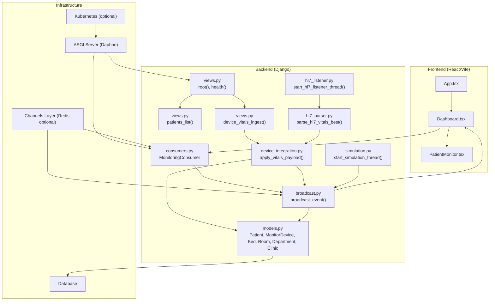
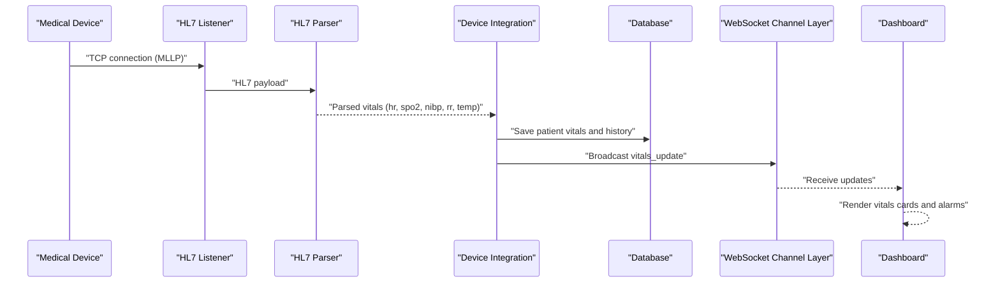
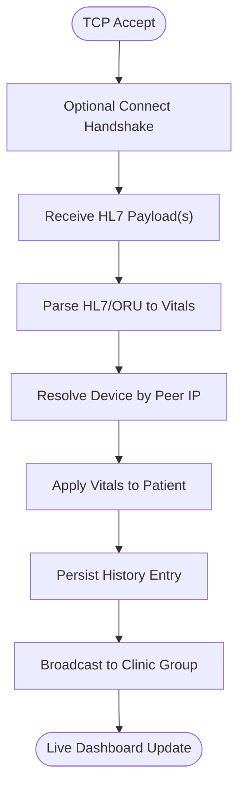
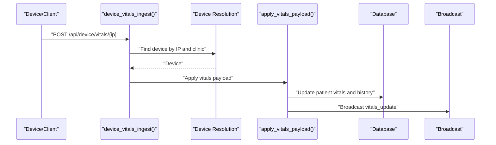
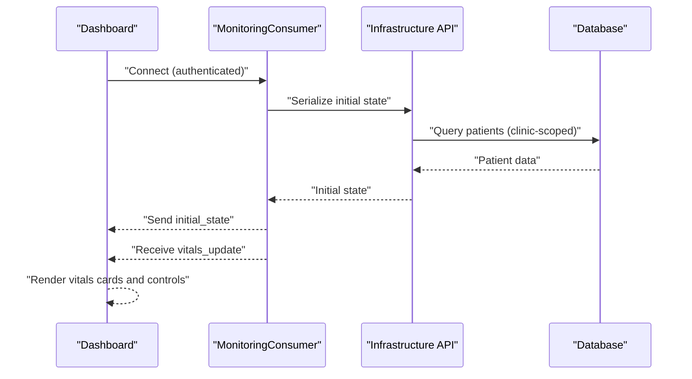
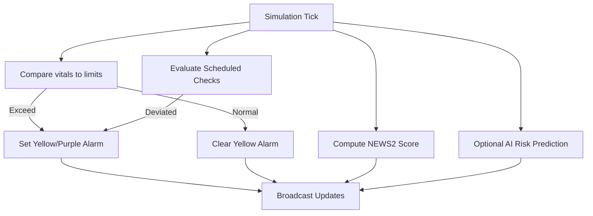
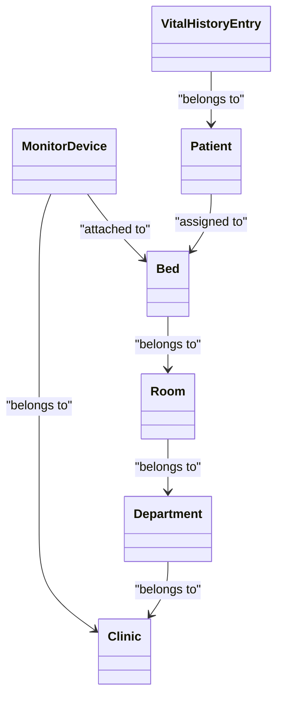
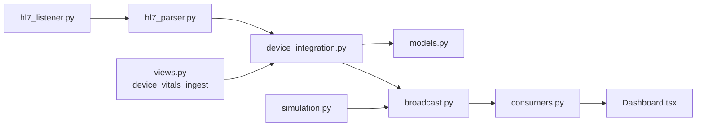

# System Introduction

<cite>
**Referenced Files in This Document**
- [README.md](file://README.md)
- [architecture.md](file://architecture.md)
- [models.py](file://backend/monitoring/models.py)
- [views.py](file://backend/monitoring/views.py)
- [consumers.py](file://backend/monitoring/consumers.py)
- [broadcast.py](file://backend/monitoring/broadcast.py)
- [device_integration.py](file://backend/monitoring/device_integration.py)
- [hl7_listener.py](file://backend/monitoring/hl7_listener.py)
- [hl7_parser.py](file://backend/monitoring/hl7_parser.py)
- [simulation.py](file://backend/monitoring/simulation.py)
- [ws_actions.py](file://backend/monitoring/ws_actions.py)
- [serializers.py](file://backend/monitoring/serializers.py)
- [App.tsx](file://frontend/src/App.tsx)
- [Dashboard.tsx](file://frontend/src/components/Dashboard.tsx)
- [PatientMonitor.tsx](file://frontend/src/components/PatientMonitor.tsx)
</cite>

## Table of Contents
1. [Introduction](#introduction)
2. [Project Structure](#project-structure)
3. [Core Components](#core-components)
4. [Architecture Overview](#architecture-overview)
5. [Detailed Component Analysis](#detailed-component-analysis)
6. [Dependency Analysis](#dependency-analysis)
7. [Performance Considerations](#performance-considerations)
8. [Troubleshooting Guide](#troubleshooting-guide)
9. [Conclusion](#conclusion)

## Introduction
Medicentral is a mission-critical, real-time patient vitals monitoring platform designed to continuously observe and visualize patient status in clinical environments. It connects bedside medical devices to a centralized dashboard via HL7/MLLP and REST ingestion, enabling 24/7 surveillance and immediate response to changes in patient condition. The system reduces medical errors by providing automated alerts, structured clinical workflows, and actionable insights grounded in early warning scores and trend analysis. It supports both high-fidelity HL7 integration and REST-based ingestion, with optional AI-powered risk predictions to assist clinical decision-making.

Key aspects:
- Real-time vitals monitoring: HR, SpO2, NIBP, RR, and temperature are ingested from devices and displayed in the clinical dashboard.
- Automated alerts and clinical workflow: Threshold-based alarms, scheduled checks, and acknowledgment/clear actions integrate into daily clinical routines.
- Continuous patient safety: Trending, NEWS2 scoring, and optional AI risk indicators support timely interventions.
- Regulatory alignment: The platform’s architecture and operational procedures are designed to meet healthcare delivery standards and support future compliance pathways.

## Project Structure
The system follows a full-stack architecture with a Django backend (ASGI/Channels for WebSockets), a React/Vite frontend, and optional Kubernetes and Docker deployments. The backend exposes REST APIs and WebSocket channels for real-time updates, while the frontend renders the monitoring dashboard and integrates with the backend via authenticated sessions and WebSocket connections.

**Diagram sources**
- [App.tsx:11-33](file://frontend/src/App.tsx#L11-L33)
- [Dashboard.tsx:32-54](file://frontend/src/components/Dashboard.tsx#L32-L54)
- [PatientMonitor.tsx:13-372](file://frontend/src/components/PatientMonitor.tsx#L13-L372)
- [views.py:394-419](file://backend/monitoring/views.py#L394-L419)
- [consumers.py:12-46](file://backend/monitoring/consumers.py#L12-L46)
- [broadcast.py:10-20](file://backend/monitoring/broadcast.py#L10-L20)
- [device_integration.py:129-225](file://backend/monitoring/device_integration.py#L129-L225)
- [hl7_listener.py:691-708](file://backend/monitoring/hl7_listener.py#L691-L708)
- [hl7_parser.py:487-530](file://backend/monitoring/hl7_parser.py#L487-L530)
- [simulation.py:283-290](file://backend/monitoring/simulation.py#L283-L290)
- [models.py:5-224](file://backend/monitoring/models.py#L5-L224)

**Section sources**
- [README.md:1-110](file://README.md#L1-L110)
- [architecture.md:1-42](file://architecture.md#L1-L42)

## Core Components
- HL7/MLLP ingestion: A dedicated listener accepts TCP connections on a configurable port, parses HL7/ORU messages, and extracts vitals. It supports ACK generation, handshake negotiation, and diagnostic logging for troubleshooting.
- REST vitals ingestion: An API endpoint accepts JSON payloads from devices or simulators, applies the same vitals pipeline, and triggers real-time updates.
- Device-to-patient mapping: Devices are associated with beds and patients; vitals are persisted to the patient record and broadcast to the clinical dashboard.
- Real-time dashboard: The React frontend connects via WebSocket to receive live updates, displays vitals cards with color-coded alarms, and supports clinical actions (acknowledgment, scheduling, notes).
- Alerting and trending: Threshold-based yellow/purple alarms, scheduled checks, NEWS2 scoring, and optional AI risk predictions guide clinical decision-making.
- Multitenancy and scope: The system scopes data per clinic and department, ensuring isolation and appropriate access control.

**Section sources**
- [hl7_listener.py:588-637](file://backend/monitoring/hl7_listener.py#L588-L637)
- [hl7_parser.py:423-452](file://backend/monitoring/hl7_parser.py#L423-L452)
- [device_integration.py:129-225](file://backend/monitoring/device_integration.py#L129-L225)
- [views.py:371-390](file://backend/monitoring/views.py#L371-L390)
- [consumers.py:12-46](file://backend/monitoring/consumers.py#L12-L46)
- [Dashboard.tsx:32-54](file://frontend/src/components/Dashboard.tsx#L32-L54)
- [models.py:5-224](file://backend/monitoring/models.py#L5-L224)

## Architecture Overview
Medicentral employs an event-driven architecture with a clear separation between data ingestion, processing, and presentation:
- Ingestion: HL7 MLLP listener and REST endpoint ingest vitals.
- Processing: Vitals parsing, validation, and persistence; broadcasting to WebSocket groups per clinic.
- Presentation: React dashboard with real-time updates, filtering, and clinical controls.
- Operations: Health checks, diagnostics, and optional simulation for development/testing.

**Diagram sources**
- [hl7_listener.py:533-587](file://backend/monitoring/hl7_listener.py#L533-L587)
- [hl7_parser.py:423-452](file://backend/monitoring/hl7_parser.py#L423-L452)
- [device_integration.py:129-225](file://backend/monitoring/device_integration.py#L129-L225)
- [broadcast.py:10-20](file://backend/monitoring/broadcast.py#L10-L20)
- [Dashboard.tsx:32-54](file://frontend/src/components/Dashboard.tsx#L32-L54)

## Detailed Component Analysis

### HL7/MLLP Ingestion Pipeline
The HL7 listener runs as a background thread, binding to a configurable host/port, accepting TCP connections, and extracting HL7 messages. It supports:
- Optional MLLP ACK and connect handshake for compatibility with diverse monitors.
- Diagnostic tracking of session statistics and raw TCP previews for troubleshooting.
- Resolution of device identity by peer IP, supporting NAT scenarios and single-device fallbacks.

**Diagram sources**
- [hl7_listener.py:405-531](file://backend/monitoring/hl7_listener.py#L405-L531)
- [hl7_parser.py:423-452](file://backend/monitoring/hl7_parser.py#L423-L452)
- [device_integration.py:129-225](file://backend/monitoring/device_integration.py#L129-L225)
- [broadcast.py:10-20](file://backend/monitoring/broadcast.py#L10-L20)

**Section sources**
- [hl7_listener.py:588-637](file://backend/monitoring/hl7_listener.py#L588-L637)
- [hl7_parser.py:487-530](file://backend/monitoring/hl7_parser.py#L487-L530)

### REST Vitals Ingestion
REST ingestion complements HL7 by accepting JSON payloads from devices or simulators. The endpoint validates the payload, resolves the device by IP within the user’s clinic scope, and applies vitals similarly to HL7 ingestion.

**Diagram sources**
- [views.py:371-390](file://backend/monitoring/views.py#L371-L390)
- [device_integration.py:129-225](file://backend/monitoring/device_integration.py#L129-L225)
- [broadcast.py:10-20](file://backend/monitoring/broadcast.py#L10-L20)

**Section sources**
- [views.py:371-390](file://backend/monitoring/views.py#L371-L390)
- [serializers.py:284-291](file://backend/monitoring/serializers.py#L284-L291)

### Real-Time Dashboard and Clinical Workflow
The React dashboard connects via WebSocket, receives initial state, and subscribes to vitals updates scoped to the user’s clinic. It supports:
- Filtering by severity (none/yellow/red/purple), department, and search.
- Pinning patients, acknowledging/clearing alarms, setting scheduled checks, and adding clinical notes.
- Privacy mode and audio mute toggles for 24/7 monitoring comfort.

**Diagram sources**
- [consumers.py:12-46](file://backend/monitoring/consumers.py#L12-L46)
- [views.py:309-356](file://backend/monitoring/views.py#L309-L356)
- [Dashboard.tsx:32-54](file://frontend/src/components/Dashboard.tsx#L32-L54)

**Section sources**
- [Dashboard.tsx:32-54](file://frontend/src/components/Dashboard.tsx#L32-L54)
- [PatientMonitor.tsx:13-372](file://frontend/src/components/PatientMonitor.tsx#L13-L372)
- [consumers.py:12-46](file://backend/monitoring/consumers.py#L12-L46)

### Alerting, Trending, and Decision Support
- Threshold-based alarms: Yellow/purple alerts trigger when vitals exceed configured limits; acknowledged/cleared via the UI.
- Scheduled checks: Automatic reminders for periodic assessments; can be cleared or adjusted.
- NEWS2 scoring: Automatic calculation of NEWS2 score to highlight clinical deterioration.
- AI risk prediction: Optional probabilistic risk estimates with recommendations for critical situations.

**Diagram sources**
- [simulation.py:99-270](file://backend/monitoring/simulation.py#L99-L270)
- [ws_actions.py:31-127](file://backend/monitoring/ws_actions.py#L31-L127)

**Section sources**
- [simulation.py:32-85](file://backend/monitoring/simulation.py#L32-L85)
- [ws_actions.py:141-152](file://backend/monitoring/ws_actions.py#L141-L152)

### Data Model for Vitals Monitoring
The backend models define the core entities for vitals monitoring, including clinics, departments, rooms, beds, devices, and patients. Patients carry current vitals, alarm state, NEWS2 score, scheduled checks, and historical entries.

**Diagram sources**
- [models.py:5-224](file://backend/monitoring/models.py#L5-L224)

**Section sources**
- [models.py:5-224](file://backend/monitoring/models.py#L5-L224)

## Dependency Analysis
- Device resolution: HL7 listener resolves devices by peer IP, with fallbacks for NAT/single-device scenarios.
- Data flow: Vitals ingestion (HL7 or REST) leads to patient updates and broadcasting; the UI consumes WebSocket events.
- Operational dependencies: Health checks, diagnostics, and optional simulation threads support development and operations.

**Diagram sources**
- [hl7_listener.py:588-637](file://backend/monitoring/hl7_listener.py#L588-L637)
- [hl7_parser.py:487-530](file://backend/monitoring/hl7_parser.py#L487-L530)
- [device_integration.py:129-225](file://backend/monitoring/device_integration.py#L129-L225)
- [views.py:371-390](file://backend/monitoring/views.py#L371-L390)
- [broadcast.py:10-20](file://backend/monitoring/broadcast.py#L10-L20)
- [consumers.py:12-46](file://backend/monitoring/consumers.py#L12-L46)
- [simulation.py:283-290](file://backend/monitoring/simulation.py#L283-L290)

**Section sources**
- [hl7_listener.py:588-637](file://backend/monitoring/hl7_listener.py#L588-L637)
- [device_integration.py:31-78](file://backend/monitoring/device_integration.py#L31-L78)
- [broadcast.py:10-20](file://backend/monitoring/broadcast.py#L10-L20)

## Performance Considerations
- Real-time responsiveness: WebSocket channels deliver updates with low latency; the UI efficiently renders frequent updates using targeted state management.
- Throughput: HL7 listener handles multiple concurrent sessions with TCP keepalive and minimal delay; ACK and handshake logic improve reliability with diverse monitors.
- Scalability: Kubernetes deployment supports horizontal scaling with Redis-backed channels for multi-instance coordination.
- Historical data: Vitals history is capped to recent entries to maintain performance while preserving trend analysis.

[No sources needed since this section provides general guidance]

## Troubleshooting Guide
Common operational checks and diagnostics:
- Health endpoint: Verify service and database connectivity.
- Connection checks: Validate HL7 listener status, port acceptance, and device assignment.
- Diagnostics: Review HL7 diagnostic summaries, bind errors, and raw TCP previews for troubleshooting.
- REST ingestion: Confirm device registration and clinic scoping for REST endpoints.

**Section sources**
- [views.py:408-419](file://backend/monitoring/views.py#L408-L419)
- [views.py:59-257](file://backend/monitoring/views.py#L59-L257)
- [hl7_listener.py:36-71](file://backend/monitoring/hl7_listener.py#L36-L71)
- [hl7_listener.py:676-688](file://backend/monitoring/hl7_listener.py#L676-L688)

## Conclusion
Medicentral delivers a robust, real-time vitals monitoring platform that integrates seamlessly with existing medical devices and clinical workflows. Its HL7/MLLP and REST ingestion, combined with automated alerts, trending, and optional AI risk predictions, enhances patient safety and supports evidence-based clinical decisions. Designed for 24/7 operation with multitenancy and scalable deployment, it provides a solid foundation for continuous patient surveillance in modern healthcare environments.