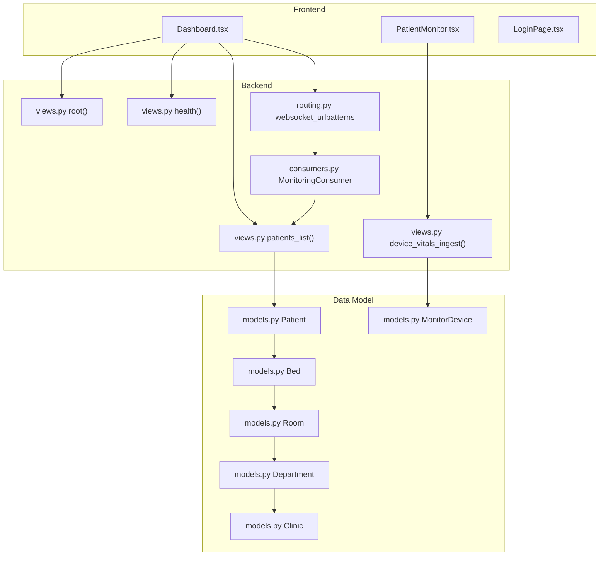
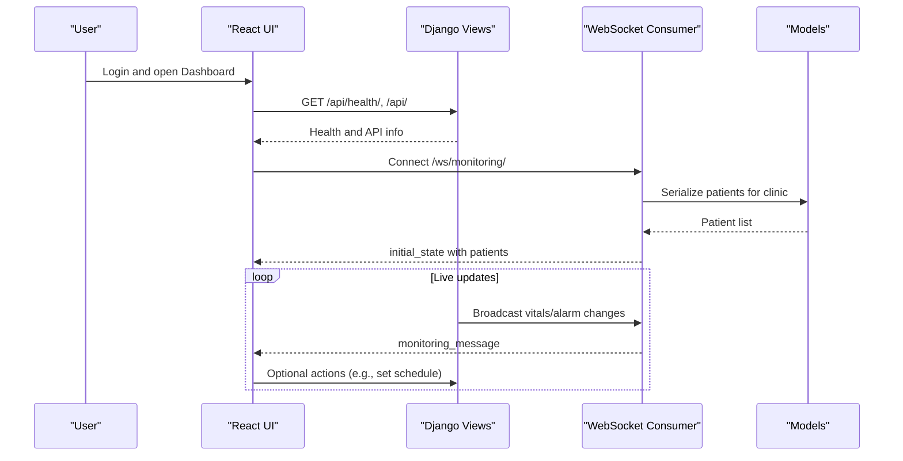
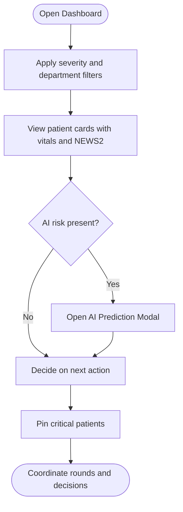
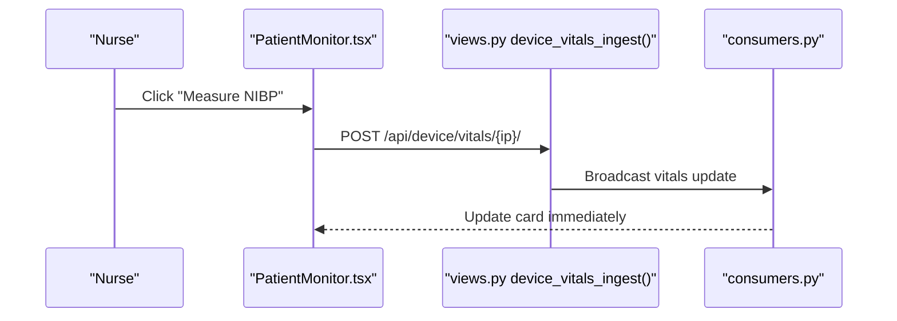
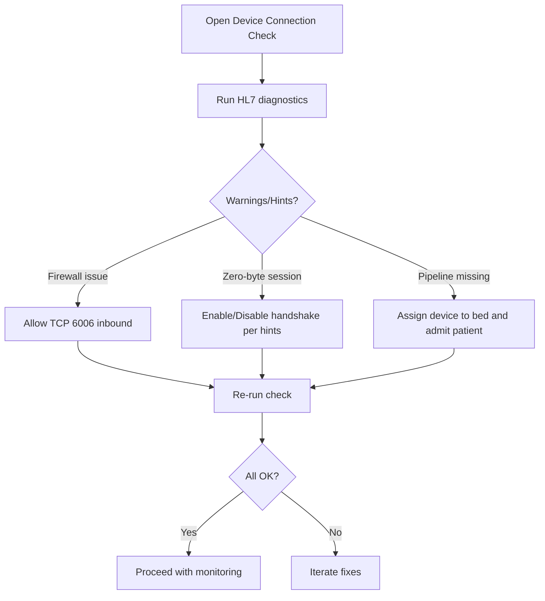
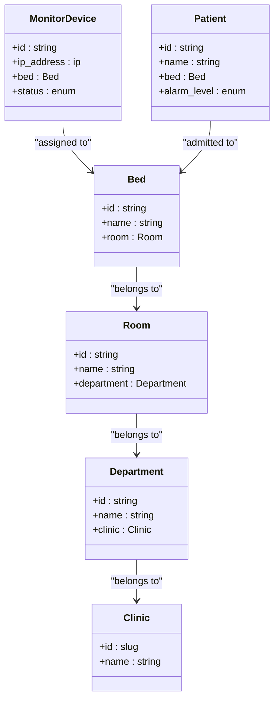
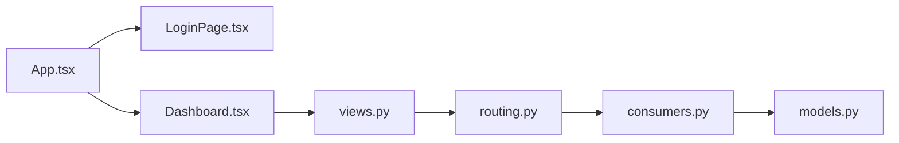

# Target Audience & Use Cases

<cite>
**Referenced Files in This Document**
- [README.md](file://README.md)
- [App.tsx](file://frontend/src/App.tsx)
- [Dashboard.tsx](file://frontend/src/components/Dashboard.tsx)
- [PatientMonitor.tsx](file://frontend/src/components/PatientMonitor.tsx)
- [LoginPage.tsx](file://frontend/src/components/LoginPage.tsx)
- [models.py](file://backend/monitoring/models.py)
- [views.py](file://backend/monitoring/views.py)
- [serializers.py](file://backend/monitoring/serializers.py)
- [consumers.py](file://backend/monitoring/consumers.py)
- [routing.py](file://backend/monitoring/routing.py)
- [setup_real_hl7_monitor.py](file://backend/monitoring/management/commands/setup_real_hl7_monitor.py)
- [reset_monitoring_fresh.py](file://backend/monitoring/management/commands/reset_monitoring_fresh.py)
</cite>

## Table of Contents
1. [Introduction](#introduction)
2. [Project Structure](#project-structure)
3. [Core Components](#core-components)
4. [Architecture Overview](#architecture-overview)
5. [Detailed Component Analysis](#detailed-component-analysis)
6. [Dependency Analysis](#dependency-analysis)
7. [Performance Considerations](#performance-considerations)
8. [Troubleshooting Guide](#troubleshooting-guide)
9. [Conclusion](#conclusion)
10. [Appendices](#appendices)

## Introduction
This document identifies who uses Medicentral (ClinicMonitoring) and how they use it across clinical environments. It focuses on primary users—clinicians, nurses, medical technicians, and hospital administrators—and maps their daily workflows to system capabilities. It also covers targeted use cases such as ICU monitoring, emergency department workflows, post-operative care, and telemetry unit operations, while addressing technical challenges like device integration, alarm fatigue, and multi-location clinic coordination.

## Project Structure
Medicentral comprises:
- A React frontend that renders real-time patient monitors, filters, and administrative controls.
- A Django backend exposing REST APIs and WebSocket endpoints for live updates.
- HL7/MLLP integration for real-time vital signs ingestion from monitors.
- Multi-tenant clinic scoping to support multiple clinics and departments.

**Diagram sources**
- [Dashboard.tsx:108-387](file://frontend/src/components/Dashboard.tsx#L108-L387)
- [PatientMonitor.tsx:1-372](file://frontend/src/components/PatientMonitor.tsx#L1-L372)
- [LoginPage.tsx:1-84](file://frontend/src/components/LoginPage.tsx#L1-L84)
- [views.py:420-445](file://backend/monitoring/views.py#L420-L445)
- [consumers.py:12-37](file://backend/monitoring/consumers.py#L12-L37)
- [routing.py:1-8](file://backend/monitoring/routing.py#L1-L8)
- [models.py:5-224](file://backend/monitoring/models.py#L5-L224)

**Section sources**
- [README.md:1-110](file://README.md#L1-L110)
- [routing.py:1-8](file://backend/monitoring/routing.py#L1-L8)
- [consumers.py:12-37](file://backend/monitoring/consumers.py#L12-L37)

## Core Components
- Roles and access:
  - Clinicians: review patient vitals, NEWS2 scores, and AI risk signals; coordinate care decisions.
  - Nurses: respond to alarms, update patient records, schedule checks, and manage device battery status.
  - Technicians: integrate devices, validate HL7 connectivity, troubleshoot zero-byte sessions, and maintain monitor configurations.
  - Administrators: configure clinics, departments, rooms, beds, and devices; oversee system operations and diagnostics.
- Real-time monitoring:
  - WebSocket feeds patient states to the dashboard for continuous updates.
  - REST endpoints expose health, infrastructure diagnostics, and device ingestion.
- Device integration:
  - HL7/MLLP listener with diagnostic summaries and connection checks.
  - Utilities to set up a real monitor and reset the environment quickly.

**Section sources**
- [models.py:5-224](file://backend/monitoring/models.py#L5-L224)
- [views.py:335-381](file://backend/monitoring/views.py#L335-L381)
- [views.py:48-283](file://backend/monitoring/views.py#L48-L283)
- [setup_real_hl7_monitor.py:29-224](file://backend/monitoring/management/commands/setup_real_hl7_monitor.py#L29-L224)

## Architecture Overview
The system connects authenticated users to real-time patient data via WebSocket and REST APIs. Data models encapsulate clinic hierarchy and patient/device state. Device vitals can arrive via HL7/MLLP or REST ingestion, then broadcast to the dashboard.

**Diagram sources**
- [views.py:420-445](file://backend/monitoring/views.py#L420-L445)
- [consumers.py:12-37](file://backend/monitoring/consumers.py#L12-L37)
- [routing.py:1-8](file://backend/monitoring/routing.py#L1-L8)
- [models.py:141-183](file://backend/monitoring/models.py#L141-L183)

## Detailed Component Analysis

### Role: Clinician
- Daily tasks:
  - Monitor global status indicators (critical/warning/pinned counts).
  - Filter by department (ICU/telemetry/general ward) and severity.
  - Review NEWS2 scores and AI risk signals to identify deteriorating patients.
  - Use pinning to focus on high-priority cases.
- UI affordances:
  - Dashboard severity filters and department selector.
  - AI prediction modal notifications.
  - Privacy mode to protect patient identity during team briefings.
- Backend support:
  - REST endpoint returns serialized patient data scoped to the user’s clinic.
  - WebSocket broadcasts updates for real-time awareness.

**Diagram sources**
- [Dashboard.tsx:76-98](file://frontend/src/components/Dashboard.tsx#L76-L98)
- [Dashboard.tsx:104-107](file://frontend/src/components/Dashboard.tsx#L104-L107)
- [Dashboard.tsx:240-247](file://frontend/src/components/Dashboard.tsx#L240-L247)
- [models.py:141-183](file://backend/monitoring/models.py#L141-L183)

**Section sources**
- [Dashboard.tsx:76-98](file://frontend/src/components/Dashboard.tsx#L76-L98)
- [Dashboard.tsx:104-107](file://frontend/src/components/Dashboard.tsx#L104-L107)
- [Dashboard.tsx:240-247](file://frontend/src/components/Dashboard.tsx#L240-L247)
- [views.py:384-394](file://backend/monitoring/views.py#L384-L394)

### Role: Nurse
- Daily tasks:
  - Respond to red/blue/yellow/purple alarms.
  - Clear purple (non-audio) alarms after verification.
  - Schedule follow-up checks for patients needing observation.
  - Toggle privacy mode for public viewing.
  - Measure NIBP remotely when indicated.
- UI affordances:
  - Large, color-coded patient cards with alarm badges and timers.
  - Quick actions to clear alarms and set schedules.
  - Device battery indicator to anticipate recharging needs.
- Backend support:
  - REST endpoints for device vitals ingestion and connection checks.
  - WebSocket ensures immediate propagation of changes.

**Diagram sources**
- [PatientMonitor.tsx:309-318](file://frontend/src/components/PatientMonitor.tsx#L309-L318)
- [views.py:397-416](file://backend/monitoring/views.py#L397-L416)
- [consumers.py:35-37](file://backend/monitoring/consumers.py#L35-L37)

**Section sources**
- [PatientMonitor.tsx:162-171](file://frontend/src/components/PatientMonitor.tsx#L162-L171)
- [PatientMonitor.tsx:208-235](file://frontend/src/components/PatientMonitor.tsx#L208-L235)
- [views.py:397-416](file://backend/monitoring/views.py#L397-L416)

### Role: Medical Technician
- Daily tasks:
  - Configure HL7 monitors and verify connectivity.
  - Use connection-check endpoints to validate server listening, firewall, and device session status.
  - Resolve zero-byte sessions and handshake issues.
  - Assign devices to beds and ensure patients are admitted to those beds.
- Backend support:
  - Dedicated device connection-check endpoint with actionable warnings and hints.
  - Management command to set up a real monitor with recommended settings.
  - Reset command to reinitialize the environment cleanly.

**Diagram sources**
- [views.py:59-283](file://backend/monitoring/views.py#L59-L283)
- [setup_real_hl7_monitor.py:154-186](file://backend/monitoring/management/commands/setup_real_hl7_monitor.py#L154-L186)
- [reset_monitoring_fresh.py:30-49](file://backend/monitoring/management/commands/reset_monitoring_fresh.py#L30-L49)

**Section sources**
- [views.py:59-283](file://backend/monitoring/views.py#L59-L283)
- [setup_real_hl7_monitor.py:154-186](file://backend/monitoring/management/commands/setup_real_hl7_monitor.py#L154-L186)
- [reset_monitoring_fresh.py:30-49](file://backend/monitoring/management/commands/reset_monitoring_fresh.py#L30-L49)

### Role: Hospital Administrator
- Daily tasks:
  - Manage clinics, departments, rooms, and beds.
  - Configure devices and assign to appropriate locations.
  - Oversee system health and HL7 listener status.
  - Coordinate multi-location deployments and environment resets.
- Backend support:
  - Administrative endpoints to list infrastructure and devices.
  - Commands to initialize a real HL7 monitor and reset the environment.

**Diagram sources**
- [models.py:5-224](file://backend/monitoring/models.py#L5-L224)

**Section sources**
- [views.py:335-381](file://backend/monitoring/views.py#L335-L381)
- [models.py:5-224](file://backend/monitoring/models.py#L5-L224)

## Dependency Analysis
- Authentication and session:
  - The app routes unauthenticated users to the login page; authenticated users access the dashboard.
- Data scoping:
  - Users are scoped to a clinic; REST endpoints return data only for that clinic.
- Real-time updates:
  - WebSocket groups per clinic ensure users see only relevant updates.
- Device ingestion:
  - REST ingestion requires device registration and clinic scoping; HL7 ingestion is validated via connection checks.

**Diagram sources**
- [App.tsx:11-33](file://frontend/src/App.tsx#L11-L33)
- [LoginPage.tsx:1-84](file://frontend/src/components/LoginPage.tsx#L1-L84)
- [Dashboard.tsx:49-54](file://frontend/src/components/Dashboard.tsx#L49-L54)
- [views.py:420-445](file://backend/monitoring/views.py#L420-L445)
- [routing.py:1-8](file://backend/monitoring/routing.py#L1-L8)
- [consumers.py:12-37](file://backend/monitoring/consumers.py#L12-L37)
- [models.py:5-224](file://backend/monitoring/models.py#L5-L224)

**Section sources**
- [App.tsx:11-33](file://frontend/src/App.tsx#L11-L33)
- [LoginPage.tsx:1-84](file://frontend/src/components/LoginPage.tsx#L1-L84)
- [Dashboard.tsx:49-54](file://frontend/src/components/Dashboard.tsx#L49-L54)
- [views.py:335-381](file://backend/monitoring/views.py#L335-L381)
- [consumers.py:12-37](file://backend/monitoring/consumers.py#L12-L37)

## Performance Considerations
- Real-time responsiveness:
  - WebSocket ensures low-latency updates; avoid unnecessary re-renders by leveraging memoization in UI components.
- Data volume:
  - Limit history entries and batch updates where possible to reduce payload sizes.
- Network reliability:
  - HL7 diagnostics and connection checks help detect and mitigate latency or packet loss early.

## Troubleshooting Guide
Common scenarios and resolutions:
- Device shows “no data”:
  - Use the device connection-check endpoint to verify HL7 listener status, firewall, and last-seen timestamps.
  - Confirm the device is assigned to a bed with an admitted patient.
- Zero-byte HL7 sessions:
  - Follow the recommended steps to enable/disable handshake and adjust environment variables.
- Firewall blocked:
  - Allow inbound TCP 6006 on the server and verify cloud provider security groups.
- Multi-location coordination:
  - Use the reset command to reinitialize the environment consistently across sites.

**Section sources**
- [views.py:59-283](file://backend/monitoring/views.py#L59-L283)
- [setup_real_hl7_monitor.py:154-186](file://backend/monitoring/management/commands/setup_real_hl7_monitor.py#L154-L186)
- [reset_monitoring_fresh.py:30-49](file://backend/monitoring/management/commands/reset_monitoring_fresh.py#L30-L49)

## Conclusion
Medicentral serves diverse clinical roles with tailored capabilities:
- Clinicians gain situational awareness and risk insights.
- Nurses efficiently triage and manage alarms and follow-ups.
- Technicians integrate and sustain device connectivity with robust diagnostics.
- Administrators orchestrate multi-clinic deployments and maintain system health.

The system’s real-time WebSocket updates, HL7/MLLP ingestion, and clinic-scoped data ensure usability across high-acuity units like ICUs, telemetry, emergency departments, and post-operative care while accommodating varying technical expertise.

## Appendices

### Use Case Scenarios
- ICU monitoring:
  - High-alarm, high-frequency vitals; prioritize critical and warning filters; rely on AI risk and NEWS2 scoring.
- Emergency department:
  - Rapid triage; quick admission and device assignment; real-time updates for surge capacity.
- Post-operative care:
  - Scheduled checks and pinned patients; NIBP measurement triggers; continuous monitoring of vital trends.
- Telemetry unit:
  - Stable patients in small grids; periodic checks; device battery monitoring to anticipate recharging.

### Daily Workflows by Role
- Clinician:
  - Morning rounds: filter by department, review AI risk and NEWS2, coordinate with teams.
- Nurse:
  - Shift handover: clear alarms, set schedules, measure NIBP, toggle privacy mode.
- Technician:
  - Setup/repair: configure HL7, run connection checks, resolve zero-byte sessions, assign devices to beds.
- Administrator:
  - Onboarding: create clinics/departments/rooms/beds/devices; monitor health and diagnostics; reset environments.