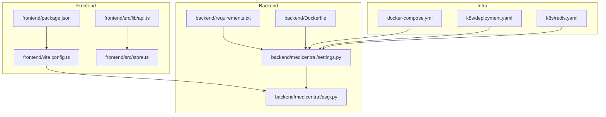
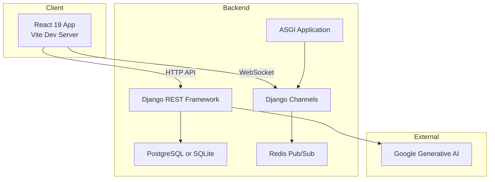
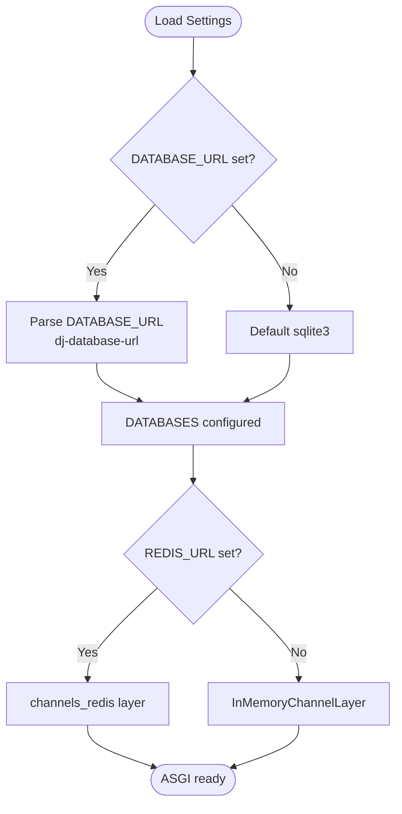
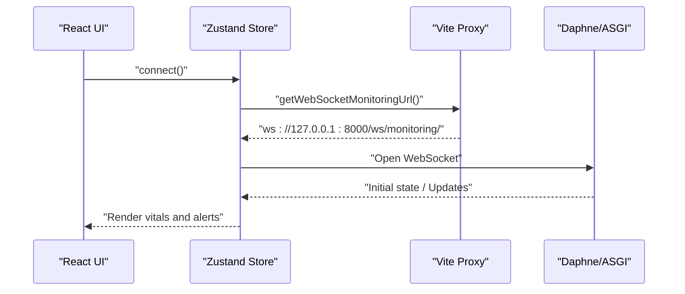
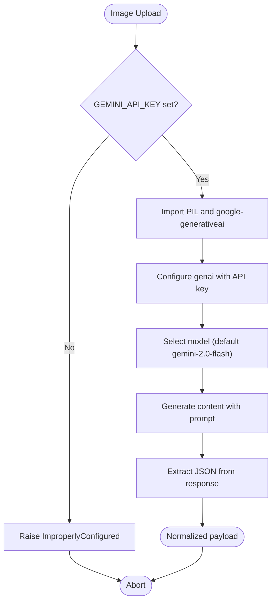
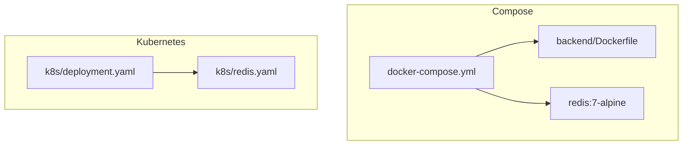
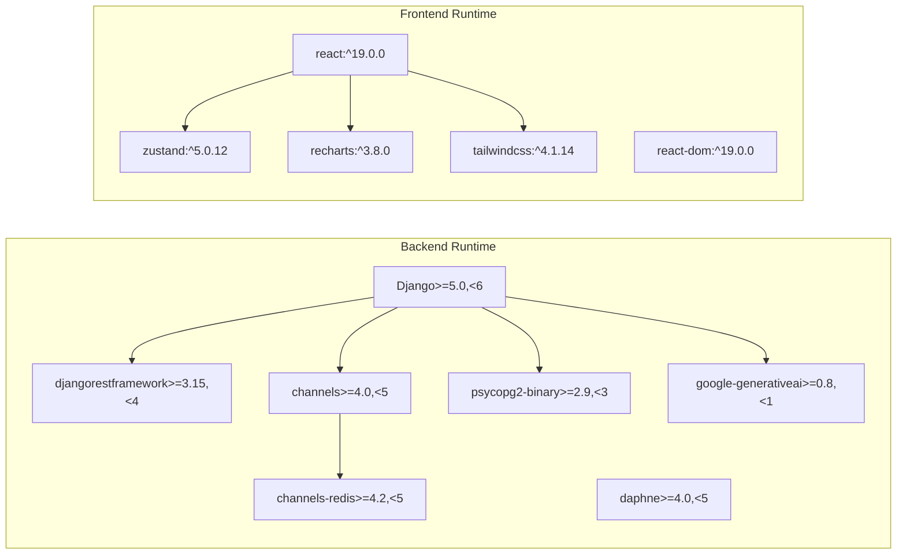

# Technology Stack & Dependencies

<cite>
**Referenced Files in This Document**
- [README.md](file://README.md)
- [backend/requirements.txt](file://backend/requirements.txt)
- [backend/Dockerfile](file://backend/Dockerfile)
- [docker-compose.yml](file://docker-compose.yml)
- [backend/medicentral/settings.py](file://backend/medicentral/settings.py)
- [backend/medicentral/asgi.py](file://backend/medicentral/asgi.py)
- [k8s/deployment.yaml](file://k8s/deployment.yaml)
- [k8s/redis.yaml](file://k8s/redis.yaml)
- [frontend/package.json](file://frontend/package.json)
- [frontend/vite.config.ts](file://frontend/vite.config.ts)
- [frontend/src/store.ts](file://frontend/src/store.ts)
- [frontend/src/lib/api.ts](file://frontend/src/lib/api.ts)
- [backend/monitoring/screen_parse.py](file://backend/monitoring/screen_parse.py)
- [deploy/deploy_remote.py](file://deploy/deploy_remote.py)
</cite>

## Table of Contents
1. [Introduction](#introduction)
2. [Project Structure](#project-structure)
3. [Core Components](#core-components)
4. [Architecture Overview](#architecture-overview)
5. [Detailed Component Analysis](#detailed-component-analysis)
6. [Dependency Analysis](#dependency-analysis)
7. [Performance Considerations](#performance-considerations)
8. [Troubleshooting Guide](#troubleshooting-guide)
9. [Conclusion](#conclusion)
10. [Appendices](#appendices)

## Introduction
This document describes the technology stack and dependencies used in Medicentral, focusing on backend, frontend, integrations, containerization, orchestration, and operational tooling. It explains version compatibility, upgrade paths, system requirements, and deployment guidance, while also covering licensing and open-source dependency management.

## Project Structure
Medicentral is organized into:
- Backend: Django 5.x application with REST and WebSockets, ASGI, Channels, and optional Redis-backed channel layers.
- Frontend: React 19 with Vite, TypeScript, Tailwind CSS, Zustand, and Recharts.
- Integrations: Google Generative AI for image parsing, Docker for containerization, and Kubernetes for orchestration.
- Operations: Local development via Docker Compose, production deployment via Kubernetes manifests, and remote deployment scripts.

**Diagram sources**
- [frontend/package.json:1-35](file://frontend/package.json#L1-L35)
- [frontend/vite.config.ts:1-35](file://frontend/vite.config.ts#L1-L35)
- [frontend/src/store.ts:1-353](file://frontend/src/store.ts#L1-L353)
- [frontend/src/lib/api.ts:1-35](file://frontend/src/lib/api.ts#L1-L35)
- [backend/requirements.txt:1-14](file://backend/requirements.txt#L1-L14)
- [backend/Dockerfile:1-27](file://backend/Dockerfile#L1-L27)
- [backend/medicentral/settings.py:1-218](file://backend/medicentral/settings.py#L1-L218)
- [backend/medicentral/asgi.py:1-22](file://backend/medicentral/asgi.py#L1-L22)
- [docker-compose.yml:1-29](file://docker-compose.yml#L1-L29)
- [k8s/deployment.yaml:1-101](file://k8s/deployment.yaml#L1-L101)
- [k8s/redis.yaml:1-41](file://k8s/redis.yaml#L1-L41)

**Section sources**
- [README.md:1-110](file://README.md#L1-L110)
- [frontend/package.json:1-35](file://frontend/package.json#L1-L35)
- [backend/requirements.txt:1-14](file://backend/requirements.txt#L1-L14)
- [docker-compose.yml:1-29](file://docker-compose.yml#L1-L29)
- [k8s/deployment.yaml:1-101](file://k8s/deployment.yaml#L1-L101)
- [k8s/redis.yaml:1-41](file://k8s/redis.yaml#L1-L41)

## Core Components
- Backend framework: Django 5.x with ASGI application and WSGI fallback.
- API and sessions: Django REST Framework for JSON APIs and session authentication.
- Real-time: Django Channels with Daphne for WebSocket support.
- Caching and pub/sub: Redis via channels-redis for multi-instance WebSocket synchronization; optional in-memory channel layer for single-process runs.
- Database: PostgreSQL via DATABASE_URL or SQLite as default.
- Static assets: WhiteNoise for static file serving.
- AI integration: Google Generative AI for parsing monitor screenshots.
- Containerization: Python slim base image, Alpine Redis for dev/staging.
- Orchestration: Kubernetes manifests for backend pods and Redis service.

**Section sources**
- [backend/requirements.txt:1-14](file://backend/requirements.txt#L1-L14)
- [backend/medicentral/settings.py:53-66](file://backend/medicentral/settings.py#L53-L66)
- [backend/medicentral/settings.py:170-183](file://backend/medicentral/settings.py#L170-L183)
- [backend/medicentral/settings.py:101-119](file://backend/medicentral/settings.py#L101-L119)
- [backend/medicentral/settings.py:137-144](file://backend/medicentral/settings.py#L137-L144)
- [backend/medicentral/asgi.py:1-22](file://backend/medicentral/asgi.py#L1-L22)
- [backend/Dockerfile:1-27](file://backend/Dockerfile#L1-L27)
- [k8s/deployment.yaml:1-101](file://k8s/deployment.yaml#L1-L101)
- [k8s/redis.yaml:1-41](file://k8s/redis.yaml#L1-L41)

## Architecture Overview
The system comprises a React frontend communicating over HTTP and WebSocket with a Django backend. The backend uses ASGI with Channels for real-time updates and optionally connects to Redis for multi-instance scaling. Docker Compose supports local development; Kubernetes deploys production-grade backend and Redis services.

**Diagram sources**
- [frontend/vite.config.ts:18-32](file://frontend/vite.config.ts#L18-L32)
- [frontend/src/lib/api.ts:14-34](file://frontend/src/lib/api.ts#L14-L34)
- [backend/medicentral/asgi.py:14-21](file://backend/medicentral/asgi.py#L14-L21)
- [backend/medicentral/settings.py:170-183](file://backend/medicentral/settings.py#L170-L183)
- [backend/monitoring/screen_parse.py:58-114](file://backend/monitoring/screen_parse.py#L58-L114)

**Section sources**
- [README.md:3-16](file://README.md#L3-L16)
- [frontend/vite.config.ts:1-35](file://frontend/vite.config.ts#L1-L35)
- [backend/medicentral/asgi.py:1-22](file://backend/medicentral/asgi.py#L1-L22)
- [backend/medicentral/settings.py:170-183](file://backend/medicentral/settings.py#L170-L183)
- [backend/monitoring/screen_parse.py:1-160](file://backend/monitoring/screen_parse.py#L1-L160)

## Detailed Component Analysis

### Backend Technologies
- Django 5.x: ASGI and WSGI applications configured; environment-driven settings including database selection and static storage.
- Django REST Framework: JSON renderer/parser, session authentication, and permission enforcement.
- Django Channels: Channel layers backed by Redis for multi-instance WebSocket support; in-memory fallback otherwise.
- Daphne: ASGI server for development and production.
- Database: PostgreSQL via DATABASE_URL or SQLite with optional connection pooling and SSL.
- Static files: WhiteNoise compression and storage configuration.
- Environment variables: Secret key, allowed hosts, CORS, proxies, Redis URL, database tuning, and logging.

**Diagram sources**
- [backend/medicentral/settings.py:101-119](file://backend/medicentral/settings.py#L101-L119)
- [backend/medicentral/settings.py:170-183](file://backend/medicentral/settings.py#L170-L183)

**Section sources**
- [backend/requirements.txt:2-11](file://backend/requirements.txt#L2-L11)
- [backend/medicentral/settings.py:53-66](file://backend/medicentral/settings.py#L53-L66)
- [backend/medicentral/settings.py:101-119](file://backend/medicentral/settings.py#L101-L119)
- [backend/medicentral/settings.py:170-183](file://backend/medicentral/settings.py#L170-L183)
- [backend/medicentral/asgi.py:1-22](file://backend/medicentral/asgi.py#L1-L22)

### Frontend Technologies
- React 19 with Vite: Fast dev server with HMR and proxying to backend API and WebSocket endpoints.
- State management: Zustand stores patient data, WebSocket connection state, and UI preferences.
- Styling: Tailwind CSS via Vite plugin; TypeScript for type safety.
- Visualization: Recharts for vitals charts.
- Build and scripts: Development, build, preview, and linting.

**Diagram sources**
- [frontend/src/store.ts:219-352](file://frontend/src/store.ts#L219-L352)
- [frontend/src/lib/api.ts:21-34](file://frontend/src/lib/api.ts#L21-L34)
- [frontend/vite.config.ts:18-32](file://frontend/vite.config.ts#L18-L32)

**Section sources**
- [frontend/package.json:13-33](file://frontend/package.json#L13-L33)
- [frontend/vite.config.ts:1-35](file://frontend/vite.config.ts#L1-L35)
- [frontend/src/store.ts:1-353](file://frontend/src/store.ts#L1-L353)
- [frontend/src/lib/api.ts:1-35](file://frontend/src/lib/api.ts#L1-L35)

### External Service Integration: Google Generative AI
- Purpose: Parse monitor screen images to extract HL7 configuration fields.
- Configuration: Requires GEMINI_API_KEY environment variable; optional model override via environment.
- Error handling: Raises configuration errors when API key is missing and wraps model exceptions.

**Diagram sources**
- [backend/monitoring/screen_parse.py:58-114](file://backend/monitoring/screen_parse.py#L58-L114)

**Section sources**
- [backend/monitoring/screen_parse.py:1-160](file://backend/monitoring/screen_parse.py#L1-L160)
- [deploy/deploy_remote.py:136-181](file://deploy/deploy_remote.py#L136-L181)

### Containerization and Orchestration
- Docker Compose: Runs backend and Redis locally; exposes SQLite volume and sets REDIS_URL automatically.
- Dockerfile: Python 3.12 slim image, installs requirements, collects static assets, and starts Daphne.
- Kubernetes: Deploys backend as a multi-replica Deployment with liveness/readiness probes, a Service, and an Ingress; requires Redis service for Channels.

**Diagram sources**
- [docker-compose.yml:1-29](file://docker-compose.yml#L1-L29)
- [backend/Dockerfile:1-27](file://backend/Dockerfile#L1-L27)
- [k8s/deployment.yaml:1-101](file://k8s/deployment.yaml#L1-L101)
- [k8s/redis.yaml:1-41](file://k8s/redis.yaml#L1-L41)

**Section sources**
- [docker-compose.yml:1-29](file://docker-compose.yml#L1-L29)
- [backend/Dockerfile:1-27](file://backend/Dockerfile#L1-L27)
- [k8s/deployment.yaml:1-101](file://k8s/deployment.yaml#L1-L101)
- [k8s/redis.yaml:1-41](file://k8s/redis.yaml#L1-L41)

## Dependency Analysis
- Backend runtime dependencies pinned with upper bounds to ensure stability across CI and Docker builds.
- Frontend dependencies include React, Vite, Tailwind, Zustand, and Recharts; dev dependencies include TypeScript tooling and Vite plugins.
- Channels and Redis are mandatory for multi-instance WebSocket scaling; otherwise, in-memory channels are used.

**Diagram sources**
- [backend/requirements.txt:2-11](file://backend/requirements.txt#L2-L11)
- [frontend/package.json:13-33](file://frontend/package.json#L13-L33)

**Section sources**
- [backend/requirements.txt:1-14](file://backend/requirements.txt#L1-L14)
- [frontend/package.json:1-35](file://frontend/package.json#L1-L35)

## Performance Considerations
- Multi-instance WebSocket scaling: Redis is required for Channels across multiple backend pods; otherwise, in-memory channels limit to a single process.
- Database choice: PostgreSQL via DATABASE_URL scales better than SQLite for production workloads; SQLite is suitable for development and small deployments.
- Static assets: WhiteNoise compression reduces bandwidth; ensure appropriate CPU/memory limits in Kubernetes.
- Proxies and timeouts: Kubernetes Ingress annotations enable long-running WebSocket connections; configure proxy timeouts accordingly.
- Health checks: Liveness and readiness probes on the backend Deployment improve reliability during rolling updates.

**Section sources**
- [k8s/deployment.yaml:45-63](file://k8s/deployment.yaml#L45-L63)
- [k8s/deployment.yaml:85-90](file://k8s/deployment.yaml#L85-L90)
- [backend/medicentral/settings.py:170-183](file://backend/medicentral/settings.py#L170-L183)
- [README.md:67-87](file://README.md#L67-L87)

## Troubleshooting Guide
- Missing GEMINI_API_KEY: The system raises a configuration error when attempting to parse images without the API key. Inject the key via deployment scripts or environment files and restart the backend.
- WebSocket connection failures: Verify backend is reachable at the configured origin and that the backend is behind a reverse proxy if required. Check Kubernetes Ingress annotations for WebSocket support.
- CORS and cookies: Ensure CORS_ALLOWED_ORIGINS and CSRF trusted origins are set appropriately for production; avoid allowing all origins in non-debug environments.
- Database connectivity: Confirm DATABASE_URL for PostgreSQL or the SQLite path; adjust connection pooling and SSL settings as needed.
- Redis availability: For multi-replica deployments, ensure the Redis Service is running and accessible; otherwise, Channels fall back to in-memory.

**Section sources**
- [backend/monitoring/screen_parse.py:62-66](file://backend/monitoring/screen_parse.py#L62-L66)
- [deploy/deploy_remote.py:136-181](file://deploy/deploy_remote.py#L136-L181)
- [frontend/src/lib/api.ts:21-34](file://frontend/src/lib/api.ts#L21-L34)
- [backend/medicentral/settings.py:40-51](file://backend/medicentral/settings.py#L40-L51)
- [backend/medicentral/settings.py:101-119](file://backend/medicentral/settings.py#L101-L119)
- [k8s/deployment.yaml:36-41](file://k8s/deployment.yaml#L36-L41)

## Conclusion
Medicentral’s stack balances real-time capabilities with simplicity and scalability. The backend leverages Django 5, REST, and Channels with optional Redis for multi-instance WebSocket support. The frontend uses modern tooling with React 19, Vite, Zustand, and Recharts. Containerization and Kubernetes enable repeatable deployments, while Google Generative AI enhances device onboarding. Following the outlined environment variables, resource limits, and deployment steps ensures reliable operation across development and production.

## Appendices

### Version Compatibility and Upgrade Paths
- Backend: Django 5.x; upgrade cautiously with migration checks and dependency alignment.
- Channels and Redis: Upgrade channels and channels-redis together; ensure Redis is updated to match cluster requirements.
- PostgreSQL: Keep drivers aligned with the database version; test connection pooling and SSL settings after upgrades.
- Frontend: React 19 and Vite are compatible with current ecosystem; keep TypeScript and Tailwind plugins updated.

**Section sources**
- [backend/requirements.txt:2-11](file://backend/requirements.txt#L2-L11)
- [frontend/package.json:25-33](file://frontend/package.json#L25-L33)

### System Requirements and Hardware Considerations
- Development: Modern workstation with Python 3.12+ and Node.js LTS; Docker Desktop recommended.
- Production: Kubernetes cluster with at least two backend replicas and a dedicated Redis instance; allocate CPU and memory according to probe settings and expected concurrent WebSocket clients.
- Storage: Persistent volumes for SQLite in development or PostgreSQL for production; Redis persistence managed by the container image.

**Section sources**
- [README.md:69-87](file://README.md#L69-L87)
- [k8s/deployment.yaml:45-51](file://k8s/deployment.yaml#L45-L51)
- [docker-compose.yml:23-28](file://docker-compose.yml#L23-L28)

### Licensing and Open-Source Dependency Management
- License notices and third-party attributions are not present in the repository snapshot; consult each dependency’s repository or package metadata for license terms.
- Dependency pinning and Docker builds enforce reproducibility; maintain lock files and container images for auditability.

**Section sources**
- [backend/requirements.txt:1-14](file://backend/requirements.txt#L1-L14)
- [frontend/package.json:1-35](file://frontend/package.json#L1-L35)