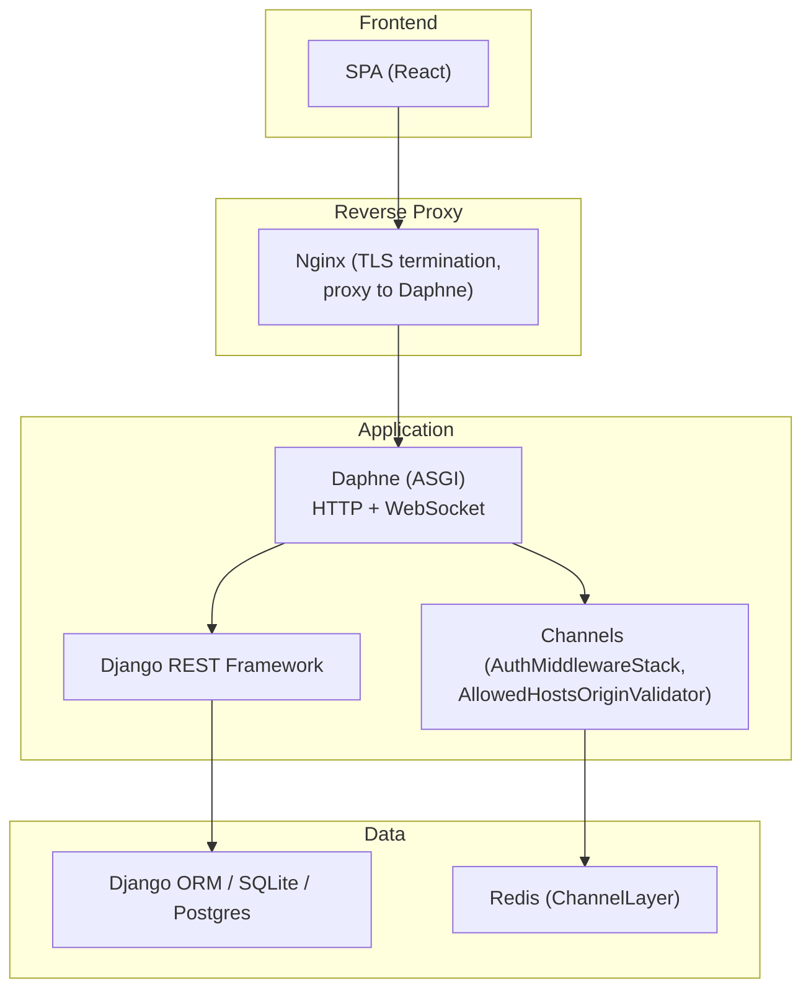
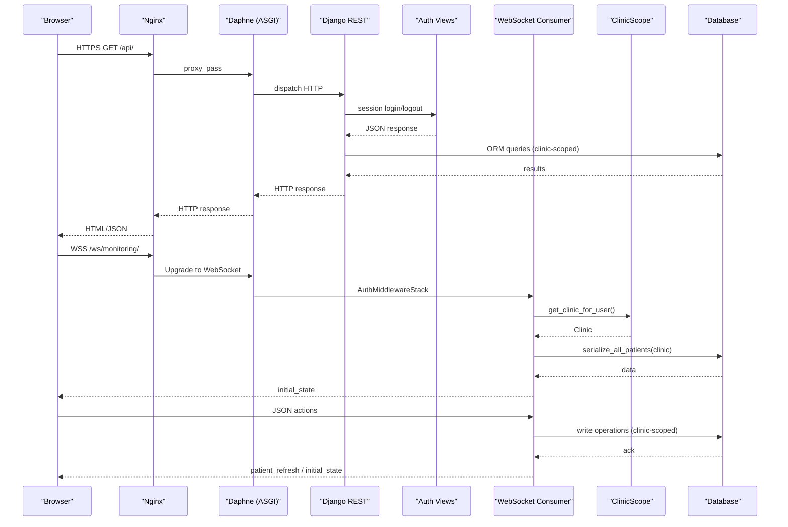
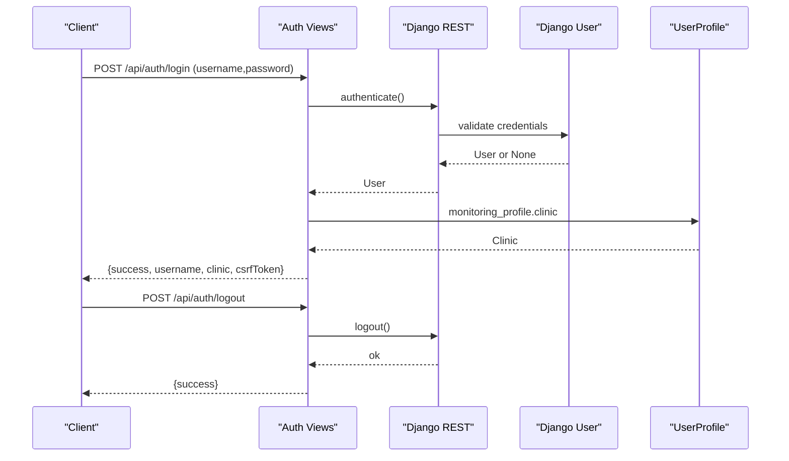
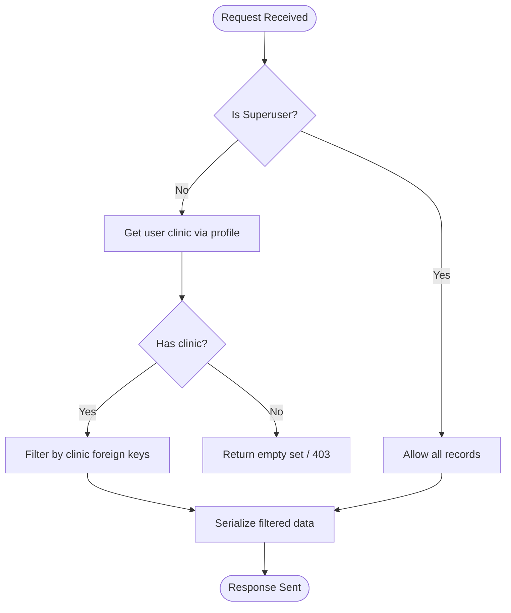
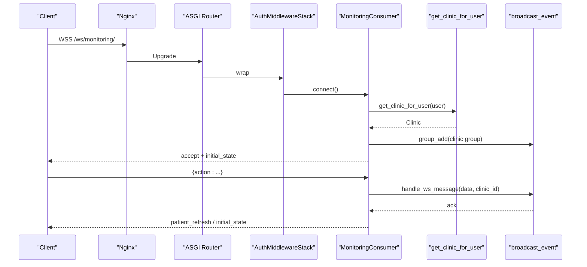
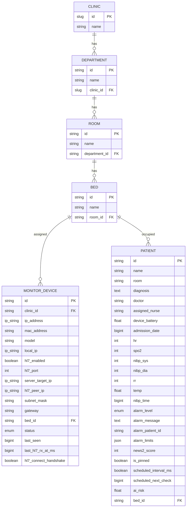
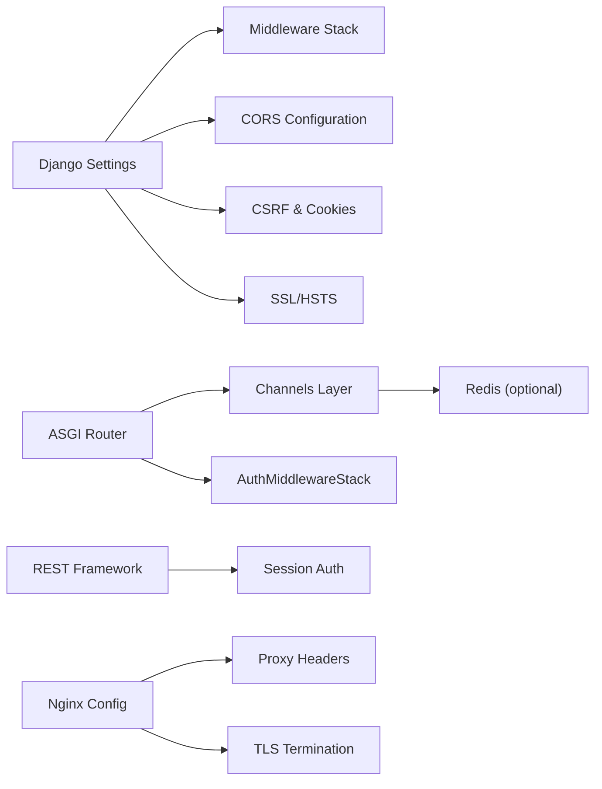
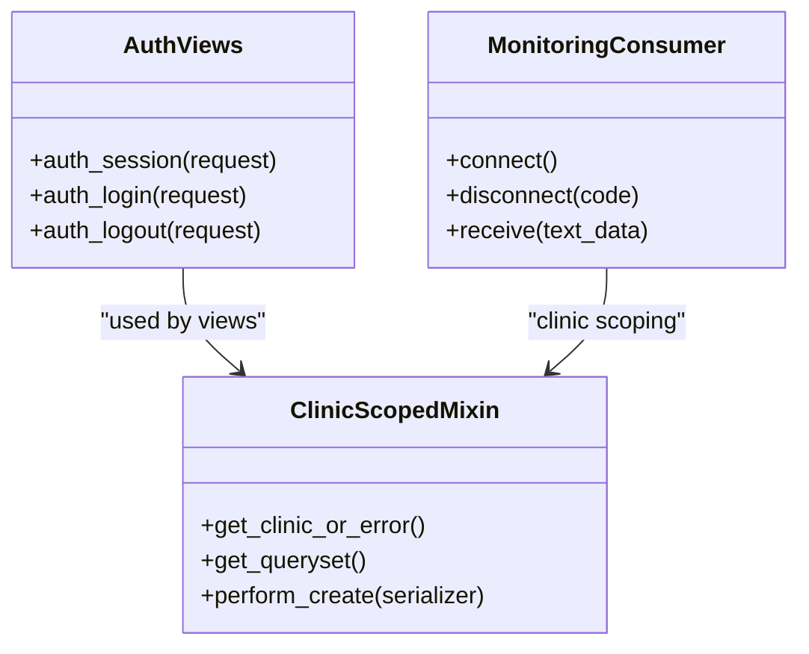
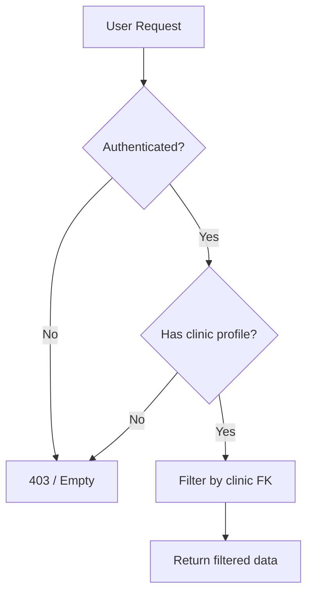

# Security & Compliance

<cite>
**Referenced Files in This Document**
- [settings.py](file://backend/medicentral/settings.py)
- [asgi.py](file://backend/medicentral/asgi.py)
- [wsgi.py](file://backend/medicentral/wsgi.py)
- [models.py](file://backend/monitoring/models.py)
- [consumers.py](file://backend/monitoring/consumers.py)
- [routing.py](file://backend/monitoring/routing.py)
- [clinic_scope.py](file://backend/monitoring/clinic_scope.py)
- [ws_actions.py](file://backend/monitoring/ws_actions.py)
- [auth_views.py](file://backend/monitoring/auth_views.py)
- [views.py](file://backend/monitoring/views.py)
- [api_mixins.py](file://backend/monitoring/api_mixins.py)
- [serializers.py](file://backend/monitoring/serializers.py)
- [nginx-clinicmonitoring.conf](file://deploy/nginx-clinicmonitoring.conf)
- [clinicmonitoring-daphne.service](file://deploy/clinicmonitoring-daphne.service)
- [docker-compose.yml](file://docker-compose.yml)
</cite>

## Table of Contents
1. [Introduction](#introduction)
2. [Project Structure](#project-structure)
3. [Core Components](#core-components)
4. [Architecture Overview](#architecture-overview)
5. [Detailed Component Analysis](#detailed-component-analysis)
6. [Dependency Analysis](#dependency-analysis)
7. [Performance Considerations](#performance-considerations)
8. [Troubleshooting Guide](#troubleshooting-guide)
9. [HIPAA Compliance and PHI Protection](#hipaa-compliance-and-phi-protection)
10. [Authentication and Authorization](#authentication-and-authorization)
11. [Data Encryption and Transport Security](#data-encryption-and-transport-security)
12. [Access Control and Data Isolation](#access-control-and-data-isolation)
13. [Audit Logging and Monitoring](#audit-logging-and-monitoring)
14. [Deployment Security Configuration](#deployment-security-configuration)
15. [Security Assessment and Incident Response](#security-assessment-and-incident-response)
16. [Conclusion](#conclusion)

## Introduction
This document provides comprehensive security and compliance guidance for the Medicentral healthcare monitoring system. It explains how the system protects protected health information (PHI), enforces access controls, and maintains audit readiness. It also documents authentication and authorization mechanisms, clinic-scoped data isolation, transport and storage security, secure WebSocket implementation, CORS configuration, Django security settings, and operational procedures for secure deployments, monitoring, and incident response aligned with HIPAA requirements.

## Project Structure
Medicentral consists of:
- Backend service built with Django and Django Channels for HTTP and WebSocket handling
- Real-time monitoring via ASGI with Channel Layers (Redis or in-memory)
- SPA frontend served alongside the backend via Nginx
- Deployment artifacts for production and development environments

**Diagram sources**
- [nginx-clinicmonitoring.conf:1-112](file://deploy/nginx-clinicmonitoring.conf#L1-L112)
- [clinicmonitoring-daphne.service:1-18](file://deploy/clinicmonitoring-daphne.service#L1-L18)
- [asgi.py:1-22](file://backend/medicentral/asgi.py#L1-L22)
- [settings.py:1-218](file://backend/medicentral/settings.py#L1-L218)

**Section sources**
- [nginx-clinicmonitoring.conf:1-112](file://deploy/nginx-clinicmonitoring.conf#L1-L112)
- [clinicmonitoring-daphne.service:1-18](file://deploy/clinicmonitoring-daphne.service#L1-L18)
- [docker-compose.yml:1-29](file://docker-compose.yml#L1-L29)

## Core Components
- Django settings encapsulate security posture, middleware stack, CORS, CSRF, cookies, SSL/HSTS, and logging
- ASGI application configures HTTP and WebSocket routing with origin and auth validation
- Channel Layers enable scalable WebSocket messaging with optional Redis backend
- Authentication endpoints support session-based login and CSRF token provisioning
- ViewSet mixins enforce clinic-scoped access control for all CRUD operations
- WebSocket consumer validates user and clinic membership, joins per-clinic groups, and handles actions
- Nginx configuration terminates TLS, proxies API and WebSocket traffic, and sets security headers

**Section sources**
- [settings.py:1-218](file://backend/medicentral/settings.py#L1-L218)
- [asgi.py:1-22](file://backend/medicentral/asgi.py#L1-L22)
- [consumers.py:1-46](file://backend/monitoring/consumers.py#L1-L46)
- [api_mixins.py:1-67](file://backend/monitoring/api_mixins.py#L1-L67)
- [ws_actions.py:1-229](file://backend/monitoring/ws_actions.py#L1-L229)
- [auth_views.py:1-56](file://backend/monitoring/auth_views.py#L1-L56)
- [routing.py:1-8](file://backend/monitoring/routing.py#L1-L8)
- [nginx-clinicmonitoring.conf:1-112](file://deploy/nginx-clinicmonitoring.conf#L1-L112)

## Architecture Overview
The system separates concerns across transport, authentication, authorization, data access, and real-time messaging:

**Diagram sources**
- [nginx-clinicmonitoring.conf:39-77](file://deploy/nginx-clinicmonitoring.conf#L39-L77)
- [asgi.py:14-21](file://backend/medicentral/asgi.py#L14-L21)
- [auth_views.py:14-56](file://backend/monitoring/auth_views.py#L14-L56)
- [consumers.py:12-46](file://backend/monitoring/consumers.py#L12-L46)
- [clinic_scope.py:15-23](file://backend/monitoring/clinic_scope.py#L15-L23)
- [ws_actions.py:31-229](file://backend/monitoring/ws_actions.py#L31-L229)

## Detailed Component Analysis

### Authentication and Authorization System
- Session-based authentication with CSRF protection enabled
- Login endpoint authenticates credentials, starts a session, and returns CSRF token
- Logout endpoint invalidates the session
- REST endpoints require IsAuthenticated by default
- Superuser bypasses clinic filters; regular users are scoped to their clinic profile

**Diagram sources**
- [auth_views.py:14-56](file://backend/monitoring/auth_views.py#L14-L56)
- [settings.py:146-153](file://backend/medicentral/settings.py#L146-L153)

**Section sources**
- [auth_views.py:1-56](file://backend/monitoring/auth_views.py#L1-L56)
- [settings.py:146-153](file://backend/medicentral/settings.py#L146-L153)
- [clinic_scope.py:15-23](file://backend/monitoring/clinic_scope.py#L15-L23)

### Access Control and Clinic-Scoped Data Isolation
- Clinic-scoped ViewSet mixin enforces per-request filtering by clinic for Departments, Rooms, Beds, and Devices
- Superusers can access all resources; otherwise, requests are constrained to the authenticated user’s clinic
- Serializers and view logic validate clinic membership for write operations
- WebSocket consumer validates authenticated user and clinic membership before joining groups

**Diagram sources**
- [api_mixins.py:11-67](file://backend/monitoring/api_mixins.py#L11-L67)
- [clinic_scope.py:15-23](file://backend/monitoring/clinic_scope.py#L15-L23)
- [serializers.py:100-126](file://backend/monitoring/serializers.py#L100-L126)

**Section sources**
- [api_mixins.py:1-67](file://backend/monitoring/api_mixins.py#L1-L67)
- [clinic_scope.py:1-30](file://backend/monitoring/clinic_scope.py#L1-L30)
- [serializers.py:100-126](file://backend/monitoring/serializers.py#L100-L126)

### Secure WebSocket Implementation
- ASGI router wraps WebSocket connections with AllowedHostsOriginValidator and AuthMiddlewareStack
- Consumer validates authentication and clinic membership, joins a group named after the clinic, and sends initial state
- Actions executed via WebSocket are transactional and scoped to the user’s clinic

**Diagram sources**
- [asgi.py:14-21](file://backend/medicentral/asgi.py#L14-L21)
- [consumers.py:12-46](file://backend/monitoring/consumers.py#L12-L46)
- [ws_actions.py:31-229](file://backend/monitoring/ws_actions.py#L31-L229)
- [clinic_scope.py:15-23](file://backend/monitoring/clinic_scope.py#L15-L23)

**Section sources**
- [asgi.py:1-22](file://backend/medicentral/asgi.py#L1-L22)
- [consumers.py:1-46](file://backend/monitoring/consumers.py#L1-L46)
- [routing.py:1-8](file://backend/monitoring/routing.py#L1-L8)
- [ws_actions.py:1-229](file://backend/monitoring/ws_actions.py#L1-L229)

### Data Models and PHI Implications
- Entities include Clinic, Department, Room, Bed, MonitorDevice, Patient, and related clinical data
- Patient records contain PHI (identifiers, vitals, medications, labs, notes)
- Access control relies on clinic foreign keys to prevent cross-tenant leakage
- Unique constraints on devices prevent misconfiguration leading to data confusion

**Diagram sources**
- [models.py:5-224](file://backend/monitoring/models.py#L5-L224)

**Section sources**
- [models.py:1-224](file://backend/monitoring/models.py#L1-L224)

## Dependency Analysis
Key security-related dependencies and their roles:
- Django settings: middleware stack, CORS, CSRF, cookies, SSL/HSTS, logging
- ASGI: WebSocket origin validation and authentication wrapping
- Channels: group messaging and channel layer configuration
- REST framework: session authentication and default IsAuthenticated policy
- Nginx: TLS termination, proxy headers, WebSocket upgrade handling

**Diagram sources**
- [settings.py:68-184](file://backend/medicentral/settings.py#L68-L184)
- [asgi.py:3-21](file://backend/medicentral/asgi.py#L3-L21)
- [nginx-clinicmonitoring.conf:39-77](file://deploy/nginx-clinicmonitoring.conf#L39-L77)

**Section sources**
- [settings.py:68-184](file://backend/medicentral/settings.py#L68-L184)
- [asgi.py:1-22](file://backend/medicentral/asgi.py#L1-L22)
- [nginx-clinicmonitoring.conf:1-112](file://deploy/nginx-clinicmonitoring.conf#L1-L112)

## Performance Considerations
- Use Redis-backed Channel Layers for multi-instance WebSocket scaling
- Enable WhiteNoise static files handling in production
- Configure database connection pooling and SSL where applicable
- Tune logging levels to reduce overhead in production

[No sources needed since this section provides general guidance]

## Troubleshooting Guide
Common security-related issues and resolutions:
- CSRF failures: ensure CSRF cookie and trusted origins are configured correctly
- WebSocket closes with 4001/4002: indicates unauthenticated or missing clinic profile
- CORS errors: configure allowed origins for production and verify CSRF trusted origins
- TLS handshake failures: verify Nginx certificate paths and SSL parameters
- Database connectivity: check connection URL and SSL requirement flags

**Section sources**
- [consumers.py:13-25](file://backend/monitoring/consumers.py#L13-L25)
- [settings.py:40-51](file://backend/medicentral/settings.py#L40-L51)
- [nginx-clinicmonitoring.conf:24-78](file://deploy/nginx-clinicmonitoring.conf#L24-L78)

## HIPAA Compliance and PHI Protection
HIPAA Security Rule requirements addressed by the system:
- Access control: session-based authentication, explicit clinic membership checks, and per-record clinic scoping
- Audit logging: centralized logging configuration with structured loggers and configurable log level
- Data integrity: transactional WebSocket actions and validated serializers
- Workforce training: role-based access via clinic profiles; superuser privileges reserved for administrators
- PHI safeguards: clinic-scoped data access prevents unauthorized cross-tenant viewing; WebSocket messages are scoped to authenticated clinic groups

Recommended additional steps:
- Implement dedicated audit events for PHI-related actions (record access, modifications, deletions)
- Enforce encryption at rest and in transit as described below
- Establish incident response procedures and periodic security assessments

**Section sources**
- [api_mixins.py:11-67](file://backend/monitoring/api_mixins.py#L11-L67)
- [clinic_scope.py:15-23](file://backend/monitoring/clinic_scope.py#L15-L23)
- [consumers.py:12-46](file://backend/monitoring/consumers.py#L12-L46)
- [settings.py:186-217](file://backend/medicentral/settings.py#L186-L217)

## Authentication and Authorization
- Session authentication with CSRF protection enabled
- Login endpoint returns CSRF token for frontend consumption
- Superuser accounts bypass clinic filters; regular users are restricted to their clinic
- Device ingestion endpoints validate device ownership within the user’s clinic

**Diagram sources**
- [auth_views.py:14-56](file://backend/monitoring/auth_views.py#L14-L56)
- [api_mixins.py:11-67](file://backend/monitoring/api_mixins.py#L11-L67)
- [consumers.py:12-46](file://backend/monitoring/consumers.py#L12-L46)

**Section sources**
- [auth_views.py:1-56](file://backend/monitoring/auth_views.py#L1-L56)
- [api_mixins.py:1-67](file://backend/monitoring/api_mixins.py#L1-L67)
- [consumers.py:1-46](file://backend/monitoring/consumers.py#L1-L46)

## Data Encryption and Transport Security
Transport security:
- TLS termination in Nginx with modern SSL parameters and certificate paths
- WebSocket upgrades handled via proxy headers with Upgrade and Connection
- HTTPS enforced in production settings; HSTS enabled when configured

At-rest encryption:
- SQLite default; PostgreSQL recommended for production with server-side encryption
- Environment variables for database URLs and SSL flags

Recommendations:
- Use strong ciphers and disable weak protocols in Nginx
- Enforce HTTPS redirects and HSTS preloading in production
- Store secrets (e.g., database passwords) outside code repositories

**Section sources**
- [nginx-clinicmonitoring.conf:24-78](file://deploy/nginx-clinicmonitoring.conf#L24-L78)
- [settings.py:101-119](file://backend/medicentral/settings.py#L101-L119)
- [settings.py:155-166](file://backend/medicentral/settings.py#L155-L166)

## Access Control and Data Isolation
- Clinic membership validated on every request; unauthorized users receive 403 or empty results
- Device ingestion endpoints restrict access to devices within the user’s clinic
- Administrative actions (e.g., device creation via screen parsing) enforce clinic checks for non-superusers

**Diagram sources**
- [views.py:279-283](file://backend/monitoring/views.py#L279-L283)
- [api_mixins.py:14-31](file://backend/monitoring/api_mixins.py#L14-L31)
- [clinic_scope.py:15-23](file://backend/monitoring/clinic_scope.py#L15-L23)

**Section sources**
- [views.py:279-283](file://backend/monitoring/views.py#L279-L283)
- [api_mixins.py:1-67](file://backend/monitoring/api_mixins.py#L1-L67)
- [clinic_scope.py:1-30](file://backend/monitoring/clinic_scope.py#L1-L30)

## Audit Logging and Monitoring
- Centralized logging configuration with console handlers and log levels
- Structured loggers for Django core and request errors
- Production-grade logging can be extended to external SIEM systems

Recommendations:
- Add audit trail for PHI access and modifications
- Integrate structured logs with monitoring platforms
- Set up alerting for repeated authentication failures and unusual activity

**Section sources**
- [settings.py:186-217](file://backend/medicentral/settings.py#L186-L217)

## Deployment Security Configuration
Production hardening checklist:
- Set DJANGO_SECRET_KEY in environment (non-empty in production)
- Configure DJANGO_ALLOWED_HOSTS to exact domain(s)
- Set CSRF_TRUSTED_ORIGINS for frontend domains
- Enable CSRF_COOKIE_SECURE and SESSION_COOKIE_SECURE in production
- Enable SECURE_SSL_REDIRECT and HSTS when behind proxy
- Use Redis-backed Channel Layers for scalability
- Serve frontend via Nginx with TLS and proper proxy headers

Development vs. production differences:
- DEBUG enabled locally; disable in production
- CORS_ALLOW_ALL_ORIGINS true in debug; restrict in production
- SQLite default; PostgreSQL recommended for production

**Section sources**
- [settings.py:29-51](file://backend/medicentral/settings.py#L29-L51)
- [settings.py:155-168](file://backend/medicentral/settings.py#L155-L168)
- [nginx-clinicmonitoring.conf:39-77](file://deploy/nginx-clinicmonitoring.conf#L39-L77)
- [docker-compose.yml:16-24](file://docker-compose.yml#L16-L24)

## Security Assessment and Incident Response
Assessment procedures:
- Penetration testing against exposed endpoints and WebSocket interface
- Review of CORS, CSRF, and cookie security settings
- Validate clinic-scoped access controls across all ViewSets and WebSocket actions
- Verify TLS configuration and cipher suites

Incident response:
- Monitor authentication failures and suspicious WebSocket activity
- Immediately rotate secrets and review access logs upon compromise indicators
- Revoke compromised sessions and enforce re-authentication
- Document incidents per organizational policy and update controls as needed

[No sources needed since this section provides general guidance]

## Conclusion
Medicentral implements a layered security model: session-based authentication with CSRF protection, strict clinic-scoped access control, secure transport via TLS, and validated WebSocket messaging. By enforcing environment-driven security settings, using Redis-backed channels for scalability, and maintaining robust logging, the system supports HIPAA-compliant handling of PHI. Organizations should complement these technical controls with administrative policies, regular assessments, and incident response procedures aligned with hospital security frameworks.