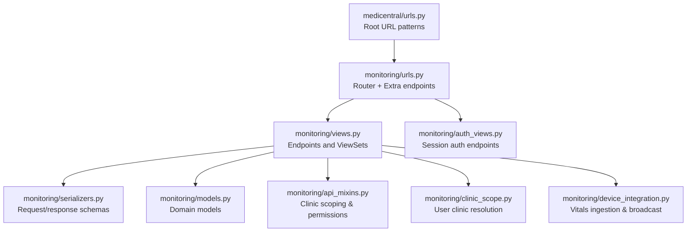
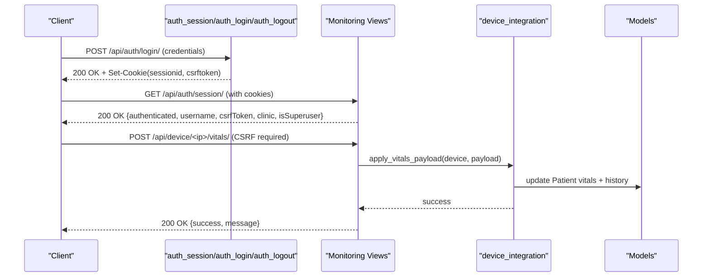
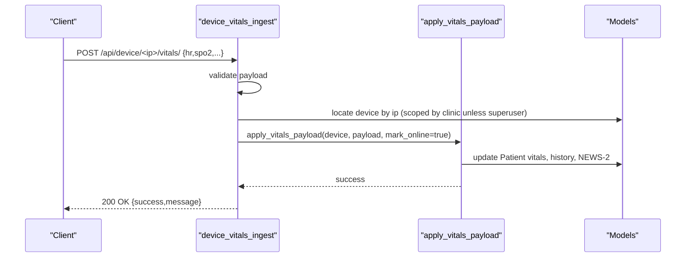
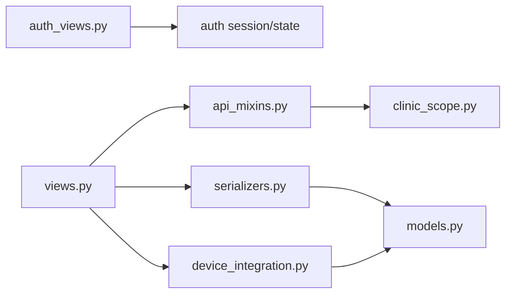

# API Endpoints Reference

<cite>
**Referenced Files in This Document**
- [urls.py](file://backend/medicentral/urls.py)
- [settings.py](file://backend/medicentral/settings.py)
- [urls.py](file://backend/monitoring/urls.py)
- [views.py](file://backend/monitoring/views.py)
- [auth_views.py](file://backend/monitoring/auth_views.py)
- [serializers.py](file://backend/monitoring/serializers.py)
- [models.py](file://backend/monitoring/models.py)
- [api_mixins.py](file://backend/monitoring/api_mixins.py)
- [clinic_scope.py](file://backend/monitoring/clinic_scope.py)
- [device_integration.py](file://backend/monitoring/device_integration.py)
- [api.ts](file://frontend/src/lib/api.ts)
- [authStore.ts](file://frontend/src/authStore.ts)
- [LoginPage.tsx](file://frontend/src/components/LoginPage.tsx)
</cite>

## Table of Contents
1. [Introduction](#introduction)
2. [Project Structure](#project-structure)
3. [Core Components](#core-components)
4. [Architecture Overview](#architecture-overview)
5. [Detailed Component Analysis](#detailed-component-analysis)
6. [Dependency Analysis](#dependency-analysis)
7. [Performance Considerations](#performance-considerations)
8. [Troubleshooting Guide](#troubleshooting-guide)
9. [Conclusion](#conclusion)
10. [Appendices](#appendices)

## Introduction
This document provides a comprehensive API reference for the monitoring application’s REST endpoints. It covers authentication, CRUD operations for clinics, departments, rooms, beds, and devices, plus specialized endpoints for patient monitoring, device ingestion, infrastructure diagnostics, and administrative functions. It also documents request/response schemas, authentication requirements, error handling, status codes, and client integration patterns used by the frontend.

## Project Structure
The API surface is exposed under /api/ and composed of:
- Session-based authentication endpoints
- REST endpoints for departments, rooms, beds, and devices (ModelViewSet-backed)
- Specialized endpoints for device ingestion, infrastructure diagnostics, patient listing, and health checks
- Root endpoint for service discovery

**Diagram sources**
- [urls.py:6-10](file://backend/medicentral/urls.py#L6-L10)
- [urls.py:12-23](file://backend/monitoring/urls.py#L12-L23)
- [views.py:32-50](file://backend/monitoring/views.py#L32-L50)
- [auth_views.py:14-55](file://backend/monitoring/auth_views.py#L14-L55)
- [serializers.py:100-285](file://backend/monitoring/serializers.py#L100-L285)
- [models.py:40-140](file://backend/monitoring/models.py#L40-L140)
- [api_mixins.py:11-67](file://backend/monitoring/api_mixins.py#L11-L67)
- [clinic_scope.py:15-23](file://backend/monitoring/clinic_scope.py#L15-L23)
- [device_integration.py:129-200](file://backend/monitoring/device_integration.py#L129-L200)

**Section sources**
- [urls.py:6-10](file://backend/medicentral/urls.py#L6-L10)
- [urls.py:12-23](file://backend/monitoring/urls.py#L12-L23)

## Core Components
- Authentication: Session-based with CSRF protection via Django REST Framework SessionAuthentication.
- Authorization: Per-request clinic scoping enforced by a mixin; superusers bypass scoping.
- Data models: Departments, Rooms, Beds, MonitorDevices, Patients, and related entities.
- Serializers: Define request/response schemas and validation rules.
- Device vitals ingestion: Accepts REST payloads and integrates with HL7 pipeline.

**Section sources**
- [settings.py:146-153](file://backend/medicentral/settings.py#L146-L153)
- [api_mixins.py:11-67](file://backend/monitoring/api_mixins.py#L11-L67)
- [models.py:40-140](file://backend/monitoring/models.py#L40-L140)
- [serializers.py:100-285](file://backend/monitoring/serializers.py#L100-L285)

## Architecture Overview
High-level API flow:
- Clients authenticate via session cookies and CSRF tokens.
- Subsequent requests are authenticated and optionally scoped to a clinic.
- Device vitals can arrive via REST or HL7; both paths converge into patient records and trigger real-time updates.

**Diagram sources**
- [auth_views.py:14-55](file://backend/monitoring/auth_views.py#L14-L55)
- [views.py:429-447](file://backend/monitoring/views.py#L429-L447)
- [device_integration.py:129-200](file://backend/monitoring/device_integration.py#L129-L200)

## Detailed Component Analysis

### Authentication Endpoints
- Base path: /api/auth/
- Methods and paths:
  - GET /api/auth/session/ — Returns current session state and CSRF token.
  - POST /api/auth/login/ — Logs in with username/password; sets session cookies.
  - POST /api/auth/logout/ — Clears session.

Authentication requirements:
- GET /api/auth/session/: No authentication required.
- POST /api/auth/login/: No authentication required.
- POST /api/auth/logout/: Requires authenticated session.

Response schemas:
- Session response keys: authenticated, username, csrfToken, clinic, isSuperuser.
- Login response keys: success, username, clinic.
- Logout response keys: success.

Status codes:
- 200 OK on success; 400 BAD REQUEST on invalid credentials; 403 FORBIDDEN when unauthenticated POSTs are used where required.

Client integration:
- Frontend stores CSRF token and uses it for non-safe methods.
- All authenticated requests include cookies.

**Section sources**
- [auth_views.py:14-55](file://backend/monitoring/auth_views.py#L14-L55)
- [authStore.ts:23-78](file://frontend/src/authStore.ts#L23-L78)
- [api.ts:10-19](file://frontend/src/lib/api.ts#L10-L19)

### CRUD Endpoints (ModelViewSet-backed)
Base path: /api/ (router-generated)
Registered routes:
- /api/departments/
- /api/rooms/
- /api/beds/
- /api/devices/

Behavior:
- Uses DRF ModelViewSet with ClinicScopedViewSetMixin.
- Superusers can access all records; regular users are scoped to their clinic.
- Creation automatically assigns clinic unless overridden by admin context.

Permissions and scoping:
- IsAuthenticated enforced.
- get_queryset filters by clinic for Department, Room, Bed, MonitorDevice.
- perform_create ensures clinic is set for Department and MonitorDevice unless admin.

Request/response schemas:
- Departments: id, name, clinicId.
- Rooms: id, name, departmentId.
- Beds: id, name, roomId.
- Devices: id, ipAddress, macAddress, model, localIp, hl7Enabled, hl7Port, serverTargetIp, hl7PeerIp, subnetMask, gateway, bedId, status, last_seen, hl7ConnectHandshake.

Notes:
- Device creation defaults include status, MAC/model, HL7 defaults, and optional HL7 handshake flag.
- Device update validates uniqueness of (clinic, ipAddress).

**Section sources**
- [urls.py:6-10](file://backend/monitoring/urls.py#L6-L10)
- [views.py:32-50](file://backend/monitoring/views.py#L32-L50)
- [api_mixins.py:11-67](file://backend/monitoring/api_mixins.py#L11-L67)
- [serializers.py:100-285](file://backend/monitoring/serializers.py#L100-L285)
- [models.py:40-140](file://backend/monitoring/models.py#L40-L140)

### Device Management Actions
- POST /api/devices/{id}/mark-online/ — Marks a device online and returns serialized device.
- GET /api/devices/{id}/connection-check/ — Comprehensive diagnostic for HL7 connectivity and device pipeline.

Response schema (connection-check):
- success, allOk, deviceId, ipAddress, nowServerTimeMs, lastMessageAtMs, lastSeenAtMs, lastHl7RxAtMs, secondsSinceLastMessage, isReceivingData, dataTimeoutSeconds, isK12ZeroByte, hl7, hl7Diagnostic, firewallHints, assignment, warnings, hints, summary, checkTone.

Status codes:
- 200 OK on success; 200 OK with error payload on internal diagnostic exceptions.

**Section sources**
- [views.py:51-314](file://backend/monitoring/views.py#L51-L314)

### Specialized Endpoints
- POST /api/devices/from-screen/ — Upload monitor screenshot to auto-create a device record; requires image and bedId; admin or clinic-scoped access.
- GET /api/infrastructure/ — Returns scoped lists of departments, rooms, beds, devices; includes HL7 diagnostics and Gemini configuration status; superuser gets full data.
- GET /api/patients/ — Returns serialized patient list scoped to clinic; superuser gets all.
- GET /api/health/ — Health check against database.
- POST /api/device/<ip>/vitals/ — Ingest vitals for a device by IP; validates payload and applies to associated patient.

Request/response schemas:
- from-screen: Expects multipart/form-data with image/file and bedId; returns created MonitorDevice.
- infrastructure: Returns arrays of departments, rooms, beds, devices and diagnostic info; empty arrays for non-superuser without clinic.
- patients: Returns array of patient objects with vitals, alarms, history, and related data.
- health: Returns status and database connection info.
- device vitals ingest: Validates fields hr, spo2, nibpSys, nibpDia, rr, temp; returns success.

Status codes:
- 400 BAD REQUEST for missing/invalid fields; 403 FORBIDDEN for insufficient permissions; 404 NOT FOUND if device not registered; 422 UNPROCESSABLE ENTITY for parsing errors; 503 SERVICE_UNAVAILABLE for misconfiguration.

**Section sources**
- [views.py:317-447](file://backend/monitoring/views.py#L317-L447)
- [serializers.py:287-294](file://backend/monitoring/serializers.py#L287-L294)

### Device Vitals Ingestion Flow

**Diagram sources**
- [views.py:429-447](file://backend/monitoring/views.py#L429-L447)
- [device_integration.py:129-200](file://backend/monitoring/device_integration.py#L129-L200)

## Dependency Analysis
Key dependencies and constraints:
- Authentication middleware and DRF SessionAuthentication enforce cookie-based sessions and CSRF for non-safe methods.
- ClinicScopedViewSetMixin enforces per-request clinic scoping for non-superusers.
- Device creation/update depends on clinic scoping and unique constraint on (clinic, ip_address).
- Device vitals ingestion requires device to be assigned to a bed with an admitted patient.

**Diagram sources**
- [auth_views.py:14-55](file://backend/monitoring/auth_views.py#L14-L55)
- [views.py:32-50](file://backend/monitoring/views.py#L32-L50)
- [api_mixins.py:11-67](file://backend/monitoring/api_mixins.py#L11-L67)
- [clinic_scope.py:15-23](file://backend/monitoring/clinic_scope.py#L15-L23)
- [serializers.py:100-285](file://backend/monitoring/serializers.py#L100-L285)
- [models.py:40-140](file://backend/monitoring/models.py#L40-L140)
- [device_integration.py:129-200](file://backend/monitoring/device_integration.py#L129-L200)

**Section sources**
- [settings.py:68-78](file://backend/medicentral/settings.py#L68-L78)
- [settings.py:146-153](file://backend/medicentral/settings.py#L146-L153)
- [api_mixins.py:11-67](file://backend/monitoring/api_mixins.py#L11-L67)
- [models.py:133-138](file://backend/monitoring/models.py#L133-L138)

## Performance Considerations
- Device vitals ingestion updates patient records atomically and writes history entries; avoid excessive small payloads to reduce contention.
- Infrastructure diagnostics collect HL7 listener status and diagnostic summaries; cache or throttle repeated calls.
- Superuser queries may return larger datasets; prefer scoping to clinic for regular users.

## Troubleshooting Guide
Common issues and resolutions:
- Authentication failures:
  - Ensure cookies are sent and CSRF token is included for non-safe methods.
  - Verify session endpoints return authenticated state.
- Device not found:
  - Confirm device IP registration and clinic association.
- No vitals recorded:
  - Ensure device is assigned to a bed with an admitted patient.
- HL7 connectivity warnings:
  - Review firewall hints and listener status; validate HL7 port and handshake settings.

**Section sources**
- [authStore.ts:23-78](file://frontend/src/authStore.ts#L23-L78)
- [views.py:429-447](file://backend/monitoring/views.py#L429-L447)
- [views.py:59-314](file://backend/monitoring/views.py#L59-L314)
- [device_integration.py:129-200](file://backend/monitoring/device_integration.py#L129-L200)

## Conclusion
The API provides robust session-based authentication, strict clinic scoping, and comprehensive CRUD and operational endpoints for clinical infrastructure and patient monitoring. Client integrations rely on cookies and CSRF tokens, with clear request/response schemas and error handling patterns.

## Appendices

### Endpoint Catalog
- Authentication
  - GET /api/auth/session/ — Session state and CSRF token
  - POST /api/auth/login/ — Login with credentials
  - POST /api/auth/logout/ — Logout
- CRUD
  - Departments: /api/departments/ (list/create), /api/departments/{id}/ (retrieve/update/destroy)
  - Rooms: /api/rooms/ (list/create), /api/rooms/{id}/ (retrieve/update/destroy)
  - Beds: /api/beds/ (list/create), /api/beds/{id}/ (retrieve/update/destroy)
  - Devices: /api/devices/ (list/create), /api/devices/{id}/ (retrieve/update/destroy)
- Device actions
  - POST /api/devices/{id}/mark-online/ — Mark device online
  - GET /api/devices/{id}/connection-check/ — Diagnostic report
- Specialized
  - POST /api/devices/from-screen/ — Create device from monitor screenshot
  - GET /api/infrastructure/ — Scoped infrastructure data and diagnostics
  - GET /api/patients/ — Scoped patient list
  - GET /api/health/ — Health check
  - POST /api/device/<ip>/vitals/ — Ingest vitals

### Request/Response Examples and Schemas
- Device vitals ingest (POST /api/device/<ip>/vitals/)
  - Request: JSON object with optional fields hr, spo2, nibpSys, nibpDia, rr, temp
  - Response: {success: boolean, message: string}
- Device creation (POST /api/devices/)
  - Request: MonitorDevice fields (ipAddress, macAddress, model, localIp, hl7Enabled, hl7Port, serverTargetIp, hl7PeerIp, subnetMask, gateway, bedId, hl7ConnectHandshake)
  - Response: Same as request with id, status, last_seen
- Session state (GET /api/auth/session/)
  - Response: {authenticated: boolean, username: string|null, csrfToken: string, clinic: {id: string, name: string}|null, isSuperuser: boolean}
- Login (POST /api/auth/login/)
  - Request: {username: string, password: string}
  - Response: {success: boolean, username: string, clinic: {id: string, name: string}|null}
- Logout (POST /api/auth/logout/)
  - Response: {success: boolean}

### Filtering, Pagination, Search
- Filtering:
  - Devices: hl7_enabled, status, ip_address, mac_address, model, clinic
  - Departments: clinic
  - Rooms: department
  - Beds: room
- Search:
  - Admin interface supports search_fields for devices and departments.
- Pagination:
  - Not explicitly enabled in the provided code; defaults apply.

**Section sources**
- [urls.py:6-10](file://backend/monitoring/urls.py#L6-L10)
- [admin.py:25-25](file://backend/monitoring/admin.py#L25-L25)
- [admin.py:46-46](file://backend/monitoring/admin.py#L46-L46)
- [admin.py:65-66](file://backend/monitoring/admin.py#L65-L66)

### Client Integration Best Practices
- Use authedFetch or equivalent to include cookies and CSRF for authenticated requests.
- Store and reuse CSRF token from session endpoint.
- Prefer HTTPS and configure CORS/CSRF origins appropriately in production.
- For real-time updates, connect to WebSocket endpoint derived from backend origin.

**Section sources**
- [authStore.ts:82-106](file://frontend/src/authStore.ts#L82-L106)
- [api.ts:10-34](file://frontend/src/lib/api.ts#L10-L34)
- [settings.py:46-51](file://backend/medicentral/settings.py#L46-L51)
- [settings.py:43-44](file://backend/medicentral/settings.py#L43-L44)