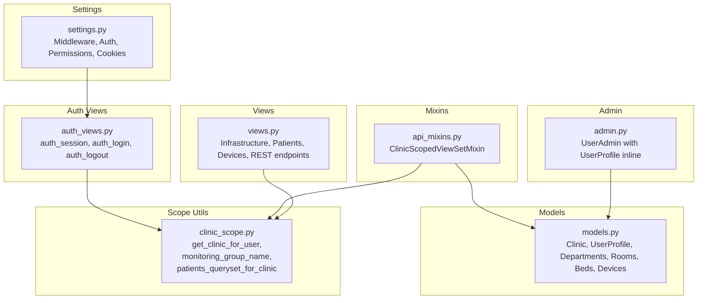
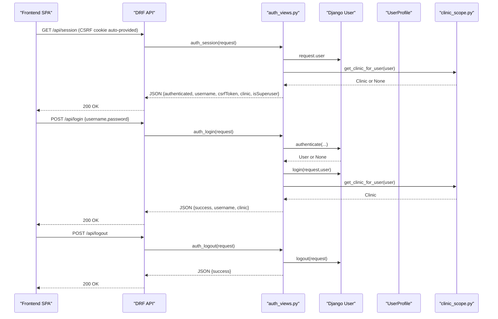
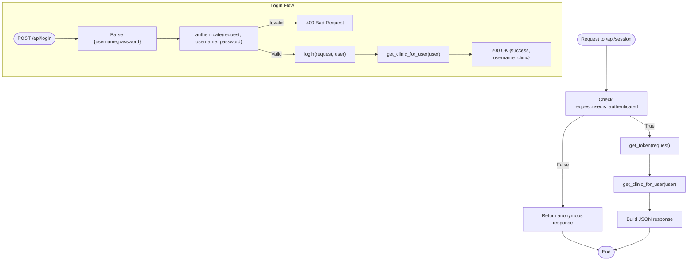
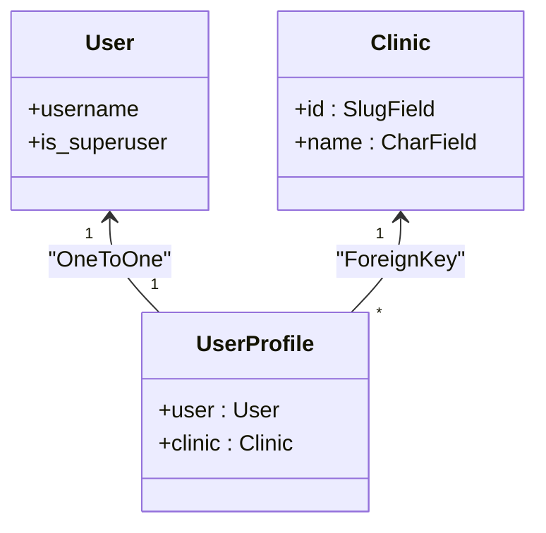
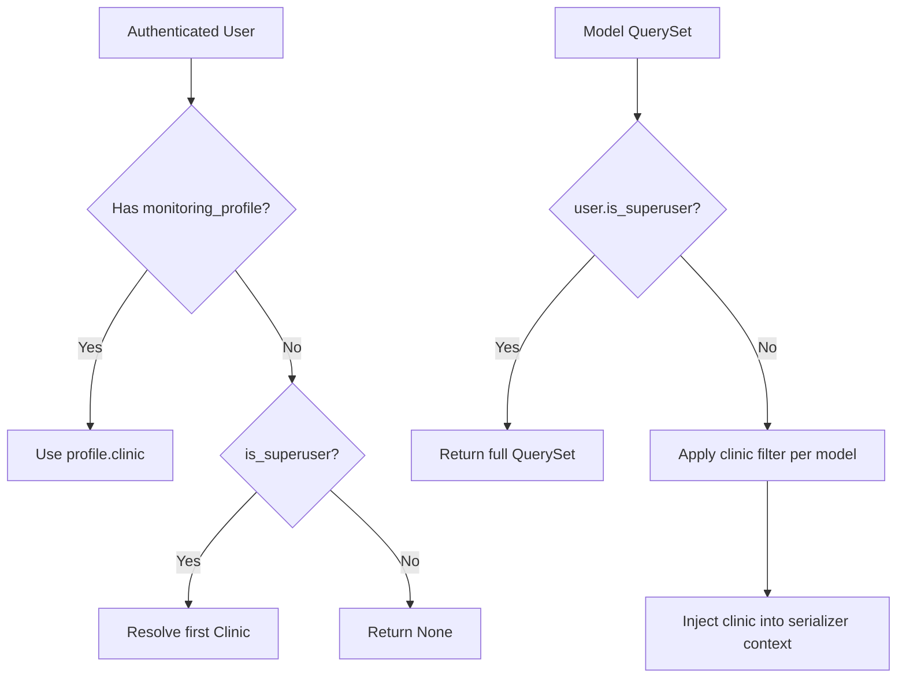
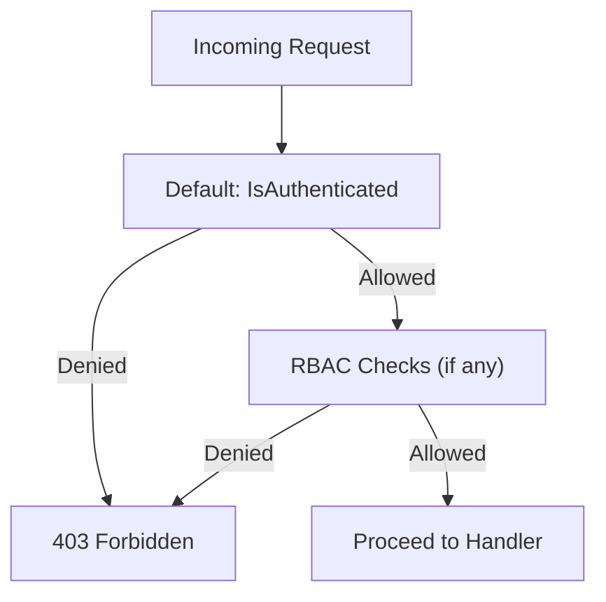
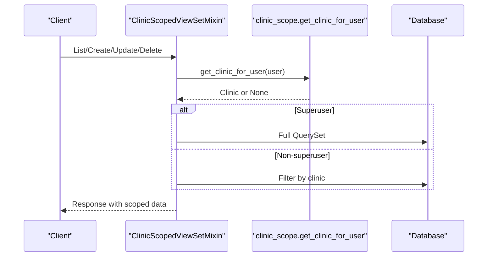
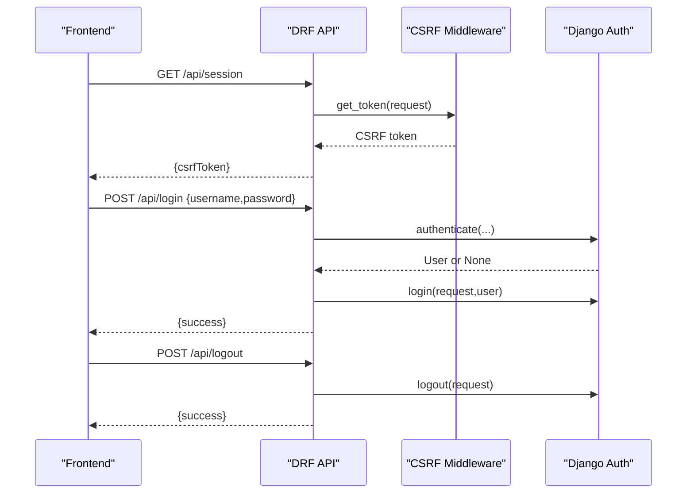
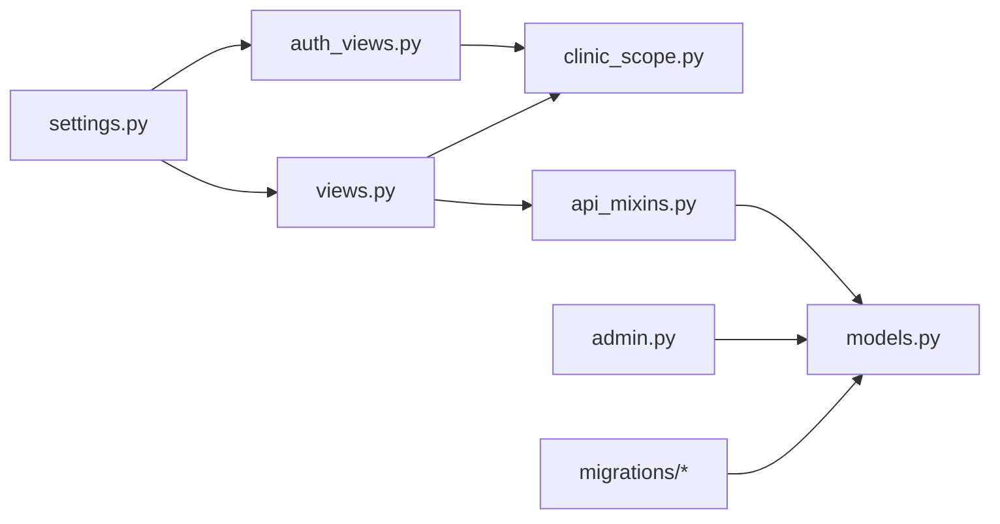

# Authentication & Authorization

<cite>
**Referenced Files in This Document**
- [settings.py](file://backend/medicentral/settings.py)
- [urls.py](file://backend/medicentral/urls.py)
- [auth_views.py](file://backend/monitoring/auth_views.py)
- [models.py](file://backend/monitoring/models.py)
- [clinic_scope.py](file://backend/monitoring/clinic_scope.py)
- [api_mixins.py](file://backend/monitoring/api_mixins.py)
- [views.py](file://backend/monitoring/views.py)
- [admin.py](file://backend/monitoring/admin.py)
- [0003_clinic_multitenant.py](file://backend/monitoring/migrations/0003_clinic_multitenant.py)
- [0004_fill_default_clinic.py](file://backend/monitoring/migrations/0004_fill_default_clinic.py)
</cite>

## Table of Contents
1. [Introduction](#introduction)
2. [Project Structure](#project-structure)
3. [Core Components](#core-components)
4. [Architecture Overview](#architecture-overview)
5. [Detailed Component Analysis](#detailed-component-analysis)
6. [Dependency Analysis](#dependency-analysis)
7. [Performance Considerations](#performance-considerations)
8. [Security Considerations](#security-considerations)
9. [Troubleshooting Guide](#troubleshooting-guide)
10. [Conclusion](#conclusion)

## Introduction
This document explains the authentication and authorization system used by the backend. It covers session-based authentication via Django’s built-in authentication framework, user profile creation and clinic association, role-based access control, multi-tenant clinic scoping, permission management, and CSRF protection. It also documents login/logout workflows, session management, and security hardening settings. Practical examples show how to implement custom authentication views and protect API endpoints.

## Project Structure
The authentication and authorization logic spans several modules:
- Django settings define middleware, authentication, permissions, and security cookies.
- Session-based authentication endpoints are implemented as DRF API views.
- User profiles link Django Users to Clinics.
- Clinic scoping utilities enforce tenant isolation across models.
- View mixins apply clinic filters and create resources scoped to the authenticated user’s clinic.
- Admin integrates user profile inline editing for clinic assignment.

**Diagram sources**
- [settings.py:68-78](file://backend/medicentral/settings.py#L68-L78)
- [auth_views.py:14-56](file://backend/monitoring/auth_views.py#L14-L56)
- [models.py:5-38](file://backend/monitoring/models.py#L5-L38)
- [clinic_scope.py:11-30](file://backend/monitoring/clinic_scope.py#L11-L30)
- [api_mixins.py:11-67](file://backend/monitoring/api_mixins.py#L11-L67)
- [views.py:32-50](file://backend/monitoring/views.py#L32-L50)
- [admin.py:29-41](file://backend/monitoring/admin.py#L29-L41)

**Section sources**
- [settings.py:53-78](file://backend/medicentral/settings.py#L53-L78)
- [urls.py:6-11](file://backend/medicentral/urls.py#L6-L11)

## Core Components
- Session-based authentication endpoints:
  - Session introspection endpoint returns authentication status, username, CSRF token, and clinic scope for authenticated users.
  - Login endpoint authenticates credentials and starts a session.
  - Logout endpoint terminates the session.
- User profile and clinic association:
  - UserProfile links Django User to Clinic and is editable in the admin via a stacked inline.
- Clinic scope utilities:
  - Resolve a user’s clinic from their profile or superuser privileges.
  - Build WebSocket group names per clinic.
  - Filter patient querysets by clinic.
- Clinic-scoped view mixin:
  - Enforce per-user clinic boundaries on CRUD operations for departments, rooms, beds, and devices.
  - Automatically set clinic context for serializer creation.
- Settings and middleware:
  - Session, CSRF, and security middleware are enabled.
  - Default DRF permission requires authentication; session authentication is enabled.
  - Secure cookie flags and HSTS/HSTS preload are configurable for production.

**Section sources**
- [auth_views.py:14-56](file://backend/monitoring/auth_views.py#L14-L56)
- [models.py:18-38](file://backend/monitoring/models.py#L18-L38)
- [clinic_scope.py:15-30](file://backend/monitoring/clinic_scope.py#L15-L30)
- [api_mixins.py:11-67](file://backend/monitoring/api_mixins.py#L11-L67)
- [settings.py:146-153](file://backend/medicentral/settings.py#L146-L153)

## Architecture Overview
The authentication and authorization architecture combines Django’s built-in authentication with DRF session authentication and a clinic-scoped multi-tenancy model.

**Diagram sources**
- [auth_views.py:14-56](file://backend/monitoring/auth_views.py#L14-L56)
- [clinic_scope.py:15-23](file://backend/monitoring/clinic_scope.py#L15-L23)

## Detailed Component Analysis

### Session-based Authentication Endpoints
- Endpoint: GET /api/session
  - Returns authentication status, username, CSRF token, clinic scope, and superuser flag.
  - Uses CSRF token retrieval to support SPA cookie-based sessions.
- Endpoint: POST /api/login
  - Validates credentials, authenticates the user, sets the session, resolves clinic, and returns success data.
- Endpoint: POST /api/logout
  - Terminates the current session and returns success.

**Diagram sources**
- [auth_views.py:14-56](file://backend/monitoring/auth_views.py#L14-L56)
- [clinic_scope.py:15-23](file://backend/monitoring/clinic_scope.py#L15-L23)

**Section sources**
- [auth_views.py:14-56](file://backend/monitoring/auth_views.py#L14-L56)

### User Profile Creation and Clinic Association
- UserProfile is a OneToOne link from Django User to Clinic.
- Admin integrates a stacked inline for UserProfile under the User admin page, enabling clinic assignment.
- Superusers bypass clinic scoping and can access all tenants.

**Diagram sources**
- [models.py:18-38](file://backend/monitoring/models.py#L18-L38)
- [admin.py:29-41](file://backend/monitoring/admin.py#L29-L41)

**Section sources**
- [models.py:18-38](file://backend/monitoring/models.py#L18-L38)
- [admin.py:29-41](file://backend/monitoring/admin.py#L29-L41)

### Clinic Scope System and Multi-Tenant Isolation
- Clinic resolution:
  - For authenticated users, clinic is taken from UserProfile.
  - For superusers, clinic is resolved to the first clinic or None.
- Tenant-aware filtering:
  - Mixin enforces per-model clinic filters for departments, rooms, beds, and devices.
  - Serializer context injects clinic for resource creation.
- Patient querysets:
  - Utilities filter patients by clinic and prefetch related entries.

**Diagram sources**
- [clinic_scope.py:15-30](file://backend/monitoring/clinic_scope.py#L15-L30)
- [api_mixins.py:23-67](file://backend/monitoring/api_mixins.py#L23-L67)

**Section sources**
- [clinic_scope.py:15-30](file://backend/monitoring/clinic_scope.py#L15-L30)
- [api_mixins.py:11-67](file://backend/monitoring/api_mixins.py#L11-L67)

### Role-Based Access Control and Permission Management
- Default DRF permission: IsAuthenticated.
- Session authentication is enabled.
- Superusers bypass clinic scoping checks.
- Additional RBAC enforcement occurs in selected views:
  - Image-to-device provisioning enforces clinic membership for non-superusers.
  - Infrastructure and patient listing endpoints restrict data by clinic for non-superusers.

**Diagram sources**
- [settings.py:146-153](file://backend/medicentral/settings.py#L146-L153)
- [views.py:317-364](file://backend/monitoring/views.py#L317-L364)
- [views.py:367-427](file://backend/monitoring/views.py#L367-L427)

**Section sources**
- [settings.py:146-153](file://backend/medicentral/settings.py#L146-L153)
- [views.py:317-364](file://backend/monitoring/views.py#L317-L364)
- [views.py:367-427](file://backend/monitoring/views.py#L367-L427)

### Protecting API Endpoints with Clinic Scoping
- Use the ClinicScopedViewSetMixin to automatically:
  - Enforce IsAuthenticated.
  - Filter querysets by clinic.
  - Save new resources with clinic set when appropriate.
- Example usage:
  - DepartmentViewSet, RoomViewSet, BedViewSet, DeviceViewSet inherit from the mixin.

**Diagram sources**
- [api_mixins.py:11-67](file://backend/monitoring/api_mixins.py#L11-L67)
- [clinic_scope.py:15-23](file://backend/monitoring/clinic_scope.py#L15-L23)

**Section sources**
- [api_mixins.py:11-67](file://backend/monitoring/api_mixins.py#L11-L67)
- [views.py:32-50](file://backend/monitoring/views.py#L32-L50)

### Login/Logout Workflows and CSRF Protection
- Login:
  - Frontend posts credentials to POST /api/login.
  - Backend authenticates, logs in, resolves clinic, and returns success.
- Logout:
  - Frontend posts to POST /api/logout.
  - Backend clears session and returns success.
- CSRF:
  - CSRF middleware is enabled.
  - CSRF token is returned by the session introspection endpoint.
  - Trusted origins can be configured for CSRF in production.

**Diagram sources**
- [auth_views.py:14-56](file://backend/monitoring/auth_views.py#L14-L56)
- [settings.py:72-74](file://backend/medicentral/settings.py#L72-L74)

**Section sources**
- [auth_views.py:14-56](file://backend/monitoring/auth_views.py#L14-L56)
- [settings.py:72-74](file://backend/medicentral/settings.py#L72-L74)

## Dependency Analysis
- Authentication and session:
  - DRF SessionAuthentication and IsAuthenticated permission classes.
  - Django Session and CSRF middleware.
- Multi-tenancy:
  - ClinicScopedViewSetMixin depends on clinic_scope utilities.
  - Models include clinic foreign keys; migrations add constraints and fields.
- Admin integration:
  - UserAdmin inlines UserProfile for clinic assignment.

**Diagram sources**
- [settings.py:68-78](file://backend/medicentral/settings.py#L68-L78)
- [auth_views.py:11](file://backend/monitoring/auth_views.py#L11)
- [api_mixins.py:7-8](file://backend/monitoring/api_mixins.py#L7-L8)
- [models.py:5-38](file://backend/monitoring/models.py#L5-L38)
- [admin.py:29-41](file://backend/monitoring/admin.py#L29-L41)
- [0003_clinic_multitenant.py:16-65](file://backend/monitoring/migrations/0003_clinic_multitenant.py#L16-L65)
- [0004_fill_default_clinic.py:7-36](file://backend/monitoring/migrations/0004_fill_default_clinic.py#L7-L36)

**Section sources**
- [settings.py:68-78](file://backend/medicentral/settings.py#L68-L78)
- [auth_views.py:11](file://backend/monitoring/auth_views.py#L11)
- [api_mixins.py:7-8](file://backend/monitoring/api_mixins.py#L7-L8)
- [models.py:5-38](file://backend/monitoring/models.py#L5-L38)
- [admin.py:29-41](file://backend/monitoring/admin.py#L29-L41)
- [0003_clinic_multitenant.py:16-65](file://backend/monitoring/migrations/0003_clinic_multitenant.py#L16-L65)
- [0004_fill_default_clinic.py:7-36](file://backend/monitoring/migrations/0004_fill_default_clinic.py#L7-L36)

## Performance Considerations
- Use select_related and prefetch_related in clinic-scoped queries to minimize database hits.
- Avoid unnecessary serialization of large nested objects; scope querysets early in view mixins.
- Cache frequently accessed clinic metadata for authenticated users when appropriate.
- Keep CSRF cookie and session lifecycles aligned with application needs; consider adjusting session timeout settings if required.

## Security Considerations
- Password policies:
  - Django validators are enabled by default for minimum length, common passwords, and numerical-only passwords.
- Session security:
  - Secure cookie flags and CSRF cookie security can be toggled via environment variables.
  - HSTS, SSL redirect, and proxy headers are configurable for deployments behind reverse proxies.
- CSRF protection:
  - CSRF middleware is enabled; CSRF token is exposed via the session endpoint.
  - Configure trusted origins for CSRF in production environments.
- Cookie settings:
  - SESSION_COOKIE_SECURE and CSRF_COOKIE_SECURE are configurable for HTTPS-only cookies.
  - HSTS preloading and subdomain inclusion can be enabled in production.

**Section sources**
- [settings.py:121-126](file://backend/medicentral/settings.py#L121-L126)
- [settings.py:155-168](file://backend/medicentral/settings.py#L155-L168)
- [settings.py:43-44](file://backend/medicentral/settings.py#L43-L44)

## Troubleshooting Guide
- User cannot log in:
  - Verify credentials and ensure the user is not locked out.
  - Confirm session authentication is enabled and CSRF token is included.
- Clinic scope errors:
  - Superusers can access all data; otherwise, ensure UserProfile is linked to a Clinic.
  - For views inheriting from ClinicScopedViewSetMixin, confirm the user has a clinic or the endpoint will return empty results.
- CSRF failures:
  - Ensure the frontend reads and sends the CSRF token from the session endpoint.
  - Verify CSRF_TRUSTED_ORIGINS matches the frontend origin in production.
- Admin clinic assignment:
  - Use the User admin page to attach a UserProfile and select the clinic.

**Section sources**
- [auth_views.py:14-56](file://backend/monitoring/auth_views.py#L14-L56)
- [api_mixins.py:14-21](file://backend/monitoring/api_mixins.py#L14-L21)
- [admin.py:29-41](file://backend/monitoring/admin.py#L29-L41)
- [settings.py:43-44](file://backend/medicentral/settings.py#L43-L44)

## Conclusion
The system leverages Django’s built-in authentication with DRF session authentication to provide secure, SPA-friendly session management. Multi-tenancy is enforced through clinic-scoped query filtering and automatic serializer context injection. Superusers retain broad access while regular users are isolated to their clinic’s data. CSRF protection and secure cookie settings are configurable for production-grade deployments. The provided mixins and utilities streamline building tenant-aware APIs and admin workflows.