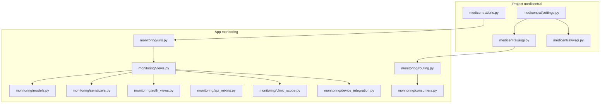
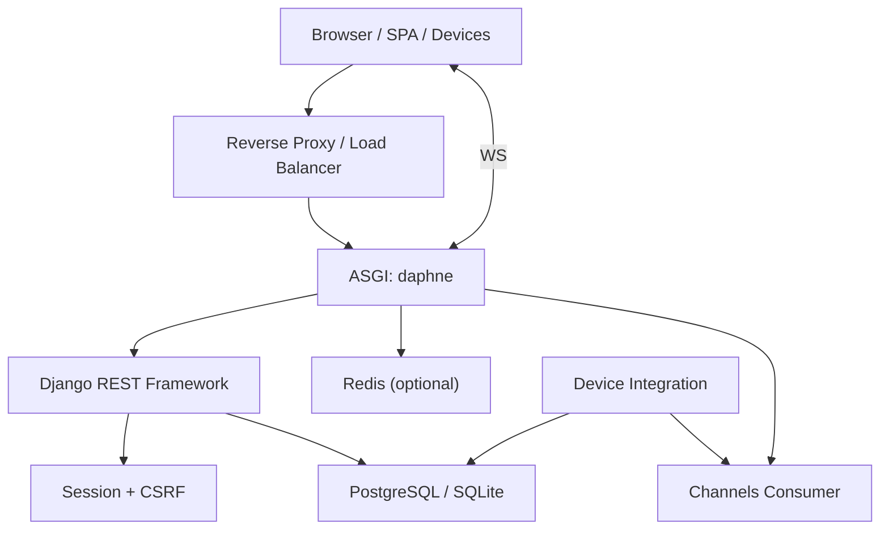
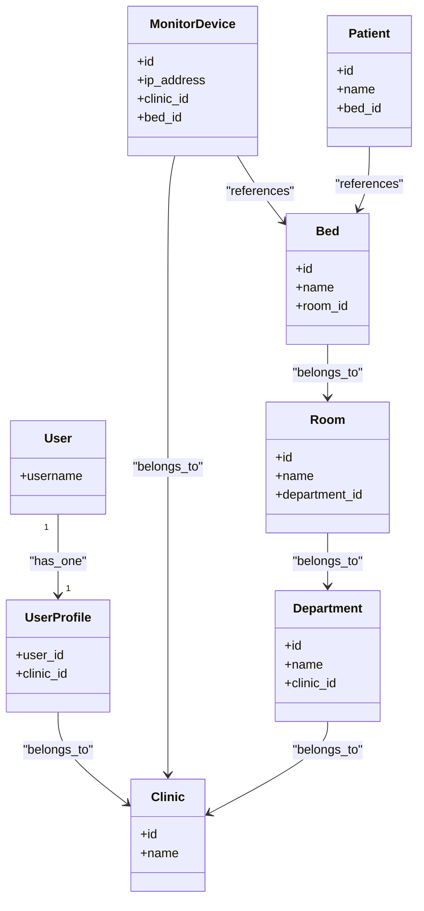
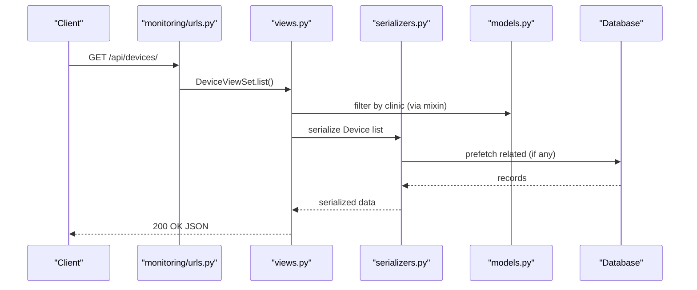
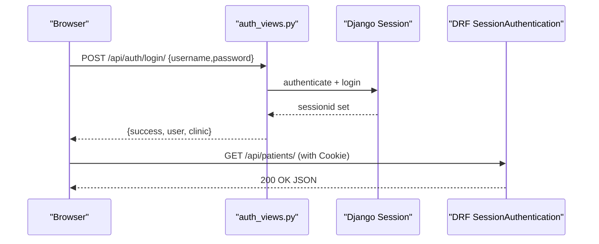
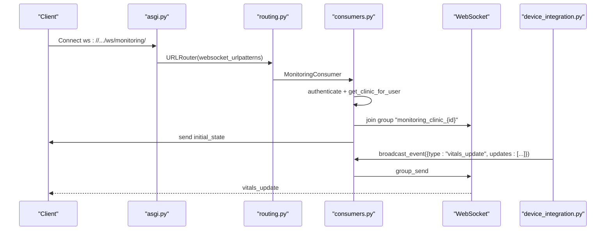
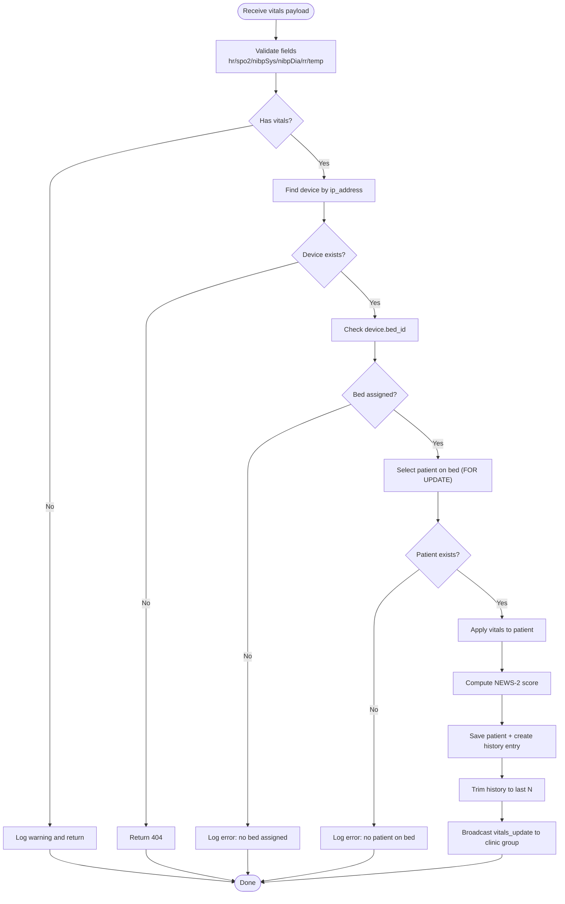
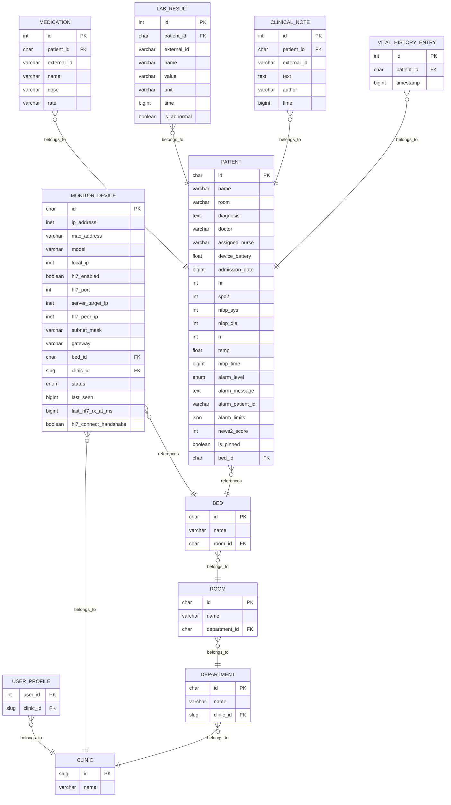
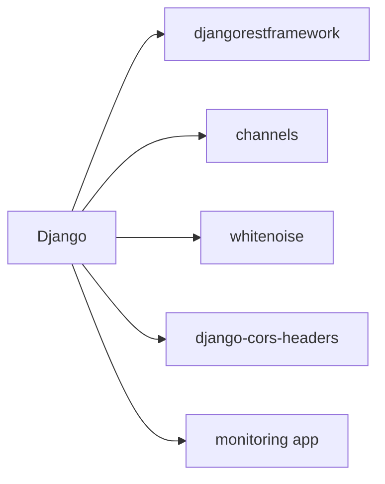

# Backend Architecture

<cite>
**Referenced Files in This Document**
- [settings.py](file://backend/medicentral/settings.py)
- [asgi.py](file://backend/medicentral/asgi.py)
- [wsgi.py](file://backend/medicentral/wsgi.py)
- [urls.py](file://backend/medicentral/urls.py)
- [models.py](file://backend/monitoring/models.py)
- [urls.py](file://backend/monitoring/urls.py)
- [views.py](file://backend/monitoring/views.py)
- [routing.py](file://backend/monitoring/routing.py)
- [serializers.py](file://backend/monitoring/serializers.py)
- [auth_views.py](file://backend/monitoring/auth_views.py)
- [clinic_scope.py](file://backend/monitoring/clinic_scope.py)
- [api_mixins.py](file://backend/monitoring/api_mixins.py)
- [consumers.py](file://backend/monitoring/consumers.py)
- [device_integration.py](file://backend/monitoring/device_integration.py)
</cite>

## Table of Contents
1. [Introduction](#introduction)
2. [Project Structure](#project-structure)
3. [Core Components](#core-components)
4. [Architecture Overview](#architecture-overview)
5. [Detailed Component Analysis](#detailed-component-analysis)
6. [Dependency Analysis](#dependency-analysis)
7. [Performance Considerations](#performance-considerations)
8. [Troubleshooting Guide](#troubleshooting-guide)
9. [Conclusion](#conclusion)
10. [Appendices](#appendices)

## Introduction
This document describes the backend architecture of a Django-based system for clinical monitoring. It covers application structure, ASGI/WSGI configuration for production, multi-tenant design with clinic-based isolation, REST API built with Django REST Framework, database models, authentication and permissions, settings and environment management, security hardening, scalability and caching, and practical API usage patterns integrating with the frontend and medical device layers.

## Project Structure
The backend is organized into a Django project named medicentral with a single Django app monitoring. The app encapsulates models, views, serializers, routing, consumers, and device integration logic. URLs are split between the project root and the monitoring app.

**Diagram sources**
- [urls.py:1-11](file://backend/medicentral/urls.py#L1-L11)
- [settings.py:1-218](file://backend/medicentral/settings.py#L1-L218)
- [asgi.py:1-22](file://backend/medicentral/asgi.py#L1-L22)
- [wsgi.py:1-8](file://backend/medicentral/wsgi.py#L1-L8)
- [urls.py:1-24](file://backend/monitoring/urls.py#L1-L24)
- [views.py:1-419](file://backend/monitoring/views.py#L1-L419)
- [models.py:1-224](file://backend/monitoring/models.py#L1-L224)
- [routing.py:1-8](file://backend/monitoring/routing.py#L1-L8)
- [auth_views.py:1-56](file://backend/monitoring/auth_views.py#L1-L56)
- [clinic_scope.py:1-30](file://backend/monitoring/clinic_scope.py#L1-L30)
- [api_mixins.py:1-67](file://backend/monitoring/api_mixins.py#L1-L67)
- [serializers.py:1-291](file://backend/monitoring/serializers.py#L1-L291)
- [consumers.py:1-46](file://backend/monitoring/consumers.py#L1-L46)
- [device_integration.py:1-232](file://backend/monitoring/device_integration.py#L1-L232)

**Section sources**
- [urls.py:1-11](file://backend/medicentral/urls.py#L1-L11)
- [urls.py:1-24](file://backend/monitoring/urls.py#L1-L24)

## Core Components
- Settings and environment management define database selection, static storage, DRF defaults, CORS/CSRF, security cookies, SSL/HSTS, proxy mode, Redis-backed Channels, and logging.
- ASGI/WSGI applications configure HTTP and WebSocket routing with Channels and authentication middleware.
- Monitoring app implements multi-tenant models (Clinic, Department, Room, Bed, Patient, MonitorDevice) and device vitals ingestion.
- REST API uses DRF routers and custom mixins to enforce clinic-scoped access.
- Authentication uses Django sessions with CSRF tokens and DRF SessionAuthentication.
- Real-time updates use Django Channels with a WebSocket consumer and group broadcasts.

**Section sources**
- [settings.py:1-218](file://backend/medicentral/settings.py#L1-L218)
- [asgi.py:1-22](file://backend/medicentral/asgi.py#L1-L22)
- [wsgi.py:1-8](file://backend/medicentral/wsgi.py#L1-L8)
- [models.py:1-224](file://backend/monitoring/models.py#L1-L224)
- [urls.py:1-24](file://backend/monitoring/urls.py#L1-L24)
- [views.py:1-419](file://backend/monitoring/views.py#L1-L419)
- [auth_views.py:1-56](file://backend/monitoring/auth_views.py#L1-L56)
- [clinic_scope.py:1-30](file://backend/monitoring/clinic_scope.py#L1-L30)
- [api_mixins.py:1-67](file://backend/monitoring/api_mixins.py#L1-L67)
- [routing.py:1-8](file://backend/monitoring/routing.py#L1-L8)
- [consumers.py:1-46](file://backend/monitoring/consumers.py#L1-L46)

## Architecture Overview
The system supports HTTP REST APIs and real-time WebSocket updates. ASGI routes HTTP and WebSocket traffic, while WSGI serves HTTP in legacy deployments. Channels integrates with Django authentication and groups patients by clinic.

**Diagram sources**
- [asgi.py:1-22](file://backend/medicentral/asgi.py#L1-L22)
- [settings.py:167-183](file://backend/medicentral/settings.py#L167-L183)
- [routing.py:1-8](file://backend/monitoring/routing.py#L1-L8)
- [consumers.py:1-46](file://backend/monitoring/consumers.py#L1-L46)
- [device_integration.py:1-232](file://backend/monitoring/device_integration.py#L1-L232)

## Detailed Component Analysis

### Multi-Tenant Design and Clinic Scope
- Clinic-based isolation ensures users see only resources belonging to their clinic. A UserProfile links Django User to Clinic. Superusers can access global data.
- The ClinicScopedViewSetMixin filters ViewSet querysets per clinic and enforces clinic context during creation.
- The clinic_scope module resolves the clinic for a given user and constructs group names for WebSocket channels.

**Diagram sources**
- [models.py:5-224](file://backend/monitoring/models.py#L5-L224)
- [clinic_scope.py:1-30](file://backend/monitoring/clinic_scope.py#L1-L30)
- [api_mixins.py:1-67](file://backend/monitoring/api_mixins.py#L1-L67)

**Section sources**
- [models.py:5-224](file://backend/monitoring/models.py#L5-L224)
- [clinic_scope.py:1-30](file://backend/monitoring/clinic_scope.py#L1-L30)
- [api_mixins.py:1-67](file://backend/monitoring/api_mixins.py#L1-L67)

### REST API Design with Django REST Framework
- URL routing uses DRF DefaultRouter for CRUD endpoints on departments, rooms, beds, and devices. Additional endpoints include authentication, infrastructure, patients, health, and device vitals ingestion.
- Views implement clinic-scoped filtering via ClinicScopedViewSetMixin and expose actions such as marking a device online and connection checks.
- Serializers normalize field names and validate uniqueness of device IP within a clinic, and support device vitals ingestion.

**Diagram sources**
- [urls.py:1-24](file://backend/monitoring/urls.py#L1-L24)
- [views.py:32-50](file://backend/monitoring/views.py#L32-L50)
- [serializers.py:146-261](file://backend/monitoring/serializers.py#L146-L261)
- [models.py:77-140](file://backend/monitoring/models.py#L77-L140)
- [api_mixins.py:23-41](file://backend/monitoring/api_mixins.py#L23-L41)

**Section sources**
- [urls.py:1-24](file://backend/monitoring/urls.py#L1-L24)
- [views.py:32-50](file://backend/monitoring/views.py#L32-L50)
- [serializers.py:146-261](file://backend/monitoring/serializers.py#L146-L261)
- [api_mixins.py:1-67](file://backend/monitoring/api_mixins.py#L1-L67)

### Authentication and Permissions
- Session-based login uses Django’s authenticate/login/logout with CSRF protection. DRF uses SessionAuthentication so browser clients can consume both REST and WebSockets seamlessly.
- Authentication endpoints provide session info, login, and logout. Clinic context is returned with session info for frontend routing.
- Permissions default to IsAuthenticated globally; ViewSets enforce clinic scoping.

**Diagram sources**
- [auth_views.py:1-56](file://backend/monitoring/auth_views.py#L1-L56)
- [settings.py:146-153](file://backend/medicentral/settings.py#L146-L153)

**Section sources**
- [auth_views.py:1-56](file://backend/monitoring/auth_views.py#L1-L56)
- [settings.py:146-153](file://backend/medicentral/settings.py#L146-L153)

### Real-Time Updates with WebSockets
- ASGI routes WebSocket connections through AuthMiddlewareStack and AllowedHostsOriginValidator.
- The MonitoringConsumer authenticates users, resolves clinic, joins a clinic-specific group, sends initial state, and handles incoming messages.
- Device vitals ingestion triggers broadcasts to the clinic group.

**Diagram sources**
- [asgi.py:1-22](file://backend/medicentral/asgi.py#L1-L22)
- [routing.py:1-8](file://backend/monitoring/routing.py#L1-L8)
- [consumers.py:1-46](file://backend/monitoring/consumers.py#L1-L46)
- [device_integration.py:220-224](file://backend/monitoring/device_integration.py#L220-L224)

**Section sources**
- [asgi.py:1-22](file://backend/medicentral/asgi.py#L1-L22)
- [routing.py:1-8](file://backend/monitoring/routing.py#L1-L8)
- [consumers.py:1-46](file://backend/monitoring/consumers.py#L1-L46)
- [device_integration.py:1-232](file://backend/monitoring/device_integration.py#L1-L232)

### Device Vitals Ingestion Pipeline
- REST ingestion endpoint validates payload and applies vitals to the patient assigned to the device’s bed, updating NEWS-2 score and history.
- HL7/NAT-aware resolution matches devices by IP variants and supports a fallback for single-device NAT environments.
- Broadcasts vitals updates to the clinic group.

**Diagram sources**
- [views.py:371-390](file://backend/monitoring/views.py#L371-L390)
- [device_integration.py:129-224](file://backend/monitoring/device_integration.py#L129-L224)

**Section sources**
- [views.py:371-390](file://backend/monitoring/views.py#L371-L390)
- [device_integration.py:1-232](file://backend/monitoring/device_integration.py#L1-L232)

### Database Design and Indexing
- Core entities: Clinic, UserProfile, Department, Room, Bed, MonitorDevice, Patient, Medication, LabResult, ClinicalNote, VitalHistoryEntry.
- Unique constraints and indexes optimize device lookup and history queries.
- Serializer helpers efficiently serialize patient aggregates and limit history entries.

**Diagram sources**
- [models.py:5-224](file://backend/monitoring/models.py#L5-L224)

**Section sources**
- [models.py:1-224](file://backend/monitoring/models.py#L1-L224)

### Application Settings, Environment Variables, and Security
- Environment-driven configuration: SECRET_KEY, DEBUG, ALLOWED_HOSTS, CSRF_TRUSTED_ORIGINS, CORS settings, database via DATABASE_URL or SQLite, static storage via WhiteNoise, DRF defaults, security cookies, SSL/HSTS, proxy header handling, Redis-backed Channels, logging level.
- Security hardening includes X-Frame-Options, Content-Type sniffing prevention, CSRF/XSS filters, secure cookies, optional redirect to HTTPS, and proxy SSL header handling.

**Section sources**
- [settings.py:1-218](file://backend/medicentral/settings.py#L1-L218)

## Dependency Analysis
The monitoring app depends on Django, DRF, Channels, and optional Redis. Settings configure middleware order and DRF defaults. URL routing composes project and app namespaces.

**Diagram sources**
- [settings.py:53-78](file://backend/medicentral/settings.py#L53-L78)
- [urls.py:1-11](file://backend/medicentral/urls.py#L1-L11)
- [urls.py:1-24](file://backend/monitoring/urls.py#L1-L24)

**Section sources**
- [settings.py:53-78](file://backend/medicentral/settings.py#L53-L78)
- [urls.py:1-11](file://backend/medicentral/urls.py#L1-L11)
- [urls.py:1-24](file://backend/monitoring/urls.py#L1-L24)

## Performance Considerations
- Database optimization
  - Use select_related/prefetch_related in serializers and views to reduce N+1 queries (e.g., patient aggregates).
  - Index timestamp fields for history queries.
  - Unique constraints on device IP per clinic prevent duplicates and speed lookups.
- Caching and broadcasting
  - Use Redis-backed ChannelLayers for horizontal scaling of WebSocket broadcasts.
  - Limit history entries to recent N to bound storage growth.
- Deployment
  - Use ASGI with Daphne behind a reverse proxy for HTTP and WebSocket.
  - Enable WhiteNoise for static files in development; rely on CDN/proxy in production.
- Logging and observability
  - Configure log levels via environment variables and route logs to console for containerized deployments.

[No sources needed since this section provides general guidance]

## Troubleshooting Guide
- Authentication failures
  - Verify CSRF cookie and origin policies. Ensure CSRF_TRUSTED_ORIGINS and CORS settings match the frontend origin.
- WebSocket connection errors
  - Confirm ASGI is configured and Channels layer is set (Redis or in-memory). Check AllowedHostsOriginValidator and authentication middleware stack.
- Device vitals not appearing
  - Ensure device is assigned to a bed and a patient occupies that bed. Check HL7 listener status and firewall rules for port 6006 if enabled.
- Multi-tenancy issues
  - Verify UserProfile links users to a clinic. Superusers can access global data; regular users only see their clinic’s resources.

**Section sources**
- [settings.py:40-52](file://backend/medicentral/settings.py#L40-L52)
- [asgi.py:1-22](file://backend/medicentral/asgi.py#L1-L22)
- [consumers.py:1-46](file://backend/monitoring/consumers.py#L1-L46)
- [views.py:59-257](file://backend/monitoring/views.py#L59-L257)
- [device_integration.py:129-224](file://backend/monitoring/device_integration.py#L129-L224)

## Conclusion
The backend employs a clean separation of concerns with a clinic-scoped monitoring app, robust DRF-based REST APIs, secure session-based authentication, and scalable WebSocket broadcasting via Channels. Settings and environment variables enable flexible deployment across development and production. The architecture supports both REST and HL7-based vitals ingestion, real-time dashboards, and multi-clinic isolation.

[No sources needed since this section summarizes without analyzing specific files]

## Appendices

### API Endpoint Reference
- Root and health
  - GET / — service overview
  - GET /api/health/ — database connectivity check
- Authentication
  - GET /api/auth/session/ — session info and CSRF token
  - POST /api/auth/login/ — login with credentials
  - POST /api/auth/logout/ — logout
- Infrastructure and data
  - GET /api/infrastructure/ — clinic-scoped infrastructure and HL7 diagnostics
  - GET /api/patients/ — list of patients scoped to clinic
- Device management
  - POST /api/devices/from-screen/ — register device from screen image (requires authenticated user)
  - POST /api/devices/{id}/mark-online/ — mark device online
  - GET /api/devices/{id}/connection-check/ — diagnostics for HL7 connectivity and pipeline
- Device vitals ingestion
  - POST /api/device/{ip}/vitals/ — ingest vitals payload for a device by IP

**Section sources**
- [views.py:392-419](file://backend/monitoring/views.py#L392-L419)
- [views.py:13-15](file://backend/monitoring/views.py#L13-L15)
- [views.py:309-355](file://backend/monitoring/views.py#L309-L355)
- [views.py:358-369](file://backend/monitoring/views.py#L358-L369)
- [views.py:259-307](file://backend/monitoring/views.py#L259-L307)
- [views.py:47-58](file://backend/monitoring/views.py#L47-L58)
- [views.py:59-257](file://backend/monitoring/views.py#L59-L257)
- [views.py:371-390](file://backend/monitoring/views.py#L371-L390)

### Frontend and Device Integration Patterns
- Frontend
  - SPA consumes session-authenticated REST endpoints and subscribes to WebSocket channel “monitoring_clinic_{id}” for live updates.
- Medical devices
  - HL7-enabled monitors send MLLP messages to the configured port; NAT scenarios supported via peer IP fallback.
  - REST ingestion allows manual or automated vitals uploads when HL7 is unavailable.

**Section sources**
- [consumers.py:1-46](file://backend/monitoring/consumers.py#L1-L46)
- [device_integration.py:31-78](file://backend/monitoring/device_integration.py#L31-L78)
- [views.py:371-390](file://backend/monitoring/views.py#L371-L390)