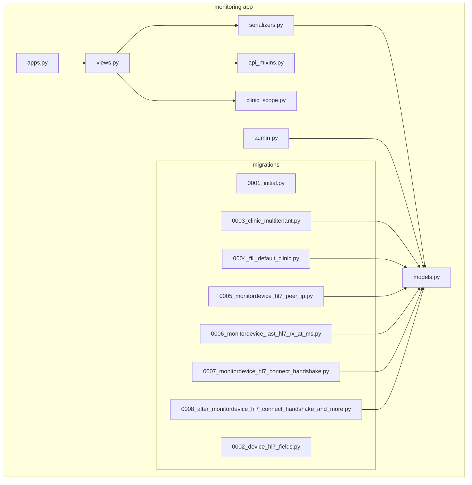
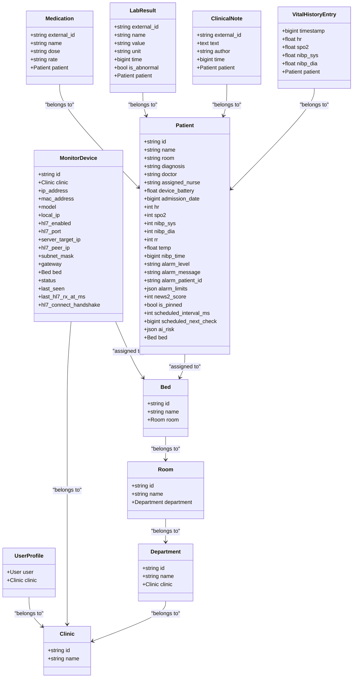
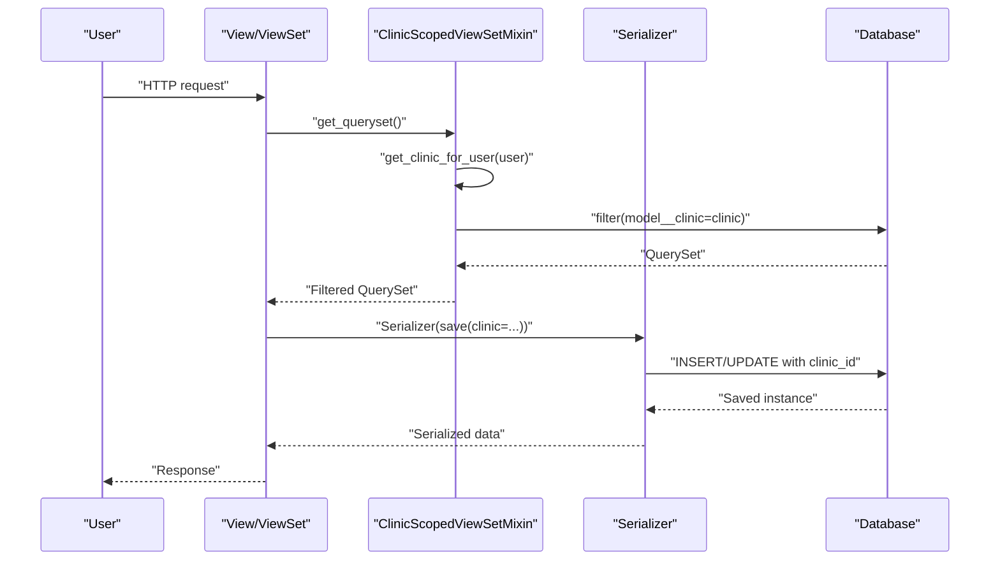
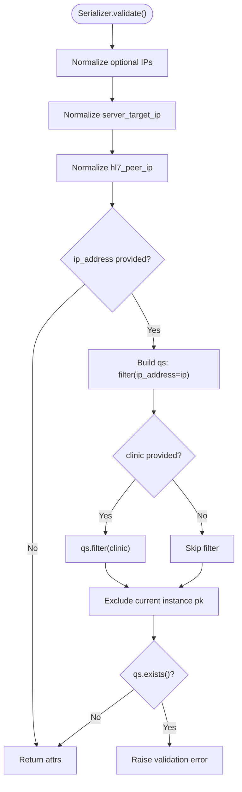
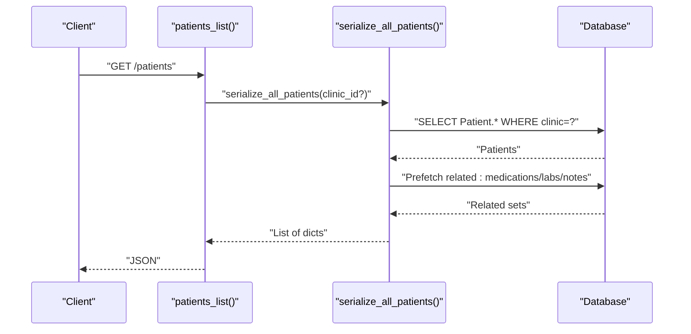
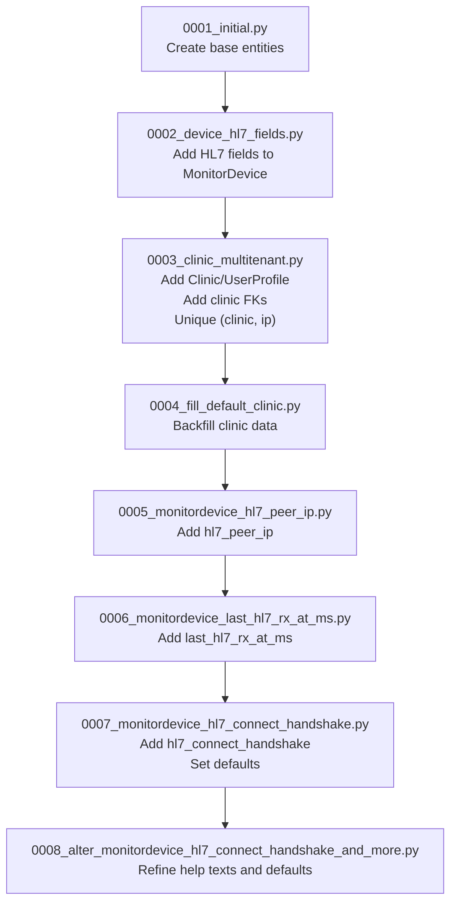
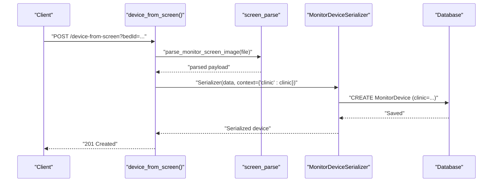
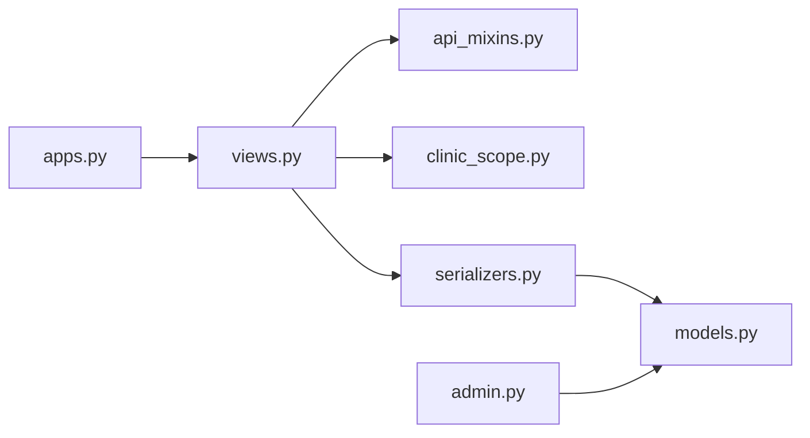

# Data Models & Database Design

<cite>
**Referenced Files in This Document**
- [models.py](file://backend/monitoring/models.py)
- [clinic_scope.py](file://backend/monitoring/clinic_scope.py)
- [api_mixins.py](file://backend/monitoring/api_mixins.py)
- [admin.py](file://backend/monitoring/admin.py)
- [apps.py](file://backend/monitoring/apps.py)
- [views.py](file://backend/monitoring/views.py)
- [serializers.py](file://backend/monitoring/serializers.py)
- [0001_initial.py](file://backend/monitoring/migrations/0001_initial.py)
- [0002_device_hl7_fields.py](file://backend/monitoring/migrations/0002_device_hl7_fields.py)
- [0003_clinic_multitenant.py](file://backend/monitoring/migrations/0003_clinic_multitenant.py)
- [0004_fill_default_clinic.py](file://backend/monitoring/migrations/0004_fill_default_clinic.py)
- [0005_monitordevice_hl7_peer_ip.py](file://backend/monitoring/migrations/0005_monitordevice_hl7_peer_ip.py)
- [0006_monitordevice_last_hl7_rx_at_ms.py](file://backend/monitoring/migrations/0006_monitordevice_last_hl7_rx_at_ms.py)
- [0007_monitordevice_hl7_connect_handshake.py](file://backend/monitoring/migrations/0007_monitordevice_hl7_connect_handshake.py)
- [0008_alter_monitordevice_hl7_connect_handshake_and_more.py](file://backend/monitoring/migrations/0008_alter_monitordevice_hl7_connect_handshake_and_more.py)
</cite>

## Table of Contents
1. [Introduction](#introduction)
2. [Project Structure](#project-structure)
3. [Core Components](#core-components)
4. [Architecture Overview](#architecture-overview)
5. [Detailed Component Analysis](#detailed-component-analysis)
6. [Dependency Analysis](#dependency-analysis)
7. [Performance Considerations](#performance-considerations)
8. [Troubleshooting Guide](#troubleshooting-guide)
9. [Conclusion](#conclusion)
10. [Appendices](#appendices)

## Introduction
This document describes the Django data models and database schema for the monitoring application. It focuses on the core entities and their relationships: Clinic, UserProfile, Department, Room, Bed, MonitorDevice, Patient, and ancillary records (Medication, LabResult, ClinicalNote, VitalHistoryEntry). It explains multi-tenancy via clinic-based isolation, model constraints and validation, migration evolution, and practical usage patterns in views and serializers. It also covers indexing strategies, performance considerations, and troubleshooting tips grounded in the codebase.

## Project Structure
The monitoring app defines models, admin integrations, DRF mixins for tenant scoping, serializers, and a comprehensive migration history that evolves the schema from a single-tenant setup to a multi-tenant clinic-aware design.

**Diagram sources**
- [models.py:1-224](file://backend/monitoring/models.py#L1-L224)
- [clinic_scope.py:1-30](file://backend/monitoring/clinic_scope.py#L1-L30)
- [api_mixins.py:1-67](file://backend/monitoring/api_mixins.py#L1-L67)
- [admin.py:1-73](file://backend/monitoring/admin.py#L1-L73)
- [apps.py:1-46](file://backend/monitoring/apps.py#L1-L46)
- [views.py:1-477](file://backend/monitoring/views.py#L1-L477)
- [serializers.py:1-294](file://backend/monitoring/serializers.py#L1-L294)
- [0001_initial.py:1-153](file://backend/monitoring/migrations/0001_initial.py#L1-L153)
- [0002_device_hl7_fields.py:1-59](file://backend/monitoring/migrations/0002_device_hl7_fields.py#L1-L59)
- [0003_clinic_multitenant.py:1-66](file://backend/monitoring/migrations/0003_clinic_multitenant.py#L1-L66)
- [0004_fill_default_clinic.py:1-67](file://backend/monitoring/migrations/0004_fill_default_clinic.py#L1-L67)
- [0005_monitordevice_hl7_peer_ip.py:1-23](file://backend/monitoring/migrations/0005_monitordevice_hl7_peer_ip.py#L1-L23)
- [0006_monitordevice_last_hl7_rx_at_ms.py:1-20](file://backend/monitoring/migrations/0006_monitordevice_last_hl7_rx_at_ms.py#L1-L20)
- [0007_monitordevice_hl7_connect_handshake.py:1-28](file://backend/monitoring/migrations/0007_monitordevice_hl7_connect_handshake.py#L1-L28)
- [0008_alter_monitordevice_hl7_connect_handshake_and_more.py:1-24](file://backend/monitoring/migrations/0008_alter_monitordevice_hl7_connect_handshake_and_more.py#L1-L24)

**Section sources**
- [models.py:1-224](file://backend/monitoring/models.py#L1-L224)
- [admin.py:1-73](file://backend/monitoring/admin.py#L1-L73)
- [apps.py:1-46](file://backend/monitoring/apps.py#L1-L46)

## Core Components
This section documents the core models, their fields, constraints, and relationships.

- Clinic
  - Purpose: Tenant boundary for all monitoring data.
  - Fields: id (SlugField, primary_key), name (CharField).
  - Ordering: by name.
  - Notes: Used as foreign key on Department, Room, Bed, and MonitorDevice; linked to UserProfile.

- UserProfile
  - Purpose: Associates Django User with a Clinic and exposes a reverse relation for staff users.
  - Fields: user (OneToOne to User, related_name="monitoring_profile"), clinic (ForeignKey to Clinic, related_name="staff_users").
  - Admin: Integrated into User admin inline.

- Department
  - Purpose: Logical division within a clinic.
  - Fields: id (CharField, primary_key), name (CharField), clinic (ForeignKey to Clinic, related_name="departments").
  - Ordering: by name.

- Room
  - Purpose: Physical or logical grouping under a Department.
  - Fields: id (CharField, primary_key), department (ForeignKey to Department, related_name="rooms"), name (CharField).
  - Ordering: by name.

- Bed
  - Purpose: Assignable location for a patient.
  - Fields: id (CharField, primary_key), room (ForeignKey to Room, related_name="beds"), name (CharField).
  - Ordering: by name.

- MonitorDevice
  - Purpose: Represents a physical monitoring device with network and HL7 configuration.
  - Fields:
    - id (CharField, primary_key)
    - clinic (ForeignKey to Clinic, related_name="devices")
    - ip_address (GenericIPAddressField)
    - mac_address (CharField)
    - model (CharField)
    - local_ip (GenericIPAddressField, nullable)
    - hl7_enabled (BooleanField)
    - hl7_port (PositiveIntegerField)
    - server_target_ip (GenericIPAddressField, nullable)
    - hl7_peer_ip (GenericIPAddressField, nullable)
    - subnet_mask (CharField)
    - gateway (CharField)
    - bed (ForeignKey to Bed, optional)
    - status (CharField with choices Online/Offline)
    - last_seen (BigIntegerField)
    - last_hl7_rx_at_ms (BigIntegerField, nullable)
    - hl7_connect_handshake (BooleanField, nullable)
  - Constraints: UniqueConstraint on (clinic, ip_address).
  - Ordering: by model.

- Patient
  - Purpose: Central record for admitted patients with vitals, alarms, scheduling, and associated artifacts.
  - Fields:
    - id (CharField, primary_key)
    - name (CharField)
    - room (CharField)
    - diagnosis (TextField)
    - doctor (CharField)
    - assigned_nurse (CharField)
    - device_battery (FloatField)
    - admission_date (BigIntegerField)
    - hr/spo2/nibp_sys/nibp_dia/rr/temp (numeric fields)
    - nibp_time (BigIntegerField)
    - alarm_level (CharField with choices)
    - alarm_message (TextField)
    - alarm_patient_id (CharField)
    - alarm_limits (JSONField)
    - news2_score (IntegerField)
    - is_pinned (BooleanField)
    - scheduled_interval_ms (IntegerField)
    - scheduled_next_check (BigIntegerField)
    - ai_risk (JSONField)
    - bed (ForeignKey to Bed, optional)
  - Ordering: by id.

- Medication
  - Purpose: Prescribed medications per patient.
  - Fields: patient (ForeignKey to Patient), external_id (CharField), name (CharField), dose (CharField), rate (CharField).
  - Ordering: by name.

- LabResult
  - Purpose: Laboratory test results per patient.
  - Fields: patient (ForeignKey to Patient), external_id (CharField), name (CharField), value (CharField), unit (CharField), time (BigIntegerField), is_abnormal (BooleanField).

- ClinicalNote
  - Purpose: Authoritative notes per patient.
  - Fields: patient (ForeignKey to Patient), external_id (CharField), text (TextField), author (CharField), time (BigIntegerField).

- VitalHistoryEntry
  - Purpose: Historical vitals snapshots for analytics and charts.
  - Fields: patient (ForeignKey to Patient), timestamp (BigIntegerField, db_index=True), hr, spo2, nibp_sys, nibp_dia.
  - Ordering: by timestamp.

**Section sources**
- [models.py:5-224](file://backend/monitoring/models.py#L5-L224)

## Architecture Overview
The system enforces multi-tenancy by associating entities with Clinic. Access control is enforced at the view/serializer level via a mixin and helper functions. Administrative UI integrates UserProfile inline with User.

**Diagram sources**
- [models.py:5-224](file://backend/monitoring/models.py#L5-L224)

## Detailed Component Analysis

### Multi-Tenant Architecture and Access Control
- Tenant boundary: Clinic is the tenant discriminator. All domain entities (Department, Room, Bed, MonitorDevice, Patient) are scoped to a Clinic.
- User-to-tenant mapping: UserProfile links Django User to Clinic.
- View-layer enforcement: ClinicScopedViewSetMixin filters querysets per user’s clinic and injects clinic context into serializers for creation.
- Helper utilities: get_clinic_for_user resolves the clinic for a given user; monitoring_group_name produces WebSocket group names; patients_queryset_for_clinic builds a preloaded patient queryset for a clinic.

**Diagram sources**
- [api_mixins.py:11-67](file://backend/monitoring/api_mixins.py#L11-L67)
- [clinic_scope.py:15-29](file://backend/monitoring/clinic_scope.py#L15-L29)
- [serializers.py:146-284](file://backend/monitoring/serializers.py#L146-L284)
- [models.py:5-224](file://backend/monitoring/models.py#L5-L224)

**Section sources**
- [api_mixins.py:11-67](file://backend/monitoring/api_mixins.py#L11-L67)
- [clinic_scope.py:15-29](file://backend/monitoring/clinic_scope.py#L15-L29)
- [admin.py:29-41](file://backend/monitoring/admin.py#L29-L41)

### Model Validation and Constraints
- MonitorDevice uniqueness: UniqueConstraint on (clinic, ip_address) prevents duplicate IP addresses within a clinic.
- Serializer validation: MonitorDeviceSerializer validates optional IP fields and ensures uniqueness of ip_address within the same clinic during create/update.
- Device ingestion: DeviceVitalsIngestSerializer accepts sparse vitals payloads and is used by a dedicated endpoint to update devices and mark them online.

**Diagram sources**
- [serializers.py:226-249](file://backend/monitoring/serializers.py#L226-L249)

**Section sources**
- [models.py:133-138](file://backend/monitoring/models.py#L133-L138)
- [serializers.py:226-249](file://backend/monitoring/serializers.py#L226-L249)

### Data Access Patterns and Prefetching
- Patient serialization: patient_to_dict prefetches related records (medications, labs, notes) and limits history entries for performance.
- List views: serialize_all_patients optionally scopes by clinic and prefetches related artifacts.
- Admin integration: Admin displays lists with search and filters aligned to clinic boundaries.

**Diagram sources**
- [views.py:418-427](file://backend/monitoring/views.py#L418-L427)
- [serializers.py:90-97](file://backend/monitoring/serializers.py#L90-L97)

**Section sources**
- [serializers.py:13-97](file://backend/monitoring/serializers.py#L13-L97)
- [admin.py:23-73](file://backend/monitoring/admin.py#L23-L73)

### Database Migration Evolution and Schema Changes
The migration history shows a clear progression:
- Initial schema: Departments, Rooms, Beds, MonitorDevices, Patients, and supporting artifacts.
- HL7 fields addition: Adds network and HL7-related fields to MonitorDevice and makes ip_address unique.
- Multi-tenancy: Introduces Clinic and UserProfile, adds clinic foreign keys to Department and MonitorDevice, and adds a unique constraint on (clinic, ip_address).
- Data backfill: Fills default clinic for existing entities and propagates clinic info to devices.
- Additional fields: Adds hl7_peer_ip, last_hl7_rx_at_ms, and adjusts help texts and defaults for existing fields.

**Diagram sources**
- [0001_initial.py:1-153](file://backend/monitoring/migrations/0001_initial.py#L1-L153)
- [0002_device_hl7_fields.py:1-59](file://backend/monitoring/migrations/0002_device_hl7_fields.py#L1-L59)
- [0003_clinic_multitenant.py:1-66](file://backend/monitoring/migrations/0003_clinic_multitenant.py#L1-L66)
- [0004_fill_default_clinic.py:1-67](file://backend/monitoring/migrations/0004_fill_default_clinic.py#L1-L67)
- [0005_monitordevice_hl7_peer_ip.py:1-23](file://backend/monitoring/migrations/0005_monitordevice_hl7_peer_ip.py#L1-L23)
- [0006_monitordevice_last_hl7_rx_at_ms.py:1-20](file://backend/monitoring/migrations/0006_monitordevice_last_hl7_rx_at_ms.py#L1-L20)
- [0007_monitordevice_hl7_connect_handshake.py:1-28](file://backend/monitoring/migrations/0007_monitordevice_hl7_connect_handshake.py#L1-L28)
- [0008_alter_monitordevice_hl7_connect_handshake_and_more.py:1-24](file://backend/monitoring/migrations/0008_alter_monitordevice_hl7_connect_handshake_and_more.py#L1-L24)

**Section sources**
- [0001_initial.py:1-153](file://backend/monitoring/migrations/0001_initial.py#L1-L153)
- [0002_device_hl7_fields.py:1-59](file://backend/monitoring/migrations/0002_device_hl7_fields.py#L1-L59)
- [0003_clinic_multitenant.py:1-66](file://backend/monitoring/migrations/0003_clinic_multitenant.py#L1-L66)
- [0004_fill_default_clinic.py:1-67](file://backend/monitoring/migrations/0004_fill_default_clinic.py#L1-L67)
- [0005_monitordevice_hl7_peer_ip.py:1-23](file://backend/monitoring/migrations/0005_monitordevice_hl7_peer_ip.py#L1-L23)
- [0006_monitordevice_last_hl7_rx_at_ms.py:1-20](file://backend/monitoring/migrations/0006_monitordevice_last_hl7_rx_at_ms.py#L1-L20)
- [0007_monitordevice_hl7_connect_handshake.py:1-28](file://backend/monitoring/migrations/0007_monitordevice_hl7_connect_handshake.py#L1-L28)
- [0008_alter_monitordevice_hl7_connect_handshake_and_more.py:1-24](file://backend/monitoring/migrations/0008_alter_monitordevice_hl7_connect_handshake_and_more.py#L1-L24)

### Model Usage Examples in Views and Serializers
- Device registration from screen image: Validates image size, parses monitor screen, normalizes payload, and creates a MonitorDevice within the clinic derived from the target bed’s department and clinic.
- Device vitals ingestion: Accepts partial vitals payload, locates device by IP (scoped to clinic for non-superusers), applies payload, and marks device online.
- Infrastructure endpoint: Returns department/room/bed/device lists filtered by clinic for authenticated users; superusers see all.

**Diagram sources**
- [views.py:320-364](file://backend/monitoring/views.py#L320-L364)
- [serializers.py:146-284](file://backend/monitoring/serializers.py#L146-L284)

**Section sources**
- [views.py:320-364](file://backend/monitoring/views.py#L320-L364)
- [views.py:429-447](file://backend/monitoring/views.py#L429-L447)
- [views.py:367-413](file://backend/monitoring/views.py#L367-L413)

## Dependency Analysis
- Views depend on serializers, clinic helpers, and the mixin for filtering/query scoping.
- Serializers depend on models and enforce clinic context for creation.
- Admin integrates models and inlines UserProfile with User.
- App startup triggers HL7 listener and simulation threads (non-model code, but affects runtime behavior).

**Diagram sources**
- [views.py:1-477](file://backend/monitoring/views.py#L1-L477)
- [api_mixins.py:1-67](file://backend/monitoring/api_mixins.py#L1-L67)
- [clinic_scope.py:1-30](file://backend/monitoring/clinic_scope.py#L1-L30)
- [serializers.py:1-294](file://backend/monitoring/serializers.py#L1-L294)
- [models.py:1-224](file://backend/monitoring/models.py#L1-L224)
- [admin.py:1-73](file://backend/monitoring/admin.py#L1-L73)
- [apps.py:1-46](file://backend/monitoring/apps.py#L1-L46)

**Section sources**
- [views.py:1-477](file://backend/monitoring/views.py#L1-L477)
- [serializers.py:1-294](file://backend/monitoring/serializers.py#L1-L294)
- [admin.py:1-73](file://backend/monitoring/admin.py#L1-L73)
- [apps.py:1-46](file://backend/monitoring/apps.py#L1-L46)

## Performance Considerations
- Indexing: timestamp on VitalHistoryEntry is indexed (db_index=True), enabling efficient time-series queries.
- Prefetching: Patient serialization prefetches related collections to avoid N+1 queries.
- Filtering: Views and serializers filter by clinic to reduce result sets and improve response times.
- Batch operations: Use bulk operations for historical writes when appropriate (outside the shown code).
- Network fields: GenericIPAddressField supports both IPv4 and IPv6; ensure proper normalization to minimize invalid rows and downstream errors.

[No sources needed since this section provides general guidance]

## Troubleshooting Guide
- HL7 connectivity checks: The device connection-check action aggregates diagnostics from HL7 listener status, port probing, and last message timestamps to surface actionable warnings and hints.
- Device registration errors: MonitorDeviceSerializer raises validation errors for duplicate IP within a clinic and malformed IP fields.
- Access denied: ClinicScopedViewSetMixin raises PermissionDenied when a user lacks an associated clinic profile.

**Section sources**
- [views.py:59-314](file://backend/monitoring/views.py#L59-L314)
- [serializers.py:226-249](file://backend/monitoring/serializers.py#L226-L249)
- [api_mixins.py:14-21](file://backend/monitoring/api_mixins.py#L14-L21)

## Conclusion
The monitoring application employs a clean, clinic-scoped multi-tenancy design centered on the Clinic entity. Strong constraints (unique IP per clinic) and robust serializers ensure data integrity. The view-layer mixin and helpers enforce tenant boundaries consistently. Migrations demonstrate a deliberate evolution toward HL7-ready device management with comprehensive network fields and operational metadata. Serialization and admin configurations streamline administration while preserving tenant isolation.

[No sources needed since this section summarizes without analyzing specific files]

## Appendices

### Field Reference: MonitorDevice
- id: CharField, primary key
- clinic: ForeignKey(Clinic, related_name="devices")
- ip_address: GenericIPAddressField (unique per clinic)
- mac_address: CharField
- model: CharField
- local_ip: GenericIPAddressField (nullable)
- hl7_enabled: BooleanField
- hl7_port: PositiveIntegerField
- server_target_ip: GenericIPAddressField (nullable)
- hl7_peer_ip: GenericIPAddressField (nullable)
- subnet_mask: CharField
- gateway: CharField
- bed: ForeignKey(Bed, on_delete=SET_NULL, null=True, blank=True)
- status: CharField with choices Online/Offline
- last_seen: BigIntegerField
- last_hl7_rx_at_ms: BigIntegerField (nullable)
- hl7_connect_handshake: BooleanField (nullable)

**Section sources**
- [models.py:77-139](file://backend/monitoring/models.py#L77-L139)
- [0002_device_hl7_fields.py:13-57](file://backend/monitoring/migrations/0002_device_hl7_fields.py#L13-L57)
- [0005_monitordevice_hl7_peer_ip.py:13-21](file://backend/monitoring/migrations/0005_monitordevice_hl7_peer_ip.py#L13-L21)
- [0006_monitordevice_last_hl7_rx_at_ms.py:10-18](file://backend/monitoring/migrations/0006_monitordevice_last_hl7_rx_at_ms.py#L10-L18)
- [0007_monitordevice_hl7_connect_handshake.py:17-26](file://backend/monitoring/migrations/0007_monitordevice_hl7_connect_handshake.py#L17-L26)
- [0008_alter_monitordevice_hl7_connect_handshake_and_more.py:13-23](file://backend/monitoring/migrations/0008_alter_monitordevice_hl7_connect_handshake_and_more.py#L13-L23)

### Field Reference: Patient
- id: CharField, primary key
- name: CharField
- room: CharField
- diagnosis: TextField
- doctor: CharField
- assigned_nurse: CharField
- device_battery: FloatField
- admission_date: BigIntegerField
- hr/spo2/nibp_sys/nibp_dia/rr/temp: numeric fields
- nibp_time: BigIntegerField
- alarm_level: CharField with choices
- alarm_message: TextField
- alarm_patient_id: CharField
- alarm_limits: JSONField
- news2_score: IntegerField
- is_pinned: BooleanField
- scheduled_interval_ms: IntegerField
- scheduled_next_check: BigIntegerField
- ai_risk: JSONField
- bed: ForeignKey(Bed, on_delete=SET_NULL, null=True, blank=True)

**Section sources**
- [models.py:141-183](file://backend/monitoring/models.py#L141-L183)

### Field Reference: VitalHistoryEntry
- timestamp: BigIntegerField (db_index=True)
- hr: FloatField
- spo2: FloatField
- nibp_sys: FloatField
- nibp_dia: FloatField
- patient: ForeignKey(Patient, related_name="history_entries")

**Section sources**
- [models.py:214-224](file://backend/monitoring/models.py#L214-L224)