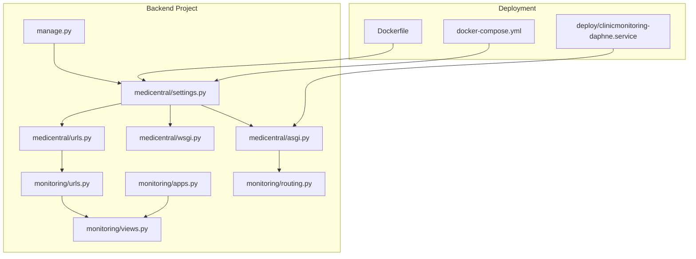
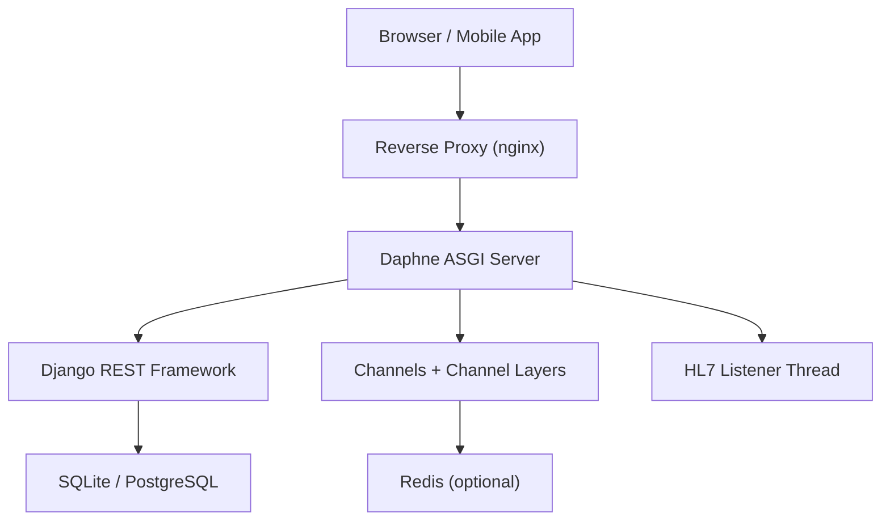
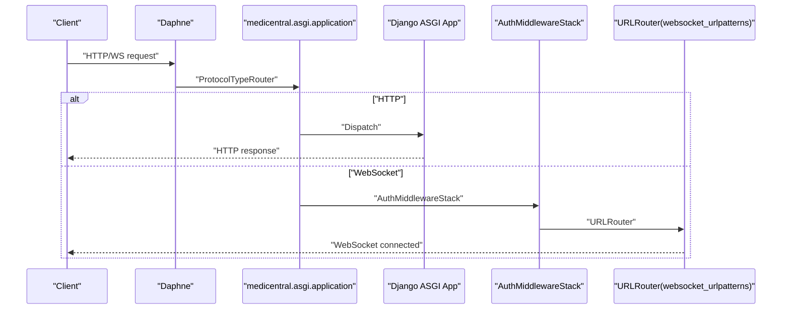
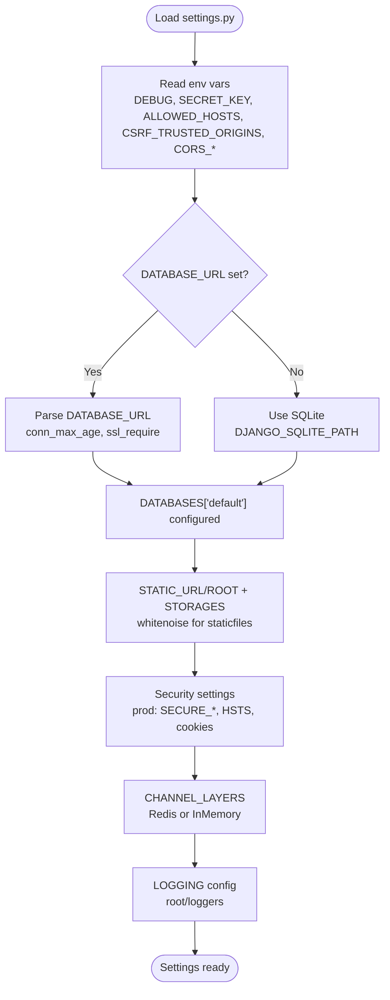
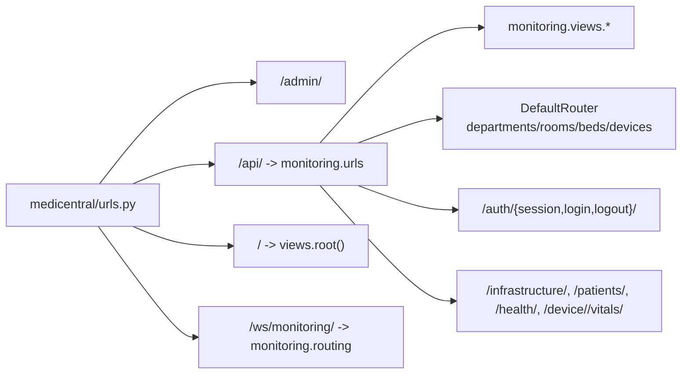
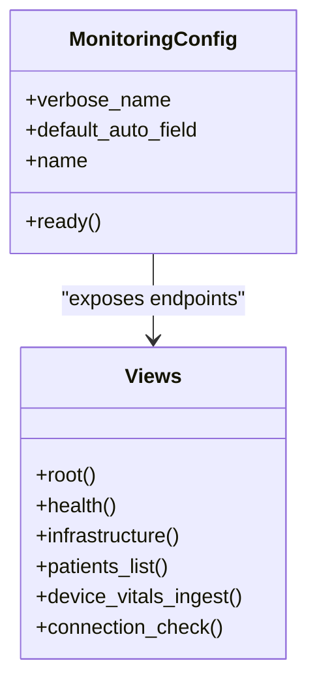
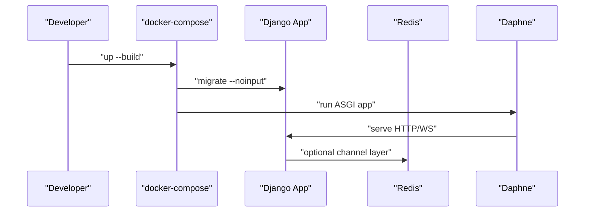
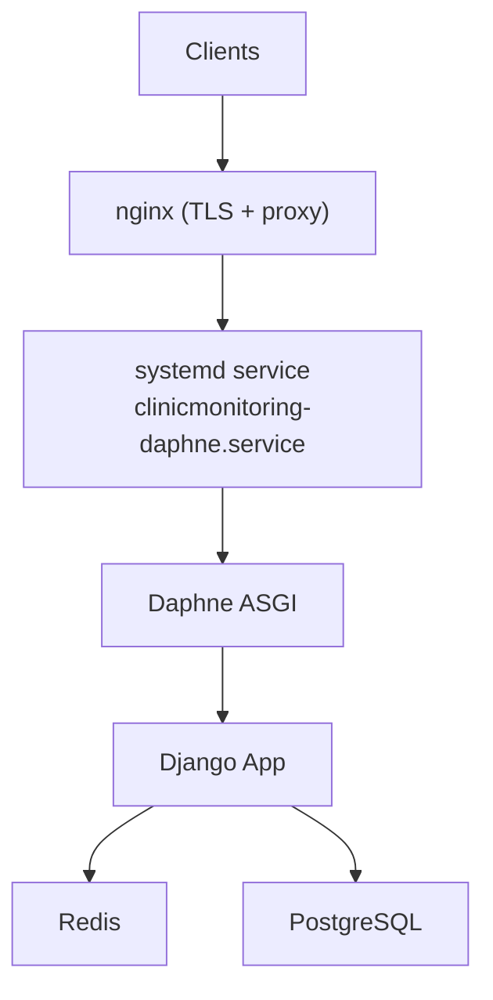
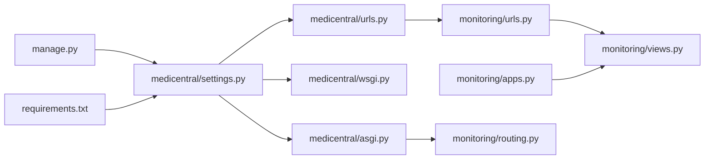

# Django Application Structure

<cite>
**Referenced Files in This Document**
- [settings.py](file://backend/medicentral/settings.py)
- [asgi.py](file://backend/medicentral/asgi.py)
- [wsgi.py](file://backend/medicentral/wsgi.py)
- [urls.py](file://backend/medicentral/urls.py)
- [apps.py](file://backend/monitoring/apps.py)
- [urls.py](file://backend/monitoring/urls.py)
- [routing.py](file://backend/monitoring/routing.py)
- [views.py](file://backend/monitoring/views.py)
- [manage.py](file://backend/manage.py)
- [requirements.txt](file://backend/requirements.txt)
- [Dockerfile](file://backend/Dockerfile)
- [docker-compose.yml](file://backend/docker-compose.yml)
- [clinicmonitoring-daphne.service](file://deploy/clinicmonitoring-daphne.service)
- [README.md](file://README.md)
</cite>

## Table of Contents
1. [Introduction](#introduction)
2. [Project Structure](#project-structure)
3. [Core Components](#core-components)
4. [Architecture Overview](#architecture-overview)
5. [Detailed Component Analysis](#detailed-component-analysis)
6. [Dependency Analysis](#dependency-analysis)
7. [Performance Considerations](#performance-considerations)
8. [Troubleshooting Guide](#troubleshooting-guide)
9. [Conclusion](#conclusion)
10. [Appendices](#appendices)

## Introduction
This document explains the Django application structure and configuration for the ClinicMonitoring project. It covers ASGI and WSGI application setup for production deployment, Django settings configuration (environment variables, database, static files, and security), URL routing, app configuration, and deployment considerations for development and production. It also provides guidance on environment-specific settings management and customization examples.

## Project Structure
The project is organized into:
- backend/medicentral: Django project root with settings, ASGI/WSGI entry points, and top-level URLs.
- backend/monitoring: Django app implementing REST APIs, WebSockets, HL7 listener, and auxiliary modules.
- backend: Django project management script and Docker configuration.
- deploy: systemd service unit and deployment scripts for production.
- frontend: Separate React/Vite UI (outside the scope of this Django-focused document).
- docker-compose.yml: Local/staging orchestration with Redis and SQLite persistence.

**Diagram sources**
- [settings.py:1-218](file://backend/medicentral/settings.py#L1-L218)
- [asgi.py:1-22](file://backend/medicentral/asgi.py#L1-L22)
- [wsgi.py:1-8](file://backend/medicentral/wsgi.py#L1-L8)
- [urls.py:1-11](file://backend/medicentral/urls.py#L1-L11)
- [apps.py:1-46](file://backend/monitoring/apps.py#L1-L46)
- [urls.py:1-24](file://backend/monitoring/urls.py#L1-L24)
- [routing.py:1-8](file://backend/monitoring/routing.py#L1-L8)
- [views.py:1-477](file://backend/monitoring/views.py#L1-L477)
- [manage.py:1-15](file://backend/manage.py#L1-L15)
- [Dockerfile:1-27](file://backend/Dockerfile#L1-L27)
- [docker-compose.yml:1-29](file://backend/docker-compose.yml#L1-L29)
- [clinicmonitoring-daphne.service:1-18](file://deploy/clinicmonitoring-daphne.service#L1-L18)

**Section sources**
- [README.md:1-110](file://README.md#L1-L110)
- [docker-compose.yml:1-29](file://backend/docker-compose.yml#L1-L29)

## Core Components
- Settings module centralizes configuration, environment variable parsing, database selection, static/media storage, REST framework defaults, security hardening, and channel layers.
- ASGI entry point configures protocol routing for HTTP and WebSocket, integrates authentication middleware, and wires monitoring WebSocket routes.
- WSGI entry point provides a standard WSGI application for servers that do not require WebSocket support.
- Top-level URLs route admin, API, and root endpoint.
- Monitoring app config initializes HL7 listener and optional simulation threads on startup, and exposes REST endpoints and WebSocket consumer.
- Monitoring app URLs define routers and API endpoints; routing.py defines WebSocket URL patterns.
- Views implement API endpoints, health checks, HL7 diagnostics, and device ingestion logic.
- Management script sets default settings module and delegates to Django’s command-line interface.
- Requirements enumerate Django stack, REST framework, Channels, Daphne, Redis, whitenoise, and supporting packages.
- Dockerfile builds the image, collects static assets, migrates, and runs Daphne ASGI server.
- docker-compose orchestrates local/staging environment with Redis and SQLite volume.
- systemd service unit runs Daphne in production behind a reverse proxy.

**Section sources**
- [settings.py:1-218](file://backend/medicentral/settings.py#L1-L218)
- [asgi.py:1-22](file://backend/medicentral/asgi.py#L1-L22)
- [wsgi.py:1-8](file://backend/medicentral/wsgi.py#L1-L8)
- [urls.py:1-11](file://backend/medicentral/urls.py#L1-L11)
- [apps.py:1-46](file://backend/monitoring/apps.py#L1-L46)
- [urls.py:1-24](file://backend/monitoring/urls.py#L1-L24)
- [routing.py:1-8](file://backend/monitoring/routing.py#L1-L8)
- [views.py:1-477](file://backend/monitoring/views.py#L1-L477)
- [manage.py:1-15](file://backend/manage.py#L1-L15)
- [requirements.txt:1-14](file://backend/requirements.txt#L1-L14)
- [Dockerfile:1-27](file://backend/Dockerfile#L1-L27)
- [docker-compose.yml:1-29](file://backend/docker-compose.yml#L1-L29)
- [clinicmonitoring-daphne.service:1-18](file://deploy/clinicmonitoring-daphne.service#L1-L18)

## Architecture Overview
The system uses Django REST Framework for HTTP APIs, Django Channels with Daphne for WebSocket messaging, and an HL7 listener integrated via the monitoring app. Static files are served via WhiteNoise in development and production. Reverse proxies (nginx) handle TLS termination and routing to Daphne.

**Diagram sources**
- [asgi.py:1-22](file://backend/medicentral/asgi.py#L1-L22)
- [settings.py:170-184](file://backend/medicentral/settings.py#L170-L184)
- [apps.py:31-45](file://backend/monitoring/apps.py#L31-L45)
- [clinicmonitoring-daphne.service:1-18](file://deploy/clinicmonitoring-daphne.service#L1-L18)

## Detailed Component Analysis

### ASGI and WSGI Applications
- ASGI application:
  - Sets the Django settings module and obtains the ASGI application.
  - Wraps WebSocket routing with origin validation and authentication middleware.
  - Routes HTTP to the ASGI app and WebSocket to monitoring routing patterns.
- WSGI application:
  - Standard WSGI entry point suitable for HTTP-only deployments (e.g., behind a reverse proxy that terminates WebSocket).

**Diagram sources**
- [asgi.py:1-22](file://backend/medicentral/asgi.py#L1-L22)
- [routing.py:1-8](file://backend/monitoring/routing.py#L1-L8)

**Section sources**
- [asgi.py:1-22](file://backend/medicentral/asgi.py#L1-L22)
- [wsgi.py:1-8](file://backend/medicentral/wsgi.py#L1-L8)

### Django Settings Configuration
Key areas configured:
- Environment variables and defaults:
  - Debug mode, secret key, allowed hosts, CSRF trusted origins, CORS behavior.
  - Database selection via DATABASE_URL (with connection pooling and SSL) or SQLite fallback.
  - Static files storage via whitenoise for efficient serving.
  - REST framework defaults (JSON renderer/parser, session authentication).
  - Security hardening for production (XSS filter, content type sniffing, frame options, secure cookies, HSTS).
  - Proxy trust header configuration for reverse proxy deployments.
  - Redis-backed channel layers or in-memory fallback.
  - Logging configuration with console handlers and configurable log level.
- Installed apps and middleware reflect REST, CORS, Channels, Daphne, and whitenoise integrations.

**Diagram sources**
- [settings.py:14-218](file://backend/medicentral/settings.py#L14-L218)

**Section sources**
- [settings.py:1-218](file://backend/medicentral/settings.py#L1-L218)

### URL Routing System
- Root URLs:
  - Admin site.
  - API gateway including monitoring URLs.
  - Root endpoint returns service info and links.
- Monitoring URLs:
  - ViewSet-based endpoints for departments, rooms, beds, devices.
  - Authentication endpoints (session, login, logout).
  - Specialized endpoints for infrastructure, patients, health, device vitals ingestion, and screen-based device creation.
- WebSocket routing:
  - Dedicated WebSocket URL pattern routed to a monitoring consumer.

**Diagram sources**
- [urls.py:1-11](file://backend/medicentral/urls.py#L1-L11)
- [urls.py:1-24](file://backend/monitoring/urls.py#L1-L24)
- [routing.py:1-8](file://backend/monitoring/routing.py#L1-L8)
- [views.py:450-477](file://backend/monitoring/views.py#L450-L477)

**Section sources**
- [urls.py:1-11](file://backend/medicentral/urls.py#L1-L11)
- [urls.py:1-24](file://backend/monitoring/urls.py#L1-L24)
- [routing.py:1-8](file://backend/monitoring/routing.py#L1-L8)
- [views.py:450-477](file://backend/monitoring/views.py#L450-L477)

### Django App Configuration and Module Organization
- Monitoring app:
  - App config registers verbose name and integrates startup logic.
  - Startup logic conditionally starts HL7 listener and optional simulation threads, excluding migration and shell commands.
  - Provides REST views for infrastructure, patients, vitals ingestion, and device connection checks.
- Health endpoint validates database connectivity.

**Diagram sources**
- [apps.py:1-46](file://backend/monitoring/apps.py#L1-L46)
- [views.py:320-477](file://backend/monitoring/views.py#L320-L477)

**Section sources**
- [apps.py:1-46](file://backend/monitoring/apps.py#L1-L46)
- [views.py:320-477](file://backend/monitoring/views.py#L320-L477)

### Deployment Considerations

#### Development
- Local run:
  - Use Daphne for ASGI/WS and HTTP.
  - SQLite by default; Redis optional for multi-instance WebSocket coordination.
- Docker Compose:
  - Builds backend image, mounts SQLite data volume, exposes 8000, and runs Daphne.
  - Provides Redis for multi-client WebSocket support.

**Diagram sources**
- [docker-compose.yml:1-29](file://backend/docker-compose.yml#L1-L29)
- [Dockerfile:1-27](file://backend/Dockerfile#L1-L27)

**Section sources**
- [README.md:20-51](file://README.md#L20-L51)
- [docker-compose.yml:1-29](file://backend/docker-compose.yml#L1-L29)
- [Dockerfile:1-27](file://backend/Dockerfile#L1-L27)

#### Production
- Service unit:
  - Runs Daphne on a dedicated loopback port with environment loaded from .env.
  - Restarts on failure.
- Reverse proxy:
  - Terminate TLS and forward HTTP/WS to Daphne.
  - Configure allowed hosts and trusted proxy headers when behind a proxy.
- Static files:
  - Whitenoise serves staticfiles; ensure collectstatic is executed during build or pre-deploy steps.
- Database:
  - Prefer DATABASE_URL pointing to PostgreSQL for production scalability and reliability.
- Security:
  - Set SECRET_KEY, ALLOWED_HOSTS, CORS_ALLOWED_ORIGINS, CSRF_TRUSTED_ORIGINS.
  - Enable secure cookies and HSTS when appropriate.
- Channel layers:
  - Use Redis-backed channel layers for multi-instance deployments.

**Diagram sources**
- [clinicmonitoring-daphne.service:1-18](file://deploy/clinicmonitoring-daphne.service#L1-L18)
- [settings.py:101-119](file://backend/medicentral/settings.py#L101-L119)
- [settings.py:170-184](file://backend/medicentral/settings.py#L170-L184)

**Section sources**
- [README.md:53-109](file://README.md#L53-L109)
- [clinicmonitoring-daphne.service:1-18](file://deploy/clinicmonitoring-daphne.service#L1-L18)
- [settings.py:101-184](file://backend/medicentral/settings.py#L101-L184)

### Configuration Customization and Environment-Specific Settings
- Environment variables:
  - DJANGO_DEBUG, DJANGO_SECRET_KEY, DJANGO_ALLOWED_HOSTS, DJANGO_CSRF_TRUSTED_ORIGINS, CORS_ALLOWED_ORIGINS.
  - DATABASE_URL, DB_CONN_MAX_AGE, DATABASE_SSL_REQUIRE, DJANGO_SQLITE_PATH.
  - DJANGO_SESSION_COOKIE_SECURE, DJANGO_CSRF_COOKIE_SECURE, DJANGO_SECURE_SSL_REDIRECT, DJANGO_SECURE_HSTS_SECONDS.
  - DJANGO_BEHIND_PROXY, SECURE_PROXY_SSL_HEADER.
  - REDIS_URL for channel layers.
  - MONITORING_SIMULATION_ENABLED to enable simulation thread.
  - HL7-related environment variables for listener configuration (refer to monitoring app initialization).
- Environment-specific overrides:
  - Use separate .env files per environment (development, staging, production).
  - In Docker, pass build args and runtime environment variables.
  - In systemd, use EnvironmentFile to load production .env.

**Section sources**
- [settings.py:14-218](file://backend/medicentral/settings.py#L14-L218)
- [apps.py:35-38](file://backend/monitoring/apps.py#L35-L38)
- [Dockerfile:6-22](file://backend/Dockerfile#L6-L22)
- [docker-compose.yml:16-24](file://backend/docker-compose.yml#L16-L24)
- [clinicmonitoring-daphne.service:10-12](file://deploy/clinicmonitoring-daphne.service#L10-L12)

## Dependency Analysis
- Internal dependencies:
  - Settings module is imported by ASGI/WSGI entry points and used by management commands.
  - Monitoring app depends on settings for channel layers and logging; it initializes HL7 and simulation threads.
  - Monitoring URLs depend on monitoring views; WebSocket routing depends on monitoring consumers.
- External dependencies:
  - Django, djangorestframework, django-cors-headers, channels/daphne, whitenoise, psycopg2-binary, dj-database-url, google-generativeai, Pillow, python-dotenv.

**Diagram sources**
- [settings.py:1-218](file://backend/medicentral/settings.py#L1-L218)
- [asgi.py:1-22](file://backend/medicentral/asgi.py#L1-L22)
- [wsgi.py:1-8](file://backend/medicentral/wsgi.py#L1-L8)
- [urls.py:1-11](file://backend/medicentral/urls.py#L1-L11)
- [apps.py:1-46](file://backend/monitoring/apps.py#L1-L46)
- [urls.py:1-24](file://backend/monitoring/urls.py#L1-L24)
- [routing.py:1-8](file://backend/monitoring/routing.py#L1-L8)
- [views.py:1-477](file://backend/monitoring/views.py#L1-L477)
- [manage.py:1-15](file://backend/manage.py#L1-L15)
- [requirements.txt:1-14](file://backend/requirements.txt#L1-L14)

**Section sources**
- [requirements.txt:1-14](file://backend/requirements.txt#L1-L14)
- [settings.py:53-66](file://backend/medicentral/settings.py#L53-L66)

## Performance Considerations
- Database:
  - Use DATABASE_URL with connection pooling and SSL for production databases.
  - Consider PostgreSQL for concurrent connections and advanced features.
- Static files:
  - Whitenoise compressed storage improves delivery performance.
- Channel layers:
  - Redis-backed channel layers scale across multiple instances.
- Logging:
  - Adjust DJANGO_LOG_LEVEL to balance observability and overhead.
- Reverse proxy:
  - Offload compression and caching where appropriate; configure keep-alive and timeouts.

[No sources needed since this section provides general guidance]

## Troubleshooting Guide
- Health endpoint:
  - GET /api/health/ verifies database connectivity; returns healthy status or error details.
- HL7 diagnostics:
  - Device connection checks provide warnings and hints for listener status, firewall, and assignment issues.
- Simulation and listener startup:
  - Simulation enabled via environment variable; startup is skipped during migrations and shell commands.
- Reverse proxy and cookies:
  - When behind a proxy, set DJANGO_BEHIND_PROXY and SECURE_PROXY_SSL_HEADER; ensure secure cookies for HTTPS.
- Static files:
  - Collect static assets during build or pre-deploy steps; verify whitenoise configuration.

**Section sources**
- [views.py:466-477](file://backend/monitoring/views.py#L466-L477)
- [views.py:59-315](file://backend/monitoring/views.py#L59-L315)
- [apps.py:35-45](file://backend/monitoring/apps.py#L35-L45)
- [settings.py:167-168](file://backend/medicentral/settings.py#L167-L168)
- [settings.py:137-144](file://backend/medicentral/settings.py#L137-L144)

## Conclusion
The ClinicMonitoring backend leverages Django REST Framework and Channels with Daphne to serve HTTP APIs and WebSocket streams, while integrating an HL7 listener for medical device telemetry. Settings are environment-driven, enabling flexible development and production configurations. The deployment stack supports Docker Compose for local/staging and systemd for production, with reverse proxies terminating TLS and routing traffic to Daphne. Proper environment variable management, channel layer scaling, and security hardening are essential for reliable operation.

[No sources needed since this section summarizes without analyzing specific files]

## Appendices

### Environment Variables Reference
- Django core:
  - DJANGO_DEBUG, DJANGO_SECRET_KEY, DJANGO_ALLOWED_HOSTS, DJANGO_CSRF_TRUSTED_ORIGINS, CORS_ALLOWED_ORIGINS, CORS_ALLOW_ALL_ORIGINS
- Database:
  - DATABASE_URL, DB_CONN_MAX_AGE, DATABASE_SSL_REQUIRE, DJANGO_SQLITE_PATH
- Security:
  - DJANGO_SESSION_COOKIE_SECURE, DJANGO_CSRF_COOKIE_SECURE, DJANGO_SECURE_SSL_REDIRECT, DJANGO_SECURE_HSTS_SECONDS, DJANGO_BEHIND_PROXY, SECURE_PROXY_SSL_HEADER
- Static files:
  - STATIC_URL, STATIC_ROOT, STORAGES
- Channels:
  - REDIS_URL, CHANNEL_LAYERS
- Monitoring:
  - MONITORING_SIMULATION_ENABLED, HL7_LISTEN_HOST, HL7_LISTEN_PORT, DEVICE_DATA_TIMEOUT_SECONDS
- Logging:
  - DJANGO_LOG_LEVEL

**Section sources**
- [settings.py:14-218](file://backend/medicentral/settings.py#L14-L218)
- [apps.py:35-38](file://backend/monitoring/apps.py#L35-L38)