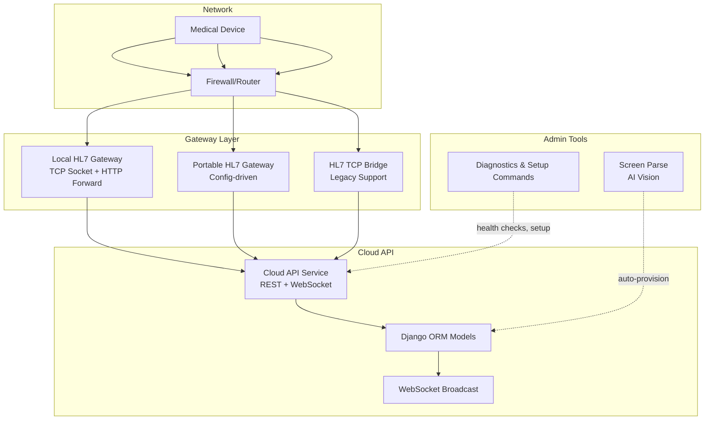
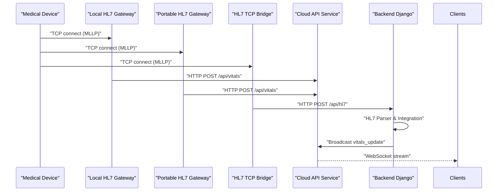
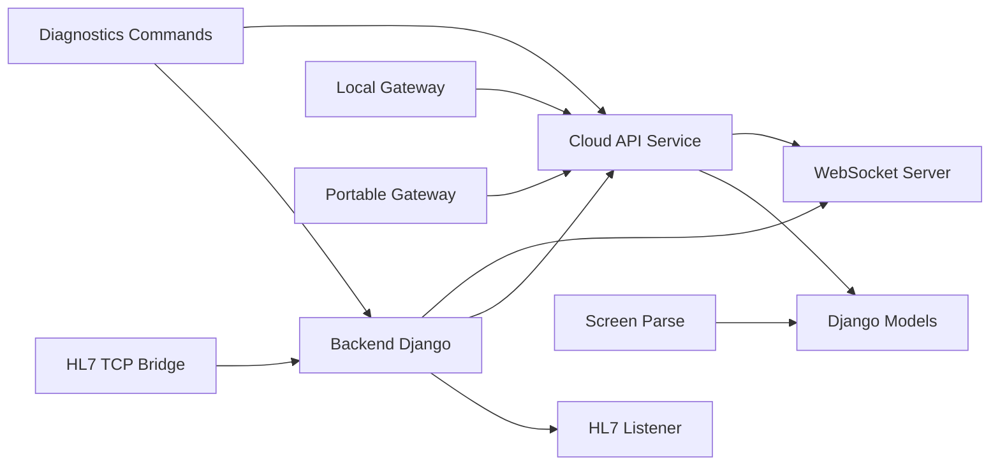
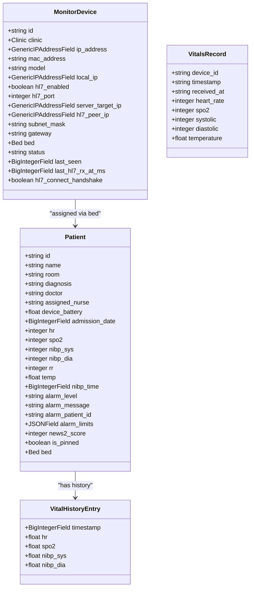

# HL7 Medical Device Integration

<cite>
**Referenced Files in This Document**
- [settings.py](file://backend/medicentral/settings.py)
- [hl7_listener.py](file://backend/monitoring/hl7_listener.py)
- [hl7_parser.py](file://backend/monitoring/hl7_parser.py)
- [device_integration.py](file://backend/monitoring/device_integration.py)
- [models.py](file://backend/monitoring/models.py)
- [screen_parse.py](file://backend/monitoring/screen_parse.py)
- [broadcast.py](file://backend/monitoring/broadcast.py)
- [simulation.py](file://backend/monitoring/simulation.py)
- [views.py](file://backend/monitoring/views.py)
- [consumers.py](file://backend/monitoring/consumers.py)
- [diagnose_hl7.py](file://backend/monitoring/management/commands/diagnose_hl7.py)
- [setup_real_hl7_monitor.py](file://backend/monitoring/management/commands/setup_real_hl7_monitor.py)
- [reset_monitoring_fresh.py](file://backend/monitoring/management/commands/reset_monitoring_fresh.py)
- [server.js](file://gateway/server.js)
- [package.json](file://gateway/package.json)
- [server.js](file://portable-hl7-gateway/server.js)
- [config.env.example](file://portable-hl7-gateway/config.env.example)
- [package.json](file://portable-hl7-gateway/package.json)
- [server.js](file://tools/hl7-tcp-server/server.js)
- [app.js](file://server/app.js)
- [README.md](file://server/README.md)
- [routing.py](file://backend/monitoring/routing.py)
- [ws_actions.py](file://backend/monitoring/ws_actions.py)
- [clinicmonitoring-vitals-api.service](file://deploy/clinicmonitoring-vitals-api.service)
- [clinicmonitoring-hl7-gateway.service](file://deploy/clinicmonitoring-hl7-gateway.service)
- [clinicmonitoring-hl7-node.service](file://deploy/clinicmonitoring-hl7-node.service)
- [clinicmonitoring-daphne.service](file://deploy/clinicmonitoring-daphne.service)
</cite>

## Update Summary
**Changes Made**
- Added comprehensive documentation for the new Node.js HL7 gateway system
- Documented the local HL7 gateway (gateway/server.js) with TCP-based MLLP interface
- Added documentation for the portable HL7 gateway (portable-hl7-gateway/server.js) with config.env support
- Documented the cloud API service with WebSocket streaming (server/app.js)
- Added supporting infrastructure documentation including systemd services
- Updated architecture diagrams to reflect the dual gateway approach
- Enhanced troubleshooting guide with Node.js gateway specific issues

## Table of Contents
1. [Introduction](#introduction)
2. [Project Structure](#project-structure)
3. [Core Components](#core-components)
4. [Architecture Overview](#architecture-overview)
5. [Detailed Component Analysis](#detailed-component-analysis)
6. [Node.js Gateway Systems](#nodejs-gateway-systems)
7. [Cloud API Service](#cloud-api-service)
8. [Dependency Analysis](#dependency-analysis)
9. [Performance Considerations](#performance-considerations)
10. [Troubleshooting Guide](#troubleshooting-guide)
11. [Conclusion](#conclusion)
12. [Appendices](#appendices)

## Introduction
This document explains the HL7/MLLP medical device integration system used by the backend, now enhanced with comprehensive Node.js gateway support alongside the existing backend HL7 integration. It covers the TCP socket server that receives HL7 messages, MLLP framing and message parsing, validation and error handling, device integration patterns, screen parsing for extracting device configuration from monitor displays, and configuration options for connectivity, NAT traversal, and connection management. The system now supports multiple gateway implementations including local gateways, portable gateways, and cloud API services with WebSocket streaming.

## Project Structure
The HL7 integration now spans multiple gateway implementations and services:
- Backend Django HL7 listener and session handling for MLLP frames
- Node.js Local HL7 Gateway with TCP socket server and HTTP forwarding
- Portable HL7 Gateway with configuration file support for clinic-specific deployments
- Cloud API Service with REST endpoints and WebSocket streaming
- HL7 TCP Bridge for legacy backend integration
- HL7 message parsing and validation across all gateways
- Device resolution and vitals application to patient records
- WebSocket broadcasting for live dashboards
- Management commands for diagnostics and setup
- Optional screen parsing via AI to auto-provision devices from monitor screenshots



**Diagram sources**
- [server.js:1-326](file://gateway/server.js#L1-L326)
- [server.js:1-345](file://portable-hl7-gateway/server.js#L1-L345)
- [server.js:1-320](file://tools/hl7-tcp-server/server.js#L1-L320)
- [app.js:1-130](file://server/app.js#L1-L130)
- [hl7_listener.py:1-755](file://backend/monitoring/hl7_listener.py#L1-L755)

**Section sources**
- [server.js:1-326](file://gateway/server.js#L1-L326)
- [server.js:1-345](file://portable-hl7-gateway/server.js#L1-L345)
- [server.js:1-320](file://tools/hl7-tcp-server/server.js#L1-L320)
- [app.js:1-130](file://server/app.js#L1-L130)
- [hl7_listener.py:1-755](file://backend/monitoring/hl7_listener.py#L1-L755)

## Core Components
- **Backend HL7 MLLP TCP Listener**: Accepts TCP connections, handles MLLP framing, optional handshake, and queries for specific monitors, decodes payloads, and dispatches to parser and integrator.
- **Local HL7 Gateway**: Node.js TCP socket server that accepts HL7/MLLP traffic, parses vitals, and forwards to cloud API via HTTP POST with retry logic.
- **Portable HL7 Gateway**: Node.js gateway designed for clinic-specific deployments with config.env file support for easy customization.
- **Cloud API Service**: Express server providing REST endpoints for vitals ingestion and WebSocket streaming for real-time dashboards.
- **HL7 TCP Bridge**: Legacy Node.js bridge that forwards HL7 messages to backend Django API with token authentication.
- **HL7 Parser**: Decodes HL7 text across multiple encodings, extracts vitals from OBX and extended segments, and applies heuristics for vendor-specific variations.
- **Device Integration**: Resolves devices by peer IP (including NAT fallback), validates device-patient linkage, applies vitals to patient records, and broadcasts updates.
- **WebSocket Broadcasting**: Sends vitals updates to clients scoped by clinic.
- **Screen Parsing**: Uses AI vision to extract HL7 server configuration from monitor screenshots and normalize to device creation payload.
- **Management Commands**: Provide diagnostics, setup, and reset flows for quick onboarding and troubleshooting.

**Section sources**
- [server.js:1-326](file://gateway/server.js#L1-L326)
- [server.js:1-345](file://portable-hl7-gateway/server.js#L1-L345)
- [app.js:1-130](file://server/app.js#L1-L130)
- [server.js:1-320](file://tools/hl7-tcp-server/server.js#L1-L320)
- [hl7_listener.py:426-578](file://backend/monitoring/hl7_listener.py#L426-L578)
- [hl7_parser.py:423-530](file://backend/monitoring/hl7_parser.py#L423-L530)
- [device_integration.py:31-232](file://backend/monitoring/device_integration.py#L31-L232)
- [broadcast.py:10-20](file://backend/monitoring/broadcast.py#L10-L20)
- [screen_parse.py:58-160](file://backend/monitoring/screen_parse.py#L58-L160)
- [diagnose_hl7.py:22-182](file://backend/monitoring/management/commands/diagnose_hl7.py#L22-L182)
- [setup_real_hl7_monitor.py:77-224](file://backend/monitoring/management/commands/setup_real_hl7_monitor.py#L77-L224)

## Architecture Overview
The system now supports multiple integration pathways with the primary flow being HL7/MLLP traffic through either the backend Django listener or Node.js gateways, all converging on the cloud API service for processing and broadcasting.



**Diagram sources**
- [server.js:246-325](file://gateway/server.js#L246-L325)
- [server.js:265-344](file://portable-hl7-gateway/server.js#L265-L344)
- [server.js:258-320](file://tools/hl7-tcp-server/server.js#L258-L320)
- [app.js:56-79](file://server/app.js#L56-L79)
- [hl7_listener.py:426-578](file://backend/monitoring/hl7_listener.py#L426-L578)

## Detailed Component Analysis

### TCP Socket Server and MLLP Framing
- **Backend Listener**: Accepts TCP connections and spawns per-session threads with MLLP framing detection, optional pre-handshake receive window, and multi-encoding support.
- **Local Gateway**: Implements identical MLLP framing with peer device ID normalization and comprehensive logging.
- **Portable Gateway**: Similar implementation with config.env file loading for environment variables.
- **HL7 TCP Bridge**: Legacy implementation with bridge token authentication.

Key behaviors:
- MLLP framing: detects start/end markers (0x0B, 0x1C, 0x0D) and peels payloads.
- UTF handling: supports UTF-8, UTF-16 LE/BE, CP1251, Latin-1, GBK.
- Timeouts: configurable receive timeout per connection.
- Diagnostics: tracks last payload, peer, byte counts, and bind errors.
- Retry logic: exponential backoff for HTTP forwarding failures.

**Section sources**
- [hl7_listener.py:125-147](file://backend/monitoring/hl7_listener.py#L125-L147)
- [hl7_listener.py:155-161](file://backend/monitoring/hl7_listener.py#L155-L161)
- [hl7_listener.py:187-234](file://backend/monitoring/hl7_listener.py#L187-L234)
- [server.js:151-164](file://gateway/server.js#L151-L164)
- [server.js:175-209](file://gateway/server.js#L175-L209)
- [server.js:211-244](file://gateway/server.js#L211-L244)
- [server.js:288-301](file://gateway/server.js#L288-L301)

### HL7 Message Parsing and Validation
- **Backend Parser**: Extracts vitals from OBX segments and extended segments using vendor-agnostic heuristics with comprehensive validation.
- **Gateway Parsers**: Implement similar OBX-focused parsing with classification of vitals types (HR, SpO2, Temperature, RR, NIBP).
- **Value Extraction**: Handles numeric values, NIBP format parsing, and fallback strategies for different HL7 formats.
- **Validation**: Comprehensive input validation with error handling and logging.

Validation highlights:
- Rejects non-HL7 TCP sessions gracefully.
- Logs diagnostic previews when HL7 cannot be extracted.
- Returns empty vitals when none found, allowing device online status updates.
- Type-safe numeric parsing with range validation.

**Section sources**
- [hl7_parser.py:19-66](file://backend/monitoring/hl7_parser.py#L19-L66)
- [hl7_parser.py:113-146](file://backend/monitoring/hl7_parser.py#L113-L146)
- [hl7_parser.py:148-196](file://backend/monitoring/hl7_parser.py#L148-L196)
- [server.js:48-62](file://gateway/server.js#L48-L62)
- [server.js:64-81](file://gateway/server.js#L64-L81)
- [server.js:86-146](file://gateway/server.js#L86-L146)

### Device Integration Patterns
- **Backend Integration**: Resolves MonitorDevice by peer IP with NAT fallback support and loopback filtering.
- **Cloud API Processing**: Validates vitals records and prepares them for WebSocket broadcasting.
- **Broadcast System**: Sends vitals updates to clients scoped by clinic with proper serialization.

Integration flow:
- Device lookup by IP (including NAT peer override).
- Patient lookup via bed assignment.
- Atomic update of vitals and history cleanup.
- Event broadcasting to the device's clinic group.
- WebSocket broadcasting for real-time dashboards.

**Section sources**
- [device_integration.py:31-78](file://backend/monitoring/device_integration.py#L31-L78)
- [device_integration.py:129-232](file://backend/monitoring/device_integration.py#L129-L232)
- [models.py:77-140](file://backend/monitoring/models.py#L77-L140)
- [app.js:46-52](file://server/app.js#L46-L52)
- [broadcast.py:10-20](file://backend/monitoring/broadcast.py#L10-L20)

### Screen Parsing for Device Discovery
- Uses AI vision to extract HL7 server configuration from monitor screenshots.
- Returns normalized JSON payload suitable for device creation.
- Requires environment configuration for API key and model name.
- Integrates with admin endpoints to create devices from screen captures.

**Section sources**
- [screen_parse.py:16-32](file://backend/monitoring/screen_parse.py#L16-L32)
- [screen_parse.py:58-160](file://backend/monitoring/screen_parse.py#L58-L160)
- [views.py:320-364](file://backend/monitoring/views.py#L320-L364)

## Node.js Gateway Systems

### Local HL7 Gateway
The local gateway provides a standalone Node.js solution for HL7/MLLP processing with HTTP forwarding capabilities.

**Key Features:**
- TCP server listening on configurable host/port (default 6006)
- MLLP framing detection and extraction
- HL7 message parsing with OBX-focused vitals extraction
- HTTP POST forwarding to cloud API with retry logic
- Configurable logging and debugging
- Peer device ID normalization for consistent device identification

**Configuration Options:**
- `GATEWAY_HOST`: Bind host (default: 0.0.0.0)
- `GATEWAY_PORT`: TCP port (default: 6006)
- `VITALS_URL`: Cloud API endpoint URL
- `DEBUG`: Enable/disable verbose logging
- `NO_DATA_MS`: Timeout threshold for connection monitoring

**Section sources**
- [server.js:1-326](file://gateway/server.js#L1-L326)
- [package.json:1-12](file://gateway/package.json#L1-L12)

### Portable HL7 Gateway
Designed for clinic-specific deployments with configuration file support.

**Key Features:**
- Config file support via `config.env` file loading
- Pre-configured for clinic-specific deployments
- Same functionality as local gateway with persistent configuration
- Ideal for desktop environments and small clinics

**Configuration Options:**
- `VITALS_URL`: Cloud API endpoint (HTTPS recommended)
- `GATEWAY_PORT`: TCP port (default: 6006)
- `GATEWAY_HOST`: Bind host (default: 0.0.0.0)
- `DEBUG`: Logging level
- `NO_DATA_MS`: Connection timeout

**Section sources**
- [server.js:1-345](file://portable-hl7-gateway/server.js#L1-L345)
- [config.env.example:1-20](file://portable-hl7-gateway/config.env.example#L1-L20)
- [package.json:1-9](file://portable-hl7-gateway/package.json#L1-L9)

### HL7 TCP Bridge
Legacy bridge for compatibility with existing backend systems.

**Key Features:**
- Bridges HL7/MLLP traffic to backend Django API
- Token-based authentication for security
- Configurable device IP mapping
- Retry logic for API communication

**Configuration Options:**
- `HL7_TCP_PORT`: TCP port (default: 6007)
- `HL7_HTTP_URL`: Backend API endpoint
- `HL7_DEVICE_IP`: Device IP mapping
- `HL7_BRIDGE_TOKEN`: Authentication token
- `HL7_NO_DATA_MS`: Connection timeout
- `HL7_HTTP_RETRY_MAX`: Maximum retry attempts

**Section sources**
- [server.js:1-320](file://tools/hl7-tcp-server/server.js#L1-L320)

## Cloud API Service

### Overview
The cloud API service provides a complete REST and WebSocket solution for vitals processing and real-time dashboard streaming.

**Core Services:**
- REST API for vitals ingestion and retrieval
- WebSocket streaming for real-time dashboard updates
- In-memory storage with configurable limits
- Static dashboard serving

### REST Endpoints
- `POST /api/vitals`: Ingest vitals data with validation
- `GET /api/vitals`: Retrieve latest vitals records
- `GET /api/vitals/:device_id`: Retrieve vitals for specific device
- `GET /`: Serve dashboard static files

### WebSocket Streaming
- `/hl7-vitals-ws`: Real-time vitals stream
- Automatic broadcasting to connected clients
- Client connection management and error handling

### Configuration
- `PORT`: Service port (default: 3000)
- CORS enabled for cross-origin requests
- JSON payload validation with type checking

**Section sources**
- [app.js:1-130](file://server/app.js#L1-L130)
- [README.md:1-26](file://server/README.md#L1-L26)

## Dependency Analysis
The system now includes multiple gateway implementations with the following dependencies:



**Diagram sources**
- [hl7_listener.py:1-755](file://backend/monitoring/hl7_listener.py#L1-L755)
- [server.js:1-326](file://gateway/server.js#L1-L326)
- [server.js:1-345](file://portable-hl7-gateway/server.js#L1-L345)
- [server.js:1-320](file://tools/hl7-tcp-server/server.js#L1-L320)
- [app.js:1-130](file://server/app.js#L1-L130)

**Section sources**
- [hl7_listener.py:1-755](file://backend/monitoring/hl7_listener.py#L1-L755)
- [server.js:1-326](file://gateway/server.js#L1-L326)
- [server.js:1-345](file://portable-hl7-gateway/server.js#L1-L345)
- [server.js:1-320](file://tools/hl7-tcp-server/server.js#L1-L320)
- [app.js:1-130](file://server/app.js#L1-L130)

## Performance Considerations
- **Gateway Selection**: Choose appropriate gateway based on deployment needs - local for high-throughput scenarios, portable for clinic-specific setups, bridge for legacy compatibility.
- **Connection Management**: All gateways implement connection pooling and proper resource cleanup.
- **Memory Usage**: Cloud API uses in-memory storage with configurable limits to prevent unbounded growth.
- **Retry Logic**: Gateways implement exponential backoff for HTTP communication failures.
- **Broadcasting**: WebSocket connections are managed efficiently with proper connection lifecycle handling.
- **Encoding Detection**: Parser tries multiple encodings; avoid unnecessary scans by ensuring consistent encoding from devices.

## Troubleshooting Guide
### Common Issues and Resolutions

#### Gateway-Specific Issues
- **Local Gateway Connection Problems**:
  - Verify `VITALS_URL` points to active cloud API service
  - Check firewall allows inbound TCP connections on configured port
  - Enable `DEBUG` mode for detailed logging
  - Monitor `NO_DATA_MS` timeout for connection issues

- **Portable Gateway Configuration**:
  - Ensure `config.env` exists and is properly formatted
  - Verify `VITALS_URL` uses HTTPS for production environments
  - Check `GATEWAY_PORT` availability and firewall rules

- **HL7 TCP Bridge Issues**:
  - Confirm `HL7_BRIDGE_TOKEN` matches backend configuration
  - Verify `HL7_DEVICE_IP` matches actual monitor IP
  - Check backend API accessibility at `HL7_HTTP_URL`

#### General HL7 Integration Issues
- **No HL7 packets despite TCP connections**:
  - Confirm monitor server IP/port and protocol (HL7/MLLP)
  - Enable ORU/numerics/Central Station sending on the monitor
  - Verify sensors are attached (ECG, SpO2, NIBP)

- **Zero-byte sessions after connect**:
  - Try disabling handshake (RST behavior) or adjust pre-handshake receive window
  - Check firewall and cloud security groups for inbound TCP 6006

- **NAT mismatch**:
  - Set hl7_peer_ip to the IP observed by the server or enable single-device NAT fallback

- **Firewall and port accessibility**:
  - Ensure local firewall allows inbound TCP 6006 and reload configurations
  - For cloud providers, open inbound TCP 6006 in security groups/firewalls

#### Cloud API Service Issues
- **WebSocket Connection Failures**:
  - Verify WebSocket path `/hl7-vitals-ws` is accessible
  - Check Nginx proxy configuration for WebSocket support
  - Ensure proper CORS headers are configured

- **REST API Errors**:
  - Validate JSON payload structure matches API requirements
  - Check authentication headers for protected endpoints
  - Monitor service logs for detailed error information

**Section sources**
- [server.js:258-320](file://gateway/server.js#L258-L320)
- [server.js:265-344](file://portable-hl7-gateway/server.js#L265-L344)
- [server.js:258-320](file://tools/hl7-tcp-server/server.js#L258-L320)
- [app.js:108-122](file://server/app.js#L108-L122)
- [views.js:59-314](file://backend/monitoring/views.py#L59-L314)
- [diagnose_hl7.py:22-182](file://backend/monitoring/management/commands/diagnose_hl7.py#L22-L182)

## Conclusion
The HL7/MLLP integration system now provides comprehensive multi-gateway support with robust handling of diverse medical device vendors, resilient connection management, and comprehensive diagnostics. The addition of Node.js gateway implementations alongside the existing backend HL7 integration offers flexibility for various deployment scenarios, from high-throughput local installations to clinic-specific portable solutions, all converging on a unified cloud API service with real-time WebSocket streaming capabilities.

## Appendices

### Configuration Reference
#### Local HL7 Gateway
- `GATEWAY_HOST`: string (default: 0.0.0.0)
- `GATEWAY_PORT`: integer (default: 6006)
- `VITALS_URL`: string (required)
- `DEBUG`: boolean (default: true)
- `NO_DATA_MS`: integer (default: 10000)

#### Portable HL7 Gateway
- `VITALS_URL`: string (required)
- `GATEWAY_PORT`: integer (default: 6006)
- `GATEWAY_HOST`: string (default: 0.0.0.0)
- `DEBUG`: boolean (default: true)
- `NO_DATA_MS`: integer (default: 10000)

#### HL7 TCP Bridge
- `HL7_TCP_PORT`: integer (default: 6007)
- `HL7_HTTP_URL`: string (required)
- `HL7_DEVICE_IP`: string (required)
- `HL7_BRIDGE_TOKEN`: string (required)
- `HL7_NO_DATA_MS`: integer (default: 10000)
- `HL7_HTTP_RETRY_MAX`: integer (default: 8)

#### Cloud API Service
- `PORT`: integer (default: 3000)

**Section sources**
- [server.js:22-26](file://gateway/server.js#L22-L26)
- [server.js:40-45](file://portable-hl7-gateway/server.js#L40-L45)
- [server.js:22-27](file://tools/hl7-tcp-server/server.js#L22-L27)
- [app.js:19](file://server/app.js#L19)

### Data Model Overview


**Diagram sources**
- [models.py:77-140](file://backend/monitoring/models.py#L77-L140)
- [models.py:141-183](file://backend/monitoring/models.py#L141-L183)
- [models.py:214-224](file://backend/monitoring/models.py#L214-L224)
- [app.js:21-23](file://server/app.js#L21-L23)

### Systemd Service Configuration
#### Cloud API Service
```ini
[Unit]
Description=MediCentral HL7 Vitals API (Express + WebSocket, dashboard)
After=network.target

[Service]
Type=simple
User=root
WorkingDirectory=/opt/clinicmonitoring/server
Environment=PORT=3040
Environment=NODE_ENV=production
ExecStart=/usr/bin/node /opt/clinicmonitoring/server/app.js
Restart=on-failure
RestartSec=3

[Install]
WantedBy=multi-user.target
```

#### Local HL7 Gateway
```ini
[Unit]
Description=MediCentral HL7 TCP gateway (Node) -> POST /api/vitals
After=network.target clinicmonitoring-vitals-api.service

[Service]
Type=simple
User=root
WorkingDirectory=/opt/clinicmonitoring/gateway
Environment=GATEWAY_HOST=0.0.0.0
Environment=GATEWAY_PORT=6008
Environment=VITALS_URL=http://127.0.0.1:3040/api/vitals
Environment=DEBUG=1
ExecStart=/usr/bin/node /opt/clinicmonitoring/gateway/server.js
Restart=on-failure
RestartSec=3

[Install]
WantedBy=multi-user.target
```

#### HL7 TCP Bridge
```ini
[Unit]
Description=MediCentral HL7 Node TCP bridge (optional; HL7_TCP_PORT default 6007)
After=network.target clinicmonitoring-daphne.service

[Service]
Type=simple
User=root
WorkingDirectory=/opt/clinicmonitoring/tools/hl7-tcp-server
Environment=HL7_TCP_PORT=6007
Environment=HL7_HTTP_URL=http://127.0.0.1:8012/api/hl7/
Environment=HL7_DEVICE_IP=192.168.0.228
EnvironmentFile=-/opt/clinicmonitoring/backend/.env
ExecStart=/usr/bin/node /opt/clinicmonitoring/tools/hl7-tcp-server/server.js
Restart=on-failure
RestartSec=3

[Install]
WantedBy=multi-user.target
```

**Section sources**
- [clinicmonitoring-vitals-api.service:1-17](file://deploy/clinicmonitoring-vitals-api.service#L1-L17)
- [clinicmonitoring-hl7-gateway.service:1-19](file://deploy/clinicmonitoring-hl7-gateway.service#L1-L19)
- [clinicmonitoring-hl7-node.service:1-19](file://deploy/clinicmonitoring-hl7-node.service#L1-L19)
- [clinicmonitoring-daphne.service:1-18](file://deploy/clinicmonitoring-daphne.service#L1-L18)