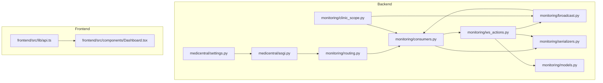
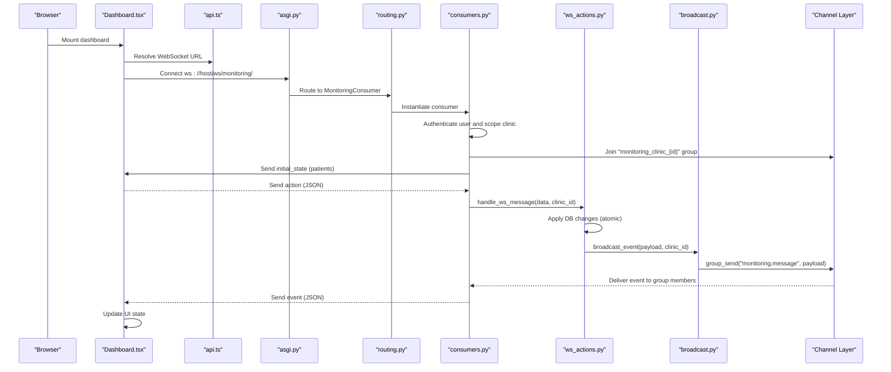
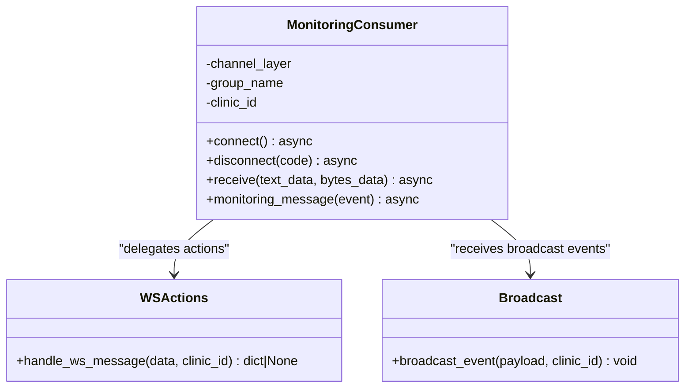
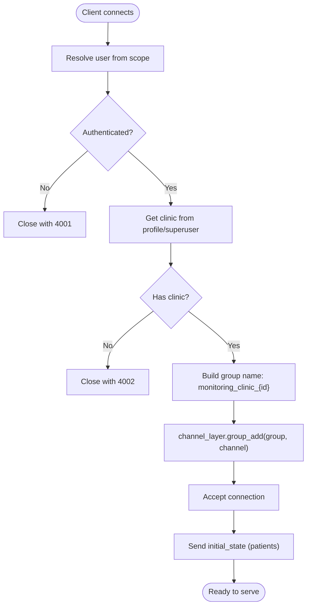
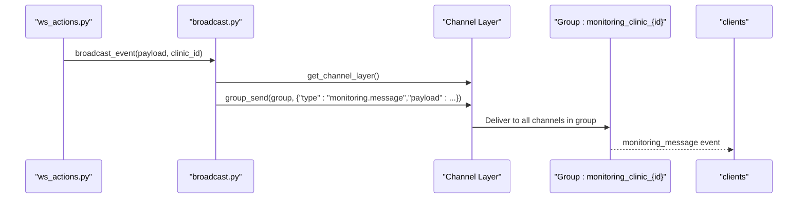
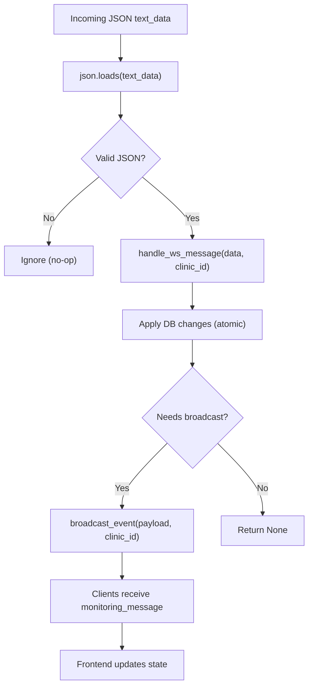
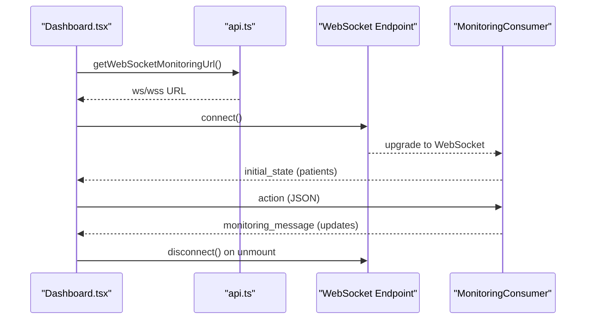
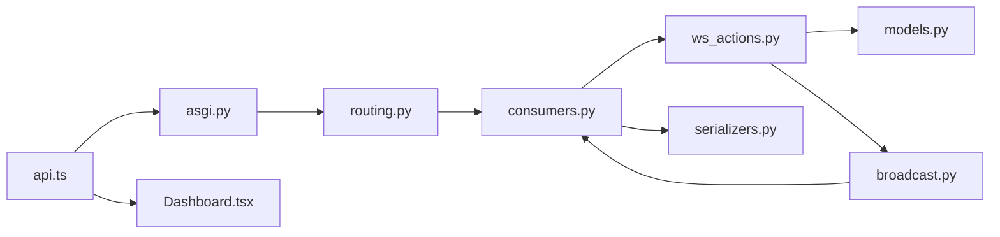
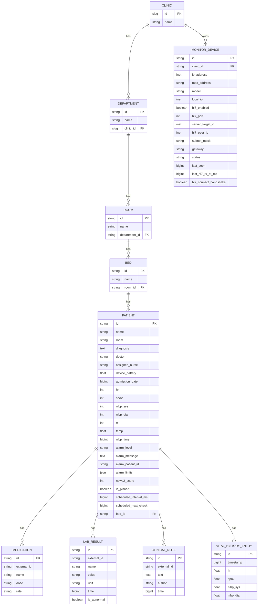

# Real-time Communication System

<cite>
**Referenced Files in This Document**
- [asgi.py](file://backend/medicentral/asgi.py)
- [settings.py](file://backend/medicentral/settings.py)
- [routing.py](file://backend/monitoring/routing.py)
- [consumers.py](file://backend/monitoring/consumers.py)
- [broadcast.py](file://backend/monitoring/broadcast.py)
- [ws_actions.py](file://backend/monitoring/ws_actions.py)
- [clinic_scope.py](file://backend/monitoring/clinic_scope.py)
- [models.py](file://backend/monitoring/models.py)
- [serializers.py](file://backend/monitoring/serializers.py)
- [api.ts](file://frontend/src/lib/api.ts)
- [Dashboard.tsx](file://frontend/src/components/Dashboard.tsx)
</cite>

## Table of Contents
1. [Introduction](#introduction)
2. [Project Structure](#project-structure)
3. [Core Components](#core-components)
4. [Architecture Overview](#architecture-overview)
5. [Detailed Component Analysis](#detailed-component-analysis)
6. [Dependency Analysis](#dependency-analysis)
7. [Performance Considerations](#performance-considerations)
8. [Troubleshooting Guide](#troubleshooting-guide)
9. [Conclusion](#conclusion)
10. [Appendices](#appendices)

## Introduction
This document describes the real-time communication system built with Django Channels and WebSockets. It explains how WebSocket consumers handle connections and messages, how routing and channel groups are configured, how broadcasts propagate updates to connected clients, and how the system manages connection lifecycles. It also covers message serialization, event handling, error management, scaling via Redis-backed channel layers, and performance optimization strategies. Finally, it illustrates client-server communication patterns and real-time data synchronization with the frontend dashboard.

## Project Structure
The real-time stack spans backend Django Channels configuration and monitoring app components, plus a React-based frontend that connects to the WebSocket endpoint.

**Diagram sources**
- [asgi.py:1-22](file://backend/medicentral/asgi.py#L1-L22)
- [settings.py:170-183](file://backend/medicentral/settings.py#L170-L183)
- [routing.py:1-8](file://backend/monitoring/routing.py#L1-L8)
- [consumers.py:1-46](file://backend/monitoring/consumers.py#L1-L46)
- [broadcast.py:1-20](file://backend/monitoring/broadcast.py#L1-L20)
- [ws_actions.py:1-229](file://backend/monitoring/ws_actions.py#L1-L229)
- [clinic_scope.py:1-30](file://backend/monitoring/clinic_scope.py#L1-L30)
- [serializers.py:1-294](file://backend/monitoring/serializers.py#L1-L294)
- [models.py:1-224](file://backend/monitoring/models.py#L1-L224)
- [api.ts:1-35](file://frontend/src/lib/api.ts#L1-L35)
- [Dashboard.tsx:1-429](file://frontend/src/components/Dashboard.tsx#L1-L429)

**Section sources**
- [asgi.py:1-22](file://backend/medicentral/asgi.py#L1-L22)
- [settings.py:170-183](file://backend/medicentral/settings.py#L170-L183)
- [routing.py:1-8](file://backend/monitoring/routing.py#L1-L8)
- [consumers.py:1-46](file://backend/monitoring/consumers.py#L1-L46)
- [broadcast.py:1-20](file://backend/monitoring/broadcast.py#L1-L20)
- [ws_actions.py:1-229](file://backend/monitoring/ws_actions.py#L1-L229)
- [clinic_scope.py:1-30](file://backend/monitoring/clinic_scope.py#L1-L30)
- [serializers.py:1-294](file://backend/monitoring/serializers.py#L1-L294)
- [models.py:1-224](file://backend/monitoring/models.py#L1-L224)
- [api.ts:1-35](file://frontend/src/lib/api.ts#L1-L35)
- [Dashboard.tsx:1-429](file://frontend/src/components/Dashboard.tsx#L1-L429)

## Core Components
- ASGI application and middleware stack: Initializes Django, wraps routing with authentication and origin validation, and mounts WebSocket routing.
- Channel layer configuration: Uses Redis-backed channel layer for distributed messaging when available; otherwise falls back to in-memory.
- WebSocket routing: Defines the single WebSocket endpoint for monitoring.
- Consumer: Handles connection acceptance, authentication and clinic scoping, initial state delivery, per-client group membership, incoming message parsing, and outgoing event dispatch.
- Broadcasting: Sends structured events to a per-clinic group.
- Action handler: Processes client actions (toggle pin, add note, acknowledge/clear alarms, schedule checks, measure NIBP, admit/discharge patients) and emits normalized events.
- Serializers: Converts models to JSON-compatible structures for initial state and updates.
- Frontend integration: Resolves WebSocket URL and connects/disconnects based on dashboard lifecycle.

**Section sources**
- [asgi.py:10-21](file://backend/medicentral/asgi.py#L10-L21)
- [settings.py:170-183](file://backend/medicentral/settings.py#L170-L183)
- [routing.py:5-7](file://backend/monitoring/routing.py#L5-L7)
- [consumers.py:12-46](file://backend/monitoring/consumers.py#L12-L46)
- [broadcast.py:10-20](file://backend/monitoring/broadcast.py#L10-L20)
- [ws_actions.py:31-229](file://backend/monitoring/ws_actions.py#L31-L229)
- [serializers.py:13-97](file://backend/monitoring/serializers.py#L13-L97)
- [api.ts:21-34](file://frontend/src/lib/api.ts#L21-L34)
- [Dashboard.tsx:49-54](file://frontend/src/components/Dashboard.tsx#L49-L54)

## Architecture Overview
The system routes WebSocket traffic through Django Channels to a dedicated consumer. The consumer validates the authenticated user, scopes to a clinic, joins a per-clinic group, sends initial state, and listens for client actions. Actions are processed synchronously with database transactions and then broadcast to the clinic’s group. Clients receive normalized events and update the UI accordingly.

**Diagram sources**
- [asgi.py:14-21](file://backend/medicentral/asgi.py#L14-L21)
- [routing.py:5-7](file://backend/monitoring/routing.py#L5-L7)
- [consumers.py:13-45](file://backend/monitoring/consumers.py#L13-L45)
- [ws_actions.py:32-228](file://backend/monitoring/ws_actions.py#L32-L228)
- [broadcast.py:10-19](file://backend/monitoring/broadcast.py#L10-L19)
- [api.ts:22-34](file://frontend/src/lib/api.ts#L22-L34)
- [Dashboard.tsx:49-54](file://frontend/src/components/Dashboard.tsx#L49-L54)

## Detailed Component Analysis

### WebSocket Consumer
The consumer enforces authentication, scopes to a clinic, joins a per-clinic group, sends initial state, and handles incoming messages. It delegates action processing to the action handler and forwards broadcast payloads to clients.

**Diagram sources**
- [consumers.py:12-46](file://backend/monitoring/consumers.py#L12-L46)
- [ws_actions.py:32-228](file://backend/monitoring/ws_actions.py#L32-L228)
- [broadcast.py:10-19](file://backend/monitoring/broadcast.py#L10-L19)

**Section sources**
- [consumers.py:12-46](file://backend/monitoring/consumers.py#L12-L46)

### Routing and Channel Groups
- WebSocket URL pattern routes to the consumer via an ASGI wrapper.
- Each consumer joins a group named after the clinic ID derived from the authenticated user’s profile.
- Broadcasts target the same group name, ensuring per-clinic isolation.

**Diagram sources**
- [routing.py:5-7](file://backend/monitoring/routing.py#L5-L7)
- [consumers.py:13-29](file://backend/monitoring/consumers.py#L13-L29)
- [clinic_scope.py:11-23](file://backend/monitoring/clinic_scope.py#L11-L23)

**Section sources**
- [routing.py:5-7](file://backend/monitoring/routing.py#L5-L7)
- [consumers.py:13-29](file://backend/monitoring/consumers.py#L13-L29)
- [clinic_scope.py:11-23](file://backend/monitoring/clinic_scope.py#L11-L23)

### Broadcasting System
Broadcasting uses the channel layer to send a standardized event to all members of a clinic’s group. The consumer receives the event and forwards it to the client as a JSON message.

**Diagram sources**
- [ws_actions.py:43-46](file://backend/monitoring/ws_actions.py#L43-L46)
- [broadcast.py:10-19](file://backend/monitoring/broadcast.py#L10-L19)
- [consumers.py:35-36](file://backend/monitoring/consumers.py#L35-L36)

**Section sources**
- [broadcast.py:10-19](file://backend/monitoring/broadcast.py#L10-L19)
- [consumers.py:35-36](file://backend/monitoring/consumers.py#L35-L36)

### Message Serialization and Event Handling
- Initial state serialization: The consumer serializes all patients for the clinic and sends them as an initial_state event.
- Per-action serialization: After mutations, the action handler serializes affected entities and emits normalized events.
- Client reception: The consumer deserializes incoming messages and delegates to the action handler.

**Diagram sources**
- [consumers.py:38-45](file://backend/monitoring/consumers.py#L38-L45)
- [ws_actions.py:32-228](file://backend/monitoring/ws_actions.py#L32-L228)
- [serializers.py:13-97](file://backend/monitoring/serializers.py#L13-L97)

**Section sources**
- [consumers.py:26-29](file://backend/monitoring/consumers.py#L26-L29)
- [serializers.py:13-97](file://backend/monitoring/serializers.py#L13-L97)
- [ws_actions.py:43-46](file://backend/monitoring/ws_actions.py#L43-L46)

### Client-Server Communication Patterns
- Frontend resolves the WebSocket URL based on backend origin and protocol.
- On mount, the dashboard connects to the WebSocket endpoint.
- On unmount, it disconnects gracefully.
- The consumer sends an initial_state payload upon successful connection.
- The frontend filters and renders patients according to selected criteria and alarm severity.

**Diagram sources**
- [api.ts:22-34](file://frontend/src/lib/api.ts#L22-L34)
- [Dashboard.tsx:49-54](file://frontend/src/components/Dashboard.tsx#L49-L54)
- [consumers.py:26-29](file://backend/monitoring/consumers.py#L26-L29)

**Section sources**
- [api.ts:22-34](file://frontend/src/lib/api.ts#L22-L34)
- [Dashboard.tsx:49-54](file://frontend/src/components/Dashboard.tsx#L49-L54)
- [consumers.py:26-29](file://backend/monitoring/consumers.py#L26-L29)

## Dependency Analysis
The system exhibits clear separation of concerns:
- ASGI config depends on routing and Django application.
- Routing depends on the consumer class.
- Consumer depends on clinic scoping, serializers, and action handler.
- Action handler depends on models, serializers, and broadcast module.
- Broadcast depends on channel layer and group naming.
- Frontend depends on API utilities for URL construction and lifecycle hooks for connection management.

**Diagram sources**
- [asgi.py:12-18](file://backend/medicentral/asgi.py#L12-L18)
- [routing.py:3-7](file://backend/monitoring/routing.py#L3-L7)
- [consumers.py:7-9](file://backend/monitoring/consumers.py#L7-L9)
- [ws_actions.py:12-15](file://backend/monitoring/ws_actions.py#L12-L15)
- [broadcast.py:7-19](file://backend/monitoring/broadcast.py#L7-L19)
- [serializers.py:10-14](file://backend/monitoring/serializers.py#L10-L14)
- [models.py:141-224](file://backend/monitoring/models.py#L141-L224)
- [api.ts:22-34](file://frontend/src/lib/api.ts#L22-L34)
- [Dashboard.tsx:49-54](file://frontend/src/components/Dashboard.tsx#L49-L54)

**Section sources**
- [asgi.py:12-18](file://backend/medicentral/asgi.py#L12-L18)
- [routing.py:3-7](file://backend/monitoring/routing.py#L3-L7)
- [consumers.py:7-9](file://backend/monitoring/consumers.py#L7-L9)
- [ws_actions.py:12-15](file://backend/monitoring/ws_actions.py#L12-L15)
- [broadcast.py:7-19](file://backend/monitoring/broadcast.py#L7-L19)
- [serializers.py:10-14](file://backend/monitoring/serializers.py#L10-L14)
- [models.py:141-224](file://backend/monitoring/models.py#L141-L224)
- [api.ts:22-34](file://frontend/src/lib/api.ts#L22-L34)
- [Dashboard.tsx:49-54](file://frontend/src/components/Dashboard.tsx#L49-L54)

## Performance Considerations
- Channel layer scaling: Redis-backed channel layer enables horizontal scaling across multiple workers/nodes. Configure REDIS_URL to enable distributed messaging.
- Connection lifecycle: Consumers join per-clinic groups on connect and leave on disconnect, minimizing cross-clinic overhead.
- Serialization cost: Initial state serialization fetches and serializes all patients for a clinic. Consider pagination or incremental updates for very large datasets.
- Transaction boundaries: Action handler uses atomic transactions to ensure consistency; keep payloads minimal and avoid long-running operations inside transactions.
- Broadcast volume: Broadcasting affects all clients in a clinic group; avoid excessive small updates and batch where appropriate.
- Frontend rendering: Dashboard filters and sorts patients client-side; ensure efficient filtering and virtualization for large lists.

[No sources needed since this section provides general guidance]

## Troubleshooting Guide
- Authentication failures: Connections from anonymous or unscoped users are closed early with explicit codes. Verify user authentication and clinic profile linkage.
- Group membership: Ensure the consumer joins the correct group name derived from the clinic ID. Misconfiguration leads to missed broadcasts.
- JSON parsing errors: Incoming messages must be valid JSON; malformed payloads are ignored. Validate client-side payloads.
- Channel layer availability: If no channel layer is configured, broadcasts are no-ops. Confirm Redis configuration for production.
- Frontend connectivity: Confirm WebSocket URL resolution and protocol match (ws/wss). Check browser console/network tab for connection errors.

**Section sources**
- [consumers.py:15-21](file://backend/monitoring/consumers.py#L15-L21)
- [consumers.py:31-33](file://backend/monitoring/consumers.py#L31-L33)
- [consumers.py:42-44](file://backend/monitoring/consumers.py#L42-L44)
- [broadcast.py:12-14](file://backend/monitoring/broadcast.py#L12-L14)
- [api.ts:22-34](file://frontend/src/lib/api.ts#L22-L34)

## Conclusion
The system provides a robust, scalable real-time pipeline for clinical monitoring dashboards. It leverages Django Channels for asynchronous WebSocket handling, Redis for distributed messaging, and a clean separation of concerns for routing, consumers, broadcasting, and action handling. The frontend integrates seamlessly with the backend via a standardized event model, enabling responsive, real-time updates synchronized across clinic groups.

[No sources needed since this section summarizes without analyzing specific files]

## Appendices

### Data Model Overview
The monitoring domain centers around clinics, departments, rooms, beds, monitor devices, patients, medications, lab results, clinical notes, and vitals history.

**Diagram sources**
- [models.py:5-224](file://backend/monitoring/models.py#L5-L224)