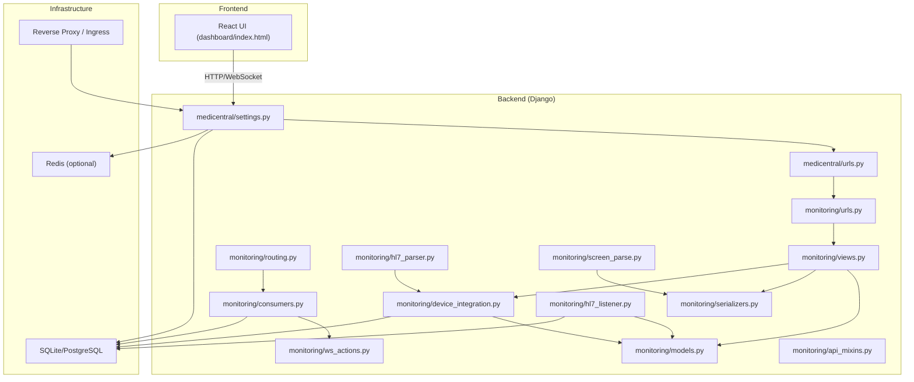
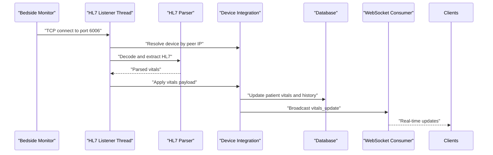
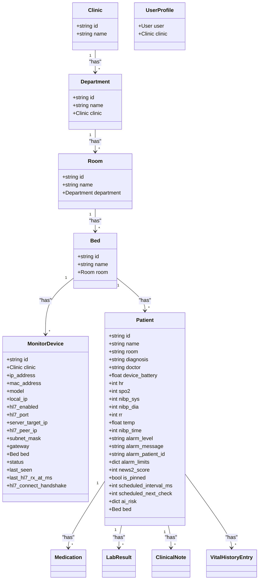
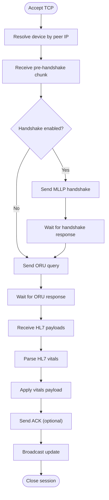
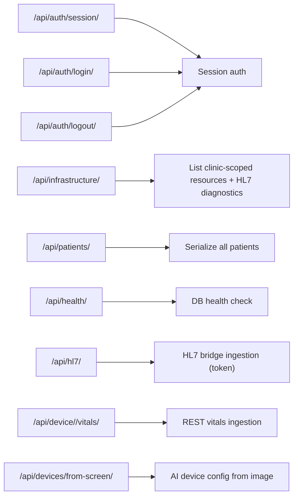
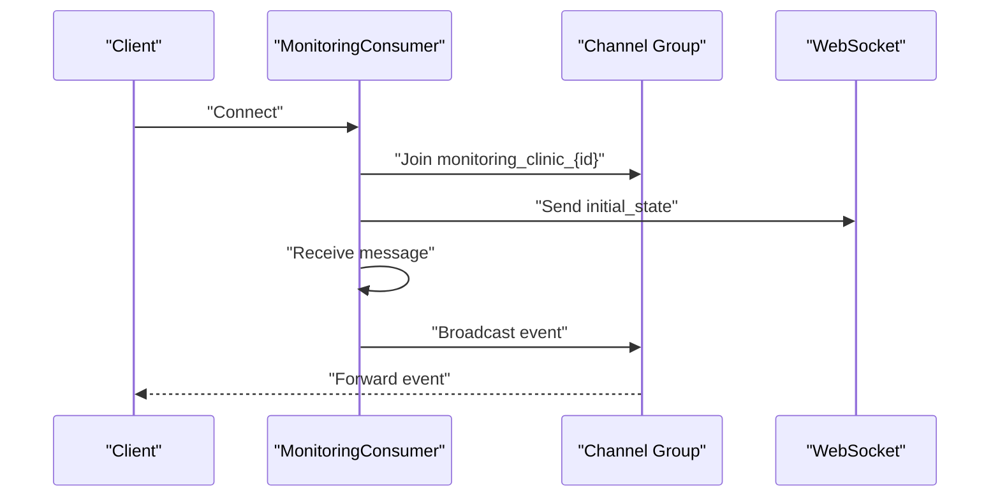
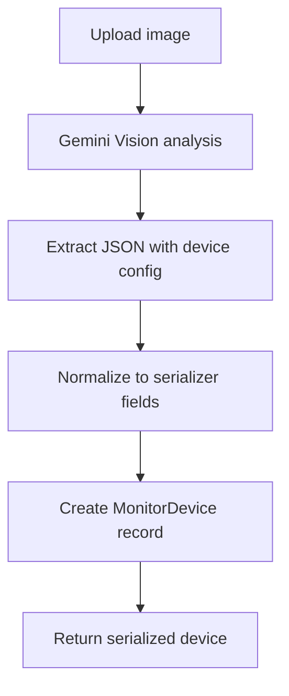
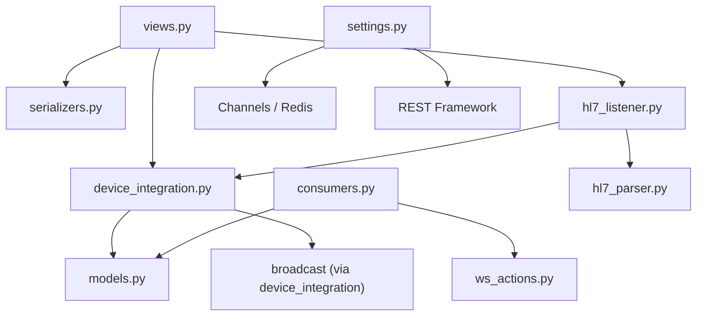

# Cloud API Service

<cite>
**Referenced Files in This Document**
- [README.md](file://README.md)
- [settings.py](file://backend/medicentral/settings.py)
- [urls.py](file://backend/medicentral/urls.py)
- [models.py](file://backend/monitoring/models.py)
- [views.py](file://backend/monitoring/views.py)
- [serializers.py](file://backend/monitoring/serializers.py)
- [urls.py](file://backend/monitoring/urls.py)
- [consumers.py](file://backend/monitoring/consumers.py)
- [routing.py](file://backend/monitoring/routing.py)
- [device_integration.py](file://backend/monitoring/device_integration.py)
- [hl7_listener.py](file://backend/monitoring/hl7_listener.py)
- [hl7_parser.py](file://backend/monitoring/hl7_parser.py)
- [screen_parse.py](file://backend/monitoring/screen_parse.py)
- [ws_actions.py](file://backend/monitoring/ws_actions.py)
- [api_mixins.py](file://backend/monitoring/api_mixins.py)
</cite>

## Table of Contents
1. [Introduction](#introduction)
2. [Project Structure](#project-structure)
3. [Core Components](#core-components)
4. [Architecture Overview](#architecture-overview)
5. [Detailed Component Analysis](#detailed-component-analysis)
6. [Dependency Analysis](#dependency-analysis)
7. [Performance Considerations](#performance-considerations)
8. [Troubleshooting Guide](#troubleshooting-guide)
9. [Conclusion](#conclusion)

## Introduction
This document describes the Cloud API Service for clinical monitoring, a Django-based backend integrated with Django REST Framework and Django Channels for real-time updates. The system ingests patient vitals via HL7 MLLP from bedside monitors, processes and validates the data, persists it to a database, and streams live updates to clients via WebSocket. It also supports REST ingestion and automated device discovery from monitor screenshots using AI vision.

Key capabilities:
- HL7 MLLP listener with robust parsing and diagnostic reporting
- REST endpoints for device and patient data management
- Real-time WebSocket streaming per clinic
- AI-powered device configuration extraction from monitor screenshots
- Multi-tenant clinic scoping and role-based access control

## Project Structure
The repository follows a modular Django project layout with a dedicated monitoring app containing models, views, serializers, parsers, and real-time consumers.

**Diagram sources**
- [settings.py:1-218](file://backend/medicentral/settings.py#L1-L218)
- [urls.py:1-11](file://backend/medicentral/urls.py#L1-L11)
- [models.py:1-224](file://backend/monitoring/models.py#L1-L224)
- [views.py:1-539](file://backend/monitoring/views.py#L1-L539)
- [serializers.py:1-294](file://backend/monitoring/serializers.py#L1-L294)
- [urls.py:1-25](file://backend/monitoring/urls.py#L1-L25)
- [consumers.py:1-46](file://backend/monitoring/consumers.py#L1-L46)
- [routing.py:1-8](file://backend/monitoring/routing.py#L1-L8)
- [device_integration.py:1-232](file://backend/monitoring/device_integration.py#L1-L232)
- [hl7_listener.py:1-756](file://backend/monitoring/hl7_listener.py#L1-L756)
- [hl7_parser.py:1-530](file://backend/monitoring/hl7_parser.py#L1-L530)
- [screen_parse.py:1-160](file://backend/monitoring/screen_parse.py#L1-L160)
- [ws_actions.py:1-229](file://backend/monitoring/ws_actions.py#L1-L229)
- [api_mixins.py:1-67](file://backend/monitoring/api_mixins.py#L1-L67)

**Section sources**
- [README.md:1-110](file://README.md#L1-L110)
- [settings.py:1-218](file://backend/medicentral/settings.py#L1-L218)
- [urls.py:1-11](file://backend/medicentral/urls.py#L1-L11)
- [urls.py:1-25](file://backend/monitoring/urls.py#L1-L25)

## Core Components
- Authentication and permissions: Session-based authentication with IsAuthenticated enforced across most endpoints; CORS and CSRF policies configured via environment variables.
- REST API: DRF ViewSets for departments, rooms, beds, and devices; additional endpoints for infrastructure, patients, health checks, and HL7 bridge ingestion.
- HL7 MLLP ingestion: Dedicated listener thread, robust parser supporting multiple encodings and vendor-specific segments, and automatic device resolution by peer IP.
- Real-time updates: WebSocket consumer per clinic group broadcasting vitals updates and administrative actions.
- Device configuration: REST endpoint to ingest vitals via REST; AI-powered device configuration extraction from monitor screenshots.
- Data models: Multi-tenant clinic hierarchy with departments, rooms, beds, and monitor devices; patient records with vitals, alarms, history, and scheduled checks.

**Section sources**
- [settings.py:146-153](file://backend/medicentral/settings.py#L146-L153)
- [views.py:38-539](file://backend/monitoring/views.py#L38-L539)
- [models.py:5-224](file://backend/monitoring/models.py#L5-L224)
- [hl7_listener.py:687-756](file://backend/monitoring/hl7_listener.py#L687-L756)
- [consumers.py:12-46](file://backend/monitoring/consumers.py#L12-L46)
- [screen_parse.py:58-160](file://backend/monitoring/screen_parse.py#L58-L160)

## Architecture Overview
The system integrates three primary data pathways:
- HL7 MLLP: Monitors connect to a TCP listener; messages are parsed, vitals extracted, persisted, and broadcast.
- REST: Clients can post vitals directly or upload monitor screenshots for device configuration.
- WebSocket: Clients subscribe to clinic-specific groups to receive live updates.

**Diagram sources**
- [hl7_listener.py:426-634](file://backend/monitoring/hl7_listener.py#L426-L634)
- [hl7_parser.py:487-530](file://backend/monitoring/hl7_parser.py#L487-L530)
- [device_integration.py:129-224](file://backend/monitoring/device_integration.py#L129-L224)
- [consumers.py:35-36](file://backend/monitoring/consumers.py#L35-L36)

## Detailed Component Analysis

### Data Models
The monitoring domain centers around clinics, departments, rooms, beds, monitor devices, and patients. Devices track connectivity and HL7-related state; patients store current vitals, alarms, NEWS-2 scores, and history entries.

**Diagram sources**
- [models.py:5-224](file://backend/monitoring/models.py#L5-L224)

**Section sources**
- [models.py:5-224](file://backend/monitoring/models.py#L5-L224)

### HL7 MLLP Listener and Parser
The HL7 listener runs in a dedicated thread, accepts TCP connections, and handles vendor-specific quirks (e.g., sending handshake or ORU queries). It parses HL7 messages, extracts vitals, and triggers device updates and broadcasts.

**Diagram sources**
- [hl7_listener.py:426-634](file://backend/monitoring/hl7_listener.py#L426-L634)
- [hl7_parser.py:423-530](file://backend/monitoring/hl7_parser.py#L423-L530)
- [device_integration.py:129-224](file://backend/monitoring/device_integration.py#L129-L224)

**Section sources**
- [hl7_listener.py:636-756](file://backend/monitoring/hl7_listener.py#L636-L756)
- [hl7_parser.py:1-530](file://backend/monitoring/hl7_parser.py#L1-L530)

### REST API Endpoints
Key endpoints include:
- Authentication: session, login, logout
- Infrastructure: list departments, rooms, beds, devices, and HL7 diagnostics
- Patients: list all patients scoped by clinic
- Health: database connectivity check
- HL7 bridge: token-protected ingestion from external bridges
- Device vitals: REST ingestion by device IP
- Device configuration from screen: AI-powered device setup from screenshot

**Diagram sources**
- [urls.py:1-25](file://backend/monitoring/urls.py#L1-L25)
- [views.py:373-539](file://backend/monitoring/views.py#L373-L539)

**Section sources**
- [views.py:373-539](file://backend/monitoring/views.py#L373-L539)
- [urls.py:1-25](file://backend/monitoring/urls.py#L1-L25)

### WebSocket Streaming
Each authenticated user joins a clinic-specific group. On connection, the consumer sends initial patient state and forwards subsequent events.

**Diagram sources**
- [consumers.py:12-46](file://backend/monitoring/consumers.py#L12-L46)
- [routing.py:5-7](file://backend/monitoring/routing.py#L5-L7)

**Section sources**
- [consumers.py:12-46](file://backend/monitoring/consumers.py#L12-L46)
- [routing.py:1-8](file://backend/monitoring/routing.py#L1-L8)

### Device Configuration from Screenshots
The system uses an AI vision model to extract HL7 configuration from monitor screenshots, normalizing the output to device creation payloads.

**Diagram sources**
- [screen_parse.py:58-160](file://backend/monitoring/screen_parse.py#L58-L160)
- [views.py:323-371](file://backend/monitoring/views.py#L323-L371)

**Section sources**
- [screen_parse.py:1-160](file://backend/monitoring/screen_parse.py#L1-L160)
- [views.py:323-371](file://backend/monitoring/views.py#L323-L371)

## Dependency Analysis
The system exhibits clear separation of concerns:
- Views depend on serializers, device integration, and HL7 utilities
- Device integration orchestrates persistence and broadcasting
- Consumers depend on clinic scoping and serialization
- HL7 listener depends on parser and device integration
- Settings configure middleware, authentication, and channel layers

**Diagram sources**
- [views.py:1-539](file://backend/monitoring/views.py#L1-L539)
- [serializers.py:1-294](file://backend/monitoring/serializers.py#L1-L294)
- [device_integration.py:1-232](file://backend/monitoring/device_integration.py#L1-L232)
- [consumers.py:1-46](file://backend/monitoring/consumers.py#L1-L46)
- [ws_actions.py:1-229](file://backend/monitoring/ws_actions.py#L1-L229)
- [hl7_listener.py:1-756](file://backend/monitoring/hl7_listener.py#L1-L756)
- [hl7_parser.py:1-530](file://backend/monitoring/hl7_parser.py#L1-L530)
- [settings.py:68-183](file://backend/medicentral/settings.py#L68-L183)

**Section sources**
- [settings.py:68-183](file://backend/medicentral/settings.py#L68-L183)
- [views.py:1-539](file://backend/monitoring/views.py#L1-L539)

## Performance Considerations
- HL7 throughput: The listener uses non-blocking socket options and a thread-per-connection model; consider scaling with Redis-backed channel layers for multi-instance deployments.
- Parsing efficiency: The parser attempts multiple encodings and merges results; ensure adequate CPU for mixed-language HL7 traffic.
- WebSocket scalability: Use Redis channel layer for horizontal scaling; limit payload sizes and batch updates where appropriate.
- Database writes: History entries are capped; ensure indexes on timestamp and foreign keys for efficient queries.
- CORS and proxy: Configure reverse proxy and HSTS appropriately for production to reduce overhead and improve security.

## Troubleshooting Guide
Common operational checks:
- Health endpoint: Verify database connectivity via the health endpoint.
- HL7 diagnostics: Use the infrastructure endpoint to inspect listener status, bind errors, and diagnostic counters.
- Connection checks: Use the device connection-check endpoint to diagnose HL7 listener, firewall, and pipeline issues.
- Authentication: Ensure session cookies and CSRF origins are configured for cross-origin requests.
- Environment variables: Confirm DJANGO_SECRET_KEY, CORS_ALLOWED_ORIGINS, and HL7 tuning parameters.

Operational commands and endpoints:
- Health: GET /api/health/
- Infrastructure diagnostics: GET /api/infrastructure/
- Device connection check: GET /api/devices/{id}/connection-check/
- REST ingestion: POST /api/device/{ip}/vitals/
- HL7 bridge ingestion: POST /api/hl7/ (requires token)
- WebSocket: /ws/monitoring/ (authenticated)

**Section sources**
- [views.py:528-539](file://backend/monitoring/views.py#L528-L539)
- [views.py:373-419](file://backend/monitoring/views.py#L373-L419)
- [views.py:65-321](file://backend/monitoring/views.py#L65-L321)
- [settings.py:46-51](file://backend/medicentral/settings.py#L46-L51)

## Conclusion
The Cloud API Service provides a robust foundation for clinical monitoring with:
- Reliable HL7 MLLP ingestion and diagnostics
- Flexible REST APIs for device and patient management
- Scalable real-time updates via WebSocket with multi-tenant scoping
- Automated device configuration from monitor screenshots

Adopt the recommended environment configurations, reverse proxy setup, and Redis channel layer for production deployments to achieve high availability and performance.