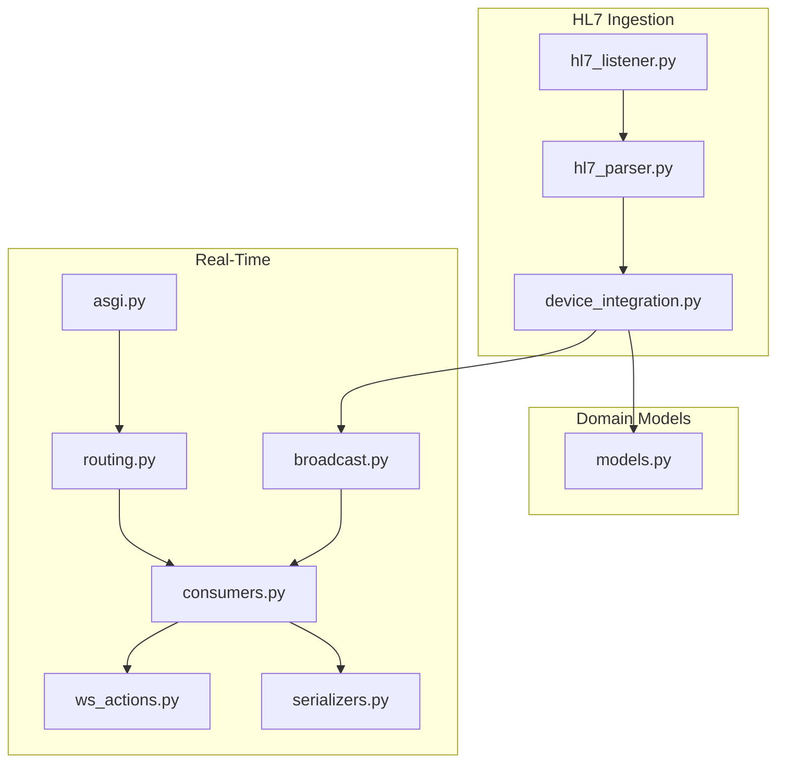
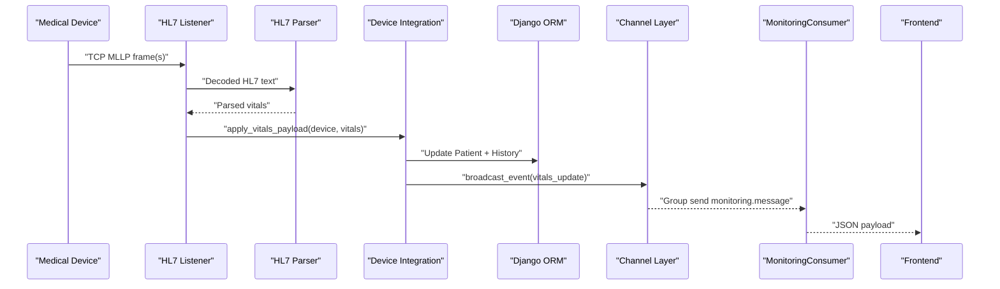
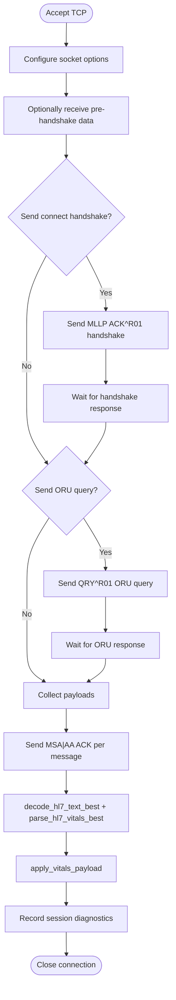
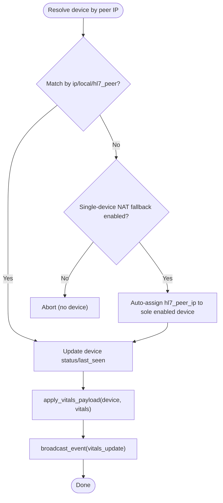
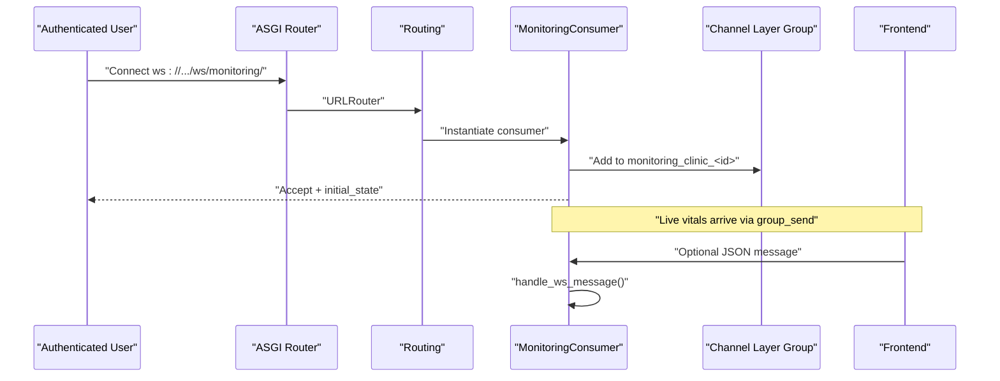
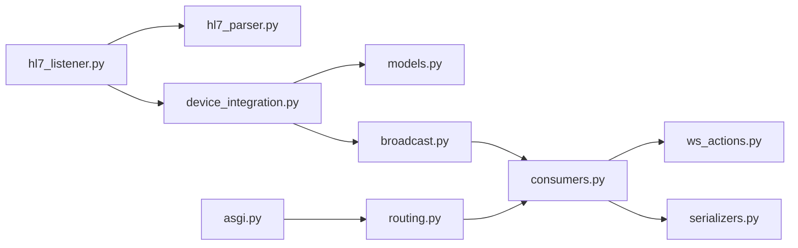
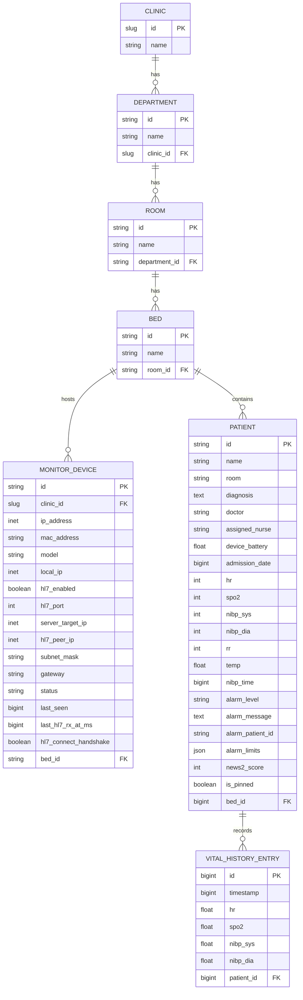

# Data Flow & Integration Patterns

<cite>
**Referenced Files in This Document**
- [hl7_listener.py](file://backend/monitoring/hl7_listener.py)
- [hl7_parser.py](file://backend/monitoring/hl7_parser.py)
- [device_integration.py](file://backend/monitoring/device_integration.py)
- [broadcast.py](file://backend/monitoring/broadcast.py)
- [consumers.py](file://backend/monitoring/consumers.py)
- [routing.py](file://backend/monitoring/routing.py)
- [asgi.py](file://backend/medicentral/asgi.py)
- [models.py](file://backend/monitoring/models.py)
- [ws_actions.py](file://backend/monitoring/ws_actions.py)
- [serializers.py](file://backend/monitoring/serializers.py)
</cite>

## Table of Contents
1. [Introduction](#introduction)
2. [Project Structure](#project-structure)
3. [Core Components](#core-components)
4. [Architecture Overview](#architecture-overview)
5. [Detailed Component Analysis](#detailed-component-analysis)
6. [Dependency Analysis](#dependency-analysis)
7. [Performance Considerations](#performance-considerations)
8. [Troubleshooting Guide](#troubleshooting-guide)
9. [Conclusion](#conclusion)
10. [Appendices](#appendices)

## Introduction
This document explains the complete data flow and integration patterns in the system, from HL7 medical device communication over TCP sockets to real-time frontend visualization via WebSockets. It covers:
- HL7 MLLP ingestion and parsing
- Device integration and NAT traversal
- Event-driven architecture using Django Channels and Redis-backed Channel Layers
- Broadcasting and consumer handling for real-time updates
- Data validation, error handling, and retry strategies
- Performance considerations for high-frequency streams and scaling

## Project Structure
The backend is organized around monitoring-related modules and Django Channels for real-time communication. Key areas:
- HL7 ingestion and parsing
- Device and patient domain models
- Real-time WebSocket routing and consumers
- Broadcasting to client groups

**Diagram sources**
- [hl7_listener.py:1-755](file://backend/monitoring/hl7_listener.py#L1-L755)
- [hl7_parser.py:1-530](file://backend/monitoring/hl7_parser.py#L1-L530)
- [device_integration.py:1-232](file://backend/monitoring/device_integration.py#L1-L232)
- [models.py:1-224](file://backend/monitoring/models.py#L1-L224)
- [asgi.py:1-22](file://backend/medicentral/asgi.py#L1-L22)
- [routing.py:1-8](file://backend/monitoring/routing.py#L1-L8)
- [consumers.py:1-46](file://backend/monitoring/consumers.py#L1-L46)
- [broadcast.py:1-20](file://backend/monitoring/broadcast.py#L1-L20)
- [ws_actions.py:1-229](file://backend/monitoring/ws_actions.py#L1-L229)
- [serializers.py:1-291](file://backend/monitoring/serializers.py#L1-L291)

**Section sources**
- [hl7_listener.py:1-755](file://backend/monitoring/hl7_listener.py#L1-L755)
- [hl7_parser.py:1-530](file://backend/monitoring/hl7_parser.py#L1-L530)
- [device_integration.py:1-232](file://backend/monitoring/device_integration.py#L1-L232)
- [models.py:1-224](file://backend/monitoring/models.py#L1-L224)
- [asgi.py:1-22](file://backend/medicentral/asgi.py#L1-L22)
- [routing.py:1-8](file://backend/monitoring/routing.py#L1-L8)
- [consumers.py:1-46](file://backend/monitoring/consumers.py#L1-L46)
- [broadcast.py:1-20](file://backend/monitoring/broadcast.py#L1-L20)
- [ws_actions.py:1-229](file://backend/monitoring/ws_actions.py#L1-L229)
- [serializers.py:1-291](file://backend/monitoring/serializers.py#L1-L291)

## Core Components
- HL7 Listener: Accepts TCP connections, normalizes MLLP frames, decodes payloads, and triggers ACKs and processing.
- HL7 Parser: Extracts vitals from HL7 texts across encodings and formats.
- Device Integration: Resolves devices by peer IP, applies vitals to patients, and broadcasts updates.
- Broadcast: Sends events to a per-clinic group via the Channel Layer.
- Consumer: Handles WebSocket connections, authenticates users, and routes messages.
- Routing and ASGI: Wire WebSocket URLs and middleware.
- Domain Models: Define clinics, departments, rooms, beds, devices, and patients.

**Section sources**
- [hl7_listener.py:426-578](file://backend/monitoring/hl7_listener.py#L426-L578)
- [hl7_parser.py:423-530](file://backend/monitoring/hl7_parser.py#L423-L530)
- [device_integration.py:31-78](file://backend/monitoring/device_integration.py#L31-L78)
- [broadcast.py:10-20](file://backend/monitoring/broadcast.py#L10-L20)
- [consumers.py:12-46](file://backend/monitoring/consumers.py#L12-L46)
- [routing.py:5-7](file://backend/monitoring/routing.py#L5-L7)
- [asgi.py:14-21](file://backend/medicentral/asgi.py#L14-L21)
- [models.py:77-147](file://backend/monitoring/models.py#L77-L147)

## Architecture Overview
The system follows an event-driven pattern:
- HL7 devices stream TCP frames to the listener, which parses and validates vitals.
- Valid vitals are applied to the patient record and broadcast to the appropriate clinic group.
- Frontend clients connect via WebSocket, receive initial state, and subscribe to live updates.

**Diagram sources**
- [hl7_listener.py:580-633](file://backend/monitoring/hl7_listener.py#L580-L633)
- [hl7_parser.py:487-530](file://backend/monitoring/hl7_parser.py#L487-L530)
- [device_integration.py:129-224](file://backend/monitoring/device_integration.py#L129-L224)
- [broadcast.py:10-20](file://backend/monitoring/broadcast.py#L10-L20)
- [consumers.py:35-36](file://backend/monitoring/consumers.py#L35-L36)

## Detailed Component Analysis

### HL7 MLLP Ingestion and Parsing
- Connection lifecycle: Accept TCP, configure socket options, optionally send connect handshake, optionally query for ORU response, collect payloads, ACK each message, and record diagnostics.
- MLLP framing: Detect start/end markers, peel frames, and handle partial reads gracefully.
- Encoding detection: Try UTF-8, UTF-16 LE/BE, CP1251, Latin-1, GBK; merge best results.
- Vitals extraction: Normalize OBX fields, infer types heuristically, and extract numeric values.

**Diagram sources**
- [hl7_listener.py:426-578](file://backend/monitoring/hl7_listener.py#L426-L578)
- [hl7_parser.py:466-530](file://backend/monitoring/hl7_parser.py#L466-L530)

**Section sources**
- [hl7_listener.py:125-342](file://backend/monitoring/hl7_listener.py#L125-L342)
- [hl7_parser.py:423-530](file://backend/monitoring/hl7_parser.py#L423-L530)

### Device Integration and NAT Traversal
- Device resolution by peer IP supports direct match against configured IPs and optional NAT fallback to a single enabled device.
- On successful vitals, device status is updated, patient vitals are persisted, NEWS-2 score recalculated, history maintained, and an event is broadcast to the clinic group.

**Diagram sources**
- [device_integration.py:31-78](file://backend/monitoring/device_integration.py#L31-L78)
- [device_integration.py:129-224](file://backend/monitoring/device_integration.py#L129-L224)

**Section sources**
- [device_integration.py:31-78](file://backend/monitoring/device_integration.py#L31-L78)
- [device_integration.py:129-224](file://backend/monitoring/device_integration.py#L129-L224)

### Real-Time Broadcasting and Consumers
- ASGI config wires WebSocket routing with authentication and origin validation.
- Routing defines the WebSocket endpoint.
- Consumer handles connection, authentication, group membership, initial state, and inbound messages.
- Broadcast sends structured events to a per-clinic group; consumers forward them to clients.

**Diagram sources**
- [asgi.py:14-21](file://backend/medicentral/asgi.py#L14-L21)
- [routing.py:5-7](file://backend/monitoring/routing.py#L5-L7)
- [consumers.py:13-46](file://backend/monitoring/consumers.py#L13-L46)
- [broadcast.py:10-20](file://backend/monitoring/broadcast.py#L10-L20)
- [ws_actions.py:32-47](file://backend/monitoring/ws_actions.py#L32-L47)

**Section sources**
- [asgi.py:14-21](file://backend/medicentral/asgi.py#L14-L21)
- [routing.py:5-7](file://backend/monitoring/routing.py#L5-L7)
- [consumers.py:12-46](file://backend/monitoring/consumers.py#L12-L46)
- [broadcast.py:10-20](file://backend/monitoring/broadcast.py#L10-L20)
- [ws_actions.py:32-47](file://backend/monitoring/ws_actions.py#L32-L47)

### Data Validation Patterns and Error Handling
- Input validation:
  - Device serializer validates optional IP fields and uniqueness constraints.
  - HL7 decoding attempts multiple encodings and merges best results.
- Error handling:
  - Graceful handling of partial reads, timeouts, and connection resets during ingestion.
  - Diagnostic counters and logs track empty sessions and raw TCP previews.
  - Consumers reject unauthenticated users and enforce clinic scoping.
- Retry and resilience:
  - Listener binds loop with restart-on-failure and diagnostic reporting.
  - Optional pre-handshake receive and handshake/oru query retries improve compatibility.

**Section sources**
- [serializers.py:226-249](file://backend/monitoring/serializers.py#L226-L249)
- [hl7_listener.py:237-342](file://backend/monitoring/hl7_listener.py#L237-L342)
- [hl7_parser.py:466-530](file://backend/monitoring/hl7_parser.py#L466-L530)
- [consumers.py:15-21](file://backend/monitoring/consumers.py#L15-L21)

### Integration Patterns for Different Devices
- K12 and OEM monitors:
  - Optional connect handshake and ORU query to trigger response.
  - Pre-handshake receive window to accommodate immediate first packets.
- NAT environments:
  - Single-device fallback auto-assigns hl7_peer_ip for a clinic with one enabled device.
- Multi-tenant isolation:
  - Per-clinic groups ensure cross-clinic separation of live updates.

**Section sources**
- [hl7_listener.py:372-414](file://backend/monitoring/hl7_listener.py#L372-L414)
- [hl7_listener.py:187-234](file://backend/monitoring/hl7_listener.py#L187-L234)
- [device_integration.py:59-78](file://backend/monitoring/device_integration.py#L59-L78)
- [broadcast.py:10-20](file://backend/monitoring/broadcast.py#L10-L20)

## Dependency Analysis
Key dependencies and coupling:
- HL7 ingestion depends on parser and device integration.
- Device integration depends on models and broadcast.
- Real-time layer depends on routing, consumers, and serializers.
- Broadcasting relies on the Channel Layer abstraction.

**Diagram sources**
- [hl7_listener.py:1-755](file://backend/monitoring/hl7_listener.py#L1-L755)
- [hl7_parser.py:1-530](file://backend/monitoring/hl7_parser.py#L1-L530)
- [device_integration.py:1-232](file://backend/monitoring/device_integration.py#L1-L232)
- [models.py:1-224](file://backend/monitoring/models.py#L1-L224)
- [broadcast.py:1-20](file://backend/monitoring/broadcast.py#L1-L20)
- [consumers.py:1-46](file://backend/monitoring/consumers.py#L1-L46)
- [routing.py:1-8](file://backend/monitoring/routing.py#L1-L8)
- [asgi.py:1-22](file://backend/medicentral/asgi.py#L1-L22)
- [ws_actions.py:1-229](file://backend/monitoring/ws_actions.py#L1-L229)
- [serializers.py:1-291](file://backend/monitoring/serializers.py#L1-L291)

**Section sources**
- [hl7_listener.py:1-755](file://backend/monitoring/hl7_listener.py#L1-L755)
- [hl7_parser.py:1-530](file://backend/monitoring/hl7_parser.py#L1-L530)
- [device_integration.py:1-232](file://backend/monitoring/device_integration.py#L1-L232)
- [models.py:1-224](file://backend/monitoring/models.py#L1-L224)
- [broadcast.py:1-20](file://backend/monitoring/broadcast.py#L1-L20)
- [consumers.py:1-46](file://backend/monitoring/consumers.py#L1-L46)
- [routing.py:1-8](file://backend/monitoring/routing.py#L1-L8)
- [asgi.py:1-22](file://backend/medicentral/asgi.py#L1-L22)
- [ws_actions.py:1-229](file://backend/monitoring/ws_actions.py#L1-L229)
- [serializers.py:1-291](file://backend/monitoring/serializers.py#L1-L291)

## Performance Considerations
- Throughput and latency:
  - Disable Nagle’s algorithm and enable keepalive for low-latency TCP.
  - Tune receive timeout for balancing responsiveness and resource usage.
- Memory management:
  - Streaming receive with bounded buffers and incremental parsing prevents unbounded memory growth.
  - Limit history entries to recent samples to cap storage.
- Scaling:
  - Use a horizontally scalable Channel Layer (Redis) to support multiple workers/processes.
  - Keep per-clinic grouping to avoid cross-clinic fan-out overhead.
- Operational reliability:
  - Bind-loop with exponential backoff and diagnostics ensures automatic recovery after transient failures.
  - Optional pre-handshake receive and handshake/oru query reduce device-side stalls.

[No sources needed since this section provides general guidance]

## Troubleshooting Guide
Common issues and mitigations:
- No HL7 received despite TCP connection:
  - Verify handshake and ORU query toggles; adjust pre-handshake wait window.
  - Check NAT fallback and hl7_peer_ip assignment for single-device clinics.
- Empty session or zero-byte payloads:
  - Confirm device HL7/MLLP capability and firewall behavior; review diagnostic counters.
- Authentication or group join failures:
  - Ensure user is authenticated and belongs to a clinic; confirm group name construction.
- Encoding problems:
  - Decoder merges best results across encodings; check logs for detected encodings.

**Section sources**
- [hl7_listener.py:520-541](file://backend/monitoring/hl7_listener.py#L520-L541)
- [hl7_listener.py:635-735](file://backend/monitoring/hl7_listener.py#L635-L735)
- [device_integration.py:59-78](file://backend/monitoring/device_integration.py#L59-L78)
- [consumers.py:15-21](file://backend/monitoring/consumers.py#L15-L21)
- [hl7_parser.py:495-530](file://backend/monitoring/hl7_parser.py#L495-L530)

## Conclusion
The system integrates HL7 devices over TCP with robust parsing and device resolution, applying vitals to patient records and broadcasting real-time updates via Django Channels. The design emphasizes resilience, multi-tenancy, and operational diagnostics, enabling reliable visualization for diverse device ecosystems.

[No sources needed since this section summarizes without analyzing specific files]

## Appendices

### Data Model Overview

**Diagram sources**
- [models.py:5-224](file://backend/monitoring/models.py#L5-L224)