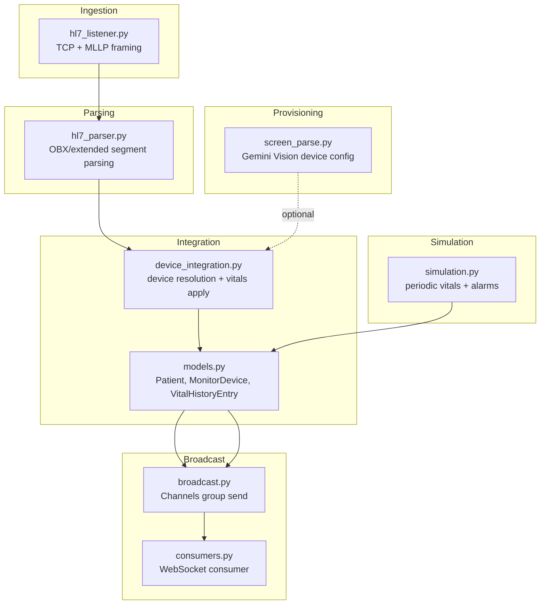
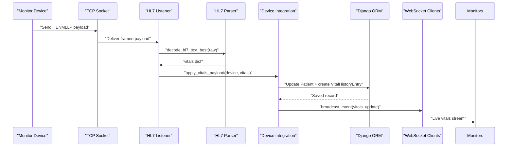
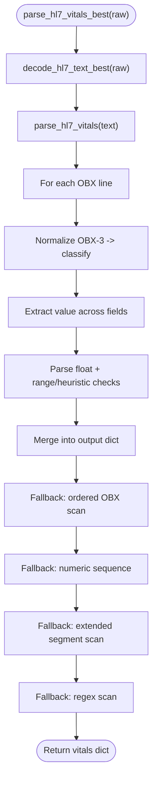
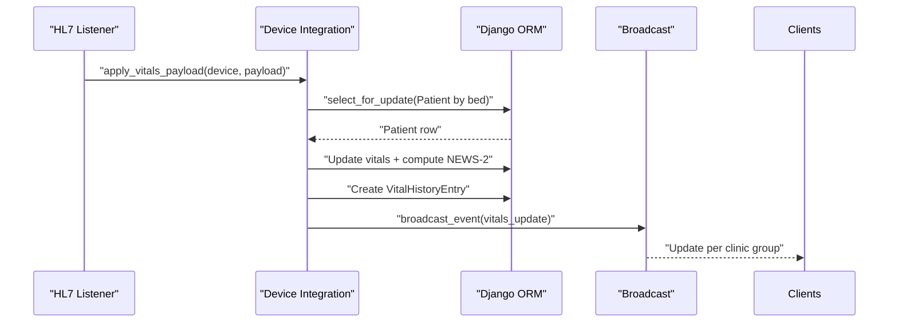
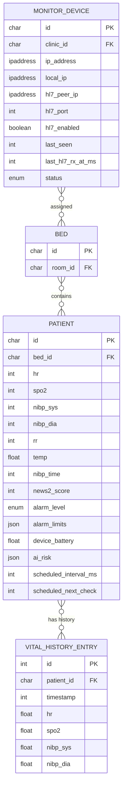
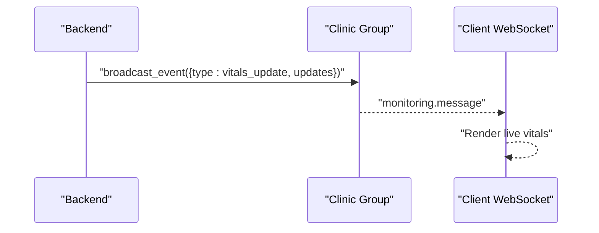
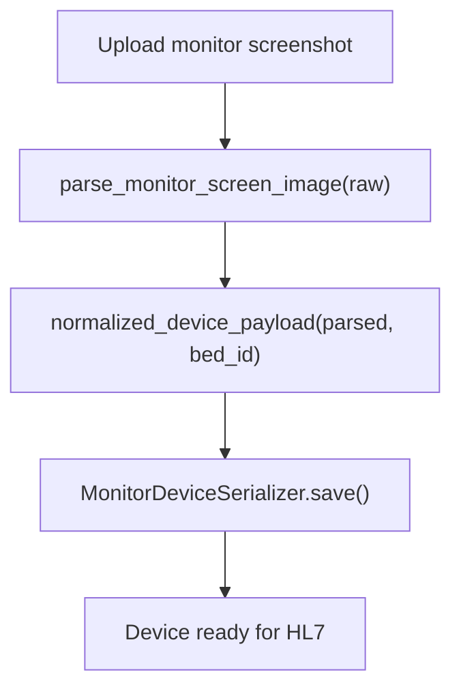
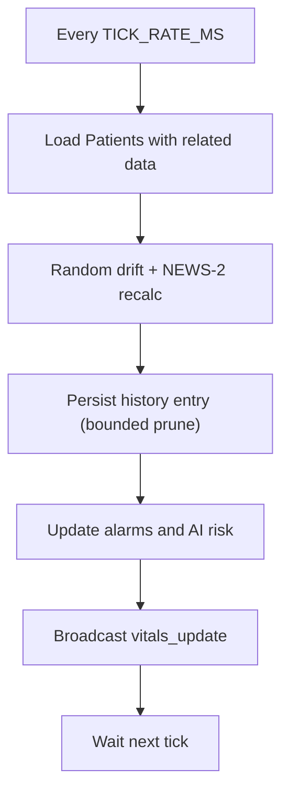
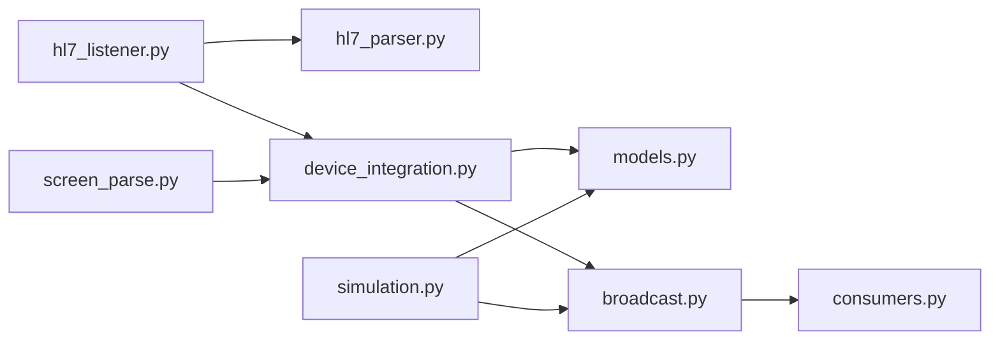

# Data Transformation Pipeline

<cite>
**Referenced Files in This Document**
- [hl7_parser.py](file://backend/monitoring/hl7_parser.py)
- [hl7_listener.py](file://backend/monitoring/hl7_listener.py)
- [device_integration.py](file://backend/monitoring/device_integration.py)
- [models.py](file://backend/monitoring/models.py)
- [broadcast.py](file://backend/monitoring/broadcast.py)
- [consumers.py](file://backend/monitoring/consumers.py)
- [views.py](file://backend/monitoring/views.py)
- [screen_parse.py](file://backend/monitoring/screen_parse.py)
- [hl7_env.py](file://backend/monitoring/hl7_env.py)
- [simulation.py](file://backend/monitoring/simulation.py)
</cite>

## Table of Contents
1. [Introduction](#introduction)
2. [Project Structure](#project-structure)
3. [Core Components](#core-components)
4. [Architecture Overview](#architecture-overview)
5. [Detailed Component Analysis](#detailed-component-analysis)
6. [Dependency Analysis](#dependency-analysis)
7. [Performance Considerations](#performance-considerations)
8. [Troubleshooting Guide](#troubleshooting-guide)
9. [Conclusion](#conclusion)
10. [Appendices](#appendices)

## Introduction
This document describes the end-to-end data transformation pipeline that converts HL7 messages into actionable patient vitals. It covers:
- HL7 message parsing workflow: segment extraction, field validation, and data normalization
- Device integration patterns: mapping parsed data to patient records and vitals tracking
- Validation rules, error handling, and fallback strategies for incomplete or malformed data
- Transformation from raw HL7 segments to structured patient data models
- Examples of common transformation scenarios, edge cases handling, and performance optimization techniques for high-volume data processing

## Project Structure
The monitoring subsystem orchestrates HL7 ingestion, parsing, device resolution, persistence, and real-time broadcasting:
- HL7 listener accepts TCP connections and frames HL7/MLLP payloads
- Parser extracts vitals from OBX and extended segments, with robust fallbacks
- Device integration resolves devices by IP, applies vitals to patient records, and persists history
- Broadcast sends updates to WebSocket clients scoped per clinic
- Optional screen parsing automates device provisioning from monitor screenshots
- Simulation maintains periodic vitals and alarms for demonstration and testing

**Diagram sources**
- [hl7_listener.py:635-755](file://backend/monitoring/hl7_listener.py#L635-L755)
- [hl7_parser.py:423-452](file://backend/monitoring/hl7_parser.py#L423-L452)
- [device_integration.py:129-224](file://backend/monitoring/device_integration.py#L129-L224)
- [models.py:77-224](file://backend/monitoring/models.py#L77-L224)
- [broadcast.py:10-19](file://backend/monitoring/broadcast.py#L10-L19)
- [consumers.py:12-46](file://backend/monitoring/consumers.py#L12-L46)
- [screen_parse.py:58-160](file://backend/monitoring/screen_parse.py#L58-L160)
- [simulation.py:99-290](file://backend/monitoring/simulation.py#L99-L290)

**Section sources**
- [hl7_listener.py:1-755](file://backend/monitoring/hl7_listener.py#L1-L755)
- [hl7_parser.py:1-530](file://backend/monitoring/hl7_parser.py#L1-L530)
- [device_integration.py:1-232](file://backend/monitoring/device_integration.py#L1-L232)
- [models.py:1-224](file://backend/monitoring/models.py#L1-L224)
- [broadcast.py:1-20](file://backend/monitoring/broadcast.py#L1-L20)
- [consumers.py:1-46](file://backend/monitoring/consumers.py#L1-L46)
- [screen_parse.py:1-160](file://backend/monitoring/screen_parse.py#L1-L160)
- [simulation.py:1-290](file://backend/monitoring/simulation.py#L1-L290)

## Core Components
- HL7 Listener: Accepts TCP connections, detects MLLP boundaries, handles handshake and queries, decodes payloads, and dispatches to parser and integrator
- HL7 Parser: Extracts vitals from OBX and extended segments, normalizes values, and applies multiple fallback strategies
- Device Integration: Resolves device by peer IP, validates bed/patient linkage, applies vitals to Patient model, persists history, and broadcasts updates
- Models: Define Patient vitals, device metadata, and history entries
- Broadcast: Sends vitals updates to WebSocket groups per clinic
- Screen Parse: Vision-based provisioning of device configuration from monitor screenshots
- Simulation: Periodic vitals generation and alarm computation for testing and demonstration

**Section sources**
- [hl7_listener.py:426-633](file://backend/monitoring/hl7_listener.py#L426-L633)
- [hl7_parser.py:423-530](file://backend/monitoring/hl7_parser.py#L423-L530)
- [device_integration.py:129-224](file://backend/monitoring/device_integration.py#L129-L224)
- [models.py:77-224](file://backend/monitoring/models.py#L77-L224)
- [broadcast.py:10-19](file://backend/monitoring/broadcast.py#L10-L19)
- [screen_parse.py:58-160](file://backend/monitoring/screen_parse.py#L58-L160)
- [simulation.py:99-290](file://backend/monitoring/simulation.py#L99-L290)

## Architecture Overview
The pipeline transforms raw HL7 bytes into structured patient vitals and streams updates to clients via WebSockets. It supports robust fallbacks and diagnostic controls for heterogeneous monitors.

**Diagram sources**
- [hl7_listener.py:580-633](file://backend/monitoring/hl7_listener.py#L580-L633)
- [hl7_parser.py:487-530](file://backend/monitoring/hl7_parser.py#L487-L530)
- [device_integration.py:129-224](file://backend/monitoring/device_integration.py#L129-L224)
- [broadcast.py:10-19](file://backend/monitoring/broadcast.py#L10-L19)

## Detailed Component Analysis

### HL7 Message Parsing Workflow
The parser extracts vitals from OBX segments and extended segments, normalizes identifiers, validates numeric values, and applies layered fallback strategies to maximize throughput and accuracy.

Key steps:
- Segment filtering: Only process OBX lines; skip header segments
- Identifier normalization: Normalize OBX-3 to standardized tokens
- Classification: Map normalized tokens to vitals (hr, spo2, temp, rr, nibp)
- Value extraction: Locate numeric values across multiple fields with flexible patterns
- Numeric validation: Apply ranges and heuristics to reject outliers
- Fallback strategies:
  - Ordered fallback: scan OBX lines sequentially when OBX-3 is missing
  - Numeric sequence fallback: infer hr/spo2 from ordered numeric sequences
  - Extended segment scan: harvest vitals from OBR/NTE/ST/Z* and pipe-delimited fields
  - Regex fallback: detect NIBP and keywords even when segment fields are malformed
- Text decoding: Try multiple encodings and merge best results

**Diagram sources**
- [hl7_parser.py:423-530](file://backend/monitoring/hl7_parser.py#L423-L530)

**Section sources**
- [hl7_parser.py:19-146](file://backend/monitoring/hl7_parser.py#L19-L146)
- [hl7_parser.py:148-257](file://backend/monitoring/hl7_parser.py#L148-L257)
- [hl7_parser.py:278-407](file://backend/monitoring/hl7_parser.py#L278-L407)
- [hl7_parser.py:423-530](file://backend/monitoring/hl7_parser.py#L423-L530)

### Device Integration and Mapping to Patient Records
Device integration resolves the device by peer IP, validates linkage to a bed and patient, applies vitals to the Patient model, computes NEWS-2 score, persists history, and broadcasts updates.

Highlights:
- Device resolution: Supports peer IP, local IP, configured HL7 peer IP, NAT single-device fallback
- Validation: Requires device to have a bed; requires a patient to be admitted to that bed
- Atomic update: Uses select_for_update to avoid race conditions
- History pruning: Limits history entries to a fixed window
- Broadcasting: Sends vitals_update events scoped to the clinic’s WebSocket group

**Diagram sources**
- [device_integration.py:129-224](file://backend/monitoring/device_integration.py#L129-L224)
- [broadcast.py:10-19](file://backend/monitoring/broadcast.py#L10-L19)

**Section sources**
- [device_integration.py:31-78](file://backend/monitoring/device_integration.py#L31-L78)
- [device_integration.py:129-224](file://backend/monitoring/device_integration.py#L129-L224)
- [models.py:141-183](file://backend/monitoring/models.py#L141-L183)
- [models.py:214-224](file://backend/monitoring/models.py#L214-L224)

### Data Models for Vitals Tracking
The Patient model stores current vitals and related metadata. History entries capture time-series for trend analysis. MonitorDevice tracks device identity and connectivity.

**Diagram sources**
- [models.py:77-139](file://backend/monitoring/models.py#L77-L139)
- [models.py:141-183](file://backend/monitoring/models.py#L141-L183)
- [models.py:214-224](file://backend/monitoring/models.py#L214-L224)

**Section sources**
- [models.py:77-183](file://backend/monitoring/models.py#L77-L183)
- [models.py:214-224](file://backend/monitoring/models.py#L214-L224)

### Real-Time Broadcasting and Client Interaction
WebSocket consumers authenticate users, join clinic-specific groups, and receive vitals_update events. The broadcast module routes updates to the correct group.

**Diagram sources**
- [broadcast.py:10-19](file://backend/monitoring/broadcast.py#L10-L19)
- [consumers.py:35-36](file://backend/monitoring/consumers.py#L35-L36)

**Section sources**
- [broadcast.py:10-19](file://backend/monitoring/broadcast.py#L10-L19)
- [consumers.py:12-46](file://backend/monitoring/consumers.py#L12-L46)

### Provisioning Devices from Screenshots
Optional screen parsing uses Gemini Vision to extract HL7 configuration from monitor screenshots and normalize it into a device creation payload.

**Diagram sources**
- [screen_parse.py:58-160](file://backend/monitoring/screen_parse.py#L58-L160)
- [views.py:320-364](file://backend/monitoring/views.py#L320-L364)

**Section sources**
- [screen_parse.py:58-160](file://backend/monitoring/screen_parse.py#L58-L160)
- [views.py:320-364](file://backend/monitoring/views.py#L320-L364)

### Simulation and Periodic Updates
The simulation thread periodically updates vitals, computes NEWS-2 scores, manages alarms, and writes history entries. It also prunes history to a bounded size.

**Diagram sources**
- [simulation.py:99-290](file://backend/monitoring/simulation.py#L99-L290)

**Section sources**
- [simulation.py:99-290](file://backend/monitoring/simulation.py#L99-L290)

## Dependency Analysis
The pipeline exhibits clear layering:
- Ingestion depends on networking and environment controls
- Parsing is stateless and pure-functional
- Integration depends on models and broadcast
- Broadcasting depends on Channels and clinic scoping
- Provisioning is optional and independent
- Simulation is autonomous and orthogonal

**Diagram sources**
- [hl7_listener.py:580-633](file://backend/monitoring/hl7_listener.py#L580-L633)
- [hl7_parser.py:487-530](file://backend/monitoring/hl7_parser.py#L487-L530)
- [device_integration.py:129-224](file://backend/monitoring/device_integration.py#L129-L224)
- [models.py:77-224](file://backend/monitoring/models.py#L77-L224)
- [broadcast.py:10-19](file://backend/monitoring/broadcast.py#L10-L19)
- [consumers.py:12-46](file://backend/monitoring/consumers.py#L12-L46)
- [screen_parse.py:58-160](file://backend/monitoring/screen_parse.py#L58-L160)
- [simulation.py:99-290](file://backend/monitoring/simulation.py#L99-L290)

**Section sources**
- [hl7_listener.py:635-755](file://backend/monitoring/hl7_listener.py#L635-L755)
- [hl7_parser.py:423-530](file://backend/monitoring/hl7_parser.py#L423-L530)
- [device_integration.py:129-224](file://backend/monitoring/device_integration.py#L129-L224)
- [models.py:77-224](file://backend/monitoring/models.py#L77-L224)
- [broadcast.py:10-19](file://backend/monitoring/broadcast.py#L10-L19)
- [consumers.py:12-46](file://backend/monitoring/consumers.py#L12-L46)
- [screen_parse.py:58-160](file://backend/monitoring/screen_parse.py#L58-L160)
- [simulation.py:99-290](file://backend/monitoring/simulation.py#L99-L290)

## Performance Considerations
- Concurrency and threading: The HL7 listener runs a dedicated thread per connection and uses timeouts to prevent blocking
- Decoding efficiency: The parser tries multiple encodings and merges best results to minimize retries
- History pruning: Automatic deletion of older history entries keeps storage bounded
- Atomic updates: select_for_update prevents race conditions under concurrent updates
- Broadcasting scope: Grouped channels reduce unnecessary fan-out
- Simulation cadence: Configurable tick rate balances fidelity and load

[No sources needed since this section provides general guidance]

## Troubleshooting Guide
Common issues and diagnostics:
- No HL7 packets received: Verify server listen enablement, port acceptance, and firewall rules; use connection-check endpoint for hints
- Zero-byte sessions: Indicates monitor not sending HL7 or handshake misconfiguration; adjust HL7 connect handshake setting
- Missing device or patient linkage: Ensure device is assigned to a bed and a patient is admitted to that bed
- Encoding problems: The parser attempts multiple encodings; confirm monitor’s character set alignment
- Diagnostic logs: Enable HL7 debug flags to inspect raw TCP and decoded payloads

Operational endpoints and utilities:
- Connection check: Inspect HL7 listener status, last seen timestamps, and warnings
- Infrastructure view: Retrieve diagnostic summaries and listener status for superusers
- Environment controls: Toggle raw logging and diagnostic flags via environment variables

**Section sources**
- [views.py:59-314](file://backend/monitoring/views.py#L59-L314)
- [views.py:367-413](file://backend/monitoring/views.py#L367-L413)
- [hl7_env.py:18-32](file://backend/monitoring/hl7_env.py#L18-L32)
- [hl7_listener.py:520-541](file://backend/monitoring/hl7_listener.py#L520-L541)

## Conclusion
The pipeline robustly transforms HL7 vitals into actionable patient insights. Its layered design separates ingestion, parsing, integration, and broadcasting, enabling resilience through multiple fallback strategies, strong validation, and real-time streaming. The optional provisioning and simulation capabilities further streamline device onboarding and testing.

[No sources needed since this section summarizes without analyzing specific files]

## Appendices

### Data Validation Rules and Normalization
- OBX-3 classification: Normalize identifiers to standardized tokens and map to vitals categories
- Numeric validation: Enforce physiological ranges; use heuristics when category is ambiguous
- Encoding detection: Attempt UTF-8, UTF-16 variants, CP1251, Latin-1, and GBK; merge best results
- Segment filtering: Skip header segments to avoid mixing timestamps/IDs with vitals

**Section sources**
- [hl7_parser.py:19-146](file://backend/monitoring/hl7_parser.py#L19-L146)
- [hl7_parser.py:455-530](file://backend/monitoring/hl7_parser.py#L455-L530)

### Fallback Strategies Summary
- Ordered OBX scan: Infer vitals by position when OBX-3 is missing
- Numeric sequence fallback: Deduce hr/spo2 from numeric sequences with strict ranges
- Extended segment scan: Harvest vitals from OBR/NTE/ST/Z* and pipe-delimited fields
- Regex fallback: Detect NIBP and keywords even when segment fields are malformed

**Section sources**
- [hl7_parser.py:148-257](file://backend/monitoring/hl7_parser.py#L148-L257)
- [hl7_parser.py:278-407](file://backend/monitoring/hl7_parser.py#L278-L407)

### Device Resolution Patterns
- Peer IP matching: Match against device IP, local IP, or configured HL7 peer IP
- NAT single-device fallback: Auto-bind a single enabled device when environment allows
- Loopback filtering: Exclude loopback addresses unless explicitly allowed for diagnostics

**Section sources**
- [device_integration.py:31-78](file://backend/monitoring/device_integration.py#L31-L78)

### Example Transformation Scenarios
- Standard OBX-based vitals: Extract hr, spo2, temp, rr, and NIBP from OBX segments
- OEM variant with extended segments: Scan OBR/NTE/ST/Z* for vitals when OBX-3 is missing
- Mixed encoding: Decode with best-effort merging across encodings
- Incomplete data: Apply numeric sequence and regex fallbacks to salvage usable vitals

**Section sources**
- [hl7_parser.py:423-530](file://backend/monitoring/hl7_parser.py#L423-L530)
- [hl7_listener.py:580-633](file://backend/monitoring/hl7_listener.py#L580-L633)