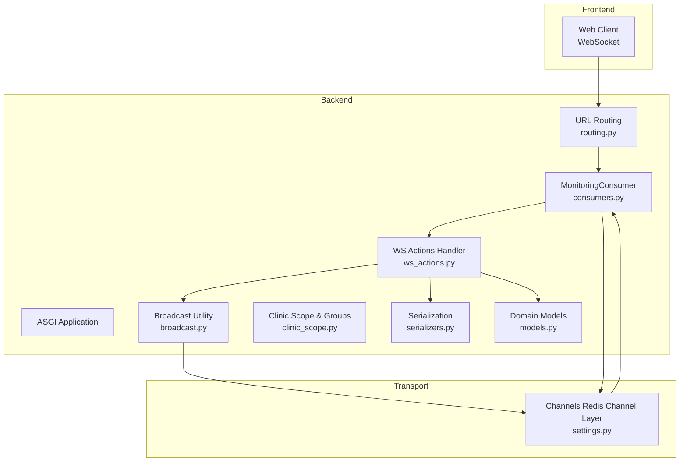
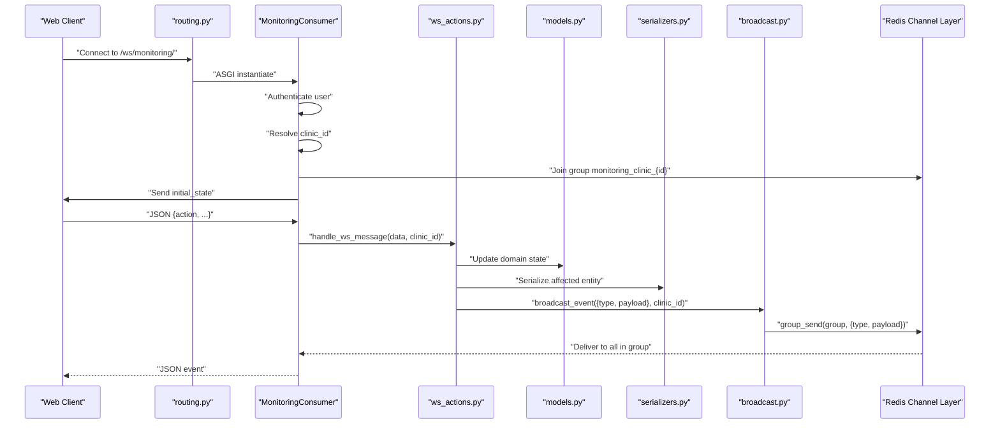
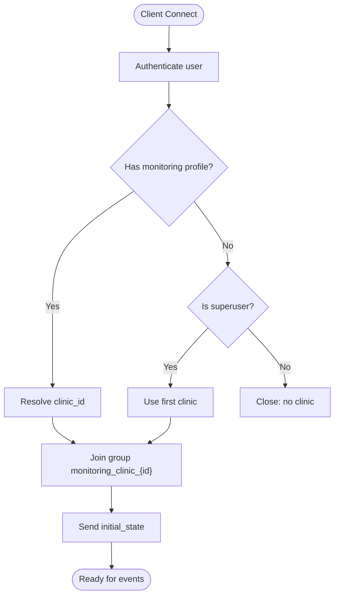
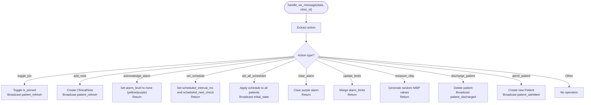
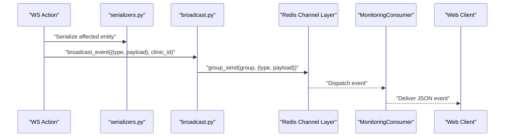
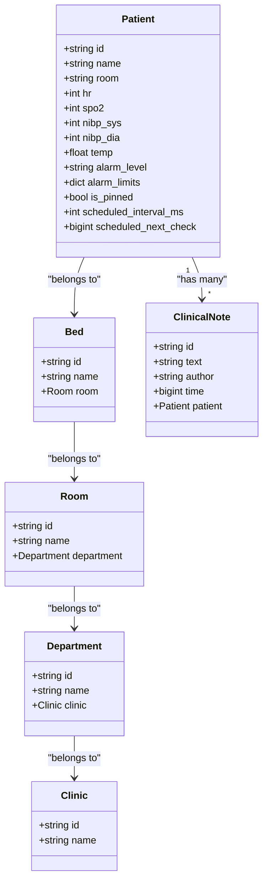
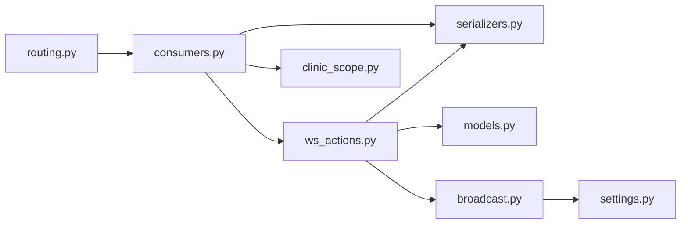

# Event-driven Architecture

<cite>
**Referenced Files in This Document**
- [settings.py](file://backend/medicentral/settings.py)
- [routing.py](file://backend/monitoring/routing.py)
- [consumers.py](file://backend/monitoring/consumers.py)
- [broadcast.py](file://backend/monitoring/broadcast.py)
- [ws_actions.py](file://backend/monitoring/ws_actions.py)
- [clinic_scope.py](file://backend/monitoring/clinic_scope.py)
- [serializers.py](file://backend/monitoring/serializers.py)
- [models.py](file://backend/monitoring/models.py)
- [views.py](file://backend/monitoring/views.py)
- [urls.py](file://backend/monitoring/urls.py)
</cite>

## Table of Contents
1. [Introduction](#introduction)
2. [Project Structure](#project-structure)
3. [Core Components](#core-components)
4. [Architecture Overview](#architecture-overview)
5. [Detailed Component Analysis](#detailed-component-analysis)
6. [Dependency Analysis](#dependency-analysis)
7. [Performance Considerations](#performance-considerations)
8. [Troubleshooting Guide](#troubleshooting-guide)
9. [Conclusion](#conclusion)
10. [Appendices](#appendices)

## Introduction
This document explains the event-driven architecture powering real-time updates and notifications in the monitoring system. It covers:
- Event broadcasting via Channels Redis Channel Layer for decoupled communication
- Event types, message formats, and subscription patterns per clinic
- WebSocket actions for client requests and coordinated system responses
- Event sourcing patterns, ordering guarantees, and fault tolerance
- Examples of event flows, debugging, and scaling strategies

## Project Structure
The event-driven stack centers around Django Channels with a Redis-backed Channel Layer. Web clients connect via WebSocket to receive per-clinic events. Backend components publish events to Channels groups, which fan out to all subscribed connections.

**Diagram sources**
- [routing.py:1-8](file://backend/monitoring/routing.py#L1-L8)
- [consumers.py:1-46](file://backend/monitoring/consumers.py#L1-L46)
- [ws_actions.py:1-229](file://backend/monitoring/ws_actions.py#L1-L229)
- [broadcast.py:1-20](file://backend/monitoring/broadcast.py#L1-L20)
- [clinic_scope.py:1-30](file://backend/monitoring/clinic_scope.py#L1-L30)
- [serializers.py:1-294](file://backend/monitoring/serializers.py#L1-L294)
- [models.py:1-224](file://backend/monitoring/models.py#L1-L224)
- [settings.py:170-183](file://backend/medicentral/settings.py#L170-L183)

**Section sources**
- [routing.py:1-8](file://backend/monitoring/routing.py#L1-L8)
- [settings.py:170-183](file://backend/medicentral/settings.py#L170-L183)

## Core Components
- Channels Redis Channel Layer: Provides durable, distributed pub/sub for WebSocket groups.
- MonitoringConsumer: Authenticates users, assigns them to clinic-specific groups, streams initial state, and forwards inbound messages.
- WS Actions: Parses and executes client actions, updates domain models, and publishes events.
- Broadcast Utility: Sends JSON payloads to a per-clinic group.
- Clinic Scope: Derives group names and enforces per-clinic access.
- Serializers: Normalize domain objects to JSON for initial state and refresh events.
- Domain Models: Define the state and constraints updated by actions.

**Section sources**
- [settings.py:170-183](file://backend/medicentral/settings.py#L170-L183)
- [consumers.py:12-46](file://backend/monitoring/consumers.py#L12-L46)
- [ws_actions.py:31-229](file://backend/monitoring/ws_actions.py#L31-L229)
- [broadcast.py:10-20](file://backend/monitoring/broadcast.py#L10-L20)
- [clinic_scope.py:11-30](file://backend/monitoring/clinic_scope.py#L11-L30)
- [serializers.py:13-97](file://backend/monitoring/serializers.py#L13-L97)
- [models.py:141-224](file://backend/monitoring/models.py#L141-L224)

## Architecture Overview
The system uses a publish-subscribe pattern:
- Clients connect to a WebSocket endpoint and are placed into a per-clinic group.
- Backend components publish events to the group; Channels delivers them to all subscribers.
- WS actions encapsulate all write-side logic and emit read-side events.

**Diagram sources**
- [routing.py:5-7](file://backend/monitoring/routing.py#L5-L7)
- [consumers.py:13-45](file://backend/monitoring/consumers.py#L13-L45)
- [ws_actions.py:32-229](file://backend/monitoring/ws_actions.py#L32-L229)
- [broadcast.py:10-20](file://backend/monitoring/broadcast.py#L10-L20)
- [serializers.py:13-97](file://backend/monitoring/serializers.py#L13-L97)
- [settings.py:170-183](file://backend/medicentral/settings.py#L170-L183)

## Detailed Component Analysis

### Event Types and Message Formats
Events are JSON objects sent to clients under the group. Two primary event shapes are used:

- Initial state event
  - type: "initial_state"
  - patients: array of serialized patient objects
  - Sent after successful connection to seed clients with current state

- Patient refresh event
  - type: "patient_refresh"
  - patient: serialized patient object
  - Emitted after actions that modify a single patient’s data

- Discharge and admit events
  - type: "patient_discharged"
  - patientId: string
  - type: "patient_admitted"
  - patient: serialized patient object

These formats are produced by serializers and broadcast via the utility.

**Section sources**
- [consumers.py:26-29](file://backend/monitoring/consumers.py#L26-L29)
- [ws_actions.py:43-46](file://backend/monitoring/ws_actions.py#L43-L46)
- [ws_actions.py:172-175](file://backend/monitoring/ws_actions.py#L172-L175)
- [ws_actions.py:222-225](file://backend/monitoring/ws_actions.py#L222-L225)
- [serializers.py:13-97](file://backend/monitoring/serializers.py#L13-L97)

### Subscription Patterns and Group Names
- Group naming: monitoring_clinic_{clinic_id}
- Authentication and scoping: Only authenticated users linked to a clinic join the group
- Initial state delivery: On connect, the consumer sends a snapshot of all patients for that clinic

**Diagram sources**
- [consumers.py:13-29](file://backend/monitoring/consumers.py#L13-L29)
- [clinic_scope.py:15-23](file://backend/monitoring/clinic_scope.py#L15-L23)

**Section sources**
- [consumers.py:13-29](file://backend/monitoring/consumers.py#L13-L29)
- [clinic_scope.py:11-23](file://backend/monitoring/clinic_scope.py#L11-L23)

### WebSocket Actions Implementation
The WS handler parses incoming messages and executes atomic operations against the database, then emits events. Key actions include toggling pinned status, adding clinical notes, acknowledging/clearing alarms, scheduling checks, measuring NIBP, discharging, and admitting patients.

**Diagram sources**
- [ws_actions.py:32-229](file://backend/monitoring/ws_actions.py#L32-L229)

**Section sources**
- [ws_actions.py:31-229](file://backend/monitoring/ws_actions.py#L31-L229)

### Broadcasting and Delivery Guarantees
- Broadcast target: per-clinic group derived from clinic_id
- Delivery mechanism: Channels Redis Channel Layer ensures delivery to all members of the group
- Ordering: Within a single process, group_send is synchronous; however, multi-instance deployments rely on Redis pub/sub semantics and Channels’ group delivery model

**Diagram sources**
- [ws_actions.py:43-46](file://backend/monitoring/ws_actions.py#L43-L46)
- [broadcast.py:10-20](file://backend/monitoring/broadcast.py#L10-L20)
- [serializers.py:13-97](file://backend/monitoring/serializers.py#L13-L97)

**Section sources**
- [broadcast.py:10-20](file://backend/monitoring/broadcast.py#L10-L20)
- [settings.py:170-183](file://backend/medicentral/settings.py#L170-L183)

### Event Sourcing and Ordering Guarantees
- Current design: The system persists state changes to the database and emits read-side events. There is no dedicated event log storage in the reviewed files.
- Ordering: Client-visible ordering follows the sequence of WS actions processed by the backend instance. Across instances, ordering is preserved per-clinic group due to Channels group semantics.
- Fault tolerance: Redis-backed Channel Layer provides resilience against transient failures; Channels handles reconnection and group membership.

[No sources needed since this section synthesizes observed behavior without quoting specific code]

### Data Models Involved in Events
The following models are updated by WS actions and serialized for events:

**Diagram sources**
- [models.py:5-224](file://backend/monitoring/models.py#L5-L224)

**Section sources**
- [models.py:141-224](file://backend/monitoring/models.py#L141-L224)

## Dependency Analysis
- Routing depends on the consumer class
- Consumer depends on clinic scope, serializers, and WS actions
- WS actions depend on models, serializers, and broadcast utility
- Broadcast utility depends on Channels layer and clinic scope
- Settings configure the Channel Layer backend

**Diagram sources**
- [routing.py:5-7](file://backend/monitoring/routing.py#L5-L7)
- [consumers.py:8-9](file://backend/monitoring/consumers.py#L8-L9)
- [ws_actions.py:12-15](file://backend/monitoring/ws_actions.py#L12-L15)
- [broadcast.py:7](file://backend/monitoring/broadcast.py#L7)
- [settings.py:170-183](file://backend/medicentral/settings.py#L170-L183)
- [clinic_scope.py:7](file://backend/monitoring/clinic_scope.py#L7)
- [serializers.py:8](file://backend/monitoring/serializers.py#L8)

**Section sources**
- [routing.py:5-7](file://backend/monitoring/routing.py#L5-L7)
- [consumers.py:8-9](file://backend/monitoring/consumers.py#L8-L9)
- [ws_actions.py:12-15](file://backend/monitoring/ws_actions.py#L12-L15)
- [broadcast.py:7](file://backend/monitoring/broadcast.py#L7)
- [settings.py:170-183](file://backend/medicentral/settings.py#L170-L183)
- [clinic_scope.py:7](file://backend/monitoring/clinic_scope.py#L7)
- [serializers.py:8](file://backend/monitoring/serializers.py#L8)

## Performance Considerations
- Scale out with multiple Channels workers behind a single Redis instance
- Keep event payloads compact; serialize only necessary fields
- Use database transactions for actions to minimize contention
- Batch updates where feasible (e.g., set_all_schedules)
- Tune Redis memory and network settings for high message rates
- Monitor Channels queue sizes and Redis pub/sub traffic

[No sources needed since this section provides general guidance]

## Troubleshooting Guide
Common issues and remedies:
- Client receives no events
  - Verify WebSocket connection accepted and group join succeeded
  - Confirm clinic_id resolved and group name matches expected pattern
  - Check that broadcast is invoked with the correct clinic_id
- Events arrive out of order
  - Expect per-clinic ordering; cross-clinic events are independent
  - Ensure single writer per logical event stream
- Redis connectivity errors
  - Validate REDIS_URL in environment and network access
  - Confirm Channels Redis backend configuration
- Authentication failures
  - Ensure user is authenticated and linked to a clinic profile

Operational endpoints and helpers:
- WebSocket endpoint: /ws/monitoring/
- REST endpoints for diagnostics and device ingestion are available for operational checks

**Section sources**
- [consumers.py:13-29](file://backend/monitoring/consumers.py#L13-L29)
- [broadcast.py:10-20](file://backend/monitoring/broadcast.py#L10-L20)
- [settings.py:170-183](file://backend/medicentral/settings.py#L170-L183)
- [views.py:416-447](file://backend/monitoring/views.py#L416-L447)
- [urls.py:12-23](file://backend/monitoring/urls.py#L12-L23)

## Conclusion
The system employs a clean, decoupled event-driven design:
- WebSocket consumers subscribe to per-clinic groups
- WS actions encapsulate all write operations and emit read-side events
- Redis-backed Channels provide reliable, scalable pub/sub delivery
- Serialization ensures consistent event payloads
- The architecture supports multi-instance deployments and maintains per-clinic ordering guarantees

[No sources needed since this section summarizes without analyzing specific files]

## Appendices

### Example Event Flow Scenarios
- Toggle pin on a patient
  - Client sends action toggle_pin with patientId
  - Backend toggles is_pinned, re-fetches the patient, serializes it, and broadcasts patient_refresh
- Admit a new patient
  - Client sends action admit_patient with admission details
  - Backend creates a new Patient record and broadcasts patient_admitted
- Bulk schedule update
  - Client sends action set_all_schedules with intervalMs
  - Backend updates all patients and broadcasts initial_state

**Section sources**
- [ws_actions.py:34-47](file://backend/monitoring/ws_actions.py#L34-L47)
- [ws_actions.py:178-226](file://backend/monitoring/ws_actions.py#L178-L226)
- [ws_actions.py:104-127](file://backend/monitoring/ws_actions.py#L104-L127)