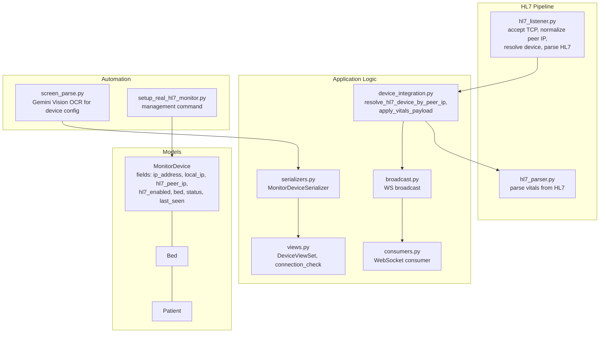
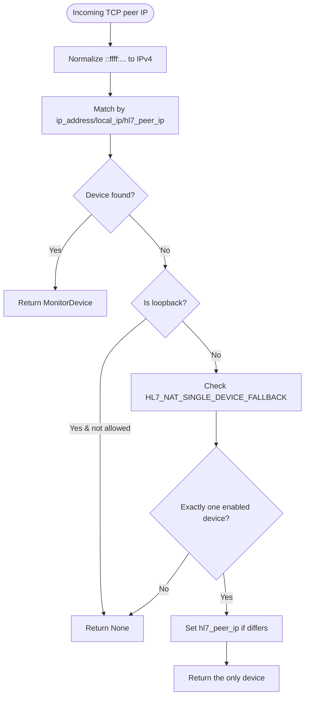
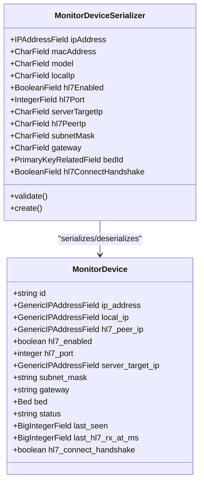
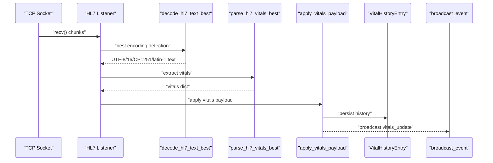
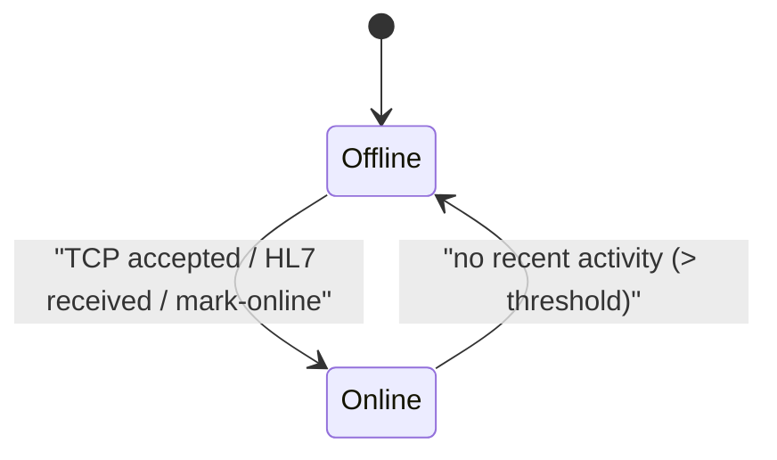
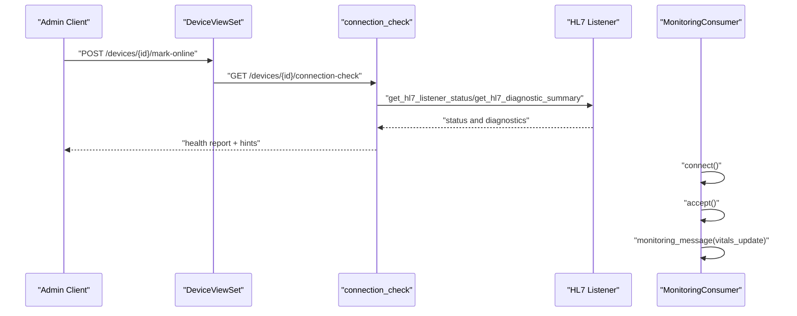
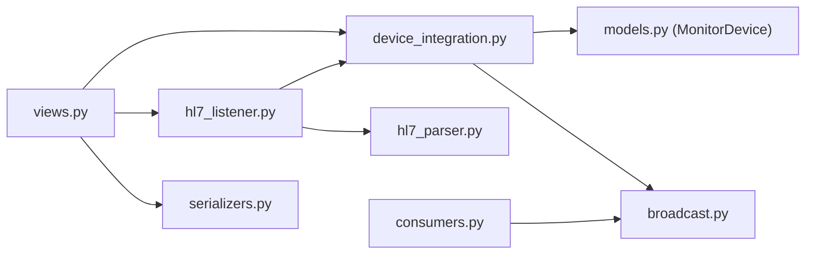

# Device Discovery and Registration

<cite>
**Referenced Files in This Document**
- [models.py](file://backend/monitoring/models.py)
- [device_integration.py](file://backend/monitoring/device_integration.py)
- [hl7_listener.py](file://backend/monitoring/hl7_listener.py)
- [hl7_parser.py](file://backend/monitoring/hl7_parser.py)
- [serializers.py](file://backend/monitoring/serializers.py)
- [views.py](file://backend/monitoring/views.py)
- [broadcast.py](file://backend/monitoring/broadcast.py)
- [consumers.py](file://backend/monitoring/consumers.py)
- [screen_parse.py](file://backend/monitoring/screen_parse.py)
- [setup_real_hl7_monitor.py](file://backend/monitoring/management/commands/setup_real_hl7_monitor.py)
</cite>

## Table of Contents
1. [Introduction](#introduction)
2. [Project Structure](#project-structure)
3. [Core Components](#core-components)
4. [Architecture Overview](#architecture-overview)
5. [Detailed Component Analysis](#detailed-component-analysis)
6. [Dependency Analysis](#dependency-analysis)
7. [Performance Considerations](#performance-considerations)
8. [Troubleshooting Guide](#troubleshooting-guide)
9. [Conclusion](#conclusion)
10. [Appendices](#appendices)

## Introduction
This document explains the device discovery and registration system for integrating medical equipment into the monitoring platform. It covers how devices are discovered via HL7/MLLP connections, how IP address resolution works (including IPv4-mapped IPv6 and NAT traversal), and how device registration enables/disables HL7 communication per device. It also documents bed-to-device associations, integration with the monitoring system (device status tracking and online/offline state management), examples of device configuration, troubleshooting connection issues, managing multiple device types, and security considerations for device authentication and access control.

## Project Structure
The device integration spans several modules:
- Data model for devices and associated entities
- HL7 listener and parser
- Device lookup and vitals ingestion
- REST API for device management and diagnostics
- WebSocket consumer for live updates
- Optional screen parsing for automated device configuration
- Management command for setting up a real HL7 monitor



**Diagram sources**
- [models.py:77-138](file://backend/monitoring/models.py#L77-L138)
- [hl7_listener.py:426-578](file://backend/monitoring/hl7_listener.py#L426-L578)
- [hl7_parser.py:423-530](file://backend/monitoring/hl7_parser.py#L423-L530)
- [device_integration.py:31-78](file://backend/monitoring/device_integration.py#L31-L78)
- [serializers.py:146-284](file://backend/monitoring/serializers.py#L146-L284)
- [views.py:47-100](file://backend/monitoring/views.py#L47-L100)
- [broadcast.py:10-20](file://backend/monitoring/broadcast.py#L10-L20)
- [consumers.py:12-46](file://backend/monitoring/consumers.py#L12-L46)
- [screen_parse.py:58-160](file://backend/monitoring/screen_parse.py#L58-L160)
- [setup_real_hl7_monitor.py:29-224](file://backend/monitoring/management/commands/setup_real_hl7_monitor.py#L29-L224)

**Section sources**
- [models.py:77-138](file://backend/monitoring/models.py#L77-L138)
- [hl7_listener.py:426-578](file://backend/monitoring/hl7_listener.py#L426-L578)
- [device_integration.py:31-78](file://backend/monitoring/device_integration.py#L31-L78)
- [serializers.py:146-284](file://backend/monitoring/serializers.py#L146-L284)
- [views.py:47-100](file://backend/monitoring/views.py#L47-L100)
- [broadcast.py:10-20](file://backend/monitoring/broadcast.py#L10-L20)
- [consumers.py:12-46](file://backend/monitoring/consumers.py#L12-L46)
- [screen_parse.py:58-160](file://backend/monitoring/screen_parse.py#L58-L160)
- [setup_real_hl7_monitor.py:29-224](file://backend/monitoring/management/commands/setup_real_hl7_monitor.py#L29-L224)

## Core Components
- MonitorDevice model stores device identity, networking fields, HL7 configuration, and status.
- HL7 listener accepts TCP connections, normalizes peer IPs, resolves devices, parses HL7 messages, and applies vitals.
- Device integration utilities resolve devices by peer IP (with NAT fallback), apply vitals payloads, and update device status.
- REST API exposes device CRUD, connection checks, and vitals ingestion endpoints.
- WebSocket consumer authenticates users, scopes to clinic, and streams vitals updates.
- Screen parsing automates device configuration from monitor screenshots.
- Management command sets up a real HL7 monitor with a bed and patient for testing.

**Section sources**
- [models.py:77-138](file://backend/monitoring/models.py#L77-L138)
- [hl7_listener.py:426-578](file://backend/monitoring/hl7_listener.py#L426-L578)
- [device_integration.py:31-78](file://backend/monitoring/device_integration.py#L31-L78)
- [views.py:47-100](file://backend/monitoring/views.py#L47-L100)
- [consumers.py:12-46](file://backend/monitoring/consumers.py#L12-L46)
- [screen_parse.py:58-160](file://backend/monitoring/screen_parse.py#L58-L160)
- [setup_real_hl7_monitor.py:29-224](file://backend/monitoring/management/commands/setup_real_hl7_monitor.py#L29-L224)

## Architecture Overview
The system integrates devices through two primary paths:
- HL7/MLLP: Devices initiate TCP connections to the server; the listener resolves the device by peer IP, optionally sends handshake/queries, parses HL7, and applies vitals.
- REST: Administrators can ingest vitals directly by IP for devices configured without HL7.

```mermaid
sequenceDiagram
participant Dev as "Medical Device"
participant HL7 as "HL7 Listener"
participant Res as "resolve_hl7_device_by_peer_ip"
participant Par as "hl7_parser.parse_hl7_vitals_best"
participant App as "apply_vitals_payload"
participant WS as "broadcast_event"
Dev->>HL7 : "TCP connect (peer IP)"
HL7->>Res : "peer_ip, allow_nat_loopback=True"
Res-->>HL7 : "MonitorDevice or None"
HL7->>Par : "decode and parse HL7"
Par-->>HL7 : "vitals dict"
HL7->>App : "apply vitals payload"
App-->>WS : "broadcast vitals_update"
WS-->>Clients : "WebSocket update"
```

**Diagram sources**
- [hl7_listener.py:426-578](file://backend/monitoring/hl7_listener.py#L426-L578)
- [device_integration.py:31-78](file://backend/monitoring/device_integration.py#L31-L78)
- [hl7_parser.py:487-530](file://backend/monitoring/hl7_parser.py#L487-L530)
- [broadcast.py:10-20](file://backend/monitoring/broadcast.py#L10-L20)

## Detailed Component Analysis

### Device Discovery and IP Resolution
- IPv4-mapped IPv6 normalization: The listener converts ::ffff:a.b.c.d to a.b.c.d for comparison against stored IPv4 addresses.
- Peer IP resolution: Devices are matched by ip_address, local_ip, or hl7_peer_ip. Loopback peers are ignored unless explicitly allowed for local diagnostics.
- NAT traversal: When a single HL7-enabled device exists, the resolver can auto-fill hl7_peer_ip based on the observed peer IP, enabling NAT scenarios.



**Diagram sources**
- [hl7_listener.py:73-80](file://backend/monitoring/hl7_listener.py#L73-L80)
- [device_integration.py:31-78](file://backend/monitoring/device_integration.py#L31-L78)

**Section sources**
- [hl7_listener.py:73-80](file://backend/monitoring/hl7_listener.py#L73-L80)
- [device_integration.py:31-78](file://backend/monitoring/device_integration.py#L31-L78)

### Device Registration and Configuration
- REST serializer validates and normalizes optional IP fields, enforces uniqueness constraint by clinic and ip_address, and creates devices with defaults including hl7_connect_handshake set to True by default.
- Screen parsing uses Gemini Vision to extract device configuration from monitor screenshots and produces a normalized payload for device creation.
- Management command sets up a real HL7 monitor (e.g., K12) with a clinic, department, room, bed, and patient, and writes recommended monitor settings to stdout.



**Diagram sources**
- [models.py:77-138](file://backend/monitoring/models.py#L77-L138)
- [serializers.py:146-284](file://backend/monitoring/serializers.py#L146-L284)

**Section sources**
- [serializers.py:146-284](file://backend/monitoring/serializers.py#L146-L284)
- [screen_parse.py:58-160](file://backend/monitoring/screen_parse.py#L58-L160)
- [setup_real_hl7_monitor.py:29-224](file://backend/monitoring/management/commands/setup_real_hl7_monitor.py#L29-L224)

### HL7 Parsing and Vitals Application
- The HL7 listener decodes raw bytes using multiple encodings, extracts MSH segments, and optionally sends ACK responses.
- The parser identifies HR, SpO2, RR, Temp, and NIBP values from OBX/OBR/NTE/ST/Z* segments and fallbacks, merging best-effort results.
- On successful vitals extraction, the system updates device status to online, persists vitals, maintains history, and broadcasts updates to clients.



**Diagram sources**
- [hl7_listener.py:580-634](file://backend/monitoring/hl7_listener.py#L580-L634)
- [hl7_parser.py:487-530](file://backend/monitoring/hl7_parser.py#L487-L530)
- [device_integration.py:129-224](file://backend/monitoring/device_integration.py#L129-L224)
- [broadcast.py:10-20](file://backend/monitoring/broadcast.py#L10-L20)

**Section sources**
- [hl7_listener.py:580-634](file://backend/monitoring/hl7_listener.py#L580-L634)
- [hl7_parser.py:423-530](file://backend/monitoring/hl7_parser.py#L423-L530)
- [device_integration.py:129-224](file://backend/monitoring/device_integration.py#L129-L224)
- [broadcast.py:10-20](file://backend/monitoring/broadcast.py#L10-L20)

### Device Status Tracking and Online/Offline Management
- TCP acceptance immediately marks a device online (if resolved) to reflect connectivity.
- Device status is OFFLINE by default and transitions to ONLINE upon HL7 reception or explicit REST marking.
- The connection-check endpoint aggregates HL7 listener status, last seen timestamps, and diagnostic counters to determine health and timeout conditions.



**Diagram sources**
- [hl7_listener.py:416-424](file://backend/monitoring/hl7_listener.py#L416-L424)
- [device_integration.py:227-232](file://backend/monitoring/device_integration.py#L227-L232)
- [views.py:59-100](file://backend/monitoring/views.py#L59-L100)

**Section sources**
- [hl7_listener.py:416-424](file://backend/monitoring/hl7_listener.py#L416-L424)
- [device_integration.py:227-232](file://backend/monitoring/device_integration.py#L227-L232)
- [views.py:59-100](file://backend/monitoring/views.py#L59-L100)

### REST and WebSocket Integration
- REST endpoints:
  - DeviceViewSet supports CRUD and a dedicated action to mark a device online.
  - Connection-check returns diagnostics, warnings, and hints for troubleshooting.
  - Vitals ingestion endpoint accepts REST vitals for a given device IP.
- WebSocket consumer:
  - Authenticates users, scopes to clinic, joins a clinic-specific group, and streams initial state and subsequent vitals updates.



**Diagram sources**
- [views.py:47-100](file://backend/monitoring/views.py#L47-L100)
- [views.py:29-30](file://backend/monitoring/views.py#L29-L30)
- [consumers.py:12-46](file://backend/monitoring/consumers.py#L12-L46)

**Section sources**
- [views.py:47-100](file://backend/monitoring/views.py#L47-L100)
- [views.py:29-30](file://backend/monitoring/views.py#L29-L30)
- [consumers.py:12-46](file://backend/monitoring/consumers.py#L12-L46)

### Managing Multiple Device Types
- The parser supports diverse segment formats and vendor-specific variations (e.g., OBR/NTE/ST/Z*), and uses heuristics to recover vitals when structured fields are missing.
- The management command demonstrates setting up a K12 monitor with recommended configurations and NAT peer IP handling.

**Section sources**
- [hl7_parser.py:423-530](file://backend/monitoring/hl7_parser.py#L423-L530)
- [setup_real_hl7_monitor.py:29-224](file://backend/monitoring/management/commands/setup_real_hl7_monitor.py#L29-L224)

## Dependency Analysis
Key dependencies and interactions:
- HL7 listener depends on device integration for peer IP resolution and on the parser for HL7 decoding.
- Device integration depends on models for device state and on broadcast for real-time updates.
- REST views depend on serializers, device integration, and HL7 listener diagnostics.
- WebSocket consumer depends on clinic scoping and broadcasting.



**Diagram sources**
- [hl7_listener.py:426-578](file://backend/monitoring/hl7_listener.py#L426-L578)
- [device_integration.py:31-78](file://backend/monitoring/device_integration.py#L31-L78)
- [hl7_parser.py:487-530](file://backend/monitoring/hl7_parser.py#L487-L530)
- [models.py:77-138](file://backend/monitoring/models.py#L77-L138)
- [broadcast.py:10-20](file://backend/monitoring/broadcast.py#L10-L20)
- [views.py:47-100](file://backend/monitoring/views.py#L47-L100)
- [serializers.py:146-284](file://backend/monitoring/serializers.py#L146-L284)
- [consumers.py:12-46](file://backend/monitoring/consumers.py#L12-L46)

**Section sources**
- [hl7_listener.py:426-578](file://backend/monitoring/hl7_listener.py#L426-L578)
- [device_integration.py:31-78](file://backend/monitoring/device_integration.py#L31-L78)
- [hl7_parser.py:487-530](file://backend/monitoring/hl7_parser.py#L487-L530)
- [models.py:77-138](file://backend/monitoring/models.py#L77-L138)
- [broadcast.py:10-20](file://backend/monitoring/broadcast.py#L10-L20)
- [views.py:47-100](file://backend/monitoring/views.py#L47-L100)
- [serializers.py:146-284](file://backend/monitoring/serializers.py#L146-L284)
- [consumers.py:12-46](file://backend/monitoring/consumers.py#L12-L46)

## Performance Considerations
- TCP tuning: Nagle’s algorithm disabled and keepalive enabled reduce latency and detect dead peers.
- Buffering and chunking: Incremental recv with timeouts prevents blocking and handles partial packets gracefully.
- Parser robustness: Multiple encoding attempts and fallback strategies minimize parsing failures under varied device outputs.
- History pruning: Limits historical vitals to a fixed window to control storage growth.

[No sources needed since this section provides general guidance]

## Troubleshooting Guide
Common issues and resolutions:
- HL7 server not listening:
  - Verify HL7_LISTEN_ENABLED, HL7_LISTEN_HOST, HL7_LISTEN_PORT.
  - Confirm local port accepts connections and no bind errors.
- No HL7 packets despite TCP connections:
  - Check monitor settings: HL7/MLLP enabled, correct server IP/port, ORU/Central Station sending.
  - For K12 zero-byte sessions, enable handshake or send ORU query as needed.
- NAT traversal:
  - Set hl7_peer_ip to the external IP observed in logs; ensure single-device fallback is appropriate.
- Empty sessions or 0-byte TCP:
  - Adjust HL7_SEND_CONNECT_HANDSHAKE and HL7_RECV_BEFORE_HANDSHAKE_MS.
  - Validate firewall allows inbound TCP 6006.
- Device not assigned to bed/patient:
  - Assign bed and admit a patient; otherwise vitals are not persisted.
- REST vitals ingestion:
  - Use device_vitals_ingest with correct IP and authenticated request.

**Section sources**
- [views.py:59-100](file://backend/monitoring/views.py#L59-L100)
- [hl7_listener.py:520-541](file://backend/monitoring/hl7_listener.py#L520-L541)
- [hl7_listener.py:686-735](file://backend/monitoring/hl7_listener.py#L686-L735)
- [setup_real_hl7_monitor.py:154-186](file://backend/monitoring/management/commands/setup_real_hl7_monitor.py#L154-L186)

## Conclusion
The device discovery and registration system provides robust mechanisms for identifying devices via HL7/MLLP, handling IPv4-mapped IPv6 and NAT scenarios, and associating devices with beds and patients. It offers flexible configuration, comprehensive diagnostics, and real-time updates through WebSocket. Administrators can automate device setup from screenshots and rely on resilient parsing and fallback strategies to maintain reliable monitoring data.

[No sources needed since this section summarizes without analyzing specific files]

## Appendices

### Device Configuration Examples
- REST device creation:
  - Use MonitorDeviceSerializer with fields: ipAddress, localIp, hl7Enabled, hl7Port, serverTargetIp, subnetMask, gateway, bedId, hl7ConnectHandshake.
- Screen-based configuration:
  - Upload a monitor screenshot; the system returns a normalized payload for device creation.
- Management command:
  - Create a real K12 monitor with recommended settings and NAT peer IP handling.

**Section sources**
- [serializers.py:146-284](file://backend/monitoring/serializers.py#L146-L284)
- [screen_parse.py:58-160](file://backend/monitoring/screen_parse.py#L58-L160)
- [setup_real_hl7_monitor.py:29-224](file://backend/monitoring/management/commands/setup_real_hl7_monitor.py#L29-L224)

### Security Considerations
- Authentication and authorization:
  - WebSocket requires authenticated users; clinic scoping ensures isolation.
  - REST endpoints enforce clinic scoping for device operations.
- Access control:
  - Device creation/editing is restricted to authorized users within the clinic scope.
- Data protection:
  - HL7 diagnostics may include raw TCP previews; configure logging carefully to avoid PHI exposure.
- Network security:
  - Ensure firewall allows inbound TCP 6006 only from trusted networks; monitor bind errors and local port acceptance.

**Section sources**
- [consumers.py:12-46](file://backend/monitoring/consumers.py#L12-L46)
- [views.py:47-100](file://backend/monitoring/views.py#L47-L100)
- [hl7_listener.py:266-284](file://backend/monitoring/hl7_listener.py#L266-L284)