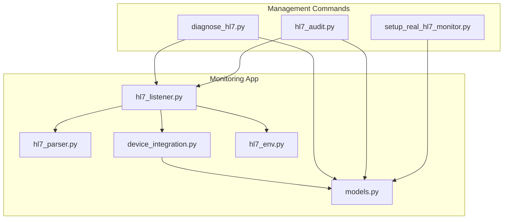
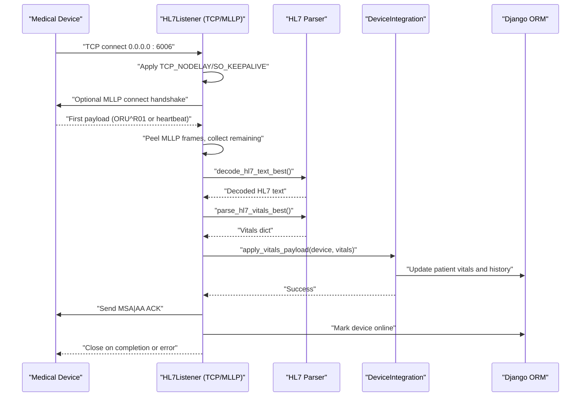
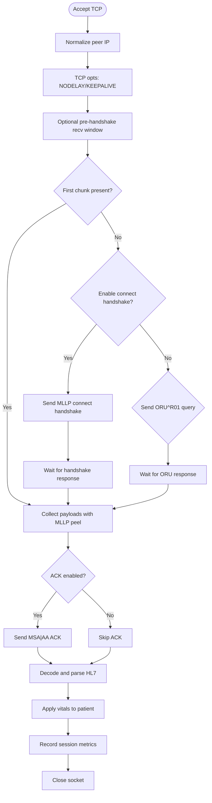
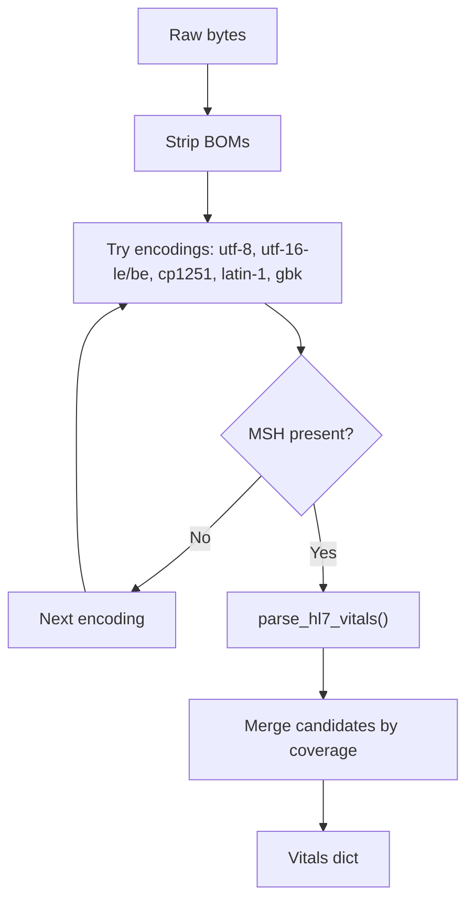
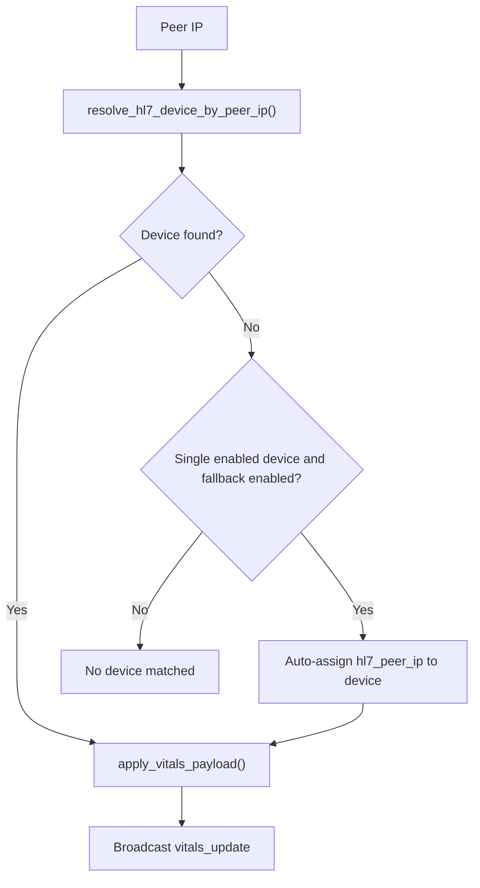
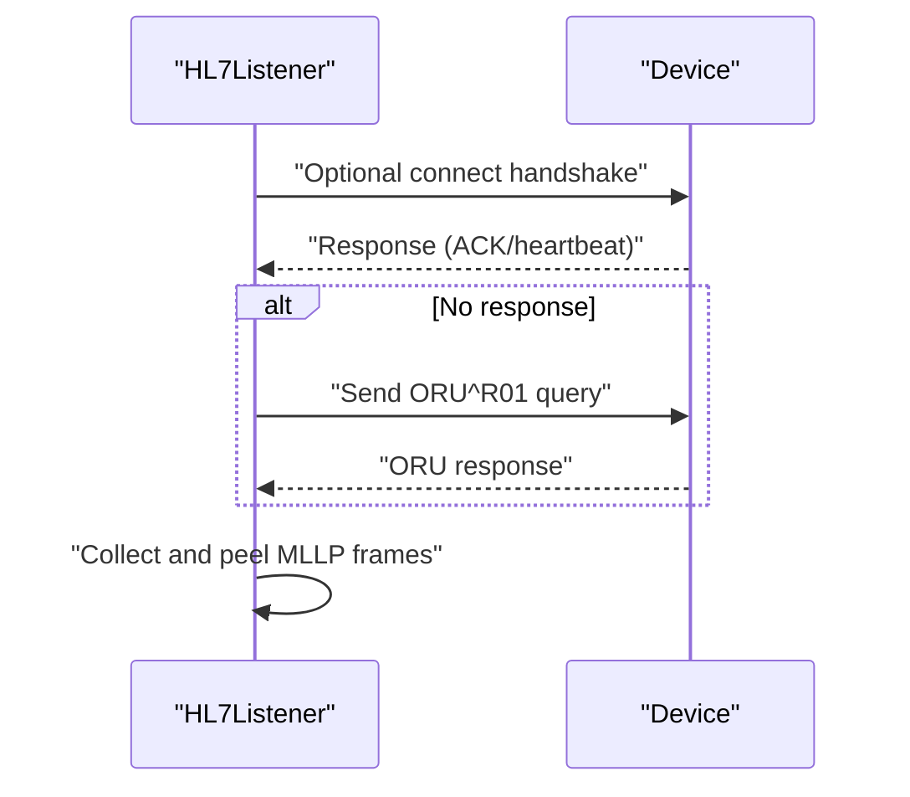
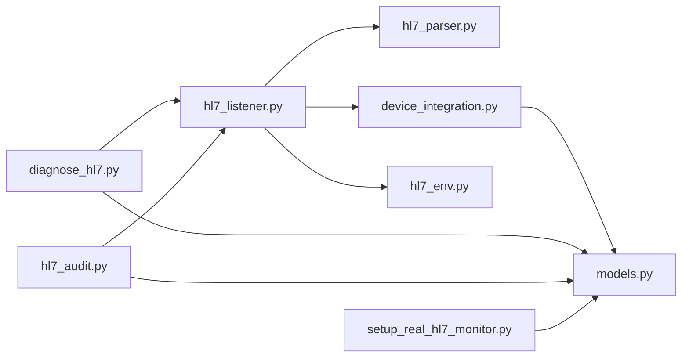

# HL7 Device Communication

<cite>
**Referenced Files in This Document**
- [hl7_listener.py](file://backend/monitoring/hl7_listener.py)
- [hl7_parser.py](file://backend/monitoring/hl7_parser.py)
- [device_integration.py](file://backend/monitoring/device_integration.py)
- [models.py](file://backend/monitoring/models.py)
- [hl7_env.py](file://backend/monitoring/hl7_env.py)
- [diagnose_hl7.py](file://backend/monitoring/management/commands/diagnose_hl7.py)
- [hl7_audit.py](file://backend/monitoring/management/commands/hl7_audit.py)
- [setup_real_hl7_monitor.py](file://backend/monitoring/management/commands/setup_real_hl7_monitor.py)
</cite>

## Table of Contents
1. [Introduction](#introduction)
2. [Project Structure](#project-structure)
3. [Core Components](#core-components)
4. [Architecture Overview](#architecture-overview)
5. [Detailed Component Analysis](#detailed-component-analysis)
6. [Dependency Analysis](#dependency-analysis)
7. [Performance Considerations](#performance-considerations)
8. [Troubleshooting Guide](#troubleshooting-guide)
9. [Conclusion](#conclusion)
10. [Appendices](#appendices)

## Introduction
This document describes the HL7/MLLP device communication system used by the backend. It covers the TCP socket server that listens on port 6006 for medical device connections, the MLLP framing and acknowledgment behavior, HL7 message parsing with multi-encoding support, device discovery and registration, NAT traversal, connection handshake procedures, configuration options, diagnostics, and error handling strategies. It also provides integration workflows and troubleshooting guidance for common connection issues.

## Project Structure
The HL7/MLLP stack is implemented in the monitoring app under backend/monitoring. Key modules include:
- hl7_listener.py: TCP server, MLLP framing, ACK generation, connection lifecycle, and diagnostics
- hl7_parser.py: HL7 message parsing, multi-encoding decoding, and vitals extraction
- device_integration.py: Device resolution by peer IP, vitals application, and broadcasting
- models.py: Device and patient data models used by the integration layer
- hl7_env.py: Diagnostic toggles for raw logs and previews
- Management commands: diagnose_hl7.py, hl7_audit.py, setup_real_hl7_monitor.py for operational diagnostics and setup

**Diagram sources**
- [hl7_listener.py:1-755](file://backend/monitoring/hl7_listener.py#L1-L755)
- [hl7_parser.py:1-530](file://backend/monitoring/hl7_parser.py#L1-L530)
- [device_integration.py:1-232](file://backend/monitoring/device_integration.py#L1-L232)
- [models.py:1-224](file://backend/monitoring/models.py#L1-L224)
- [hl7_env.py:1-33](file://backend/monitoring/hl7_env.py#L1-L33)
- [diagnose_hl7.py:1-182](file://backend/monitoring/management/commands/diagnose_hl7.py#L1-L182)
- [hl7_audit.py:1-99](file://backend/monitoring/management/commands/hl7_audit.py#L1-L99)
- [setup_real_hl7_monitor.py:1-224](file://backend/monitoring/management/commands/setup_real_hl7_monitor.py#L1-L224)

**Section sources**
- [hl7_listener.py:635-755](file://backend/monitoring/hl7_listener.py#L635-L755)
- [hl7_parser.py:487-530](file://backend/monitoring/hl7_parser.py#L487-L530)
- [device_integration.py:31-78](file://backend/monitoring/device_integration.py#L31-L78)
- [models.py:77-140](file://backend/monitoring/models.py#L77-L140)
- [hl7_env.py:1-33](file://backend/monitoring/hl7_env.py#L1-L33)
- [diagnose_hl7.py:1-182](file://backend/monitoring/management/commands/diagnose_hl7.py#L1-L182)
- [hl7_audit.py:1-99](file://backend/monitoring/management/commands/hl7_audit.py#L1-L99)
- [setup_real_hl7_monitor.py:1-224](file://backend/monitoring/management/commands/setup_real_hl7_monitor.py#L1-L224)

## Core Components
- TCP/MLLP Server: Listens on configurable host/port, accepts connections, applies TCP optimizations, performs optional connect handshake, collects payloads, extracts MLLP frames, sends ACK, and invokes HL7 processing.
- HL7 Parser: Decodes raw bytes using UTF-8, UTF-16 (LE/BE), CP1251, Latin-1, GBK heuristics, validates MSH presence, and extracts vitals (HR, SpO2, BP, RR, Temp).
- Device Integration: Resolves devices by peer IP (including NAT fallback), marks devices online, applies vitals to patients, and broadcasts updates.
- Diagnostics and Environment: Provides runtime toggles for raw TCP logging, first-recv hex logging, and raw preview logging; exposes listener status and diagnostic counters.

**Section sources**
- [hl7_listener.py:635-755](file://backend/monitoring/hl7_listener.py#L635-L755)
- [hl7_parser.py:455-530](file://backend/monitoring/hl7_parser.py#L455-L530)
- [device_integration.py:31-78](file://backend/monitoring/device_integration.py#L31-L78)
- [hl7_env.py:18-33](file://backend/monitoring/hl7_env.py#L18-L33)

## Architecture Overview
The HL7/MLLP subsystem consists of:
- A threaded TCP server that binds to a configured host/port and spawns per-connection handlers
- An MLLP-aware receiver that peels frames and supports optional connect handshake and ORU queries
- A parser that decodes HL7 text across multiple encodings and extracts vitals
- A device integration layer that persists vitals, updates patient state, and broadcasts events

**Diagram sources**
- [hl7_listener.py:426-578](file://backend/monitoring/hl7_listener.py#L426-L578)
- [hl7_parser.py:487-530](file://backend/monitoring/hl7_parser.py#L487-L530)
- [device_integration.py:129-224](file://backend/monitoring/device_integration.py#L129-L224)

## Detailed Component Analysis

### TCP Socket Server and MLLP Handling
- Binding and listening: Host/port are configurable via environment variables; the server retries binding on failure and records bind errors in diagnostics.
- Per-connection handler:
  - Normalizes IPv6-mapped IPv4 addresses for matching
  - Applies TCP optimizations (TCP_NODELAY, SO_KEEPALIVE)
  - Optional pre-handshake receive window to accommodate devices that send immediately upon connect
  - Optional connect handshake (MLLP ACK-style header) and ORU query to trigger response from certain monitors
  - Frame extraction: finds MLLP start/end markers and iteratively peels frames
  - Non-MLLP tail detection: if buffer ends mid-message, captures leading MSH segment
  - ACK generation: sends MSA|AA ACK for incoming HL7 messages when enabled
  - Session recording: tracks last payload peer, sizes, and whether ACK was attempted
- Error handling: gracefully handles RST/FIN scenarios and timeouts; logs diagnostic info and continues serving

**Diagram sources**
- [hl7_listener.py:426-578](file://backend/monitoring/hl7_listener.py#L426-L578)

**Section sources**
- [hl7_listener.py:635-755](file://backend/monitoring/hl7_listener.py#L635-L755)
- [hl7_listener.py:286-343](file://backend/monitoring/hl7_listener.py#L286-L343)
- [hl7_listener.py:99-123](file://backend/monitoring/hl7_listener.py#L99-L123)
- [hl7_listener.py:125-148](file://backend/monitoring/hl7_listener.py#L125-L148)
- [hl7_listener.py:187-235](file://backend/monitoring/hl7_listener.py#L187-L235)
- [hl7_listener.py:372-414](file://backend/monitoring/hl7_listener.py#L372-L414)
- [hl7_listener.py:426-578](file://backend/monitoring/hl7_listener.py#L426-L578)

### HL7 Message Parsing and Encodings
- Multi-encoding detection: strips BOMs, tries UTF-8, UTF-16 LE/BE, CP1251, Latin-1, GBK, and falls back to UTF-8 replacement
- Validation: checks for MSH segment presence after decoding
- Vitals extraction: parses OBX segments and extended segments; uses numeric heuristics and regex scans to recover vitals when structured fields are missing
- Fallback strategies: ordered numeric fallback, sequential numeric fallback, and regex-based scanning for HR/SpO2 and NIBP pairs

**Diagram sources**
- [hl7_parser.py:487-530](file://backend/monitoring/hl7_parser.py#L487-L530)

**Section sources**
- [hl7_parser.py:455-485](file://backend/monitoring/hl7_parser.py#L455-L485)
- [hl7_parser.py:423-453](file://backend/monitoring/hl7_parser.py#L423-L453)
- [hl7_parser.py:148-197](file://backend/monitoring/hl7_parser.py#L148-L197)
- [hl7_parser.py:199-258](file://backend/monitoring/hl7_parser.py#L199-L258)
- [hl7_parser.py:278-340](file://backend/monitoring/hl7_parser.py#L278-L340)
- [hl7_parser.py:342-408](file://backend/monitoring/hl7_parser.py#L342-L408)

### Device Discovery, Registration, and NAT Traversal
- Resolution: matches device by hl7_enabled and IP fields (ip_address, local_ip, hl7_peer_ip)
- NAT single-device fallback: when a single enabled device exists and environment allows, auto-associate peer IP to that device
- Loopback exclusion: loopback peers are ignored unless explicitly allowed for HL7 traffic
- Application: updates device online status, applies vitals to patient record, writes history entries, and broadcasts updates

**Diagram sources**
- [device_integration.py:31-78](file://backend/monitoring/device_integration.py#L31-L78)
- [device_integration.py:129-224](file://backend/monitoring/device_integration.py#L129-L224)

**Section sources**
- [device_integration.py:31-78](file://backend/monitoring/device_integration.py#L31-L78)
- [device_integration.py:129-224](file://backend/monitoring/device_integration.py#L129-L224)
- [models.py:77-140](file://backend/monitoring/models.py#L77-L140)

### Connection Handshake and Query Procedures
- Connect handshake: optional MLLP ACK-like header sent before expecting device response
- ORU query: sends an ORU^R01 query to prompt certain monitors to respond with vitals
- Response handling: waits with short timeouts for handshake or ORU responses; proceeds with collected data

**Diagram sources**
- [hl7_listener.py:372-414](file://backend/monitoring/hl7_listener.py#L372-L414)
- [hl7_listener.py:426-578](file://backend/monitoring/hl7_listener.py#L426-L578)

**Section sources**
- [hl7_listener.py:357-414](file://backend/monitoring/hl7_listener.py#L357-L414)
- [hl7_listener.py:426-578](file://backend/monitoring/hl7_listener.py#L426-L578)

### Configuration Options
- Listener control: HL7_LISTEN_ENABLED, HL7_LISTEN_HOST, HL7_LISTEN_PORT
- Timing: HL7_RECV_TIMEOUT_SEC, HL7_RECV_BEFORE_HANDSHAKE_MS
- Behavior toggles: HL7_SEND_ACK, HL7_SEND_CONNECT_HANDSHAKE, HL7_NAT_SINGLE_DEVICE_FALLBACK
- Diagnostics: HL7_DEBUG, HL7_LOG_RAW_TCP_RECV, HL7_LOG_FIRST_RECV_HEX, HL7_LOG_RAW_PREVIEW

**Section sources**
- [hl7_listener.py:692-702](file://backend/monitoring/hl7_listener.py#L692-L702)
- [hl7_listener.py:164-185](file://backend/monitoring/hl7_listener.py#L164-L185)
- [hl7_env.py:18-33](file://backend/monitoring/hl7_env.py#L18-L33)

### Operational Diagnostics and Audits
- Status and bind errors: get_hl7_listener_status(), probe_hl7_tcp_listening()
- Diagnostic counters: get_hl7_diagnostic_summary()
- Management commands:
  - diagnose_hl7.py: comprehensive health check and remediation suggestions
  - hl7_audit.py: prints listener status, diagnostics, and optionally sends a test ORU to localhost
  - setup_real_hl7_monitor.py: creates a real K12 monitor setup with associated bed and patient

**Section sources**
- [hl7_listener.py:723-736](file://backend/monitoring/hl7_listener.py#L723-L736)
- [hl7_listener.py:705-721](file://backend/monitoring/hl7_listener.py#L705-L721)
- [diagnose_hl7.py:1-182](file://backend/monitoring/management/commands/diagnose_hl7.py#L1-L182)
- [hl7_audit.py:1-99](file://backend/monitoring/management/commands/hl7_audit.py#L1-L99)
- [setup_real_hl7_monitor.py:1-224](file://backend/monitoring/management/commands/setup_real_hl7_monitor.py#L1-L224)

## Dependency Analysis
- hl7_listener.py depends on:
  - hl7_parser.py for decoding and parsing
  - device_integration.py for device resolution and vitals application
  - models.py for device/patient persistence
  - hl7_env.py for diagnostic toggles
- Management commands depend on hl7_listener.py status APIs and models for reporting and setup.

**Diagram sources**
- [hl7_listener.py:1-755](file://backend/monitoring/hl7_listener.py#L1-L755)
- [hl7_parser.py:1-530](file://backend/monitoring/hl7_parser.py#L1-L530)
- [device_integration.py:1-232](file://backend/monitoring/device_integration.py#L1-L232)
- [models.py:1-224](file://backend/monitoring/models.py#L1-L224)
- [hl7_env.py:1-33](file://backend/monitoring/hl7_env.py#L1-L33)
- [diagnose_hl7.py:1-182](file://backend/monitoring/management/commands/diagnose_hl7.py#L1-L182)
- [hl7_audit.py:1-99](file://backend/monitoring/management/commands/hl7_audit.py#L1-L99)
- [setup_real_hl7_monitor.py:1-224](file://backend/monitoring/management/commands/setup_real_hl7_monitor.py#L1-L224)

**Section sources**
- [hl7_listener.py:1-755](file://backend/monitoring/hl7_listener.py#L1-L755)
- [hl7_parser.py:1-530](file://backend/monitoring/hl7_parser.py#L1-L530)
- [device_integration.py:1-232](file://backend/monitoring/device_integration.py#L1-L232)
- [models.py:1-224](file://backend/monitoring/models.py#L1-L224)
- [hl7_env.py:1-33](file://backend/monitoring/hl7_env.py#L1-L33)
- [diagnose_hl7.py:1-182](file://backend/monitoring/management/commands/diagnose_hl7.py#L1-L182)
- [hl7_audit.py:1-99](file://backend/monitoring/management/commands/hl7_audit.py#L1-L99)
- [setup_real_hl7_monitor.py:1-224](file://backend/monitoring/management/commands/setup_real_hl7_monitor.py#L1-L224)

## Performance Considerations
- TCP optimizations: disables Nagle’s algorithm and enables keepalive to reduce latency and detect dead peers promptly
- Buffering and streaming: incremental receive with bounded buffer growth and early MSH detection for non-MLLP payloads
- Encoding selection: tries encodings in order of likelihood and merges results to maximize field coverage
- Concurrency: per-connection threads minimize contention; diagnostics and counters avoid shared-state contention with locks

[No sources needed since this section provides general guidance]

## Troubleshooting Guide
Common issues and resolutions:
- No data received (0 bytes): verify device HL7 settings, firewall, and enable connect handshake or adjust pre-handshake window
- MLLP handshake failures: toggle HL7_SEND_CONNECT_HANDSHAKE and confirm device-specific behavior
- Malformed HL7 or mixed encodings: rely on multi-encoding decoder and fallback parsers; review raw previews when enabled
- NAT traversal: set hl7_peer_ip or enable HL7_NAT_SINGLE_DEVICE_FALLBACK for single-device clinics
- Operational checks: use diagnose_hl7.py and hl7_audit.py to inspect listener status, bind errors, and recent sessions

Actionable steps:
- Confirm port 6006 accessibility and firewall rules
- Review diagnostic counters and last payload timestamps
- Enable diagnostic logging selectively via HL7_DEBUG and related toggles
- Use setup_real_hl7_monitor.py to provision a real device and patient for testing

**Section sources**
- [hl7_listener.py:520-541](file://backend/monitoring/hl7_listener.py#L520-L541)
- [diagnose_hl7.py:147-181](file://backend/monitoring/management/commands/diagnose_hl7.py#L147-L181)
- [hl7_audit.py:73-98](file://backend/monitoring/management/commands/hl7_audit.py#L73-L98)
- [setup_real_hl7_monitor.py:154-186](file://backend/monitoring/management/commands/setup_real_hl7_monitor.py#L154-L186)

## Conclusion
The HL7/MLLP subsystem provides robust TCP reception with MLLP framing, flexible device discovery and NAT handling, multi-encoding HL7 parsing, and comprehensive diagnostics. By tuning environment variables and leveraging management commands, operators can integrate diverse monitors, troubleshoot connectivity issues, and maintain reliable vitals ingestion.

[No sources needed since this section summarizes without analyzing specific files]

## Appendices

### Configuration Reference
- HL7_LISTEN_ENABLED: Enable/disable listener
- HL7_LISTEN_HOST: Bind host
- HL7_LISTEN_PORT: Bind port (default 6006)
- HL7_RECV_TIMEOUT_SEC: Receive timeout seconds
- HL7_RECV_BEFORE_HANDSHAKE_MS: Pre-handshake receive window
- HL7_SEND_ACK: Enable/disable ACK sending
- HL7_SEND_CONNECT_HANDSHAKE: Enable connect handshake
- HL7_NAT_SINGLE_DEVICE_FALLBACK: Enable NAT fallback for single device
- HL7_DEBUG: Enable raw TCP/MSH logging
- HL7_LOG_RAW_TCP_RECV: Enable raw TCP recv logging
- HL7_LOG_FIRST_RECV_HEX: Enable first-recv hex logging
- HL7_LOG_RAW_PREVIEW: Enable raw preview logging

**Section sources**
- [hl7_listener.py:692-702](file://backend/monitoring/hl7_listener.py#L692-L702)
- [hl7_listener.py:164-185](file://backend/monitoring/hl7_listener.py#L164-L185)
- [hl7_env.py:18-33](file://backend/monitoring/hl7_env.py#L18-L33)

### Device Model Fields Relevant to HL7
- MonitorDevice: ip_address, local_ip, hl7_peer_ip, hl7_enabled, hl7_port, hl7_connect_handshake, bed, status, last_seen, last_hl7_rx_at_ms
- Patient: vitals fields (hr, spo2, nibp_sys, nibp_dia, rr, temp), history entries, and related metadata

**Section sources**
- [models.py:77-140](file://backend/monitoring/models.py#L77-L140)
- [models.py:141-182](file://backend/monitoring/models.py#L141-L182)