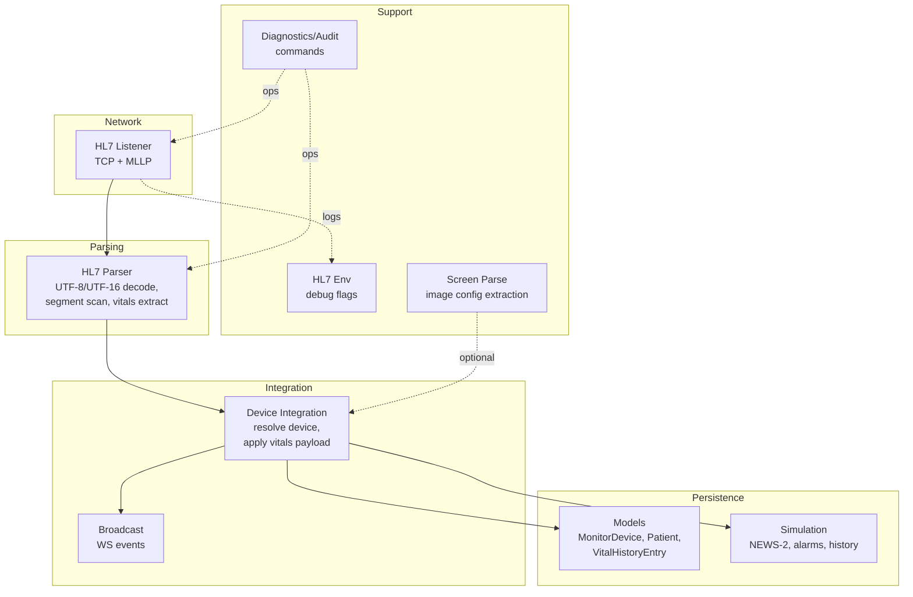
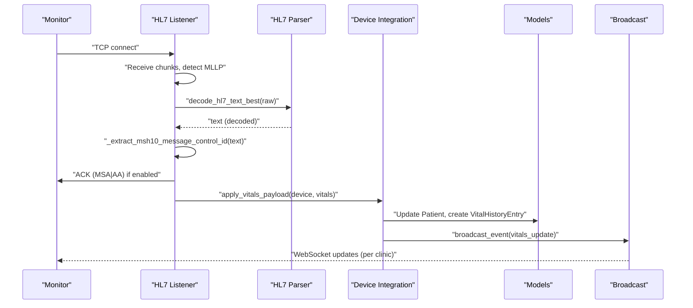
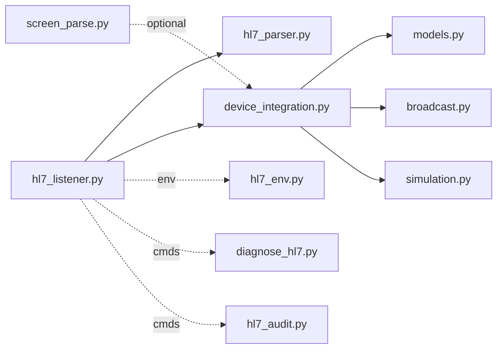

# HL7 Message Parsing

<cite>
**Referenced Files in This Document**
- [hl7_parser.py](file://backend/monitoring/hl7_parser.py)
- [hl7_listener.py](file://backend/monitoring/hl7_listener.py)
- [device_integration.py](file://backend/monitoring/device_integration.py)
- [models.py](file://backend/monitoring/models.py)
- [broadcast.py](file://backend/monitoring/broadcast.py)
- [simulation.py](file://backend/monitoring/simulation.py)
- [screen_parse.py](file://backend/monitoring/screen_parse.py)
- [hl7_env.py](file://backend/monitoring/hl7_env.py)
- [diagnose_hl7.py](file://backend/monitoring/management/commands/diagnose_hl7.py)
- [hl7_audit.py](file://backend/monitoring/management/commands/hl7_audit.py)
</cite>

## Table of Contents
1. [Introduction](#introduction)
2. [Project Structure](#project-structure)
3. [Core Components](#core-components)
4. [Architecture Overview](#architecture-overview)
5. [Detailed Component Analysis](#detailed-component-analysis)
6. [Dependency Analysis](#dependency-analysis)
7. [Performance Considerations](#performance-considerations)
8. [Troubleshooting Guide](#troubleshooting-guide)
9. [Conclusion](#conclusion)
10. [Appendices](#appendices)

## Introduction
This document describes the HL7 message parsing and validation system used to ingest vital signs from bedside monitors. It covers:
- Encoding detection and conversion for UTF-8 and UTF-16
- MSH segment parsing and message control ID extraction
- Segment type identification and diagnostic summaries
- OBX segment processing for vital signs extraction (heart rate, SpO2, temperature, respiratory rate, non-invasive blood pressure)
- Error handling for malformed HL7 messages, encoding issues, and missing segments
- Integration with the vitals extraction pipeline and real-time broadcasting
- Examples of parsing different HL7 message types and validation/data transformation patterns

## Project Structure
The HL7 subsystem spans several modules:
- Listener: TCP socket handling, MLLP framing, ACK generation, and session orchestration
- Parser: HL7 text decoding, segment scanning, and vital extraction
- Device Integration: device resolution, vitals application, and persistence
- Models: database schema for devices, patients, and vitals history
- Broadcast: WebSocket event dispatch per clinic
- Simulation: optional vitals simulation and NEWS-2 scoring
- Screen Parse: optional device configuration extraction from images
- Environment: HL7 debug flags and logging controls
- Management Commands: diagnostics and audits

**Diagram sources**
- [hl7_listener.py:1-755](file://backend/monitoring/hl7_listener.py#L1-L755)
- [hl7_parser.py:1-530](file://backend/monitoring/hl7_parser.py#L1-L530)
- [device_integration.py:1-232](file://backend/monitoring/device_integration.py#L1-L232)
- [models.py:1-224](file://backend/monitoring/models.py#L1-L224)
- [broadcast.py:1-20](file://backend/monitoring/broadcast.py#L1-L20)
- [simulation.py:1-290](file://backend/monitoring/simulation.py#L1-L290)
- [hl7_env.py:1-33](file://backend/monitoring/hl7_env.py#L1-L33)
- [screen_parse.py:1-160](file://backend/monitoring/screen_parse.py#L1-L160)
- [diagnose_hl7.py:1-182](file://backend/monitoring/management/commands/diagnose_hl7.py#L1-L182)
- [hl7_audit.py:1-99](file://backend/monitoring/management/commands/hl7_audit.py#L1-L99)

**Section sources**
- [hl7_listener.py:1-755](file://backend/monitoring/hl7_listener.py#L1-L755)
- [hl7_parser.py:1-530](file://backend/monitoring/hl7_parser.py#L1-L530)
- [device_integration.py:1-232](file://backend/monitoring/device_integration.py#L1-L232)
- [models.py:1-224](file://backend/monitoring/models.py#L1-L224)
- [broadcast.py:1-20](file://backend/monitoring/broadcast.py#L1-L20)
- [simulation.py:1-290](file://backend/monitoring/simulation.py#L1-L290)
- [screen_parse.py:1-160](file://backend/monitoring/screen_parse.py#L1-L160)
- [hl7_env.py:1-33](file://backend/monitoring/hl7_env.py#L1-L33)
- [diagnose_hl7.py:1-182](file://backend/monitoring/management/commands/diagnose_hl7.py#L1-L182)
- [hl7_audit.py:1-99](file://backend/monitoring/management/commands/hl7_audit.py#L1-L99)

## Core Components
- HL7 Listener: Accepts TCP connections, detects MLLP frames, decodes payloads, extracts message control IDs, sends ACKs, and invokes the parser and integrator
- HL7 Parser: Detects and normalizes encodings (UTF-8, UTF-16 LE/BE, CP1251, Latin-1, GBK), scans segments, identifies vital kinds, and extracts numeric values
- Device Integration: Resolves the sending device by peer IP, applies vitals to the patient record, persists history, and broadcasts updates
- Models: Define device, patient, and vitals history schemas; include vitals fields and timestamps
- Broadcast: Sends vitals update events to the appropriate clinic group via WebSockets
- Simulation: Optional periodic vitals updates, NEWS-2 scoring, and alarm logic
- Screen Parse: Extracts HL7 configuration from monitor screenshots (optional)
- HL7 Env: Controls logging and diagnostics via environment flags
- Management Commands: Diagnose connectivity and HL7 ingestion issues; audit listener and device status

**Section sources**
- [hl7_listener.py:1-755](file://backend/monitoring/hl7_listener.py#L1-L755)
- [hl7_parser.py:1-530](file://backend/monitoring/hl7_parser.py#L1-L530)
- [device_integration.py:1-232](file://backend/monitoring/device_integration.py#L1-L232)
- [models.py:1-224](file://backend/monitoring/models.py#L1-L224)
- [broadcast.py:1-20](file://backend/monitoring/broadcast.py#L1-L20)
- [simulation.py:1-290](file://backend/monitoring/simulation.py#L1-L290)
- [screen_parse.py:1-160](file://backend/monitoring/screen_parse.py#L1-L160)
- [hl7_env.py:1-33](file://backend/monitoring/hl7_env.py#L1-L33)
- [diagnose_hl7.py:1-182](file://backend/monitoring/management/commands/diagnose_hl7.py#L1-L182)
- [hl7_audit.py:1-99](file://backend/monitoring/management/commands/hl7_audit.py#L1-L99)

## Architecture Overview
The HL7 ingestion pipeline:
- TCP socket receives raw bytes
- MLLP framing is detected; partial or fragmented payloads are accumulated
- UTF-8/UTF-16/legacy encodings are attempted; MSH presence confirms HL7
- Message control ID is extracted from MSH-10 for ACK
- Parser extracts vitals from OBX and related segments
- Device is resolved by peer IP; vitals applied to patient and persisted
- History entries recorded; broadcast sent to clinic group

**Diagram sources**
- [hl7_listener.py:85-123](file://backend/monitoring/hl7_listener.py#L85-L123)
- [hl7_parser.py:466-529](file://backend/monitoring/hl7_parser.py#L466-L529)
- [device_integration.py:129-224](file://backend/monitoring/device_integration.py#L129-L224)
- [broadcast.py:10-19](file://backend/monitoring/broadcast.py#L10-L19)

**Section sources**
- [hl7_listener.py:426-634](file://backend/monitoring/hl7_listener.py#L426-L634)
- [hl7_parser.py:423-530](file://backend/monitoring/hl7_parser.py#L423-L530)
- [device_integration.py:129-224](file://backend/monitoring/device_integration.py#L129-L224)
- [broadcast.py:10-19](file://backend/monitoring/broadcast.py#L10-L19)

## Detailed Component Analysis

### Encoding Detection and Conversion
- Detection checks for ASCII “MSH|” and UTF-16 variants in raw bytes
- Decoding attempts UTF-8, UTF-16 LE/BE, CP1251, Latin-1, and GBK
- Leading byte order marks are stripped before attempting decode
- For best-effort parsing, multiple encodings are tried and results merged

Key functions:
- [hl7_raw_contains_msh_segment:455-463](file://backend/monitoring/hl7_parser.py#L455-L463)
- [decode_hl7_text_best:466-484](file://backend/monitoring/hl7_parser.py#L466-L484)
- [parse_hl7_vitals_best:487-529](file://backend/monitoring/hl7_parser.py#L487-L529)

Validation and fallback:
- If no encoding yields a valid “MSH|”, the raw bytes are decoded with UTF-8 and logged
- The best-effort merge prioritizes richer results across encodings

**Section sources**
- [hl7_parser.py:455-529](file://backend/monitoring/hl7_parser.py#L455-L529)

### MSH Segment Parsing and Message Control ID Extraction
- The listener locates MSH segments and extracts MSH-10 (message control ID)
- Uses the ID to construct an ACK (MSA|AA) for downstream compatibility
- Supports both MLLP framing and standalone HL7 without MLLP termination

Key functions:
- [_extract_msh10_message_control_id:85-96](file://backend/monitoring/hl7_listener.py#L85-L96)
- [_send_mllp_ack_for_incoming:99-123](file://backend/monitoring/hl7_listener.py#L99-L123)

**Section sources**
- [hl7_listener.py:85-123](file://backend/monitoring/hl7_listener.py#L85-L123)

### Segment Type Identification and Diagnostic Summaries
- The parser can summarize HL7 segment types present in a message for diagnostics
- Useful for identifying missing or unexpected segments

Key functions:
- [hl7_segment_type_summary:410-421](file://backend/monitoring/hl7_parser.py#L410-L421)

**Section sources**
- [hl7_parser.py:410-421](file://backend/monitoring/hl7_parser.py#L410-L421)

### OBX Segment Processing and Vital Signs Extraction
Processing pipeline:
- Scan all lines; only lines starting with OBX are considered
- Extract value from wide range of positions (flexibility for vendor differences)
- Normalize numeric values and units
- Identify vital kind heuristically when OBX-3 is ambiguous
- Support combined NIBP (sys/dia) parsing

Core functions:
- [parse_hl7_vitals:423-452](file://backend/monitoring/hl7_parser.py#L423-L452)
- [_parse_one_obx_line:113-146](file://backend/monitoring/hl7_parser.py#L113-L146)
- [_extract_obx_value:69-82](file://backend/monitoring/hl7_parser.py#L69-L82)
- [_parse_float:85-92](file://backend/monitoring/hl7_parser.py#L85-L92)
- [_classify_obx3:29-66](file://backend/monitoring/hl7_parser.py#L29-L66)
- [_heuristic_kind_from_value:95-110](file://backend/monitoring/hl7_parser.py#L95-L110)

Fallback strategies:
- Ordered fallback: scan all OBX lines in order and assign HR, SpO2, NIBP pairs
- Numeric sequence fallback: scan OBX-5 sequences and heuristic assignment
- Numeric scan across pipe-segment lines (OBX/OBR/NTE/ST/Z*) for OEM variants
- Regex fallback: scan body for HR/SpO2 keywords and NIBP patterns, skipping PHI-like content

Key functions:
- [_fallback_ordered_obx:148-196](file://backend/monitoring/hl7_parser.py#L148-L196)
- [_sequential_obx_numeric_fallback:199-257](file://backend/monitoring/hl7_parser.py#L199-L257)
- [_harvest_obx_numeric_scan:278-339](file://backend/monitoring/hl7_parser.py#L278-L339)
- [_fallback_regex_scan:342-407](file://backend/monitoring/hl7_parser.py#L342-L407)

Unit normalization:
- Numeric values are parsed and rounded to integers or decimals as appropriate
- No explicit unit normalization is performed; values are expected to be in standard units

**Section sources**
- [hl7_parser.py:29-452](file://backend/monitoring/hl7_parser.py#L29-L452)

### Device Resolution, Validation, and Data Application
- Resolve device by peer IP, supporting NAT scenarios and single-device fallback
- Apply vitals payload to the patient record, update NEWS-2 score, and persist history
- Broadcast vitals update to the clinic’s WebSocket group

Key functions:
- [resolve_hl7_device_by_peer_ip:31-78](file://backend/monitoring/device_integration.py#L31-L78)
- [apply_vitals_payload:129-224](file://backend/monitoring/device_integration.py#L129-L224)
- [broadcast_event:10-19](file://backend/monitoring/broadcast.py#L10-L19)

Validation rules:
- Requires at least one vital key present
- Device must have a bed assigned and a patient admitted to that bed
- Updates last seen timestamps and device status

**Section sources**
- [device_integration.py:31-224](file://backend/monitoring/device_integration.py#L31-L224)
- [broadcast.py:10-19](file://backend/monitoring/broadcast.py#L10-L19)

### Data Models for HL7 Integration
- MonitorDevice: device identity, networking info, HL7 enablement, peer IP, and status
- Patient: current vitals, NEWS-2 score, alarms, and history entries
- VitalHistoryEntry: time-series of vitals for historical analysis

Key fields:
- MonitorDevice: ip_address, local_ip, hl7_enabled, hl7_port, server_target_ip, hl7_peer_ip, bed, status, last_seen, last_hl7_rx_at_ms
- Patient: hr, spo2, nibp_sys, nibp_dia, rr, temp, nibp_time, alarm_level, alarm_message, alarm_patient_id, alarm_limits, news2_score, ai_risk, bed
- VitalHistoryEntry: patient, timestamp, hr, spo2, nibp_sys, nibp_dia

**Section sources**
- [models.py:77-224](file://backend/monitoring/models.py#L77-L224)

### Integration with Vitals Extraction and Error Reporting
- The listener orchestrates decoding, ACK, parsing, and application
- Errors are logged with actionable context (missing device, empty payload, encoding issues)
- Optional diagnostics and audit commands assist in troubleshooting

Key functions:
- [_process_hl7_text:580-633](file://backend/monitoring/hl7_listener.py#L580-L633)
- [diagnose_hl7.py:1-182](file://backend/monitoring/management/commands/diagnose_hl7.py#L1-L182)
- [hl7_audit.py:1-99](file://backend/monitoring/management/commands/hl7_audit.py#L1-L99)

**Section sources**
- [hl7_listener.py:580-633](file://backend/monitoring/hl7_listener.py#L580-L633)
- [diagnose_hl7.py:1-182](file://backend/monitoring/management/commands/diagnose_hl7.py#L1-L182)
- [hl7_audit.py:1-99](file://backend/monitoring/management/commands/hl7_audit.py#L1-L99)

## Dependency Analysis

**Diagram sources**
- [hl7_listener.py:1-755](file://backend/monitoring/hl7_listener.py#L1-L755)
- [hl7_parser.py:1-530](file://backend/monitoring/hl7_parser.py#L1-L530)
- [device_integration.py:1-232](file://backend/monitoring/device_integration.py#L1-L232)
- [models.py:1-224](file://backend/monitoring/models.py#L1-L224)
- [broadcast.py:1-20](file://backend/monitoring/broadcast.py#L1-L20)
- [simulation.py:1-290](file://backend/monitoring/simulation.py#L1-L290)
- [screen_parse.py:1-160](file://backend/monitoring/screen_parse.py#L1-L160)
- [hl7_env.py:1-33](file://backend/monitoring/hl7_env.py#L1-L33)
- [diagnose_hl7.py:1-182](file://backend/monitoring/management/commands/diagnose_hl7.py#L1-L182)
- [hl7_audit.py:1-99](file://backend/monitoring/management/commands/hl7_audit.py#L1-L99)

**Section sources**
- [hl7_listener.py:1-755](file://backend/monitoring/hl7_listener.py#L1-L755)
- [hl7_parser.py:1-530](file://backend/monitoring/hl7_parser.py#L1-L530)
- [device_integration.py:1-232](file://backend/monitoring/device_integration.py#L1-L232)
- [models.py:1-224](file://backend/monitoring/models.py#L1-L224)
- [broadcast.py:1-20](file://backend/monitoring/broadcast.py#L1-L20)
- [simulation.py:1-290](file://backend/monitoring/simulation.py#L1-L290)
- [screen_parse.py:1-160](file://backend/monitoring/screen_parse.py#L1-L160)
- [hl7_env.py:1-33](file://backend/monitoring/hl7_env.py#L1-L33)
- [diagnose_hl7.py:1-182](file://backend/monitoring/management/commands/diagnose_hl7.py#L1-L182)
- [hl7_audit.py:1-99](file://backend/monitoring/management/commands/hl7_audit.py#L1-L99)

## Performance Considerations
- Decoding tries multiple encodings; early exit on “MSH|” reduces wasted effort
- Fallback strategies progressively increase scanning scope; keep payloads reasonably sized
- ACK sending is conditional and short-circuits when not applicable
- Broadcasting is per clinic group to avoid cross-clinic noise
- Simulation runs on a fixed tick interval; history pruning caps stored entries

[No sources needed since this section provides general guidance]

## Troubleshooting Guide
Common issues and resolutions:
- No HL7 payload detected: verify firewall, port 6006, and monitor configuration; use audit command to simulate ORU locally
- Empty sessions or zero-byte connections: check handshake settings and monitor behavior
- Encoding problems: confirm UTF-8/UTF-16 availability; the parser attempts multiple encodings
- Missing device or patient: ensure device is configured with correct IPs, bed is assigned, and a patient is admitted
- ACK not sent: review HL7_SEND_ACK flag and monitor expectations

Diagnostic tools:
- [diagnose_hl7.py:1-182](file://backend/monitoring/management/commands/diagnose_hl7.py#L1-L182)
- [hl7_audit.py:1-99](file://backend/monitoring/management/commands/hl7_audit.py#L1-L99)
- [hl7_env.py:1-33](file://backend/monitoring/hl7_env.py#L1-L33)

**Section sources**
- [diagnose_hl7.py:1-182](file://backend/monitoring/management/commands/diagnose_hl7.py#L1-L182)
- [hl7_audit.py:1-99](file://backend/monitoring/management/commands/hl7_audit.py#L1-L99)
- [hl7_env.py:1-33](file://backend/monitoring/hl7_env.py#L1-L33)

## Conclusion
The HL7 ingestion system robustly handles diverse monitor vendors and encodings, extracts vitals with multiple fallback strategies, validates device and patient contexts, and integrates seamlessly with real-time alerts and history. Operational commands and environment flags provide strong observability and troubleshooting capabilities.

[No sources needed since this section summarizes without analyzing specific files]

## Appendices

### Example Parsing Scenarios
- Standard ORU^R01 with OBX segments containing heart rate, SpO2, temperature, respiratory rate, and NIBP
- OEM variants with OBR/NTE/ST/Z* segments carrying numeric values
- Mixed encodings within a single message; best-effort decoding merges results
- Missing OBX-3 identifiers; numeric heuristics infer vital kinds

**Section sources**
- [hl7_parser.py:148-407](file://backend/monitoring/hl7_parser.py#L148-L407)
- [hl7_listener.py:580-633](file://backend/monitoring/hl7_listener.py#L580-L633)

### Validation Rules and Data Transformation Patterns
- Required fields: at least one vital must be present
- Device constraints: hl7_enabled, bed assigned, patient admitted
- Data transformations: rounding to integer for counts, floating for temperature
- History retention: capped at a fixed number of entries

**Section sources**
- [device_integration.py:129-224](file://backend/monitoring/device_integration.py#L129-L224)
- [models.py:141-224](file://backend/monitoring/models.py#L141-L224)